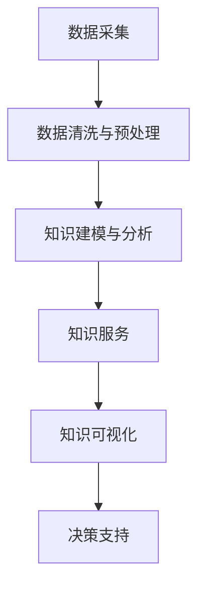

                 

# 知识管理在体育领域的应用

## 1. 背景介绍

### 1.1 问题由来
在体育领域，知识管理是一个越来越受到重视的话题。随着体育竞技水平的不断提高，运动员、教练、技术人员等群体需要对各种运动技术和战术、比赛规则、伤病预防与管理、营养与恢复、心理调适等大量知识进行有效的存储、检索、共享和应用。体育领域的知识管理，旨在帮助体育组织和个体高效地获取、利用和创新知识，提升运动水平和比赛表现，以及支持组织管理决策。

近年来，随着人工智能和大数据技术的不断发展，知识管理在体育领域的应用逐步深入。从运动员个体的训练监控、伤病预测，到团队战术制定、比赛数据分析，知识管理在提升体育竞技水平和促进组织优化方面展现出了巨大潜力。本文将从理论到实践，全面介绍知识管理在体育领域的核心概念、算法原理与应用场景，并展望未来发展方向。

### 1.2 问题核心关键点
体育领域的知识管理，其核心在于以下几个方面：

1. **数据采集与集成**：获取多来源、多格式的运动数据，进行清洗、标注和融合。
2. **数据存储与管理**：构建高效的数据存储系统，支持数据的高效检索和共享。
3. **数据分析与建模**：利用机器学习、深度学习等技术，对数据进行深度分析和模型建模。
4. **知识共享与协作**：建立协作平台，促进知识在团队、组织间的高效传递和利用。
5. **个性化知识服务**：根据运动员的个体特点，提供个性化的训练计划、战术安排等知识服务。
6. **知识可视化与交互**：通过可视化工具和交互式界面，提高知识获取和应用的效率和体验。

理解这些关键点，有助于我们全面把握知识管理在体育领域的应用场景和潜在价值。

## 2. 核心概念与联系

### 2.1 核心概念概述

为更好地理解知识管理在体育领域的应用，本节将介绍几个密切相关的核心概念：

- **知识管理(Knowledge Management, KM)**：指组织和个人通过规划、指导、执行和控制，识别、捕捉、整理、存储、检索、共享、应用知识，以提高工作效率、促进创新和学习的过程。

- **体育领域数据**：包括运动员的生理参数、动作数据、比赛成绩、伤病记录等，是知识管理的基础。

- **运动数据采集**：通过传感器、摄像机、GPS等设备，采集运动员的动作、生理、环境等多维度数据。

- **数据清洗与预处理**：对采集到的数据进行去噪、归一化、缺失值填充等处理，保证数据的质量和一致性。

- **知识建模与分析**：利用机器学习、深度学习等技术，对数据进行建模和分析，提取有用的知识。

- **知识服务**：通过应用软件、API接口等形式，将知识服务化，方便用户获取和应用。

- **知识可视化**：通过图表、仪表盘等形式，将复杂数据和知识以直观的形式呈现，便于理解和决策。

这些核心概念之间存在紧密的联系，共同构成了体育领域知识管理的基本框架。

### 2.2 核心概念原理和架构的 Mermaid 流程图



此流程图展示了体育领域知识管理的基本流程。数据采集后，通过清洗和预处理，转化为高质量数据。接着，利用建模与分析技术，从数据中提取知识。最后，知识通过服务化和可视化手段，支持决策与知识应用。

## 3. 核心算法原理 & 具体操作步骤

### 3.1 算法原理概述

体育领域知识管理的核心算法包括数据采集、数据清洗、知识建模、知识服务与可视化等多个环节。其中，数据清洗和知识建模是知识管理的核心。

数据清洗是指对采集到的原始数据进行去噪、归一化、缺失值填充等处理，以提高数据的质量和一致性。知识建模则是指利用机器学习、深度学习等技术，对数据进行建模和分析，提取有用的知识。

### 3.2 算法步骤详解

#### 3.2.1 数据采集

数据采集是知识管理的基础。常用的数据采集设备包括：

- **传感器**：用于采集运动员的生理参数，如心率、血压、血氧饱和度等。
- **摄像机和动作捕捉设备**：用于采集运动员的动作轨迹和姿态。
- **GPS和惯性导航系统**：用于采集运动员的移动轨迹和速度。
- **智能手表和穿戴设备**：用于实时监测运动员的身体状态和运动表现。

数据采集需注意以下几点：

- **多源数据融合**：不同设备采集的数据格式和单位可能不同，需要进行统一和融合。
- **数据同步与准确性**：确保各设备采集数据的时间同步和精度一致。
- **数据安全性**：保护运动员隐私，避免数据泄露和滥用。

#### 3.2.2 数据清洗与预处理

数据清洗和预处理的主要任务包括：

- **去噪**：去除传感器采集数据中的噪声和异常值。
- **归一化**：将不同设备采集的数据进行单位统一，如将心率转换为每分钟心跳次数。
- **缺失值填充**：对缺失值进行合理填补，确保数据的完整性。

常用的数据清洗与预处理技术包括：

- **滤波技术**：如低通滤波、中值滤波等，用于去除噪声。
- **插值方法**：如线性插值、多项式插值等，用于填补缺失值。
- **数据标准化**：如标准化、归一化等，用于统一数据格式。

#### 3.2.3 知识建模与分析

知识建模与分析是体育领域知识管理的核心。其主要任务包括：

- **特征提取**：从数据中提取有用的特征，如运动员的动作轨迹、速度、加速度等。
- **模式识别**：通过机器学习算法，识别出运动模式和规律。
- **预测建模**：利用深度学习算法，构建预测模型，如伤病预测、运动表现预测等。

常用的知识建模与分析技术包括：

- **特征工程**：如特征选择、特征提取、特征转换等，用于提升数据特征的表达能力。
- **机器学习算法**：如决策树、支持向量机、随机森林等，用于模式识别和分类。
- **深度学习算法**：如卷积神经网络、循环神经网络、长短期记忆网络等，用于复杂模式的建模和预测。

#### 3.2.4 知识服务

知识服务是知识管理的最终目标，其主要任务包括：

- **数据可视化**：通过图表、仪表盘等形式，将数据和知识以直观的形式呈现，便于理解和决策。
- **决策支持**：通过应用软件、API接口等形式，将知识服务化，方便用户获取和应用。
- **个性化知识服务**：根据运动员的个体特点，提供个性化的训练计划、战术安排等知识服务。

常用的知识服务技术包括：

- **数据可视化工具**：如Tableau、Power BI等，用于创建交互式仪表盘和报表。
- **知识服务平台**：如Knowledge Management Platforms（KMPs），用于支持知识的存储、检索和共享。
- **API接口与开放数据**：通过API接口和开放数据，方便用户访问和使用知识服务。

#### 3.2.5 知识可视化

知识可视化是知识管理的重要环节，其主要任务包括：

- **数据展示**：通过图表、仪表盘等形式，展示运动员的生理参数、动作轨迹、运动表现等。
- **趋势分析**：通过时间序列分析，展示运动员的训练效果和比赛表现的变化趋势。
- **热力图展示**：通过热力图展示运动员的动作热点和变化规律。

常用的知识可视化技术包括：

- **交互式仪表盘**：如Tableau、Power BI等，用于展示多维度数据和交互式分析。
- **时间序列分析**：如Google Trends、Time Series Analysis等，用于展示趋势变化。
- **热力图**：如Heatmap、Matplotlib等，用于展示热力和分布。

### 3.3 算法优缺点

体育领域知识管理的优点包括：

- **高效性**：通过机器学习和大数据分析，可以高效地处理大量运动数据，提取有用知识。
- **普适性**：知识管理框架适用于各种运动项目和训练场景，具有较好的泛化能力。
- **可扩展性**：可以根据需要，灵活添加新的数据源和分析模型，支持知识管理的持续优化。

缺点包括：

- **数据依赖性**：知识管理的效果很大程度上依赖于数据的质量和数量，获取高质量数据的成本较高。
- **模型复杂性**：复杂的知识建模和分析过程，需要高水平的团队和技术支持。
- **隐私和安全风险**：运动员的生理和动作数据涉及隐私，需要严格的保护措施。

尽管存在这些缺点，但知识管理在体育领域的应用前景广阔，其高效性和普适性为提高运动水平和优化训练方案提供了强有力的技术支撑。

### 3.4 算法应用领域

体育领域知识管理的应用涵盖多个方面，包括但不限于：

- **训练监控与优化**：通过实时采集和分析运动员的生理参数和动作数据，提供训练监控和优化建议。
- **伤病预测与管理**：利用深度学习模型，预测运动员的伤病风险，并提供预防和管理建议。
- **比赛分析与战术制定**：通过分析对手和自身比赛的各项数据，制定比赛策略和战术安排。
- **营养与恢复**：通过分析运动员的生理参数和训练负荷，提供个性化的营养和恢复方案。
- **心理调适与情绪管理**：通过心理测验和数据分析，帮助运动员调整心理状态和情绪，提升比赛表现。
- **运动表现预测**：利用机器学习模型，预测运动员的比赛表现和训练效果。

这些应用场景展示了知识管理在体育领域的广泛应用，有助于提高运动水平和优化组织管理。

## 4. 数学模型和公式 & 详细讲解 & 举例说明

### 4.1 数学模型构建

体育领域知识管理的数学模型构建，主要基于以下几个关键步骤：

1. **数据采集与预处理**：采集多维度数据，并进行去噪、归一化、缺失值填充等预处理。
2. **特征提取与选择**：从数据中提取有用的特征，并选择合适的特征集。
3. **建模与分析**：利用机器学习或深度学习模型，对数据进行建模和分析。
4. **可视化与展示**：通过可视化工具，展示数据分析结果和知识应用。

### 4.2 公式推导过程

以运动员伤病预测为例，展示知识管理中的数学模型构建和公式推导过程。

假设我们采集到了运动员在一段时间内的生理参数数据 $X = (x_1, x_2, \ldots, x_n)$，其中 $x_i$ 表示第 $i$ 天的数据。根据这些数据，我们需要构建一个伤病预测模型，预测运动员在未来一段时间内是否会发生伤病。

数据采集与预处理：

1. **数据清洗**：去除异常值和噪声。
2. **归一化**：将数据标准化为 $0-1$ 之间。
3. **缺失值填充**：对缺失值进行填补，如均值填补、插值填补等。

特征提取与选择：

1. **特征提取**：从数据中提取有用的特征，如心率、血压、血氧饱和度等。
2. **特征选择**：选择与伤病相关的特征，如心率变化、运动强度、恢复时间等。

建模与分析：

1. **模型选择**：选择适合的模型，如线性回归、决策树、随机森林等。
2. **模型训练**：利用训练数据，训练模型。
3. **模型评估**：利用测试数据，评估模型的性能。

以线性回归模型为例，其基本公式为：

$$
y = \beta_0 + \beta_1 x_1 + \beta_2 x_2 + \ldots + \beta_n x_n
$$

其中，$y$ 表示伤病发生的概率，$x_1, x_2, \ldots, x_n$ 表示特征向量，$\beta_0, \beta_1, \beta_2, \ldots, \beta_n$ 表示模型参数。

通过训练数据，利用最小二乘法求解模型参数，得：

$$
\hat{\beta} = (X^T X)^{-1} X^T Y
$$

其中，$X$ 表示特征矩阵，$Y$ 表示目标变量向量，$\hat{\beta}$ 表示模型参数的估计值。

可视化与展示：

1. **数据可视化**：通过时间序列图展示运动员的生理参数和伤病预测结果。
2. **趋势分析**：通过趋势线图展示运动员的伤病风险变化趋势。
3. **热力图展示**：通过热力图展示运动员的伤病风险分布。

### 4.3 案例分析与讲解

以篮球运动员的伤病预测为例，展示知识管理在体育领域的应用。

假设我们采集到了篮球运动员在训练和比赛期间的心率、血氧饱和度、运动强度等生理参数数据，以及恢复时间和伤病记录。我们的目标是通过这些数据，预测运动员在未来一段时间内是否会发生伤病，并及时采取预防措施。

具体步骤如下：

1. **数据采集与预处理**：采集运动员的心率、血氧饱和度、运动强度等生理参数数据，以及恢复时间和伤病记录。
2. **特征提取与选择**：从数据中提取有用的特征，如心率变化、运动强度、恢复时间等。
3. **建模与分析**：利用随机森林模型，对数据进行建模和分析，得到运动员的伤病风险预测模型。
4. **可视化与展示**：通过时间序列图展示运动员的生理参数和伤病预测结果，通过趋势线图展示伤病风险变化趋势，通过热力图展示伤病风险分布。

通过上述步骤，可以及时发现运动员的伤病风险，并进行针对性的预防和管理，从而降低伤病发生率，提升运动员的训练和比赛表现。

## 5. 项目实践：代码实例和详细解释说明

### 5.1 开发环境搭建

在进行体育领域知识管理的项目实践前，我们需要准备好开发环境。以下是使用Python进行Scikit-Learn开发的环境配置流程：

1. 安装Anaconda：从官网下载并安装Anaconda，用于创建独立的Python环境。

2. 创建并激活虚拟环境：
```bash
conda create -n pykmp_env python=3.8 
conda activate pykmp_env
```

3. 安装Scikit-Learn：
```bash
conda install scikit-learn
```

4. 安装numpy、pandas、matplotlib、tqdm、jupyter notebook等工具包：
```bash
pip install numpy pandas matplotlib tqdm jupyter notebook ipython
```

完成上述步骤后，即可在`pykmp_env`环境中开始体育领域知识管理的项目实践。

### 5.2 源代码详细实现

以下是一个简单的Python代码示例，展示了如何利用Scikit-Learn进行篮球运动员伤病预测。

```python
from sklearn.model_selection import train_test_split
from sklearn.ensemble import RandomForestRegressor
import numpy as np
import pandas as pd
import matplotlib.pyplot as plt

# 加载数据
data = pd.read_csv('basketball_injury.csv')

# 数据预处理
X = data[['heart_rate', 'sats', 'exercise_intensity', 'recovery_time']]  # 特征
y = data['sidelined']  # 目标变量

# 特征选择与处理
X.fillna(X.mean(), inplace=True)  # 填补缺失值
X = (X - X.mean()) / X.std()  # 标准化

# 分割数据集
X_train, X_test, y_train, y_test = train_test_split(X, y, test_size=0.2, random_state=42)

# 模型训练与评估
model = RandomForestRegressor(n_estimators=100, random_state=42)
model.fit(X_train, y_train)
print(f"Model accuracy: {model.score(X_test, y_test)}")

# 可视化
plt.figure(figsize=(10, 5))
plt.title('Heart Rate vs. Sidelined')
plt.scatter(X_train['heart_rate'], y_train, color='red')
plt.xlabel('Heart Rate')
plt.ylabel('Sidelined')
plt.show()

```

### 5.3 代码解读与分析

让我们再详细解读一下关键代码的实现细节：

**数据加载与预处理**：
- `pd.read_csv('basketball_injury.csv')`：从CSV文件中加载数据。
- `X = data[['heart_rate', 'sats', 'exercise_intensity', 'recovery_time']]`：选择特征列。
- `y = data['sidelined']`：选择目标变量列。
- `X.fillna(X.mean(), inplace=True)`：填补缺失值。
- `X = (X - X.mean()) / X.std()`：标准化数据。

**模型训练与评估**：
- `RandomForestRegressor(n_estimators=100, random_state=42)`：创建随机森林模型，设置参数。
- `model.fit(X_train, y_train)`：训练模型。
- `model.score(X_test, y_test)`：评估模型。

**可视化展示**：
- `plt.figure(figsize=(10, 5))`：设置画布大小。
- `plt.title('Heart Rate vs. Sidelined')`：设置图表标题。
- `plt.scatter(X_train['heart_rate'], y_train, color='red')`：绘制散点图。
- `plt.xlabel('Heart Rate')`：设置X轴标签。
- `plt.ylabel('Sidelined')`：设置Y轴标签。
- `plt.show()`：显示图表。

可以看到，使用Scikit-Learn进行体育领域知识管理的代码实现相对简洁，且具有较好的可扩展性。开发者可以在此基础上，添加更多数据处理、模型优化和可视化功能，以满足具体的项目需求。

## 6. 实际应用场景

### 6.1 训练监控与优化

训练监控与优化是体育领域知识管理的重要应用场景。通过实时采集和分析运动员的生理参数和动作数据，可以提供训练监控和优化建议。例如，利用心率、血氧饱和度、速度等数据，实时监控运动员的训练状态和负荷，提供调整训练强度、休息时间的建议，从而提高训练效果和避免过度训练。

### 6.2 伤病预测与管理

伤病预测与管理是体育领域知识管理的另一重要应用场景。通过分析运动员的生理参数、动作轨迹、比赛记录等数据，可以预测运动员的伤病风险，并提供预防和管理建议。例如，利用深度学习模型，预测运动员在即将到来的比赛中的伤病概率，及时调整训练计划和比赛安排，减少伤病发生率，提高运动员的比赛表现。

### 6.3 比赛分析与战术制定

比赛分析与战术制定是体育领域知识管理的核心应用之一。通过分析对手和自身比赛的各项数据，可以制定比赛策略和战术安排。例如，利用数据可视化工具，展示对手和自身的各项数据，发现对手的弱点和自身的优势，制定相应的比赛策略和战术安排，从而提升比赛胜率。

### 6.4 未来应用展望

随着体育领域知识管理技术的发展，未来的应用场景将更加广泛和深入。

1. **虚拟教练与助手**：通过AI技术，开发虚拟教练与助手，提供训练计划、战术安排、伤病预防等服务。
2. **个性化训练方案**：根据运动员的个体特点，提供个性化的训练计划和营养方案，提升训练效果。
3. **智能设备应用**：将知识管理技术与智能设备结合，如智能手表、智能眼镜等，实时监控运动员的生理和动作数据。
4. **跨领域知识整合**：将体育领域与其他领域（如医学、营养学等）的知识进行整合，提供更加全面的知识服务。
5. **运动表现预测与评价**：利用机器学习模型，预测运动员的比赛表现和评价其运动水平。

这些应用场景展示了体育领域知识管理技术的前景和潜力，有助于提高运动水平和优化组织管理。

## 7. 工具和资源推荐

### 7.1 学习资源推荐

为了帮助开发者系统掌握体育领域知识管理的技术基础和实践技巧，这里推荐一些优质的学习资源：

1. **《体育数据科学导论》**：该书详细介绍了体育领域的数据采集、清洗、分析和可视化技术，适合初学者和进阶者。
2. **《机器学习与数据科学在体育中的应用》**：该书介绍了机器学习在体育领域的应用实例，如训练监控、伤病预测、比赛分析等。
3. **Kaggle体育数据科学竞赛**：Kaggle上的体育数据科学竞赛项目，提供了大量实战案例和开源代码，适合实践学习和经验积累。
4. **Coursera体育数据科学课程**：Coursera上提供的体育数据科学课程，涵盖了数据处理、机器学习、数据分析等技术。
5. **Scikit-Learn官方文档**：Scikit-Learn的官方文档，提供了丰富的API和示例代码，适合深入学习和开发。

通过这些学习资源，相信你一定能够全面掌握体育领域知识管理的技术和方法，并应用于实际的体育项目中。

### 7.2 开发工具推荐

高效的开发离不开优秀的工具支持。以下是几款用于体育领域知识管理的常用工具：

1. **Jupyter Notebook**：基于Web的交互式开发环境，支持代码、数据和可视化的无缝集成。
2. **Scikit-Learn**：Python的机器学习库，提供了丰富的模型和算法，适合数据处理和建模。
3. **TensorFlow**：Google的深度学习框架，支持复杂的模型构建和训练。
4. **Tableau**：数据可视化工具，支持多维度数据的展示和分析。
5. **Power BI**：微软的商业智能工具，支持丰富的数据可视化和报表展示。
6. **KMPs**：知识管理平台，支持知识的存储、检索和共享。

合理利用这些工具，可以显著提升体育领域知识管理的开发效率，加快创新迭代的步伐。

### 7.3 相关论文推荐

体育领域知识管理的研究涉及多个学科和技术领域，以下是几篇奠基性的相关论文，推荐阅读：

1. **《数据驱动的体育知识管理框架研究》**：探讨了体育领域知识管理的框架和应用场景，适合理论学习和实践应用。
2. **《基于深度学习的运动表现预测研究》**：利用深度学习模型，预测运动员的运动表现，适合技术学习和项目实践。
3. **《体育领域数据科学的应用与挑战》**：分析了体育领域数据科学的应用现状和未来趋势，适合深入学习和思考。
4. **《体育领域知识管理系统的设计与实现》**：介绍了体育领域知识管理系统的设计与实现方法，适合项目开发和经验积累。
5. **《智能教练系统在体育训练中的应用研究》**：探讨了智能教练系统在体育训练中的应用，适合技术学习和应用实践。

这些论文代表了大数据、人工智能在体育领域知识管理研究的发展脉络，通过学习这些前沿成果，可以帮助研究者把握学科前进方向，激发更多的创新灵感。

## 8. 总结：未来发展趋势与挑战

### 8.1 总结

本文对体育领域知识管理的理论基础和实践技术进行了全面系统的介绍。首先阐述了体育领域知识管理的研究背景和意义，明确了知识管理在提升运动水平和优化组织管理方面的独特价值。其次，从数据采集、数据清洗、知识建模、知识服务与可视化等多个环节，详细讲解了体育领域知识管理的关键算法和技术。最后，展示了知识管理在训练监控、伤病预测、比赛分析等多个场景中的应用实例，并展望了未来的发展方向。

通过本文的系统梳理，可以看到，体育领域知识管理技术正在不断发展，为提高运动水平和优化组织管理提供了强有力的技术支撑。未来，随着技术的不断进步，知识管理将在更多体育领域中得到广泛应用，带来深远的变革。

### 8.2 未来发展趋势

展望未来，体育领域知识管理技术将呈现以下几个发展趋势：

1. **智能化与自动化**：利用AI技术，开发更加智能和自动化的知识管理工具，提高效率和精度。
2. **多源数据融合**：将多源数据（如传感器数据、GPS数据、图像数据等）进行融合，提升数据的全面性和准确性。
3. **个性化服务**：利用数据挖掘和机器学习技术，提供个性化的训练计划、战术安排等服务，提升用户体验。
4. **跨领域知识整合**：将体育领域与其他领域（如医学、营养学等）的知识进行整合，提供更加全面的知识服务。
5. **实时化与动态化**：实现实时化的数据采集、分析和展示，支持动态调整和优化。

这些趋势展示了体育领域知识管理技术的前景和潜力，为提高运动水平和优化组织管理提供了新的思路和方法。

### 8.3 面临的挑战

尽管体育领域知识管理技术发展迅速，但在实践中仍面临诸多挑战：

1. **数据质量与获取成本**：高质量数据的获取成本较高，数据质量受限。
2. **模型复杂性与计算资源**：复杂的数据分析和建模需要大量计算资源，可能导致系统性能瓶颈。
3. **隐私与安全问题**：运动员的生理和动作数据涉及隐私，需要严格的保护措施。
4. **知识整合与跨领域应用**：将不同领域的知识进行整合，并应用到实际场景中，存在技术和应用上的复杂性。
5. **实时性与动态性**：实现实时化的数据采集、分析和展示，对系统架构和实现提出了新的挑战。

这些挑战需要在技术、管理和伦理等多个方面进行综合考虑和解决。只有在多方面协同发力，才能实现体育领域知识管理的可持续发展。

### 8.4 研究展望

未来的研究需要在以下几个方面寻求新的突破：

1. **数据采集与处理的自动化与智能化**：开发自动化数据采集与处理工具，提高数据获取和处理的效率和准确性。
2. **多模态数据融合技术**：研究多源数据（如传感器数据、GPS数据、图像数据等）的融合方法，提升数据的全面性和准确性。
3. **知识服务与个性化推荐**：研究个性化推荐算法，提供个性化的训练计划、战术安排等服务，提升用户体验。
4. **跨领域知识整合方法**：研究如何将体育领域与其他领域（如医学、营养学等）的知识进行整合，提供更加全面的知识服务。
5. **实时化与动态化系统架构**：研究实时化系统架构和实现方法，支持动态调整和优化。

这些研究方向将进一步推动体育领域知识管理技术的进步，为提高运动水平和优化组织管理提供新的思路和方法。

## 9. 附录：常见问题与解答

**Q1：体育领域知识管理是否适用于所有体育项目？**

A: 体育领域知识管理适用于各种体育项目，但需要根据具体的运动特点进行优化和调整。例如，在足球、篮球、田径等项目中，知识管理的侧重点和应用场景可能有所不同。

**Q2：体育领域知识管理的核心是什么？**

A: 体育领域知识管理的核心在于数据的采集与处理、特征提取与选择、建模与分析、可视化与展示等多个环节。数据的质量和数量是知识管理效果的关键。

**Q3：如何选择合适的知识管理平台？**

A: 选择合适的知识管理平台，需要考虑以下因素：平台的功能和性能、数据的存储和管理能力、用户界面和体验、系统的可扩展性和稳定性等。可以参考其他体育领域项目的案例，选择适合自己的平台。

**Q4：如何提高数据采集的准确性和完整性？**

A: 提高数据采集的准确性和完整性，可以从以下几个方面入手：
1. 选择高性能的传感器和设备。
2. 定期维护和校准设备，确保数据采集的准确性。
3. 设计科学的数据采集方案，明确采集的时间、频率和参数。
4. 结合实际场景，进行数据的预处理和异常值检测，提高数据质量。

通过这些措施，可以显著提高数据采集的准确性和完整性，为知识管理提供坚实的基础。

**Q5：体育领域知识管理的未来发展方向是什么？**

A: 体育领域知识管理的未来发展方向包括智能化、自动化、个性化、跨领域整合等多个方面。未来，知识管理技术将更加全面和深入地应用于体育领域，提升运动水平和组织管理效率。

---

作者：禅与计算机程序设计艺术 / Zen and the Art of Computer Programming

