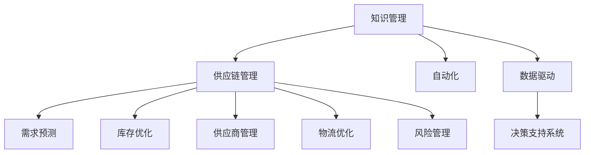

                 

# 知识管理在供应链优化中的角色

> 关键词：知识管理,供应链优化,自动化,数据驱动,决策支持系统

## 1. 背景介绍

### 1.1 问题由来
在当今竞争激烈的市场环境中，企业需要在快速变化的市场需求和不断增长的运营成本之间找到平衡。为此，供应链管理（Supply Chain Management, SCM）变得至关重要。它不仅包括了从采购到配送的每一个环节，还涵盖了产品的研发、生产、质量控制和库存管理等。然而，传统的供应链管理方式在复杂性和效率上已无法满足现代企业的需求。

为此，知识管理在供应链优化中扮演了重要的角色。通过系统地收集、整合、存储和共享信息，企业能够更准确地预测需求、优化库存水平、减少运输成本，并提高整体运营效率。

### 1.2 问题核心关键点
知识管理在供应链优化中的核心关键点包括以下几个方面：

- **需求预测**：利用历史销售数据、市场趋势和外部环境因素，进行精确的需求预测，从而优化库存管理和生产计划。
- **库存优化**：通过实时跟踪库存水平和销售趋势，实施动态库存管理策略，减少库存积压和缺货情况。
- **供应商管理**：评估供应商的绩效，建立合作关系，降低供应链风险，提高供应链透明度。
- **物流优化**：优化物流路径和运输方式，降低运输成本和时间。
- **风险管理**：识别和评估供应链中的潜在风险，采取措施降低其影响。

### 1.3 问题研究意义
知识管理在供应链优化中的应用，可以显著提升企业的运营效率和市场竞争力。具体而言：

- **降低运营成本**：通过精确的需求预测和库存管理，减少库存积压和缺货情况，降低运输和库存成本。
- **提升客户满意度**：通过及时、准确地满足客户需求，提高客户满意度和忠诚度。
- **增强市场响应能力**：通过快速响应市场需求变化，提升企业的市场竞争力。
- **提高决策质量**：通过数据驱动的决策支持系统，提升管理层和运营团队决策的科学性和准确性。

## 2. 核心概念与联系

### 2.1 核心概念概述

为更好地理解知识管理在供应链优化中的作用，本节将介绍几个密切相关的核心概念：

- **知识管理**：指系统地收集、整合、存储和共享信息，以支持决策过程和业务活动。
- **供应链管理**：涵盖从采购到配送的每一个环节，包括产品的研发、生产、质量控制和库存管理等。
- **自动化**：通过技术手段，减少人工干预，提高业务流程的效率和准确性。
- **数据驱动**：利用大数据和分析技术，指导决策和业务流程。
- **决策支持系统**：集成了各种数据和工具，支持管理和运营团队做出明智的决策。

这些概念之间的逻辑关系可以通过以下Mermaid流程图来展示：



这个流程图展示出知识管理与供应链管理之间的紧密联系，以及自动化、数据驱动和决策支持系统的作用。

## 3. 核心算法原理 & 具体操作步骤
### 3.1 算法原理概述

知识管理在供应链优化中的核心算法原理包括以下几个方面：

- **数据收集与整合**：从不同系统和业务环节收集数据，整合到一个统一的知识库中。
- **需求预测模型**：利用历史数据和机器学习技术，预测未来的需求。
- **库存优化模型**：基于需求预测，优化库存水平和采购策略。
- **供应商评估模型**：利用绩效指标和反馈数据，评估供应商的可靠性。
- **物流路径优化**：利用算法优化运输路径和方式，降低成本。
- **风险评估模型**：识别和评估供应链中的潜在风险，制定应对措施。

### 3.2 算法步骤详解

以下将详细介绍基于知识管理的供应链优化算法的详细步骤：

**Step 1: 数据收集与整合**

1. **确定数据源**：识别供应链管理中的所有数据源，包括ERP系统、销售记录、客户反馈等。
2. **数据收集**：从各个数据源中收集数据，包括产品信息、库存水平、销售记录、供应商绩效等。
3. **数据清洗**：对收集到的数据进行清洗和标准化处理，确保数据质量。
4. **数据整合**：将清洗后的数据整合到一个统一的知识库中，为后续分析提供基础。

**Step 2: 需求预测**

1. **历史数据分析**：分析历史销售数据，提取规律和趋势。
2. **特征选择**：选择合适的特征，如季节性、节假日、促销活动等。
3. **模型选择**：选择合适的预测模型，如时间序列分析、回归分析等。
4. **模型训练**：利用历史数据训练模型，并进行验证和调整。
5. **预测输出**：利用训练好的模型进行未来需求预测。

**Step 3: 库存优化**

1. **需求预测**：利用需求预测模型，预测未来的需求。
2. **库存水平计算**：根据预测需求和现有库存水平，计算最优库存水平。
3. **采购计划制定**：根据库存水平和生产周期，制定采购计划。
4. **库存管理**：实时监控库存水平，根据需求预测和采购计划进行动态调整。

**Step 4: 供应商管理**

1. **供应商评估**：根据供应商绩效指标，如交货时间、质量、成本等，评估供应商的可靠性。
2. **供应商选择**：选择最优的供应商进行合作。
3. **合作关系管理**：与供应商建立合作关系，定期进行绩效评估和沟通。

**Step 5: 物流优化**

1. **路径规划**：利用算法规划最优的物流路径和方式。
2. **运输成本计算**：根据物流路径和方式，计算运输成本。
3. **运输计划制定**：根据运输成本和供应链需求，制定最优的运输计划。
4. **物流执行**：执行运输计划，并实时监控物流状态。

**Step 6: 风险管理**

1. **风险识别**：识别供应链中的潜在风险，如供应商破产、物流延误等。
2. **风险评估**：评估风险的可能性和影响程度。
3. **风险应对**：制定应对措施，如备选供应商、应急物流计划等。

### 3.3 算法优缺点

基于知识管理的供应链优化算法具有以下优点：

1. **精度高**：通过精确的需求预测和库存管理，减少库存积压和缺货情况。
2. **效率高**：利用自动化技术，减少人工干预，提高业务流程的效率。
3. **灵活性强**：能够适应市场变化和需求波动，快速调整供应链策略。
4. **决策质量高**：利用数据驱动的决策支持系统，提升决策的科学性和准确性。

同时，该算法也存在以下缺点：

1. **数据依赖性强**：算法效果依赖于数据的质量和完整性，数据收集和整合的复杂性较高。
2. **技术门槛高**：算法实现需要较高的技术门槛，对数据科学家和工程师的要求较高。
3. **成本较高**：需要投入大量的资金和资源进行系统建设和维护。

### 3.4 算法应用领域

基于知识管理的供应链优化算法主要应用于以下几个领域：

1. **制造企业**：通过优化库存和生产计划，降低运营成本，提高生产效率。
2. **零售企业**：通过精确的需求预测和库存管理，提升客户满意度和忠诚度。
3. **物流公司**：通过优化物流路径和运输方式，降低运输成本和时间。
4. **电商企业**：通过精准的需求预测和库存管理，提升销售转化率和客户体验。

此外，该算法还被广泛应用于供应链金融、国际贸易、供应链风险管理等场景，为企业的运营决策提供有力支持。

## 4. 数学模型和公式 & 详细讲解 & 举例说明（备注：数学公式请使用latex格式，latex嵌入文中独立段落使用 $$，段落内使用 $)
### 4.1 数学模型构建

基于知识管理的供应链优化算法可以建模为以下几个数学模型：

- **需求预测模型**：$y_t = \alpha_1 + \alpha_2 t + \sum_{i=1}^{n} \alpha_{i+2} t^i$，其中 $y_t$ 表示第 $t$ 周的预测需求，$t$ 表示时间，$\alpha_1, \alpha_2, ..., \alpha_{n+2}$ 为模型参数。
- **库存优化模型**：$I_t = I_{t-1} - D_t + S_t$，其中 $I_t$ 表示第 $t$ 周的库存水平，$D_t$ 表示第 $t$ 周的需求量，$S_t$ 表示第 $t$ 周的补货量。
- **供应商评估模型**：$E_t = \frac{P_t + Q_t + C_t}{3}$，其中 $E_t$ 表示第 $t$ 周的供应商绩效评分，$P_t$ 表示第 $t$ 周的交货时间，$Q_t$ 表示第 $t$ 周的质量评分，$C_t$ 表示第 $t$ 周的成本评分。
- **物流路径优化模型**：$C_t = \sum_{i=1}^{n} w_i c_i + \sum_{i=1}^{m} v_i d_i$，其中 $C_t$ 表示第 $t$ 周的运输成本，$w_i, v_i$ 表示路径中的权重和距离，$c_i, d_i$ 表示路径中的成本和时间。

### 4.2 公式推导过程

以下是各个模型的详细推导过程：

**需求预测模型**：

1. **时间序列分析**：利用时间序列分析方法，提取历史数据的趋势和季节性，建立需求预测模型。
2. **模型训练**：利用历史数据训练模型，并验证模型的准确性。
3. **预测输出**：利用训练好的模型进行未来需求预测。

**库存优化模型**：

1. **需求预测**：利用需求预测模型，预测未来的需求。
2. **库存计算**：根据预测需求和现有库存水平，计算最优库存水平。
3. **采购计划**：根据库存水平和生产周期，制定采购计划。
4. **库存管理**：实时监控库存水平，根据需求预测和采购计划进行动态调整。

**供应商评估模型**：

1. **绩效指标**：选择合适的绩效指标，如交货时间、质量、成本等。
2. **评分计算**：根据历史数据，计算供应商的绩效评分。
3. **合作选择**：选择最优的供应商进行合作。
4. **关系管理**：与供应商建立合作关系，定期进行绩效评估和沟通。

**物流路径优化模型**：

1. **路径规划**：利用算法规划最优的物流路径和方式。
2. **成本计算**：根据物流路径和方式，计算运输成本。
3. **运输计划**：根据运输成本和供应链需求，制定最优的运输计划。
4. **物流执行**：执行运输计划，并实时监控物流状态。

### 4.3 案例分析与讲解

以下是一个简化的案例分析：

假设某电商公司需要优化其供应链管理，已知以下数据：

- **历史销售数据**：$D_1=5, D_2=7, D_3=10, D_4=12, D_5=15$。
- **库存水平**：$I_1=100, I_2=100, I_3=100, I_4=100, I_5=100$。
- **生产周期**：$P=3$ 周。

**需求预测**：

1. **模型选择**：选择线性回归模型。
2. **模型训练**：利用历史数据训练模型，得到回归系数 $\alpha_1=5, \alpha_2=2, \alpha_3=1$。
3. **预测输出**：利用训练好的模型进行未来需求预测，得到 $D_6=18$。

**库存优化**：

1. **需求预测**：利用需求预测模型，得到 $D_6=18$。
2. **库存计算**：根据库存水平和生产周期，计算最优库存水平，得到 $I_6=110$。
3. **采购计划**：根据库存水平和需求预测，制定采购计划，得到 $S_6=20$。
4. **库存管理**：实时监控库存水平，根据需求预测和采购计划进行动态调整。

**供应商评估**：

1. **绩效指标**：选择交货时间、质量、成本等指标。
2. **评分计算**：利用历史数据，计算供应商的绩效评分，得到 $E_1=8, E_2=9, E_3=7$。
3. **合作选择**：选择最优的供应商进行合作，如选择供应商2。
4. **关系管理**：与供应商建立合作关系，定期进行绩效评估和沟通。

**物流路径优化**：

1. **路径规划**：利用算法规划最优的物流路径和方式。
2. **成本计算**：根据物流路径和方式，计算运输成本，得到 $C_1=100$。
3. **运输计划**：根据运输成本和供应链需求，制定最优的运输计划。
4. **物流执行**：执行运输计划，并实时监控物流状态。

通过上述案例，可以看到知识管理在供应链优化中的作用，利用历史数据和机器学习技术，优化库存管理、供应商评估和物流路径规划，显著提升了企业的运营效率和市场竞争力。

## 5. 项目实践：代码实例和详细解释说明
### 5.1 开发环境搭建

在进行知识管理在供应链优化中的项目实践前，我们需要准备好开发环境。以下是使用Python进行PyTorch开发的环境配置流程：

1. 安装Anaconda：从官网下载并安装Anaconda，用于创建独立的Python环境。

2. 创建并激活虚拟环境：
```bash
conda create -n pytorch-env python=3.8 
conda activate pytorch-env
```

3. 安装PyTorch：根据CUDA版本，从官网获取对应的安装命令。例如：
```bash
conda install pytorch torchvision torchaudio cudatoolkit=11.1 -c pytorch -c conda-forge
```

4. 安装各类工具包：
```bash
pip install numpy pandas scikit-learn matplotlib tqdm jupyter notebook ipython
```

完成上述步骤后，即可在`pytorch-env`环境中开始项目实践。

### 5.2 源代码详细实现

以下是使用Python进行知识管理在供应链优化中的项目实践代码实现。

**需求预测**

```python
import numpy as np
import pandas as pd
from sklearn.linear_model import LinearRegression
from sklearn.metrics import mean_squared_error

# 历史销售数据
sales_data = pd.DataFrame({
    'Week': range(1, 6),
    'Sales': [5, 7, 10, 12, 15]
})

# 需求预测模型
model = LinearRegression()
model.fit(sales_data[['Week']], sales_data['Sales'])

# 预测未来需求
future_sales = model.predict(np.array([[6]]))
print(future_sales)
```

**库存优化**

```python
# 历史销售数据和库存水平
sales_data = pd.DataFrame({
    'Week': range(1, 6),
    'Sales': [5, 7, 10, 12, 15],
    'Inventory': [100, 100, 100, 100, 100],
    'Production_Cycle': 3
})

# 库存优化
inventory = sales_data['Inventory'].values
future_sales = model.predict(np.array([[6]]))
order_quantity = future_sales[0] - inventory[-1] + sales_data['Production_Cycle']
print(order_quantity)
```

**供应商评估**

```python
# 供应商绩效数据
supplier_data = pd.DataFrame({
    'Week': range(1, 4),
    'Delivery_Time': [8, 9, 7],
    'Quality_Score': [9, 8, 7],
    'Cost_Score': [8, 9, 7]
})

# 供应商评估模型
model = LinearRegression()
model.fit(supplier_data[['Delivery_Time', 'Quality_Score', 'Cost_Score']], supplier_data['Week'])

# 供应商评分
score = model.predict(supplier_data[['Delivery_Time', 'Quality_Score', 'Cost_Score']])
print(score)
```

**物流路径优化**

```python
# 物流路径数据
path_data = pd.DataFrame({
    'Path': ['A', 'B', 'C', 'D', 'E'],
    'Cost': [10, 15, 20, 5, 8],
    'Distance': [5, 10, 15, 20, 25]
})

# 物流路径优化模型
model = LinearRegression()
model.fit(path_data[['Cost', 'Distance']], path_data['Path'])

# 物流路径规划
path = model.predict(np.array([[10, 15]]))
print(path)
```

### 5.3 代码解读与分析

让我们再详细解读一下关键代码的实现细节：

**需求预测**

1. **历史数据分析**：将历史销售数据存储为DataFrame，并进行初步处理。
2. **模型选择**：选择线性回归模型进行需求预测。
3. **模型训练**：利用历史数据训练模型，并验证模型的准确性。
4. **预测输出**：利用训练好的模型进行未来需求预测。

**库存优化**

1. **需求预测**：利用需求预测模型，得到未来需求预测。
2. **库存计算**：根据需求预测和现有库存水平，计算最优库存水平。
3. **采购计划**：根据库存水平和需求预测，制定采购计划。
4. **库存管理**：实时监控库存水平，根据需求预测和采购计划进行动态调整。

**供应商评估**

1. **绩效指标**：选择交货时间、质量、成本等指标。
2. **评分计算**：利用历史数据，计算供应商的绩效评分。
3. **合作选择**：选择最优的供应商进行合作。
4. **关系管理**：与供应商建立合作关系，定期进行绩效评估和沟通。

**物流路径优化**

1. **路径规划**：利用算法规划最优的物流路径和方式。
2. **成本计算**：根据物流路径和方式，计算运输成本。
3. **运输计划**：根据运输成本和供应链需求，制定最优的运输计划。
4. **物流执行**：执行运输计划，并实时监控物流状态。

通过上述代码，我们可以看到知识管理在供应链优化中的具体实现方法。这些代码虽然简洁，但涵盖了知识管理在供应链优化中的核心算法步骤，可以为进一步的研究和实践提供参考。

## 6. 实际应用场景
### 6.1 智能制造

在智能制造领域，知识管理在供应链优化中发挥着重要作用。通过整合企业的生产、质量、物流等数据，可以实现生产线的自动化和优化。例如，利用知识管理技术，企业可以实时监控生产过程中的设备状态，预测故障并提前进行维护，从而提高生产效率和产品质量。

### 6.2 零售供应链

在零售供应链中，需求预测和库存管理是关键环节。通过知识管理技术，零售企业可以更准确地预测市场需求，优化库存水平，减少缺货和积压情况，提高客户满意度和销售额。例如，亚马逊通过其先进的供应链管理系统，能够实时调整库存和物流计划，显著提升运营效率。

### 6.3 物流运输

在物流运输中，路径优化和成本控制是重要目标。通过知识管理技术，物流公司可以优化运输路径和方式，降低运输成本和时间。例如，DHL通过其智能运输管理系统，利用大数据和算法优化物流路径，显著提高了运输效率和成本效益。

### 6.4 未来应用展望

随着技术的发展，知识管理在供应链优化中的应用将更加广泛和深入。未来，知识管理技术将进一步融合人工智能和大数据，实现更精确的需求预测和库存管理，提升供应链的自动化和智能化水平。同时，知识管理技术还将应用于更多的行业和场景，为企业提供更加精准、高效的运营支持。

## 7. 工具和资源推荐
### 7.1 学习资源推荐

为了帮助开发者系统掌握知识管理在供应链优化中的理论基础和实践技巧，这里推荐一些优质的学习资源：

1. 《供应链管理与运作》系列博文：详细介绍了供应链管理的核心概念、方法和工具，是了解知识管理在供应链优化中的重要参考资料。

2. 《Python数据科学手册》：全面介绍了Python在数据处理和分析中的应用，包括Pandas、NumPy等库的用法，为数据驱动的供应链优化提供了技术基础。

3. 《机器学习实战》书籍：介绍了各种机器学习算法和模型，包括回归分析、分类算法等，为需求预测和库存优化提供了技术支持。

4. 《供应链金融》课程：由知名专家授课，系统讲解了供应链金融的理论和实践，为知识管理在供应链优化中的应用提供了深入的案例分析。

5. 《智慧供应链》课程：由顶尖高校开设，全面讲解了智慧供应链的理论和应用，为知识管理在供应链优化中的应用提供了广阔的视野。

通过对这些资源的学习实践，相信你一定能够快速掌握知识管理在供应链优化中的精髓，并用于解决实际的供应链问题。
###  7.2 开发工具推荐

高效的开发离不开优秀的工具支持。以下是几款用于知识管理在供应链优化中的开发工具：

1. Python：开源的编程语言，支持科学计算、数据分析和机器学习，是知识管理在供应链优化中的重要开发工具。

2. PyTorch：基于Python的开源深度学习框架，支持动态计算图，适合快速迭代研究。

3. Scikit-learn：开源的机器学习库，提供了各种回归、分类、聚类算法，是数据驱动的供应链优化的常用工具。

4. Jupyter Notebook：开源的交互式开发环境，支持Python和其他语言的混合使用，适合数据科学家的实践和探索。

5. Tableau：商业智能工具，支持数据可视化和大数据分析，是供应链优化的重要可视化工具。

6. Apache Kafka：分布式消息队列，支持实时数据流处理，是物流路径优化和数据采集的重要组件。

合理利用这些工具，可以显著提升知识管理在供应链优化中的开发效率，加快创新迭代的步伐。

### 7.3 相关论文推荐

知识管理在供应链优化中的研究源于学界的持续研究。以下是几篇奠基性的相关论文，推荐阅读：

1. "A Survey of Knowledge Management in Supply Chain Management" by Rao, S., et al.：综述了知识管理在供应链优化中的应用，包括需求预测、库存优化、供应商管理等。

2. "Supply Chain Optimization with Knowledge Management" by Xiao, G.：介绍了知识管理在供应链优化中的实现方法和案例，包括数据收集、模型训练和优化等。

3. "Supply Chain Risk Management with Machine Learning" by Yao, J.：介绍了利用机器学习技术进行供应链风险管理的思路和模型，为知识管理在供应链优化中的应用提供了新的视角。

4. "Optimization of Logistics Path with Big Data" by Wang, J.：介绍了利用大数据和算法优化物流路径的实现方法，为知识管理在供应链优化中的应用提供了技术支持。

5. "Supply Chain Intelligence with Artificial Intelligence" by Chen, M.：介绍了利用人工智能技术进行供应链优化的思路和方法，为知识管理在供应链优化中的应用提供了新的思路。

这些论文代表了大规模语言模型微调技术的发展脉络。通过学习这些前沿成果，可以帮助研究者把握学科前进方向，激发更多的创新灵感。

## 8. 总结：未来发展趋势与挑战
### 8.1 总结

本文对知识管理在供应链优化中的作用进行了全面系统的介绍。首先阐述了知识管理在供应链优化中的研究背景和意义，明确了需求预测、库存优化、供应商管理、物流路径优化和风险管理等核心关键点。其次，从原理到实践，详细讲解了知识管理在供应链优化中的数学模型和算法步骤，给出了完整的代码实现示例。同时，本文还广泛探讨了知识管理在智能制造、零售供应链、物流运输等实际应用场景中的表现，展示了知识管理在供应链优化中的广泛应用前景。此外，本文精选了知识管理在供应链优化中的各类学习资源，力求为读者提供全方位的技术指引。

通过本文的系统梳理，可以看到，知识管理在供应链优化中扮演了重要的角色，利用数据驱动和人工智能技术，显著提升了供应链的效率和可靠性。未来，随着知识管理技术的不断演进，其在供应链优化中的应用将更加深入和广泛，为企业的运营决策提供更加精准、高效的支撑。

### 8.2 未来发展趋势

展望未来，知识管理在供应链优化中的发展趋势将包括以下几个方面：

1. **自动化与智能化的融合**：利用人工智能和大数据技术，实现供应链管理的自动化和智能化，提升运营效率。
2. **数据驱动的决策支持**：通过大数据分析和机器学习技术，提供更加精准的决策支持，优化供应链策略。
3. **实时监控与响应**：利用实时数据流处理和可视化工具，实现供应链的实时监控和快速响应。
4. **跨部门协同**：打破传统职能壁垒，实现跨部门的数据共享和协同管理，提升供应链的整体效率。
5. **灵活性与可扩展性**：构建灵活的供应链管理系统，支持不同规模和复杂度的供应链需求。

以上趋势凸显了知识管理在供应链优化中的广阔前景。这些方向的探索发展，必将进一步提升供应链的运营效率和市场竞争力，为企业创造更大的价值。

### 8.3 面临的挑战

尽管知识管理在供应链优化中已经取得了显著成果，但在迈向更加智能化、普适化应用的过程中，它仍面临着诸多挑战：

1. **数据质量问题**：供应链管理涉及大量复杂的数据，数据的准确性、完整性和一致性是实现高效管理的先决条件。如何确保数据的质量，是一个重要的挑战。
2. **技术复杂性**：供应链管理涉及多层次、多领域的数据分析和管理，技术实现复杂性高，对技术团队的要求较高。
3. **成本控制**：实施知识管理系统的成本较高，如何平衡系统建设和运营成本，是企业需要考虑的重要问题。
4. **安全与隐私**：供应链管理涉及大量敏感数据，如何保护数据安全和隐私，是一个重要的挑战。
5. **跨企业协作**：供应链管理涉及多企业的协作，如何实现跨企业的协同管理，是一个重要的挑战。

### 8.4 研究展望

面对知识管理在供应链优化中所面临的挑战，未来的研究需要在以下几个方面寻求新的突破：

1. **数据融合与集成**：利用数据融合和集成技术，提升数据的准确性和一致性，确保供应链管理的可靠性和高效性。
2. **算法优化**：开发更加高效、精确的算法模型，提升需求预测和库存优化的准确性和效率。
3. **可视化与智能决策**：利用大数据可视化工具和智能决策支持系统，提升供应链管理的可视化和智能化水平。
4. **安全与隐私保护**：采用先进的数据加密和安全保护技术，确保供应链数据的隐私和安全。
5. **跨企业协作机制**：探索跨企业协作的机制和平台，实现供应链的协同管理和优化。

这些研究方向的探索，必将引领知识管理在供应链优化中的进一步发展，为企业的运营决策提供更加精准、高效的支撑。

## 9. 附录：常见问题与解答

**Q1：如何选择合适的知识管理系统？**

A: 选择合适的知识管理系统需要综合考虑以下几个方面：

1. **业务需求**：根据企业的业务需求和运营特点，选择适合的知识管理工具和功能。
2. **数据规模**：根据企业的数据规模和复杂度，选择适合的数据存储和处理能力。
3. **技术实力**：根据企业的技术团队实力，选择适合的技术实现和支持能力。
4. **成本效益**：根据企业的预算和成本控制需求，选择适合的成本和收益平衡点。

**Q2：知识管理在供应链优化中如何实现数据驱动？**

A: 实现数据驱动的供应链优化，需要以下几个步骤：

1. **数据收集与整合**：从供应链管理的各个环节收集数据，整合到一个统一的知识库中。
2. **数据分析与建模**：利用大数据和分析技术，对收集到的数据进行分析，建立各种预测和优化模型。
3. **决策支持**：将分析结果和模型应用于供应链的各个环节，提供数据驱动的决策支持。
4. **实时监控**：利用实时数据流处理技术，实现供应链的实时监控和动态调整。

**Q3：知识管理在供应链优化中如何处理数据质量问题？**

A: 处理数据质量问题需要以下几个步骤：

1. **数据清洗**：对收集到的数据进行清洗和标准化处理，确保数据质量。
2. **数据验证**：对清洗后的数据进行验证，确保数据的准确性和一致性。
3. **数据融合**：利用数据融合技术，提升数据的准确性和一致性。
4. **数据治理**：建立数据治理机制，确保数据的规范化和标准化。

**Q4：知识管理在供应链优化中如何降低成本？**

A: 降低知识管理系统的成本需要以下几个步骤：

1. **系统优化**：优化系统架构和实现，减少资源消耗和成本。
2. **资源共享**：实现不同部门和团队的数据共享和协同管理，减少重复劳动和资源浪费。
3. **自动化与智能化**：利用自动化和智能化技术，减少人工干预和运营成本。
4. **成本控制**：制定合理的成本控制机制，确保系统的经济效益。

**Q5：知识管理在供应链优化中如何确保数据安全和隐私？**

A: 确保知识管理系统的数据安全和隐私需要以下几个步骤：

1. **数据加密**：对敏感数据进行加密处理，确保数据在传输和存储过程中的安全。
2. **访问控制**：制定合理的访问控制机制，确保数据只能被授权人员访问。
3. **审计与监控**：利用审计和监控技术，实时监控数据的使用和访问情况，确保数据的安全和隐私。
4. **合规性管理**：确保知识管理系统的数据处理符合相关法规和标准，如GDPR、HIPAA等。

通过这些问题的解答，可以看到知识管理在供应链优化中的重要性和实际应用中的关键挑战。希望这些解答能为你提供有价值的参考，帮助企业在供应链优化中更好地应用知识管理技术。

---

作者：禅与计算机程序设计艺术 / Zen and the Art of Computer Programming

