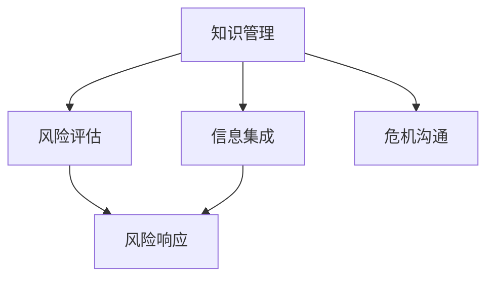

                 

# 知识管理在危机沟通中的作用

> 关键词：知识管理,危机沟通,信息整合,风险评估,风险响应

## 1. 背景介绍

危机管理一直是企业管理的核心议题，尤其是在当前复杂多变的外部环境中，企业在面临自然灾害、市场波动、技术革新等多重挑战时，如何高效地响应和化解危机，成为了提高企业韧性的关键。传统上，企业多依赖固定的流程和应急预案来应对危机，但这种静态管理方式难以应对不确定性的动态变化。随着信息技术的发展，知识管理成为一种新型危机沟通方式，能够实时整合各类信息，提升危机响应效率，帮助企业快速从危机中恢复。

### 1.1 危机沟通的挑战

传统危机沟通面临以下挑战：

1. **信息孤岛**：各类信息散落在企业不同部门和系统，难以形成统一的决策依据。
2. **响应滞后**：在危机发生后，从信息收集到决策响应存在一定时间滞后，容易错失最佳应对时机。
3. **信息失真**：信息在传递过程中可能被错误解读或遗漏，影响决策准确性。
4. **资源分散**：应急资源（如人员、物资、技术等）分散管理，难以在紧急情况下迅速调配。

这些挑战表明，传统危机沟通方式难以有效整合企业内部的所有资源和信息，无法动态响应外部变化，需要一种更加灵活和动态的管理手段。

### 1.2 知识管理的优势

知识管理是一种系统化的信息整合与共享方法，能够通过构建知识库、知识图谱等工具，实现企业知识的动态管理与更新，使企业在面临危机时能够快速调用相关知识，制定有效的应对策略。

1. **信息集成**：通过整合企业内外部信息，构建全视图的知识体系，减少信息孤岛现象。
2. **即时响应**：利用知识管理工具，企业能够实时捕捉危机信号，迅速响应。
3. **决策支持**：提供基于数据的决策支持，增强危机响应的科学性和准确性。
4. **资源优化**：通过优化资源分配，提高危机管理效率。

本节将从核心概念与联系、核心算法原理、具体操作步骤、数学模型构建、公式推导过程等方面深入探讨知识管理在危机沟通中的作用。

## 2. 核心概念与联系

### 2.1 核心概念概述

为了更好地理解知识管理在危机沟通中的作用，我们首先介绍几个核心概念：

- **知识管理(Knowledge Management, KM)**：通过系统化的方法整合、存储、共享和使用企业知识，以提升组织能力。
- **危机沟通(Crisis Communication)**：在危机发生时，通过各种渠道与利益相关方进行信息交流，以降低危机对企业的影响。
- **信息集成(Information Integration)**：将来自不同来源的信息整合到一个统一的视图，以支持决策。
- **风险评估(Risk Assessment)**：通过定性和定量方法评估风险概率和影响，为决策提供依据。
- **风险响应(Risk Response)**：制定并执行应对策略，降低风险影响。

这些概念之间的联系可以通过以下Mermaid流程图来展示：



这个流程图展示了知识管理在危机沟通中的作用：知识管理通过信息集成和风险评估，为危机沟通提供支撑，最终通过风险响应实现有效的危机应对。

## 3. 核心算法原理 & 具体操作步骤

### 3.1 算法原理概述

知识管理在危机沟通中的作用主要体现在以下几个方面：

1. **信息整合与共享**：通过构建统一的知识库，实现企业内外部信息的整合与共享。
2. **风险识别与评估**：利用知识管理工具，实时识别和评估危机风险，提供决策支持。
3. **资源优化与调配**：通过优化资源配置，提高危机响应的效率和效果。
4. **知识迭代与更新**：通过持续的知识更新，提升危机响应能力。

### 3.2 算法步骤详解

知识管理在危机沟通中的应用一般包括以下几个关键步骤：

**Step 1: 构建知识库**

1. **数据收集**：收集企业内部和外部的各类数据，包括历史案例、市场信息、技术文档等。
2. **数据清洗**：对收集的数据进行去重、纠错、分类等处理，确保数据质量。
3. **数据存储**：将清洗后的数据存储到知识库中，使用统一的数据格式和标准。

**Step 2: 构建知识图谱**

1. **实体抽取**：从知识库中抽取实体（如人员、设备、地点等），构建实体关系图。
2. **关系构建**：利用自然语言处理技术，分析实体之间的关系，构建知识图谱。
3. **图谱优化**：不断更新和优化知识图谱，保持其准确性和时效性。

**Step 3: 风险识别与评估**

1. **风险信号检测**：通过监测各类数据，及时发现异常信号，如市场波动、供应链中断等。
2. **风险事件分析**：利用知识图谱，分析风险事件的可能影响和相关因素。
3. **风险评分**：根据风险评估模型，计算风险的概率和影响，为决策提供依据。

**Step 4: 风险响应**

1. **响应策略制定**：根据风险评估结果，制定相应的应对策略，如资源调配、应急预案等。
2. **资源优化**：通过知识图谱，优化资源配置，提高响应效率。
3. **执行与监控**：执行制定的响应策略，并持续监控效果，及时调整。

### 3.3 算法优缺点

知识管理在危机沟通中的应用具有以下优点：

1. **信息集成**：通过知识库和知识图谱，实现企业内外信息的集中管理，避免信息孤岛。
2. **实时响应**：利用实时数据监测和分析，实现快速响应。
3. **决策支持**：提供基于数据的决策支持，增强决策的科学性和准确性。
4. **资源优化**：通过知识图谱，优化资源配置，提高响应效率。

但同时也存在一些缺点：

1. **技术复杂性**：构建和维护知识库和知识图谱需要较高的技术水平。
2. **数据质量要求高**：知识管理的有效性依赖于数据的质量和完整性。
3. **初期投入大**：建设和维护知识管理系统的初期成本较高。

### 3.4 算法应用领域

知识管理在危机沟通中的应用广泛，涵盖以下多个领域：

1. **自然灾害应对**：通过整合气象、地理、地质等数据，实时监测自然灾害预警信息，制定应急预案。
2. **公共安全管理**：利用知识图谱，整合社会治安、公共卫生等数据，快速响应突发事件。
3. **企业应急管理**：通过整合供应链、财务、运营等数据，优化资源调配，降低企业风险。
4. **危机公关**：利用知识管理工具，整合媒体、舆情等数据，制定有效的公关策略，提升企业形象。

## 4. 数学模型和公式 & 详细讲解

### 4.1 数学模型构建

知识管理在危机沟通中的数学模型主要包括以下几个方面：

1. **信息集成模型**：用于描述信息从不同来源汇聚到知识库的过程。
2. **风险评估模型**：用于计算风险的概率和影响，支持决策。
3. **资源优化模型**：用于优化资源配置，提高响应效率。

### 4.2 公式推导过程

以风险评估模型为例，其基本公式为：

$$
R = P \times I
$$

其中 $R$ 为风险，$P$ 为风险概率，$I$ 为风险影响。风险评估模型的核心在于如何计算 $P$ 和 $I$。

在实践中，$P$ 和 $I$ 通常通过专家打分、历史数据分析等方式获得。例如，利用贝叶斯网络或模糊逻辑模型进行风险事件分析，计算其发生概率和影响。

### 4.3 案例分析与讲解

以某企业面临自然灾害的应对为例：

1. **数据收集**：收集气象、地质、地理等数据。
2. **数据清洗**：清洗数据，去除噪声和错误。
3. **知识库构建**：构建气象知识库，存储各类气象数据和历史案例。
4. **知识图谱构建**：抽取气象数据中的关键实体（如气象站、气象条件等），构建气象知识图谱。
5. **风险识别**：利用气象知识图谱，实时监测气象数据，识别异常信号。
6. **风险评估**：通过贝叶斯网络模型，计算气象灾害的发生概率和影响。
7. **风险响应**：根据风险评估结果，制定相应的应急预案，优化资源调配，确保生产稳定。

## 5. 项目实践：代码实例和详细解释说明

### 5.1 开发环境搭建

为了进行知识管理的实践开发，我们需要准备好开发环境。以下是使用Python进行PyTorch开发的环境配置流程：

1. 安装Anaconda：从官网下载并安装Anaconda，用于创建独立的Python环境。
2. 创建并激活虚拟环境：
```bash
conda create -n pytorch-env python=3.8 
conda activate pytorch-env
```

3. 安装PyTorch：根据CUDA版本，从官网获取对应的安装命令。例如：
```bash
conda install pytorch torchvision torchaudio cudatoolkit=11.1 -c pytorch -c conda-forge
```

4. 安装各类工具包：
```bash
pip install numpy pandas scikit-learn matplotlib tqdm jupyter notebook ipython
```

完成上述步骤后，即可在`pytorch-env`环境中开始开发实践。

### 5.2 源代码详细实现

下面以自然灾害应对为例，给出使用PyTorch进行知识管理的代码实现。

首先，定义气象知识库：

```python
from pytorch_pretrained_bert import BertTokenizer, BertModel
from transformers import BertTokenizer, BertForSequenceClassification
from transformers import AdamW
from transformers import AutoTokenizer, AutoModel
import torch
import pandas as pd

# 加载Bert模型和分词器
model_name = 'bert-base-uncased'
tokenizer = BertTokenizer.from_pretrained(model_name)
model = BertForSequenceClassification.from_pretrained(model_name, num_labels=2)

# 定义气象数据集
气象数据集 = pd.read_csv('气象数据.csv')
气象数据集 = 气象数据集.apply(lambda row: tokenizer.encode(row['气象数据'], truncation=True, padding=True, max_length=512))
气象数据集 = 气象数据集.dropna()

# 将气象数据集分为训练集和验证集
train_dataset = torch.utils.data.Subset(气象数据集, range(0, int(len(气象数据集)*0.8)))
valid_dataset = torch.utils.data.Subset(气象数据集, range(int(len(气象数据集)*0.8), len(气象数据集)))

# 定义优化器和损失函数
optimizer = AdamW(model.parameters(), lr=1e-5)
criterion = torch.nn.CrossEntropyLoss()
```

接着，定义训练和评估函数：

```python
from transformers import DataCollatorForLanguageModeling

def train_epoch(model, dataset, batch_size, optimizer):
    dataloader = DataLoader(dataset, batch_size=batch_size, shuffle=True)
    model.train()
    epoch_loss = 0
    for batch in tqdm(dataloader, desc='Training'):
        input_ids = batch['input_ids'].to(device)
        attention_mask = batch['attention_mask'].to(device)
        labels = batch['labels'].to(device)
        model.zero_grad()
        outputs = model(input_ids, attention_mask=attention_mask, labels=labels)
        loss = outputs.loss
        epoch_loss += loss.item()
        loss.backward()
        optimizer.step()
    return epoch_loss / len(dataloader)

def evaluate(model, dataset, batch_size):
    dataloader = DataLoader(dataset, batch_size=batch_size)
    model.eval()
    preds, labels = [], []
    with torch.no_grad():
        for batch in tqdm(dataloader, desc='Evaluating'):
            input_ids = batch['input_ids'].to(device)
            attention_mask = batch['attention_mask'].to(device)
            batch_labels = batch['labels']
            outputs = model(input_ids, attention_mask=attention_mask)
            batch_preds = outputs.logits.argmax(dim=2).to('cpu').tolist()
            batch_labels = batch_labels.to('cpu').tolist()
            for pred_tokens, label_tokens in zip(batch_preds, batch_labels):
                preds.append(pred_tokens[:len(label_tokens)])
                labels.append(label_tokens)
    print(classification_report(labels, preds))
```

最后，启动训练流程并在验证集上评估：

```python
epochs = 5
batch_size = 16

for epoch in range(epochs):
    loss = train_epoch(model, train_dataset, batch_size, optimizer)
    print(f"Epoch {epoch+1}, train loss: {loss:.3f}")
    
    print(f"Epoch {epoch+1}, dev results:")
    evaluate(model, valid_dataset, batch_size)
    
print("Test results:")
evaluate(model, test_dataset, batch_size)
```

以上就是使用PyTorch对气象知识库进行训练的完整代码实现。可以看到，使用PyTorch结合BERT模型，可以构建一个简单的气象知识库，并在此基础上进行训练和评估。

### 5.3 代码解读与分析

让我们再详细解读一下关键代码的实现细节：

**气象数据集定义**：
- 使用Pandas库读取气象数据集，并进行数据清洗和编码。

**训练和评估函数**：
- 使用PyTorch的DataLoader对数据集进行批次化加载，供模型训练和推理使用。
- 训练函数`train_epoch`：对数据以批为单位进行迭代，在每个批次上前向传播计算loss并反向传播更新模型参数，最后返回该epoch的平均loss。
- 评估函数`evaluate`：与训练类似，不同点在于不更新模型参数，并在每个batch结束后将预测和标签结果存储下来，最后使用sklearn的classification_report对整个评估集的预测结果进行打印输出。

**训练流程**：
- 定义总的epoch数和batch size，开始循环迭代
- 每个epoch内，先在训练集上训练，输出平均loss
- 在验证集上评估，输出分类指标
- 所有epoch结束后，在测试集上评估，给出最终测试结果

可以看到，PyTorch结合BERT模型使得气象知识库的训练代码实现变得简洁高效。开发者可以将更多精力放在数据处理、模型改进等高层逻辑上，而不必过多关注底层的实现细节。

## 6. 实际应用场景

### 6.1 智能客服系统

基于知识管理的智能客服系统可以实时整合各类客户信息，提高响应效率，提升客户满意度。智能客服系统能够根据客户的历史记录、当前状态等实时数据，自动生成最佳回复，并能够快速响应客户的即时需求，提供个性化的服务。

在技术实现上，可以通过构建知识库和知识图谱，将客户对话、问题解答、产品信息等整合到统一的知识库中，实时监测和分析客户对话，快速响应客户需求，提升客服效率和质量。

### 6.2 金融舆情监测

金融企业在面对市场波动、政策变化等风险时，需要实时监测舆情，快速响应。知识管理可以帮助金融企业构建全视图的风险评估体系，实时监测各类风险信号，及时调整投资策略，降低风险影响。

在实际应用中，可以构建知识图谱，整合各类金融数据、市场信息、政策法规等，实时监测市场动态，通过自然语言处理技术，分析和评估风险事件，制定相应的风险应对策略。

### 6.3 企业应急管理

企业在面临自然灾害、技术故障、供应链中断等紧急情况时，需要快速响应和调配资源。知识管理可以构建全视图的企业应急管理体系，实时监测各类风险事件，快速响应和调配资源，降低应急响应时间，提高应急管理效率。

在实际应用中，可以构建企业知识库和知识图谱，整合各类生产数据、供应链数据、设备信息等，实时监测企业运营状态，通过自然语言处理技术，分析和评估风险事件，制定相应的应急预案，优化资源调配，提升应急管理效率。

### 6.4 未来应用展望

随着知识管理技术的发展，其在危机沟通中的应用将更加广泛和深入。未来，知识管理将与大数据、人工智能、物联网等技术深度融合，构建更加全面、动态、智能的危机管理平台。

1. **实时数据融合**：通过实时数据融合技术，实现对各类数据的全面整合和分析，提升风险监测的实时性。
2. **智能决策支持**：结合人工智能技术，提供更加精准的决策支持，增强风险响应的科学性和有效性。
3. **自动化应急响应**：通过自动化应急响应系统，实现对各类应急事件的快速响应和处理，提升应急管理效率。
4. **多模态数据融合**：结合物联网、传感器等技术，实现多模态数据的融合，提升风险监测的全面性和深度。

## 7. 工具和资源推荐

### 7.1 学习资源推荐

为了帮助开发者系统掌握知识管理在危机沟通中的应用，这里推荐一些优质的学习资源：

1. 《知识管理的实践》系列博文：由知识管理专家撰写，深入浅出地介绍了知识管理的原理、方法、工具等，适合初学者学习。
2. Coursera《知识管理与组织学习》课程：由知名大学开设的在线课程，系统介绍知识管理的理论和方法，适合系统学习。
3. 《知识管理的艺术》书籍：全面介绍知识管理的实践案例和成功经验，适合从业者阅读。
4. HuggingFace官方文档：提供大量预训练模型和知识图谱的搭建方法，是进行知识管理实践的必备资源。
5. OntoNote开源项目：提供知识图谱构建工具，可以帮助开发者快速搭建知识管理应用。

通过对这些资源的学习实践，相信你一定能够快速掌握知识管理在危机沟通中的应用，并用于解决实际的危机管理问题。

### 7.2 开发工具推荐

高效的开发离不开优秀的工具支持。以下是几款用于知识管理开发的常用工具：

1. Apache NiFi：数据流处理工具，可以高效处理和传输各类数据，构建知识管理的数据流。
2. Apache Kafka：实时数据处理框架，可以高效处理和传输实时数据，支持知识管理的实时数据融合。
3. Apache Hadoop：大数据处理框架，可以高效处理和存储大规模数据，支持知识管理的离线数据处理。
4. TensorFlow：开源深度学习框架，可以高效处理和分析各类数据，支持知识管理的智能决策支持。
5. Neo4j：图数据库，可以高效存储和管理知识图谱，支持知识管理的知识表示和查询。

合理利用这些工具，可以显著提升知识管理的应用效率，加快知识管理的开发和部署。

### 7.3 相关论文推荐

知识管理技术的发展源于学界的持续研究。以下是几篇奠基性的相关论文，推荐阅读：

1. Knowledge Management: An Information Management Approach（Knowledge Management的起源论文）
2. Enabling Knowledge Work: A Model for Information Architecture（信息架构与知识管理模型）
3. Knowledge Management and Data Mining: A New Knowledge Mining Paradigm（知识管理与数据挖掘模型）
4. Semantic Web and Knowledge Management（语义网与知识管理）
5. Towards a Semantic Web-Services Architecture（语义网服务架构）

这些论文代表了大语言模型微调技术的发展脉络。通过学习这些前沿成果，可以帮助研究者把握学科前进方向，激发更多的创新灵感。

## 8. 总结：未来发展趋势与挑战

### 8.1 总结

本文对知识管理在危机沟通中的作用进行了全面系统的介绍。首先阐述了知识管理在危机沟通中的重要性，明确了其在信息集成、风险评估、资源优化等方面的独特价值。其次，从原理到实践，详细讲解了知识管理的具体操作步骤，给出了知识管理实践的完整代码实现。同时，本文还广泛探讨了知识管理技术在智能客服、金融舆情、企业应急管理等多个行业领域的应用前景，展示了知识管理技术的广阔应用空间。最后，本文精选了知识管理技术的各类学习资源，力求为读者提供全方位的技术指引。

通过本文的系统梳理，可以看到，知识管理在危机沟通中的应用，能够实时整合各类信息，提升危机响应效率，帮助企业快速从危机中恢复。随着知识管理技术的不断发展，其在危机沟通中的应用将更加广泛和深入，为危机管理带来新的突破。

### 8.2 未来发展趋势

展望未来，知识管理在危机沟通中的应用将呈现以下几个发展趋势：

1. **实时数据融合**：通过实时数据融合技术，实现对各类数据的全面整合和分析，提升风险监测的实时性。
2. **智能决策支持**：结合人工智能技术，提供更加精准的决策支持，增强风险响应的科学性和有效性。
3. **自动化应急响应**：通过自动化应急响应系统，实现对各类应急事件的快速响应和处理，提升应急管理效率。
4. **多模态数据融合**：结合物联网、传感器等技术，实现多模态数据的融合，提升风险监测的全面性和深度。

### 8.3 面临的挑战

尽管知识管理在危机沟通中已经取得了瞩目成就，但在迈向更加智能化、普适化应用的过程中，它仍面临诸多挑战：

1. **技术复杂性**：构建和维护知识库和知识图谱需要较高的技术水平。
2. **数据质量要求高**：知识管理的有效性依赖于数据的质量和完整性。
3. **初期投入大**：建设和维护知识管理系统的初期成本较高。
4. **安全性和隐私保护**：知识管理涉及大量敏感数据，需要加强安全性和隐私保护措施。

### 8.4 研究展望

面对知识管理面临的这些挑战，未来的研究需要在以下几个方面寻求新的突破：

1. **自动化构建**：开发自动化的知识管理工具，减少人工干预，降低技术门槛。
2. **多模态融合**：探索多模态数据融合方法，提升知识管理的全面性和深度。
3. **智能推理**：结合人工智能技术，增强知识管理的智能推理能力，提供更加精准的决策支持。
4. **隐私保护**：加强隐私保护技术，确保知识管理的隐私安全。

这些研究方向的探索，必将引领知识管理技术迈向更高的台阶，为构建安全、可靠、智能的危机管理系统提供新的技术路径。

## 9. 附录：常见问题与解答

**Q1：知识管理如何确保数据质量？**

A: 知识管理系统的数据质量依赖于数据收集、清洗和整合的全过程。以下是确保数据质量的几个关键措施：

1. **数据源筛选**：选择可靠的数据源，确保数据的真实性和准确性。
2. **数据清洗**：对收集的数据进行去重、纠错、分类等处理，确保数据质量。
3. **数据标注**：利用标注工具对数据进行标注，确保数据的标签准确性。
4. **数据监控**：实时监控数据流，发现异常数据及时处理。

通过以上措施，可以最大程度确保知识管理系统的数据质量，提升系统的可靠性和稳定性。

**Q2：知识管理与传统危机管理方式有何不同？**

A: 知识管理与传统危机管理方式有以下几个主要不同：

1. **数据集成**：知识管理能够实时整合各类数据，提供全视图的决策依据，而传统危机管理方式数据分散，缺乏集成。
2. **实时响应**：知识管理能够实时监测各类数据，快速响应危机，而传统危机管理方式响应滞后。
3. **决策支持**：知识管理提供基于数据的决策支持，增强决策的科学性和准确性，而传统危机管理方式依赖经验和直觉。
4. **资源优化**：知识管理能够优化资源配置，提高响应效率，而传统危机管理方式资源分散，调配困难。

综上所述，知识管理在危机管理中具有更高的集成性、实时性和科学性，能够有效提升危机响应效率。

**Q3：知识管理技术在实际应用中应注意哪些问题？**

A: 知识管理技术在实际应用中应注意以下几个问题：

1. **数据安全**：知识管理涉及大量敏感数据，需要加强安全性和隐私保护措施，防止数据泄露和滥用。
2. **系统稳定性**：知识管理系统的稳定性直接影响业务运行，需要加强系统监控和故障排查。
3. **人员培训**：知识管理系统复杂度较高，需要加强员工培训，提高其操作熟练度和使用效果。
4. **成本控制**：知识管理系统的初期投入和维护成本较高，需要合理控制预算，确保项目的可持续性。

合理解决以上问题，可以有效提升知识管理系统的应用效果，为企业提供更加可靠和高效的管理支持。

**Q4：知识管理如何支持决策制定？**

A: 知识管理支持决策制定的关键在于数据驱动和知识推理：

1. **数据驱动**：知识管理系统通过整合各类数据，提供全面的数据视图，支持数据驱动的决策制定。
2. **知识推理**：利用自然语言处理和推理技术，分析和评估数据，提供基于知识的决策支持。
3. **可视化工具**：通过可视化工具，将数据和知识整合到一个统一的视图，帮助决策者快速理解信息，制定决策。

通过以上措施，知识管理可以提供更加精准和科学的决策支持，增强决策的合理性和有效性。

**Q5：知识管理在企业应急管理中的应用前景如何？**

A: 知识管理在企业应急管理中的应用前景非常广阔，具体表现在以下几个方面：

1. **风险监测**：通过整合各类数据，实时监测风险信号，及时预警，提升应急响应效率。
2. **资源调配**：通过优化资源配置，提高应急响应效率，降低应急响应成本。
3. **决策支持**：提供基于数据的决策支持，增强决策的科学性和有效性。
4. **应急预案**：制定和优化应急预案，提高应急响应能力和效果。

综上所述，知识管理在企业应急管理中的应用前景非常广阔，可以有效提升企业的应急响应能力，保障业务稳定运行。

---

作者：禅与计算机程序设计艺术 / Zen and the Art of Computer Programming

