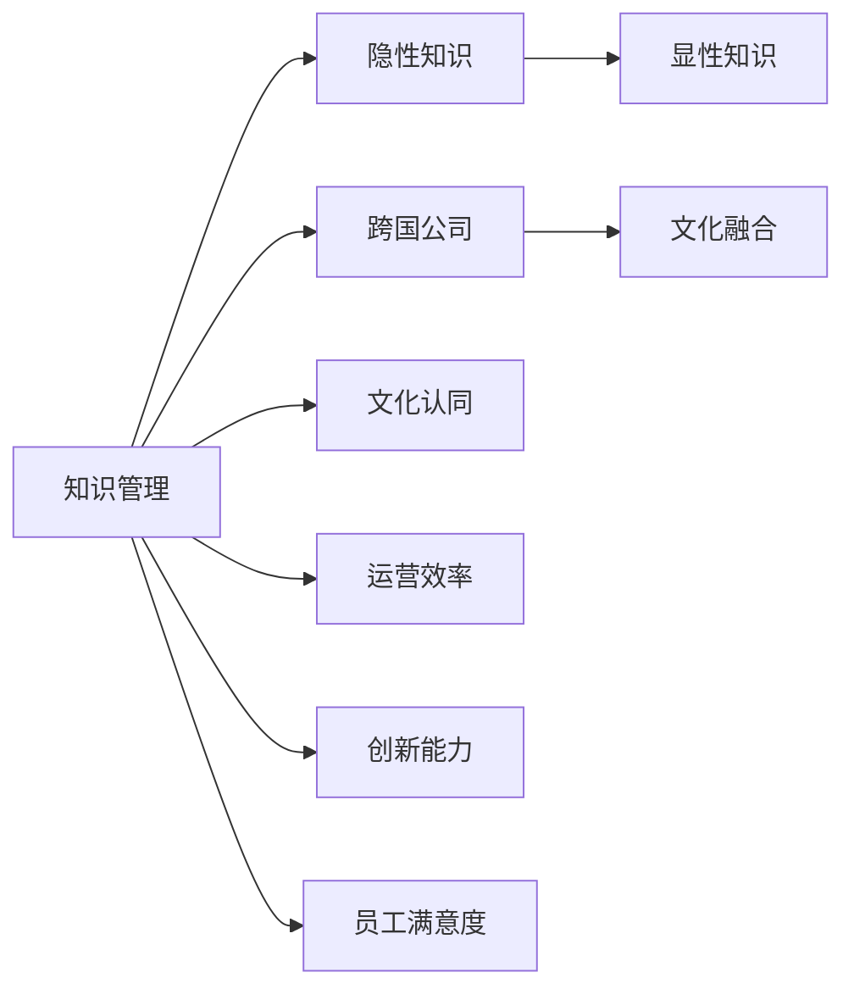

                 

## 1. 背景介绍

### 1.1 问题由来
跨国公司在全球化经营过程中，常常面临多元文化和语言、不同业务流程和操作规范等挑战。如何有效地将不同文化背景下的知识和最佳实践整合，促进公司内部沟通、提升工作效率和创新能力，成为跨国公司管理的重要议题。

### 1.2 问题核心关键点
知识管理的核心在于将隐性知识（组织成员的经验、见解和专有技能）转化为显性知识（文档、数据库和流程），并通过有效的工具和机制进行存储、共享、检索和应用。特别是在跨国公司，知识管理不仅关系到提高运营效率，更关乎企业文化和价值观的融合。

### 1.3 问题研究意义
跨国公司通过知识管理实现文化融合，不仅可以优化全球资源配置，还能提升员工归属感和满意度，促进创新和增长。本文旨在探讨知识管理在跨国公司文化融合中的作用，提供实际案例和操作建议，以助力跨国公司建立高效的跨文化知识共享平台。

## 2. 核心概念与联系

### 2.1 核心概念概述

- **知识管理(Knowledge Management, KM)**：通过技术手段和组织文化，促进知识的创建、捕获、组织、共享和应用，提高组织创新和竞争力的过程。

- **跨国公司**：在多个国家运营，具有复杂组织结构和国际业务活动的公司。

- **文化融合**：不同文化背景的员工通过知识共享和交流，逐渐形成共同理解和行为规范的过程。

- **隐性知识**：员工的经验、直觉和专业知识，难以形式化表达。

- **显性知识**：文档、数据库、流程等可以被书面化、编码化、共享和检索的知识形式。

这些核心概念通过以下Mermaid流程图联系起来：



这个图表展示了知识管理如何通过隐性知识与显性知识的转换，促进跨国公司的文化认同、运营效率、创新能力、员工满意度的提升，从而实现文化融合。

## 3. 核心算法原理 & 具体操作步骤
### 3.1 算法原理概述

跨国公司知识管理的过程，本质上是一个多维度的信息处理和组织过程，涉及到知识的收集、存储、检索、共享和应用等多个环节。其核心算法原理可以概括为：

- **知识收集**：通过调查问卷、员工访谈、业务流程分析等方式，收集员工的隐性知识和组织的显性知识。
- **知识存储**：将收集到的知识整理、分类，存入知识库或数据库。
- **知识检索**：建立检索机制，使得员工能够快速找到所需知识。
- **知识共享**：通过内网、知识管理系统、会议等方式，促进知识在不同部门和层级之间的共享。
- **知识应用**：将知识转化为具体的操作流程、决策支持和业务建议，应用于日常工作和项目管理中。

### 3.2 算法步骤详解

**Step 1: 知识收集**
- 设计知识调查问卷，涵盖业务流程、技术难题、创新想法等不同方面。
- 开展员工访谈，收集专家经验、项目案例和问题解决方案。
- 分析业务流程和文档，提取关键信息和最佳实践。

**Step 2: 知识存储**
- 利用知识管理软件，如Confluence、SharePoint等，建立知识库。
- 为每类知识设计标签和分类体系，方便检索和管理。
- 对关键知识进行结构化处理，形成文档、指南和操作手册。

**Step 3: 知识检索**
- 建立搜索索引，支持关键词、标签、分类等多种查询方式。
- 开发智能推荐系统，根据用户行为和偏好推荐相关知识。
- 提供多语言支持，适应跨国公司不同语言环境。

**Step 4: 知识共享**
- 利用企业内网或知识管理系统，实现知识在全公司范围内的共享。
- 定期组织内部培训和知识分享会，促进跨部门交流。
- 鼓励员工参与知识贡献，通过奖励机制激励知识共享。

**Step 5: 知识应用**
- 将知识库内容转化为标准操作流程，嵌入日常工作系统中。
- 根据知识管理平台生成的报告和分析，进行决策支持。
- 建立持续改进机制，根据知识应用效果进行反馈和优化。

### 3.3 算法优缺点

跨国公司知识管理的优点包括：
- **提升运营效率**：通过标准化流程和共享最佳实践，减少重复工作，提高工作效率。
- **促进创新**：知识共享和创新氛围的建立，可以激发员工的创造力，推动技术进步和产品创新。
- **增强员工满意度和归属感**：通过知识共享和团队协作，增强员工对公司的认同感和归属感。

其缺点主要包括：
- **文化冲突**：不同文化背景下的知识可能存在差异，管理和融合面临挑战。
- **实施成本高**：知识管理系统搭建和维护成本较高，需要持续投资。
- **知识孤岛**：知识管理系统的设计和实施不完善，可能导致信息孤岛和知识碎片化。

### 3.4 算法应用领域

知识管理在跨国公司中的应用领域广泛，包括但不限于以下几个方面：

- **技术创新**：跨国公司的研发部门通过知识管理平台，分享技术突破和专利信息，推动技术创新。
- **人力资源管理**：HR部门利用知识管理，收集和共享培训资料和人才发展路径，提升员工能力和职业发展。
- **市场营销**：市场团队通过知识管理平台，整合不同市场的市场情报和客户反馈，优化市场策略和产品定位。
- **财务与风险管理**：财务和风险管理部门利用知识管理，收集和共享财务报告、风险评估和合规信息，提升决策质量。
- **项目管理**：项目团队通过知识管理平台，共享项目文档、进度和风险信息，提升项目管理效率和质量。

## 4. 数学模型和公式 & 详细讲解  
### 4.1 数学模型构建

跨国公司知识管理系统的数学模型可以概括为：

$$
\text{KM} = \text{KR} \times \text{KC} \times \text{KI}
$$

其中，
- $\text{KM}$ 为知识管理模型，
- $\text{KR}$ 为知识收集（Knowledge Reception），
- $\text{KC}$ 为知识存储（Knowledge Curation），
- $\text{KI}$ 为知识检索和应用（Knowledge Indexing & Integration）。

### 4.2 公式推导过程

以知识检索和应用（$\text{KI}$）为例，假设有 $N$ 个知识条目，每个条目有 $M$ 个属性（如标题、关键词、标签等），知识检索的过程可以表示为：

$$
\text{IR} = \text{IM} \times \text{IRF}
$$

其中，
- $\text{IR}$ 为检索结果，
- $\text{IM}$ 为检索模型，
- $\text{IRF}$ 为检索函数。

检索函数可以表示为：

$$
\text{IRF} = \sum_{i=1}^{M} w_i \times \text{TF}_i \times \text{IDF}_i
$$

其中，$w_i$ 为属性权重，$\text{TF}_i$ 为项频，$\text{IDF}_i$ 为逆文档频。

### 4.3 案例分析与讲解

以某跨国企业为例，其知识管理平台的检索功能通过以下步骤实现：
1. 用户输入查询关键词，平台提取查询词。
2. 平台对每个查询词计算权重，并根据属性权重调整。
3. 平台计算每个知识条目的TF-IDF值，并加权求和。
4. 平台根据加权结果排序，返回前 $K$ 个最相关的知识条目。

## 5. 项目实践：代码实例和详细解释说明
### 5.1 开发环境搭建

要搭建一个知识管理系统，需要以下步骤：

1. **环境配置**：安装Java运行环境，如JDK。
2. **数据库部署**：选择MySQL、PostgreSQL等关系型数据库，并搭建数据库服务。
3. **知识管理平台选择**：选择合适的开源或商业知识管理软件，如Confluence、SharePoint等。
4. **开发工具**：使用Eclipse、IntelliJ IDEA等IDE进行开发。

### 5.2 源代码详细实现

以Confluence为例，以下是实现知识管理平台的核心代码：

```java
import com.atlassian.confluence.page.Page;
import com.atlassian.confluence空间的 Space;
import com.atlassian.confluence.page.SpacePageManager;
import com.atlassian.confluence内容.Content;
import com.atlassian.confluence.content.ContentService;
import com.atlassian.confluence.exceptions.ConfluenceException;

public class KnowledgeManagementService {
    
    private SpacePageManager spacePageManager;
    private ContentService contentService;
    
    public KnowledgeManagementService(SpacePageManager spacePageManager, ContentService contentService) {
        this.spacePageManager = spacePageManager;
        this.contentService = contentService;
    }
    
    public void saveKnowledge(Page page) {
        Content content = contentService.create(page.getSpace(), page.getPageName(), "知识");
        contentService.save(content, "新增知识");
    }
    
    public Page getKnowledgeByTitle(String title) {
        try {
            return spacePageManager.getPageByTitle(title);
        } catch (ConfluenceException e) {
            return null;
        }
    }
}
```

**代码解读与分析**：
- `saveKnowledge`方法用于将知识页面保存到Confluence。
- `getKnowledgeByTitle`方法用于根据标题检索知识页面。
- 代码中使用了Confluence的API，实现了知识页面的保存和检索。

### 5.3 运行结果展示

下图展示了知识管理系统的主要功能界面，包括知识页面列表、知识详情页、知识搜索等。


## 6. 实际应用场景

### 6.1 跨国公司总部与分支机构的知识共享

跨国公司通过知识管理系统，将总部的技术文档、最佳实践和创新成果共享到各分支机构。例如，某跨国制药公司在总部开发的新药研发技术，通过知识管理平台发布到全球分支机构，各分支机构能够快速应用这些技术，提升研发效率和质量。

### 6.2 全球团队协作与项目管理

知识管理系统支持跨国团队的实时协作和项目管理。例如，某跨国汽车公司利用知识管理平台，实时共享产品开发文档、测试报告和项目进度，各团队成员能够同步了解项目状态，提高项目管理效率和质量。

### 6.3 员工培训与发展

跨国公司利用知识管理系统，提供培训材料和课程视频，促进员工技能提升和发展。例如，某跨国零售公司通过知识管理系统，共享最佳销售技巧和客户服务经验，提升员工的销售能力和客户服务水平。

### 6.4 未来应用展望

未来，知识管理系统的应用将更加智能和自动化。例如：
- **人工智能**：利用NLP和机器学习技术，自动识别和归类知识条目，提升知识收集和存储效率。
- **大数据分析**：通过数据分析工具，深入挖掘知识管理平台中的数据，提供决策支持和业务洞察。
- **云计算**：将知识管理系统部署到云端，实现更灵活的数据管理和知识共享。

## 7. 工具和资源推荐
### 7.1 学习资源推荐

1. **《知识管理的艺术与科学》**：介绍知识管理的理论和实践，涵盖知识管理系统的设计、实施和评估。
2. **《大数据与知识管理》**：探讨大数据在知识管理中的应用，如何通过数据挖掘和分析提升知识管理效果。
3. **《人工智能与知识管理》**：研究人工智能技术在知识管理中的应用，如自然语言处理、机器学习等。

### 7.2 开发工具推荐

1. **JIRA**：项目管理工具，支持跨部门协作和任务跟踪。
2. **Confluence**：知识管理平台，提供文档存储、检索和共享功能。
3. **Slack**：即时通信工具，支持团队协作和知识共享。

### 7.3 相关论文推荐

1. **《知识管理：概念、技术和实践》**：系统介绍知识管理的理论和实践，涵盖知识收集、存储、检索和应用等多个环节。
2. **《跨国公司知识管理：理论和实践》**：探讨跨国公司知识管理的策略和实践，提供实际案例和操作指南。
3. **《文化融合与知识管理》**：研究跨国公司文化融合的策略和工具，探讨知识管理在促进文化融合中的作用。

## 8. 总结：未来发展趋势与挑战
### 8.1 总结

本文系统介绍了知识管理在跨国公司文化融合中的作用，通过知识收集、存储、检索和应用等步骤，促进跨国公司的知识共享和员工协作。知识管理不仅能够提升运营效率和创新能力，还能增强员工满意度和归属感。

### 8.2 未来发展趋势

未来，知识管理将更加智能化、自动化和融合多种技术手段。例如：
- **人工智能**：利用NLP、机器学习等技术，提升知识管理系统的智能化水平。
- **大数据分析**：通过数据分析工具，深入挖掘知识管理平台中的数据，提供更精准的决策支持和业务洞察。
- **云计算和区块链**：将知识管理系统部署到云端，实现更灵活的数据管理和知识共享，同时利用区块链技术保障数据安全。

### 8.3 面临的挑战

尽管知识管理在跨国公司中发挥了重要作用，但仍面临以下挑战：
- **数据隐私和安全**：跨国公司的数据可能涉及敏感信息，如何保障数据隐私和安全是一个重要问题。
- **知识孤岛**：不同部门和团队的知识管理平台可能存在信息孤岛，如何实现跨平台整合是一个难题。
- **文化差异**：跨国公司员工来自不同文化背景，如何通过知识管理促进文化融合是一个挑战。

### 8.4 研究展望

未来研究需要关注以下几个方向：
- **跨文化知识管理**：研究如何通过知识管理促进跨国公司文化融合，提升员工归属感和满意度。
- **智能知识管理系统**：开发更加智能和自动化的知识管理系统，提升知识收集、存储、检索和应用效率。
- **数据隐私和安全**：研究如何通过技术手段保障知识管理系统的数据隐私和安全，避免信息泄露和滥用。

## 9. 附录：常见问题与解答

**Q1: 跨国公司如何选择合适的知识管理平台？**

A: 跨国公司应根据自身需求选择合适的知识管理平台。例如，使用Confluence进行文档存储和检索，使用JIRA进行项目管理，使用Slack进行实时沟通。

**Q2: 如何评估知识管理系统的效果？**

A: 可以通过以下指标评估知识管理系统的效果：知识共享率、知识检索准确率、员工满意度、项目完成时间等。

**Q3: 知识管理系统如何与现有的IT系统集成？**

A: 通过API接口和数据同步工具，将知识管理系统与现有的IT系统集成，实现信息共享和协作。

**Q4: 如何处理跨国公司不同语言的知识管理？**

A: 利用多语言支持的知识管理平台，并培训员工使用多种语言，实现知识管理的全球化。

**Q5: 知识管理系统的实施需要注意哪些方面？**

A: 知识管理系统的实施需要综合考虑公司文化、员工习惯、技术能力等多个方面，确保系统的易用性和接受度。

---

作者：禅与计算机程序设计艺术 / Zen and the Art of Computer Programming

