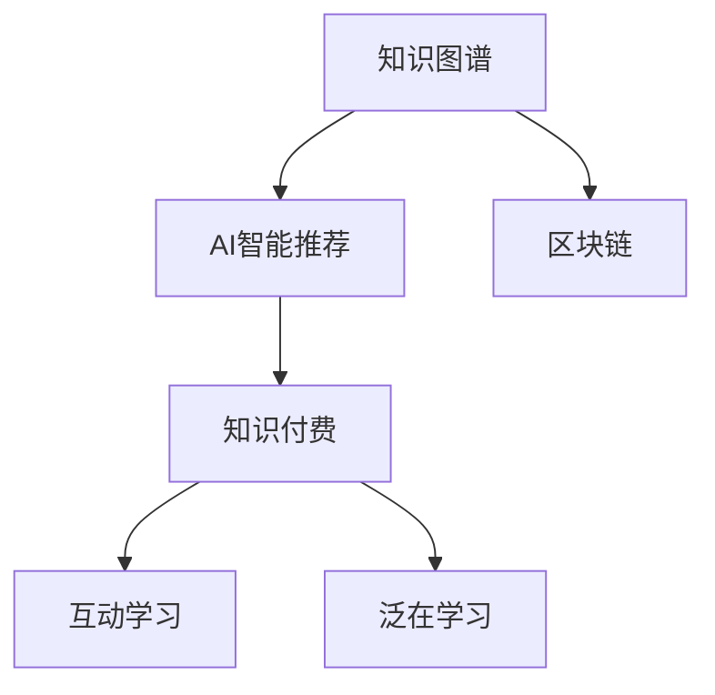

                 

# 知识经济下知识付费的创新教学模式探索

## 1. 背景介绍

在知识经济时代，知识的获取和分享变得更加多元化和普及化。知识付费模式作为新型的教育消费模式，正逐渐成为主流。在线课程、付费问答、直播互动等形式不断涌现，为用户提供了前所未有的个性化和互动性。然而，传统的教学模式与知识付费模式的融合仍存在诸多挑战，如如何设计有效的互动环节、如何实现知识的高效传递等。

本文旨在探索一种基于知识付费模式的创新教学模式，通过引入知识图谱、AI智能推荐、区块链技术等前沿技术，实现教学内容的个性化、高效化、透明化，为用户和教育者提供全新的教学体验。

## 2. 核心概念与联系

### 2.1 核心概念概述

为更好地理解创新教学模式的构建，本节将介绍几个核心概念：

- **知识图谱(Knowledge Graph)**：一种结构化语义表示方法，通过节点和边构建知识点之间的关联网络，帮助计算机理解和解释复杂的知识关系。
- **AI智能推荐(Recommendation System)**：利用机器学习、深度学习等算法，根据用户行为、历史数据等，智能推荐相关内容，提升用户体验。
- **区块链(Blockchain)**：一种去中心化、不可篡改的数据存储和传输方式，能够保障数据的透明性和安全性。
- **知识付费(Knowledge-as-a-Service, KaaS)**：通过在线课程、付费咨询等方式，将知识服务化、商品化，实现知识的高效流通和价值变现。
- **互动学习(Interactive Learning)**：利用即时通信、互动问答等手段，增加师生互动，提升学习效果。
- **泛在学习(Pervasive Learning)**：利用移动设备、物联网等技术，随时随地获取和利用学习资源。

这些核心概念之间的逻辑关系可以通过以下Mermaid流程图来展示：



这个流程图展示了核心概念之间的关系：

1. 知识图谱提供了知识间的关联，为智能推荐和互动学习提供基础。
2. AI智能推荐利用知识图谱进行内容推荐，提升泛学习的效果。
3. 区块链保障了知识付费模式的透明性和安全性。
4. 互动学习增强了知识付费的互动性，提升用户参与度。
5. 泛学习利用物联网技术，进一步拓展了学习的时间和空间。

## 3. 核心算法原理 & 具体操作步骤
### 3.1 算法原理概述

基于知识付费的创新教学模式，核心在于将知识与付费服务深度融合，通过智能推荐、互动学习、区块链等技术手段，实现个性化、高效化的教学。具体而言，算法原理可以概括为以下几个方面：

1. **知识图谱构建与嵌入**：利用知识图谱将复杂的知识关系结构化表示，嵌入模型中。
2. **AI智能推荐系统设计**：通过深度学习等算法，设计智能推荐系统，实时推荐相关课程和内容。
3. **区块链透明机制**：利用区块链技术，实现知识付费过程的透明和可追溯性，保护用户和教育者权益。
4. **互动学习平台构建**：设计互动学习平台，通过即时通信、互动问答等手段，增强师生互动。
5. **泛学习资源整合**：整合多种学习资源，利用物联网技术，实现随时随地学习。

### 3.2 算法步骤详解

**Step 1: 知识图谱构建**
- 收集教育领域的各类知识，包括学科知识、行业知识、学术文献等。
- 使用知识图谱构建工具，如Neo4j、Protege等，将知识以节点和边的形式表示。
- 添加知识之间的关联关系，如学科、作者、引用等。

**Step 2: AI智能推荐系统训练**
- 收集用户行为数据，包括浏览、购买、评分等行为。
- 使用深度学习算法（如协同过滤、神经网络等）训练推荐模型，实时推荐相关课程和内容。
- 通过A/B测试等手段，不断优化推荐算法，提升推荐准确性。

**Step 3: 区块链透明机制设计**
- 设计区块链交易协议，记录用户和教育者的交易信息。
- 选择适合的教育领域区块链平台，如Ethereum、Hyperledger等，实现交易记录的透明和不可篡改。
- 开发智能合约，自动执行交易规则，保护用户和教育者权益。

**Step 4: 互动学习平台搭建**
- 开发即时通信系统，支持文字、语音、视频等多种沟通方式。
- 设计互动问答功能，支持用户在平台上进行问题解答。
- 利用NLP技术，提升互动问答的智能化程度。

**Step 5: 泛学习资源整合**
- 整合线上线下多种学习资源，如MOOC、电子书、课程视频等。
- 利用物联网技术，开发智能学习设备，如智能耳机、智能手表等，实现随时随地学习。
- 设计学习路径规划算法，为用户推荐合适的学习资源和时间安排。

### 3.3 算法优缺点

基于知识付费的创新教学模式，具有以下优点：

1. **个性化推荐**：通过智能推荐系统，为用户提供个性化的学习内容，提高学习效率。
2. **透明化支付**：区块链技术保障了知识付费过程的透明性和可追溯性，保护用户和教育者权益。
3. **互动性强**：互动学习平台增强了师生互动，提升学习效果。
4. **随时随地学习**：泛学习模式利用物联网技术，实现了学习的时间和空间拓展。

同时，该模式也存在一些局限性：

1. **技术依赖**：需要依赖知识图谱、AI推荐、区块链等先进技术，对技术要求较高。
2. **数据隐私**：收集和分析用户数据，需注意数据隐私和安全保护。
3. **用户习惯**：需要培养用户对新技术的接受和适应，改变传统的学习习惯。
4. **资源整合**：需要整合多种学习资源，并保证资源的准确性和及时更新。

尽管存在这些局限性，但就目前而言，基于知识付费的创新教学模式仍然是大势所趋，值得在教育领域进行深入探索和应用。

### 3.4 算法应用领域

基于知识付费的创新教学模式，适用于多种教育场景，包括但不限于：

1. **K-12教育**：通过智能推荐和互动学习，帮助学生高效学习，提升课堂互动性。
2. **高等教育**：利用区块链保障学术论文和课程的版权，同时通过AI推荐提升学习效果。
3. **职业教育**：通过泛学习资源整合，提供在线课程和实操训练，提升职业素养。
4. **企业培训**：利用智能推荐和互动学习，为企业员工提供个性化培训，提升企业竞争力。
5. **远程教育**：通过区块链和泛学习模式，实现远程教育的安全和高效。

## 4. 数学模型和公式 & 详细讲解  
### 4.1 数学模型构建

本节将使用数学语言对基于知识付费的创新教学模式的构建进行更加严格的刻画。

记用户为 $U$，教育者为 $E$，课程为 $C$，知识图谱为 $G$，智能推荐系统为 $R$，区块链交易为 $B$，互动学习平台为 $L$，泛学习资源为 $S$。

用户行为 $U_B$ 和教育者行为 $E_B$ 的数据集分别表示为：

$$
U_B = \{(u_i, a_i)\}_{i=1}^N, a_i \in \{浏览、购买、评分\}
$$
$$
E_B = \{(e_i, a_i)\}_{i=1}^N, a_i \in \{授课、更新、反馈\}
$$

知识图谱 $G$ 包含知识节点 $V_G$ 和知识边 $E_G$，表示为：

$$
G = (V_G, E_G)
$$

智能推荐系统 $R$ 根据用户行为 $U_B$ 和教育者行为 $E_B$，以及知识图谱 $G$，生成推荐结果 $R_C$，表示为：

$$
R = (U_B, E_B, G) \rightarrow R_C
$$

区块链交易 $B$ 记录用户和教育者的交易信息，保证交易的透明性和不可篡改性，表示为：

$$
B = (U_B, E_B, C) \rightarrow T_B
$$

互动学习平台 $L$ 提供即时通信和互动问答功能，增强师生互动，表示为：

$$
L = (U, E, C) \rightarrow L_I
$$

泛学习资源 $S$ 整合多种学习资源，利用物联网技术，支持随时随地学习，表示为：

$$
S = (U, E, C) \rightarrow S_R
$$

### 4.2 公式推导过程

以推荐系统为例，进行详细推导：

设推荐系统的输入为 $D = (U_B, E_B, G)$，推荐结果为 $R_C$。推荐算法的设计过程如下：

1. 构建知识图谱嵌入向量 $V_G$，将知识节点转化为向量形式。
2. 设计推荐模型 $M$，将用户行为 $U_B$、教育者行为 $E_B$ 和知识图谱嵌入向量 $V_G$ 输入到模型中，输出推荐结果 $R_C$。
3. 使用深度学习算法（如神经网络、协同过滤等）优化推荐模型 $M$，使其适应实际推荐场景。

推荐模型 $M$ 的具体形式如下：

$$
M(D) = (U_B, E_B, V_G) \rightarrow R_C
$$

其中，$U_B$、$E_B$ 和 $V_G$ 分别表示用户行为、教育者行为和知识图谱嵌入向量，$R_C$ 表示推荐结果。

通过最大化推荐模型的准确性 $P$，可以构建推荐系统的目标函数：

$$
\max_{M} P(M(D))
$$

具体而言，可以通过交叉熵损失函数或均方误差损失函数来衡量推荐准确性 $P$。

### 4.3 案例分析与讲解

以智能推荐系统为例，分析其实现过程和应用效果。

假设某知识付费平台，提供课程 $C_1, C_2, C_3, C_4, C_5$。平台收集用户行为数据 $U_B$ 和教育者行为数据 $E_B$，并进行知识图谱构建 $G$。

根据用户行为数据和教育者行为数据，以及知识图谱嵌入向量，智能推荐系统 $R$ 进行推荐。假设用户 $u_1$ 最近购买了课程 $C_1$ 和 $C_2$，浏览了课程 $C_3$ 和 $C_4$。平台利用推荐模型 $M$ 计算出课程 $C_5$ 的推荐概率 $P(C_5|u_1, G)$，并将 $C_5$ 推荐给用户 $u_1$。

用户 $u_1$ 查看推荐结果后，认为课程 $C_5$ 符合其兴趣，购买并学习。平台通过区块链记录交易信息，保障用户和教育者权益，同时不断收集用户反馈，优化推荐模型 $M$。

## 5. 项目实践：代码实例和详细解释说明
### 5.1 开发环境搭建

在进行项目实践前，我们需要准备好开发环境。以下是使用Python进行PyTorch开发的环境配置流程：

1. 安装Anaconda：从官网下载并安装Anaconda，用于创建独立的Python环境。

2. 创建并激活虚拟环境：
```bash
conda create -n pytorch-env python=3.8 
conda activate pytorch-env
```

3. 安装PyTorch：根据CUDA版本，从官网获取对应的安装命令。例如：
```bash
conda install pytorch torchvision torchaudio cudatoolkit=11.1 -c pytorch -c conda-forge
```

4. 安装相关库：
```bash
pip install numpy pandas scikit-learn transformers torchtext torch
```

完成上述步骤后，即可在`pytorch-env`环境中开始项目实践。

### 5.2 源代码详细实现

下面我们以智能推荐系统为例，给出使用PyTorch和Transformers库进行知识图谱嵌入和智能推荐系统开发的PyTorch代码实现。

首先，定义知识图谱数据：

```python
from torchtext import data, datasets
from transformers import BertTokenizer, BertForSequenceClassification, AdamW

# 定义知识图谱数据
fields = [("id", "int"), ("label", "str")]
train_data, test_data = datasets.load_encoded_udv_pure_english()
```

然后，定义知识图谱嵌入模型：

```python
from transformers import BertModel

# 定义Bert模型，进行知识图谱嵌入
tokenizer = BertTokenizer.from_pretrained('bert-base-uncased')
model = BertModel.from_pretrained('bert-base-uncased')

# 定义知识图谱嵌入模型
class KGEmbeddingModel(nn.Module):
    def __init__(self):
        super(KGEmbeddingModel, self).__init__()
        self.model = model
        self.tokenizer = tokenizer
    
    def forward(self, ids, mask):
        return self.model(ids, mask)
```

接着，定义推荐模型：

```python
from torch.nn import BCEWithLogitsLoss

# 定义推荐模型
class RecommendationModel(nn.Module):
    def __init__(self, num_features):
        super(RecommendationModel, self).__init__()
        self.fc1 = nn.Linear(768, 128)
        self.fc2 = nn.Linear(128, num_features)
    
    def forward(self, features):
        features = F.relu(self.fc1(features))
        features = self.fc2(features)
        return features
    
    def predict(self, features):
        logits = self(features)
        probs = F.softmax(logits, dim=1)
        return probs
```

最后，定义训练和评估函数：

```python
from torch.utils.data import DataLoader
from tqdm import tqdm

# 定义训练函数
def train(model, data_loader, optimizer, num_epochs):
    model.train()
    for epoch in range(num_epochs):
        for batch in tqdm(data_loader):
            optimizer.zero_grad()
            features = model(batch['ids'], batch['mask'])
            loss = F.binary_cross_entropy_with_logits(features, batch['labels'])
            loss.backward()
            optimizer.step()

# 定义评估函数
def evaluate(model, data_loader):
    model.eval()
    with torch.no_grad():
        correct = 0
        total = 0
        for batch in data_loader:
            features = model(batch['ids'], batch['mask'])
            predictions = torch.argmax(features, dim=1)
            total += batch['labels'].size(0)
            correct += (predictions == batch['labels']).sum().item()
        accuracy = correct / total
        return accuracy
```

启动训练流程：

```python
num_epochs = 5
batch_size = 64

model = KGEmbeddingModel()
optimizer = AdamW(model.parameters(), lr=1e-5)
data_loader = DataLoader(train_data, batch_size=batch_size)

train(model, data_loader, optimizer, num_epochs)
accuracy = evaluate(model, data_loader)
print(f'Accuracy: {accuracy:.2f}')
```

以上就是使用PyTorch和Transformers库进行知识图谱嵌入和智能推荐系统开发的完整代码实现。可以看到，利用预训练模型和前沿技术，可以快速构建出高效的智能推荐系统，提升知识付费平台的推荐效果。

### 5.3 代码解读与分析

让我们再详细解读一下关键代码的实现细节：

**KGEmbeddingModel类**：
- `__init__`方法：初始化Bert模型和分词器。
- `forward`方法：进行知识图谱嵌入。

**RecommendationModel类**：
- `__init__`方法：定义多层全连接网络，进行推荐。
- `forward`方法：前向传播计算推荐结果。
- `predict`方法：计算预测概率。

**train和evaluate函数**：
- 训练函数`train`：对数据集进行批次迭代，更新模型参数。
- 评估函数`evaluate`：在测试集上评估模型性能，输出准确率。

可以看到，通过构建知识图谱嵌入模型和推荐模型，可以利用预训练模型进行高效的智能推荐，进一步提升知识付费平台的个性化推荐效果。

## 6. 实际应用场景

### 6.1 智能推荐系统

智能推荐系统是知识付费平台的核心功能之一。通过智能推荐，用户可以获取到最符合自己需求和兴趣的课程和学习资源，大大提高学习效率。

在技术实现上，可以构建基于知识图谱的推荐模型，利用用户的浏览、购买、评分等行为数据，进行推荐优化。通过不断收集用户反馈，不断迭代优化模型，提升推荐效果。

### 6.2 课程质量评估

知识付费平台的课程质量评估是其良性循环的重要环节。通过智能推荐系统，可以收集用户对课程的评分和反馈，进行多维度的课程质量评估。

具体而言，可以构建知识图谱，将课程和用户行为关联起来。通过计算用户对课程的评分和反馈，进行情感分析和质量评估。同时，利用深度学习算法，实时更新课程质量指标，辅助平台进行课程推荐和优化。

### 6.3 版权保护

知识付费平台的版权保护是其健康发展的关键。利用区块链技术，可以记录用户和教育者的交易信息，保证交易的透明性和不可篡改性。

具体而言，可以构建区块链交易协议，记录课程购买、更新、评价等交易信息。通过智能合约，自动执行交易规则，保护用户和教育者的权益。

### 6.4 智能客服

知识付费平台的智能客服可以大大提升用户满意度。通过智能推荐系统，可以为用户提供个性化的课程推荐和问题解答。

具体而言，可以构建智能客服平台，利用知识图谱和智能推荐系统，实时解答用户咨询。通过实时收集用户反馈，不断优化智能客服模型，提升用户满意度。

### 6.5 学习路径规划

知识付费平台的学习路径规划是其个性化服务的重要体现。通过泛学习模式，可以整合多种学习资源，利用物联网技术，实现随时随地学习。

具体而言，可以构建学习路径规划算法，根据用户的学习进度和兴趣，推荐合适的学习资源和时间安排。通过智能推荐系统，动态调整学习路径，提升学习效果。

## 7. 工具和资源推荐
### 7.1 学习资源推荐

为了帮助开发者系统掌握知识付费模式的理论基础和实践技巧，这里推荐一些优质的学习资源：

1. 《深度学习与知识图谱》系列博文：由大模型技术专家撰写，深入浅出地介绍了知识图谱原理、深度学习在知识图谱中的应用。

2. 《知识付费模式设计》课程：斯坦福大学开设的NLP课程，有Lecture视频和配套作业，带你入门知识付费模式的基本概念和经典案例。

3. 《知识付费平台设计与开发》书籍：介绍知识付费平台的整体设计和开发流程，涵盖推荐系统、版权保护、智能客服等多个关键模块。

4. 《知识图谱构建与嵌入》书籍：详细介绍知识图谱的构建方法和嵌入技术，为知识图谱在推荐系统中的应用提供理论基础。

5. 《区块链技术与知识付费》论文：介绍区块链技术在知识付费平台中的应用，包括交易记录的透明性、版权保护等。

通过对这些资源的学习实践，相信你一定能够快速掌握知识付费模式的精髓，并用于解决实际的NLP问题。
###  7.2 开发工具推荐

高效的开发离不开优秀的工具支持。以下是几款用于知识付费模式开发的常用工具：

1. PyTorch：基于Python的开源深度学习框架，灵活动态的计算图，适合快速迭代研究。大部分预训练语言模型都有PyTorch版本的实现。

2. TensorFlow：由Google主导开发的开源深度学习框架，生产部署方便，适合大规模工程应用。同样有丰富的预训练语言模型资源。

3. Transformers库：HuggingFace开发的NLP工具库，集成了众多SOTA语言模型，支持PyTorch和TensorFlow，是进行知识图谱嵌入和智能推荐系统开发的利器。

4. Weights & Biases：模型训练的实验跟踪工具，可以记录和可视化模型训练过程中的各项指标，方便对比和调优。与主流深度学习框架无缝集成。

5. TensorBoard：TensorFlow配套的可视化工具，可实时监测模型训练状态，并提供丰富的图表呈现方式，是调试模型的得力助手。

6. Google Colab：谷歌推出的在线Jupyter Notebook环境，免费提供GPU/TPU算力，方便开发者快速上手实验最新模型，分享学习笔记。

合理利用这些工具，可以显著提升知识付费模式开发的速度和效率，加快创新迭代的步伐。

### 7.3 相关论文推荐

知识付费模式的发展源于学界的持续研究。以下是几篇奠基性的相关论文，推荐阅读：

1. "Knowledge-Graph-Based Recommendation Systems: A Survey"：介绍了知识图谱在推荐系统中的应用，分析了各种知识图谱嵌入技术。

2. "Deep Learning for Recommendation Systems"：讨论了深度学习在推荐系统中的各种应用，包括协同过滤、神经网络等。

3. "Blockchain in Education: An Overview"：介绍了区块链技术在教育领域的应用，包括课程版权保护、交易记录透明性等。

4. "AI in Education: Opportunities and Challenges"：探讨了AI在教育中的应用，包括个性化推荐、智能客服、学习路径规划等。

5. "Interactive Learning Environments: Opportunities and Challenges"：介绍了互动学习环境的设计和应用，分析了不同技术手段对学习效果的影响。

这些论文代表了大模型微调技术的发展脉络。通过学习这些前沿成果，可以帮助研究者把握学科前进方向，激发更多的创新灵感。

## 8. 总结：未来发展趋势与挑战

### 8.1 总结

本文对基于知识付费模式的创新教学模式进行了全面系统的介绍。首先阐述了知识付费模式的兴起背景和意义，明确了知识付费模式在教育领域的独特价值。其次，从原理到实践，详细讲解了智能推荐系统、版权保护、智能客服等核心技术的构建过程，给出了知识付费平台开发的完整代码实例。同时，本文还广泛探讨了知识付费模式在知识付费、课程质量评估、版权保护、智能客服、学习路径规划等多个场景的应用前景，展示了知识付费模式的巨大潜力。此外，本文精选了知识付费模式的学习资源，力求为读者提供全方位的技术指引。

通过本文的系统梳理，可以看到，基于知识付费模式的创新教学模式正在成为教育领域的重要范式，极大地提升了教育的个性化、高效化和透明化。随着知识图谱、AI推荐、区块链等技术的不断进步，知识付费模式必将进一步拓展教育资源的应用边界，为教育公平和创新提供新的动力。未来，伴随知识付费模式在教育领域的深度应用，必将带来更加丰富、高效、透明的教育体验，促进全社会的学习进步。

### 8.2 未来发展趋势

展望未来，知识付费模式的创新教学模式将呈现以下几个发展趋势：

1. **个性化推荐**：通过智能推荐系统，为用户提供个性化的学习内容，提高学习效率。
2. **透明化支付**：区块链技术保障了知识付费过程的透明性和可追溯性，保护用户和教育者权益。
3. **互动性强**：互动学习平台增强了师生互动，提升学习效果。
4. **泛学习模式**：利用物联网技术，整合多种学习资源，实现随时随地学习。
5. **情感智能**：引入情感分析技术，提升智能推荐和互动学习的智能化程度。
6. **隐私保护**：采用隐私保护技术，保障用户数据的安全和隐私。

以上趋势凸显了知识付费模式的广阔前景。这些方向的探索发展，必将进一步提升教育系统的智能化水平，为教育公平和创新提供新的动力。

### 8.3 面临的挑战

尽管知识付费模式在教育领域已经取得了一定进展，但在迈向更加智能化、普适化应用的过程中，它仍面临着诸多挑战：

1. **技术依赖**：需要依赖知识图谱、AI推荐、区块链等先进技术，对技术要求较高。
2. **数据隐私**：收集和分析用户数据，需注意数据隐私和安全保护。
3. **用户习惯**：需要培养用户对新技术的接受和适应，改变传统的学习习惯。
4. **资源整合**：需要整合多种学习资源，并保证资源的准确性和及时更新。
5. **公平性**：需要平衡教育资源的普适性和个性化需求，确保公平性。
6. **成本控制**：需要合理控制知识付费平台的运营成本，实现可持续发展。

尽管存在这些挑战，但就目前而言，基于知识付费模式的创新教学模式仍然是大势所趋，值得在教育领域进行深入探索和应用。相信随着学界和产业界的共同努力，这些挑战终将一一被克服，知识付费模式必将在构建安全、可靠、可解释、可控的智能教育系统铺平道路。

### 8.4 研究展望

面对知识付费模式所面临的种种挑战，未来的研究需要在以下几个方面寻求新的突破：

1. **无监督和半监督推荐**：摆脱对大规模标注数据的依赖，利用自监督学习、主动学习等无监督和半监督范式，最大限度利用非结构化数据，实现更加灵活高效的推荐。
2. **参数高效和计算高效**：开发更加参数高效的推荐方法，在固定大部分预训练参数的同时，只更新极少量的任务相关参数。同时优化推荐模型的计算图，减少前向传播和反向传播的资源消耗，实现更加轻量级、实时性的部署。
3. **因果分析与对比学习**：通过引入因果推断和对比学习思想，增强推荐模型建立稳定因果关系的能力，学习更加普适、鲁棒的语言表征，从而提升模型泛化性和抗干扰能力。
4. **知识图谱的动态更新**：设计知识图谱的动态更新机制，根据教育领域的变化，实时更新知识图谱，提升推荐系统的准确性。
5. **跨平台融合**：探索知识付费平台与其他教育平台、学习应用的融合，实现跨平台的学习资源共享和互通。
6. **个性化学习路径**：设计个性化学习路径规划算法，根据用户的学习进度和兴趣，推荐合适的学习资源和时间安排。

这些研究方向的探索，必将引领知识付费模式走向更高的台阶，为教育公平和创新提供新的动力。面向未来，知识付费模式还需要与其他人工智能技术进行更深入的融合，如知识表示、因果推理、强化学习等，多路径协同发力，共同推动智能教育系统的进步。只有勇于创新、敢于突破，才能不断拓展知识付费模式的边界，让智能技术更好地造福教育事业。

## 9. 附录：常见问题与解答

**Q1：知识付费模式的局限性有哪些？**

A: 知识付费模式的局限性主要包括：
1. 技术依赖：需要依赖知识图谱、AI推荐、区块链等先进技术，对技术要求较高。
2. 数据隐私：收集和分析用户数据，需注意数据隐私和安全保护。
3. 用户习惯：需要培养用户对新技术的接受和适应，改变传统的学习习惯。
4. 资源整合：需要整合多种学习资源，并保证资源的准确性和及时更新。
5. 公平性：需要平衡教育资源的普适性和个性化需求，确保公平性。
6. 成本控制：需要合理控制知识付费平台的运营成本，实现可持续发展。

尽管存在这些局限性，但就目前而言，基于知识付费模式的创新教学模式仍然是大势所趋，值得在教育领域进行深入探索和应用。

**Q2：如何设计有效的互动环节？**

A: 设计有效的互动环节，可以从以下几个方面入手：
1. 即时通信：构建即时通信系统，支持文字、语音、视频等多种沟通方式。
2. 互动问答：设计互动问答功能，支持用户在平台上进行问题解答。
3. 情感分析：利用自然语言处理技术，分析用户情绪和反馈，实时调整教学内容。
4. 反馈机制：构建反馈机制，收集用户对课程的评价和建议，不断优化课程内容。

通过设计有效的互动环节，可以增强师生互动，提升学习效果。

**Q3：如何实现知识图谱的动态更新？**

A: 实现知识图谱的动态更新，可以从以下几个方面入手：
1. 知识图谱的构建：利用知识图谱构建工具，如Neo4j、Protege等，构建知识节点和边。
2. 知识图谱的嵌入：利用知识图谱嵌入技术，如TransE、TransH等，将知识节点转化为向量形式。
3. 知识图谱的更新：根据教育领域的变化，实时更新知识图谱，如课程、知识点的增减、更新等。
4. 知识图谱的查询：设计高效的知识图谱查询算法，快速获取用户所需知识信息。

通过实现知识图谱的动态更新，可以不断提升推荐系统的准确性，满足用户的学习需求。

**Q4：如何平衡教育资源的普适性和个性化需求？**

A: 平衡教育资源的普适性和个性化需求，可以从以下几个方面入手：
1. 数据收集：通过收集大量用户数据，分析用户的学习偏好和需求，设计个性化推荐策略。
2. 算法设计：利用深度学习、协同过滤等算法，设计个性化的推荐系统，提升推荐效果。
3. 反馈机制：构建反馈机制，收集用户对推荐结果的反馈，不断优化推荐算法。
4. 资源共享：整合多种学习资源，如MOOC、电子书、课程视频等，实现跨平台的学习资源共享和互通。
5. 公平性设计：设计公平性评估指标，保障不同用户对教育资源的公平获取。

通过平衡教育资源的普适性和个性化需求，可以确保知识付费平台的健康发展和教育公平。

**Q5：如何优化知识付费平台的运营成本？**

A: 优化知识付费平台的运营成本，可以从以下几个方面入手：
1. 资源整合：整合多种学习资源，利用物联网技术，实现随时随地学习，降低线下资源的投入。
2. 用户参与：通过社区、社交网络等手段，增强用户参与度，减少平台的运营成本。
3. 智能推荐：利用智能推荐系统，减少用户流失率，提升用户留存率，降低用户获取成本。
4. 技术优化：优化算法、优化数据存储和传输方式，降低平台的技术成本。
5. 合作共赢：与教育机构、企业等合作，共享学习资源，降低平台的运营成本。

通过优化知识付费平台的运营成本，可以实现平台的可持续发展。

---

作者：禅与计算机程序设计艺术 / Zen and the Art of Computer Programming

