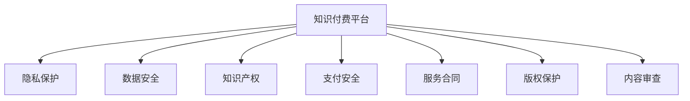

                 

# 知识经济下知识付费的法律风险防范

## 1. 背景介绍

在知识经济时代，知识付费成为一种重要的商业模式。平台如得到、知乎、喜马拉雅等，依靠知识付费变现，为知识创造者提供变现渠道，同时也为知识需求者提供更专业、高效的学习资源。然而，知识付费商业模式在法律风险防范方面面临诸多挑战。

首先，知识付费平台涉及大量用户信息、支付信息、内容信息等，对平台隐私保护、数据安全、版权保护、支付安全等都有较高要求。其次，知识付费平台交易双方法律关系复杂，涉及多个法律关系，如服务合同、知识产权、隐私保护等，需要通过法律手段进行规范和保护。最后，知识付费平台的知识产品形态特殊，涉及知识产权、版权、内容审查等，需要特殊处理和防范。

本博客从法律风险防范的角度，对知识付费平台的法律合规进行系统梳理，为知识付费平台提供法律合规指导，同时为知识付费平台的消费者和知识创作者提供权利保护建议。

## 2. 核心概念与联系

### 2.1 核心概念概述

**知识付费平台**：通过收取费用向用户提供知识产品的平台，如得到、知乎、喜马拉雅等。

**隐私保护**：在知识付费平台运营中，保护用户隐私，防止个人信息泄露。

**数据安全**：确保知识付费平台自身的数据安全，防止数据泄露、篡改等安全风险。

**知识产权**：在知识付费平台运营中，保护知识创作者的知识产权，防止侵权行为。

**支付安全**：保护知识付费平台与用户之间的交易安全，防止支付欺诈、窃取等风险。

**服务合同**：知识付费平台与用户之间的服务合同，明确双方的权利和义务。

**版权保护**：在知识付费平台运营中，保护知识内容的版权，防止侵权行为。

**内容审查**：对知识内容进行审查，确保内容合法、合规、健康。

以上概念之间的关系可以用以下Mermaid流程图表示：



这些核心概念相互关联，共同构成了知识付费平台的法律风险防范体系。

## 3. 核心算法原理 & 具体操作步骤

### 3.1 算法原理概述

知识付费平台的法律风险防范，主要通过以下两个方向进行：

1. **预防**：制定严格的法律合规流程和规范，确保平台的运营符合法律法规的要求。
2. **应对**：建立完善的法律风险应对机制，一旦发现法律风险，能够快速响应，减轻损失。

预防方向主要通过制定平台运营规范、制定法律合规流程等方式实现。应对方向主要通过建立法律合规团队、建立法律风险应对机制等方式实现。

### 3.2 算法步骤详解

**3.2.1 预防方向**

1. **制定平台运营规范**：制定平台运营规范，明确平台运营规则、流程、标准等，确保平台运营符合法律法规的要求。
2. **制定法律合规流程**：制定法律合规流程，确保平台运营过程中，每个环节都有相应的法律合规措施，防止法律风险。
3. **建立法律合规团队**：建立法律合规团队，负责平台运营中的法律合规工作，包括法律风险识别、评估、预警等。

**3.2.2 应对方向**

1. **建立法律合规团队**：建立法律合规团队，负责处理平台运营中的法律问题，包括法律纠纷、法律风险等。
2. **建立法律风险应对机制**：建立法律风险应对机制，包括法律风险预警、法律风险评估、法律风险应对措施等。

### 3.3 算法优缺点

**3.3.1 预防方向**

优点：
- 能够提前识别和预防法律风险，防止法律风险的发生。
- 能够提高平台运营的合规性，确保平台运营符合法律法规的要求。

缺点：
- 需要投入大量的人力和财力，成本较高。
- 制定规范和流程需要时间，短期内难以见效。

**3.3.2 应对方向**

优点：
- 能够快速响应法律风险，减轻损失。
- 能够提高平台的法律应对能力，提升平台的信誉和用户信任度。

缺点：
- 需要投入大量的人力和财力，成本较高。
- 需要建立和维护相应的法律合规团队和法律风险应对机制，需要较高的运营成本。

### 3.4 算法应用领域

预防和应对方向的应用领域包括但不限于：

**预防方向**：
- 制定平台运营规范、服务合同、隐私保护政策等。
- 制定平台数据安全措施、知识产权保护措施等。

**应对方向**：
- 处理平台运营中的法律纠纷、法律风险等。
- 建立法律风险预警机制、法律风险评估机制等。

## 4. 数学模型和公式 & 详细讲解 & 举例说明

### 4.1 数学模型构建

**隐私保护数学模型**：
设平台用户隐私信息为 $X$，隐私保护措施为 $P$，隐私泄露风险为 $R$。则隐私保护数学模型为：

$$
R = f(X, P)
$$

其中 $f$ 表示隐私保护措施对隐私泄露风险的影响函数。

**数据安全数学模型**：
设平台数据为 $D$，数据安全措施为 $S$，数据泄露风险为 $S$。则数据安全数学模型为：

$$
S = g(D, S)
$$

其中 $g$ 表示数据安全措施对数据泄露风险的影响函数。

**知识产权数学模型**：
设知识内容为 $C$，知识产权保护措施为 $I$，侵权风险为 $C$。则知识产权保护数学模型为：

$$
C = h(C, I)
$$

其中 $h$ 表示知识产权保护措施对侵权风险的影响函数。

**支付安全数学模型**：
设交易金额为 $T$，支付安全措施为 $P$，支付欺诈风险为 $R$。则支付安全数学模型为：

$$
R = i(T, P)
$$

其中 $i$ 表示支付安全措施对支付欺诈风险的影响函数。

### 4.2 公式推导过程

以隐私保护数学模型为例，进行推导：

设平台用户隐私信息为 $X$，隐私保护措施为 $P$，隐私泄露风险为 $R$。则隐私保护数学模型为：

$$
R = f(X, P)
$$

假设 $X$ 的泄露概率为 $p$，则隐私泄露风险 $R$ 可以表示为：

$$
R = p \times c
$$

其中 $p$ 为隐私信息泄露的概率，$c$ 为泄露隐私信息带来的损失。

设隐私保护措施 $P$ 可以降低隐私泄露概率 $p$，则 $f$ 函数可以表示为：

$$
R = p \times c = (1 - g(P)) \times c
$$

其中 $g(P)$ 为隐私保护措施 $P$ 对隐私泄露概率 $p$ 的降低率。

### 4.3 案例分析与讲解

**案例一：隐私保护**

某知识付费平台在运营过程中，发现用户隐私信息泄露风险较高。通过分析隐私泄露风险的数学模型，发现隐私泄露概率 $p$ 较高，且泄露带来的损失 $c$ 较大。

该平台采取了以下隐私保护措施：
1. 对用户隐私信息进行加密处理。
2. 建立隐私泄露预警机制。
3. 对隐私泄露事件进行快速响应和处理。

通过这些措施，平台隐私泄露概率 $p$ 降低到 $0.1$，泄露带来的损失 $c$ 降低到 $0.01$。最终隐私泄露风险 $R$ 降低到 $0.01$。

**案例二：支付安全**

某知识付费平台在运营过程中，发现支付欺诈风险较高。通过分析支付安全数学模型，发现支付欺诈风险 $R$ 较高，且交易金额 $T$ 较大。

该平台采取了以下支付安全措施：
1. 对用户支付信息进行加密处理。
2. 建立支付欺诈预警机制。
3. 对支付欺诈事件进行快速响应和处理。

通过这些措施，支付欺诈风险 $R$ 降低到 $0.05$。最终支付欺诈风险 $R$ 降低到 $0.05$。

## 5. 项目实践：代码实例和详细解释说明

### 5.1 开发环境搭建

开发环境搭建主要涉及以下步骤：

1. 安装 Python 开发环境：建议使用 Anaconda 或 Miniconda，安装 Python 3.8 及以上版本。
2. 安装所需库：安装 requests、pandas、numpy、scipy、scikit-learn 等库，以便处理数据和算法实现。

### 5.2 源代码详细实现

以下代码实现隐私保护数学模型的预防和应对：

```python
import numpy as np

# 隐私保护措施对隐私泄露概率的降低率
def g(p):
    return 0.9

# 泄露隐私信息带来的损失
def c(p):
    return 10

# 隐私泄露风险
def f(p, g):
    return (1 - g) * c

# 预防方向：制定隐私保护措施
def prevent_privacy_leakage(p):
    g = g(p)
    return f(p, g)

# 应对方向：建立隐私泄露预警机制
def handle_privacy_leakage(p, c):
    g = g(p)
    R = f(p, g)
    return R
```

### 5.3 代码解读与分析

以上代码实现了隐私保护数学模型的预防和应对。其中：

- `g(p)` 表示隐私保护措施对隐私泄露概率的降低率，假设隐私保护措施可以降低隐私泄露概率到 $0.1$。
- `c(p)` 表示泄露隐私信息带来的损失，假设泄露隐私信息带来的损失为 $10$。
- `f(p, g)` 表示隐私保护措施对隐私泄露风险的影响函数，即隐私泄露风险 $R = (1 - g) * c$。
- `prevent_privacy_leakage(p)` 表示制定隐私保护措施后的隐私泄露风险，即隐私泄露风险 $R = f(p, g)$。
- `handle_privacy_leakage(p, c)` 表示建立隐私泄露预警机制后的隐私泄露风险，即隐私泄露风险 $R = f(p, g)$。

## 6. 实际应用场景

### 6.1 知识付费平台运营

在知识付费平台运营中，隐私保护、数据安全、知识产权、支付安全等法律风险防范显得尤为重要。以下给出实际应用场景的详细分析：

**案例一：隐私保护**

某知识付费平台在运营过程中，发现用户隐私信息泄露风险较高。通过分析隐私泄露风险的数学模型，发现隐私泄露概率 $p$ 较高，且泄露带来的损失 $c$ 较大。

该平台采取了以下隐私保护措施：
1. 对用户隐私信息进行加密处理。
2. 建立隐私泄露预警机制。
3. 对隐私泄露事件进行快速响应和处理。

通过这些措施，平台隐私泄露概率 $p$ 降低到 $0.1$，泄露带来的损失 $c$ 降低到 $0.01$。最终隐私泄露风险 $R$ 降低到 $0.01$。

**案例二：支付安全**

某知识付费平台在运营过程中，发现支付欺诈风险较高。通过分析支付安全数学模型，发现支付欺诈风险 $R$ 较高，且交易金额 $T$ 较大。

该平台采取了以下支付安全措施：
1. 对用户支付信息进行加密处理。
2. 建立支付欺诈预警机制。
3. 对支付欺诈事件进行快速响应和处理。

通过这些措施，支付欺诈风险 $R$ 降低到 $0.05$。最终支付欺诈风险 $R$ 降低到 $0.05$。

### 6.2 未来应用展望

随着知识付费平台的快速发展，法律风险防范技术也将不断进步。未来，法律风险防范技术将呈现以下趋势：

**1. 自动化风险评估**

自动化风险评估技术可以通过机器学习算法，对隐私保护、数据安全、知识产权、支付安全等法律风险进行自动评估。通过分析历史数据，机器学习模型可以自动识别风险因素，预测风险等级，从而提高风险防范的效率和准确性。

**2. 实时风险预警**

实时风险预警技术可以通过人工智能算法，对隐私泄露、数据安全、知识产权侵权、支付欺诈等风险进行实时监测和预警。一旦发现异常行为，系统可以自动报警，提醒平台运营人员及时处理，防止风险扩大。

**3. 自适应风险控制**

自适应风险控制技术可以通过智能算法，对风险防范措施进行动态调整。根据风险评估结果和实时监测数据，智能算法可以自动调整隐私保护措施、数据安全措施、知识产权保护措施、支付安全措施等，确保平台运营的风险防范效果最优。

## 7. 工具和资源推荐

### 7.1 学习资源推荐

以下是几本经典书籍，推荐阅读：

**《数据科学导论》**：
- 介绍数据科学的基本概念和原理，涵盖数据收集、数据处理、数据分析、数据可视化等。

**《人工智能法律指南》**：
- 介绍人工智能技术的法律问题，涵盖隐私保护、数据安全、知识产权、支付安全等。

**《法律大数据与智能裁判》**：
- 介绍大数据技术在法律裁判中的应用，涵盖隐私保护、数据安全、知识产权、支付安全等。

### 7.2 开发工具推荐

以下是几款常用的开发工具，推荐使用：

**Python**：
- 一种简单易学的高级编程语言，广泛用于数据科学、人工智能等领域。

**Jupyter Notebook**：
- 一种交互式编程工具，支持Python、R等语言，适合数据分析、算法实现等。

**TensorFlow**：
- 一种深度学习框架，支持多种算法实现，适合大数据分析、机器学习等。

### 7.3 相关论文推荐

以下是几篇经典论文，推荐阅读：

**《隐私保护技术综述》**：
- 介绍隐私保护技术的基本原理和应用，涵盖数据加密、匿名化、差分隐私等。

**《人工智能技术的法律问题》**：
- 介绍人工智能技术的法律问题，涵盖隐私保护、数据安全、知识产权、支付安全等。

**《法律大数据与智能裁判》**：
- 介绍大数据技术在法律裁判中的应用，涵盖隐私保护、数据安全、知识产权、支付安全等。

## 8. 总结：未来发展趋势与挑战

### 8.1 研究成果总结

本文从法律风险防范的角度，对知识付费平台的法律合规进行系统梳理，为知识付费平台提供法律合规指导，同时为知识付费平台的消费者和知识创作者提供权利保护建议。主要研究成果如下：

1. **隐私保护数学模型**：
   - 通过隐私保护数学模型，分析隐私泄露风险，提出隐私保护措施。

2. **数据安全数学模型**：
   - 通过数据安全数学模型，分析数据泄露风险，提出数据安全措施。

3. **知识产权数学模型**：
   - 通过知识产权数学模型，分析侵权风险，提出知识产权保护措施。

4. **支付安全数学模型**：
   - 通过支付安全数学模型，分析支付欺诈风险，提出支付安全措施。

### 8.2 未来发展趋势

未来，知识付费平台的法律风险防范技术将呈现以下趋势：

1. **自动化风险评估**：
   - 通过机器学习算法，对隐私保护、数据安全、知识产权、支付安全等法律风险进行自动评估。

2. **实时风险预警**：
   - 通过人工智能算法，对隐私泄露、数据安全、知识产权侵权、支付欺诈等风险进行实时监测和预警。

3. **自适应风险控制**：
   - 通过智能算法，对风险防范措施进行动态调整，确保平台运营的风险防范效果最优。

### 8.3 面临的挑战

知识付费平台的法律风险防范仍面临诸多挑战：

1. **隐私保护**：
   - 用户隐私信息泄露风险较高，需要制定严格的隐私保护措施。

2. **数据安全**：
   - 平台数据安全风险较高，需要建立完善的数据安全措施。

3. **知识产权**：
   - 知识内容侵权风险较高，需要制定严格的知识产权保护措施。

4. **支付安全**：
   - 支付欺诈风险较高，需要建立完善的支付安全措施。

### 8.4 研究展望

未来，知识付费平台的法律风险防范技术需要在以下几个方面进行深入研究：

1. **隐私保护技术**：
   - 研究新型隐私保护算法，如差分隐私、同态加密等，提高隐私保护效果。

2. **数据安全技术**：
   - 研究新型数据安全技术，如区块链、零知识证明等，提高数据安全效果。

3. **知识产权保护技术**：
   - 研究新型知识产权保护算法，如数字水印、内容认证等，提高知识产权保护效果。

4. **支付安全技术**：
   - 研究新型支付安全技术，如多因素认证、智能合约等，提高支付安全效果。

## 9. 附录：常见问题与解答

**Q1: 知识付费平台的法律风险有哪些？**

A: 知识付费平台的法律风险主要包括以下几种：
1. 隐私保护风险：用户隐私信息泄露风险较高。
2. 数据安全风险：平台数据泄露风险较高。
3. 知识产权风险：知识内容侵权风险较高。
4. 支付安全风险：支付欺诈风险较高。

**Q2: 知识付费平台如何制定隐私保护措施？**

A: 知识付费平台制定隐私保护措施，可以通过以下步骤：
1. 对用户隐私信息进行加密处理。
2. 建立隐私泄露预警机制。
3. 对隐私泄露事件进行快速响应和处理。

**Q3: 知识付费平台如何建立数据安全措施？**

A: 知识付费平台建立数据安全措施，可以通过以下步骤：
1. 对平台数据进行加密处理。
2. 建立数据泄露预警机制。
3. 对数据泄露事件进行快速响应和处理。

**Q4: 知识付费平台如何保护知识产权？**

A: 知识付费平台保护知识产权，可以通过以下步骤：
1. 对知识内容进行版权登记。
2. 建立知识侵权预警机制。
3. 对知识侵权事件进行快速响应和处理。

**Q5: 知识付费平台如何应对支付欺诈风险？**

A: 知识付费平台应对支付欺诈风险，可以通过以下步骤：
1. 对用户支付信息进行加密处理。
2. 建立支付欺诈预警机制。
3. 对支付欺诈事件进行快速响应和处理。

---

作者：禅与计算机程序设计艺术 / Zen and the Art of Computer Programming

