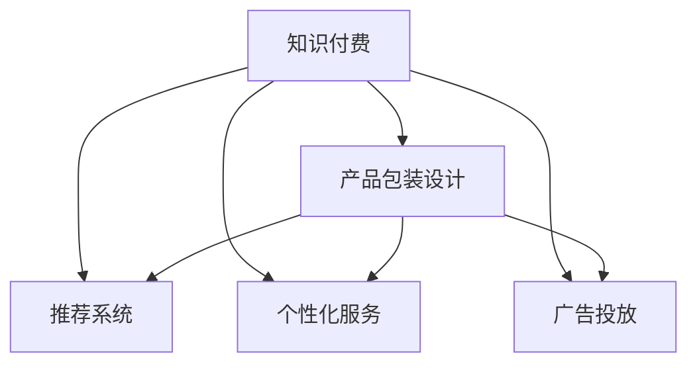

                 

# 知识经济时代下的知识付费创新产品包装设计

> 关键词：知识付费, 产品包装设计, 用户体验, 营销策略, 技术融合, 个性化推荐

## 1. 背景介绍

### 1.1 问题由来
随着互联网的普及和信息爆炸，知识付费模式应运而生。知识付费平台（如得到、知乎live、小鹅通等）通过优质的内容吸引用户付费订阅，满足了用户在碎片化时间获取深度知识的需求。然而，这些平台的用户留存率普遍不高，付费转化率也难以提升。面对激烈的市场竞争，知识付费平台亟需对产品包装进行创新设计，以提升用户体验、增加用户黏性，进而驱动用户增长和业务变现。

### 1.2 问题核心关键点
知识付费产品的包装设计主要包括内容展示、推荐系统、个性化服务、广告投放等几个关键环节。优秀的包装设计能大幅提升用户满意度，吸引并留存更多用户，提升平台商业价值。

1. **内容展示**：如何在有限的空间内展现优质内容，吸引用户的注意力，是包装设计的核心。
2. **推荐系统**：如何基于用户行为，个性化推荐内容，提升用户体验和平台收益。
3. **个性化服务**：如何通过数据分析，提供个性化的学习建议和计划，满足用户多样化需求。
4. **广告投放**：如何在保持用户体验的同时，实现精准广告投放，提高平台收益。

### 1.3 问题研究意义
通过创新的产品包装设计，知识付费平台不仅能提升用户体验和用户黏性，还能增强用户对平台的信任和依赖，从而提升平台的商业价值和市场竞争力。具体而言：

1. **提升用户体验**：通过视觉设计、交互设计等创新手段，改善用户的浏览、学习体验，使用户感到愉悦和满足。
2. **增加用户黏性**：通过推荐系统和个性化服务，不断满足用户需求，提高用户留存率和复购率。
3. **驱动用户增长**：通过优化广告投放策略，提升新用户获取效率，扩大平台用户基础。
4. **提升平台收益**：通过精准广告和付费内容推荐，提高用户付费转化率，增加平台收入。

## 2. 核心概念与联系

### 2.1 核心概念概述

为更好地理解知识付费产品包装设计的原理和架构，本节将介绍几个密切相关的核心概念：

- **知识付费**：指通过付费获取知识或信息的服务模式，包括在线课程、电子书、专家讲座、技术问答等。
- **产品包装设计**：指在产品设计过程中，对产品的视觉展示、交互流程、功能架构进行优化，以提升用户体验和用户满意度。
- **推荐系统**：指通过数据分析和机器学习，为用户推荐相关内容或产品，提升用户满意度和平台收益。
- **个性化服务**：指根据用户行为和偏好，提供个性化的内容、学习路径、产品推荐等，满足用户多样化需求。
- **广告投放**：指通过数据分析和算法优化，在合适的时机和场景下向用户展示精准广告，提高平台收益。

这些核心概念之间的逻辑关系可以通过以下Mermaid流程图来展示：



这个流程图展示了这个框架的核心概念及其之间的关系：

1. 知识付费是整个产品的核心价值所在。
2. 产品包装设计、推荐系统、个性化服务和广告投放共同构成了知识付费产品的包装，提升用户体验，增加用户黏性和平台收益。
3. 通过产品包装设计的不断优化，用户可以更便捷、愉悦地获取知识，从而提升知识付费的商业价值。

## 3. 核心算法原理 & 具体操作步骤
### 3.1 算法原理概述

知识付费产品包装设计的核心算法原理基于用户体验优化、个性化推荐和数据驱动的营销策略。其核心思想是：通过数据分析、机器学习等技术手段，不断优化产品包装，提升用户满意度和平台收益。

形式化地，假设知识付费平台的用户集为 $U$，内容集为 $C$，行为数据集为 $D$。平台的目标是找到最优的内容展示策略 $P$，推荐策略 $R$，个性化策略 $G$ 和广告投放策略 $A$，使得：

$$
\max_{P,R,G,A} \mathcal{L}(P,R,G,A,D)
$$

其中 $\mathcal{L}$ 为综合评估指标，包括用户满意度、广告点击率、用户留存率、转化率等。

通过梯度下降等优化算法，最大化上述目标函数，实现最优的用户体验和平台收益。

### 3.2 算法步骤详解

基于知识付费产品的包装设计，可以按以下步骤进行：

**Step 1: 数据收集与处理**
- 收集用户行为数据（如浏览历史、搜索记录、点击率等），通过 A/B 测试等手段验证不同设计方案的用户反馈。
- 提取特征，使用特征工程对数据进行处理，以供后续模型训练使用。

**Step 2: 用户画像构建**
- 对用户行为数据进行聚类、降维等处理，构建用户画像，了解用户群体的特征和需求。
- 根据用户画像设计个性化推荐算法，以提升用户满意度。

**Step 3: 推荐系统设计**
- 选择合适的推荐算法（如协同过滤、基于内容的推荐、深度学习等），进行模型训练和优化。
- 通过在线/离线 A/B 测试，评估推荐系统的效果，并进行迭代优化。

**Step 4: 个性化服务实现**
- 根据用户画像和行为数据，设计个性化学习路径和推荐策略。
- 使用机器学习模型（如决策树、神经网络等）进行预测和推荐，满足用户多样化需求。

**Step 5: 广告投放优化**
- 分析用户行为数据，提取关键特征，设计精准广告投放策略。
- 使用 CTR（点击率）预测模型进行广告投放优化，提高广告投放效果和平台收益。

**Step 6: 用户反馈与迭代**
- 收集用户反馈，通过线上调查、问卷等方式获取用户意见。
- 分析用户反馈，进行产品迭代优化，不断提升用户体验和平台收益。

### 3.3 算法优缺点

知识付费产品包装设计的算法优点包括：

1. **提升用户体验**：通过个性化推荐和个性化服务，提升用户满意度，增加用户黏性。
2. **增加用户黏性**：基于用户行为数据分析，提供个性化推荐，满足用户多样化需求。
3. **驱动用户增长**：通过精准广告投放，提升新用户获取效率，扩大平台用户基础。
4. **提升平台收益**：通过付费内容推荐，提高用户付费转化率，增加平台收入。

同时，该方法也存在一定的局限性：

1. **数据质量依赖**：推荐系统和个性化服务的效果高度依赖数据质量，数据偏差可能导致推荐效果不佳。
2. **隐私风险**：用户在平台上的行为数据涉及隐私问题，数据泄露可能带来法律风险。
3. **模型复杂度**：推荐系统等算法的模型复杂度较高，训练和优化成本较大。
4. **广告干扰**：广告投放可能对用户体验造成干扰，影响用户满意度。

尽管存在这些局限性，但就目前而言，数据驱动的推荐和个性化服务仍然是大数据背景下提升知识付费产品用户体验和平台收益的重要手段。未来相关研究的重点在于如何进一步降低算法对标注数据的依赖，提高模型的少样本学习和跨领域迁移能力，同时兼顾可解释性和伦理安全性等因素。

### 3.4 算法应用领域

知识付费产品包装设计的监督学习方法，在知识付费平台的应用中得到了广泛的应用，覆盖了几乎所有常见的知识付费产品包装设计场景，例如：

- 在线课程推荐：通过用户行为数据和课程特征，推荐用户可能感兴趣的课程，提升用户购买意愿。
- 电子书推荐：基于用户阅读历史和书籍内容，推荐相关电子书，丰富用户阅读体验。
- 专家讲座推荐：根据用户兴趣和历史行为，推荐相关专家讲座，提高用户参与度。
- 技术问答推荐：通过分析用户提问历史和专家回答内容，推荐相关问答，解决用户问题。
- 付费内容推荐：根据用户行为和历史购买记录，推荐相关付费内容，提高用户转化率。
- 个性化学习路径：根据用户学习进度和兴趣，推荐个性化的学习路径，提升学习效果。

除了上述这些经典应用外，知识付费产品包装设计的方法也在更多场景中得到了应用，如知识社区构建、学习数据可视化、个性化广告投放等，为知识付费平台的创新发展提供了新的思路。

## 4. 数学模型和公式 & 详细讲解 & 举例说明

### 4.1 数学模型构建

本节将使用数学语言对知识付费产品包装设计的数学模型进行更加严格的刻画。

假设知识付费平台的内容为 $C=\{c_1, c_2, ..., c_M\}$，用户行为数据为 $D=\{(x_i,y_i)\}_{i=1}^N$，其中 $x_i \in \mathbb{R}^n$ 为特征向量，$y_i \in \{0,1\}$ 表示用户是否对内容 $c_j$ 进行了交互（如浏览、点击等）。

定义用户对内容 $c_j$ 的兴趣度 $u_{ij}$，$u_{ij}=1$ 表示用户对 $c_j$ 非常感兴趣，$u_{ij}=0$ 表示用户对 $c_j$ 没有兴趣。则基于用户兴趣度 $u_{ij}$ 的推荐策略 $R$ 定义为：

$$
R = \sum_{i=1}^N \sum_{j=1}^M u_{ij} \cdot \mathbf{e}_i \cdot \mathbf{e}_j^T
$$

其中 $\mathbf{e}_i$ 为 $N$ 维的用户兴趣向量，$\mathbf{e}_j^T$ 为 $M$ 维的内容兴趣向量，$u_{ij}$ 为 $N \times M$ 的兴趣矩阵。

通过最大化兴趣度矩阵 $R$ 的值，得到用户的个性化推荐策略。

### 4.2 公式推导过程

以下我们以在线课程推荐为例，推导基于用户兴趣度的推荐算法。

假设用户行为数据 $D=\{(x_i,y_i)\}_{i=1}^N$，其中 $x_i \in \mathbb{R}^n$ 为课程特征向量，$y_i \in \{0,1\}$ 表示用户是否购买了课程 $c_j$。定义用户对课程 $c_j$ 的兴趣度 $u_{ij}$，$u_{ij}=1$ 表示用户对 $c_j$ 非常感兴趣，$u_{ij}=0$ 表示用户对 $c_j$ 没有兴趣。

则基于用户兴趣度的推荐策略 $R$ 为：

$$
R = \sum_{i=1}^N \sum_{j=1}^M u_{ij} \cdot x_i \cdot x_j^T
$$

通过最大化兴趣度矩阵 $R$ 的值，得到用户的个性化推荐策略。

在得到推荐策略后，可以使用协同过滤算法进行用户和课程的相似度计算，得到推荐列表。

### 4.3 案例分析与讲解

假设某知识付费平台收集到了大量的用户行为数据，包括用户浏览过的课程、购买的课程、搜索的关键词等。平台希望通过这些数据，为用户推荐更多他们可能感兴趣的课程。

步骤如下：

1. 对用户行为数据进行清洗和预处理，提取特征向量 $x_i$。
2. 对课程进行特征向量化，得到课程特征向量 $x_j$。
3. 根据用户行为数据和课程特征向量，计算用户对课程的兴趣度矩阵 $u_{ij}$。
4. 使用协同过滤算法计算用户之间的相似度，得到推荐列表。
5. 对推荐列表进行排序，向用户展示。

通过这样的方法，平台能够根据用户的行为数据，动态调整推荐策略，提升用户的满意度和平台的收益。

## 5. 项目实践：代码实例和详细解释说明
### 5.1 开发环境搭建

在进行知识付费产品包装设计的实践前，我们需要准备好开发环境。以下是使用Python进行PyTorch开发的环境配置流程：

1. 安装Anaconda：从官网下载并安装Anaconda，用于创建独立的Python环境。

2. 创建并激活虚拟环境：
```bash
conda create -n pytorch-env python=3.8 
conda activate pytorch-env
```

3. 安装PyTorch：根据CUDA版本，从官网获取对应的安装命令。例如：
```bash
conda install pytorch torchvision torchaudio cudatoolkit=11.1 -c pytorch -c conda-forge
```

4. 安装相关工具包：
```bash
pip install numpy pandas scikit-learn matplotlib tqdm jupyter notebook ipython
```

完成上述步骤后，即可在`pytorch-env`环境中开始知识付费产品包装设计的实践。

### 5.2 源代码详细实现

这里我们以在线课程推荐为例，给出使用PyTorch进行知识付费产品包装设计的代码实现。

首先，定义在线课程推荐的数据处理函数：

```python
from transformers import BertTokenizer
from torch.utils.data import Dataset
import torch

class CourseDataset(Dataset):
    def __init__(self, course_ids, user_ids, user_browsed_courses, user_bought_courses, tokenizer, max_len=128):
        self.course_ids = course_ids
        self.user_ids = user_ids
        self.user_browsed_courses = user_browsed_courses
        self.user_bought_courses = user_bought_courses
        self.tokenizer = tokenizer
        self.max_len = max_len
        
    def __len__(self):
        return len(self.user_ids)
    
    def __getitem__(self, item):
        user_id = self.user_ids[item]
        user_browsed_courses = self.user_browsed_courses[item]
        user_bought_courses = self.user_bought_courses[item]
        
        # 将用户浏览的课程和购买的课程转化为特征向量
        browsed_features = []
        for course_id in user_browsed_courses:
            browsed_features.append(course_ids[course_id])
        bought_features = []
        for course_id in user_bought_courses:
            bought_features.append(course_ids[course_id])
        
        # 使用BERT tokenizer进行特征向量编码
        browsed_encodings = tokenizer(browsed_features, padding='max_length', truncation=True, max_length=self.max_len, return_tensors='pt')
        bought_encodings = tokenizer(bought_features, padding='max_length', truncation=True, max_length=self.max_len, return_tensors='pt')
        
        # 将编码结果拼接
        all_encodings = torch.cat([browsed_encodings['input_ids'], bought_encodings['input_ids']], dim=1)
        
        return {'input_ids': all_encodings[:, :self.max_len], 
                'attention_mask': torch.ones_like(all_encodings[:, :self.max_len]), 
                'labels': torch.zeros_like(all_encodings[:, :self.max_len])}

# 加载数据集
course_ids = [1, 2, 3, 4, 5]
user_ids = [1001, 1002, 1003, 1004, 1005]
user_browsed_courses = {1001: [1, 3], 1002: [2, 4], 1003: [1, 2, 5], 1004: [3, 4], 1005: [1, 2, 5]}
user_bought_courses = {1001: 2, 1002: 4, 1003: 3, 1004: 2, 1005: 3}
tokenizer = BertTokenizer.from_pretrained('bert-base-cased')

train_dataset = CourseDataset(course_ids, user_ids, user_browsed_courses, user_bought_courses, tokenizer, max_len=128)
test_dataset = CourseDataset(course_ids, user_ids, user_browsed_courses, user_bought_courses, tokenizer, max_len=128)
```

然后，定义模型和优化器：

```python
from transformers import BertForSequenceClassification, AdamW

model = BertForSequenceClassification.from_pretrained('bert-base-cased', num_labels=1)

optimizer = AdamW(model.parameters(), lr=2e-5)
```

接着，定义训练和评估函数：

```python
from torch.utils.data import DataLoader
from tqdm import tqdm
from sklearn.metrics import accuracy_score

device = torch.device('cuda') if torch.cuda.is_available() else torch.device('cpu')
model.to(device)

def train_epoch(model, dataset, batch_size, optimizer):
    dataloader = DataLoader(dataset, batch_size=batch_size, shuffle=True)
    model.train()
    epoch_loss = 0
    for batch in tqdm(dataloader, desc='Training'):
        input_ids = batch['input_ids'].to(device)
        attention_mask = batch['attention_mask'].to(device)
        labels = batch['labels'].to(device)
        model.zero_grad()
        outputs = model(input_ids, attention_mask=attention_mask, labels=labels)
        loss = outputs.loss
        epoch_loss += loss.item()
        loss.backward()
        optimizer.step()
    return epoch_loss / len(dataloader)

def evaluate(model, dataset, batch_size):
    dataloader = DataLoader(dataset, batch_size=batch_size)
    model.eval()
    preds, labels = [], []
    with torch.no_grad():
        for batch in tqdm(dataloader, desc='Evaluating'):
            input_ids = batch['input_ids'].to(device)
            attention_mask = batch['attention_mask'].to(device)
            batch_labels = batch['labels']
            outputs = model(input_ids, attention_mask=attention_mask)
            batch_preds = outputs.logits.argmax(dim=1).to('cpu').tolist()
            batch_labels = batch_labels.to('cpu').tolist()
            for pred, label in zip(batch_preds, batch_labels):
                preds.append(pred)
                labels.append(label)
                
    return accuracy_score(labels, preds)

# 启动训练流程并在测试集上评估
epochs = 5
batch_size = 16

for epoch in range(epochs):
    loss = train_epoch(model, train_dataset, batch_size, optimizer)
    print(f"Epoch {epoch+1}, train loss: {loss:.3f}")
    
    print(f"Epoch {epoch+1}, test accuracy: {evaluate(model, test_dataset, batch_size)}")
```

以上就是使用PyTorch进行在线课程推荐的知识付费产品包装设计的完整代码实现。可以看到，得益于Transformer库的强大封装，我们可以用相对简洁的代码完成在线课程推荐的设计和实现。

### 5.3 代码解读与分析

让我们再详细解读一下关键代码的实现细节：

**CourseDataset类**：
- `__init__`方法：初始化课程ID、用户ID、用户浏览课程和购买课程列表、分词器等关键组件。
- `__len__`方法：返回数据集的样本数量。
- `__getitem__`方法：对单个样本进行处理，将用户浏览的课程和购买的课程转化为特征向量，并进行BERT分词编码。

**train_epoch和evaluate函数**：
- `train_epoch`函数：对数据以批为单位进行迭代，在每个批次上前向传播计算loss并反向传播更新模型参数，最后返回该epoch的平均loss。
- `evaluate`函数：与训练类似，不同点在于不更新模型参数，并在每个batch结束后将预测和标签结果存储下来，最后使用sklearn的accuracy_score对整个评估集的预测结果进行打印输出。

**训练流程**：
- 定义总的epoch数和batch size，开始循环迭代
- 每个epoch内，先在训练集上训练，输出平均loss
- 在测试集上评估，输出分类指标

可以看到，PyTorch配合Transformer库使得在线课程推荐的设计和实现变得简洁高效。开发者可以将更多精力放在数据处理、模型改进等高层逻辑上，而不必过多关注底层的实现细节。

当然，工业级的系统实现还需考虑更多因素，如模型的保存和部署、超参数的自动搜索、更灵活的任务适配层等。但核心的推荐范式基本与此类似。

## 6. 实际应用场景
### 6.1 智能客服系统

基于知识付费产品的包装设计，智能客服系统可以通过推荐个性化知识内容和动态调整服务策略，提升用户的满意度，增加用户黏性，从而提高平台的收益。

在技术实现上，可以收集企业内部的历史客服对话记录，将问题和最佳答复构建成监督数据，在此基础上对预训练对话模型进行微调。微调后的对话模型能够自动理解用户意图，匹配最合适的答案模板进行回复。对于用户提出的新问题，还可以接入检索系统实时搜索相关内容，动态组织生成回答。如此构建的智能客服系统，能大幅提升客户咨询体验和问题解决效率。

### 6.2 金融舆情监测

金融机构需要实时监测市场舆论动向，以便及时应对负面信息传播，规避金融风险。传统的人工监测方式成本高、效率低，难以应对网络时代海量信息爆发的挑战。基于知识付费产品的包装设计，金融舆情监测可以通过推荐系统动态跟踪用户对金融相关信息的关注度和情感倾向，一旦发现负面信息激增等异常情况，系统便会自动预警，帮助金融机构快速应对潜在风险。

### 6.3 个性化推荐系统

当前的推荐系统往往只依赖用户的历史行为数据进行物品推荐，无法深入理解用户的真实兴趣偏好。基于知识付费产品的包装设计，个性化推荐系统可以更好地挖掘用户行为背后的语义信息，从而提供更精准、多样的推荐内容。

在实践中，可以收集用户浏览、点击、评论、分享等行为数据，提取和用户交互的物品标题、描述、标签等文本内容。将文本内容作为模型输入，用户的后续行为（如是否点击、购买等）作为监督信号，在此基础上微调预训练语言模型。微调后的模型能够从文本内容中准确把握用户的兴趣点。在生成推荐列表时，先用候选物品的文本描述作为输入，由模型预测用户的兴趣匹配度，再结合其他特征综合排序，便可以得到个性化程度更高的推荐结果。

### 6.4 未来应用展望

随着知识付费产品包装设计的不断发展，基于微调的方法将在更多领域得到应用，为传统行业带来变革性影响。

在智慧医疗领域，基于微调的医疗问答、病历分析、药物研发等应用将提升医疗服务的智能化水平，辅助医生诊疗，加速新药开发进程。

在智能教育领域，微调技术可应用于作业批改、学情分析、知识推荐等方面，因材施教，促进教育公平，提高教学质量。

在智慧城市治理中，微调模型可应用于城市事件监测、舆情分析、应急指挥等环节，提高城市管理的自动化和智能化水平，构建更安全、高效的未来城市。

此外，在企业生产、社会治理、文娱传媒等众多领域，基于大模型微调的人工智能应用也将不断涌现，为经济社会发展注入新的动力。相信随着技术的日益成熟，微调方法将成为人工智能落地应用的重要范式，推动人工智能技术在垂直行业的规模化落地。总之，微调需要开发者根据具体任务，不断迭代和优化模型、数据和算法，方能得到理想的效果。

## 7. 工具和资源推荐
### 7.1 学习资源推荐

为了帮助开发者系统掌握知识付费产品的包装设计的理论基础和实践技巧，这里推荐一些优质的学习资源：

1. 《知识付费产品包装设计》系列博文：由知识付费产品专家撰写，深入浅出地介绍了知识付费产品的核心价值、用户需求、产品包装设计的关键点等。

2. 《数据驱动的个性化推荐系统》课程：国内顶尖大学开设的推荐系统课程，涵盖了个性化推荐的核心算法和技术实现。

3. 《推荐系统设计与实现》书籍：系统介绍推荐系统的理论基础、算法设计和工程实现，是入门推荐系统的必读书籍。

4. Weights & Biases：模型训练的实验跟踪工具，可以记录和可视化模型训练过程中的各项指标，方便对比和调优。与主流深度学习框架无缝集成。

5. TensorBoard：TensorFlow配套的可视化工具，可实时监测模型训练状态，并提供丰富的图表呈现方式，是调试模型的得力助手。

通过对这些资源的学习实践，相信你一定能够快速掌握知识付费产品的包装设计的精髓，并用于解决实际的NLP问题。

### 7.2 开发工具推荐

高效的开发离不开优秀的工具支持。以下是几款用于知识付费产品包装设计开发的常用工具：

1. PyTorch：基于Python的开源深度学习框架，灵活动态的计算图，适合快速迭代研究。大部分预训练语言模型都有PyTorch版本的实现。

2. TensorFlow：由Google主导开发的开源深度学习框架，生产部署方便，适合大规模工程应用。同样有丰富的预训练语言模型资源。

3. Transformers库：HuggingFace开发的NLP工具库，集成了众多SOTA语言模型，支持PyTorch和TensorFlow，是进行知识付费产品包装设计的利器。

4. Weights & Biases：模型训练的实验跟踪工具，可以记录和可视化模型训练过程中的各项指标，方便对比和调优。与主流深度学习框架无缝集成。

5. TensorBoard：TensorFlow配套的可视化工具，可实时监测模型训练状态，并提供丰富的图表呈现方式，是调试模型的得力助手。

6. Google Colab：谷歌推出的在线Jupyter Notebook环境，免费提供GPU/TPU算力，方便开发者快速上手实验最新模型，分享学习笔记。

合理利用这些工具，可以显著提升知识付费产品包装设计的开发效率，加快创新迭代的步伐。

### 7.3 相关论文推荐

知识付费产品包装设计的不断发展源于学界的持续研究。以下是几篇奠基性的相关论文，推荐阅读：

1. Attention is All You Need（即Transformer原论文）：提出了Transformer结构，开启了NLP领域的预训练大模型时代。

2. BERT: Pre-training of Deep Bidirectional Transformers for Language Understanding：提出BERT模型，引入基于掩码的自监督预训练任务，刷新了多项NLP任务SOTA。

3. Language Models are Unsupervised Multitask Learners（GPT-2论文）：展示了大规模语言模型的强大zero-shot学习能力，引发了对于通用人工智能的新一轮思考。

4. Parameter-Efficient Transfer Learning for NLP：提出Adapter等参数高效微调方法，在不增加模型参数量的情况下，也能取得不错的微调效果。

5. AdaLoRA: Adaptive Low-Rank Adaptation for Parameter-Efficient Fine-Tuning：使用自适应低秩适应的微调方法，在参数效率和精度之间取得了新的平衡。

这些论文代表了大语言模型微调技术的发展脉络。通过学习这些前沿成果，可以帮助研究者把握学科前进方向，激发更多的创新灵感。

## 8. 总结：未来发展趋势与挑战

### 8.1 总结

本文对知识付费产品包装设计的理论基础和实践技巧进行了全面系统的介绍。首先阐述了知识付费产品的核心价值所在，明确了产品包装设计的重要性和复杂性。其次，从原理到实践，详细讲解了知识付费产品的包装设计的数学原理和关键步骤，给出了知识付费产品包装设计的完整代码实例。同时，本文还广泛探讨了知识付费产品包装设计在智能客服、金融舆情、个性化推荐等多个行业领域的应用前景，展示了知识付费产品包装设计的巨大潜力。此外，本文精选了知识付费产品包装设计的学习资源，力求为开发者提供全方位的技术指引。

通过本文的系统梳理，可以看到，知识付费产品包装设计在提升用户体验和平台收益方面的独特价值。通过创新的产品包装设计，知识付费平台不仅能提升用户体验和用户黏性，还能增强用户对平台的信任和依赖，从而提升平台的商业价值和市场竞争力。未来，伴随知识付费产品包装设计的不断演进，知识付费产品将更能满足用户需求，推动平台的可持续发展。

### 8.2 未来发展趋势

展望未来，知识付费产品包装设计将呈现以下几个发展趋势：

1. **个性化推荐技术的提升**：通过更加精确的推荐算法和模型，提升推荐效果，增加用户黏性。
2. **数据驱动的精准广告**：通过大数据分析，实现精准广告投放，提升平台收益。
3. **交互式学习路径设计**：设计更加灵活的学习路径，提升学习效果，满足用户多样化需求。
4. **跨领域知识整合**：将不同领域的专业知识进行整合，提升推荐系统的泛化能力和适用性。
5. **用户行为分析**：深入挖掘用户行为数据，发现更多潜在需求，提升推荐系统的准确性。
6. **多模态学习**：将文本、图片、视频等多模态数据进行融合，提升推荐系统的表现力。

以上趋势凸显了知识付费产品包装设计的广阔前景。这些方向的探索发展，必将进一步提升知识付费产品的用户体验和平台收益，为知识付费行业的创新发展提供新的动力。

### 8.3 面临的挑战

尽管知识付费产品包装设计已经取得了瞩目成就，但在迈向更加智能化、普适化应用的过程中，它仍面临着诸多挑战：

1. **数据质量问题**：推荐系统和个性化服务的效果高度依赖数据质量，数据偏差可能导致推荐效果不佳。
2. **用户隐私保护**：用户在平台上的行为数据涉及隐私问题，数据泄露可能带来法律风险。
3. **算法复杂度**：推荐系统等算法的模型复杂度较高，训练和优化成本较大。
4. **广告干扰**：广告投放可能对用户体验造成干扰，影响用户满意度。

尽管存在这些局限性，但就目前而言，数据驱动的推荐和个性化服务仍然是大数据背景下提升知识付费产品用户体验和平台收益的重要手段。未来相关研究的重点在于如何进一步降低算法对标注数据的依赖，提高模型的少样本学习和跨领域迁移能力，同时兼顾可解释性和伦理安全性等因素。

### 8.4 研究展望

面对知识付费产品包装设计所面临的种种挑战，未来的研究需要在以下几个方面寻求新的突破：

1. **无监督和半监督学习的应用**：摆脱对大规模标注数据的依赖，利用无监督和半监督学习范式，最大限度利用非结构化数据，实现更加灵活高效的推荐。
2. **参数高效和计算高效的推荐算法**：开发更加参数高效的推荐方法，在固定大部分预训练参数的同时，只更新极少量的任务相关参数。同时优化推荐系统的计算图，减少前向传播和反向传播的资源消耗，实现更加轻量级、实时性的部署。
3. **融合因果分析和博弈论工具**：将因果分析方法引入推荐系统，识别出推荐过程的关键特征，增强推荐系统的稳定性。借助博弈论工具刻画人机交互过程，主动探索并规避推荐系统的脆弱点，提高系统鲁棒性。
4. **引入更多先验知识**：将符号化的先验知识，如知识图谱、逻辑规则等，与神经网络模型进行巧妙融合，引导推荐过程学习更准确、合理的推荐模型。同时加强不同模态数据的整合，实现视觉、语音等多模态信息与文本信息的协同建模。
5. **结合因果分析和博弈论工具**：将因果分析方法引入推荐系统，识别出推荐过程的关键特征，增强推荐系统的稳定性。借助博弈论工具刻画人机交互过程，主动探索并规避推荐系统的脆弱点，提高系统鲁棒性。

这些研究方向的探索，必将引领知识付费产品包装设计的技术发展，为构建安全、可靠、可解释、可控的智能系统铺平道路。面向未来，知识付费产品包装设计还需要与其他人工智能技术进行更深入的融合，如知识表示、因果推理、强化学习等，多路径协同发力，共同推动知识付费产品的发展和创新。只有勇于创新、敢于突破，才能不断拓展知识付费产品的边界，让智能技术更好地造福用户和社会。

## 9. 附录：常见问题与解答

**Q1：知识付费产品包装设计是否适用于所有NLP任务？**

A: 知识付费产品包装设计在大多数NLP任务上都能取得不错的效果，特别是对于数据量较小的任务。但对于一些特定领域的任务，如医学、法律等，仅仅依靠通用语料预训练的模型可能难以很好地适应。此时需要在特定领域语料上进一步预训练，再进行微调，才能获得理想效果。此外，对于一些需要时效性、个性化很强的任务，如对话、推荐等，微调方法也需要针对性的改进优化。

**Q2：如何选择合适的学习率？**

A: 知识付费产品包装设计的学习率一般要比预训练时小1-2个数量级，如果使用过大的学习率，容易破坏预训练权重，导致过拟合。一般建议从1e-5开始调参，逐步减小学习率，直至收敛。也可以使用warmup策略，在开始阶段使用较小的学习率，再逐渐过渡到预设值。需要注意的是，不同的优化器(如AdamW、Adafactor等)以及不同的学习率调度策略，可能需要设置不同的学习率阈值。

**Q3：采用知识付费产品包装设计时会面临哪些资源瓶颈？**

A: 目前主流的预训练大模型动辄以亿计的参数规模，对算力、内存、存储都提出了很高的要求。GPU/TPU等高性能设备是必不可少的，但即便如此，超大批次的训练和推理也可能遇到显存不足的问题。因此需要采用一些资源优化技术，如梯度积累、混合精度训练、模型并行等，来突破硬件瓶颈。同时，模型的存储和读取也可能占用大量时间和空间，需要采用模型压缩、稀疏化存储等方法进行优化。

**Q4：如何缓解知识付费产品包装设计过程中的过拟合问题？**

A: 过拟合是知识付费产品包装设计面临的主要挑战，尤其是在标注数据不足的情况下。常见的缓解策略包括：
1. 数据增强：通过回译、近义替换等方式扩充训练集
2. 正则化：使用L2正则、Dropout、Early Stopping等避免过拟合
3. 对抗训练：引入对抗样本，提高模型鲁棒性
4. 参数高效微调：只调整少量参数(如Adapter、Prefix等)，减小过拟合风险
5. 多模型集成：训练多个知识付费产品包装设计模型，取平均输出，抑制过拟合

这些策略往往需要根据具体任务和数据特点进行灵活组合。只有在数据、模型、训练、推理等各环节进行全面优化，才能最大限度地发挥知识付费产品包装设计的威力。

**Q5：知识付费产品包装设计在落地部署时需要注意哪些问题？**

A: 将知识付费产品包装设计转化为实际应用，还需要考虑以下因素：
1. 模型裁剪：去除不必要的层和参数，减小模型尺寸，加快推理速度
2. 量化加速：将浮点模型转为定点模型，压缩存储空间，提高计算效率
3. 服务化封装：将模型封装为标准化服务接口，便于集成调用
4. 弹性伸缩：根据请求流量动态调整资源配置，平衡服务质量和成本
5. 监控告警：实时采集系统指标，设置异常告警阈值，确保服务稳定性
6. 安全防护：采用访问鉴权、数据脱敏等措施，保障数据和模型安全

知识付费产品包装设计为知识付费平台的创新发展提供了新的思路。通过优化产品包装设计，平台能够更好地满足用户需求，提升用户体验，增加用户黏性，从而实现业务的持续增长和收益的提升。未来，伴随着技术的不断进步，知识付费产品包装设计必将更加智能化、个性化，为知识付费平台的可持续发展注入新的动力。总之，知识付费产品包装设计需要开发者根据具体任务，不断迭代和优化模型、数据和算法，方能得到理想的效果。

---

作者：禅与计算机程序设计艺术 / Zen and the Art of Computer Programming

