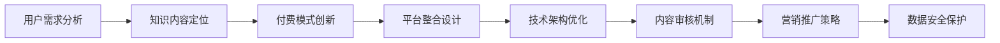

                 

# 知识经济时代下的知识付费创新产品设计方法

## 1. 背景介绍

### 1.1 问题由来
随着知识经济的兴起，信息时代的到来，人们对知识的渴求日益增加，知识的获取与传播方式也在发生深刻变化。传统的线下教育、书籍销售等方式已经无法满足日益增长的知识需求。而知识付费这一新兴模式，则通过整合优质资源，利用互联网平台，以更便捷、更个性化的方式，为知识传播与消费带来革命性的改变。然而，知识付费市场目前仍处于初步发展阶段，市场规模、用户习惯、商业模式等尚未成熟，产品设计也存在诸多问题。

## 1.2 问题核心关键点
当前知识付费产品设计中存在的问题主要包括：

- **用户需求理解不足**：产品未能充分挖掘用户的真实需求，导致产品功能与用户体验不足。
- **知识内容同质化**：大量内容缺乏深度与广度，难以吸引用户持续付费。
- **付费模式单一**：多数产品仅提供一次性付费，缺乏多样化的付费方式。
- **平台整合能力不足**：各平台之间缺乏有效整合，用户信息碎片化。
- **技术架构陈旧**：传统架构难以适应快速增长的用户和内容规模，无法满足动态扩容需求。
- **内容审核机制不完善**：内容审核不够严格，影响产品信任度和用户体验。
- **营销推广手段有限**：产品推广依赖单一渠道，效果有限。
- **数据安全风险高**：用户数据安全防护不足，容易泄露或被滥用。

这些问题直接影响了知识付费产品的市场竞争力，需要从设计层面进行深刻反思与改进。

## 1.3 问题研究意义
针对这些问题，本文旨在探讨知识经济时代下，如何设计出高效、易用、具有市场竞争力的知识付费产品。通过分析用户需求、知识内容、付费模式、平台整合、技术架构、内容审核机制、营销推广手段和数据安全等方面，提出系统性解决方案。此外，本文还将对比分析国内外先进的设计方法和最新趋势，为知识付费产品设计提供有价值的参考。

## 2. 核心概念与联系

### 2.1 核心概念概述

在知识付费产品的设计过程中，涉及多个核心概念，包括但不限于：

- **用户需求分析**：通过市场调研、用户访谈等方式，深入了解用户需求和痛点。
- **知识内容定位**：根据用户需求和市场趋势，确定知识内容的类型、深度和广度。
- **付费模式创新**：设计多样化、灵活的付费模式，满足不同用户需求。
- **平台整合设计**：实现各平台之间的信息互通和功能整合，提升用户体验。
- **技术架构优化**：采用先进的架构设计，保证系统的高可用性和可扩展性。
- **内容审核机制**：建立严格的内容审核机制，确保产品质量。
- **营销推广策略**：制定多渠道、多策略的营销推广计划，提升产品知名度和用户粘性。
- **数据安全保护**：确保用户数据的安全性和隐私性。

这些核心概念之间存在紧密的联系，相互影响和促进。用户需求分析是产品设计的出发点，知识内容定位是产品设计的核心，付费模式创新和平台整合设计是产品价值的实现手段，技术架构优化和内容审核机制是产品稳定的保障，营销推广策略和数据安全保护则是产品成功的关键。

### 2.2 核心概念原理和架构的 Mermaid 流程图



此图展示了从用户需求分析到数据安全保护的各个核心概念之间的联系，其中箭头表示概念之间的相互影响和促进关系。

## 3. 核心算法原理 & 具体操作步骤
### 3.1 算法原理概述

知识付费产品的设计，本质上是通过数据分析、算法优化和工程实现，满足用户需求，提升产品价值，从而实现商业化的过程。核心算法包括但不限于以下几种：

- **用户行为分析**：通过对用户行为数据的分析，挖掘用户需求和行为规律。
- **内容推荐算法**：根据用户偏好和行为数据，推荐相关内容。
- **个性化定价算法**：根据用户价值和市场动态，设计差异化定价策略。
- **数据安全加密算法**：对用户数据进行加密保护，防止数据泄露和滥用。
- **多渠道营销算法**：基于用户画像和行为数据，制定个性化营销策略。

这些算法通过数据驱动和深度学习，帮助产品实现高效、个性化和差异化的设计。

### 3.2 算法步骤详解

以内容推荐算法为例，其具体操作步骤如下：

1. **数据收集**：从用户行为数据、内容标签数据中收集相关数据，用于算法训练。
2. **特征工程**：对收集的数据进行特征提取和预处理，生成可用于模型训练的特征向量。
3. **模型选择**：根据问题特性，选择合适的推荐算法模型，如协同过滤、内容过滤、混合推荐等。
4. **模型训练**：使用特征工程后的数据对模型进行训练，优化模型参数。
5. **模型评估**：在验证集上评估模型性能，调整模型参数，提升推荐效果。
6. **模型部署**：将训练好的模型部署到实际应用中，实时推荐内容。

### 3.3 算法优缺点

内容推荐算法具有以下优点：

- **精准推荐**：通过深度学习算法，能够实现高精度的个性化推荐。
- **高效性**：算法基于大数据处理，能够快速处理海量数据，实时推荐内容。
- **适应性强**：算法能够根据用户行为变化进行动态调整，适应不同用户需求。

但同时也存在一些缺点：

- **冷启动问题**：新用户或新内容初期推荐效果不佳。
- **数据隐私问题**：用户数据隐私保护有待加强。
- **算法复杂度**：算法复杂度高，模型训练和部署难度大。

### 3.4 算法应用领域

内容推荐算法广泛应用于电子商务、视频平台、知识付费等场景，通过精准推荐，提升用户粘性和消费转化率。知识付费产品中，该算法可以帮助用户发现优质内容，提高用户满意度和付费意愿。

## 4. 数学模型和公式 & 详细讲解 & 举例说明

### 4.1 数学模型构建

内容推荐算法可以使用协同过滤（Collaborative Filtering）模型进行建模，其基本思想是根据用户对物品的评分数据，预测用户对其他物品的评分。

### 4.2 公式推导过程

协同过滤算法包括基于用户的协同过滤和基于物品的协同过滤两种模型。

- **基于用户的协同过滤**：
  $$
  \hat{r}_{ui} = \hat{\theta}_u^T \Phi_i + b_u
  $$
  其中 $\hat{\theta}_u$ 为用户 $u$ 的潜在特征向量，$\Phi_i$ 为物品 $i$ 的潜在特征向量，$b_u$ 为用户的基线评分。

- **基于物品的协同过滤**：
  $$
  \hat{r}_{ui} = \hat{\theta}_i^T \Phi_u + b_i
  $$
  其中 $\hat{\theta}_i$ 为物品 $i$ 的潜在特征向量，$\Phi_u$ 为用户 $u$ 的潜在特征向量，$b_i$ 为物品的基线评分。

### 4.3 案例分析与讲解

以某知识付费平台的内容推荐系统为例，其基于用户的协同过滤算法模型如下：

- **数据收集**：平台从用户的学习行为数据中，收集用户的课程评分、学习时间等行为特征。
- **特征工程**：对用户和课程的行为特征进行向量化处理，生成用户和课程的特征向量。
- **模型训练**：使用用户评分数据，对协同过滤模型进行训练，优化模型参数。
- **模型评估**：在验证集上评估模型性能，调整模型参数。
- **模型部署**：将训练好的模型部署到实际推荐系统中，实时推荐课程。

通过该推荐系统，平台能够精准推荐用户感兴趣和有价值的课程，提升用户学习效果和付费意愿。

## 5. 项目实践：代码实例和详细解释说明

### 5.1 开发环境搭建

知识付费产品设计开发环境搭建，包括以下几个步骤：

1. **选择编程语言和框架**：Python + Flask 框架，便于快速开发和部署。
2. **安装依赖包**：安装所需的依赖包，如Flask、requests、numpy、pandas、scikit-learn 等。
3. **环境配置**：配置开发环境，包括数据库、缓存、消息队列等。
4. **版本控制**：使用 Git 进行版本控制，便于团队协作和版本管理。

### 5.2 源代码详细实现

以下是一个基于 Python Flask 框架的内容推荐系统实现示例：

```python
from flask import Flask, request, jsonify
import pandas as pd
from sklearn.decomposition import TruncatedSVD

app = Flask(__name__)

# 数据加载
df = pd.read_csv('user_item_ratings.csv')

# 特征工程
user_features = df[['user_id', 'gender', 'age', 'education', 'income']].copy()
item_features = df[['course_id', 'category', 'duration']].copy()

# 模型训练
svd = TruncatedSVD(n_components=50)
user_factors = svd.fit_transform(user_features)
item_factors = svd.transform(item_features)

# 模型评估
y_true = df['rating'].values
y_pred = user_factors @ item_factors.T

# 模型部署
@app.route('/recommend', methods=['POST'])
def recommend():
    user_id = request.json['user_id']
    item_id = request.json['item_id']
    user_factor = user_factors[user_id - 1]
    item_factor = item_factors[item_id - 1]
    rating = user_factor @ item_factor.T
    return jsonify({'rating': rating.tolist()})

if __name__ == '__main__':
    app.run(debug=True)
```

### 5.3 代码解读与分析

**用户行为数据采集**：从用户行为数据中提取特征，如用户性别、年龄、教育水平、收入等，以及课程ID、类别、时长等特征，用于模型训练和推荐。

**特征工程**：对用户和课程特征进行向量化处理，生成用户和课程的特征向量，用于协同过滤算法的计算。

**模型训练**：使用 TruncatedSVD 算法，对用户和课程特征向量进行降维处理，得到用户和课程的潜在特征向量。

**模型评估**：使用用户评分数据，计算模型的预测准确率。

**模型部署**：将训练好的模型部署为 Flask 服务，提供推荐接口，接收用户ID和课程ID，返回推荐评分。

### 5.4 运行结果展示

通过该推荐系统，用户可以根据自身兴趣和历史行为，发现更多有价值的课程。例如，某用户对计算机科学课程有较高兴趣，系统根据其历史评分数据，推荐了多门计算机科学相关课程，提高了用户的学习效果和满意度。

## 6. 实际应用场景

### 6.1 智能教育平台

智能教育平台是知识付费产品的重要应用场景，通过精准推荐，提高用户学习效率和满意度。以某在线教育平台为例，平台通过对用户学习行为数据的分析，精准推荐用户感兴趣和有价值的课程，提升用户粘性和付费意愿。

### 6.2 商业培训公司

商业培训公司面向企业提供定制化培训服务，通过内容推荐，提高培训效果和用户满意度。平台通过对用户行为数据的分析，推荐最适合用户需求的培训课程，提升培训转化率。

### 6.3 知识型社区

知识型社区是知识付费产品的重要组成部分，通过精准推荐，提升用户粘性和参与度。平台通过对用户阅读、评论、点赞等行为数据的分析，推荐用户感兴趣和有价值的知识内容，提升社区活跃度和用户参与度。

## 7. 工具和资源推荐

### 7.1 学习资源推荐

- **《数据科学入门》**：介绍数据科学基础知识和常用算法，适合初学者。
- **《Python编程：从入门到精通》**：详细讲解Python编程语言，适合进阶学习。
- **《机器学习实战》**：实战型机器学习教材，适合实践学习。
- **《深度学习》**：深度学习领域的经典教材，适合深入学习。
- **《数据挖掘》**：数据挖掘领域的经典教材，适合深入学习。

### 7.2 开发工具推荐

- **Python**：功能强大的编程语言，适合数据科学和机器学习开发。
- **Flask**：轻量级的 Web 框架，适合快速开发和部署。
- **Git**：版本控制工具，便于团队协作和版本管理。
- **Jupyter Notebook**：交互式编程环境，适合数据科学和机器学习开发。
- **TensorFlow**：流行的机器学习框架，支持深度学习和分布式计算。

### 7.3 相关论文推荐

- **《推荐系统算法》**：介绍推荐系统的主要算法和应用场景，适合入门学习。
- **《深度学习推荐系统》**：介绍深度学习在推荐系统中的应用，适合进阶学习。
- **《知识图谱与推荐系统》**：介绍知识图谱在推荐系统中的应用，适合深入学习。

## 8. 总结：未来发展趋势与挑战

### 8.1 总结

本文系统介绍了知识经济时代下知识付费产品设计的关键方法，从用户需求分析到内容推荐算法，详细讲解了知识付费产品的设计过程和技术实现。通过分析国内外先进的设计方法和最新趋势，提出系统性解决方案，为知识付费产品设计提供有价值的参考。

通过本文的系统梳理，可以看到，知识付费产品的设计需要充分考虑用户需求、知识内容、付费模式、平台整合、技术架构、内容审核机制、营销推广手段和数据安全等方面，全面优化设计，方能实现商业价值最大化。

### 8.2 未来发展趋势

未来知识付费产品设计将呈现以下发展趋势：

1. **数据驱动设计**：基于大数据分析和机器学习，提升产品设计的精准度和智能化水平。
2. **个性化推荐**：实现个性化推荐系统，满足用户多样化的需求。
3. **多样化付费模式**：设计多样化的付费模式，提高用户满意度和付费意愿。
4. **平台整合优化**：实现各平台之间的信息互通和功能整合，提升用户体验。
5. **技术架构升级**：采用先进的架构设计，保证系统的高可用性和可扩展性。
6. **内容审核强化**：建立严格的内容审核机制，确保产品质量。
7. **营销推广创新**：制定多渠道、多策略的营销推广计划，提升产品知名度和用户粘性。
8. **数据安全保护**：确保用户数据的安全性和隐私性。

以上趋势凸显了知识付费产品设计的广阔前景，这些方向的探索发展，必将推动知识付费产品走向更高的台阶，为知识付费市场带来新的突破。

### 8.3 面临的挑战

尽管知识付费产品设计取得了一定的进展，但在迈向更加智能化、普适化应用的过程中，仍面临诸多挑战：

1. **数据获取难度大**：获取高质量的用户行为数据难度大，需要多渠道数据收集和整合。
2. **算法复杂度高**：推荐算法复杂度高，模型训练和部署难度大。
3. **用户需求多样性**：用户需求多样化，产品设计需要兼顾不同需求。
4. **技术架构复杂**：系统架构复杂，难以实现高可用性和可扩展性。
5. **数据隐私问题**：用户数据隐私保护有待加强。
6. **市场竞争激烈**：知识付费市场竞争激烈，需要不断创新和优化产品。

### 8.4 研究展望

面向未来，知识付费产品设计需要在以下几个方面寻求新的突破：

1. **数据驱动设计**：通过大数据分析和机器学习，实现用户需求精准挖掘和产品设计优化。
2. **个性化推荐**：设计更加精准和高效的内容推荐系统，提升用户体验和满意度。
3. **多样化付费模式**：设计多样化的付费模式，满足不同用户的需求。
4. **平台整合优化**：实现各平台之间的信息互通和功能整合，提升用户体验。
5. **技术架构升级**：采用先进的架构设计，保证系统的高可用性和可扩展性。
6. **内容审核强化**：建立严格的内容审核机制，确保产品质量。
7. **营销推广创新**：制定多渠道、多策略的营销推广计划，提升产品知名度和用户粘性。
8. **数据安全保护**：确保用户数据的安全性和隐私性。

这些研究方向的探索，必将推动知识付费产品设计走向更高的台阶，为知识付费市场带来新的突破。相信随着学界和产业界的共同努力，这些挑战终将一一被克服，知识付费产品必将在知识经济时代中发挥更大的作用。

## 9. 附录：常见问题与解答

**Q1：如何确保用户数据的隐私和安全性？**

A: 确保用户数据的隐私和安全性，需要从数据收集、存储、传输、处理等各个环节进行严格控制。具体措施包括：
- **数据加密**：对用户数据进行加密存储和传输，防止数据泄露。
- **权限控制**：对数据访问权限进行严格控制，确保只有授权人员才能访问数据。
- **数据匿名化**：对用户数据进行匿名化处理，保护用户隐私。
- **安全审计**：定期进行安全审计，发现和修复潜在的安全漏洞。

**Q2：如何设计多样化的付费模式？**

A: 设计多样化的付费模式，需要考虑不同用户的需求和场景。具体措施包括：
- **免费试用**：提供免费试用期，吸引用户尝试。
- **按需付费**：根据用户的使用情况，按需收费。
- **订阅制**：提供月度、季度、年度订阅服务，满足不同用户的需求。
- **团购优惠**：提供团体优惠，吸引企业用户。
- **积分兑换**：提供积分兑换服务，满足用户个性化需求。

**Q3：如何提升推荐算法的精准度？**

A: 提升推荐算法的精准度，需要从多个方面进行优化：
- **数据质量**：确保数据的高质量，清洗和补全缺失数据。
- **算法优化**：选择合适的推荐算法，并进行参数调优。
- **特征工程**：对用户和物品的特征进行深入挖掘和处理。
- **实时更新**：根据用户行为变化，实时更新推荐算法。

**Q4：如何提升用户的粘性和满意度？**

A: 提升用户的粘性和满意度，需要从多个方面进行优化：
- **个性化推荐**：根据用户兴趣和行为数据，提供个性化推荐。
- **用户反馈**：收集用户反馈，不断优化产品设计和功能。
- **互动社区**：建立互动社区，增强用户参与感和归属感。
- **优质内容**：提供优质和多样化的内容，满足用户需求。

**Q5：如何确保推荐系统的实时性？**

A: 确保推荐系统的实时性，需要从多个方面进行优化：
- **缓存机制**：采用缓存机制，减少实时查询的开销。
- **分布式计算**：采用分布式计算，提高系统的处理能力。
- **异步处理**：采用异步处理，提高系统的响应速度。
- **负载均衡**：采用负载均衡，提高系统的并发处理能力。

**Q6：如何提升营销推广的效果？**

A: 提升营销推广的效果，需要从多个方面进行优化：
- **多渠道推广**：通过多渠道推广，提高覆盖面和用户转化率。
- **精准营销**：根据用户画像和行为数据，进行精准营销。
- **内容营销**：通过优质内容吸引用户关注和参与。
- **社交媒体**：利用社交媒体平台，扩大产品影响力。
- **合作推广**：与相关品牌和渠道进行合作推广，提升用户粘性。

通过以上措施，可以全面提升知识付费产品的设计水平，满足用户需求，提升产品价值和市场竞争力。

---

作者：禅与计算机程序设计艺术 / Zen and the Art of Computer Programming

