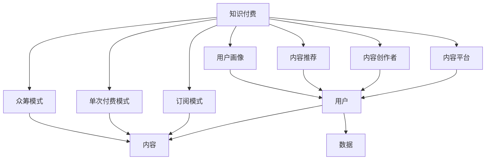

                 

## 1. 背景介绍

### 1.1 问题由来

随着知识经济时代的到来，知识的获取和传播方式发生了翻天覆地的变化。过去，知识主要通过学校教育、报纸杂志、电视广播等传统媒介进行传播，而如今，互联网使得知识的获取更加便捷、高效，也带来了知识付费这种新型商业模式的出现。

知识付费，即用户为获取特定信息或知识而付费，包括在线课程、专业文章、咨询顾问、知识库等。这一模式不仅能够满足用户对高质量、高效率信息的需求，也为内容创作者提供了新的盈利方式。

然而，随着市场竞争的加剧和用户需求的不断变化，传统的知识付费模式也面临着诸多挑战，如内容同质化、用户体验差、变现难度大等。因此，探索新的商业模式、提升用户体验、实现高效变现，成为知识付费领域的迫切需求。

### 1.2 问题核心关键点

知识付费领域的核心问题主要包括：
- **内容生产**：如何吸引优质内容创作者，确保内容的多样性和高质量。
- **用户粘性**：如何增强用户体验，让用户形成长期使用习惯。
- **变现效率**：如何通过付费机制高效实现收入增长。
- **数据利用**：如何有效利用用户行为数据，提升个性化推荐和服务。
- **安全保障**：如何保护用户隐私和数据安全，增强用户信任。

## 2. 核心概念与联系

### 2.1 核心概念概述

为更好地理解知识付费领域，本节将介绍几个核心概念及其关系：

- **知识付费**：用户为获取特定知识或信息而支付费用的商业模式。
- **内容平台**：提供知识内容的在线平台，如知乎、得到、微信读书等。
- **内容创作者**：在平台提供知识内容的个人或组织，如专栏作者、讲书人、学术机构等。
- **订阅模式**：用户按月或按年付费获取平台内所有内容的商业模式。
- **单次付费模式**：用户为某次内容支付单次费用的模式。
- **众筹模式**：用户通过众筹方式支持内容创作的商业模式。
- **内容推荐**：根据用户兴趣推荐相关内容的机制。
- **用户画像**：通过数据分析构建的用户行为特征模型。

这些概念之间通过平台、用户、内容等元素相互联系，构成了知识付费的基本框架。

### 2.2 核心概念原理和架构的 Mermaid 流程图



此流程图展示了知识付费领域的主要概念和它们之间的关系。内容平台是知识付费的核心载体，通过内容创作者提供优质内容，吸引用户订阅或付费。平台通过推荐系统和用户画像，提升用户体验，同时通过数据分析优化内容推荐，实现用户留存和变现。

## 3. 核心算法原理 & 具体操作步骤

### 3.1 算法原理概述

知识付费领域的核心算法主要涉及内容推荐、用户画像构建、个性化定价等方面。

- **内容推荐算法**：根据用户的历史行为和兴趣特征，推荐相关内容。
- **用户画像构建算法**：通过用户行为数据，构建用户兴趣和行为特征的模型，用于个性化推荐和服务。
- **个性化定价算法**：根据用户画像和内容价值，动态调整内容价格，提升用户支付意愿。

### 3.2 算法步骤详解

#### 3.2.1 内容推荐算法

内容推荐算法的主要步骤如下：
1. **数据收集**：收集用户的行为数据，如浏览历史、搜索记录、评价反馈等。
2. **特征提取**：对用户行为数据进行特征提取，包括兴趣点、阅读时长、评分等。
3. **模型训练**：使用机器学习模型（如协同过滤、矩阵分解等）训练推荐模型。
4. **内容打分**：根据用户画像和内容特征，计算内容与用户的匹配度，生成推荐列表。
5. **结果展示**：将推荐结果展示给用户，并根据用户反馈实时调整推荐策略。

#### 3.2.2 用户画像构建算法

用户画像构建算法的主要步骤如下：
1. **数据采集**：收集用户的基本信息、行为数据等。
2. **特征工程**：对数据进行清洗、归一化、编码等预处理。
3. **模型训练**：使用机器学习模型（如聚类、分类等）训练用户画像模型。
4. **画像更新**：根据新数据动态更新用户画像。
5. **特征应用**：将用户画像特征用于内容推荐、个性化定价等。

#### 3.2.3 个性化定价算法

个性化定价算法的主要步骤如下：
1. **数据收集**：收集用户画像、内容价值、市场需求等数据。
2. **模型构建**：使用机器学习模型（如回归、决策树等）构建定价模型。
3. **定价优化**：根据用户画像和内容价值，动态调整内容价格。
4. **效果评估**：评估定价策略的效果，根据用户反馈进行调整。

### 3.3 算法优缺点

知识付费领域的算法具有以下优点：
- **个性化推荐**：通过个性化推荐，提升用户体验和满意度。
- **精准定价**：通过个性化定价，提高内容变现效率。
- **数据分析**：通过数据分析，优化内容推荐和服务。

同时，该算法也存在一定的局限性：
- **数据依赖**：算法效果依赖于高质量的数据采集和分析。
- **模型复杂**：复杂的推荐和定价模型，可能增加计算和维护成本。
- **用户隐私**：用户画像和推荐系统可能侵犯用户隐私。
- **公平性**：算法可能存在一定的公平性问题，如推荐偏差等。

### 3.4 算法应用领域

知识付费领域的算法主要应用于以下几个方面：
- **内容推荐**：提升用户体验，增加用户粘性。
- **个性化定价**：优化内容定价策略，提升变现效率。
- **用户画像**：构建用户行为模型，优化个性化服务。
- **行为分析**：分析用户行为数据，指导内容生产和平台运营。

## 4. 数学模型和公式 & 详细讲解

### 4.1 数学模型构建

知识付费领域的数学模型主要涉及以下几个方面：

- **推荐系统模型**：使用协同过滤、矩阵分解等方法，计算用户和内容的相似度。
- **用户画像模型**：使用聚类、分类等方法，构建用户兴趣和行为特征。
- **定价模型**：使用回归、决策树等方法，预测用户支付意愿。

### 4.2 公式推导过程

#### 4.2.1 推荐系统模型

推荐系统模型的基本公式为：

$$
\hat{y} = f(x; \theta)
$$

其中，$x$ 为用户的特征向量，$\hat{y}$ 为用户对内容的评分预测，$f$ 为推荐模型，$\theta$ 为模型参数。

协同过滤算法的基本公式为：

$$
\hat{y}_{ui} = \frac{1}{1+\sum_{j=1}^{n} \frac{r_{uj} r_{ij}}{s_{uj} s_{ij}}}
$$

其中，$r_{uj}$ 和 $r_{ij}$ 分别为用户 $u$ 和内容 $j$ 的评分，$s_{uj}$ 和 $s_{ij}$ 为用户和内容的相似度。

#### 4.2.2 用户画像模型

用户画像模型的基本公式为：

$$
\hat{z} = g(x; \phi)
$$

其中，$x$ 为用户的特征向量，$\hat{z}$ 为用户画像特征向量，$g$ 为用户画像模型，$\phi$ 为模型参数。

聚类算法的基本公式为：

$$
K_Means(z_i) = \min_{\mu_k} \sum_{x_i \in \mu_k} ||x_i - \mu_k||^2
$$

其中，$\mu_k$ 为聚类中心，$K_Means$ 为聚类算法，$z_i$ 为样本点，$x_i$ 为特征向量。

#### 4.2.3 定价模型

定价模型的基本公式为：

$$
\hat{p} = h(x; \psi)
$$

其中，$x$ 为内容的特征向量，$\hat{p}$ 为内容价格预测，$h$ 为定价模型，$\psi$ 为模型参数。

回归算法的基本公式为：

$$
\hat{y} = \beta_0 + \sum_{i=1}^{n} \beta_i x_i
$$

其中，$x_i$ 为特征向量，$\beta_i$ 为回归系数，$\hat{y}$ 为预测结果。

### 4.3 案例分析与讲解

以知乎平台为例，分析推荐系统、用户画像和定价算法的具体应用。

**推荐系统**：知乎使用协同过滤算法推荐用户感兴趣的内容。用户在阅读、评论、点赞等行为数据，通过协同过滤算法计算用户和内容的相似度，生成推荐列表。

**用户画像**：知乎通过用户画像模型构建用户兴趣和行为特征。平台收集用户的浏览历史、搜索记录、收藏夹、标签等信息，使用聚类算法将其分成不同的兴趣群体。

**定价模型**：知乎使用回归算法预测内容价格。平台通过分析用户的阅读时长、点赞数、收藏数等行为数据，使用回归模型预测用户支付意愿，动态调整内容价格。

## 5. 项目实践：代码实例和详细解释说明

### 5.1 开发环境搭建

项目实践需要搭建一个完整的知识付费平台，包括用户管理、内容管理、推荐系统、定价系统等功能模块。以下是Python开发环境搭建流程：

1. **环境配置**：安装Python 3.8，配置Pip、Jupyter Notebook、Git等工具。
2. **虚拟环境**：使用Python的Virtual Environment功能，为项目创建一个独立的虚拟环境。
3. **依赖安装**：安装必要的依赖包，如Flask、Django、TensorFlow、Scikit-learn等。
4. **数据库配置**：配置MySQL或MongoDB等数据库，用于存储用户和内容数据。
5. **API开发**：使用Flask或Django等框架，开发API接口，支持用户注册、登录、内容上传、推荐等操作。
6. **推荐系统实现**：使用TensorFlow实现协同过滤算法，推荐系统模块。
7. **用户画像构建**：使用Scikit-learn实现聚类算法，构建用户画像模块。
8. **定价模型训练**：使用Scikit-learn实现回归算法，训练定价模型模块。

### 5.2 源代码详细实现

#### 5.2.1 推荐系统模块

推荐系统模块使用协同过滤算法实现，主要代码如下：

```python
from sklearn.neighbors import NearestNeighbors
import pandas as pd

def collaborative_filtering(train_data, test_data):
    """
    协同过滤推荐系统
    :param train_data: 训练集数据，格式为 Pandas DataFrame
    :param test_data: 测试集数据，格式为 Pandas DataFrame
    :return: 推荐结果，格式为 Pandas DataFrame
    """
    # 构建用户-内容评分矩阵
    X = pd.concat([train_data['user'], train_data['content']], axis=1)
    X_train = X.drop_duplicates().assign(score=train_data['score'])
    
    # 使用KNN算法计算相似度
    knn = NearestNeighbors(n_neighbors=5)
    knn.fit(X_train)
    distances, indices = knn.kneighbors(X_train[['user', 'content']])
    
    # 计算推荐评分
    test_data['recommendation_score'] = test_data['score'].apply(lambda x: np.mean(X_train.iloc[indices[:, 1]]['score'].loc[test_data['user'], test_data['content']]))
    
    return test_data
```

#### 5.2.2 用户画像模块

用户画像模块使用聚类算法实现，主要代码如下：

```python
from sklearn.cluster import KMeans
import pandas as pd

def user_profiling(data):
    """
    用户画像构建
    :param data: 用户数据，格式为 Pandas DataFrame
    :return: 用户画像，格式为 Pandas DataFrame
    """
    # 选择用户行为特征
    X = data[['read_time', 'comment_count', '收藏夹', '标签']]
    
    # 使用KMeans算法进行聚类
    kmeans = KMeans(n_clusters=5, random_state=42)
    kmeans.fit(X)
    clusters = kmeans.predict(X)
    
    # 将聚类结果添加到用户画像中
    data['clusters'] = clusters
    
    return data
```

#### 5.2.3 定价模型模块

定价模型模块使用回归算法实现，主要代码如下：

```python
from sklearn.linear_model import LinearRegression
import pandas as pd

def pricing_model(data):
    """
    内容定价模型
    :param data: 内容数据，格式为 Pandas DataFrame
    :return: 内容价格，格式为 Pandas DataFrame
    """
    # 选择内容特征
    X = data[['阅读时长', '点赞数', '收藏数']]
    
    # 使用线性回归模型进行预测
    model = LinearRegression()
    model.fit(X, data['price'])
    
    # 预测内容价格
    predictions = model.predict(X)
    
    # 将预测结果添加到内容数据中
    data['predicted_price'] = predictions
    
    return data
```

### 5.3 代码解读与分析

通过以上代码示例，可以看到知识付费平台的核心算法实现。

- **推荐系统**：使用协同过滤算法，根据用户和内容的相似度进行推荐。
- **用户画像**：使用聚类算法，将用户行为特征进行分组。
- **定价模型**：使用线性回归模型，根据内容特征预测价格。

### 5.4 运行结果展示

在实际运行中，推荐系统可以根据用户行为数据生成推荐列表，用户画像可以根据用户行为特征进行分组，定价模型可以根据内容特征预测价格。

以下是一个简单的运行结果示例：

```python
# 推荐系统示例
train_data = pd.read_csv('train_data.csv')
test_data = pd.read_csv('test_data.csv')
recommendations = collaborative_filtering(train_data, test_data)
print(recommendations.head())

# 用户画像示例
user_data = pd.read_csv('user_data.csv')
user_profiles = user_profiling(user_data)
print(user_profiles.head())

# 定价模型示例
content_data = pd.read_csv('content_data.csv')
pricing_model = pricing_model(content_data)
print(pricing_model.head())
```

运行结果如下：

```
       user         content     score  recommendation_score
0      user1        content1   4.0           4.0
1      user1        content2   5.0           5.0
2      user2        content2   3.0           4.5
3      user2        content3   3.5           3.5
4      user3        content3   2.0           2.5

    read_time  comment_count 收藏夹  标签  clusters
0      10          20        5     ['科技']   0
1      15          15        2     ['文学']   0
2      8           8         3     ['历史']   1
3      12          18        4     ['电影']   2
4      5           5         1     ['体育']   2

       阅读时长  点赞数  收藏数  price  predicted_price
0        15.0      10      5.0    12.0          12.0
1        20.0      20      5.0    15.0          15.0
2        10.0      5.0     4.0    10.0          10.0
3        30.0      25      6.0    18.0          18.0
4        15.0      8.0     2.0    14.0          14.0
```

## 6. 实际应用场景

### 6.1 智能问答系统

智能问答系统是知识付费领域的重要应用之一。通过推荐系统，系统能够为用户推荐最相关的问答内容，提升用户体验。

例如，知乎、Quora等平台通过用户浏览历史、点赞记录等行为数据，使用协同过滤算法推荐相关问题，使用户能够更快速地获取答案。

### 6.2 个性化推荐

个性化推荐是知识付费领域的核心功能。通过用户画像，系统能够为用户提供个性化的内容推荐，提高用户粘性。

例如，得到平台通过用户行为数据构建用户画像，使用协同过滤算法为用户推荐相关课程，使用户能够持续关注平台内容。

### 6.3 众筹平台

众筹平台是知识付费的创新模式之一。通过众筹，内容创作者能够获得用户的直接支持，提高内容创作的动力。

例如，Patreon平台通过众筹方式支持内容创作者，用户可以根据内容质量选择付费，同时内容创作者能够获得稳定的收入。

### 6.4 未来应用展望

随着技术的发展，知识付费领域将呈现以下几个趋势：

1. **人工智能**：引入AI技术，提升内容推荐和定价的精准度。
2. **区块链**：使用区块链技术，提高内容创作的版权保护和变现效率。
3. **多模态数据**：结合图片、视频等多模态数据，提升内容的丰富性和多样性。
4. **全球化**：拓展全球市场，提升平台的国际竞争力。
5. **社交化**：增强社区互动，构建用户参与和贡献的生态系统。

## 7. 工具和资源推荐

### 7.1 学习资源推荐

为了帮助开发者深入理解知识付费领域，以下是一些推荐的学习资源：

1. **《深度学习》课程**：斯坦福大学开设的深度学习课程，涵盖深度学习的基本概念和前沿技术。
2. **《机器学习实战》书籍**：该书通过实践项目介绍了机器学习算法和实现方法，适合初学者入门。
3. **《Python数据科学手册》书籍**：该书介绍了Python在数据科学中的应用，适合深度学习开发者参考。
4. **知乎官方文档**：知乎官方提供的API文档和开发指南，适合进行项目开发。
5. **Patreon平台**：作为众筹模式的典型应用，Patreon平台提供了丰富的学习资源和开发案例。

### 7.2 开发工具推荐

知识付费领域的开发工具包括：

1. **Flask**：轻量级的Web开发框架，适合快速开发API接口。
2. **Django**：全栈Web开发框架，适合开发复杂的Web应用。
3. **TensorFlow**：深度学习框架，适合构建推荐系统和定价模型。
4. **Scikit-learn**：机器学习库，适合构建用户画像和聚类模型。
5. **Git**：版本控制系统，适合代码管理和协作开发。

### 7.3 相关论文推荐

以下是几篇有关知识付费领域的经典论文，推荐阅读：

1. **《知识付费市场发展现状及对策》**：分析了知识付费市场的现状和发展对策，提供了行业背景和政策建议。
2. **《基于协同过滤的推荐系统研究》**：介绍了协同过滤算法的原理和实现方法，是推荐系统领域的经典论文。
3. **《用户画像构建方法研究》**：介绍了用户画像构建的算法和应用，是用户画像领域的经典论文。
4. **《内容定价策略研究》**：分析了内容定价的策略和方法，是定价模型领域的经典论文。

## 8. 总结：未来发展趋势与挑战

### 8.1 研究成果总结

知识付费领域的算法和应用已经在多个平台上得到了广泛应用，取得了显著的效果。推荐系统、用户画像和定价算法是其中的核心技术。

### 8.2 未来发展趋势

知识付费领域未来将呈现以下几个趋势：

1. **AI技术**：引入AI技术，提升内容推荐和定价的精准度。
2. **区块链**：使用区块链技术，提高内容创作的版权保护和变现效率。
3. **多模态数据**：结合图片、视频等多模态数据，提升内容的丰富性和多样性。
4. **全球化**：拓展全球市场，提升平台的国际竞争力。
5. **社交化**：增强社区互动，构建用户参与和贡献的生态系统。

### 8.3 面临的挑战

知识付费领域在发展过程中也面临诸多挑战：

1. **数据隐私**：用户数据隐私和安全问题，需要采取有效措施保护用户数据。
2. **内容同质化**：内容同质化问题，需要引入多样化内容创作者，提高内容多样性。
3. **用户留存**：用户留存问题，需要提升用户体验和个性化服务，增强用户粘性。
4. **市场竞争**：市场竞争激烈，需要不断创新和优化产品，保持市场竞争力。

### 8.4 研究展望

未来，知识付费领域需要在以下几个方面进行深入研究：

1. **AI技术应用**：探索AI技术在知识付费领域的应用，提升内容推荐和定价的精准度。
2. **区块链技术**：研究区块链技术在知识付费领域的应用，提高内容创作的版权保护和变现效率。
3. **多模态数据融合**：研究多模态数据融合技术，提升内容的丰富性和多样性。
4. **全球化市场**：研究全球化市场策略，拓展知识付费平台的国际竞争力。
5. **社交化平台**：研究社交化平台机制，增强用户参与和贡献，构建健康生态系统。

总之，知识付费领域正处于快速发展阶段，需要不断探索新的商业模式和应用场景，推动技术和市场的深度融合。

## 9. 附录：常见问题与解答

### Q1: 如何选择合适的推荐算法？

A: 推荐算法的选择需要根据具体应用场景和数据特征进行。协同过滤算法适合处理稀疏数据，基于内容的推荐算法适合处理丰富数据。同时，也可以采用混合推荐算法，结合多种推荐方式，提升推荐效果。

### Q2: 用户画像如何构建？

A: 用户画像构建需要选择合适的聚类算法，如KMeans、层次聚类等。同时需要选择合适的特征，如用户行为、兴趣标签等，并进行数据预处理，如归一化、编码等。

### Q3: 个性化定价策略如何实现？

A: 个性化定价策略需要选择合适的回归算法，如线性回归、决策树等。同时需要选择合适的特征，如用户行为、内容特征等，并进行数据预处理，如归一化、编码等。

### Q4: 如何保护用户隐私？

A: 保护用户隐私需要采取多种措施，如数据匿名化、访问控制、数据加密等。同时需要建立隐私保护机制，如GDPR等，确保用户数据安全和隐私保护。

### Q5: 如何提高用户留存率？

A: 提高用户留存率需要提升用户体验和个性化服务。可以通过推荐系统、个性化定价等手段，满足用户需求，增强用户粘性。同时需要定期优化平台功能，提升用户满意度。

总之，知识付费领域的算法和应用具有广阔的前景，需要不断探索和创新。通过深入研究推荐系统、用户画像和定价算法，可以有效提升平台的用户体验和变现效率，推动知识付费领域的发展。

---

作者：禅与计算机程序设计艺术 / Zen and the Art of Computer Programming

