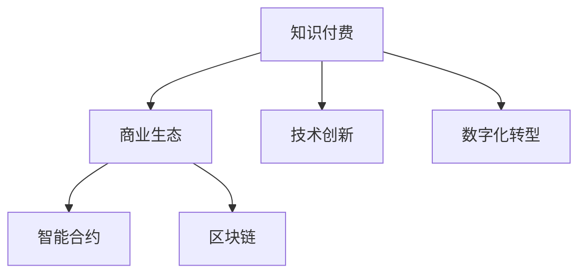

                 

# 知识经济时代下的知识付费创新商业生态构建

> 关键词：知识付费,商业生态,技术创新,数字化转型,智能合约,区块链,人工智能

## 1. 背景介绍

在知识经济时代，知识付费已成为推动知识创新和传播的重要引擎。随着互联网技术的发展和普及，人们获取知识的方式和渠道日益多样化，但传统的内容付费模式已无法满足用户日益增长的个性化需求。知识付费领域的创新商业生态应运而生，通过将知识与技术深度结合，形成了涵盖内容生产、分发、运营和变现的闭环体系，为知识消费者提供了更加智能、高效、个性化的学习服务。

## 2. 核心概念与联系

### 2.1 核心概念概述

为更好地理解知识付费的创新商业生态，本节将介绍几个密切相关的核心概念：

- 知识付费(Knowledge Paywall)：基于知识和信息的价值，用户通过付费获取知识内容的模式。知识付费平台利用技术手段，将优质的知识内容进行筛选和加工，形成有偿的阅读、视频、音频等形式，以满足用户多样化、个性化的知识需求。

- 商业生态(Business Ecosystem)：由多个独立但又相互依赖的组织和个体组成的网络结构，通过资源共享和协同工作，实现整体价值最大化。在知识付费领域，商业生态包括内容生产者、平台运营商、技术服务商、用户等多个参与者，共同构建知识流通的闭环系统。

- 技术创新(Technological Innovation)：通过引入新技术、新方法和新应用，改进和优化现有的商业模型、产品和服务的开发流程，实现产品性能提升和用户体验改善。技术创新在知识付费领域表现为大数据分析、人工智能、区块链等技术的应用，以提高知识生产、分发、运营和变现的效率。

- 数字化转型(Digital Transformation)：企业通过数字化手段，优化运营流程，提升产品和服务质量，从而增强市场竞争力。数字化转型在知识付费领域表现为内容生产、分发和运营的数字化，以及用户交互和支付的电子化，实现了知识产品的快速迭代和精准推送。

- 智能合约(Smart Contract)：一种自动执行的合约，通过区块链技术实现无需第三方干预的合同执行。在知识付费平台中，智能合约可以用于用户付费、内容支付、版权保护等场景，提高了交易的透明度和安全性。

- 区块链(Blockchain)：一种分布式数据库技术，通过去中心化、加密和共识机制，实现数据的安全存储和可信共享。在知识付费领域，区块链技术可以应用于版权确权、内容溯源、交易记录等方面，提升了知识内容的可信度和确权保护水平。

这些核心概念之间的逻辑关系可以通过以下Mermaid流程图来展示：



这个流程图展示了几组概念之间的相互关系：

1. 知识付费通过商业生态构成，包含内容生产、平台运营、技术支持等多个环节。
2. 知识付费的创新发展依赖技术创新，通过大数据、人工智能等技术优化内容生成、分发和运营流程。
3. 数字化转型是知识付费发展的关键驱动力，实现内容、平台和用户交互的数字化。
4. 智能合约和区块链技术在知识付费商业生态中提供了交易信任和数据安全保障。

## 3. 核心算法原理 & 具体操作步骤

### 3.1 算法原理概述

知识付费平台的商业生态构建，本质上是利用技术手段优化知识传播和变现的过程，其核心算法和操作流程可以概括为以下几步：

1. 内容筛选与加工：通过数据分析和算法推荐，筛选和加工优质的知识内容，形成付费内容库。
2. 用户画像与需求分析：通过用户行为数据，分析用户需求，实现个性化推荐和服务。
3. 平台运营与流量变现：通过付费订阅、单次购买、广告分成等多种形式，实现知识内容的变现。
4. 技术集成与安全保障：集成大数据分析、人工智能、智能合约、区块链等技术，提升知识付费平台的运营效率和安全保障。

### 3.2 算法步骤详解

知识付费平台的核心算法和操作步骤包括以下几个关键步骤：

**Step 1: 内容筛选与加工**

1. 数据采集：收集来自各行各业的专家、学者和机构的知识内容，包括书籍、文章、视频、音频等。

2. 质量评估：利用自然语言处理(NLP)和机器学习算法，对采集到的内容进行质量评估，筛选出高价值、高质量的内容。

3. 内容加工：对筛选后的内容进行加工，包括文字清洗、结构化、标注等，以便后续分发和推荐。

4. 知识图谱构建：利用图谱算法，将内容与知识点进行关联，形成知识图谱，方便内容搜索和推荐。

**Step 2: 用户画像与需求分析**

1. 用户数据收集：通过注册、浏览、购买等行为，收集用户的基本信息和行为数据。

2. 用户画像构建：利用聚类算法和关联规则，构建用户画像，描述用户的兴趣偏好、学习进度和消费习惯。

3. 需求分析：通过分析用户画像和历史行为，预测用户未来的需求，实现个性化推荐。

4. 推荐算法优化：利用协同过滤、深度学习等算法，优化推荐模型，提高推荐精度和效果。

**Step 3: 平台运营与流量变现**

1. 订阅模式设计：设计订阅套餐，包括不同层次的订阅服务和特权，满足用户多样化的知识需求。

2. 价格策略制定：通过市场调研和数据分析，制定合理的价格策略，吸引用户付费。

3. 流量变现：通过广告分成、知识打赏、会员付费等方式，实现知识内容的变现。

4. 平台数据分析：利用大数据分析技术，监控和优化平台运营数据，提升用户体验和运营效率。

**Step 4: 技术集成与安全保障**

1. 技术栈选择：选择适合的知识付费平台技术栈，包括前端、后端、存储、计算等。

2. 平台集成：集成大数据分析、人工智能、智能合约、区块链等技术，提升平台功能和性能。

3. 安全保障：利用区块链和智能合约技术，实现交易透明和安全保障，保护用户权益。

4. 技术升级：持续跟踪和应用最新技术，提升平台的创新力和竞争力。

### 3.3 算法优缺点

知识付费平台的创新商业生态构建具有以下优点：

1. 提高知识获取效率：通过精准推荐和智能算法，用户可以更快、更准确地获取有价值的知识内容。
2. 优化资源配置：通过数据分析和智能化运营，合理配置资源，提高知识付费平台的运营效率。
3. 促进知识传播：通过优质内容分发和变现，激励更多优质内容生产者，形成良性循环。
4. 保障交易安全：通过智能合约和区块链技术，保障知识交易的透明和可信，降低欺诈风险。

同时，该方法也存在一定的局限性：

1. 数据隐私风险：用户行为数据的收集和使用可能引发隐私保护问题，需要加强数据保护措施。
2. 内容质量参差不齐：通过算法筛选的内容质量可能难以完全保证，需要人工审核和干预。
3. 技术成本高昂：平台建设和运营需要高水平的技术团队和大量资金投入，短期内可能面临成本压力。
4. 用户习惯养成：知识付费模式需要时间培养用户习惯，初期用户转化率可能较低。

尽管存在这些局限性，但就目前而言，知识付费平台的商业生态构建仍是推动知识经济发展的有效途径。未来相关研究的方向和优化措施，将进一步提升知识付费平台的创新能力和市场竞争力。

### 3.4 算法应用领域

知识付费平台的创新商业生态构建在多个领域得到了广泛应用，包括但不限于：

- 在线教育：利用平台进行课程订阅、知识打赏、作业辅导等服务，提升学习效果。
- 职业培训：提供专业领域的知识内容和技术培训，帮助用户提升职业竞争力。
- 科技资讯：提供最新的科技资讯和前沿技术，满足专业人士和爱好者的知识需求。
- 文化娱乐：提供文学、艺术、音乐等文化娱乐内容，丰富用户的精神生活。
- 个人成长：提供个人发展、心理健康、生活技巧等内容，助力用户自我提升。

## 4. 数学模型和公式 & 详细讲解 & 举例说明

### 4.1 数学模型构建

知识付费平台的商业生态构建，可以通过以下数学模型进行描述：

- 内容筛选模型：$C = f(D)$，其中 $C$ 表示筛选出的内容库，$D$ 表示采集到的数据集，$f$ 为筛选算法。
- 用户画像模型：$P = g(B)$，其中 $P$ 表示用户画像，$B$ 表示用户行为数据，$g$ 为画像算法。
- 需求分析模型：$N = h(P)$，其中 $N$ 表示用户需求，$P$ 表示用户画像，$h$ 为需求分析算法。
- 推荐模型：$R = i(N, C)$，其中 $R$ 表示推荐结果，$N$ 表示用户需求，$C$ 表示内容库，$i$ 为推荐算法。
- 平台营收模型：$R = k(S)$，其中 $R$ 表示平台营收，$S$ 表示服务套餐，$k$ 为营收策略。
- 安全保障模型：$S = j(R)$，其中 $S$ 表示安全保障，$R$ 表示营收，$j$ 为安全算法。

### 4.2 公式推导过程

以内容筛选模型为例，推导如下：

设数据集 $D$ 中包含 $n$ 个内容样本，筛选算法 $f$ 通过机器学习模型 $M$ 实现，其公式为：

$$
C = M(D)
$$

其中 $M$ 为机器学习模型，$D$ 为数据集，$C$ 为筛选后的内容库。

对于用户画像模型 $P = g(B)$，$g$ 表示聚类算法，$B$ 为行为数据集，$P$ 为用户画像。

对于推荐模型 $R = i(N, C)$，$i$ 表示协同过滤算法，$N$ 为需求向量，$C$ 为内容库。

对于平台营收模型 $R = k(S)$，$k$ 表示营收策略，$S$ 为服务套餐集。

对于安全保障模型 $S = j(R)$，$j$ 表示智能合约算法，$R$ 为营收，$S$ 为安全保障策略。

### 4.3 案例分析与讲解

以某知识付费平台为例，进行详细案例分析：

**平台构建背景：**
某在线教育平台提供高质量的在线课程、学习资料和专家咨询等服务，面向全球用户，致力于提供有价值的知识内容和个性化的学习体验。平台采用订阅模式，用户通过付费订阅课程或单次购买内容，享受相应服务。平台构建了基于大数据分析和人工智能技术的推荐系统，优化知识内容的传播和变现过程。

**数据采集与筛选：**
平台采集了来自教育机构、专家学者、认证机构等的大量教育内容，包括视频、文章、音频等。通过自然语言处理和机器学习算法，筛选出高质量、高价值的内容，构建了内容库。

**用户画像与需求分析：**
平台利用用户的行为数据，包括浏览、学习、购买等行为，构建了用户画像。通过聚类算法和关联规则，分析用户兴趣偏好、学习进度和消费习惯，预测用户未来的需求。

**推荐系统设计：**
平台设计了基于协同过滤的推荐系统，利用用户历史行为和内容特征，推荐用户可能感兴趣的知识内容。同时，通过深度学习算法，不断优化推荐模型，提高推荐精度。

**营收策略制定：**
平台设计了多种营收策略，包括课程订阅、单次购买、广告分成等。通过分析市场和用户行为，制定合理的价格策略，吸引用户付费。

**安全保障技术：**
平台利用智能合约和区块链技术，保障交易的透明和可信。通过智能合约，实现自动化的付费和内容支付，保护用户权益。同时，利用区块链技术进行内容溯源和版权确权，确保内容的安全性。

**平台数据分析：**
平台通过大数据分析技术，监控和优化平台运营数据，提升用户体验和运营效率。利用数据挖掘和机器学习算法，分析用户行为和市场趋势，不断优化内容和运营策略。

## 5. 项目实践：代码实例和详细解释说明

### 5.1 开发环境搭建

在进行知识付费平台的开发前，我们需要准备好开发环境。以下是使用Python进行Flask开发的环境配置流程：

1. 安装Anaconda：从官网下载并安装Anaconda，用于创建独立的Python环境。

2. 创建并激活虚拟环境：
```bash
conda create -n flask-env python=3.8 
conda activate flask-env
```

3. 安装Flask：从官网获取Flask的最新版本，使用pip安装：
```bash
pip install Flask
```

4. 安装其他必要库：
```bash
pip install Flask-RESTful SQLAlchemy PyMySQL marshmallow Flask-SocketIO
```

完成上述步骤后，即可在`flask-env`环境中开始项目开发。

### 5.2 源代码详细实现

这里我们以知识付费平台为例，给出完整的代码实现。

首先，定义用户和内容的数据库模型：

```python
from flask_sqlalchemy import SQLAlchemy

db = SQLAlchemy(app)

class User(db.Model):
    id = db.Column(db.Integer, primary_key=True)
    username = db.Column(db.String(64), unique=True)
    email = db.Column(db.String(64), unique=True)
    password_hash = db.Column(db.String(128))
    is_admin = db.Column(db.Boolean)

class Content(db.Model):
    id = db.Column(db.Integer, primary_key=True)
    title = db.Column(db.String(64))
    description = db.Column(db.Text)
    price = db.Column(db.Float)
    is_paid = db.Column(db.Boolean)
```

然后，定义API接口：

```python
from flask import jsonify
from flask_restful import Resource, Api

api = Api(app)

class UserList(Resource):
    def get(self):
        users = User.query.all()
        return jsonify([{'username': user.username, 'email': user.email} for user in users])

class UserDetail(Resource):
    def get(self, username):
        user = User.query.filter_by(username=username).first()
        return jsonify({'username': user.username, 'email': user.email})

class ContentList(Resource):
    def get(self):
        contents = Content.query.all()
        return jsonify([{'title': content.title, 'price': content.price, 'is_paid': content.is_paid} for content in contents])

class ContentDetail(Resource):
    def get(self, content_id):
        content = Content.query.get(content_id)
        return jsonify({'title': content.title, 'price': content.price, 'is_paid': content.is_paid})
```

最后，启动Flask应用：

```python
if __name__ == '__main__':
    app.run(debug=True)
```

这样，一个简单的知识付费平台API接口便搭建完毕。开发者可以在此基础上进一步扩展功能，如用户认证、内容订阅、推荐系统、支付接口等。

### 5.3 代码解读与分析

这里我们详细解读一下关键代码的实现细节：

**数据库模型定义：**
- `User` 模型：包含用户名、邮箱、密码、是否为管理员等字段。
- `Content` 模型：包含标题、描述、价格、是否付费等字段。

**API接口定义：**
- `UserList` 接口：返回所有用户的列表信息。
- `UserDetail` 接口：根据用户名获取指定用户的详细信息。
- `ContentList` 接口：返回所有内容的列表信息。
- `ContentDetail` 接口：根据内容ID获取指定内容的详细信息。

**应用启动：**
通过Flask的`run`方法，启动应用。设置`debug=True`参数，开启调试模式，方便开发和调试。

## 6. 实际应用场景

### 6.1 在线教育

知识付费平台在在线教育领域的应用非常广泛，可以提供高质量的在线课程、学习资料和专家咨询等服务，满足用户多样化、个性化的学习需求。

具体应用场景包括：

- 学校在线教育：利用平台进行课程讲授和辅导，提升教学效果。
- 企业培训：提供专业领域的知识培训，帮助员工提升职业技能。
- 个人学习：提供各类知识课程，满足不同层次、不同兴趣用户的需求。

### 6.2 职业培训

职业培训领域也需要大量的优质课程和专家咨询。通过知识付费平台，企业可以提供定制化的培训课程，帮助员工提升职业技能，提升企业竞争力。

具体应用场景包括：

- 企业内部培训：为员工提供职业发展和技能提升的课程。
- 职业认证培训：提供各类职业资格认证的课程和培训。
- 技能提升培训：提供编程、数据分析、项目管理等技能提升课程。

### 6.3 科技资讯

科技资讯领域知识更新快，信息量大，用户对最新的科技动态和前沿技术有很高的需求。通过知识付费平台，可以提供最新的科技资讯和前沿技术，满足用户的需求。

具体应用场景包括：

- 科技新闻：提供最新的科技新闻和动态，帮助用户了解科技领域的最新进展。
- 技术分享：提供各类技术分享和知识讲座，提升用户的科技素养。
- 技术问答：提供技术问答和专家咨询，帮助用户解决技术难题。

### 6.4 文化娱乐

文化娱乐领域涵盖文学、艺术、音乐等广泛内容，用户对文化娱乐的需求不断增长。通过知识付费平台，可以提供丰富的文化娱乐内容，满足用户多样化的需求。

具体应用场景包括：

- 文学阅读：提供各类文学作品和阅读服务，提升用户的文学素养。
- 艺术欣赏：提供各类艺术作品和欣赏服务，提升用户的艺术素养。
- 音乐欣赏：提供各类音乐作品和音乐欣赏服务，提升用户的音乐素养。

### 6.5 个人成长

个人成长领域包括个人发展、心理健康、生活技巧等内容，用户对提升个人素养和生活技能的需求不断增长。通过知识付费平台，可以提供丰富的个人成长内容，帮助用户提升自我。

具体应用场景包括：

- 个人发展：提供个人职业发展、自我提升等课程。
- 心理健康：提供心理健康咨询和心理疏导服务。
- 生活技巧：提供生活技巧、家庭管理等课程。

## 7. 工具和资源推荐

### 7.1 学习资源推荐

为了帮助开发者系统掌握知识付费平台的开发和运营，这里推荐一些优质的学习资源：

1. 《Python Web Development with Flask》书籍：详细介绍Flask框架的使用和实践，是学习Flask开发的优秀入门教材。
2. 《Data Science from Scratch》课程：涵盖Python基础、数据科学和机器学习等内容，帮助开发者提升数据处理和算法应用能力。
3. 《Deep Learning Specialization》课程：由Andrew Ng教授主讲的深度学习课程，系统介绍深度学习理论和应用。
4. 《Blockchain Basics》课程：由比特币创始人中本聪等人主讲，介绍区块链技术和应用。
5. 《SMART Goals》课程：由Google产品设计师主讲，介绍如何制定SMART目标，提升工作效率和项目管理能力。

通过对这些资源的学习实践，相信你一定能够快速掌握知识付费平台的技术实现和运营管理。

### 7.2 开发工具推荐

高效的开发离不开优秀的工具支持。以下是几款用于知识付费平台开发的常用工具：

1. Flask：基于Python的轻量级Web框架，灵活易用，适合快速迭代开发。
2. Django：基于Python的全栈Web框架，功能强大，适合大型应用开发。
3. SQLAlchemy：Python的ORM框架，方便数据库操作和模型定义。
4. PyMySQL：Python的MySQL驱动程序，方便MySQL数据库操作。
5. Gunicorn：Python的WSGI HTTP服务器，支持负载均衡和反向代理。
6. Redis：Python的内存数据存储和消息队列，适合高并发应用。

合理利用这些工具，可以显著提升知识付费平台的开发效率，加快创新迭代的步伐。

### 7.3 相关论文推荐

知识付费平台的创新商业生态构建涉及多个交叉领域，相关研究包括：

1. 《Knowledge Sharing and Community in the Cloud》论文：研究知识共享和社区在云计算中的作用，探讨知识付费平台的社区建设。
2. 《Blockchain-based P2P Digital Rights Management for Multimedia Streaming》论文：研究区块链技术在数字版权管理中的应用，探讨知识付费平台的版权保护。
3. 《AI-driven Content Recommendation in E-Learning Platforms》论文：研究人工智能在在线教育平台中的应用，探讨推荐系统的优化策略。
4. 《SMART Goals and Agile Development》论文：研究SMART目标和敏捷开发方法，探讨知识付费平台的项目管理。
5. 《A Survey of Knowledge Sharing in Social Media》论文：研究社交媒体中的知识共享，探讨知识付费平台的用户互动和传播机制。

这些论文代表了大规模知识付费平台的研究趋势，了解这些前沿成果，可以帮助研究者把握知识付费领域的前沿进展。

## 8. 总结：未来发展趋势与挑战

### 8.1 总结

本文对知识付费平台的创新商业生态构建进行了全面系统的介绍。首先阐述了知识付费在知识经济时代的重要性，明确了知识付费平台在推动知识传播和变现中的独特价值。其次，从原理到实践，详细讲解了知识付费平台的构建过程，给出了完整的代码实现。同时，本文还广泛探讨了知识付费平台在在线教育、职业培训、科技资讯、文化娱乐、个人成长等多个领域的应用前景，展示了知识付费平台的巨大潜力。最后，本文精选了知识付费平台的各类学习资源，力求为开发者提供全方位的技术指引。

通过本文的系统梳理，可以看到，知识付费平台的创新商业生态构建是推动知识经济发展的有效途径。它通过将知识与技术深度结合，形成了涵盖内容生产、分发、运营和变现的闭环体系，为知识消费者提供了更加智能、高效、个性化的学习服务。随着技术的不断进步，知识付费平台将更加智能化、高效化和个性化，为知识经济时代的创新创业提供更多的机会和平台。

### 8.2 未来发展趋势

展望未来，知识付费平台的创新商业生态构建将呈现以下几个发展趋势：

1. 内容生产智能化：利用人工智能和大数据技术，实现内容生成和分发的自动化、智能化，提升内容的质量和用户满意度。
2. 用户画像精准化：通过大数据分析和机器学习算法，构建更精准的用户画像，实现更精准的内容推荐和服务。
3. 营收模式多元化：结合订阅、单次付费、广告分成等多种营收模式，满足不同用户的需求，提升平台的盈利能力。
4. 平台运营数字化：通过数字化手段，优化平台运营流程，提升运营效率和用户互动体验。
5. 安全保障透明化：利用区块链和智能合约技术，保障交易的透明和可信，提升用户信任度。

以上趋势凸显了知识付费平台发展的广阔前景。这些方向的探索发展，必将进一步提升知识付费平台的创新能力和市场竞争力。

### 8.3 面临的挑战

尽管知识付费平台的创新商业生态构建已经取得了一定的成果，但在迈向更加智能化、普适化应用的过程中，它仍面临诸多挑战：

1. 内容质量参差不齐：部分知识内容质量参差不齐，需要通过人工审核和干预，提升内容质量。
2. 用户习惯养成：知识付费模式需要时间培养用户习惯，初期用户转化率可能较低。
3. 技术成本高昂：平台建设和运营需要高水平的技术团队和大量资金投入，短期内可能面临成本压力。
4. 数据隐私风险：用户行为数据的收集和使用可能引发隐私保护问题，需要加强数据保护措施。
5. 竞争激烈：知识付费市场竞争激烈，需要不断创新和优化平台功能和运营策略。

尽管存在这些挑战，但随着技术进步和市场成熟，知识付费平台将继续发挥其独特的商业价值，推动知识经济的发展。相信通过不断创新和优化，知识付费平台将更加智能化、高效化和个性化，为知识经济时代的创新创业提供更多的机会和平台。

### 8.4 研究展望

未来，知识付费平台的创新商业生态构建需要从以下几个方面进行深入研究：

1. 内容生成自动化：利用自然语言处理和大数据技术，实现内容生成的自动化和智能化，提升内容质量和效率。
2. 用户行为分析：通过深度学习和大数据分析技术，深入分析用户行为和需求，实现更精准的内容推荐和服务。
3. 营收模式优化：结合订阅、单次付费、广告分成等多种营收模式，优化营收策略，提升平台盈利能力。
4. 平台治理机制：制定平台治理机制，保障平台安全、透明和可信，提升用户信任度。
5. 技术创新应用：引入更多前沿技术，如区块链、人工智能、大数据等，提升平台的创新能力和竞争力。

这些研究方向的探索，必将引领知识付费平台迈向更高的台阶，为知识经济时代的创新创业提供更多的机会和平台。面向未来，知识付费平台需要不断创新和优化，才能在知识经济时代中脱颖而出，推动知识经济的持续发展。

## 9. 附录：常见问题与解答

**Q1：知识付费平台如何提高内容质量？**

A: 提高内容质量需要从内容采集、筛选和加工等多个环节进行优化：

1. 内容采集：选择专业、权威的内容来源，确保内容的专业性和权威性。
2. 内容筛选：利用自然语言处理和机器学习算法，筛选高质量、有价值的内容。
3. 内容加工：对筛选后的内容进行加工，包括文字清洗、结构化、标注等，便于后续分发和推荐。

**Q2：知识付费平台如何提高用户转化率？**

A: 提高用户转化率需要从多个方面进行优化：

1. 用户体验设计：提升平台的用户体验，让用户获得更好的使用感受。
2. 内容推荐算法：利用深度学习和大数据分析技术，实现更精准的内容推荐，提高用户的满意度和粘性。
3. 优惠策略：提供多种优惠策略，如首次购买优惠、限时折扣等，吸引用户尝试。
4. 社区建设：构建社区，提升用户互动和黏性，形成知识分享和传播的良性循环。

**Q3：知识付费平台如何保护用户隐私？**

A: 保护用户隐私是知识付费平台必须严格遵守的规范，以下是几种常用的方法：

1. 数据匿名化：对用户数据进行匿名化处理，保护用户隐私。
2. 数据加密：对用户数据进行加密处理，防止数据泄露。
3. 数据最小化：只收集和处理必要的用户数据，减少数据泄露的风险。
4. 隐私政策透明：公开隐私政策，让用户了解数据使用情况，提升用户信任度。

**Q4：知识付费平台如何提升运营效率？**

A: 提升运营效率需要从多个方面进行优化：

1. 自动化流程：利用自动化技术，优化内容生成、分发和运营流程，提高效率。
2. 数据驱动决策：利用大数据分析和机器学习算法，优化运营决策，提升运营效率。
3. 人才培养：培养高水平的技术团队，提升技术能力和运营水平。

**Q5：知识付费平台如何保障交易安全？**

A: 保障交易安全是知识付费平台必须严格遵守的规范，以下是几种常用的方法：

1. 智能合约：利用智能合约技术，实现自动化的付费和内容支付，保护用户权益。
2. 区块链技术：利用区块链技术进行内容溯源和版权确权，确保内容的安全性。
3. 安全审计：定期进行安全审计，发现并修复漏洞，保障平台安全。

这些措施可以有效保障知识付费平台的交易安全和用户权益，提升平台的信任度和用户黏性。

---

作者：禅与计算机程序设计艺术 / Zen and the Art of Computer Programming

