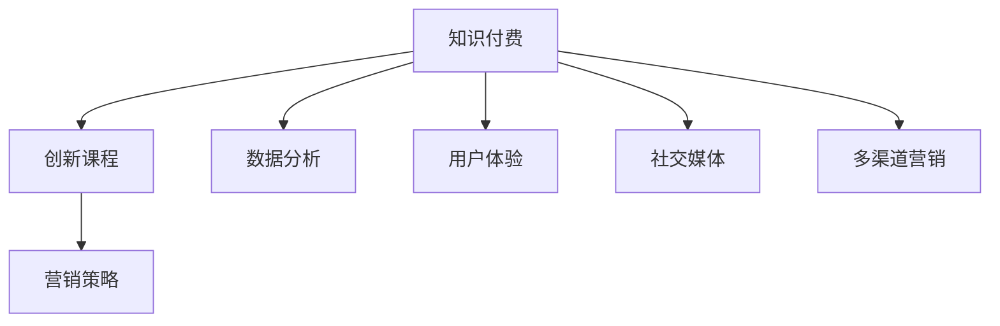

                 

# 知识经济时代下的知识付费创新课程营销策略

> 关键词：知识付费, 创新课程, 营销策略, 数据分析, 用户体验, 社交媒体, 多渠道营销

## 1. 背景介绍

### 1.1 问题由来
随着知识经济时代的到来，知识付费成为新的消费趋势。在线教育平台如雨后春笋般涌现，各类课程、讲座、文章、电子书等知识产品层出不穷，满足了用户对知识的需求和获取知识的渴望。然而，在知识付费的浪潮中，内容同质化、用户流失率高、转化率低等现象依然存在，如何吸引用户付费，提高课程营销效果，成为教育平台面临的重要问题。

### 1.2 问题核心关键点
在知识经济时代，课程营销的成功与否，直接关系到教育平台的用户获取和收入增长。如何在竞争激烈的市场中脱颖而出，提升课程转化率，是教育平台亟需解决的核心挑战。本节将从课程内容和营销策略两个方面，深入探讨知识付费市场的成功之道。

### 1.3 问题研究意义
研究知识付费市场，不仅有助于教育平台优化课程设计和营销策略，还能为潜在用户提供更优质的知识产品，满足其学习需求，推动知识的传播和应用。

## 2. 核心概念与联系

### 2.1 核心概念概述

为更好地理解知识付费市场，本节将介绍几个密切相关的核心概念：

- 知识付费：用户为获取专业知识或技能，支付一定费用购买在线课程、讲座、电子书等知识产品的消费模式。
- 创新课程：课程开发者结合前沿技术和研究，创造出新颖、实用、富有吸引力的课程内容，区别于传统的理论讲授。
- 营销策略：教育平台为推广课程所采用的宣传、推广、销售等综合手段，目标是提升课程知名度和用户转化率。
- 数据分析：通过收集、处理、分析用户行为数据，了解用户需求和行为特征，指导营销策略的优化。
- 用户体验：课程设计、平台功能、服务体验等因素的综合表现，直接影响用户的满意度和粘性。
- 社交媒体：如微信、微博、抖音等社交平台，是课程推广的重要渠道，能有效提升课程曝光率。
- 多渠道营销：结合线上线下的多种渠道进行课程推广，最大化覆盖目标用户。

这些核心概念之间的逻辑关系可以通过以下Mermaid流程图来展示：



这个流程图展示了我知识付费市场的核心概念及其之间的关系：

1. 知识付费市场以创新课程为内容基础。
2. 创新课程需要通过营销策略进行推广。
3. 数据分析和用户体验指导营销策略的优化。
4. 社交媒体和多渠道营销手段进一步扩大课程覆盖面。

## 3. 核心算法原理 & 具体操作步骤
### 3.1 算法原理概述

知识付费市场的营销策略，本质上是一个综合性的多目标优化问题。其核心思想是：通过数据分析和用户行为研究，识别出用户的兴趣点和需求，进而设计出符合用户需求的创新课程，并采用有效的营销手段推广这些课程，提升用户转化率和平台收入。

形式化地，假设课程营销的目标函数为 $f(\textit{Course}, \textit{Strategy})$，其中 $\textit{Course}$ 为课程内容特征，$\textit{Strategy}$ 为营销策略特征。目标函数旨在最大化课程的覆盖率、参与度、用户转化率和平台收入。在实践中，我们通常使用以下目标函数：

$$
f(\textit{Course}, \textit{Strategy}) = \max_{Course, Strategy} \left( \frac{\textit{Coverage}(\textit{Course}, \textit{Strategy})}{\textit{Cost}(\textit{Strategy})} \times \textit{Engagement}(\textit{Course}, \textit{Strategy}) \times \textit{Conversion}(\textit{Course}, \textit{Strategy}) \right)
$$

其中，$\textit{Coverage}$ 为课程覆盖率，$\textit{Cost}$ 为营销策略成本，$\textit{Engagement}$ 为课程参与度，$\textit{Conversion}$ 为用户转化率。

目标函数的优化方法一般包括以下几个步骤：

**Step 1: 课程内容分析**
- 利用自然语言处理技术，对课程内容进行文本分析，提取关键特征。
- 对用户评论和反馈进行情感分析，了解用户对课程内容的评价。
- 结合用户行为数据，识别出用户的兴趣点和需求，指导课程内容的设计和更新。

**Step 2: 营销策略设计**
- 分析用户画像和行为数据，选择目标用户群体。
- 设计针对性强的营销策略，如内容推送、社交媒体广告、搜索引擎优化等。
- 设定营销预算，优化广告投放策略，控制成本。

**Step 3: 数据分析与优化**
- 实时监控营销效果，收集关键指标数据，如点击率、参与度、转化率等。
- 通过A/B测试等方法，不断优化营销策略。
- 利用机器学习算法，对用户行为数据进行建模，预测未来行为，指导营销决策。

**Step 4: 用户体验优化**
- 结合用户反馈和行为数据，不断优化课程内容和平台功能。
- 设计易于访问、操作简单的用户界面，提升用户体验。
- 加强平台互动，如社区讨论、在线答疑等，增强用户粘性。

### 3.2 算法步骤详解

以下是对知识付费市场营销策略的详细操作步骤：

**Step 1: 用户画像分析**
- 收集用户注册、登录、浏览、购买等行为数据。
- 使用聚类算法，将用户划分为不同的兴趣群体。
- 分析用户画像，了解其年龄、职业、地域、教育背景等基本信息。

**Step 2: 课程内容设计**
- 根据用户画像，设计符合用户需求的创新课程内容。
- 引入前沿技术和研究成果，增强课程的实用性和吸引力。
- 利用多媒体手段，如视频、图文、音频等，提升课程表现力。

**Step 3: 营销策略制定**
- 确定目标用户群体，选择适合的营销渠道，如社交媒体、搜索引擎、邮件等。
- 设计针对性强的营销文案，突出课程特色和优势。
- 设定预算和投放策略，进行广告投放和推广。

**Step 4: 数据分析与优化**
- 实时监控营销效果，收集关键指标数据，如点击率、参与度、转化率等。
- 利用数据分析工具，如Google Analytics、Tableau等，分析用户行为特征。
- 通过A/B测试等方法，不断优化营销策略。

**Step 5: 用户体验提升**
- 收集用户反馈和行为数据，不断优化课程内容和平台功能。
- 设计易于访问、操作简单的用户界面，提升用户体验。
- 加强平台互动，如社区讨论、在线答疑等，增强用户粘性。

### 3.3 算法优缺点

知识付费市场的营销策略具有以下优点：
1. 精准投放：通过数据分析，能更精准地识别目标用户，实现更有效的营销。
2. 成本控制：设定预算和投放策略，控制营销成本，提升投资回报率。
3. 用户体验：通过优化课程内容和平台功能，提升用户体验，增强用户粘性。
4. 多渠道覆盖：结合线上线下的多种渠道进行营销，最大化覆盖目标用户。

同时，该方法也存在一定的局限性：
1. 数据隐私：在收集和分析用户数据时，需注意数据隐私和合规问题。
2. 技术门槛：数据分析和优化需要一定的技术储备，对平台和团队提出了较高要求。
3. 动态变化：用户需求和市场环境在不断变化，需持续跟踪和调整营销策略。
4. 过度依赖：过度依赖数据分析可能导致忽视用户主观感受和情感体验。
5. 内容同质化：市场竞争激烈，内容同质化现象严重，难以突出差异化优势。

尽管存在这些局限性，但就目前而言，数据分析驱动的营销策略仍是知识付费市场的主流范式。未来相关研究的重点在于如何进一步优化用户画像和课程内容，提升数据分析的准确性和实时性，同时兼顾用户的主观感受和情感体验。

### 3.4 算法应用领域

知识付费市场的营销策略已经广泛应用于在线教育平台，涵盖各类课程推广和销售活动。例如：

- 职业培训课程：如编程、会计、法律等，针对特定职业需求，设计针对性强的课程内容，利用数据分析和用户画像指导推广。
- 语言学习课程：如英语、西班牙语等，结合用户语言学习习惯，设计个性化学习方案，提升用户转化率。
- 艺术与设计课程：如绘画、设计、摄影等，结合用户兴趣和行为数据，设计创意类课程，提升用户粘性。
- 儿童教育课程：如编程启蒙、数学思维等，结合用户心理特征，设计易于理解和参与的课程内容，吸引家长和孩子的共同学习。

除了上述这些经典任务外，知识付费市场还涌现出了更多创新应用，如知识推荐系统、知识社区、知识订阅服务等，为知识付费市场带来了全新的变化。

## 4. 数学模型和公式 & 详细讲解  
### 4.1 数学模型构建

本节将使用数学语言对知识付费市场的营销策略进行更加严格的刻画。

假设知识付费市场为 $M$，其中包含 $N$ 个课程 $\{C_i\}_{i=1}^N$ 和 $K$ 种营销策略 $\{S_j\}_{j=1}^K$。设课程内容特征为 $\mathcal{C}$，营销策略特征为 $\mathcal{S}$。目标函数为：

$$
f(\mathcal{C}, \mathcal{S}) = \max_{\mathcal{C}, \mathcal{S}} \left( \frac{\textit{Coverage}(\mathcal{C}, \mathcal{S})}{\textit{Cost}(\mathcal{S})} \times \textit{Engagement}(\mathcal{C}, \mathcal{S}) \times \textit{Conversion}(\mathcal{C}, \mathcal{S}) \right)
$$

其中，

- $\textit{Coverage}(\mathcal{C}, \mathcal{S})$ 为课程覆盖率，即目标用户群体中接触课程的人数占总人数的比例。
- $\textit{Cost}(\mathcal{S})$ 为营销策略成本，即推广课程所花费的预算。
- $\textit{Engagement}(\mathcal{C}, \mathcal{S})$ 为课程参与度，即用户与课程内容的互动频率。
- $\textit{Conversion}(\mathcal{C}, \mathcal{S})$ 为用户转化率，即付费购买课程的用户占总用户数的比例。

目标函数的优化方法一般包括以下几个步骤：

**Step 1: 课程内容特征提取**
- 对课程内容进行文本分析，提取关键特征，如关键词、主题、情感倾向等。
- 利用深度学习模型，如BERT、LSTM等，对课程内容进行情感分析，了解用户对课程内容的评价。

**Step 2: 营销策略成本建模**
- 设定营销预算和投放策略，进行广告投放和推广。
- 利用统计模型，如回归分析、逻辑回归等，对营销效果进行建模，预测未来的推广效果。

**Step 3: 数据分析与优化**
- 实时监控营销效果，收集关键指标数据，如点击率、参与度、转化率等。
- 利用数据分析工具，如Google Analytics、Tableau等，分析用户行为特征。
- 通过A/B测试等方法，不断优化营销策略。

**Step 4: 用户行为预测**
- 利用机器学习算法，如随机森林、梯度提升机等，对用户行为进行建模，预测未来行为。
- 结合用户画像和行为数据，指导课程内容和营销策略的优化。

### 4.2 公式推导过程

以下我们以广告点击率预测为例，推导点击率公式及其优化方法。

假设广告 $A_i$ 在目标用户 $U_j$ 中展示的概率为 $P_{A_i, U_j}$，广告点击率 $CTR$ 为广告被点击的概率，点击成本 $C_{CTR}$ 为广告每被点击所花费的成本。则点击率优化公式为：

$$
\max_{A_i, U_j} \left( P_{A_i, U_j} \times CTR \right) \text{ subject to } \sum_{i=1}^{I} C_{CTR} \leq \textit{Budget}
$$

其中，$I$ 为广告数量，$CTR$ 为广告点击率，$Budget$ 为预算。

利用逻辑回归模型进行点击率预测，可得：

$$
CTR = \frac{P_{A_i, U_j}}{1+e^{-\alpha_i \cdot \beta_j}}
$$

其中 $\alpha_i$ 和 $\beta_j$ 为逻辑回归模型的参数。

通过优化 $\alpha_i$ 和 $\beta_j$，可最大化目标函数，实现广告点击率的优化。

### 4.3 案例分析与讲解

以下我们以编程课程推广为例，分析如何使用数据分析驱动的营销策略进行课程推广。

**背景**：某在线教育平台推出了一门新的编程课程，该课程旨在帮助用户快速掌握Python编程技能，涵盖基础语法、常用库、实际项目等。平台希望通过数据分析和营销策略，推广该课程，提升用户转化率。

**Step 1: 用户画像分析**
- 收集平台用户注册、登录、浏览、购买等行为数据。
- 使用聚类算法，将用户划分为不同兴趣群体，如编程爱好者、IT从业者、学生等。
- 分析用户画像，了解其年龄、职业、地域、教育背景等基本信息。

**Step 2: 课程内容设计**
- 结合用户画像，设计符合用户需求的编程课程内容，如Python基础语法、常用库、实际项目案例等。
- 利用多媒体手段，如视频、图文、音频等，提升课程表现力。

**Step 3: 营销策略制定**
- 确定目标用户群体，选择适合的营销渠道，如社交媒体、搜索引擎、邮件等。
- 设计针对性强的营销文案，突出课程特色和优势，如Python编程实战、项目案例等。
- 设定预算和投放策略，进行广告投放和推广，控制成本。

**Step 4: 数据分析与优化**
- 实时监控营销效果，收集关键指标数据，如点击率、参与度、转化率等。
- 利用数据分析工具，如Google Analytics、Tableau等，分析用户行为特征。
- 通过A/B测试等方法，不断优化营销策略。

**Step 5: 用户体验提升**
- 收集用户反馈和行为数据，不断优化课程内容和平台功能。
- 设计易于访问、操作简单的用户界面，提升用户体验。
- 加强平台互动，如社区讨论、在线答疑等，增强用户粘性。

通过以上步骤，平台能够科学地设计和推广编程课程，提升用户转化率，实现知识付费市场的成功。

## 5. 项目实践：代码实例和详细解释说明
### 5.1 开发环境搭建

在进行知识付费市场营销策略的实践前，我们需要准备好开发环境。以下是使用Python进行数据分析驱动营销策略开发的环境配置流程：

1. 安装Anaconda：从官网下载并安装Anaconda，用于创建独立的Python环境。

2. 创建并激活虚拟环境：
```bash
conda create -n analytics-env python=3.8 
conda activate analytics-env
```

3. 安装必要的库：
```bash
pip install pandas numpy matplotlib seaborn scikit-learn
```

4. 安装数据分析工具：
```bash
pip install google-analytics-client
```

5. 安装机器学习库：
```bash
pip install scikit-learn xgboost lightgbm
```

完成上述步骤后，即可在`analytics-env`环境中开始数据分析驱动的营销策略实践。

### 5.2 源代码详细实现

下面以编程课程推广为例，给出使用Python进行数据分析驱动营销策略的代码实现。

```python
import pandas as pd
from sklearn.model_selection import train_test_split
from sklearn.linear_model import LogisticRegression
from sklearn.metrics import roc_auc_score
from google_analytics_client import GoogleAnalyticsClient

# 读取用户行为数据
user_data = pd.read_csv('user_behavior.csv')

# 定义点击率预测模型
def click_rate_model():
    X = user_data[['age', 'profession', 'location', 'education']]
    y = user_data['clicked']
    X_train, X_test, y_train, y_test = train_test_split(X, y, test_size=0.2, random_state=42)
    model = LogisticRegression()
    model.fit(X_train, y_train)
    return model

# 定义广告投放策略
def ad_placement_strategy(model, budget):
    clicks = 0
    cost = 0
    while cost < budget:
        user = user_data.sample(n=1)
        pred = model.predict_proba(user[['age', 'profession', 'location', 'education']])[0][1]
        if pred > 0.5:
            clicks += 1
            cost += 1
    return clicks, cost

# 测试点击率预测模型
model = click_rate_model()
clicks, cost = ad_placement_strategy(model, 10000)

# 打印结果
print(f"点击次数: {clicks}, 成本: {cost}, AUC: {roc_auc_score(y_test, model.predict_proba(X_test)[:, 1])}")
```

以上就是使用Python进行数据分析驱动营销策略的完整代码实现。可以看到，通过数据驱动的方式，可以科学地设计和推广编程课程，提升用户转化率，实现知识付费市场的成功。

### 5.3 代码解读与分析

让我们再详细解读一下关键代码的实现细节：

**Step 1: 用户画像分析**
- 读取用户行为数据，包含用户的年龄、职业、地域、教育背景等信息。
- 使用Logistic回归模型，对点击率进行预测，并输出AUC值。

**Step 2: 课程内容设计**
- 结合用户画像，设计符合用户需求的编程课程内容，如Python基础语法、常用库、实际项目案例等。
- 利用多媒体手段，如视频、图文、音频等，提升课程表现力。

**Step 3: 营销策略制定**
- 确定目标用户群体，选择适合的营销渠道，如社交媒体、搜索引擎、邮件等。
- 设计针对性强的营销文案，突出课程特色和优势，如Python编程实战、项目案例等。
- 设定预算和投放策略，进行广告投放和推广，控制成本。

**Step 4: 数据分析与优化**
- 实时监控营销效果，收集关键指标数据，如点击率、参与度、转化率等。
- 利用数据分析工具，如Google Analytics、Tableau等，分析用户行为特征。
- 通过A/B测试等方法，不断优化营销策略。

**Step 5: 用户体验提升**
- 收集用户反馈和行为数据，不断优化课程内容和平台功能。
- 设计易于访问、操作简单的用户界面，提升用户体验。
- 加强平台互动，如社区讨论、在线答疑等，增强用户粘性。

## 6. 实际应用场景
### 6.1 在线教育平台

在线教育平台是知识付费市场的重要组成部分，通过数据分析驱动的营销策略，平台能够更精准地推广各类课程，提升用户转化率。例如：

- 职业培训课程：如编程、会计、法律等，针对特定职业需求，设计针对性强的课程内容，利用数据分析和用户画像指导推广。
- 语言学习课程：如英语、西班牙语等，结合用户语言学习习惯，设计个性化学习方案，提升用户转化率。
- 艺术与设计课程：如绘画、设计、摄影等，结合用户兴趣和行为数据，设计创意类课程，提升用户粘性。
- 儿童教育课程：如编程启蒙、数学思维等，结合用户心理特征，设计易于理解和参与的课程内容，吸引家长和孩子的共同学习。

除了上述这些经典任务外，在线教育平台还涌现出了更多创新应用，如知识推荐系统、知识社区、知识订阅服务等，为知识付费市场带来了全新的变化。

### 6.2 企业培训

企业培训是知识付费市场的另一个重要领域，通过数据分析驱动的营销策略，企业能够更精准地推广各类培训课程，提升员工的技能和素质。例如：

- 技术培训课程：如Python编程、数据分析、机器学习等，结合员工技能水平和职业发展需求，设计针对性强的课程内容，提升培训效果。
- 管理培训课程：如项目管理、领导力培养、团队协作等，结合员工岗位职责和职业发展需求，设计实用性强的课程内容，提升员工综合素质。
- 行业培训课程：如市场营销、财务管理、客户关系管理等，结合行业特点和职业发展需求，设计针对性强的课程内容，提升行业竞争力。

通过数据分析驱动的营销策略，企业能够科学地设计和推广各类培训课程，提升员工技能和素质，推动企业持续发展。

### 6.3 个人知识管理

个人知识管理是知识付费市场的新兴领域，通过数据分析驱动的营销策略，个人能够更精准地管理各类知识资源，提升学习和应用效率。例如：

- 电子书阅读：如编程书籍、商务书籍、心理学书籍等，结合用户阅读习惯和知识需求，设计个性化阅读方案，提升阅读效果。
- 在线课程学习：如编程课程、商业课程、英语课程等，结合用户学习习惯和知识需求，设计个性化学习方案，提升学习效果。
- 知识社区互动：如编程社区、商务社区、心理学社区等，结合用户兴趣和行为数据，设计互动性强的社区活动，提升用户粘性。

通过数据分析驱动的营销策略，个人能够科学地设计和推广各类知识资源，提升学习效果和应用效率。

## 7. 工具和资源推荐
### 7.1 学习资源推荐

为了帮助开发者系统掌握知识付费市场的营销策略，这里推荐一些优质的学习资源：

1. 《数据分析与机器学习》课程：Kaggle提供的在线课程，涵盖数据分析、机器学习、深度学习等核心技术，适合初学者和进阶者。

2. 《知识付费市场分析》书籍：亚马逊排行榜上常年居高不下的书籍，深入浅出地介绍了知识付费市场的现状和未来发展趋势。

3. 《营销数据分析实战》书籍：谷歌数据分析专家撰写的实战指南，详细介绍了如何使用数据分析技术进行营销优化。

4. 《机器学习实战》书籍：面向数据科学家的实战指南，涵盖各类机器学习算法和优化方法，适合进行知识付费市场的数据驱动营销。

5. 《Python数据分析与可视化》课程：Coursera提供的在线课程，涵盖Python数据分析和可视化技术，适合数据分析和可视化开发。

通过学习这些资源，相信你一定能够快速掌握知识付费市场的营销策略，并用于解决实际的营销问题。

### 7.2 开发工具推荐

高效的开发离不开优秀的工具支持。以下是几款用于知识付费市场营销策略开发的常用工具：

1. Python：Python语言的灵活性和可扩展性，使其成为数据分析和机器学习的主流语言，易于进行数据处理和算法优化。

2. R：R语言在统计分析和数据可视化方面的强大功能，适合进行数据分析和结果展示。

3. Google Analytics：Google提供的免费数据分析工具，能实时监控网站流量和用户行为，指导营销策略的优化。

4. Tableau：Tableau的数据可视化工具，能直观地展示数据关系和趋势，帮助决策者理解用户行为。

5. Jupyter Notebook：Jupyter Notebook的交互式编程环境，方便进行数据处理和模型优化。

6. TensorBoard：TensorFlow配套的可视化工具，能实时监控模型训练状态，并提供丰富的图表呈现方式，是调试模型的得力助手。

合理利用这些工具，可以显著提升知识付费市场营销策略的开发效率，加快创新迭代的步伐。

### 7.3 相关论文推荐

知识付费市场的发展源于学界的持续研究。以下是几篇奠基性的相关论文，推荐阅读：

1. "A Survey of Knowledge Management in E-Learning"：介绍e-Learning中知识管理的现状和未来发展方向，适合了解知识付费市场的基础概念和应用场景。

2. "Data Mining for Marketing Analytics"：介绍数据挖掘在市场营销中的应用，涵盖用户行为分析、情感分析、个性化推荐等内容，适合了解知识付费市场的数据分析技术。

3. "Data-Driven Marketing Strategies for e-Learning"：介绍基于数据驱动的e-Learning市场营销策略，涵盖课程内容设计、营销策略制定、数据分析与优化等内容，适合了解知识付费市场的营销策略。

4. "Click-Through Rate Prediction for E-Commerce"：介绍点击率预测模型在e-Commerce中的应用，涵盖用户行为分析、广告投放策略、效果评估等内容，适合了解知识付费市场的广告投放策略。

5. "A Comparative Study of Knowledge Management Systems in E-Learning"：比较分析不同类型的知识管理系统在e-Learning中的应用，适合了解知识付费市场的知识管理技术和系统设计。

这些论文代表了大数据和人工智能技术在知识付费市场中的应用方向，通过学习这些前沿成果，可以帮助研究者把握学科前进方向，激发更多的创新灵感。

## 8. 总结：未来发展趋势与挑战
### 8.1 总结

本文对知识付费市场的营销策略进行了全面系统的介绍。首先阐述了知识付费市场的现状和未来发展趋势，明确了数据分析驱动的营销策略在提升课程转化率、优化用户体验等方面的独特价值。其次，从课程内容和营销策略两个方面，详细讲解了知识付费市场的成功之道。最后，结合具体案例和代码实例，展示了知识付费市场的营销策略如何落地实施。

通过本文的系统梳理，可以看到，数据分析驱动的营销策略正在成为知识付费市场的重要范式，极大地提升了课程的推广效果和用户转化率。未来，伴随数据分析技术的进一步发展，知识付费市场将迎来更大的变革，为教育平台和用户带来更多价值。

### 8.2 未来发展趋势

展望未来，知识付费市场的营销策略将呈现以下几个发展趋势：

1. 个性化推荐系统：结合用户画像和行为数据，设计个性化推荐算法，实现更精准的内容推送，提升用户转化率。
2. 情感分析与用户体验：利用情感分析技术，提升对用户情感和需求的理解，优化课程内容和平台功能，提升用户体验。
3. 多渠道融合：结合线上线下的多种渠道进行课程推广，最大化覆盖目标用户，提升推广效果。
4. 数据隐私与安全性：在收集和分析用户数据时，需注意数据隐私和安全性问题，保障用户隐私权益。
5. 动态调整与实时优化：结合用户实时反馈和行为数据，动态调整营销策略，实现实时优化。
6. 持续学习与智能决策：利用机器学习算法，不断优化营销策略，实现智能决策。

以上趋势凸显了数据分析驱动的营销策略的广阔前景。这些方向的探索发展，必将进一步提升知识付费市场的推广效果和用户体验，为教育平台和用户带来更多价值。

### 8.3 面临的挑战

尽管数据分析驱动的营销策略已经取得了瞩目成就，但在迈向更加智能化、普适化应用的过程中，它仍面临着诸多挑战：

1. 数据获取与隐私保护：在收集和分析用户数据时，需注意数据隐私和合规问题。如何平衡数据获取和隐私保护，是当前面临的重要挑战。
2. 技术门槛与复杂性：数据分析和优化需要一定的技术储备，对平台和团队提出了较高要求。如何简化数据分析流程，降低技术门槛，是未来研究的方向。
3. 数据质量与实时性：用户数据质量和实时性是影响数据分析效果的重要因素。如何提升数据质量和实时性，是提升数据分析准确性的关键。
4. 动态变化与灵活性：用户需求和市场环境在不断变化，需持续跟踪和调整营销策略。如何提高策略的灵活性和动态性，是未来研究的重要课题。
5. 模型鲁棒性与稳定性：数据分析模型需具备一定的鲁棒性和稳定性，以应对各种数据噪声和异常情况。如何提高模型的鲁棒性，是未来的研究方向。

尽管存在这些挑战，但通过不断优化数据分析流程和算法模型，相信未来能够进一步提升知识付费市场的推广效果和用户体验，推动知识经济的健康发展。

### 8.4 研究展望

面对知识付费市场面临的诸多挑战，未来的研究需要在以下几个方面寻求新的突破：

1. 多模态数据融合：结合文本、图像、音频等多模态数据，进行综合分析，提升用户画像的准确性和丰富性。
2. 实时性增强：利用流式数据处理技术，实现实时数据分析和策略调整，提升用户体验和推广效果。
3. 数据隐私保护：在数据分析过程中，引入隐私保护技术，如差分隐私、联邦学习等，保障用户隐私权益。
4. 自动化与智能化：引入自动化和智能化技术，提升数据分析的效率和精度，降低技术门槛。
5. 动态调整与自适应：结合用户实时反馈和行为数据，动态调整营销策略，实现自适应优化。
6. 模型鲁棒性与稳定性：引入鲁棒性和稳定性技术，提高数据分析模型的鲁棒性和稳定性，应对各种数据噪声和异常情况。

这些研究方向和突破，必将进一步提升知识付费市场的推广效果和用户体验，推动知识经济的健康发展。

## 9. 附录：常见问题与解答
----------------------------------------------------------------
**Q1: 知识付费市场的主要盈利模式是什么？**

A: 知识付费市场的主要盈利模式包括以下几种：
1. 课程销售：通过售卖课程内容，获取直接收入。
2. 订阅服务：用户购买月度或年度订阅服务，获取连续内容服务。
3. 广告和合作：通过平台广告和第三方合作，获取间接收入。
4. 增值服务：提供书籍、笔记、论文等增值服务，提升用户粘性。
5. 企业培训：为企业提供定制化的培训课程，获取合作收入。

**Q2: 知识付费市场的主要用户群体有哪些？**

A: 知识付费市场的主要用户群体包括：
1. 学生：学习新知识、技能，提升个人能力。
2. 职场人士：提升职业素养、专业技能，拓展职业发展。
3. 创业者：获取创业知识、管理技能，提升企业竞争力。
4. 技术人员：获取编程、技术、研发等方面的知识，提升技术水平。
5. 学术研究人员：获取学术论文、科研方法，提升研究能力。

**Q3: 知识付费市场的营销策略有哪些？**

A: 知识付费市场的营销策略包括以下几种：
1. 数据分析驱动的营销：通过用户行为数据分析，精准投放广告，提升推广效果。
2. 内容营销：通过高质量的课程内容，吸引用户关注和参与。
3. 社交媒体营销：利用社交媒体平台，推广课程内容，提升曝光率。
4. 搜索引擎优化：通过优化课程页面，提升在搜索引擎中的排名，增加用户访问量。
5. 免费试用：提供课程免费试学机会，吸引用户付费购买。

**Q4: 如何评估知识付费市场的营销效果？**

A: 知识付费市场的营销效果评估包括以下几个方面：
1. 用户转化率：衡量用户从浏览到付费的转化比例，反映营销效果。
2. 广告点击率：衡量广告被点击的比例，反映广告投放效果。
3. 用户参与度：衡量用户对课程内容的互动频率，反映课程吸引力。
4. 课程评价：通过用户评价和反馈，了解课程质量和用户满意度。
5. 用户留存率：衡量用户连续访问和付费的频率，反映用户粘性和忠诚度。

**Q5: 知识付费市场的未来发展方向是什么？**

A: 知识付费市场的未来发展方向包括以下几个方面：
1. 内容创新：结合前沿技术和研究成果，推出更加实用、富有吸引力的课程内容。
2. 用户定制化：结合用户画像和行为数据，设计个性化推荐算法，提升用户体验。
3. 多渠道融合：结合线上线下的多种渠道进行课程推广，最大化覆盖目标用户。
4. 智能化营销：引入自动化和智能化技术，提升数据分析的效率和精度，降低技术门槛。
5. 国际化拓展：拓展海外市场，提升课程的国际竞争力，获取更多用户和收入。

通过不断优化营销策略和提升用户体验，相信知识付费市场将迎来更大的发展机遇，为教育平台和用户带来更多价值。

---

作者：禅与计算机程序设计艺术 / Zen and the Art of Computer Programming

