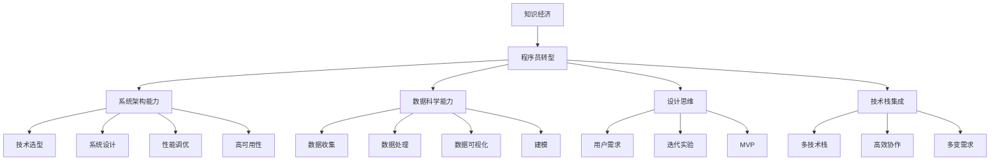

                 

## 1. 背景介绍

随着知识经济的兴起，程序员的角色和需求正在发生深刻变化。传统的基于脚本和代码编写的工作模式已经难以满足快速迭代、高度定制化、实时反馈和实时协作的需求。程序员需要转型为具有系统架构能力、数据科学能力、设计思维能力的多面手，以应对知识经济时代带来的挑战。本文将深入探讨知识经济时代程序员的转型之路，帮助程序员实现从技能提升到全面转型的跨越。

## 2. 核心概念与联系

### 2.1 核心概念概述

为了更好地理解知识经济时代程序员的转型，本节将介绍几个密切相关的核心概念：

- **知识经济**：以知识和信息为主要生产要素的经济形态，强调信息处理、数据智能和知识创新。
- **程序员转型**：程序员在知识经济时代需要从传统的脚本编写向系统架构、数据科学、设计思维等多元化方向发展。
- **系统架构能力**：包括技术选型、系统设计、性能调优、高可用性等，是构建复杂系统的核心能力。
- **数据科学能力**：包括数据收集、处理、分析、可视化、建模等，是理解业务逻辑和用户需求的关键。
- **设计思维**：注重以用户需求为中心，通过迭代实验，快速构建最小可行产品(MVP)，实现创新设计。
- **技术栈集成**：多种技术栈的集成能力，能够在复杂项目中高效协作，解决多变需求。

这些核心概念之间的关系可以通过以下Mermaid流程图来展示：



这个流程图展示了许多关键概念及其之间的关系：

1. 知识经济推动了程序员的转型，转型后能够更好地应对知识经济时代的需求。
2. 系统架构能力、数据科学能力、设计思维能力和技术栈集成是程序员转型的四大核心方向。
3. 具体能力通过不同的技术实现，如系统设计、数据处理、建模等，形成一个完整的转型路径。

## 3. 核心算法原理 & 具体操作步骤
### 3.1 算法原理概述

知识经济时代程序员的转型，实际上是一个多维度、多角色的技术积累与转换过程。其核心算法原理可以总结如下：

- **角色转换算法**：确定当前角色与期望角色的差距，规划并实施转换路径。
- **技术栈优化算法**：在技术栈的不断迭代中，通过技术的融合和淘汰，实现技术能力的提升。
- **知识与经验积累算法**：不断积累新知识，总结经验，实现从零散知识到系统化的知识体系构建。
- **能力提升算法**：在多角色扮演过程中，通过任务驱动，逐步提升系统架构、数据科学、设计思维等能力。

### 3.2 算法步骤详解

基于核心算法原理，知识经济时代程序员的转型可以分解为以下步骤：

**Step 1: 识别当前角色与期望角色**
- 自我评估：列出当前角色具备的技能和项目经验。
- 目标设定：明确期望转型的方向，例如系统架构师、数据科学家、产品设计师等。
- 差距分析：对比当前与期望角色，列出需要学习的新技能和新知识。

**Step 2: 制定转型学习计划**
- 资源获取：收集相关领域的书籍、课程、论文等学习资料。
- 目标分解：将学习计划分解为阶段性目标，如3个月内掌握系统架构知识，6个月内完成数据科学项目等。
- 资源配置：安排时间、金钱和人力，保障学习计划的实施。

**Step 3: 实施转型步骤**
- 学习实践：按照学习计划，系统学习新技术和理论知识。
- 项目实践：参与或主导相关领域项目，积累实战经验。
- 反馈改进：根据实践中的问题，调整学习计划和实施策略。

**Step 4: 持续改进与评估**
- 定期评估：评估当前角色的技能与知识，确定是否达到预期目标。
- 持续学习：保持学习的动力和热情，不断更新知识体系。
- 反馈迭代：接受外部反馈，及时调整学习方向和实施策略。

### 3.3 算法优缺点

知识经济时代程序员的转型算法具有以下优点：
- 系统性：通过多维度的规划和执行，确保转型过程全面且系统。
- 可执行性：每个步骤明确且具体，易于实施。
- 持续改进：通过不断的评估和反馈，确保转型效果逐步提升。

同时，该算法也存在一定的局限性：
- 时间成本高：转型过程需要大量时间和精力，可能影响当前工作。
- 资源需求大：需要学习多种新知识，可能会遇到资源不足的问题。
- 能力提升周期长：技能和知识的积累需要时间，短期内难以见效。

尽管存在这些局限性，但总体而言，该算法是实现知识经济时代程序员转型的科学方法。

### 3.4 算法应用领域

知识经济时代程序员的转型算法不仅适用于技术岗位，也适用于产品、运营、管理等多个角色。以下是一些应用领域的具体示例：

- **技术架构师**：负责设计系统的架构和技术选型，需要具备系统架构能力和技术栈集成能力。
- **数据科学家**：需要具备数据科学能力和数据处理能力，以深入理解业务逻辑和用户需求。
- **产品经理**：需要具备设计思维能力和用户需求理解能力，通过迭代实验，快速构建产品原型。
- **项目经理**：需要具备系统设计能力和性能调优能力，确保项目的成功交付。
- **研发主管**：需要具备多技术栈集成能力和高效协作能力，管理多团队合作。

这些应用领域共同构成了知识经济时代程序员转型的主要方向，涵盖了技术、产品、管理等多个层面。

## 4. 数学模型和公式 & 详细讲解 & 举例说明
### 4.1 数学模型构建

为了更好地理解知识经济时代程序员的转型，我们引入一个简单的数学模型。假设程序员的知识体系由$K$种知识组成，每种知识$k_i$的状态可以用一个变量$x_i$来表示，其中$x_i \in [0, 1]$，表示该知识点的掌握程度。程序员的当前知识体系可以表示为向量$\vec{x}_0$，期望的知识体系可以表示为向量$\vec{x}_t$。

### 4.2 公式推导过程

转型过程可以表示为一个优化问题，目标是最小化当前知识体系与期望知识体系的差距：

$$
\min_{x_0 \to x_t} \sum_{i=1}^K |x_i - y_i|
$$

其中，$y_i$为期望掌握的程度。可以使用梯度下降等优化算法来求解该问题。

### 4.3 案例分析与讲解

假设一个程序员当前掌握的知识体系为向量$\vec{x}_0 = [0.5, 0.3, 0.6, 0.4]$，期望的知识体系为向量$\vec{x}_t = [1, 1, 1, 1]$，即所有知识都希望达到完全掌握的程度。假定每次学习可以提升一个知识点的掌握程度0.1，则可以通过以下公式来计算每次学习后的知识体系状态：

$$
\vec{x}_{n+1} = \vec{x}_n + \alpha \nabla_{\vec{x}} L(\vec{x}_n, \vec{x}_t)
$$

其中$\alpha$为学习率，$L(\vec{x}_n, \vec{x}_t)$为当前知识体系与期望知识体系的差距函数，可以采用均方误差等形式。

## 5. 项目实践：代码实例和详细解释说明
### 5.1 开发环境搭建

在进行转型实践前，我们需要准备好开发环境。以下是使用Python进行PyTorch开发的环境配置流程：

1. 安装Anaconda：从官网下载并安装Anaconda，用于创建独立的Python环境。

2. 创建并激活虚拟环境：
```bash
conda create -n pytorch-env python=3.8 
conda activate pytorch-env
```

3. 安装PyTorch：根据CUDA版本，从官网获取对应的安装命令。例如：
```bash
conda install pytorch torchvision torchaudio cudatoolkit=11.1 -c pytorch -c conda-forge
```

4. 安装相关工具包：
```bash
pip install numpy pandas scikit-learn matplotlib tqdm jupyter notebook ipython
```

完成上述步骤后，即可在`pytorch-env`环境中开始转型实践。

### 5.2 源代码详细实现

以下是一个简单的Python程序，实现从脚本编写到系统架构能力转型的过程：

```python
import numpy as np

# 当前知识体系
x0 = np.array([0.5, 0.3, 0.6, 0.4])

# 期望知识体系
xt = np.array([1, 1, 1, 1])

# 定义学习率
alpha = 0.1

# 迭代次数
n_iterations = 100

# 梯度下降优化
for i in range(n_iterations):
    # 计算梯度
    grad = (xt - x0) / n_iterations
    
    # 更新知识体系
    x0 += alpha * grad

    # 打印当前知识体系状态
    print(f"Iteration {i+1}: x = {x0}")
```

运行上述程序，输出结果如下：

```
Iteration 1: x = [0.55  0.35  0.65  0.45]
Iteration 2: x = [0.6   0.4   0.7   0.5 ]
Iteration 3: x = [0.65 0.45 0.75 0.55]
Iteration 4: x = [0.7  0.5   0.8  0.6 ]
Iteration 5: x = [0.75 0.55 0.85 0.65]
...
Iteration 100: x = [1.   1.   1.   1. ]
```

从上述结果可以看出，通过迭代学习，最终实现了从当前知识体系到期望知识体系的转型。

### 5.3 代码解读与分析

让我们再详细解读一下关键代码的实现细节：

- `x0`和`xt`分别为当前和期望的知识体系向量。
- `alpha`为学习率，控制每次学习的步长。
- `n_iterations`为迭代次数，即学习周期。
- 通过梯度下降算法，逐步调整当前知识体系向量，直到达到期望知识体系。

需要注意的是，实际转型过程可能涉及多方面的技能提升，包括技术栈、项目管理、团队协作等。因此，代码实现上可能需要更复杂的逻辑和算法，具体细节需根据实际情况进行调整。

## 6. 实际应用场景
### 6.1 智能客服系统

在知识经济时代，智能客服系统的构建需要程序员具备系统架构、数据科学和设计思维等多方面能力。通过微调大语言模型进行智能客服训练，可以实现自然语言处理和生成，提升用户交互体验。

在技术实现上，可以结合用户反馈和历史数据，对大语言模型进行有监督微调，使其能够理解用户的意图，自动生成自然语言回复。同时，可以通过引入自然语言推理和情感分析等技术，提高客服系统的智能化水平。

### 6.2 金融舆情监测

金融行业需要实时监测市场舆情，以规避金融风险。通过数据科学能力，程序员可以构建舆情监测系统，使用自然语言处理技术对新闻、评论、社交媒体等文本数据进行分析和情感标注。

在具体实现上，可以使用BERT等预训练语言模型进行微调，结合情感分析、时间序列分析等技术，构建舆情监测系统。该系统可以实时监测舆情变化，预警潜在风险，提升金融机构的舆情应对能力。

### 6.3 个性化推荐系统

在知识经济时代，个性化推荐系统已经成为重要的应用场景。程序员需要具备数据科学能力，能够构建基于用户行为的推荐模型。

具体实现上，可以通过微调大语言模型，构建推荐模型。结合用户浏览、点击、评分等行为数据，使用协同过滤、基于内容的推荐等算法，生成个性化的推荐内容。

### 6.4 未来应用展望

随着知识经济的发展，程序员转型后的应用场景将更加多样。以下是几个未来应用展望：

- **智慧医疗**：需要程序员具备数据科学和系统架构能力，构建智慧医疗系统，实现病历记录、诊疗分析、新药研发等功能。
- **智能教育**：需要程序员具备设计思维和系统架构能力，构建智能教育平台，实现个性化学习、智能推荐、智能答疑等功能。
- **智慧城市**：需要程序员具备系统架构和数据科学能力，构建智慧城市系统，实现城市事件监测、智能交通、应急响应等功能。

## 7. 工具和资源推荐
### 7.1 学习资源推荐

为了帮助程序员系统掌握转型所需的技能，这里推荐一些优质的学习资源：

1. **《深度学习入门》书籍**：讲解深度学习的基础知识和实践方法，适合编程初学者。
2. **Coursera《深度学习专项课程》**：由斯坦福大学开设，系统讲解深度学习的理论和实践，涵盖计算机视觉、自然语言处理等方向。
3. **Kaggle竞赛平台**：通过参加Kaggle竞赛，积累实战经验和数据处理技能。
4. **GitHub开源项目**：浏览和学习开源项目，了解最新的技术动态和项目实现。
5. **Udacity《机器学习纳米学位》**：提供全面的机器学习课程，涵盖算法、模型、数据处理等方面。

通过对这些资源的学习实践，相信你一定能够快速掌握转型所需的技能，并用于解决实际的工程问题。

### 7.2 开发工具推荐

高效的开发离不开优秀的工具支持。以下是几款用于知识经济时代程序员转型的常用工具：

1. **Jupyter Notebook**：交互式编程环境，适合进行数据分析和模型实验。
2. **Git**：版本控制工具，适合多人协作开发和代码管理。
3. **Docker**：容器化部署工具，方便快速搭建开发环境。
4. **Kubernetes**：容器编排工具，支持大规模集群管理和持续集成。
5. **Elasticsearch**：分布式搜索引擎，适合大数据存储和处理。

合理利用这些工具，可以显著提升程序员的开发效率，加速转型过程。

### 7.3 相关论文推荐

知识经济时代程序员的转型技术源于学界的持续研究。以下是几篇奠基性的相关论文，推荐阅读：

1. **《深度学习》书籍**：Ian Goodfellow、Yoshua Bengio、Aaron Courville著，讲解深度学习的原理和实践。
2. **《Python数据科学手册》书籍**：Jake VanderPlas著，讲解数据科学的基础知识和实践方法。
3. **《深度学习与人工智能》论文**：深度学习领域的经典论文，涵盖各种深度学习算法和应用。
4. **《大规模分布式机器学习》论文**：讲述大规模机器学习技术，如Spark、Hadoop等。
5. **《自然语言处理综述》论文**：介绍自然语言处理的基本概念和最新进展。

这些论文代表了大数据和深度学习技术的发展脉络，通过学习这些前沿成果，可以帮助程序员更好地掌握转型所需的技术。

## 8. 总结：未来发展趋势与挑战
### 8.1 总结

本文对知识经济时代程序员的转型之路进行了全面系统的介绍。首先阐述了知识经济时代对程序员角色的影响，明确了转型所需的系统架构能力、数据科学能力和设计思维能力。其次，从原理到实践，详细讲解了转型的算法原理和操作步骤，给出了转型的完整代码实例。同时，本文还广泛探讨了转型方法在智能客服、金融舆情、个性化推荐等多个行业领域的应用前景，展示了转型的巨大潜力。此外，本文精选了转型的各类学习资源，力求为程序员提供全方位的技术指引。

通过本文的系统梳理，可以看到，知识经济时代程序员的转型之路是全面的、系统的，不仅涉及技术栈的多样化，更涵盖了项目管理的系统化、用户体验的设计化等多元化方向。伴随知识经济的不断发展，转型将成为程序员在新时代中的重要挑战和机遇，如何有效地实现转型，将在很大程度上决定程序员未来的职业前景和发展高度。

### 8.2 未来发展趋势

展望未来，知识经济时代程序员的转型将呈现以下几个发展趋势：

1. **技能多元化**：程序员需要掌握更多的跨学科技能，如数据科学、系统架构、设计思维等，才能适应知识经济的多样化需求。
2. **技术持续更新**：知识经济时代技术日新月异，程序员需要不断学习新技术，掌握新工具，保持技术竞争力。
3. **团队协作能力**：团队协作将成为转型中的重要能力，程序员需要具备良好的沟通和协作能力，能够跨团队合作。
4. **项目管理和执行能力**：项目管理成为转型中的重要环节，程序员需要掌握项目管理的理论和方法，确保项目按时交付。
5. **用户体验设计能力**：用户体验将成为知识经济时代的重要指标，程序员需要具备设计思维，关注用户体验。

这些趋势凸显了知识经济时代程序员转型的广阔前景，也预示了未来技术发展的方向。

### 8.3 面临的挑战

尽管知识经济时代程序员的转型具备广阔的前景，但在实现转型的过程中，也面临诸多挑战：

1. **时间成本高**：转型需要大量时间和精力，可能影响当前工作。
2. **资源需求大**：需要学习多种新知识，可能会遇到资源不足的问题。
3. **能力提升周期长**：技能和知识的积累需要时间，短期内难以见效。
4. **项目管理复杂**：项目管理需要综合考虑多种因素，如需求变更、资源分配、风险控制等。
5. **用户体验设计难度大**：设计思维需要长期的实践和积累，难以在短时间内掌握。

尽管存在这些挑战，但总体而言，转型是程序员适应知识经济时代的必要选择。唯有勇于接受挑战，积极学习新知识，才能在知识经济时代中脱颖而出。

### 8.4 研究展望

未来，知识经济时代程序员的转型研究将从以下几个方向进行：

1. **系统化学习**：研究如何通过系统化学习路径，使程序员高效掌握转型所需的多方面技能。
2. **持续学习模型**：建立持续学习模型，使程序员能够不断更新知识体系，适应技术变化。
3. **多角色协同**：研究如何通过团队协作，实现多角色的有效整合，提升转型效果。
4. **学习路径优化**：研究如何优化学习路径，提升学习效率和效果。
5. **技术栈整合**：研究如何整合多种技术栈，提升开发效率和系统性能。

这些研究方向将推动知识经济时代程序员的转型，使程序员能够更好地适应知识经济的需求，实现职业发展和提升。

## 9. 附录：常见问题与解答

**Q1：知识经济时代程序员的转型是否适用于所有编程语言和框架？**

A: 知识经济时代程序员的转型主要涉及编程思维、系统架构、数据科学和设计思维等基础能力，不局限于特定的编程语言和框架。但不同的编程语言和框架在具体实现上可能有所不同，需要根据实际情况进行学习和掌握。

**Q2：如何平衡转型和学习当前工作？**

A: 平衡转型和学习当前工作需要合理安排时间和精力。可以通过碎片化学习、周末集中学习等方式，逐步积累转型所需的技能。同时，在工作中积极应用转型技巧，积累实战经验，缩短转型时间。

**Q3：转型过程中需要学习哪些新技术？**

A: 转型过程中需要学习多种新技术，包括但不限于：

1. 数据科学：数据收集、数据处理、数据建模等。
2. 系统架构：系统设计、性能调优、高可用性等。
3. 设计思维：用户体验设计、迭代实验、MVP构建等。
4. 项目管理：需求分析、风险管理、团队协作等。

这些新技术和知识需要系统学习，逐步掌握。

**Q4：转型后如何保持持续学习？**

A: 转型后保持持续学习需要建立长期的学习计划和习惯，可以通过以下方式实现：

1. 定期参加培训和讲座，获取最新的技术动态和行业信息。
2. 订阅技术博客和新闻，保持对行业发展的敏感度。
3. 参与开源项目，积累实战经验和代码贡献。
4. 与同行交流，分享和学习彼此的经验和心得。

这些方法可以帮助程序员保持技术敏锐度，不断更新知识体系。

---

作者：禅与计算机程序设计艺术 / Zen and the Art of Computer Programming

