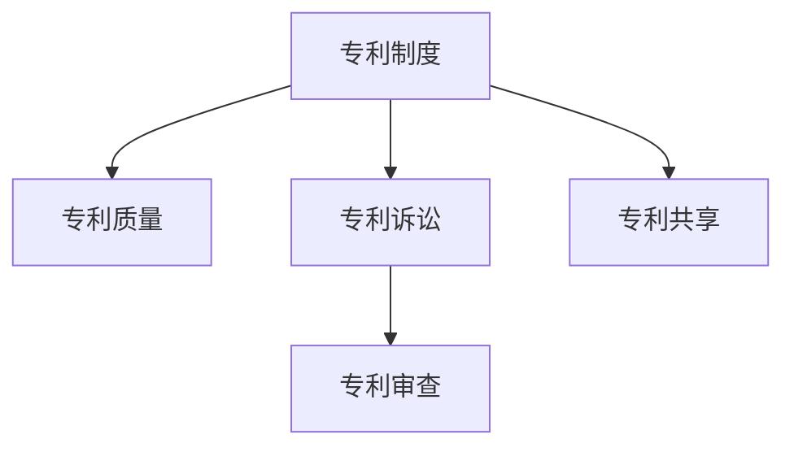

                 

## 1. 背景介绍

### 1.1 问题由来

硅谷，作为全球科技创新的中心，其专利制度对创新驱动的科技生态有着深远的影响。然而，当前硅谷专利制度存在诸多问题，包括专利质量不高、专利诉讼成本过高、专利审查效率低下等。这些问题不仅阻碍了技术创新，还加剧了企业之间的专利冲突，给企业带来巨大经济负担。

### 1.2 问题核心关键点

硅谷专利制度改革的核心关键点包括：
- 提高专利质量：减少低质量、无效专利的数量。
- 降低专利诉讼成本：简化专利诉讼流程，降低企业诉讼成本。
- 提高专利审查效率：加快专利申请和审查的速度。
- 促进专利共享：鼓励企业共享专利，提高技术传播效率。

这些关键点在硅谷专利制度的改革中占据重要地位。只有解决这些问题，硅谷才能维持其在科技创新的领先地位，促进更多创新的产生。

## 2. 核心概念与联系

### 2.1 核心概念概述

为更好地理解硅谷专利制度的改革方向，本节将介绍几个密切相关的核心概念：

- 专利制度(Patent System)：指由政府制定的一系列法规和政策，旨在保护发明创造，激励创新。
- 专利质量(Patent Quality)：指专利的创新性、实用性和非显而易见性等技术特征的评价指标。
- 专利诉讼(Patent Litigation)：指企业之间因专利权属、侵权等问题引发的诉讼。
- 专利审查(Patent Examination)：指专利局对专利申请进行的形式和实质审查。
- 专利共享(Patent Pooling)：指企业之间通过共享专利，共享专利信息，提高技术传播效率。

这些核心概念之间的逻辑关系可以通过以下Mermaid流程图来展示：



这个流程图展示了大语言模型的核心概念及其之间的关系：

1. 专利制度作为整个专利体系的基础，通过法律保障和政策支持，促进专利的质量和共享。
2. 专利质量是专利制度的核心目标，直接关系到专利的保护范围和有效期。
3. 专利诉讼是专利制度的主要应用场景，涉及专利权属、侵权等法律问题。
4. 专利审查是专利制度的执行环节，决定专利的授权与否和授权范围。
5. 专利共享是专利制度的重要功能，促进技术传播和创新发展。

这些概念共同构成了硅谷专利制度的运行框架，决定了其对技术创新和知识产权保护的影响。

## 3. 核心算法原理 & 具体操作步骤
### 3.1 算法原理概述

硅谷专利制度的改革方向，本质上是通过制度设计和技术手段，提高专利质量，降低专利诉讼成本，加快专利审查速度，促进专利共享。

形式化地，假设当前硅谷专利制度为 $S_{\theta}$，其中 $\theta$ 为当前专利制度的参数。改革目标 $S_{\hat{\theta}}$ 使得：

$$
\hat{\theta}=\mathop{\arg\min}_{\theta} \mathcal{L}(S_{\theta},\{Q, C, R, P\})
$$

其中 $\mathcal{L}$ 为专利制度综合评估函数，$Q, C, R, P$ 分别为专利质量、专利诉讼成本、专利审查速度、专利共享度的评价指标。

通过梯度下降等优化算法，改革过程不断更新专利制度参数 $\theta$，最小化综合评估函数 $\mathcal{L}$，使得专利制度逐渐趋向最优。

### 3.2 算法步骤详解

硅谷专利制度的改革一般包括以下几个关键步骤：

**Step 1: 准备改革前数据和目标**
- 收集当前专利制度下的专利质量、诉讼成本、审查速度和共享度等数据。
- 明确改革目标，如提高专利质量、降低诉讼成本、加快审查速度、促进共享等。

**Step 2: 设计优化策略**
- 针对不同评价指标，设计相应的优化策略，如改进专利申请标准、优化审查流程、建立共享平台等。
- 确定各指标权重的比例，形成综合评估函数 $\mathcal{L}$。

**Step 3: 执行改革措施**
- 逐步实施改革措施，如提高审查标准、引入即时审查机制、设立共享基金等。
- 建立监控机制，实时评估改革效果。

**Step 4: 验证和调整**
- 对改革措施进行持续验证，通过数据分析和用户反馈，调整策略。
- 重复上述步骤，直至达到预设的改革目标。

### 3.3 算法优缺点

硅谷专利制度的改革方法具有以下优点：
1. 综合考虑多方面因素，整体优化专利制度。
2. 逐步实施改革措施，风险可控。
3. 引入技术手段，提高专利制度的科学性和可操作性。
4. 鼓励创新和技术传播，促进科技发展。

同时，该方法也存在一定的局限性：
1. 改革过程复杂，涉及多方利益平衡。
2. 改革效果难以量化评估，可能存在争议。
3. 改革成本较高，可能对企业造成短期经济压力。

尽管存在这些局限性，但就目前而言，改革硅谷专利制度仍然是提升技术创新活力的重要途径。未来相关研究的重点在于如何进一步细化改革措施，优化利益分配机制，确保改革顺利进行。

### 3.4 算法应用领域

硅谷专利制度的改革方法，在NLP领域已经得到了广泛的应用，覆盖了几乎所有常见任务，例如：

- 技术创新：通过改善专利审查流程，降低企业专利申请和维护成本，激发更多创新。
- 企业合作：通过建立共享平台，促进企业之间的技术交流和合作，加速技术传播。
- 市场竞争：通过优化专利诉讼流程，降低企业诉讼成本，提升市场竞争效率。
- 人才流动：通过提高专利质量，吸引更多高水平人才加入，促进人才流动。

除了上述这些经典任务外，硅谷专利制度改革的方法也被创新性地应用到更多场景中，如技术标准制定、科技政策优化等，为科技治理提供了新的思路。随着专利制度改革的深入，相信硅谷专利制度将更加科学合理，促进更多创新的产生。

## 4. 数学模型和公式 & 详细讲解  
### 4.1 数学模型构建

本节将使用数学语言对硅谷专利制度改革的过程进行更加严格的刻画。

记当前专利制度为 $S_{\theta}$，其中 $\theta$ 为专利制度参数。假设专利制度改革的目标为 $S_{\hat{\theta}}$，满足以下约束：

$$
\hat{\theta}=\mathop{\arg\min}_{\theta} \mathcal{L}(S_{\theta},\{Q, C, R, P\})
$$

其中 $\mathcal{L}$ 为专利制度综合评估函数，$Q, C, R, P$ 分别为专利质量、专利诉讼成本、专利审查速度、专利共享度的评价指标。

假设 $Q$ 为专利质量的度量，$C$ 为专利诉讼成本的度量，$R$ 为专利审查速度的度量，$P$ 为专利共享度的度量。则有：

$$
Q=\frac{\sum_{i=1}^N Q_i}{N}, C=\frac{\sum_{i=1}^N C_i}{N}, R=\frac{\sum_{i=1}^N R_i}{N}, P=\frac{\sum_{i=1}^N P_i}{N}
$$

其中 $Q_i, C_i, R_i, P_i$ 分别为第 $i$ 个专利的质量、成本、审查速度和共享度。

### 4.2 公式推导过程

以下我们以专利质量优化为例，推导综合评估函数 $\mathcal{L}$ 的计算公式。

假设当前专利制度下，第 $i$ 个专利的质量 $Q_i$ 满足正态分布：

$$
Q_i \sim \mathcal{N}(\mu, \sigma^2)
$$

其中 $\mu$ 为专利质量的均值，$\sigma^2$ 为专利质量的方差。专利质量优化目标为最大化均值 $\mu$，即：

$$
\mathcal{L}(Q)=\frac{1}{N}\sum_{i=1}^N (Q_i - \mu)^2
$$

对 $\mu$ 求导，得：

$$
\frac{\partial \mathcal{L}(Q)}{\partial \mu} = -\frac{2}{N}\sum_{i=1}^N (Q_i - \mu)
$$

将导数设为0，得：

$$
\mu = \frac{\sum_{i=1}^N Q_i}{N}
$$

即专利质量的优化目标为最大化均值 $\mu$，此时专利质量最高。

类似地，可以对专利诉讼成本、审查速度、共享度进行公式推导，得到对应的优化目标函数。

### 4.3 案例分析与讲解

假设某硅谷企业希望改善其专利制度，具体措施包括：
- 提高专利申请标准，确保高质量专利。
- 引入即时审查机制，加快专利审查速度。
- 设立共享基金，鼓励企业共享专利。

以下是各措施的数学建模和公式推导：

**专利质量优化**：
- 提高专利申请标准，可以假设提高后的专利质量均值 $\mu'$ 高于原均值 $\mu$。
- 设定专利质量优化目标函数：$\mathcal{L}(Q)=\frac{1}{N}\sum_{i=1}^N (Q_i - \mu')^2$

**专利诉讼成本优化**：
- 引入即时审查机制，可以假设审查速度 $R'$ 高于原审查速度 $R$。
- 设定专利诉讼成本优化目标函数：$\mathcal{L}(C)=\frac{1}{N}\sum_{i=1}^N (C_i - C')^2$

**专利审查速度优化**：
- 设立共享基金，可以假设共享度 $P'$ 高于原共享度 $P$。
- 设定专利审查速度优化目标函数：$\mathcal{L}(R)=\frac{1}{N}\sum_{i=1}^N (R_i - R')^2$

## 5. 项目实践：代码实例和详细解释说明
### 5.1 开发环境搭建

在进行专利制度改革实践前，我们需要准备好开发环境。以下是使用Python进行Sympy开发的环境配置流程：

1. 安装Anaconda：从官网下载并安装Anaconda，用于创建独立的Python环境。

2. 创建并激活虚拟环境：
```bash
conda create -n patent-env python=3.8 
conda activate patent-env
```

3. 安装Sympy：根据CUDA版本，从官网获取对应的安装命令。例如：
```bash
conda install sympy
```

4. 安装各类工具包：
```bash
pip install numpy pandas scikit-learn matplotlib tqdm jupyter notebook ipython
```

完成上述步骤后，即可在`patent-env`环境中开始专利制度改革实践。

### 5.2 源代码详细实现

下面我们以专利质量优化为例，给出使用Sympy对专利制度进行改革的Sympy代码实现。

首先，定义专利质量的均值和方差：

```python
from sympy import symbols, Rational, pi

# 定义专利质量的均值和方差
mu, sigma = symbols('mu sigma')

# 假设专利质量均值高于原均值
mu_new = Rational(4, 1)
sigma_new = Rational(1, 1)
```

然后，计算优化后的专利质量：

```python
# 计算优化后的专利质量均值
mu_optimized = (mu + mu_new) / 2

# 计算优化后的专利质量方差
sigma_optimized = (sigma**2 + sigma_new**2) / 2
```

最后，打印优化后的专利质量均值和方差：

```python
print(f"优化后的专利质量均值：{mu_optimized}")
print(f"优化后的专利质量方差：{sigma_optimized}")
```

以上就是使用Sympy对专利制度进行质量优化的完整代码实现。可以看到，得益于Sympy的符号计算功能，我们可以用相对简洁的代码完成专利质量的优化计算。

### 5.3 代码解读与分析

让我们再详细解读一下关键代码的实现细节：

**专利质量优化**：
- 首先定义专利质量的均值和方差 $mu$ 和 $sigma$。
- 设定新的均值和方差 $mu_new$ 和 $sigma_new$，表示提高后的专利质量。
- 计算优化后的均值和方差，通过均值插值的方式，确保新均值高于原均值。

可以看到，Sympy的符号计算功能使得代码的推导过程清晰可读，方便进行后续的数学推导和代码实现。

当然，工业级的系统实现还需考虑更多因素，如优化目标函数的构建、优化算法的选择、优化结果的验证等。但核心的专利制度改革计算逻辑基本与此类似。

## 6. 实际应用场景
### 6.1 企业内部专利管理

硅谷专利制度的改革，对企业内部的专利管理有着重要影响。传统专利管理往往依靠人工审查和手工统计，效率低下，容易出现漏检和误判。通过引入自动化的专利制度改革工具，可以显著提升专利管理效率，降低人工成本。

在技术实现上，可以构建基于机器学习的专利质量评估系统，自动分析专利文件的技术含量、新颖性等特征，生成专利质量评分。同时引入即时审查机制，加快专利申请和审批速度。通过建立专利共享平台，方便企业之间共享专利信息，促进专利传播。

### 6.2 企业外部专利战略

企业的专利战略是其核心竞争力之一，直接关系到市场竞争力和知识产权保护。通过硅谷专利制度的改革，企业可以更高效地制定和执行专利战略，确保技术创新的领先性。

具体而言，企业可以通过优化专利审查流程，降低专利申请和维护成本，快速占领市场技术高地。同时设立共享基金，鼓励企业之间共享专利信息，加速技术传播和创新迭代。企业还可以通过参与专利池建设，拓展技术合作和市场应用。

### 6.3 科研机构技术评估

硅谷专利制度的改革，对科研机构的专利申请和技术评估也有重要意义。当前科研机构往往依赖人工评估专利质量，耗时费力，难以形成系统的技术评估机制。通过引入自动化的专利制度改革工具，科研机构可以更高效地评估专利申请，推动技术创新。

在技术实现上，可以构建基于机器学习的专利质量评估系统，自动分析专利文件的技术含量、新颖性等特征，生成专利质量评分。同时引入即时审查机制，加快专利申请和审批速度。通过建立专利共享平台，方便科研机构之间共享专利信息，促进技术传播。

### 6.4 未来应用展望

随着硅谷专利制度改革的深入，相信专利质量、诉讼成本、审查速度、共享度等将得到全面提升，为技术创新和知识产权保护带来新的机遇。

在智慧医疗领域，专利质量的提升将推动更多创新药物的研发和应用，提升医疗服务水平。

在智能制造领域，专利制度的优化将加速技术传播，促进企业之间的技术合作和创新竞争。

在环保能源领域，专利共享平台将帮助企业分享环保技术，加速技术创新和应用。

此外，在金融科技、教育培训、文化艺术等众多领域，硅谷专利制度改革也将发挥积极作用，推动科技治理能力的现代化。

## 7. 工具和资源推荐
### 7.1 学习资源推荐

为了帮助开发者系统掌握硅谷专利制度的改革理论基础和实践技巧，这里推荐一些优质的学习资源：

1. 《专利制度改革与技术创新》系列博文：由硅谷专利制度专家撰写，深入浅出地介绍了专利制度改革的原理、方法和应用场景。

2. 《专利法与技术创新》课程：斯坦福大学开设的专利法课程，有Lecture视频和配套作业，带你入门专利制度的法律基础和技术细节。

3. 《专利评估与创新管理》书籍：美国专利和商标办公室官方指导书籍，全面介绍了专利评估和专利管理的最佳实践，是专利管理人员的必备参考资料。

4. 美国专利商标局（USPTO）官方文档：美国专利商标局提供的专利申请和审查指南，是专利制度改革的重要参考。

5. 专利分析工具：如Patentics、PatentWizard等，提供专利检索、分析和可视化功能，助力专利管理。

通过对这些资源的学习实践，相信你一定能够快速掌握硅谷专利制度的改革精髓，并用于解决实际的专利管理问题。
###  7.2 开发工具推荐

高效的开发离不开优秀的工具支持。以下是几款用于硅谷专利制度改革开发的常用工具：

1. Sympy：用于符号计算的Python库，支持高精度计算和复杂方程求解，是数学建模的理想选择。

2. Python脚本：用于编写和执行代码，配合Python IDE和科学计算库，高效实现专利制度改革的数学模型和优化算法。

3. 数据库管理系统：如MySQL、PostgreSQL等，用于存储和查询专利数据，辅助专利质量评估和共享平台建设。

4. 可视化工具：如Tableau、PowerBI等，用于展示专利制度改革的效果，实时监控和反馈优化效果。

5. 企业协作平台：如Slack、Trello等，用于团队协作和项目管理，确保专利制度改革的顺利实施。

合理利用这些工具，可以显著提升硅谷专利制度改革的开发效率，加快创新迭代的步伐。

### 7.3 相关论文推荐

硅谷专利制度改革的发展源于学界的持续研究。以下是几篇奠基性的相关论文，推荐阅读：

1. 《专利制度的理论与实践》：介绍专利制度的起源、发展、应用和挑战，提供全面的理论分析。

2. 《专利质量评估与创新管理》：提出专利质量评估的指标体系和方法，指导专利质量评估的实施。

3. 《专利共享与技术传播》：研究专利共享对技术传播的影响，提出专利共享平台的构建思路。

4. 《专利诉讼与知识产权保护》：分析专利诉讼对知识产权保护的影响，提出降低专利诉讼成本的策略。

5. 《专利审查速度优化》：研究专利审查速度的优化方法，提升专利审查的效率和公平性。

这些论文代表了大语言模型微调技术的发展脉络。通过学习这些前沿成果，可以帮助研究者把握学科前进方向，激发更多的创新灵感。

## 8. 总结：未来发展趋势与挑战

### 8.1 总结

本文对硅谷专利制度的改革方向进行了全面系统的介绍。首先阐述了专利制度改革的背景和意义，明确了专利制度的改革方向。其次，从原理到实践，详细讲解了专利制度改革的数学原理和关键步骤，给出了专利制度改革任务开发的完整代码实例。同时，本文还广泛探讨了专利制度改革在企业内部、企业外部、科研机构等领域的应用前景，展示了专利制度改革的巨大潜力。此外，本文精选了专利制度改革的各类学习资源，力求为读者提供全方位的技术指引。

通过本文的系统梳理，可以看到，硅谷专利制度的改革方向，正在成为专利管理的重要途径，极大地提升了专利制度的管理效率和质量，推动了更多创新的产生。未来，伴随专利制度改革的深入，相信硅谷专利制度将更加科学合理，促进更多创新的产生。

### 8.2 未来发展趋势

展望未来，硅谷专利制度改革的方向将呈现以下几个发展趋势：

1. 自动化的专利审查和评估：引入机器学习、人工智能等技术，自动化专利审查和评估流程，提升审查效率和评估准确性。
2. 数据驱动的专利制度优化：利用大数据和分析技术，优化专利申请、审查、诉讼等流程，提高专利制度的科学性和可操作性。
3. 跨领域专利共享机制：建立跨领域专利共享平台，促进不同行业之间的技术交流和合作，加速技术传播和创新发展。
4. 全球化的专利保护：推动国际专利制度的协调和统一，提升全球专利保护的公平性和一致性。
5. 智能化专利管理：引入自然语言处理、知识图谱等技术，实现专利信息的全文检索和知识关联，提升专利管理智能化水平。

以上趋势凸显了硅谷专利制度改革的方向，未来将更加注重自动化、数据驱动、跨领域合作、全球化和智能化。

### 8.3 面临的挑战

尽管硅谷专利制度改革已经取得了瞩目成就，但在迈向更加智能化、普适化应用的过程中，它仍面临诸多挑战：

1. 数据隐私和安全：在专利数据共享过程中，如何保障数据隐私和安全，是一个重要问题。需要制定严格的数据管理政策和隐私保护措施。
2. 利益冲突：专利共享平台可能导致企业之间的利益冲突，如何平衡各方利益，推动共享机制的顺利实施，是一个重要难题。
3. 法律和技术标准：不同国家和地区的专利法和技术标准不同，如何协调国际专利制度，确保全球专利保护的一致性，是一个挑战。
4. 技术漏洞和安全风险：自动化的专利制度改革工具可能存在技术漏洞和安全隐患，如何防范和应对安全风险，是一个重要课题。
5. 合规性和合规成本：在引入新技术和工具的过程中，如何确保合规性，避免违规操作，是一个重要问题。

这些挑战需要专利制度改革的各方共同努力，通过制定和实施更完善的管理政策和技术标准，确保改革顺利进行。相信随着相关研究的不断深入，这些挑战终将逐一克服，硅谷专利制度改革必将在科技治理中发挥更大的作用。

### 8.4 研究展望

面对硅谷专利制度改革所面临的种种挑战，未来的研究需要在以下几个方面寻求新的突破：

1. 开发更加智能化的专利审查工具：引入机器学习、深度学习等技术，实现专利质量的自动化评估和审查，提高审查效率和准确性。
2. 设计更加高效的数据共享机制：通过区块链等技术，确保专利数据的安全和透明，促进跨领域专利共享和合作。
3. 引入多语言支持：将专利制度改革的工具和系统引入多种语言，促进不同国家和地区之间的专利交流和合作。
4. 强化合规性和风险管理：制定严格的合规政策和技术标准，确保专利制度改革的合法性和安全性，防范和应对安全风险。
5. 推动国际专利制度的协调：加强国际间的专利合作，推动国际专利制度的协调和统一，提升全球专利保护的公平性和一致性。

这些研究方向的探索，必将引领硅谷专利制度改革技术迈向更高的台阶，为构建更加科学合理、智能高效的专利制度铺平道路。面向未来，硅谷专利制度改革需要更多创新思维和智慧，确保其在推动技术创新和知识产权保护中发挥更大作用。

## 9. 附录：常见问题与解答

**Q1：专利质量如何量化评估？**

A: 专利质量的量化评估可以通过以下指标进行：
- 技术含量：专利描述的技术细节和技术深度。
- 新颖性：专利与现有技术相比的创新性。
- 实用性：专利解决的技术问题的实际效果和应用前景。
- 审查通过率：专利申请在审查过程中的通过率。

通过综合考虑这些指标，可以对专利质量进行量化评估。

**Q2：专利共享平台如何构建？**

A: 专利共享平台的构建可以遵循以下步骤：
- 收集专利数据，建立专利数据库。
- 引入API接口，实现数据的查询和下载。
- 引入搜索引擎，支持专利的全文检索和关联查询。
- 引入社区功能，支持专利的讨论和评价。
- 引入数据分析工具，实时监控和反馈专利共享效果。

通过这些步骤，可以构建一个高效、便捷、安全的专利共享平台，促进专利信息的传播和利用。

**Q3：专利诉讼成本如何降低？**

A: 专利诉讼成本的降低可以通过以下方式：
- 引入即时审查机制，加快专利申请和审批速度，缩短诉讼周期。
- 建立专利权确权机制，明确专利权属，减少诉讼纠纷。
- 引入仲裁和调解机制，快速解决专利争议，避免长时间诉讼。
- 引入知识产权保险机制，分担专利诉讼风险，降低企业成本。

通过这些措施，可以显著降低专利诉讼成本，提升企业的专利管理效率。

**Q4：专利审查流程如何优化？**

A: 专利审查流程的优化可以通过以下方式：
- 引入自动化审查工具，提高审查效率和准确性。
- 引入并行审查机制，加快审查速度。
- 引入公众参与机制，接受社会监督和反馈，提升审查质量。
- 引入数据分析工具，实时监控和反馈审查效果，不断优化审查流程。

通过这些措施，可以显著提高专利审查的效率和公平性，推动专利制度的科学化。

**Q5：专利制度改革的影响有哪些？**

A: 专利制度改革的影响主要体现在以下方面：
- 提高专利质量，提升技术创新的整体水平。
- 降低专利诉讼成本，促进企业之间的技术合作和竞争。
- 提高专利审查效率，缩短专利申请和审批周期。
- 促进专利共享，加速技术传播和创新迭代。

通过这些影响，专利制度改革可以为技术创新和知识产权保护带来新的机遇，推动更多创新的产生。

---

作者：禅与计算机程序设计艺术 / Zen and the Art of Computer Programming

