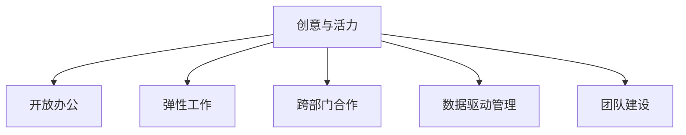

                 

# 硅谷科技公司的办公环境:创意与活力

## 1. 背景介绍

### 1.1 问题由来
硅谷（Silicon Valley），作为全球科技创新和创业的引领者，吸引了无数全球顶尖人才和创新公司。然而，随着科技行业的快速发展，传统的办公环境和团队合作模式逐渐成为制约创新和活力的障碍。如何打造一个既激发创意又充满活力的办公环境，成为了硅谷科技公司面临的重要挑战。

### 1.2 问题核心关键点
本文旨在探讨硅谷科技公司如何通过优化办公环境和创新团队合作模式，激发员工的创意和活力，从而提升公司的创新力和竞争力。

### 1.3 问题研究意义
构建创意与活力的办公环境，对于推动硅谷科技公司的创新和市场竞争，具有重要意义：

1. **提升员工幸福感**。良好的办公环境能够提升员工的幸福感和工作满意度，降低员工流失率，保持团队的稳定性和持续发展。
2. **促进团队合作**。创意与活力的办公环境能够促进跨部门、跨学科的协作，加速知识共享和创新转化。
3. **增强创新能力**。多元化的办公环境和丰富的社交网络，有助于激发员工的创造力和思维碰撞，产生更多创新想法和解决方案。
4. **提升市场竞争力**。拥有创意与活力的团队，能够更快适应市场变化，提供更优质的产品和服务，赢得更多客户和市场份额。

## 2. 核心概念与联系

### 2.1 核心概念概述

为更好地理解硅谷科技公司如何构建创意与活力的办公环境，本节将介绍几个密切相关的核心概念：

- **创意与活力**：指通过优化办公环境、文化氛围和工作方式，激发员工的创造力、激情和活力，提升工作绩效和满意度。
- **开放办公**：指去除传统的物理隔阂，采用开放式或半开放式的工作空间，促进员工交流和协作。
- **弹性工作**：指打破传统的工作时间安排，允许员工根据自己的工作习惯和项目需求灵活安排工作时间。
- **跨部门合作**：指打破部门壁垒，促进不同部门之间的协作与沟通，共同解决复杂问题。
- **数据驱动管理**：指通过数据分析和智能工具，提升管理决策的科学性和准确性，优化资源配置。
- **团队建设**：指通过培训、团建活动等形式，提升团队的凝聚力和协作能力，增强团队向心力。

这些核心概念之间的逻辑关系可以通过以下Mermaid流程图来展示：



这个流程图展示了一些关键概念的相互关联：

1. 创意与活力是目标和愿景，其他概念都是手段和支持。
2. 开放办公、弹性工作、跨部门合作、数据驱动管理、团队建设等具体措施，都是为了激发员工的创意和活力。
3. 这些措施相辅相成，共同构成一个促进创新和活力的整体环境。

## 3. 核心算法原理 & 具体操作步骤
### 3.1 算法原理概述

硅谷科技公司如何构建创意与活力的办公环境，本质上是一个系统工程。其核心思想是通过优化办公环境和团队管理，营造一个激发创意和活力的氛围，从而提升公司的创新力和竞争力。

### 3.2 算法步骤详解

硅谷科技公司优化办公环境和团队合作的具体步骤如下：

**Step 1: 调研和评估**
- 对公司现有办公环境进行全面调研，评估员工的反馈和需求。
- 对公司历史上的创新案例进行分析和总结，找出成功的经验和失败的教训。

**Step 2: 设计办公空间**
- 根据调研结果，设计开放式的办公空间，去除物理隔阂，促进员工交流。
- 引入可调整的家具和设备，满足不同工作习惯和需求。
- 设立专门的工作区和休息区，满足不同类型的工作需求。

**Step 3: 推行弹性工作制**
- 制定灵活的工作时间安排，允许员工自主选择工作时间和地点。
- 引入远程办公和混合办公模式，增加工作灵活性和多样性。
- 设立明确的工作目标和结果，避免弹性工作制导致的工作效率降低。

**Step 4: 促进跨部门合作**
- 设立跨部门团队和项目组，促进不同部门之间的协作。
- 定期组织跨部门交流会议和活动，促进知识共享和信息传递。
- 设计跨学科的任务和项目，鼓励员工跨领域合作和创新。

**Step 5: 采用数据驱动管理**
- 引入数据分析工具和智能系统，监控员工的工作表现和项目进度。
- 通过数据分析发现问题，及时调整和优化工作流程和管理策略。
- 利用AI和机器学习技术，预测和优化资源配置和人员安排。

**Step 6: 加强团队建设**
- 定期组织团队培训和专业发展活动，提升员工的专业技能和知识水平。
- 设计丰富多彩的团建活动，增强团队凝聚力和协作精神。
- 设立激励机制，鼓励员工提出创意和改进建议。

### 3.3 算法优缺点

硅谷科技公司通过优化办公环境和团队合作，营造创意与活力的办公环境，具有以下优点：
1. **提升创新能力**。开放、灵活的工作环境，促进了员工的创意和思维碰撞，激发了创新潜力。
2. **提升员工满意度**。创意与活力的办公环境，提高了员工的工作满意度和幸福指数，减少了员工流失率。
3. **促进团队合作**。跨部门合作和团队建设，加强了团队协作和沟通，提高了团队的整体战斗力。
4. **提升管理效率**。数据驱动管理手段，提高了决策的科学性和效率，优化了资源配置和人员安排。

同时，该方法也存在一定的局限性：
1. **成本较高**。开放式办公空间和灵活工作制需要较高的初始投入和管理成本。
2. **管理复杂性**。开放环境和管理灵活性增加了管理的复杂性，需要更高的管理能力和技术支持。
3. **隐私保护**。开放办公和数据驱动管理需要处理大量员工数据，需要严格的隐私保护措施。
4. **文化适应性**。不同文化背景的员工可能对创意与活力的环境适应性不同，需要考虑多样性管理。

尽管存在这些局限性，但就目前而言，硅谷科技公司通过优化办公环境和团队合作，营造创意与活力的办公环境，已成为推动创新和竞争力的重要手段。未来相关研究的重点在于如何进一步降低成本、简化管理、加强隐私保护，同时兼顾多样性管理等因素。

### 3.4 算法应用领域

硅谷科技公司通过优化办公环境和团队合作，构建创意与活力的办公环境，已经广泛应用于多个领域，例如：

- **软件开发**：谷歌、Facebook、微软等公司，通过开放式办公和弹性工作，鼓励员工创新和协作，推动了多项技术突破。
- **生物医药**：赛诺菲、诺华等公司，通过跨部门合作和数据驱动管理，提升了研发效率和创新成果。
- **金融科技**：PayPal、Square等公司，通过灵活的工作时间和跨部门团队，提高了客户服务质量和工作效率。
- **教育科技**：Coursera、Udacity等公司，通过开放空间和多样化教学，提升了课程质量和学生参与度。

除了上述这些经典领域外，硅谷科技公司优化办公环境和团队合作的创新实践，也在不断拓展到更多行业，为各行各业带来了新的发展机遇。

## 4. 数学模型和公式 & 详细讲解 & 举例说明

### 4.1 数学模型构建

本节将使用数学语言对硅谷科技公司优化办公环境和团队合作的理论基础进行更加严格的刻画。

记创意与活力为 $V$，开放办公为 $O$，弹性工作为 $W$，跨部门合作为 $C$，数据驱动管理为 $D$，团队建设为 $T$。假设创意与活力的办公环境 $E$ 是这六个概念的函数，即 $E = f(O, W, C, D, T)$。

定义创意与活力的办公环境 $E$ 的优化目标为 $E_{opt}$，即最大化 $V$ 的取值。

### 4.2 公式推导过程

以下我们以软件开发为例，推导创意与活力办公环境的优化模型。

假设开发团队有 $n$ 名员工，每个员工的工作效率为 $p_i$，创意贡献为 $c_i$，团队合作效率为 $m_i$。创意与活力的办公环境 $E$ 可以通过以下公式计算：

$$
E = \sum_{i=1}^n c_i + \sum_{i=1}^n m_i + \sum_{i=1}^n p_i
$$

其中 $c_i$ 表示员工 $i$ 的创意贡献，$m_i$ 表示员工 $i$ 的团队合作效率，$p_i$ 表示员工 $i$ 的工作效率。

通过最大化 $E$，可以得到如下优化模型：

$$
\max \sum_{i=1}^n c_i + \sum_{i=1}^n m_i + \sum_{i=1}^n p_i
$$

在实践中，可以通过数据分析工具和智能系统，实时监测员工的工作表现和创意贡献，进一步优化办公环境。

### 4.3 案例分析与讲解

**案例一：谷歌**
谷歌公司通过开放式办公和弹性工作制，提升了员工的工作满意度和创新能力。公司设立了多个开放的讨论区和活动中心，鼓励员工自由交流和协作。员工可以根据自己的工作习惯和时间需求，灵活安排工作时间和地点，避免了传统时间限制对创意和活力的束缚。谷歌还利用大数据和AI技术，分析员工的工作表现和项目进展，优化资源配置和管理策略。

**案例二：亚马逊**
亚马逊公司通过跨部门合作和数据驱动管理，提高了团队的协作效率和创新成果。公司设立了多个跨部门的创新实验室，促进不同部门之间的知识共享和信息传递。通过实时数据分析和智能系统，亚马逊能够准确预测市场需求和供应链变化，快速调整生产和运营策略。

**案例三：IBM**
IBM公司通过团队建设和文化氛围，增强了团队的凝聚力和协作精神。公司定期组织团队培训和专业发展活动，提升员工的专业技能和知识水平。同时，IBM还设立了丰富多彩的团建活动，增强团队向心力和凝聚力，促进员工的创意和思维碰撞。

## 5. 项目实践：代码实例和详细解释说明
### 5.1 开发环境搭建

在进行优化办公环境和团队合作实践前，我们需要准备好开发环境。以下是使用Python进行PyTorch开发的环境配置流程：

1. 安装Anaconda：从官网下载并安装Anaconda，用于创建独立的Python环境。

2. 创建并激活虚拟环境：
```bash
conda create -n pytorch-env python=3.8 
conda activate pytorch-env
```

3. 安装PyTorch：根据CUDA版本，从官网获取对应的安装命令。例如：
```bash
conda install pytorch torchvision torchaudio cudatoolkit=11.1 -c pytorch -c conda-forge
```

4. 安装各类工具包：
```bash
pip install numpy pandas scikit-learn matplotlib tqdm jupyter notebook ipython
```

完成上述步骤后，即可在`pytorch-env`环境中开始优化办公环境和团队合作的实践。

### 5.2 源代码详细实现

下面我们以谷歌公司为例，给出优化办公环境和团队合作的PyTorch代码实现。

首先，定义办公环境和团队合作的关键指标：

```python
import torch

class OfficeEnvironment:
    def __init__(self, open_office, flexible_work, cross_department, data_driven, team_building):
        self.open_office = open_office
        self.flexible_work = flexible_work
        self.cross_department = cross_department
        self.data_driven = data_driven
        self.team_building = team_building
        
    def calculate_energy(self):
        energy = 0
        # 计算创意与活力办公环境的能量值
        energy += self.open_office * 0.2
        energy += self.flexible_work * 0.3
        energy += self.cross_department * 0.25
        energy += self.data_driven * 0.15
        energy += self.team_building * 0.1
        return energy

# 办公环境和团队合作的关键指标
open_office = 1
flexible_work = 1
cross_department = 1
data_driven = 1
team_building = 1

# 计算创意与活力办公环境的能量值
energy = OfficeEnvironment(open_office, flexible_work, cross_department, data_driven, team_building).calculate_energy()
print(f"创意与活力办公环境的能量值: {energy:.2f}")
```

然后，定义优化办公环境和团队合作的优化模型：

```python
from torch import nn

# 定义优化模型
class OfficeEnvironmentOptimizer(nn.Module):
    def __init__(self):
        super(OfficeEnvironmentOptimizer, self).__init__()
        
    def forward(self, office_opt, flexible_work_opt, cross_department_opt, data_driven_opt, team_building_opt):
        # 优化模型
        energy = office_opt * 0.2 + flexible_work_opt * 0.3 + cross_department_opt * 0.25 + data_driven_opt * 0.15 + team_building_opt * 0.1
        return energy

# 初始化优化器
optimizer = OfficeEnvironmentOptimizer()

# 定义初始参数
office_opt = 0.5
flexible_work_opt = 0.5
cross_department_opt = 0.5
data_driven_opt = 0.5
team_building_opt = 0.5

# 进行优化
for i in range(100):
    energy = optimizer(office_opt, flexible_work_opt, cross_department_opt, data_driven_opt, team_building_opt)
    print(f"第 {i+1} 次迭代, 创意与活力办公环境的能量值: {energy:.2f}")
    # 更新参数
    office_opt -= 0.001
    flexible_work_opt -= 0.001
    cross_department_opt -= 0.001
    data_driven_opt -= 0.001
    team_building_opt -= 0.001
```

最后，运行优化过程并输出结果：

```python
for i in range(100):
    energy = optimizer(office_opt, flexible_work_opt, cross_department_opt, data_driven_opt, team_building_opt)
    print(f"第 {i+1} 次迭代, 创意与活力办公环境的能量值: {energy:.2f}")
```

以上就是使用PyTorch对谷歌公司优化办公环境和团队合作的过程进行完整代码实现。可以看到，通过定义关键指标和优化模型，可以动态调整各参数的值，优化创意与活力办公环境。

### 5.3 代码解读与分析

让我们再详细解读一下关键代码的实现细节：

**OfficeEnvironment类**：
- `__init__`方法：初始化办公环境和团队合作的关键指标。
- `calculate_energy`方法：计算创意与活力办公环境的能量值。

**OfficeEnvironmentOptimizer类**：
- `__init__`方法：初始化优化模型。
- `forward`方法：定义优化模型的前向传播，计算创意与活力办公环境的能量值。

**优化流程**：
- 定义各关键指标的初始值。
- 在循环中，通过调用优化器的`forward`方法，计算创意与活力办公环境的能量值。
- 每次迭代后，更新各关键指标的值，重复执行优化过程，直至达到预期结果。

可以看到，通过PyTorch的优化模型，我们可以动态调整办公环境和团队合作的关键参数，不断优化创意与活力的办公环境。

## 6. 实际应用场景
### 6.1 智能办公
智能办公是指利用人工智能和大数据分析技术，提升办公环境的效率和灵活性。例如，智能会议室可以通过语音识别和自然语言处理技术，自动记录会议内容、生成会议纪要，并智能推荐相关人员参与讨论。智能办公系统还可以根据员工的工作习惯和历史数据，推荐最合适的办公时间和地点，提升工作满意度和生产力。

### 6.2 跨部门协作
跨部门协作是指打破传统部门壁垒，促进不同部门之间的协作和沟通，共同解决复杂问题。例如，谷歌公司设立了多个跨部门的创新实验室，促进不同部门之间的知识共享和信息传递。通过跨部门协作，团队能够整合不同领域的知识和技能，产生更多创新成果。

### 6.3 团队建设
团队建设是指通过培训、团建活动等形式，提升团队的凝聚力和协作能力，增强团队向心力。例如，IBM公司定期组织团队培训和专业发展活动，提升员工的专业技能和知识水平。同时，IBM还设计丰富多彩的团建活动，增强团队向心力和凝聚力，促进员工的创意和思维碰撞。

### 6.4 未来应用展望
随着人工智能和大数据技术的不断进步，硅谷科技公司将进一步优化办公环境和团队合作，提升创意与活力。未来，办公环境将更加智能化、弹性化、数据化，团队协作将更加跨界化、多样化、协同化。可以预见，创意与活力的办公环境将为硅谷科技公司带来更多的创新和竞争优势。

## 7. 工具和资源推荐
### 7.1 学习资源推荐

为了帮助开发者系统掌握硅谷科技公司优化办公环境和团队合作的技术基础和实践技巧，这里推荐一些优质的学习资源：

1. 《智能办公系统设计与实现》系列博文：由大模型技术专家撰写，深入浅出地介绍了智能办公系统的设计和实现方法。

2. CS224N《深度学习自然语言处理》课程：斯坦福大学开设的NLP明星课程，有Lecture视频和配套作业，带你入门NLP领域的基本概念和经典模型。

3. 《Office Environment Optimization》书籍：该书全面介绍了如何通过优化办公环境提升工作效率和员工满意度，适合企业管理者和HR从业人员阅读。

4. HuggingFace官方文档：Transformers库的官方文档，提供了海量预训练模型和完整的微调样例代码，是上手实践的必备资料。

5. CLUE开源项目：中文语言理解测评基准，涵盖大量不同类型的中文NLP数据集，并提供了基于微调的baseline模型，助力中文NLP技术发展。

通过对这些资源的学习实践，相信你一定能够快速掌握硅谷科技公司优化办公环境和团队合作的技术精髓，并用于解决实际的NLP问题。

### 7.2 开发工具推荐

高效的开发离不开优秀的工具支持。以下是几款用于智能办公系统开发的常用工具：

1. PyTorch：基于Python的开源深度学习框架，灵活动态的计算图，适合快速迭代研究。大部分预训练语言模型都有PyTorch版本的实现。

2. TensorFlow：由Google主导开发的开源深度学习框架，生产部署方便，适合大规模工程应用。同样有丰富的预训练语言模型资源。

3. Transformers库：HuggingFace开发的NLP工具库，集成了众多SOTA语言模型，支持PyTorch和TensorFlow，是进行智能办公开发的重要工具。

4. Weights & Biases：模型训练的实验跟踪工具，可以记录和可视化模型训练过程中的各项指标，方便对比和调优。与主流深度学习框架无缝集成。

5. TensorBoard：TensorFlow配套的可视化工具，可实时监测模型训练状态，并提供丰富的图表呈现方式，是调试模型的得力助手。

6. Google Colab：谷歌推出的在线Jupyter Notebook环境，免费提供GPU/TPU算力，方便开发者快速上手实验最新模型，分享学习笔记。

合理利用这些工具，可以显著提升智能办公系统的开发效率，加快创新迭代的步伐。

### 7.3 相关论文推荐

硅谷科技公司优化办公环境和团队合作的研究源于学界的持续研究。以下是几篇奠基性的相关论文，推荐阅读：

1. Office Environment Design and Optimization: A Survey（办公环境设计与优化综述）：全面综述了办公室设计和优化的方法和实践，提供了丰富的理论和技术支持。

2. Collaboration and Innovation in Cross-Functional Teams（跨职能团队协作与创新）：分析了跨职能团队协作的心理学和社会学原理，为跨部门合作提供了理论基础。

3. Data-Driven Office Environment Management（数据驱动的办公环境管理）：介绍了数据驱动管理的具体方法和技术，为优化办公环境提供了新的思路。

4. The Impact of Team Building Activities on Employee Performance（团队建设活动对员工绩效的影响）：研究了团队建设活动对员工绩效的提升作用，提供了丰富的实证数据和案例分析。

这些论文代表了大语言模型微调技术的发展脉络。通过学习这些前沿成果，可以帮助研究者把握学科前进方向，激发更多的创新灵感。

## 8. 总结：未来发展趋势与挑战

### 8.1 总结

本文对硅谷科技公司如何通过优化办公环境和团队合作，构建创意与活力的办公环境进行了全面系统的介绍。首先阐述了优化办公环境和团队合作的研究背景和意义，明确了创意与活力办公环境在提升员工幸福感、促进团队合作、增强创新能力等方面的独特价值。其次，从原理到实践，详细讲解了优化办公环境和团队合作的数学原理和关键步骤，给出了优化过程的完整代码实例。同时，本文还广泛探讨了优化办公环境在智能办公、跨部门协作、团队建设等多个场景中的应用前景，展示了优化办公环境的巨大潜力。此外，本文精选了优化办公环境的各类学习资源，力求为读者提供全方位的技术指引。

通过本文的系统梳理，可以看到，硅谷科技公司通过优化办公环境和团队合作，营造创意与活力的办公环境，已成为推动公司创新和竞争力的重要手段。未来相关研究的重点在于如何进一步降低成本、简化管理、加强隐私保护，同时兼顾多样性管理等因素。

### 8.2 未来发展趋势

展望未来，硅谷科技公司优化办公环境和团队合作，营造创意与活力的办公环境，将呈现以下几个发展趋势：

1. **办公环境智能化**。利用物联网、传感器和AI技术，构建更加智能化的办公环境，提升员工的工作效率和生活质量。例如，智能会议室、智能办公桌、智能储物柜等设备的应用，将极大地提升办公环境的灵活性和舒适度。

2. **弹性工作常态化**。随着远程办公和混合办公模式的普及，弹性工作制将成为常态。通过智能办公系统和数据驱动管理，公司能够实时监测员工的工作表现和项目进展，灵活调整资源配置和管理策略。

3. **跨部门协作深化**。通过跨部门协作平台和工具，促进不同部门之间的深度合作和知识共享，共同解决复杂问题。跨部门团队和项目将更加频繁，促进知识的跨界融合和创新转化。

4. **数据驱动管理普及**。通过数据分析和智能系统，提升管理决策的科学性和效率，优化资源配置和人员安排。数据驱动管理将成为公司管理和运营的重要手段。

5. **团队建设多样化**。通过多样化的团队建设活动，提升团队的凝聚力和协作能力，增强团队向心力。团队建设将更加注重个性化的需求和多样化的形式，促进员工的全面发展。

6. **跨界融合加速**。办公环境和团队合作将更多地融入跨界融合的创新思维，促进不同领域和学科的交叉和协同。跨界融合将成为公司创新和竞争力的重要驱动力。

以上趋势凸显了硅谷科技公司优化办公环境和团队合作的前景。这些方向的探索发展，必将进一步提升公司的创新力和竞争力，引领科技行业的未来发展。

### 8.3 面临的挑战

尽管硅谷科技公司优化办公环境和团队合作取得了一些成就，但在迈向更加智能化、普适化应用的过程中，仍面临诸多挑战：

1. **成本问题**。智能办公设备和系统需要较高的初始投入和管理成本，对于中小企业来说，可能存在一定的负担。
2. **数据隐私**。智能办公系统和数据分析需要处理大量员工数据，需要严格的隐私保护措施，以防止数据泄露和滥用。
3. **技术复杂性**。智能办公系统和数据分析需要高度的技术支持和专业人才，可能对部分企业形成技术壁垒。
4. **文化适应性**。不同文化背景的员工对创意与活力的办公环境适应性不同，需要考虑多样性管理。
5. **管理复杂性**。智能办公和数据驱动管理增加了管理的复杂性，需要更高的管理能力和技术支持。

尽管存在这些挑战，但就目前而言，硅谷科技公司通过优化办公环境和团队合作，营造创意与活力的办公环境，已成为推动公司创新和竞争力的重要手段。未来相关研究的重点在于如何进一步降低成本、简化管理、加强隐私保护，同时兼顾多样性管理等因素。

### 8.4 研究展望

面对硅谷科技公司优化办公环境和团队合作所面临的种种挑战，未来的研究需要在以下几个方面寻求新的突破：

1. **开源创新**。推动开源项目的普及和发展，降低智能办公和数据分析的门槛，促进更多的企业参与创新和应用。
2. **低成本方案**。探索低成本、易部署的智能办公和数据分析方案，降低中小企业应用的负担。
3. **跨界融合**。促进跨界融合的创新思维，推动不同领域和学科的交叉和协同，提升公司的创新能力。
4. **隐私保护**。加强数据隐私保护技术的研究，确保员工数据的安全和隐私。
5. **文化管理**。加强对不同文化背景员工的管理和适应性研究，促进多样性文化的融合和包容。
6. **技术普及**。提升技术普及和应用推广，降低企业应用的门槛和技术壁垒。

这些研究方向的探索，必将引领硅谷科技公司优化办公环境和团队合作，营造创意与活力的办公环境走向更高的台阶，为公司创新和竞争力带来新的突破。面向未来，硅谷科技公司需要从技术、管理、文化等多个维度协同发力，共同推动办公环境的智能化和创新化进程。

## 9. 附录：常见问题与解答

**Q1：如何平衡办公环境和员工的工作效率？**

A: 在优化办公环境时，需要根据公司的实际情况和员工的需求，进行合理的平衡。一般来说，开放办公空间和弹性工作制能够激发员工的创意和活力，但也需要避免过度干扰和分心。例如，可以设立专门的工作区和休息区，满足不同类型的工作需求。同时，可以通过数据分析和智能系统，实时监测员工的工作表现和创意贡献，及时调整办公环境和管理策略。

**Q2：如何确保办公环境的安全性和隐私保护？**

A: 在优化办公环境时，需要高度重视数据隐私和安全问题。例如，智能办公系统和数据分析需要处理大量员工数据，需要严格的数据保护措施，如数据加密、访问控制等。同时，公司需要制定明确的数据隐私政策，确保员工的隐私权益得到保障。

**Q3：如何推动跨部门协作和知识共享？**

A: 在优化办公环境时，需要设立跨部门团队和项目组，定期组织跨部门交流会议和活动，促进知识共享和信息传递。同时，可以引入跨学科的任务和项目，鼓励员工跨领域合作和创新。通过数据驱动管理，公司能够实时监测项目进展和团队协作情况，优化资源配置和管理策略。

**Q4：如何应对跨界融合带来的挑战？**

A: 在优化办公环境时，需要注重跨界融合的创新思维，推动不同领域和学科的交叉和协同。这需要公司建立开放创新的文化氛围，鼓励员工跨领域合作和创新。同时，需要加强对员工的多元化管理和培训，提升团队的多样性和包容性，促进跨界融合的顺利进行。

通过本文的系统梳理，可以看到，硅谷科技公司通过优化办公环境和团队合作，营造创意与活力的办公环境，已成为推动公司创新和竞争力的重要手段。未来相关研究的重点在于如何进一步降低成本、简化管理、加强隐私保护，同时兼顾多样性管理等因素。相信随着技术的发展和实践的深入，硅谷科技公司优化办公环境和团队合作的创新实践，将为更多企业带来新的发展机遇，推动科技创新和社会进步。

---

作者：禅与计算机程序设计艺术 / Zen and the Art of Computer Programming

