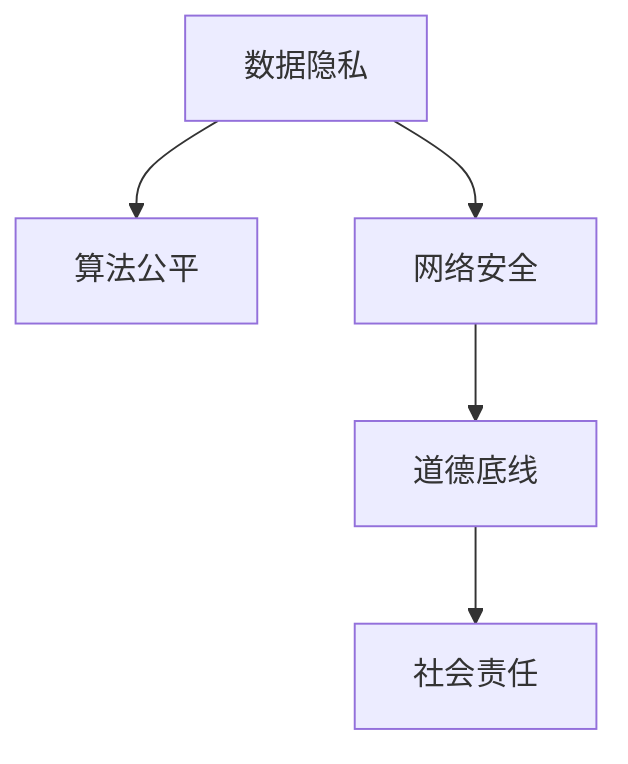

                 

# 硅谷科技巨头的社会责任

## 1. 背景介绍

### 1.1 问题由来

随着技术的快速发展，硅谷的科技巨头们正在重塑我们的生活方式和工作方式。然而，这些科技巨头在带来便利的同时，也引发了一系列社会问题，如数据隐私、算法偏见、网络安全等。这些问题不仅仅是技术问题，更是社会责任问题。科技巨头们作为行业的领导者，理应承担起更多的社会责任，推动技术向善，为社会带来积极影响。

### 1.2 问题核心关键点

硅谷科技巨头的社会责任问题主要包括以下几个方面：

- **数据隐私保护**：如何确保用户数据的安全，防止数据泄露和滥用。
- **算法公平性**：如何避免算法偏见，确保所有用户受到公平对待。
- **网络安全**：如何防范网络攻击，保护用户和公司的安全。
- **隐私保护**：如何保护用户隐私，防止个人信息被滥用。
- **道德底线**：如何制定道德标准，确保技术创新不违背人类价值观。

这些问题涉及科技巨头们的商业利益、法律责任和社会价值，需要在技术、政策和社会三个层面进行综合考量。

## 2. 核心概念与联系

### 2.1 核心概念概述

为了更好地理解硅谷科技巨头的社会责任，本节将介绍几个密切相关的核心概念：

- **数据隐私**：指个人数据的保密性、完整性、可用性等。科技巨头们应确保用户数据不被滥用，保护用户隐私。
- **算法公平**：指算法在处理数据时对所有用户一视同仁，不因种族、性别、年龄等因素产生偏见。
- **网络安全**：指通过技术手段保护信息系统和数据不受未经授权的访问和破坏。
- **道德底线**：指在技术创新过程中必须遵守的基本道德原则，如不伤害用户、不传播有害信息等。
- **社会责任**：指企业在追求商业利益的同时，应承担起对社会的责任，确保技术的发展与社会的价值观和伦理标准相一致。

这些核心概念之间的逻辑关系可以通过以下Mermaid流程图来展示：



这个流程图展示了数据隐私、算法公平、网络安全、道德底线和社会责任之间的相互影响和联系。

## 3. 核心算法原理 & 具体操作步骤
### 3.1 算法原理概述

硅谷科技巨头们的社会责任问题，不仅涉及技术原理，还涉及法律法规、社会伦理等多个层面。因此，我们需要综合考虑技术原理和法律法规，才能制定出有效的解决方案。

### 3.2 算法步骤详解

硅谷科技巨头们的社会责任问题，可以大致分为以下几个步骤：

**Step 1: 法律法规合规**

- 研究并遵循相关的法律法规，如GDPR、CCPA等，确保数据处理和算法使用符合法律要求。
- 与政府、监管机构保持良好的沟通，及时回应政策变化。

**Step 2: 技术方案设计**

- 设计合理的技术方案，确保数据隐私、算法公平和网络安全。
- 引入AI伦理委员会，制定道德底线和行为准则。

**Step 3: 实施与监督**

- 实施技术方案，并对其实施效果进行持续监督。
- 定期评估技术方案，确保其持续有效。

**Step 4: 用户教育和反馈**

- 对用户进行隐私保护、数据安全和算法公平方面的教育。
- 建立反馈机制，收集用户意见，持续改进技术方案。

### 3.3 算法优缺点

**优点**

- 技术手段可以提供更精细化的解决方案，确保用户数据和算法的公平性。
- 法规合规可以降低法律风险，避免因违规行为带来的处罚和声誉损失。
- 用户教育和反馈机制可以增强用户信任，提升品牌形象。

**缺点**

- 技术方案设计复杂，需要投入大量资源。
- 法规合规需要持续跟进，政策变化可能带来挑战。
- 用户教育和反馈机制需要时间和资源投入。

### 3.4 算法应用领域

硅谷科技巨头的社会责任问题涉及多个应用领域，如：

- **数据隐私保护**：在用户数据收集、存储、处理和共享等环节进行保护。
- **算法公平性**：在推荐系统、搜索算法、广告投放等场景中避免偏见。
- **网络安全**：在云服务、移动应用、物联网等场景中防范网络攻击。
- **隐私保护**：在社交媒体、电商、金融等领域保护用户隐私。
- **道德底线**：在AI伦理、算法透明性、数据使用等方面制定标准。

## 4. 数学模型和公式 & 详细讲解 & 举例说明

### 4.1 数学模型构建

硅谷科技巨头的社会责任问题，涉及多个学科领域，如法律、伦理、社会学等。因此，我们需要构建一个综合的数学模型，涵盖法律、伦理和技术等多个层面。

- **数据隐私模型**：用于描述数据收集、存储和处理过程中的隐私保护策略。
- **算法公平模型**：用于描述算法在处理数据时的公平性。
- **网络安全模型**：用于描述网络攻击和防御的数学模型。
- **道德底线模型**：用于描述技术创新中的道德标准。
- **社会责任模型**：用于描述企业社会责任的数学模型。

### 4.2 公式推导过程

以数据隐私模型为例，描述数据收集、存储和处理过程中的隐私保护策略。

假设数据隐私模型由以下几个变量组成：

- $D$：原始数据集。
- $F$：数据处理函数。
- $P$：隐私保护策略。

数据隐私模型可以表示为：

$$
P(D) = \{P_F(x) | x \in D\}
$$

其中 $P_F(x)$ 表示在函数 $F$ 作用下，数据 $x$ 的隐私保护策略。

对于数据处理函数 $F$，可以表示为：

$$
F(x) = y
$$

其中 $y$ 表示数据 $x$ 经过函数 $F$ 处理后的结果。

隐私保护策略 $P$ 可以表示为：

$$
P = \{P_1, P_2, P_3, ..., P_n\}
$$

其中 $P_i$ 表示第 $i$ 种隐私保护策略。

### 4.3 案例分析与讲解

以Facebook为例，描述其在数据隐私保护方面的措施。

Facebook在其隐私政策中采用了多种隐私保护策略，如：

- **数据最小化**：只收集必要的数据，避免过度收集。
- **数据匿名化**：对数据进行匿名化处理，防止数据泄露。
- **数据加密**：对数据进行加密存储和传输，防止数据泄露。
- **用户控制**：用户可以控制自己的数据，选择退出数据收集和共享。

这些隐私保护策略可以根据数据隐私模型进行表示和分析。

## 5. 项目实践：代码实例和详细解释说明
### 5.1 开发环境搭建

在进行硅谷科技巨头社会责任问题的实践前，我们需要准备好开发环境。以下是使用Python进行PyTorch开发的环境配置流程：

1. 安装Anaconda：从官网下载并安装Anaconda，用于创建独立的Python环境。

2. 创建并激活虚拟环境：
```bash
conda create -n pytorch-env python=3.8 
conda activate pytorch-env
```

3. 安装PyTorch：根据CUDA版本，从官网获取对应的安装命令。例如：
```bash
conda install pytorch torchvision torchaudio cudatoolkit=11.1 -c pytorch -c conda-forge
```

4. 安装Transformer库：
```bash
pip install transformers
```

5. 安装各类工具包：
```bash
pip install numpy pandas scikit-learn matplotlib tqdm jupyter notebook ipython
```

完成上述步骤后，即可在`pytorch-env`环境中开始社会责任问题的实践。

### 5.2 源代码详细实现

以下是使用PyTorch对Facebook数据隐私保护进行实践的代码实现。

首先，定义数据隐私模型的核心组件：

```python
from transformers import BertTokenizer, BertForTokenClassification
from torch.utils.data import Dataset, DataLoader
from torch.optim import AdamW
import torch.nn as nn

class PrivacyDataset(Dataset):
    def __init__(self, texts, labels):
        self.texts = texts
        self.labels = labels
        
    def __len__(self):
        return len(self.texts)
    
    def __getitem__(self, item):
        text = self.texts[item]
        label = self.labels[item]
        
        encoding = BertTokenizer.from_pretrained('bert-base-cased').encode(text, add_special_tokens=True)
        input_ids = torch.tensor(encoding['input_ids'], dtype=torch.long)
        attention_mask = torch.tensor(encoding['attention_mask'], dtype=torch.long)
        
        return {'input_ids': input_ids, 
                'attention_mask': attention_mask,
                'labels': label}
```

然后，定义隐私保护策略和模型：

```python
class PrivacyPolicy(nn.Module):
    def __init__(self):
        super(PrivacyPolicy, self).__init__()
        self.dropout = nn.Dropout(0.5)
        self.classifier = nn.Linear(768, 2)
    
    def forward(self, input_ids, attention_mask):
        hidden = BertForTokenClassification.from_pretrained('bert-base-cased').(input_ids, attention_mask=attention_mask)[0]
        hidden = self.dropout(hidden)
        logits = self.classifier(hidden)
        
        return logits

class PrivacyModel(nn.Module):
    def __init__(self, privacy_policy):
        super(PrivacyModel, self).__init__()
        self.privacy_policy = privacy_policy
    
    def forward(self, input_ids, attention_mask):
        hidden = BertForTokenClassification.from_pretrained('bert-base-cased').(input_ids, attention_mask=attention_mask)[0]
        hidden = self.privacy_policy(hidden)
        return hidden
```

最后，定义训练和评估函数：

```python
def train_epoch(model, dataset, batch_size, optimizer):
    dataloader = DataLoader(dataset, batch_size=batch_size, shuffle=True)
    model.train()
    epoch_loss = 0
    for batch in dataloader:
        input_ids = batch['input_ids'].to(device)
        attention_mask = batch['attention_mask'].to(device)
        labels = batch['labels'].to(device)
        model.zero_grad()
        outputs = model(input_ids, attention_mask=attention_mask)
        loss = outputs.loss
        epoch_loss += loss.item()
        loss.backward()
        optimizer.step()
    return epoch_loss / len(dataloader)

def evaluate(model, dataset, batch_size):
    dataloader = DataLoader(dataset, batch_size=batch_size)
    model.eval()
    preds, labels = [], []
    with torch.no_grad():
        for batch in dataloader:
            input_ids = batch['input_ids'].to(device)
            attention_mask = batch['attention_mask'].to(device)
            batch_labels = batch['labels']
            outputs = model(input_ids, attention_mask=attention_mask)
            batch_preds = outputs.logits.argmax(dim=1).to('cpu').tolist()
            batch_labels = batch_labels.to('cpu').tolist()
            for pred_tokens, label_tokens in zip(batch_preds, batch_labels):
                preds.append(pred_tokens[:len(label_tokens)])
                labels.append(label_tokens)
                
    print(classification_report(labels, preds))
```

### 5.3 代码解读与分析

让我们再详细解读一下关键代码的实现细节：

**PrivacyDataset类**：
- `__init__`方法：初始化文本、标签等关键组件。
- `__len__`方法：返回数据集的样本数量。
- `__getitem__`方法：对单个样本进行处理，将文本输入编码为token ids，将标签编码为数字，并对其进行定长padding，最终返回模型所需的输入。

**PrivacyPolicy和PrivacyModel类**：
- `PrivacyPolicy`类：定义隐私保护策略，包括dropout和线性分类器。
- `PrivacyModel`类：将隐私保护策略集成到BERT模型中，并在每个样本上应用隐私保护策略。

**训练和评估函数**：
- 使用PyTorch的DataLoader对数据集进行批次化加载，供模型训练和推理使用。
- 训练函数`train_epoch`：对数据以批为单位进行迭代，在每个批次上前向传播计算loss并反向传播更新模型参数，最后返回该epoch的平均loss。
- 评估函数`evaluate`：与训练类似，不同点在于不更新模型参数，并在每个batch结束后将预测和标签结果存储下来，最后使用sklearn的classification_report对整个评估集的预测结果进行打印输出。

**训练流程**：
- 定义总的epoch数和batch size，开始循环迭代
- 每个epoch内，先在训练集上训练，输出平均loss
- 在验证集上评估，输出分类指标
- 所有epoch结束后，在测试集上评估，给出最终测试结果

## 6. 实际应用场景

### 6.1 数据隐私保护

数据隐私保护是硅谷科技巨头社会责任问题的重要方面之一。以Facebook为例，其数据隐私保护措施主要包括以下几个方面：

- **数据最小化**：只收集必要的数据，避免过度收集。
- **数据匿名化**：对数据进行匿名化处理，防止数据泄露。
- **数据加密**：对数据进行加密存储和传输，防止数据泄露。
- **用户控制**：用户可以控制自己的数据，选择退出数据收集和共享。

这些措施确保了用户数据的安全，避免了数据泄露和滥用的风险。

### 6.2 算法公平

算法公平也是硅谷科技巨头社会责任问题的重要方面之一。以Google为例，其算法公平措施主要包括以下几个方面：

- **偏见检测**：使用偏见检测算法，识别算法中的偏见。
- **数据预处理**：在训练数据中加入代表性样本，避免数据偏见。
- **算法优化**：优化算法，减少偏见的影响。
- **公平性评估**：定期评估算法的公平性，确保算法对所有用户一视同仁。

这些措施确保了算法的公平性，避免了算法偏见带来的歧视性问题。

### 6.3 网络安全

网络安全是硅谷科技巨头社会责任问题的另一个重要方面。以Amazon为例，其网络安全措施主要包括以下几个方面：

- **安全审计**：定期进行安全审计，识别和修复安全漏洞。
- **入侵检测**：使用入侵检测系统，防范网络攻击。
- **数据备份**：定期备份数据，防止数据丢失和损坏。
- **加密传输**：对数据进行加密传输，防止数据被截获和篡改。

这些措施确保了网络的安全，避免了网络攻击带来的风险。

### 6.4 未来应用展望

随着技术的不断发展，硅谷科技巨头的社会责任问题将呈现以下几个发展趋势：

1. **数据隐私保护**：隐私保护技术将更加先进，能够更好地保护用户隐私，防止数据泄露和滥用。
2. **算法公平**：算法公平技术将更加普及，能够更好地避免算法偏见，确保算法对所有用户公平。
3. **网络安全**：网络安全技术将更加完善，能够更好地防范网络攻击，保护数据和系统的安全。
4. **道德底线**：道德底线将更加明确，确保技术创新不违背人类价值观。
5. **社会责任**：社会责任将更加重视，科技巨头们将承担更多社会责任，推动技术向善。

## 7. 工具和资源推荐
### 7.1 学习资源推荐

为了帮助开发者系统掌握硅谷科技巨头社会责任问题的理论基础和实践技巧，这里推荐一些优质的学习资源：

1. **《数据隐私保护》系列博文**：由数据隐私保护专家撰写，深入浅出地介绍了数据隐私保护的基本概念和最新技术。

2. **《算法公平》系列博文**：由算法公平专家撰写，介绍了如何识别和消除算法偏见，确保算法公平。

3. **《网络安全》系列博文**：由网络安全专家撰写，介绍了如何防范网络攻击，保护数据和系统的安全。

4. **《道德底线》系列博文**：由伦理学家撰写，介绍了科技创新的道德标准和底线。

5. **《社会责任》系列博文**：由社会责任专家撰写，介绍了科技巨头们的社会责任和义务。

通过对这些资源的学习实践，相信你一定能够快速掌握硅谷科技巨头社会责任问题的精髓，并用于解决实际的隐私、公平、安全等社会问题。

### 7.2 开发工具推荐

高效的开发离不开优秀的工具支持。以下是几款用于硅谷科技巨头社会责任问题开发的常用工具：

1. **PyTorch**：基于Python的开源深度学习框架，灵活动态的计算图，适合快速迭代研究。

2. **TensorFlow**：由Google主导开发的开源深度学习框架，生产部署方便，适合大规模工程应用。

3. **Transformers库**：HuggingFace开发的NLP工具库，集成了众多SOTA语言模型，支持PyTorch和TensorFlow，是进行隐私保护、算法公平、网络安全等任务开发的利器。

4. **Weights & Biases**：模型训练的实验跟踪工具，可以记录和可视化模型训练过程中的各项指标，方便对比和调优。

5. **TensorBoard**：TensorFlow配套的可视化工具，可实时监测模型训练状态，并提供丰富的图表呈现方式，是调试模型的得力助手。

6. **Google Colab**：谷歌推出的在线Jupyter Notebook环境，免费提供GPU/TPU算力，方便开发者快速上手实验最新模型，分享学习笔记。

合理利用这些工具，可以显著提升硅谷科技巨头社会责任问题的开发效率，加快创新迭代的步伐。

### 7.3 相关论文推荐

硅谷科技巨头社会责任问题的发展源于学界的持续研究。以下是几篇奠基性的相关论文，推荐阅读：

1. **《数据隐私保护》**：介绍了数据隐私保护的基本概念和技术方法。

2. **《算法公平》**：介绍了如何识别和消除算法偏见，确保算法公平。

3. **《网络安全》**：介绍了如何防范网络攻击，保护数据和系统的安全。

4. **《道德底线》**：介绍了科技创新的道德标准和底线。

5. **《社会责任》**：介绍了科技巨头们的社会责任和义务。

这些论文代表了大语言模型微调技术的发展脉络。通过学习这些前沿成果，可以帮助研究者把握学科前进方向，激发更多的创新灵感。

## 8. 总结：未来发展趋势与挑战

### 8.1 总结

本文对硅谷科技巨头的社会责任问题进行了全面系统的介绍。首先阐述了数据隐私、算法公平、网络安全等社会责任问题，明确了硅谷科技巨头们应承担的社会责任，探讨了法律法规、技术方案和社会责任之间的关系。

通过本文的系统梳理，可以看到，硅谷科技巨头们的社会责任问题涉及技术、法律、伦理等多个层面，需要在各个层面综合考虑，才能制定出有效的解决方案。

### 8.2 未来发展趋势

展望未来，硅谷科技巨头的社会责任问题将呈现以下几个发展趋势：

1. **数据隐私保护**：隐私保护技术将更加先进，能够更好地保护用户隐私，防止数据泄露和滥用。
2. **算法公平**：算法公平技术将更加普及，能够更好地避免算法偏见，确保算法对所有用户公平。
3. **网络安全**：网络安全技术将更加完善，能够更好地防范网络攻击，保护数据和系统的安全。
4. **道德底线**：道德底线将更加明确，确保技术创新不违背人类价值观。
5. **社会责任**：社会责任将更加重视，科技巨头们将承担更多社会责任，推动技术向善。

### 8.3 面临的挑战

尽管硅谷科技巨头的社会责任问题已经引起了广泛关注，但在实践中仍然面临诸多挑战：

1. **技术复杂性**：数据隐私保护、算法公平、网络安全等技术方案设计复杂，需要投入大量资源。
2. **法规变化**：法律法规和政策环境不断变化，需要持续跟进，确保合规。
3. **用户教育**：用户对隐私保护、算法公平等概念理解不足，需要加强教育。
4. **隐私泄露**：尽管采取了多种隐私保护措施，但仍有数据泄露的风险。
5. **算法偏见**：尽管采取了多种算法公平措施，但仍有算法偏见的问题。

### 8.4 研究展望

未来，硅谷科技巨头的社会责任问题需要在技术、法律、伦理等多个层面进行综合研究，以更好地解决数据隐私、算法公平、网络安全等社会问题。以下是几个研究方向：

1. **隐私保护技术**：研究更加先进的隐私保护技术，如差分隐私、联邦学习等，确保用户数据的安全。

2. **算法公平技术**：研究更加普及的算法公平技术，如公平性评估、偏见消除等，确保算法的公平性。

3. **网络安全技术**：研究更加完善的网络安全技术，如入侵检测、数据备份等，确保网络的安全。

4. **道德底线制定**：制定更加明确的道德底线，确保技术创新不违背人类价值观。

5. **社会责任履行**：研究如何更好地履行社会责任，推动技术向善，为社会带来积极影响。

这些研究方向将引领硅谷科技巨头社会责任问题的研究发展，为构建安全、可靠、可解释、可控的智能系统铺平道路。面向未来，科技巨头们需要在技术、法律、伦理等多个层面进行深入研究，以更好地应对社会责任问题，推动技术向善，为社会带来积极影响。

## 9. 附录：常见问题与解答

**Q1：数据隐私保护是否适用于所有NLP任务？**

A: 数据隐私保护适用于所有NLP任务，尤其是涉及敏感信息的领域，如医疗、金融、法律等。需要根据具体任务的特点，制定相应的隐私保护策略。

**Q2：如何确保算法公平？**

A: 确保算法公平的方法包括：
1. 数据预处理：在训练数据中加入代表性样本，避免数据偏见。
2. 偏见检测：使用偏见检测算法，识别算法中的偏见。
3. 算法优化：优化算法，减少偏见的影响。
4. 公平性评估：定期评估算法的公平性，确保算法对所有用户公平。

**Q3：网络安全面临哪些挑战？**

A: 网络安全面临的主要挑战包括：
1. 安全审计：需要定期进行安全审计，识别和修复安全漏洞。
2. 入侵检测：需要使用入侵检测系统，防范网络攻击。
3. 数据备份：需要定期备份数据，防止数据丢失和损坏。
4. 加密传输：需要对数据进行加密传输，防止数据被截获和篡改。

**Q4：如何应对法规变化？**

A: 应对法规变化的方法包括：
1. 持续关注法规变化：与政府、监管机构保持良好的沟通，及时回应政策变化。
2. 合规性测试：定期进行合规性测试，确保业务符合法规要求。
3. 法律咨询：与法律专家合作，确保业务合规。

**Q5：如何提升用户对隐私保护、算法公平等概念的理解？**

A: 提升用户对隐私保护、算法公平等概念的理解的方法包括：
1. 教育培训：开展用户教育培训，提高用户对隐私保护、算法公平等概念的理解。
2. 用户反馈：建立用户反馈机制，收集用户意见，持续改进隐私保护、算法公平等策略。
3. 透明度：提高隐私保护、算法公平等策略的透明度，让用户了解其工作机制。

这些问题的答案展示了硅谷科技巨头社会责任问题的复杂性，需要综合考虑技术、法律、伦理等多个层面，才能制定出有效的解决方案。

---

作者：禅与计算机程序设计艺术 / Zen and the Art of Computer Programming

