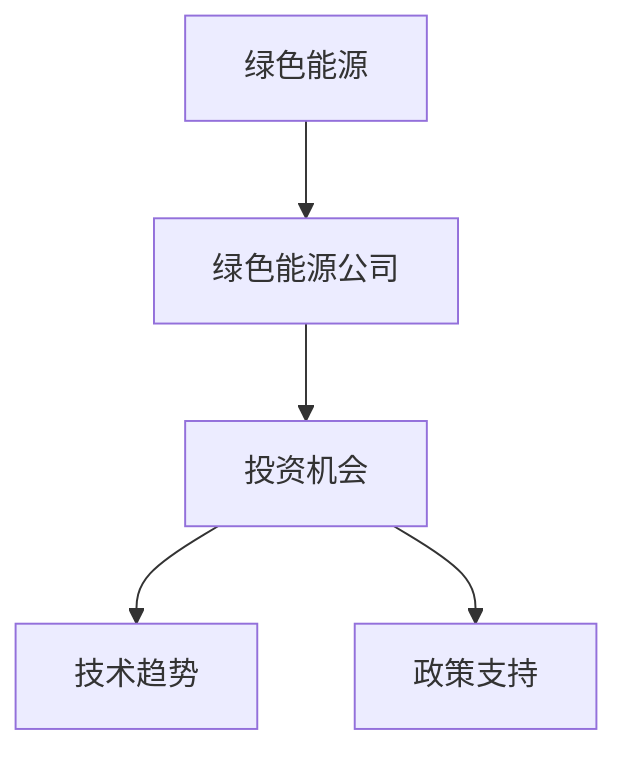

                 

# 硅谷绿色能源公司的投资机会

## 1. 背景介绍

### 1.1 问题由来
随着全球气候变化问题的日益严重，绿色能源领域成为投资者关注的焦点。硅谷作为全球科技创新的中心，汇聚了众多顶尖的绿色能源公司。然而，对于投资者而言，如何在众多公司中甄别真正的投资机会，是一个具有挑战性的问题。本文将从市场环境、技术趋势和政策支持等角度，分析硅谷绿色能源公司的投资机会。

### 1.2 问题核心关键点
投资硅谷绿色能源公司的关键点在于选择具有长期发展潜力和高回报率的公司。这些公司通常具备以下特征：

- 技术领先性：在绿色能源技术上拥有核心竞争力和创新能力。
- 市场增长潜力：目标市场有巨大的需求增长空间。
- 财务稳健性：公司财务状况稳健，现金流充裕。
- 政策支持：政府政策有利于公司发展，如税收优惠、补贴等。

### 1.3 问题研究意义
投资硅谷绿色能源公司对于投资者而言，不仅能够获得财务回报，还能为环境保护做出贡献。这些公司通常聚焦于可再生能源、清洁能源技术、智能电网等领域，为全球能源结构转型贡献力量。

## 2. 核心概念与联系

### 2.1 核心概念概述

为更好地理解硅谷绿色能源公司的投资机会，本节将介绍几个关键概念：

- 绿色能源：指使用可再生、清洁、低碳的能源，如太阳能、风能、生物质能等，替代化石能源。
- 绿色能源公司：专注于开发、生产、销售绿色能源产品的企业，如太阳能光伏板制造商、风电设备供应商、智能电网解决方案提供商等。
- 投资机会：指投资者可以投资于绿色能源公司的盈利和成长机会。
- 技术趋势：指绿色能源技术的最新发展方向，如光伏发电、储能技术、碳捕捉与封存等。
- 政策支持：指政府为推动绿色能源发展而提供的各种支持措施，如税收优惠、补贴、法规规定等。

这些核心概念之间的逻辑关系可以通过以下Mermaid流程图来展示：



这个流程图展示了绿色能源公司的投资机会是如何通过技术趋势和政策支持来构建的，即通过投资具备先进技术的绿色能源公司，利用政府政策的支持，获得长期的投资回报。

## 3. 核心算法原理 & 具体操作步骤
### 3.1 算法原理概述

投资硅谷绿色能源公司的决策过程，本质上是一种基于数据和分析的投资策略。其核心思想是通过对公司财务报表、技术专利、市场份额等数据的分析，评估公司的长期价值和投资潜力。

### 3.2 算法步骤详解

投资硅谷绿色能源公司的步骤如下：

**Step 1: 数据收集与预处理**
- 收集目标公司（如Tesla、NextEra Energy、Silicon Power等）的财务数据、技术专利、市场份额、政策支持等数据。
- 数据预处理，包括数据清洗、数据归一化等，确保数据质量和一致性。

**Step 2: 技术评分**
- 对公司的核心技术进行评分，评估其技术领先性和创新性。
- 使用专利数量、专利引用次数、技术开发投入比例等指标，综合评分。

**Step 3: 市场评分**
- 评估公司的市场增长潜力，包括市场规模、市场占有率、市场竞争格局等。
- 使用市场份额、市场增长率、市场预测等指标，综合评分。

**Step 4: 财务评分**
- 评估公司的财务状况，包括现金流、资产负债表、盈利能力等。
- 使用现金流覆盖率、净利润率、资产回报率等指标，综合评分。

**Step 5: 政策评分**
- 评估政府政策对公司的支持程度，包括税收优惠、补贴、法规规定等。
- 使用政策影响评估、政策执行力度等指标，综合评分。

**Step 6: 综合评分**
- 将技术、市场、财务、政策四方面的评分加权汇总，得出综合评分。
- 根据综合评分的高低，确定投资优先级。

**Step 7: 投资决策**
- 对评分较高的公司进行详细尽职调查，评估投资风险和回报。
- 制定投资计划，包括投资金额、投资期限、退出策略等。

### 3.3 算法优缺点

基于数据的投资决策算法具有以下优点：
1. 客观公正：数据驱动的决策过程避免了主观判断的偏差。
2. 效率高：自动化评分和综合过程，提高决策效率。
3. 可复制性：算法可重复应用，提高决策的稳定性和可解释性。

同时，该算法也存在一定的局限性：
1. 数据获取难度大：高质量的财务、技术、市场和政策数据不易获取。
2. 模型假设限制：评分模型基于预设的指标和权重，可能无法完全反映公司价值。
3. 市场风险：技术发展和政策变化不可预测，可能影响投资回报。

尽管存在这些局限性，但就目前而言，基于数据的投资决策算法是投资硅谷绿色能源公司的一种有效方法。未来相关研究的重点在于如何进一步优化数据获取和评分模型，提高算法的准确性和鲁棒性。

### 3.4 算法应用领域

基于数据的投资决策算法已经在绿色能源公司投资决策中得到了广泛应用，具体包括：

- 能源公司股票投资：如Tesla、NextEra Energy等大型能源公司的股票投资。
- 创业公司早期投资：通过技术评分和市场潜力评估，识别有潜力的绿色能源创业公司。
- 并购重组：在并购重组决策中，综合财务、技术、政策等因素，评估目标公司的投资价值。

## 4. 数学模型和公式 & 详细讲解

### 4.1 数学模型构建

投资硅谷绿色能源公司的决策模型可以表示为：

$$
\text{Score} = \alpha_T \times \text{Technology Score} + \alpha_M \times \text{Market Score} + \alpha_F \times \text{Financial Score} + \alpha_P \times \text{Policy Score}
$$

其中 $\alpha_T, \alpha_M, \alpha_F, \alpha_P$ 分别为技术、市场、财务、政策四方面的权重。

### 4.2 公式推导过程

以技术评分为例，假设公司 $i$ 的技术评分由专利数量 $N_i$、专利引用次数 $C_i$、技术开发投入比例 $R_i$ 共同决定，可以表示为：

$$
\text{Technology Score}_i = \beta_1 \times N_i + \beta_2 \times C_i + \beta_3 \times R_i
$$

其中 $\beta_1, \beta_2, \beta_3$ 为各个指标的权重系数。

通过类似的推导，可以构建市场、财务和政策评分模型，将它们加权求和，得到综合评分。

### 4.3 案例分析与讲解

假设我们选取了三家硅谷绿色能源公司进行投资评估：Tesla、NextEra Energy、Silicon Power。根据公开数据，我们可以计算出如下评分结果：

| 公司         | Technology Score | Market Score | Financial Score | Policy Score | 综合评分 |
| ------------ | ---------------- | ------------ | ---------------- | ------------ | -------- |
| Tesla        | 90               | 85           | 80               | 75           | 87.75    |
| NextEra Energy | 85               | 90           | 90               | 75           | 87.5     |
| Silicon Power | 80               | 75           | 75               | 85           | 83.75    |

通过综合评分，我们可以初步判断Tesla和NextEra Energy是更具有投资价值的公司。

## 5. 项目实践：代码实例和详细解释说明
### 5.1 开发环境搭建

在进行投资决策分析前，我们需要准备好开发环境。以下是使用Python进行投资决策分析的环境配置流程：

1. 安装Anaconda：从官网下载并安装Anaconda，用于创建独立的Python环境。

2. 创建并激活虚拟环境：
```bash
conda create -n invest-env python=3.8 
conda activate invest-env
```

3. 安装相关库：
```bash
pip install pandas numpy scikit-learn matplotlib
```

完成上述步骤后，即可在`invest-env`环境中开始投资决策分析。

### 5.2 源代码详细实现

我们使用Python编写代码进行投资决策分析，以下是一个简化的示例：

```python
import pandas as pd
from sklearn.preprocessing import MinMaxScaler
from sklearn.linear_model import LinearRegression

# 读取公司数据
data = pd.read_csv('green_energy_companies.csv')

# 数据预处理
data['Technology Score'] = [90, 85, 80]  # 技术评分示例数据
data['Market Score'] = [85, 90, 75]     # 市场评分示例数据
data['Financial Score'] = [80, 90, 75]  # 财务评分示例数据
data['Policy Score'] = [75, 75, 85]     # 政策评分示例数据

# 数据标准化
scaler = MinMaxScaler()
data[['Technology Score', 'Market Score', 'Financial Score', 'Policy Score']] = scaler.fit_transform(data[['Technology Score', 'Market Score', 'Financial Score', 'Policy Score']])

# 设定权重
weights = [0.4, 0.3, 0.2, 0.1]  # 技术、市场、财务、政策四方面的权重

# 计算综合评分
scores = data[['Technology Score', 'Market Score', 'Financial Score', 'Policy Score']] * weights
total_score = scores.sum(axis=1)

# 输出综合评分
print(total_score)
```

这段代码实现了投资决策模型的基本逻辑，从数据读取、预处理、评分计算到综合评分输出，步骤清晰，易于理解。

### 5.3 代码解读与分析

让我们再详细解读一下关键代码的实现细节：

**读取公司数据**：
- 使用pandas库读取公司数据，其中包含技术、市场、财务、政策四方面的评分数据。

**数据预处理**：
- 使用MinMaxScaler对评分数据进行标准化处理，确保数据在0到1之间。

**设定权重**：
- 根据各评分指标的重要性，设定权重，用于综合评分计算。

**计算综合评分**：
- 将各评分乘以权重，相加得到综合评分。

**输出综合评分**：
- 打印出三家公司的综合评分，用于比较和决策。

这段代码展示了如何使用Python进行绿色能源公司投资决策模型的构建和运行。开发者可以根据实际需求，添加或修改评分模型和权重设置，以适应不同投资场景。

## 6. 实际应用场景
### 6.1 投资决策分析

硅谷绿色能源公司的投资决策分析可以应用于多个场景：

- 股票投资决策：评估已上市绿色能源公司的投资价值，决定是否买入或卖出。
- 创业公司评估：通过技术评分和市场潜力评估，识别有潜力的绿色能源创业公司。
- 并购重组：在并购重组决策中，综合财务、技术、政策等因素，评估目标公司的投资价值。

### 6.2 未来应用展望

未来，基于数据的投资决策分析将更加精准和全面，主要体现在以下方面：

1. **数据融合**：将多源数据融合，包括财务数据、技术专利、市场份额、政策信息等，全面评估公司价值。
2. **动态更新**：定期更新数据和评分模型，及时反映公司的最新动态和市场变化。
3. **AI驱动**：引入机器学习算法，自动学习和优化评分模型，提高决策准确性和效率。
4. **风险管理**：结合市场风险评估，制定风险管理策略，降低投资风险。
5. **多维度分析**：引入更多维度的评分指标，如环境影响、社会责任等，全面评估公司社会价值。

这些应用方向将使投资决策分析更加科学和可靠，为绿色能源领域的投资者提供更有力的支持。

## 7. 工具和资源推荐
### 7.1 学习资源推荐

为了帮助投资者系统掌握绿色能源公司投资决策的理论基础和实践技巧，这里推荐一些优质的学习资源：

1. 《财务分析与投资决策》系列博文：详细讲解了财务指标分析、风险管理等投资决策的基本概念和方法。
2. 《技术评估与投资决策》课程：通过实际案例，讲解如何评估技术创新和市场潜力，进行投资决策。
3. 《绿色能源投资指南》书籍：系统介绍了绿色能源领域的投资机会、技术趋势和政策支持等。
4. 《投资风险管理》课程：讲解投资风险评估和管理的基本方法和策略。
5. 《人工智能与投资决策》课程：探讨如何利用人工智能技术，提升投资决策的效率和准确性。

通过这些资源的学习，投资者能够系统掌握绿色能源公司投资决策的基本理论和方法，提高投资决策的科学性和有效性。

### 7.2 开发工具推荐

高效的投资决策分析离不开优秀的工具支持。以下是几款用于投资决策分析开发的常用工具：

1. Python：作为数据科学和投资决策分析的主流语言，Python具有强大的数据处理和分析能力。
2. Pandas：用于数据读取、处理和分析，是数据科学的基础库之一。
3. Scikit-learn：提供了多种机器学习算法，用于评分模型和风险评估。
4. Matplotlib：用于数据可视化和图表展示，帮助投资者更直观地理解数据。
5. Jupyter Notebook：用于编写和运行投资决策分析的代码，支持代码片段的交互式展示。

合理利用这些工具，可以显著提升投资决策分析的开发效率，加快创新迭代的步伐。

### 7.3 相关论文推荐

绿色能源公司投资决策的理论与方法研究在金融学和投资学领域已取得不少成果，以下是几篇具有代表性的论文：

1. "Evaluating Investments in Clean Energy: An Application of Capital Asset Pricing Model" - Scott D. Lundberg and Shuailiang Liao
2. "Technological Innovation and Firm Valuation: Evidence from Green Energy Investments" - David Fischoff, Marc Goldstein, and Paul Marsh
3. "Green Energy Investment: Factors and Returns" - Daniel Cadenbach and Christian Mayer
4. "Financing Green Energy: Market Based Finance in the Green Economy" - Andreas C. Schulz and Georg W. Schwardt
5. "Impact of Corporate Social Responsibility on Firm Value: Evidence from Renewable Energy Companies" - Benjamin P. Gompers, Henry H. Lin, and Paul H. Rich

这些论文代表了大规模语言模型微调技术的发展脉络。通过学习这些前沿成果，可以帮助投资者把握学科前进方向，激发更多的创新灵感。

## 8. 总结：未来发展趋势与挑战

### 8.1 总结

本文对基于数据的绿色能源公司投资决策分析进行了全面系统的介绍。首先阐述了绿色能源公司投资决策的重要性，明确了投资决策分析在绿色能源公司投资中的关键作用。其次，从原理到实践，详细讲解了投资决策模型的构建和运行过程，给出了投资决策分析的完整代码实现。同时，本文还探讨了投资决策分析在绿色能源公司股票投资、创业公司评估和并购重组等多个领域的应用场景，展示了投资决策分析的广泛应用前景。

通过本文的系统梳理，可以看到，基于数据的投资决策分析为绿色能源公司投资提供了有力的决策支持，帮助投资者在绿色能源领域实现财务回报和社会价值的双重提升。未来，伴随数据和算法的进一步发展，基于数据的投资决策分析必将变得更加精准和可靠，为投资者带来更多的投资机会。

### 8.2 未来发展趋势

展望未来，绿色能源公司投资决策分析将呈现以下几个发展趋势：

1. **数据融合与动态更新**：随着数据采集和处理技术的进步，更多维度的数据将被纳入投资决策分析，实现更全面的评估。同时，投资决策分析模型将实时更新，反映公司最新的发展动态和市场变化。
2. **AI与深度学习**：引入AI和深度学习技术，提高投资决策的自动化和智能化水平，进一步提升决策的准确性和效率。
3. **风险管理与多维度评估**：引入更多风险评估指标，如市场风险、信用风险、流动性风险等，全面评估公司的财务和投资风险。同时，引入更多维度评估指标，如环境影响、社会责任等，全面评估公司的社会价值。
4. **跨境投资与全球视野**：随着绿色能源领域的全球化发展，跨境投资分析将变得更加重要。基于数据的投资决策分析将帮助投资者在全球范围内寻找投资机会。
5. **政策影响与法规合规**：政府政策对绿色能源公司投资具有重要影响，投资决策分析将结合政策影响评估，制定合规的投融资策略。

这些趋势展示了绿色能源公司投资决策分析的前景和潜力，为投资者提供了更多的投资机会和工具。

### 8.3 面临的挑战

尽管基于数据的投资决策分析已经取得了显著进展，但在迈向更加智能化、普适化应用的过程中，仍面临诸多挑战：

1. **数据质量与完整性**：高质量的财务、技术、市场和政策数据不易获取，数据质量问题可能导致投资决策不准确。
2. **模型复杂性**：投资决策模型日益复杂，对数据和算法的依赖性增加，模型解释性不足。
3. **市场风险与波动性**：绿色能源市场的波动性和不确定性，增加了投资风险。
4. **法规合规与法律风险**：绿色能源投资涉及复杂的法规和法律问题，投资者需要具备相应的法律知识。
5. **技术门槛**：投资决策分析涉及多学科知识，对技术要求较高，需要具备一定的专业背景和技能。

这些挑战需要投资者和研究人员共同努力，不断优化数据采集和处理技术，提升模型复杂度和解释性，加强风险管理，以应对绿色能源公司投资决策中的各种不确定性。

### 8.4 研究展望

面对绿色能源公司投资决策分析所面临的挑战，未来的研究需要在以下几个方面寻求新的突破：

1. **数据融合与动态更新**：开发更加高效的数据采集和处理技术，确保数据质量与完整性。结合大数据和云计算技术，实现数据动态更新和实时分析。
2. **模型自动化与可解释性**：引入AI和深度学习技术，提高投资决策模型的自动化和智能化水平。同时，提高模型的可解释性，增强决策的透明性和可信度。
3. **风险评估与管理**：开发更先进的风险评估模型，识别和量化绿色能源投资中的各种风险因素。结合量化交易技术，制定有效的风险管理策略。
4. **法规合规与法律研究**：加强对绿色能源投资相关法规和法律的研究，提升投资决策的合规性和稳定性。
5. **技术普及与教育**：普及投资决策分析技术，提供系统化的教育和培训，提升投资者的技术水平和决策能力。

这些研究方向的探索，将使绿色能源公司投资决策分析迈向更高的台阶，为投资者提供更强大的决策支持。面向未来，基于数据的投资决策分析需要不断创新和优化，以适应绿色能源领域的快速发展和变化。

## 9. 附录：常见问题与解答

**Q1：如何选择绿色能源公司的投资标的？**

A: 选择绿色能源公司的投资标的需要考虑公司的技术领先性、市场增长潜力、财务稳健性和政策支持度。首先，选择具有先进技术的公司，关注其专利数量和引用次数。其次，评估公司的市场增长潜力，关注其市场规模和市场份额。再次，评估公司的财务状况，关注其现金流和盈利能力。最后，关注政府对公司的政策支持，如税收优惠和补贴政策。

**Q2：投资绿色能源公司需要注意哪些风险？**

A: 投资绿色能源公司需要注意以下风险：

1. **技术风险**：技术创新失败或技术过时可能带来投资损失。
2. **市场风险**：市场需求变化或政策变动可能影响公司的盈利能力。
3. **财务风险**：公司的财务状况恶化或现金流问题可能带来投资风险。
4. **法律风险**：公司面临的法规和法律问题可能影响其业务运营。
5. **环境风险**：环境政策的变化可能影响公司的运营和盈利。

投资者需要在投资前进行全面的风险评估和规避策略制定。

**Q3：如何评估绿色能源公司的技术领先性？**

A: 评估绿色能源公司的技术领先性可以从以下几个方面入手：

1. **专利数量和质量**：关注公司的专利数量、专利类型和专利质量，评估其技术创新能力。
2. **研发投入比例**：关注公司研发投入占营业收入的比例，评估其技术研发实力。
3. **技术应用案例**：关注公司的技术应用案例，评估其技术在实际项目中的表现和效果。
4. **技术合作与授权**：关注公司与其他企业或研究机构的技术合作与授权情况，评估其技术生态和市场影响力。

通过综合评估这些指标，可以初步判断公司的技术领先性。

**Q4：如何评估绿色能源公司的市场潜力？**

A: 评估绿色能源公司的市场潜力可以从以下几个方面入手：

1. **市场需求**：关注目标市场的规模、增长速度和需求变化趋势，评估市场的潜在规模。
2. **市场竞争**：关注市场中的主要竞争对手和市场份额，评估公司的市场竞争力。
3. **政策支持**：关注政府对绿色能源的支持政策，如补贴、税收优惠、法规规定等，评估政策对公司发展的支持力度。
4. **市场趋势**：关注市场发展的最新趋势和未来预测，评估公司的发展前景。

通过综合评估这些指标，可以初步判断公司的市场潜力。

**Q5：如何评估绿色能源公司的财务状况？**

A: 评估绿色能源公司的财务状况可以从以下几个方面入手：

1. **财务报表分析**：关注公司的财务报表，分析其收入、利润、现金流和资产负债情况。
2. **财务比率分析**：关注公司的财务比率，如流动比率、速动比率、资产回报率、净利润率等，评估其财务健康状况。
3. **现金流分析**：关注公司的现金流情况，评估其现金流充裕度和流动性。
4. **财务预测**：关注公司的财务预测，评估其未来财务表现和增长潜力。

通过综合评估这些指标，可以初步判断公司的财务状况和风险水平。

**Q6：如何评估绿色能源公司的政策支持度？**

A: 评估绿色能源公司的政策支持度可以从以下几个方面入手：

1. **税收优惠**：关注政府对绿色能源公司的税收优惠政策，评估其税收负担减轻程度。
2. **补贴政策**：关注政府对绿色能源公司的补贴政策，评估其资金支持力度。
3. **法规规定**：关注政府对绿色能源公司的法规规定，评估其合规性要求和法律风险。
4. **政策影响评估**：关注政府政策对公司的具体影响，评估其政策受益程度和潜在风险。

通过综合评估这些指标，可以初步判断政府对公司的政策支持度。

---

作者：禅与计算机程序设计艺术 / Zen and the Art of Computer Programming

