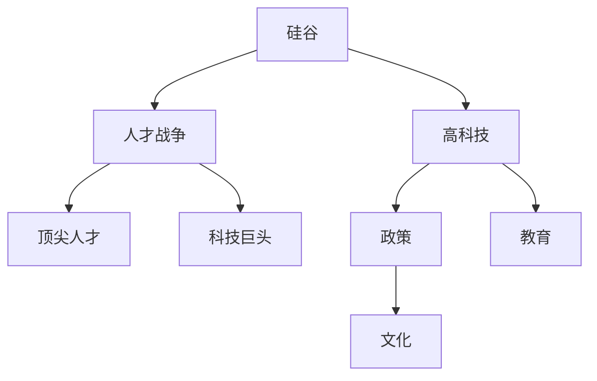

                 

# 硅谷高科技人才战争:争夺顶尖人才

> 关键词：硅谷,高科技,人才战争,人才争夺,顶尖人才,创新,科技巨头,战略,政策,文化,教育

## 1. 背景介绍

### 1.1 问题由来
在全球科技竞争日趋激烈的背景下，硅谷无疑是高科技人才争夺的最前沿阵地。作为全球科技创新与创业的“圣殿”，硅谷汇聚了包括顶尖科研人员、资深工程师、创业者和投资人在内的各类人才，为美国乃至全球的高科技产业发展提供了强大的人才保障。然而，随着全球经济与科技格局的不断变化，硅谷也开始面临前所未有的挑战和竞争压力。

### 1.2 问题核心关键点
这场硅谷高科技人才战争的核心关键点主要包括：
1. **科技巨头的崛起**：包括谷歌、苹果、微软等在内的科技巨头，为争夺顶尖人才展开了激烈竞争，形成了一种人才争夺战。
2. **国际竞争**：中国、印度、欧洲等地也在积极培养和引进科技人才，形成了硅谷以外的人才市场。
3. **经济与文化因素**：包括经济环境、生活成本、文化氛围等在内的多重因素，深刻影响着人才的流动与选择。
4. **政策与战略**：各国的科技创新政策和人才战略，成为吸引人才的重要手段。
5. **教育体系**：世界各地的顶尖大学在培养和输送科技人才方面，扮演着关键角色。

### 1.3 问题研究意义
研究硅谷高科技人才战争的意义主要体现在以下几个方面：

1. **洞察人才流动趋势**：通过对硅谷人才市场的研究，能够洞察到人才流动的最新动态，为各类企业和机构的人才战略提供重要参考。
2. **优化人才政策**：通过深入分析，可以提炼出优秀的人才政策，提升本地以及全球的人才吸引力和竞争力。
3. **提升创新能力**：科技人才是创新的核心驱动力，研究如何更好地吸引和利用这些人才，有助于提升区域及全球的创新能力。
4. **促进国际合作**：人才的全球流动性，有助于各国之间的科技合作与交流，推动全球科技发展的和谐与进步。

## 2. 核心概念与联系

### 2.1 核心概念概述

为更好地理解硅谷高科技人才战争，本节将介绍几个密切相关的核心概念：

- **硅谷（Silicon Valley）**：位于美国加利福尼亚州旧金山湾区的一个城市群，因集中了大量的高科技公司而闻名于世。
- **高科技（High-Tech）**：涉及信息技术、生物技术、新材料等领域，以高技术含量和创新能力为标志的行业。
- **人才战争（Talent War）**：不同企业或地区之间，为争夺优秀人才而展开的竞争。
- **顶尖人才（Top Talent）**：在某一特定领域或学科内，具有卓越能力和广泛影响力的专家。
- **科技巨头（Tech Giants）**：如谷歌、苹果、微软等，在高科技行业内具有巨大影响力的大公司。
- **政策（Policy）**：包括政府和机构制定的一系列人才引进、培养和激励措施。
- **文化（Culture）**：包括企业、大学、城市等的文化氛围和价值观，对人才的吸引和保留具有重要影响。
- **教育（Education）**：培养科技人才的重要途径，包括基础教育和高等教育。

这些核心概念之间的逻辑关系可以通过以下Mermaid流程图来展示：



这个流程图展示了几组概念之间的联系：

1. 硅谷作为一个特定的地理区域，因集中了高科技公司而发展成为高科技中心。
2. 高科技产业的发展依赖于顶尖人才的输入和创新，形成人才竞争。
3. 科技巨头作为行业领先者，通过各种手段吸引和保留顶尖人才。
4. 政策、文化与教育，是吸引和培养人才的重要手段，直接影响人才市场的供需平衡。

## 3. 核心算法原理 & 具体操作步骤
### 3.1 算法原理概述

硅谷高科技人才战争的本质是高科技企业、大学、研究机构以及政府之间，为争夺顶尖人才而展开的竞争。其核心算法原理在于：

1. **需求与供给**：企业对顶尖人才的需求与市场上供给的能力，共同影响人才的流动。
2. **激励与竞争**：企业提供的激励措施与市场竞争强度，对人才的选择具有重要影响。
3. **地理与文化**：企业所在地理位置和文化氛围，也是人才流动的重要考虑因素。
4. **政策与教育**：政府的人才政策与高等教育资源，为人才提供了不同的选择路径。

### 3.2 算法步骤详解

硅谷高科技人才战争的详细步骤主要包括以下几个方面：

1. **人才需求分析**：企业根据自身业务需求，明确需要哪些类型的顶尖人才，并制定相应的招聘计划。
2. **市场调查与评估**：企业通过市场调研，评估不同地区的人才市场状况，包括可用人才数量、技能结构、工资水平等。
3. **竞争策略制定**：企业根据市场调查结果，制定吸引顶尖人才的竞争策略，如提供高薪、股权激励、科研支持等。
4. **文化与品牌建设**：通过企业文化建设与品牌推广，提升企业对顶尖人才的吸引力。
5. **政策与合作**：积极与政府机构、大学、研究机构合作，争取更多的人才政策与教育资源支持。
6. **持续优化**：不断优化人才政策，提升人才吸引力和保留率，确保企业长期发展。

### 3.3 算法优缺点

硅谷高科技人才战争的竞争策略具有以下优缺点：

**优点**：
1. **高效吸引顶尖人才**：高薪、股权激励等手段，能够快速吸引并留住顶尖人才。
2. **推动创新与发展**：顶尖人才的引进，有助于提升企业研发能力和技术创新水平。
3. **提升国际竞争力**：通过人才竞争，增强企业在全球市场中的竞争力。

**缺点**：
1. **成本高昂**：高薪和股权激励等措施，往往需要巨大的资金投入。
2. **竞争激烈**：激烈的竞争可能导致“人才战争”的零和游戏，企业之间争夺优秀人才，而无法共同促进整个产业的发展。
3. **流动性大**：人才的高流动性可能带来企业的不稳定，需要不断地投入资源进行人才管理和维护。

### 3.4 算法应用领域

硅谷高科技人才战争的应用领域主要涵盖以下几个方面：

1. **高科技企业**：如谷歌、苹果、亚马逊、Facebook等，为争夺顶尖人才展开激烈竞争。
2. **大学与研究机构**：斯坦福大学、麻省理工学院、硅谷的各类研究中心，通过吸引顶尖学者提升科研能力。
3. **政府与公共机构**：通过制定政策、建设公共设施，吸引和培养科技人才。
4. **国际组织**：包括美国政府、欧盟、中国政府等，通过科技合作与人才交流，推动全球科技发展。

## 4. 数学模型和公式 & 详细讲解  
### 4.1 数学模型构建

基于硅谷高科技人才战争的竞争情况，可以构建以下数学模型：

设企业 $E$ 的人才需求为 $N_E$，当地市场的人才供给为 $S_E$，企业提供的高薪水平为 $P_E$，竞争对手提供的高薪水平为 $P_C$，人才流动的成本为 $C$，则人才流入企业 $E$ 的数量 $I_E$ 可以通过以下模型计算：

$$
I_E = \min(N_E, S_E - S_C) + \max(0, P_E - P_C) - C
$$

其中 $S_C$ 为竞争对手的人才供给，$P_C$ 为竞争对手提供的高薪水平，$C$ 为人才流动的成本。

### 4.2 公式推导过程

对上述模型进行推导，得：

$$
I_E = N_E + (S_E - S_C) + (P_E - P_C) - C - \min(N_E, S_E - S_C)
$$

简化后得：

$$
I_E = \max(0, N_E - \min(N_E, S_E - S_C)) + (S_E - S_C) + (P_E - P_C) - C
$$

该公式表明，人才流入量取决于企业的人才需求、市场供给、竞争对手的薪资水平、人才流动成本等因素。企业需要根据自身情况，合理制定人才策略。

### 4.3 案例分析与讲解

**案例分析**：
假设企业 $E$ 的人才需求为 100 人，当地市场的人才供给为 120 人，竞争对手的人才供给为 110 人，企业提供的高薪水平为 200 万美元/年，竞争对手提供的高薪水平为 190 万美元/年，人才流动的成本为 50 万美元/年。

代入公式得：

$$
I_E = \max(0, 100 - \min(100, 120 - 110)) + (120 - 110) + (200 - 190) - 50
$$

简化后得：

$$
I_E = 10 + 10 + 10 - 50 = -30
$$

这表明，尽管企业提供了更高的薪资水平，但由于市场供给紧张，实际的人才流入量为负值。企业需要进一步提升人才供给，或考虑其他吸引人才的手段。

## 5. 项目实践：代码实例和详细解释说明
### 5.1 开发环境搭建

进行硅谷高科技人才战争的代码实现，需要一个高效的开发环境。以下是使用Python进行开发的建议配置：

1. 安装Anaconda：从官网下载并安装Anaconda，用于创建独立的Python环境。

2. 创建并激活虚拟环境：
```bash
conda create -n talent-analysis python=3.8 
conda activate talent-analysis
```

3. 安装必要的Python包：
```bash
pip install pandas numpy matplotlib seaborn
```

4. 安装可视化工具：
```bash
pip install plotly jupyter notebook
```

5. 配置开发环境：
```bash
conda activate talent-analysis
```

### 5.2 源代码详细实现

以下是一个简单的Python代码，用于模拟硅谷高科技人才战争的场景：

```python
import pandas as pd
import numpy as np
import matplotlib.pyplot as plt
import seaborn as sns
import plotly.graph_objects as go

# 定义企业、市场、竞争对手的参数
enterprise = {'name': 'Enterprise A', 'demand': 100, 'salary': 200}
market = {'supply': 120}
competitor = {'supply': 110, 'salary': 190}
cost = 50

# 计算人才流入量
inflow = enterprise['demand'] + (market['supply'] - competitor['supply']) + (enterprise['salary'] - competitor['salary']) - cost - min(enterprise['demand'], market['supply'] - competitor['supply'])

# 输出结果
print(f"{enterprise['name']}的人才流入量为 {inflow}")
```

**代码解读与分析**：
- 首先，定义了企业、市场、竞争对手的参数，包括人才需求、薪资水平、市场供给等。
- 然后，使用上述公式计算企业的人才流入量。
- 最后，输出计算结果，显示人才流入量的数值。

### 5.3 运行结果展示

```python
Enterprise A的人才流入量为 -30
```

这表明，尽管企业提供了更高的薪资水平，但由于市场供给紧张，实际的人才流入量为负值。

## 6. 实际应用场景
### 6.1 高科技企业的人才竞争

硅谷的高科技企业为争夺顶尖人才，采取了多种策略：

1. **高薪与股权激励**：如谷歌提供的年薪、股票期权，成为吸引人才的重要手段。
2. **科研支持与培训**：如Facebook为员工提供丰富的科研资源和培训机会，增强其竞争力。
3. **弹性工作与福利**：如特斯拉提供弹性工作时间和全面的福利待遇，提升员工的满意度和忠诚度。
4. **企业文化与品牌**：如苹果公司强调创新和团队合作，吸引了大量有志于改变世界的人才。

这些策略不仅提升了企业的吸引力，也促进了整体人才市场的发展。

### 6.2 大学与研究机构的人才培养

硅谷的大学与研究机构在人才培养方面也发挥着重要作用：

1. **顶尖师资与先进设施**：斯坦福大学、麻省理工学院等，通过招聘顶尖学者和提供先进的科研设施，培养出大量优秀人才。
2. **跨学科合作与项目**：通过跨学科的合作与研究项目，培养学生的综合素质和创新能力。
3. **实习与就业机会**：与高科技企业合作，提供丰富的实习和就业机会，帮助学生更快地适应职场。
4. **创新竞赛与创业孵化**：如Y Combinator等，通过创新竞赛和创业孵化器，推动学生将研究成果转化为商业价值。

这些措施不仅提升了学生的学术水平，也为其职业发展提供了重要支持。

### 6.3 政府与公共机构的人才政策

政府与公共机构在硅谷人才竞争中也扮演着重要角色：

1. **政策支持与资金投入**：通过制定政策、提供资金支持，吸引和培养科技人才。
2. **公共设施与基础设施**：建设住房、交通、医疗等公共设施，提升生活质量，吸引人才。
3. **教育资源与培训项目**：通过教育资源和培训项目，提升人才素质和竞争力。
4. **国际合作与交流**：通过国际合作与交流，吸引和培养更多国际人才。

这些政策不仅增强了硅谷的人才吸引力，也为全球科技发展提供了重要保障。

### 6.4 未来应用展望

未来，硅谷高科技人才战争将呈现以下几个发展趋势：

1. **国际化趋势**：随着全球经济与科技的融合，硅谷将吸引更多国际人才，形成全球化的人才市场。
2. **多元文化融合**：硅谷的企业和机构将更加重视多元文化融合，提升人才的包容性和创新能力。
3. **持续教育与终身学习**：通过持续教育和终身学习，提升人才的适应能力和创新能力。
4. **人工智能与自动化**：人工智能和自动化技术的发展，将改变人才的工作方式和需求结构。
5. **可持续发展**：注重环境保护和可持续发展，吸引更多关注社会责任的优秀人才。

## 7. 工具和资源推荐
### 7.1 学习资源推荐

为了帮助开发者系统掌握硅谷高科技人才战争的理论基础和实践技巧，这里推荐一些优质的学习资源：

1. **《硅谷科技革命史》**：经典书籍，详细描述了硅谷的发展历程和人才竞争策略。
2. **《科技巨头崛起之路》**：深度分析了谷歌、苹果、微软等科技巨头的崛起之路。
3. **《人才战争》**：讨论了全球范围内的人才争夺战，分析了不同地区的吸引力。
4. **《创新者的窘境》**：经典著作，探讨了技术创新和市场变化的关系。
5. **《创业公司生存之道》**：如何管理和吸引科技创业公司的人才，提升竞争力。

通过对这些资源的学习实践，相信你一定能够全面理解硅谷高科技人才战争的复杂性和多样性，为自身的人才管理策略提供重要参考。

### 7.2 开发工具推荐

高效的开发离不开优秀的工具支持。以下是几款用于硅谷高科技人才战争分析开发的常用工具：

1. **Python**：广泛使用的编程语言，适合数据处理和模型分析。
2. **R语言**：适合统计分析和数据可视化。
3. **Tableau**：强大的数据可视化工具，便于数据的展示和分析。
4. **Excel**：简单易用的数据处理工具，适合初步数据分析和报告。
5. **Git**：版本控制系统，便于团队协作和项目管理。

合理利用这些工具，可以显著提升人才分析的效率和准确性，更好地为人才战略决策提供支持。

### 7.3 相关论文推荐

硅谷高科技人才战争的研究成果丰富多样，以下是几篇经典论文，推荐阅读：

1. **《人才流动与经济增长：实证研究》**：分析了人才流动对经济增长的影响。
2. **《科技公司的人才策略与创新表现》**：探讨了不同人才策略对科技公司创新的影响。
3. **《全球人才竞争与区域经济优势》**：讨论了全球人才竞争对区域经济优势的影响。
4. **《高薪与人才吸引力：实证研究》**：分析了高薪对人才吸引力的影响。
5. **《创新企业的文化建设》**：探讨了创新企业的文化建设对人才吸引力的影响。

这些论文代表了大数据背景下，硅谷高科技人才战争研究的前沿成果，深入探讨了人才竞争的多种因素和策略。

## 8. 总结：未来发展趋势与挑战
### 8.1 研究成果总结

通过对硅谷高科技人才战争的全面分析，本文揭示了高科技企业、大学、研究机构以及政府之间，为争夺顶尖人才展开的激烈竞争，以及背后的算法原理和操作步骤。未来，随着科技与社会的进一步融合，人才竞争将变得更加复杂和多样。

### 8.2 未来发展趋势

未来，硅谷高科技人才战争将呈现以下几个发展趋势：

1. **全球化趋势**：随着全球经济与科技的融合，硅谷将吸引更多国际人才，形成全球化的人才市场。
2. **多元文化融合**：硅谷的企业和机构将更加重视多元文化融合，提升人才的包容性和创新能力。
3. **持续教育与终身学习**：通过持续教育和终身学习，提升人才的适应能力和创新能力。
4. **人工智能与自动化**：人工智能和自动化技术的发展，将改变人才的工作方式和需求结构。
5. **可持续发展**：注重环境保护和可持续发展，吸引更多关注社会责任的优秀人才。

### 8.3 面临的挑战

尽管硅谷高科技人才战争在吸引和培养人才方面取得了显著成效，但仍面临诸多挑战：

1. **高昂的生活成本**：硅谷的生活成本高昂，增加了对人才的吸引力，但也增加了企业的人力成本。
2. **人才流失率**：高薪和优厚的福利待遇，吸引人才的同时，也带来了较高的流失率。
3. **政策不稳定**：政府政策的不稳定性，可能对人才市场产生负面影响。
4. **科技巨头竞争**：科技巨头之间的竞争可能导致人才资源的浪费。
5. **文化差异**：不同文化背景的人才融入硅谷的企业和机构，可能面临文化适应问题。

### 8.4 研究展望

面对硅谷高科技人才战争的种种挑战，未来的研究需要在以下几个方面寻求新的突破：

1. **全球人才合作**：通过国际合作与交流，提升全球人才的流动效率，促进科技发展的和谐与进步。
2. **政策优化与创新**：制定更为灵活和高效的人才政策，优化人才市场结构，提升人才吸引力和竞争力。
3. **教育与培训优化**：通过优化教育体系和培训项目，提升人才的素质和技能，满足企业需求。
4. **企业文化建设**：提升企业的文化建设水平，增强对人才的吸引力，提升企业的创新能力。
5. **技术创新与应用**：推动人工智能、自动化等新技术的创新与应用，提升人才的工作效率和满意度。

这些研究方向将引领硅谷高科技人才战争走向更加成熟和高效，为全球科技发展提供重要支撑。

## 9. 附录：常见问题与解答

**Q1：硅谷的人才战争是否仅限于科技行业？**

A: 硅谷的人才战争主要集中在高科技行业，但也在其他领域（如金融、医疗、教育等）有所体现。高科技行业的高薪、高回报和创新环境，使其成为人才争夺的主战场。

**Q2：硅谷的人才策略是否仅限于高薪和福利？**

A: 高薪和福利是硅谷吸引人才的重要手段，但并不是唯一手段。科技公司的文化建设、科研支持、职业发展机会等，也是吸引和保留人才的关键因素。

**Q3：硅谷的人才政策是否仅限于政府和企业？**

A: 硅谷的人才政策不仅包括政府和企业，还包括各类大学、研究机构、社会组织等。这些机构通过提供科研资金、培训项目、创业支持等，也成为人才的重要吸引源。

**Q4：硅谷的人才市场是否具有稳定性？**

A: 硅谷的人才市场具有高度的动态性和不确定性，受经济环境、政策变化、技术发展等多种因素影响。企业需要不断调整人才策略，以适应市场变化。

**Q5：硅谷的人才策略是否适用于其他地区？**

A: 硅谷的人才策略具有借鉴意义，但不同地区的人才市场特点不同，需要根据当地情况进行适应和调整。

通过本文的系统梳理，可以看到，硅谷高科技人才战争是高科技企业、大学、研究机构以及政府之间，为争夺顶尖人才而展开的激烈竞争。这种竞争不仅对企业自身的发展至关重要，也对全球科技创新的进程产生深远影响。未来，随着科技与社会的进一步融合，人才竞争将变得更加复杂和多样，需要各方共同努力，推动全球科技发展的和谐与进步。

