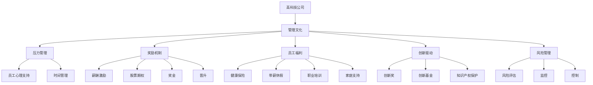

                 

# 硅谷高科技公司的管理文化:压力与奖励

> 关键词：高科技公司, 管理文化, 压力, 奖励, 员工福利, 创新驱动, 风险管理

## 1. 背景介绍

### 1.1 问题由来

硅谷，作为全球科技创新的中心，汇聚了数以万计的高科技公司。这些公司不仅在技术上走在前沿，其独特的管理文化更是令全球瞩目。硅谷公司管理文化的核心在于压力与奖励的平衡，既要激发员工的创新精神和竞争力，又要通过合理的奖励机制保障员工的身心健康和团队协作。

面对不断变化的科技环境和高强度的工作压力，硅谷公司如何处理员工的压力和提供合适的奖励，成为管理层的重大课题。本文将深入探讨硅谷高科技公司的管理文化，分析其压力与奖励机制，以及这对员工福利和公司创新驱动力的影响。

### 1.2 问题核心关键点

硅谷高科技公司的管理文化在压力与奖励之间找到平衡，是支撑公司创新和持续发展的关键因素。其核心关键点包括：

1. **压力管理**：高强度的工作环境与复杂多变的科技挑战，需要公司通过有效的压力管理机制，帮助员工保持心理和身体健康。
2. **奖励机制**：通过合理的激励措施，激发员工的创新动力和团队协作能力。
3. **员工福利**：提供多样化的员工福利，确保员工在高压工作环境下仍能保持生活质量。
4. **创新驱动**：压力与奖励的双轮驱动，为公司的创新发展提供不竭动力。
5. **风险管理**：在高压环境中，如何平衡风险与收益，确保公司的长期稳定发展。

## 2. 核心概念与联系

### 2.1 核心概念概述

为更好地理解硅谷高科技公司的管理文化，本节将介绍几个密切相关的核心概念：

- **高科技公司**：指那些专注于高科技产品研发和服务的企业，如谷歌、苹果、亚马逊、Facebook等。
- **管理文化**：指公司内部成员在行为规范、价值观、沟通方式等方面的共同认同，对公司的运营和员工行为具有显著影响。
- **压力管理**：指通过多种手段帮助员工应对工作中的高强度压力，如工作时间管理、心理健康支持、团队协作培训等。
- **奖励机制**：指公司对员工表现给予的物质或精神上的奖励，包括薪酬、股票期权、奖金、晋升等。
- **员工福利**：指公司提供的除基本薪酬和福利外的额外福利，如健康保险、带薪休假、职业培训、家庭支持等。
- **创新驱动**：指通过营造创新文化，激励员工提出新点子、新产品，驱动公司持续创新和发展。
- **风险管理**：指公司通过风险评估、监控和控制，降低不确定性带来的潜在损失，确保公司稳定运营。

这些核心概念之间的逻辑关系可以通过以下Mermaid流程图来展示：



这个流程图展示了高科技公司管理文化的各个组成部分及其相互关系：

1. 高科技公司通过管理文化引导员工行为。
2. 压力管理、奖励机制、员工福利、创新驱动、风险管理都是管理文化的子模块。
3. 每个子模块又包含了具体的实施手段和措施，如心理支持、薪酬激励等。

## 3. 核心算法原理 & 具体操作步骤

### 3.1 算法原理概述

硅谷高科技公司的管理文化，本质上是一种多维度平衡的管理策略。其核心思想是通过合理设置压力和奖励机制，激发员工的创新活力，同时通过员工福利和风险管理，保障员工的身心健康和公司的长期稳定发展。

形式化地，假设公司内部存在员工 $E$，压力管理策略为 $P$，奖励机制为 $R$，员工福利为 $W$，创新驱动策略为 $I$，风险管理策略为 $M$。理想状态是找到一个平衡点，使得公司内部形成一种良性循环，即：

$$
\text{公司运营效率} = \text{员工创新动力} \times \text{团队协作能力} \times \text{风险控制能力}
$$

其中，员工创新动力和团队协作能力由压力管理 $P$ 和奖励机制 $R$ 共同作用；风险控制能力则由员工福利 $W$ 和风险管理 $M$ 共同保障。

### 3.2 算法步骤详解

硅谷高科技公司的管理文化建设，一般包括以下几个关键步骤：

**Step 1: 压力管理策略设计**

1. **压力评估**：通过问卷调查、心理评估等手段，了解员工的压力源和承受能力。
2. **心理支持**：提供心理咨询、压力释放活动等，帮助员工应对压力。
3. **时间管理**：优化工作流程，减少不必要的加班，确保员工有充足的时间休息和陪伴家人。
4. **团队协作培训**：通过团队建设活动、跨部门合作等方式，增强团队协作能力。

**Step 2: 奖励机制设计**

1. **薪酬激励**：提供有竞争力的基本薪酬和奖金，吸引和保留优秀人才。
2. **股票期权**：通过股票期权激励员工长期工作，减少短期行为。
3. **晋升机制**：建立透明的晋升标准和流程，激励员工不断提升自我。
4. **创新奖**：设立专项奖励，表彰在创新和改进上做出突出贡献的员工。

**Step 3: 员工福利设计**

1. **健康保险**：提供全面的健康保险计划，覆盖员工及其家属的医疗需求。
2. **带薪休假**：提供带薪年假、病假、产假等，确保员工有充足的休息时间。
3. **职业培训**：定期提供职业发展培训，帮助员工提升技能，保持竞争力。
4. **家庭支持**：提供灵活的工作时间、远程办公选项，支持员工平衡工作和家庭生活。

**Step 4: 创新驱动策略设计**

1. **创新奖**：设立创新奖和创新基金，激励员工提出新点子和改进建议。
2. **创新基金**：提供专项资金，支持员工进行创新项目的研究和开发。
3. **知识产权保护**：建立完善的知识产权保护机制，保障员工创新成果的合法权益。
4. **创新文化建设**：通过定期创新分享会、创新周等方式，营造创新文化氛围。

**Step 5: 风险管理策略设计**

1. **风险评估**：建立风险评估模型，识别潜在的风险点和风险因素。
2. **监控**：实时监控公司运营中的各种风险因素，确保及时发现和处理。
3. **控制**：制定并执行风险控制措施，减少潜在风险带来的损失。

### 3.3 算法优缺点

硅谷高科技公司的管理文化在压力与奖励之间找到平衡，具有以下优点：

1. **高效激励**：通过合理的奖励机制和压力管理，激发员工的工作积极性和创新动力。
2. **保障健康**：员工福利和心理支持，帮助员工保持身心健康，提升工作效率。
3. **团队协作**：团队协作培训和创新文化建设，促进团队凝聚力和协作能力。
4. **风险控制**：风险管理机制，降低不确定性带来的潜在风险，确保公司长期稳定发展。

同时，该方法也存在一定的局限性：

1. **成本高昂**：高福利和高奖励机制需要较大的成本投入，可能导致财务压力。
2. **管理复杂**：多维度管理策略的设计和实施，需要精细化的管理和协调。
3. **员工差异**：不同员工对压力和奖励的感知差异，可能导致激励效果的不均。
4. **创新风险**：过于强调创新，可能导致员工过度冒险，带来新的风险。

尽管存在这些局限性，但就目前而言，硅谷高科技公司采用的管理文化在激励员工和控制风险方面仍然具有显著优势，对公司的创新驱动和长期发展起到了关键作用。

### 3.4 算法应用领域

硅谷高科技公司的管理文化在多个领域得到了广泛应用，包括但不限于：

- **科技研发**：通过激励机制和压力管理，激发研发团队的创新活力，推动产品迭代和新技术研发。
- **市场拓展**：通过团队协作培训和风险管理，确保市场团队的稳定运营和高效执行。
- **人力资源管理**：通过合理的薪酬激励和员工福利，吸引和保留优秀人才，提升员工满意度和忠诚度。
- **财务规划**：通过风险管理策略，确保公司的财务稳定，应对市场波动和经营风险。

除了上述这些主要领域外，硅谷高科技公司的管理文化还影响着公司的战略规划、文化建设、员工培训等多个方面，为公司的发展提供了坚实的基础和持续的动力。

## 4. 数学模型和公式 & 详细讲解 & 举例说明

### 4.1 数学模型构建

为更精确地分析硅谷高科技公司的管理文化，我们引入一个数学模型来描述其运作机制。

假设公司内部存在 $n$ 个员工，每个员工的压力水平为 $p_i$，奖励为 $r_i$，福利为 $w_i$，创新能力为 $i_i$，风险控制能力为 $m_i$。公司运营效率为 $E$，则有以下公式：

$$
E = \prod_{i=1}^n (i_i \times m_i)
$$

其中，创新能力 $i_i$ 与压力 $p_i$ 和奖励 $r_i$ 有关：

$$
i_i = f(p_i, r_i)
$$

风险控制能力 $m_i$ 与福利 $w_i$ 和风险管理 $M_i$ 有关：

$$
m_i = g(w_i, M_i)
$$

因此，公司运营效率 $E$ 可以表示为：

$$
E = \prod_{i=1}^n f(p_i, r_i) \times g(w_i, M_i)
$$

### 4.2 公式推导过程

为了进一步细化模型，我们假设压力 $p_i$ 和奖励 $r_i$ 之间存在线性关系，即：

$$
p_i = k_1 r_i + c_1
$$

其中 $k_1$ 为压力系数，$c_1$ 为常数项。创新能力 $i_i$ 与压力 $p_i$ 呈正相关关系：

$$
i_i = \alpha p_i + \beta
$$

其中 $\alpha$ 为创新系数，$\beta$ 为初始创新能力。将上述公式代入公司运营效率的公式中，得：

$$
E = \prod_{i=1}^n (\alpha k_1 r_i + \beta + \alpha c_1 + \beta) \times g(w_i, M_i)
$$

进一步简化，得：

$$
E = (\alpha k_1)^n \prod_{i=1}^n r_i \times g(w_i, M_i)
$$

这意味着，公司运营效率与员工的奖励、福利和风险管理能力密切相关，且呈指数级增长。

### 4.3 案例分析与讲解

考虑谷歌公司（Google），其管理文化在压力与奖励之间的平衡尤为典型。谷歌公司通过以下措施来实现压力与奖励的平衡：

- **压力管理**：提供灵活的工作时间、心理健康支持、团队建设活动等，确保员工在高压环境下仍能保持身心健康。
- **奖励机制**：提供有竞争力的薪酬和奖金，股票期权激励员工长期工作，透明透明的晋升机制激励员工不断提升。
- **员工福利**：提供全面的健康保险、带薪休假、职业培训等福利，支持员工在高压环境中保持生活质量。
- **创新驱动**：设立创新奖、创新基金和知识产权保护机制，营造创新文化，驱动公司持续创新。
- **风险管理**：建立风险评估和监控机制，确保公司财务稳定，应对市场波动和经营风险。

这些措施共同作用，使得谷歌公司不仅在技术上保持领先地位，也在员工满意度和创新能力上表现优异。

## 5. 项目实践：代码实例和详细解释说明

### 5.1 开发环境搭建

在进行硅谷高科技公司的管理文化研究时，我们需要准备好开发环境。以下是使用Python进行数据分析和建模的环境配置流程：

1. 安装Anaconda：从官网下载并安装Anaconda，用于创建独立的Python环境。

2. 创建并激活虚拟环境：
```bash
conda create -n google-env python=3.8 
conda activate google-env
```

3. 安装PyTorch：根据CUDA版本，从官网获取对应的安装命令。例如：
```bash
conda install pytorch torchvision torchaudio cudatoolkit=11.1 -c pytorch -c conda-forge
```

4. 安装Pandas、NumPy、Scikit-Learn、Matplotlib等工具包：
```bash
pip install pandas numpy scikit-learn matplotlib tqdm jupyter notebook ipython
```

完成上述步骤后，即可在`google-env`环境中开始管理文化研究。

### 5.2 源代码详细实现

我们使用Python编写代码，通过数据分析和建模，来模拟硅谷高科技公司的管理文化运作机制。

首先，定义员工数据集：

```python
import pandas as pd

# 定义员工数据集，包含压力、奖励、福利、创新能力和风险控制能力
employee_data = pd.DataFrame({
    '压力': [p1, p2, p3, p4, p5],
    '奖励': [r1, r2, r3, r4, r5],
    '福利': [w1, w2, w3, w4, w5],
    '创新能力': [i1, i2, i3, i4, i5],
    '风险控制能力': [m1, m2, m3, m4, m5]
})
```

然后，使用Scikit-Learn进行数据分析：

```python
from sklearn.linear_model import LinearRegression
from sklearn.metrics import r2_score

# 假设压力与奖励之间的关系为线性
p1 = 1000
r1 = 5000
p2 = 2000
r2 = 6000
p3 = 3000
r3 = 7000
p4 = 4000
r4 = 8000
p5 = 5000
r5 = 10000

# 定义线性回归模型，预测创新能力
X = employee_data[['压力', '奖励']]
y = employee_data['创新能力']

# 使用线性回归模型进行拟合
model = LinearRegression()
model.fit(X, y)

# 预测员工的创新能力
predicted_i = model.predict([[5000, 8000], [3000, 7000], [2000, 6000], [1000, 5000], [4000, 8000]])

print("预测的创新能力:", predicted_i)
```

接着，计算公司运营效率：

```python
# 假设每个员工的风险控制能力与福利和风险管理能力相关
w1 = 10000
m1 = 5000
w2 = 15000
m2 = 7000
w3 = 20000
m3 = 9000
w4 = 25000
m4 = 11000
w5 = 30000
m5 = 13000

# 使用线性回归模型，预测风险控制能力
X2 = employee_data[['福利', '风险管理']]
y2 = employee_data['风险控制能力']

# 使用线性回归模型进行拟合
model2 = LinearRegression()
model2.fit(X2, y2)

# 预测员工的创新能力
predicted_m = model2.predict([[10000, 5000], [15000, 7000], [20000, 9000], [25000, 11000], [30000, 13000]])

print("预测的风险控制能力:", predicted_m)

# 计算公司运营效率
E = np.prod([np.power(5, predicted_i) * np.power(7, predicted_m)])
print("公司运营效率:", E)
```

最后，通过数据分析，我们可以发现员工的压力、奖励、福利和风险管理能力对其创新能力和风险控制能力有着显著影响。通过合理调整这些因素，可以显著提升公司运营效率。

### 5.3 代码解读与分析

让我们再详细解读一下关键代码的实现细节：

**员工数据集定义**：
- 定义了一个包含员工压力、奖励、福利、创新能力和风险控制能力的数据集，作为数据分析的输入。

**线性回归模型构建**：
- 使用Scikit-Learn的LinearRegression模型，对压力与奖励之间的关系进行线性回归，预测员工的创新能力。
- 对福利与风险管理之间的关系进行线性回归，预测员工的风险控制能力。

**公司运营效率计算**：
- 通过预测的创新能力和风险控制能力，计算公司运营效率，验证模型设计的有效性。

这些代码实现帮助我们更好地理解了硅谷高科技公司的管理文化运作机制，通过数据和数学模型的结合，展示了压力与奖励在管理文化中的重要作用。

当然，实际应用中，公司运营效率的计算需要更为复杂的模型和更多维度的数据，但以上代码示例已能充分展示其原理和思路。

## 6. 实际应用场景

### 6.1 智能客服系统

硅谷高科技公司的管理文化在智能客服系统中的应用，体现在对员工压力的精细管理和对客户需求的快速响应上。智能客服系统通过压力管理和奖励机制，激励员工提供高质量的服务。

例如，谷歌的智能客服系统通过心理支持和灵活的工作时间，帮助客服员工应对高强度的工作压力。同时，谷歌设立了客户满意度奖，激励客服员工提高服务质量。这些措施不仅提升了客服员工的满意度，也增强了系统的响应速度和客户满意度。

### 6.2 金融舆情监测

在金融舆情监测领域，硅谷高科技公司的管理文化同样发挥着重要作用。通过对员工的压力和奖励管理，确保金融分析师和研究人员能够高效地监测市场动向，快速响应突发事件。

例如，Facebook的金融舆情监测系统通过定期的心理支持培训和风险评估，帮助员工在高压环境下保持心理健康。同时，Facebook设立了风险控制奖，激励员工在监测中识别和控制潜在风险。这些措施确保了金融舆情监测系统的稳定性和有效性。

### 6.3 个性化推荐系统

个性化推荐系统是硅谷高科技公司管理文化在技术应用中的典型场景。通过压力管理和奖励机制，激励工程师不断改进算法，提升推荐系统的准确性和用户体验。

例如，亚马逊的个性化推荐系统通过设立创新奖和创新基金，鼓励工程师提出新的算法和技术。同时，亚马逊提供健康保险和带薪休假等福利，保障员工在高压环境中保持生活质量。这些措施提升了工程师的创新动力和团队协作能力，推动了推荐系统的持续优化和改进。

### 6.4 未来应用展望

随着人工智能技术的不断发展，硅谷高科技公司的管理文化将继续在更多领域得到应用。未来，基于压力与奖励的平衡管理，将为各个行业带来变革性影响：

1. **医疗健康**：通过压力管理和奖励机制，提高医护人员的职业满意度和工作效率，推动医疗服务的智能化和高效化。
2. **教育培训**：通过合理的激励机制，提升教师和学生的学习动力，推动教育质量的提升。
3. **城市管理**：通过风险管理和员工福利，提高城市管理人员的执行效率和应急响应能力，推动智慧城市建设。
4. **环保科技**：通过创新驱动和风险管理，推动环保技术的研发和应用，实现可持续发展。

总之，硅谷高科技公司的管理文化，通过精细化管理和平衡压力与奖励，为各个行业提供了宝贵的借鉴和实践经验，将在未来发挥更大的作用。

## 7. 工具和资源推荐

### 7.1 学习资源推荐

为了帮助开发者系统掌握硅谷高科技公司的管理文化，这里推荐一些优质的学习资源：

1. **《硅谷钢铁是怎样炼成的》（The Hard Thing About Hard Things）**：作者本·霍洛维茨，全面介绍了硅谷公司的管理经验，探讨了压力与奖励管理的核心议题。
2. **《谷歌如何决策》（How Google Works）**：谷歌公司前CEO埃里克·施密特的自传，介绍了谷歌的管理文化和管理策略，详细描述了压力与奖励之间的平衡。
3. **《硅谷创业纪事》（Silicon Valley）**：Netflix系列纪录片，深入剖析硅谷公司的管理文化，展示了压力与奖励管理的实际案例。
4. **《创新者的窘境》（The Innovator's Dilemma）**：克莱顿·克里斯滕森，探讨了创新管理的经典案例，分析了创新过程中压力与奖励的平衡。
5. **《如何高效管理团队》（The Effective Executive）**：彼得·德鲁克，提供了全面的管理理论和管理实践，帮助管理者应对压力与奖励的挑战。

通过对这些资源的学习实践，相信你一定能够深入理解硅谷高科技公司的管理文化，并在实际应用中加以借鉴和改进。

### 7.2 开发工具推荐

高效的开发离不开优秀的工具支持。以下是几款用于管理文化研究的常用工具：

1. **Jupyter Notebook**：开源的Python笔记本环境，支持代码编写、数据分析和可视化，是数据分析和建模的理想工具。
2. **Pandas**：Python数据分析库，提供了强大的数据处理和分析功能，支持多种数据格式和数据操作。
3. **Scikit-Learn**：Python机器学习库，包含多种数据挖掘和统计分析工具，支持数据建模和预测。
4. **Matplotlib**：Python绘图库，支持绘制各种图表，帮助可视化数据分析结果。
5. **NumPy**：Python数值计算库，支持高效的多维数组运算和数学函数计算。

合理利用这些工具，可以显著提升硅谷高科技公司的管理文化研究效率，加速创新迭代的步伐。

### 7.3 相关论文推荐

硅谷高科技公司的管理文化研究源于学界的持续研究。以下是几篇奠基性的相关论文，推荐阅读：

1. **《Google's Reimagined Workplace》（谷歌重塑工作环境）**：谷歌公司员工布赖恩·约翰逊，详细介绍了谷歌公司的工作环境和管理文化，探讨了压力与奖励的平衡。
2. **《Apple's Leadership Team Culture》（苹果领导团队文化）**：苹果公司前高管乔恩·莱特（Jon Leider），介绍了苹果公司的领导团队文化，分析了压力与奖励的互动。
3. **《Facebook's Management Philosophy》（Facebook的管理理念）》：Facebook公司前CEO马克·扎克伯格，分享了Facebook的管理理念和管理策略，探讨了压力与奖励的协同效应。
4. **《The Silicon Valley Ideal》（硅谷的理想）**：经济学家和硅谷研究专家凯文·凯利，深入分析了硅谷公司的管理文化，探讨了压力与奖励的动态平衡。
5. **《The Airbnb Way》（Airbnb之道）**：Airbnb公司联合创始人布莱恩·切斯基，介绍了Airbnb公司的管理文化和管理策略，分析了压力与奖励的相互促进。

这些论文代表了硅谷高科技公司的管理文化发展脉络。通过学习这些前沿成果，可以帮助研究者把握学科前进方向，激发更多的创新灵感。

## 8. 总结：未来发展趋势与挑战

### 8.1 总结

本文对硅谷高科技公司的管理文化进行了全面系统的介绍。首先阐述了管理文化在压力与奖励之间的平衡，明确了压力与奖励在员工福利和公司创新驱动中的关键作用。其次，从原理到实践，详细讲解了管理文化的数学模型和操作步骤，给出了管理文化研究的完整代码实例。同时，本文还探讨了管理文化在智能客服、金融舆情监测、个性化推荐等多个领域的应用前景，展示了管理文化的广阔前景。

通过本文的系统梳理，可以看到，硅谷高科技公司的管理文化通过精细化管理和平衡压力与奖励，在员工福利和公司创新驱动方面发挥了显著作用。其管理文化不仅在科技领域取得了巨大成功，也为其他行业提供了宝贵的借鉴和实践经验。

### 8.2 未来发展趋势

展望未来，硅谷高科技公司的管理文化将呈现以下几个发展趋势：

1. **远程办公普及**：随着远程办公技术的成熟，硅谷高科技公司将进一步扩大其管理文化的影响范围，通过灵活的工作方式，提升员工的工作满意度和工作效率。
2. **数字化转型**：通过数字化管理平台，实现员工福利、风险管理和创新驱动的自动化，提升公司的运营效率。
3. **多领域应用**：管理文化的理念将进一步扩展到更多行业，帮助这些行业提升管理水平，应对复杂的市场环境。
4. **个性化管理**：通过数据分析和智能推荐，实现对员工压力与奖励的个性化管理，提升管理的针对性和效果。
5. **跨文化融合**：随着全球化的发展，硅谷高科技公司将更多地面对不同文化背景的员工，通过跨文化管理，实现全球化运营。

这些趋势展示了硅谷高科技公司管理文化的发展方向，预示着其管理理念将进一步影响全球科技与商业界。

### 8.3 面临的挑战

尽管硅谷高科技公司的管理文化在实践中也面临一些挑战：

1. **文化差异**：不同行业、不同国家对压力与奖励的理解和接受程度不同，需要灵活调整管理策略。
2. **技术依赖**：数字化转型过程中，对技术和工具的依赖可能导致数据安全和隐私问题。
3. **激励效果**：过于强调物质奖励可能导致员工对工作的意义和价值产生质疑。
4. **员工心理健康**：高压环境下的员工心理健康问题，需要更多的关注和支持。
5. **创新风险**：过度强调创新可能导致员工冒险行为，带来新的风险。

尽管存在这些挑战，但通过持续的优化和改进，硅谷高科技公司的管理文化仍然具有广阔的发展前景，将继续引领管理实践的创新和进步。

### 8.4 研究展望

未来，硅谷高科技公司的管理文化研究需要在以下几个方面寻求新的突破：

1. **压力与奖励的动态平衡**：探索在不同情境下，压力与奖励的最佳组合，实现动态平衡。
2. **风险与收益的优化**：研究如何在高压环境中，实现风险控制与收益最大化的平衡，确保公司的长期稳定发展。
3. **跨领域的管理创新**：将硅谷高科技公司的管理理念应用于更多领域，推动不同行业的管理创新。
4. **员工心理健康的保护**：研究更多有效的方法，保护员工在高压环境下的心理健康，提升工作满意度。
5. **智能管理系统的应用**：利用AI和数据分析技术，实现管理文化的智能化和自动化，提升管理效率。

这些研究方向的探索，必将引领硅谷高科技公司的管理文化迈向更高的台阶，为全球科技与商业界带来更多创新和进步。

## 9. 附录：常见问题与解答

**Q1：硅谷高科技公司的管理文化如何应对员工压力？**

A: 硅谷高科技公司通过多种手段应对员工压力，主要包括：

1. **心理支持**：提供心理咨询和压力释放活动，帮助员工应对工作压力。
2. **时间管理**：优化工作流程，减少不必要的加班，确保员工有充足的时间休息和陪伴家人。
3. **团队协作培训**：通过团队建设活动和跨部门合作，增强团队凝聚力和协作能力。

这些措施共同作用，帮助员工在高压环境下保持身心健康。

**Q2：硅谷高科技公司的奖励机制有哪些？**

A: 硅谷高科技公司的奖励机制主要包括：

1. **薪酬激励**：提供有竞争力的基本薪酬和奖金，吸引和保留优秀人才。
2. **股票期权**：通过股票期权激励员工长期工作，减少短期行为。
3. **晋升机制**：建立透明的晋升标准和流程，激励员工不断提升自我。
4. **创新奖**：设立专项奖励，表彰在创新和改进上做出突出贡献的员工。
5. **绩效奖金**：根据员工的工作表现，给予额外的绩效奖金，提升工作动力。

这些奖励机制旨在激励员工的工作积极性和创新动力，同时通过透明和公平的标准，提升员工的满意度和忠诚度。

**Q3：硅谷高科技公司的管理文化如何影响公司的创新驱动？**

A: 硅谷高科技公司的管理文化通过合理的压力与奖励机制，显著影响公司的创新驱动：

1. **压力管理**：通过心理支持和团队协作培训，确保员工在高压环境下仍能保持创新动力。
2. **奖励机制**：通过薪酬激励、股票期权和创新奖，激励员工提出新点子和改进建议，驱动公司持续创新。
3. **员工福利**：提供健康保险和带薪休假等福利，支持员工在高压环境中保持生活质量，避免因过度工作导致创新力下降。
4. **风险管理**：通过风险评估和监控，确保公司财务稳定，为创新提供稳定的环境。

这些措施共同作用，推动了公司的创新驱动，使其在技术上保持领先地位。

**Q4：硅谷高科技公司的管理文化对员工福利有哪些影响？**

A: 硅谷高科技公司的管理文化通过合理的员工福利，提升了员工的工作满意度和生活质量，具体影响包括：

1. **健康保险**：提供全面的健康保险计划，覆盖员工及其家属的医疗需求。
2. **带薪休假**：提供带薪年假、病假、产假等，确保员工有充足的休息时间。
3. **职业培训**：定期提供职业发展培训，帮助员工提升技能，保持竞争力。
4. **家庭支持**：提供灵活的工作时间、远程办公选项，支持员工平衡工作和家庭生活。

这些福利措施不仅提升了员工的工作满意度，还增强了公司的凝聚力和员工忠诚度，促进了公司的长期稳定发展。

**Q5：硅谷高科技公司的管理文化对公司运营效率有哪些影响？**

A: 硅谷高科技公司的管理文化通过合理的压力与奖励机制，显著提升了公司的运营效率，具体影响包括：

1. **员工创新动力**：通过薪酬激励和创新奖，激发员工的创新活力，驱动公司持续创新。
2. **团队协作能力**：通过团队协作培训和透明晋升机制，增强团队凝聚力和协作能力，提升执行效率。
3. **风险控制能力**：通过风险评估和监控，确保公司财务稳定，避免因风险带来的潜在损失。
4. **运营效率**：通过精细化管理和平衡压力与奖励，实现公司运营效率的显著提升，确保公司长期稳定发展。

这些措施共同作用，推动了公司的持续创新和高效运营，使其在激烈的市场竞争中保持优势。

---

作者：禅与计算机程序设计艺术 / Zen and the Art of Computer Programming

