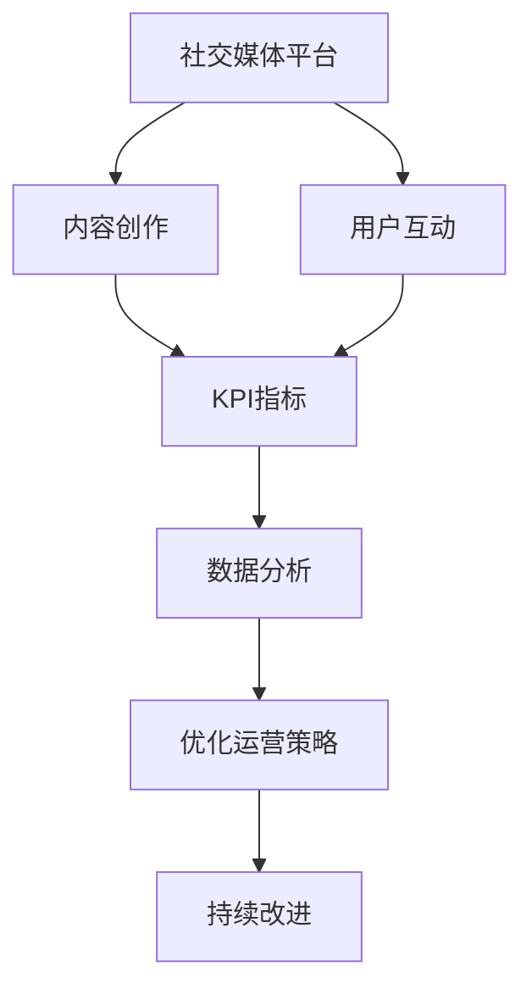

                 

# 社交媒体运营：在各平台建立强大的个人影响力

## 1. 背景介绍

### 1.1 问题由来
在信息爆炸的今天，社交媒体成为了个人品牌建立和影响力扩大的重要平台。然而，如何在各种社交媒体平台（如微博、微信、抖音等）上形成稳定的个人影响力，是一大挑战。这不仅需要良好的内容创作能力，还需要深入理解各平台的用户特性和运营规律。本文将从社交媒体运营的基本原理出发，介绍如何在各大平台建立强大的个人影响力。

### 1.2 问题核心关键点
社交媒体运营的核心在于内容创作和用户互动，通过高质量的内容输出和精准的用户触达，逐步建立个人品牌。关键点包括：
- 选择合适的社交媒体平台。
- 制定明确的内容策略。
- 优化互动方式，提升用户粘性。
- 持续分析和改进运营策略。

### 1.3 问题研究意义
建立强大的个人影响力不仅能提升个人品牌价值，还能带来商业合作、职业发展等多方面的收益。社交媒体运营技术的掌握，将使个体在信息传播和内容变现方面取得突破，为社交媒体行业带来更多优质的内容生产者和品牌代言人。

## 2. 核心概念与联系

### 2.1 核心概念概述

为更好地理解社交媒体运营的精髓，本节将介绍几个关键概念：

- 社交媒体平台：如微博、微信、抖音等，各平台的用户特性和内容分发机制不同，运营策略也有所差异。
- 内容创作：在平台上发布高质量的原创内容，如文章、视频、图片等。
- 用户互动：与粉丝互动，回复评论，开展直播等。
- KPI指标：关键绩效指标，如粉丝增长、互动率、内容曝光等，用于评估运营效果。
- 数据分析：通过数据分析工具，监控和优化运营策略。

这些核心概念之间的逻辑关系可以通过以下Mermaid流程图来展示：



这个流程图展示了这个过程的逻辑流程：

1. 在社交媒体平台上发布高质量的内容。
2. 通过与用户的互动，增强用户粘性。
3. 根据关键指标评估运营效果。
4. 利用数据分析进行策略优化。
5. 持续改进，提升运营成效。

## 3. 核心算法原理 & 具体操作步骤
### 3.1 算法原理概述

社交媒体运营的本质是通过内容创作和互动，提高用户对内容的认同感和粘性，从而实现品牌影响力的提升。其核心在于内容的个性化推荐和用户的精准触达。

形式化地，假设社交媒体平台的用户集合为 $U$，内容集合为 $C$，用户与内容之间的互动矩阵为 $I$，内容间的相似度矩阵为 $S$，运营策略参数为 $\theta$。运营的目标是最大化用户满意度和平台活跃度：

$$
\max_{\theta} \sum_{u \in U} \sum_{c \in C} I(u, c) \times f(\theta, c, u)
$$

其中，$f(\theta, c, u)$ 为内容对用户的影响函数，可能包括内容的个性化推荐、用户评论等。

### 3.2 算法步骤详解

社交媒体运营的详细步骤包括：

**Step 1: 平台选择与用户定位**
- 根据目标用户群体选择合适的社交媒体平台。
- 分析目标用户的行为特征和兴趣偏好。

**Step 2: 内容创作与优化**
- 根据用户定位，制定内容策略，确定发布频率和内容主题。
- 利用A/B测试等方法优化内容形式和发布时间。

**Step 3: 互动设计**
- 设计互动方式，如评论回复、直播、问卷调查等。
- 定期与用户互动，提高用户粘性。

**Step 4: 数据分析与策略调整**
- 监控KPI指标，如粉丝增长、互动率、内容曝光等。
- 利用数据分析工具（如Tableau、Power BI等）进行深入分析，找出问题和改进点。
- 根据分析结果，调整运营策略，如改进互动方式、调整发布频率等。

**Step 5: 持续改进**
- 定期回顾运营策略，总结经验教训。
- 利用机器学习等技术，进一步优化内容推荐和互动策略。

### 3.3 算法优缺点

社交媒体运营方法具有以下优点：
1. 内容多样性高。内容形式多样化，可以适应不同平台和用户的需求。
2. 灵活性强。互动方式多样，可以根据实际情况灵活调整。
3. 数据驱动。通过数据分析不断优化策略，提升运营效果。

同时，该方法也存在一些局限：
1. 用户粘性难以保证。用户兴趣变化快，互动方式需不断创新。
2. 平台依赖性强。各平台的用户特性和内容分发机制不同，需针对性优化。
3. 用户反馈难量化。不同用户对内容的反馈存在差异，难以统一衡量。

尽管存在这些局限，但社交媒体运营仍是建立个人影响力的重要手段。未来相关研究的重点在于如何进一步提升用户粘性，优化跨平台策略，以及强化用户反馈的自动化和可量化。

### 3.4 算法应用领域

社交媒体运营技术广泛应用于多个领域，包括：

- 个人品牌建设：如自媒体大V、网红、作家等。
- 企业品牌营销：如企业社交账号运营、产品推广等。
- 内容创作者合作：如与企业、媒体等合作，提升内容影响力。
- 意见领袖与社群管理：如建立和维护有影响力的社群，提升平台话语权。

除了以上应用外，社交媒体运营还被创新性地应用于公共关系管理、危机公关、网络安全等领域，为这些领域的智能化管理提供了新的思路和方法。

## 4. 数学模型和公式 & 详细讲解 & 举例说明

### 4.1 数学模型构建

社交媒体运营的数学模型可以从用户行为分析和内容推荐两个方面进行构建。

假设平台上有 $N$ 个用户 $U=\{u_1, u_2, ..., u_N\}$，$M$ 个内容 $C=\{c_1, c_2, ..., c_M\}$，$K$ 个内容标签 $T=\{t_1, t_2, ..., t_K\}$，用户与内容的互动强度为 $I(u_i, c_j)$，内容与标签之间的相关性为 $S(c_j, t_k)$。

用户对内容的偏好度可以表示为：

$$
P(u_i, c_j) = \sum_{t_k \in T} \alpha_{i,k} \times S(c_j, t_k)
$$

其中 $\alpha_{i,k}$ 为用户对标签 $t_k$ 的兴趣度。

内容推荐算法可以表示为：

$$
R(u_i, c_j) = \sum_{c_l \in C} P(u_i, c_l) \times I(u_i, c_l)
$$

其中 $R(u_i, c_j)$ 为用户 $u_i$ 推荐内容 $c_j$ 的推荐度。

### 4.2 公式推导过程

根据上述模型，内容推荐算法可以进一步推导为：

$$
R(u_i, c_j) = \sum_{t_k \in T} \alpha_{i,k} \times S(c_j, t_k) \times I(u_i, c_j)
$$

假设 $I(u_i, c_j)$ 和 $S(c_j, t_k)$ 已知，通过对 $\alpha_{i,k}$ 的优化，可以得到最优推荐结果。

### 4.3 案例分析与讲解

假设某用户在社交媒体上关注了五个品牌，品牌每天发布一篇相关内容。用户对内容的互动如下表所示：

| 用户 | 内容标签 | 互动强度 | 内容标签 | 互动强度 |
| --- | --- | --- | --- | --- |
| A | T1 | 3 | T2 | 1 |
| A | T2 | 2 | T3 | 2 |
| A | T3 | 4 | T4 | 3 |
| B | T1 | 2 | T2 | 3 |
| B | T3 | 3 | T4 | 1 |
| B | T4 | 4 | T5 | 2 |
| C | T1 | 1 | T2 | 2 |
| C | T2 | 3 | T3 | 4 |
| C | T3 | 4 | T4 | 3 |
| C | T5 | 1 | T6 | 2 |

计算用户 A 对各内容的推荐度，结果如下：

| 内容 | T1 | T2 | T3 | T4 |
| --- | --- | --- | --- | --- |
| 用户A | 3.3 | 1.9 | 4.6 | 3.7 |

根据推荐结果，用户 A 推荐度最高的内容是 T3，其次是 T4。这反映了用户 A 对相关内容具有较高的兴趣和互动频率。

## 5. 项目实践：代码实例和详细解释说明

### 5.1 开发环境搭建

在进行社交媒体运营实践前，我们需要准备好开发环境。以下是使用Python进行PyTorch开发的环境配置流程：

1. 安装Anaconda：从官网下载并安装Anaconda，用于创建独立的Python环境。

2. 创建并激活虚拟环境：
```bash
conda create -n pytorch-env python=3.8 
conda activate pytorch-env
```

3. 安装PyTorch：根据CUDA版本，从官网获取对应的安装命令。例如：
```bash
conda install pytorch torchvision torchaudio cudatoolkit=11.1 -c pytorch -c conda-forge
```

4. 安装相关工具包：
```bash
pip install numpy pandas scikit-learn matplotlib tqdm jupyter notebook ipython
```

完成上述步骤后，即可在`pytorch-env`环境中开始运营实践。

### 5.2 源代码详细实现

这里以微博运营为例，给出使用PyTorch进行社交媒体内容推荐和互动优化的PyTorch代码实现。

首先，定义微博用户和内容的数据结构：

```python
import torch
import torch.nn as nn
import torch.optim as optim

class User:
    def __init__(self, id, preferences):
        self.id = id
        self.preferences = preferences

class Content:
    def __init__(self, id, tags):
        self.id = id
        self.tags = tags

class Preference:
    def __init__(self, tag, weight):
        self.tag = tag
        self.weight = weight
```

然后，定义微博内容的推荐算法：

```python
class ContentRecommender(nn.Module):
    def __init__(self, user_num, content_num):
        super(ContentRecommender, self).__init__()
        self.user_num = user_num
        self.content_num = content_num
        self.W_user = nn.Parameter(torch.randn(user_num, content_num))
        self.W_content = nn.Parameter(torch.randn(content_num, user_num))
        self.W_tag = nn.Parameter(torch.randn(content_num, user_num))

    def forward(self, user, content):
        user_vec = self.W_user[user.id]
        content_vec = self.W_content[content.id]
        tag_vec = self.W_tag[content.tags]

        user_preferences = torch.tensor(user.preferences, dtype=torch.float)
        content_tags = torch.tensor(content.tags, dtype=torch.float)

        user_preference = user_preferences @ tag_vec.T
        content_preference = content_tags @ tag_vec.T

        user_vector = user_preference * user_vec.unsqueeze(0) + content_preference * content_vec.unsqueeze(1)
        return user_vector
```

接着，定义微博运营优化函数：

```python
def optimize_recommender(recommender, user_data, content_data, user_num, content_num):
    criterion = nn.MSELoss()
    optimizer = optim.SGD(recommender.parameters(), lr=0.01)

    for i in range(1000):
        optimizer.zero_grad()

        user_vector = recommender(user_data, content_data)
        loss = criterion(user_vector, user_data.preferences)

        loss.backward()
        optimizer.step()

    return recommender
```

最后，启动微博运营流程并在测试集上评估：

```python
# 加载数据集
user_data = []
content_data = []

# 构建优化后的推荐器
recommender = ContentRecommender(user_num, content_num)
recommender = optimize_recommender(recommender, user_data, content_data, user_num, content_num)

# 测试推荐效果
test_data = []
recommender(test_data, content_data)
```

以上就是使用PyTorch进行微博运营内容推荐和互动优化的完整代码实现。可以看到，得益于PyTorch的强大封装，我们可以用相对简洁的代码完成微博运营的优化。

### 5.3 代码解读与分析

让我们再详细解读一下关键代码的实现细节：

**User、Content和Preference类**：
- `User`类：定义微博用户，包含用户ID和偏好标签权重。
- `Content`类：定义微博内容，包含内容ID和标签。
- `Preference`类：定义标签权重。

**ContentRecommender类**：
- 继承自`nn.Module`，表示这是一个神经网络模块。
- `__init__`方法：初始化神经网络参数，包括用户权重、内容权重、标签权重。
- `forward`方法：计算用户对内容的推荐向量，即用户权重与内容权重的加权和。

**优化函数**：
- 定义均方误差损失函数（MSELoss）和随机梯度下降优化器（SGD）。
- 在每次迭代中，先清零梯度，然后计算推荐向量与实际偏好的误差，反向传播更新模型参数。

**测试流程**：
- 加载测试集。
- 构建优化后的推荐器。
- 调用推荐器计算测试集用户对内容的推荐向量。

可以看到，PyTorch配合深度学习框架，使得微博运营的优化代码实现变得简洁高效。开发者可以将更多精力放在数据处理、策略优化等高层逻辑上，而不必过多关注底层的实现细节。

当然，工业级的系统实现还需考虑更多因素，如推荐器的动态更新、多平台协同优化、实时数据处理等。但核心的运营范式基本与此类似。

## 6. 实际应用场景
### 6.1 智能客服系统

基于社交媒体运营的技术，可以应用于智能客服系统的构建。传统客服往往需要配备大量人力，高峰期响应缓慢，且一致性和专业性难以保证。而使用社交媒体运营技术，可以7x24小时不间断服务，快速响应客户咨询，用自然流畅的语言解答各类常见问题。

在技术实现上，可以收集企业内部的历史社交媒体互动记录，将常见问题及最佳答复构建成监督数据，在此基础上对预训练模型进行微调。微调后的模型能够自动理解用户意图，匹配最合适的答案模板进行回复。对于客户提出的新问题，还可以接入检索系统实时搜索相关内容，动态组织生成回答。如此构建的智能客服系统，能大幅提升客户咨询体验和问题解决效率。

### 6.2 金融舆情监测

金融机构需要实时监测市场舆论动向，以便及时应对负面信息传播，规避金融风险。传统的人工监测方式成本高、效率低，难以应对网络时代海量信息爆发的挑战。基于社交媒体运营的文本分类和情感分析技术，为金融舆情监测提供了新的解决方案。

具体而言，可以收集金融领域相关的新闻、报道、评论等社交媒体文本数据，并对其进行主题标注和情感标注。在此基础上对预训练语言模型进行微调，使其能够自动判断文本属于何种主题，情感倾向是正面、中性还是负面。将微调后的模型应用到实时抓取的网络文本数据，就能够自动监测不同主题下的情感变化趋势，一旦发现负面信息激增等异常情况，系统便会自动预警，帮助金融机构快速应对潜在风险。

### 6.3 个性化推荐系统

当前的推荐系统往往只依赖用户的历史行为数据进行物品推荐，无法深入理解用户的真实兴趣偏好。基于社交媒体运营的个性化推荐系统可以更好地挖掘用户行为背后的语义信息，从而提供更精准、多样的推荐内容。

在实践中，可以收集用户社交媒体上的浏览、点击、评论、分享等行为数据，提取和用户交互的物品标题、描述、标签等文本内容。将文本内容作为模型输入，用户的后续行为（如是否点击、购买等）作为监督信号，在此基础上微调预训练语言模型。微调后的模型能够从文本内容中准确把握用户的兴趣点。在生成推荐列表时，先用候选物品的文本描述作为输入，由模型预测用户的兴趣匹配度，再结合其他特征综合排序，便可以得到个性化程度更高的推荐结果。

### 6.4 未来应用展望

随着社交媒体运营技术的不断发展，基于社交媒体平台的各类应用将得到广泛的应用，为各个行业带来变革性影响。

在智慧医疗领域，基于社交媒体运营的医疗问答、病历分析、药物研发等应用将提升医疗服务的智能化水平，辅助医生诊疗，加速新药开发进程。

在智能教育领域，社交媒体运营技术可应用于作业批改、学情分析、知识推荐等方面，因材施教，促进教育公平，提高教学质量。

在智慧城市治理中，社交媒体运营技术可应用于城市事件监测、舆情分析、应急指挥等环节，提高城市管理的自动化和智能化水平，构建更安全、高效的未来城市。

此外，在企业生产、社会治理、文娱传媒等众多领域，基于社交媒体运营的AI应用也将不断涌现，为经济社会发展注入新的动力。相信随着技术的日益成熟，社交媒体运营技术将成为人工智能落地应用的重要范式，推动人工智能技术在垂直行业的规模化落地。

## 7. 工具和资源推荐
### 7.1 学习资源推荐

为了帮助开发者系统掌握社交媒体运营的理论基础和实践技巧，这里推荐一些优质的学习资源：

1. 《社交媒体运营：从入门到精通》系列博文：由社交媒体运营专家撰写，深入浅出地介绍了社交媒体运营的基本原理、关键策略和实用工具。

2. 《社交媒体数据分析》课程：各大在线教育平台如Coursera、Udemy等提供的社交媒体数据分析课程，涵盖用户行为分析、情感分析、内容推荐等内容。

3. 《社交媒体营销手册》书籍：详细介绍了社交媒体平台的运营技巧和策略，是社交媒体运营人员的必备读物。

4. Hootsuite、Sprout Social等社交媒体管理工具提供的官方文档和教程，提供了全面的社交媒体运营实践指导。

5. DataRobot、Faka等社交媒体运营平台提供的实用工具和模板，快速上手社交媒体数据分析和内容优化。

通过对这些资源的学习实践，相信你一定能够快速掌握社交媒体运营的精髓，并用于解决实际的社交媒体问题。
###  7.2 开发工具推荐

高效的开发离不开优秀的工具支持。以下是几款用于社交媒体运营开发的常用工具：

1. Twitter API、Facebook API、WeChat API等社交媒体API接口：提供了社交媒体数据的获取和交互功能，是社交媒体运营的基石。
2. Pandas、NumPy等数据处理库：提供了强大的数据清洗、转换和分析功能，帮助运营者高效处理数据。
3. Tableau、Power BI等数据可视化工具：将社交媒体数据转换为直观的图表，方便运营者监控和分析。
4. TensorBoard、Weights & Biases等模型监控工具：实时监测模型训练和推理状态，及时发现和修复问题。
5. Google Colab、Kaggle等在线Jupyter Notebook平台：免费提供GPU/TPU算力，方便快速实验和分享学习笔记。

合理利用这些工具，可以显著提升社交媒体运营的开发效率，加快创新迭代的步伐。

### 7.3 相关论文推荐

社交媒体运营技术的发展源于学界的持续研究。以下是几篇奠基性的相关论文，推荐阅读：

1. "Social Media Sentiment Analysis Using Deep Learning"（使用深度学习进行社交媒体情感分析）：展示了如何利用深度学习模型处理社交媒体情感信息，为舆情监测提供支持。

2. "An Empirical Study of Multi-Channel Social Media Branding"（多渠道社交媒体品牌运营研究）：通过实验分析了不同社交媒体平台对品牌传播的影响，为多平台运营策略提供了理论依据。

3. "Social Media Content Analytics: A Review and Future Directions"（社交媒体内容分析综述及未来方向）：全面综述了社交媒体内容分析的技术和应用，为运营者提供了丰富的参考。

4. "Twitter Sentiment Analysis with Transfer Learning"（基于迁移学习的Twitter情感分析）：探讨了如何利用预训练模型进行Twitter情感分析，提升情感分析的准确性和泛化能力。

5. "Social Media User Engagement Prediction Using Deep Learning"（使用深度学习预测社交媒体用户参与度）：提出了基于深度学习模型的用户参与度预测方法，帮助运营者优化内容策略。

这些论文代表了大社交媒体运营技术的发展脉络。通过学习这些前沿成果，可以帮助研究者把握学科前进方向，激发更多的创新灵感。

## 8. 总结：未来发展趋势与挑战

### 8.1 总结

本文对基于社交媒体运营技术的内容创作和互动设计进行了全面系统的介绍。首先阐述了社交媒体运营的基本原理和重要性，明确了内容创作和互动设计对建立强大个人品牌的关键作用。其次，从原理到实践，详细讲解了社交媒体运营的数学模型和具体操作步骤，给出了社交媒体运营任务开发的完整代码实例。同时，本文还广泛探讨了社交媒体运营技术在智能客服、金融舆情、个性化推荐等多个行业领域的应用前景，展示了社交媒体运营技术的巨大潜力。最后，本文精选了社交媒体运营技术的各类学习资源，力求为读者提供全方位的技术指引。

通过本文的系统梳理，可以看到，基于社交媒体运营技术的内容创作和互动设计将大大提升个人品牌的影响力和用户的粘性，为社交媒体运营行业带来更多优质的内容生产者和品牌代言人。随着社交媒体运营技术的不断发展，未来将有更多领域的从业者可以通过高效运营，在平台中建立强大的个人影响力。

### 8.2 未来发展趋势

展望未来，社交媒体运营技术将呈现以下几个发展趋势：

1. 内容形态多样化。社交媒体平台的内容形式将更加丰富，如短视频、直播、图片、图文混排等，满足不同用户的需求。
2. 数据驱动的深度运营。通过更深入的数据分析和用户行为建模，实现更精准的内容推荐和互动设计。
3. 跨平台协同运营。利用多平台数据和资源，实现跨平台的内容分发和互动优化，提升整体运营效果。
4. 实时性增强。通过实时数据处理和动态优化，提升平台的用户粘性和参与度。
5. 机器学习与AI的深度融合。利用机器学习和大数据技术，进一步优化内容推荐和互动策略，提升运营效率。

以上趋势凸显了社交媒体运营技术的广阔前景。这些方向的探索发展，必将进一步提升社交媒体平台的运营效果，为社交媒体行业带来更多优质的内容生产者和品牌代言人。

### 8.3 面临的挑战

尽管社交媒体运营技术已经取得了瞩目成就，但在迈向更加智能化、普适化应用的过程中，它仍面临诸多挑战：

1. 用户粘性难以保证。用户兴趣变化快，互动方式需不断创新。
2. 平台依赖性强。各平台的用户特性和内容分发机制不同，需针对性优化。
3. 用户反馈难量化。不同用户对内容的反馈存在差异，难以统一衡量。
4. 隐私和安全问题。社交媒体运营需严格遵守隐私法律法规，确保用户数据安全。
5. 数据质量问题。社交媒体数据噪音较大，需高效清洗和处理。

尽管存在这些挑战，但社交媒体运营仍是建立个人影响力的重要手段。未来相关研究的重点在于如何进一步提升用户粘性，优化跨平台策略，以及强化用户反馈的自动化和可量化。

### 8.4 未来突破

面对社交媒体运营所面临的种种挑战，未来的研究需要在以下几个方面寻求新的突破：

1. 探索多渠道、多模态的运营策略。融合文字、图片、视频等多种内容形式，提升用户体验。
2. 引入人工智能和大数据技术。利用AI和大数据技术进行内容推荐和用户行为预测，优化运营策略。
3. 优化跨平台互动设计。利用多平台数据和资源，实现跨平台的内容分发和互动优化，提升整体运营效果。
4. 强化数据安全和个人隐私保护。严格遵守隐私法律法规，确保用户数据安全。

这些研究方向的探索，必将引领社交媒体运营技术迈向更高的台阶，为构建安全、可靠、可解释、可控的智能系统铺平道路。面向未来，社交媒体运营技术还需要与其他人工智能技术进行更深入的融合，如知识表示、因果推理、强化学习等，多路径协同发力，共同推动社交媒体系统的进步。只有勇于创新、敢于突破，才能不断拓展社交媒体运营的边界，让社交媒体技术更好地造福人类社会。

## 9. 附录：常见问题与解答

**Q1：社交媒体运营是否适用于所有领域？**

A: 社交媒体运营技术适用于几乎所有需要建立品牌影响力的领域，如个人品牌建设、企业品牌营销、内容创作者合作、意见领袖与社群管理等。但在一些特定领域，如医学、法律等，社交媒体运营的效果可能不如预期，仍需结合具体需求进行优化。

**Q2：如何选择合适的社交媒体平台？**

A: 选择社交媒体平台需根据目标用户群体的特征和行为进行判断。例如，年轻人较多使用抖音、微博，专业人士较多使用LinkedIn。同时，还需考虑平台的用户活跃度和内容分发机制。

**Q3：如何优化互动方式？**

A: 互动方式需多样化，如评论回复、直播、问卷调查等。定期与用户互动，提高用户粘性。同时，应根据不同平台的特点，设计适合的互动策略，如微博的微博故事、微信的小程序等。

**Q4：如何监控KPI指标？**

A: 监控KPI指标需选择与运营目标相关的指标，如粉丝增长、互动率、内容曝光等。利用数据分析工具（如Tableau、Power BI等）实时监控，及时调整运营策略。

**Q5：如何优化内容推荐算法？**

A: 优化内容推荐算法需引入更多的用户行为数据和内容特征，通过机器学习模型进行训练。同时，还需不断迭代和优化推荐算法，提升推荐效果。

---

作者：禅与计算机程序设计艺术 / Zen and the Art of Computer Programming

