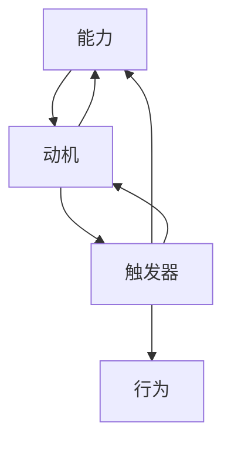

                 

## 1. 背景介绍

### 1.1 问题由来
在当今高度竞争的商业环境中，团队建设与管理成为企业成功的关键。如何激励员工、提高团队协作、增强团队凝聚力，是企业面临的重要挑战。而福格行为模型（Fogg's Behavior Model），作为行为设计的经典理论框架，为团队建设提供了新的视角和工具。该模型由行为科学家B.J. Fogg提出，通过理解行为背后的触发因素，帮助设计出能够激发人们行为的策略。

### 1.2 问题核心关键点
福格行为模型认为，任何行为都由三个关键因素组成：能力、动机、触发器。能力是指执行行为所需的技能或资源；动机是指执行行为的内在或外在驱动力；触发器是指促使行为发生的触发点或信号。在团队建设中，通过设计合适的触发器和激励机制，可以显著提升团队成员的积极性和协作性。

### 1.3 问题研究意义
应用福格行为模型于团队建设，可以帮助企业更科学地理解员工行为，设计出更有效的激励和协作策略。提升团队的执行力和凝聚力，从而实现更高的工作效能和创新成果。同时，该模型还能帮助团队成员自我管理，提高工作效率和个人满意度。

## 2. 核心概念与联系

### 2.1 核心概念概述

福格行为模型（Fogg's Behavior Model）由三个核心要素构成：

- **能力**（Ability）：执行行为所需的技能、资源或能力，如时间、工具、信息等。
- **动机**（Motivation）：执行行为的内在或外在驱动力，如奖励、惩罚、社交需求、自我实现等。
- **触发器**（Triggers）：促使行为发生的触发点或信号，如环境、时间、地点、声音、情绪等。

该模型的三个要素相互影响，共同作用于行为的发生。一个行为要发生，必须同时具备这三个要素。在团队建设中，我们可以通过调整这三个要素，激发团队成员的积极行为，提升团队协作和绩效。

### 2.2 核心概念原理和架构的 Mermaid 流程图



这个流程图展示了能力、动机和触发器之间的关系，以及它们如何共同作用于行为的发生。在团队建设中，我们可以通过设计合理的触发器和激励机制，促使团队成员表现出期望的行为。

## 3. 核心算法原理 & 具体操作步骤

### 3.1 算法原理概述

福格行为模型在团队建设中的应用，主要基于行为设计的原则，通过调整能力、动机和触发器三个要素，激发团队成员的积极行为。其核心算法原理包括：

1. **能力增强**：提供必要的资源、技能或工具，降低执行行为所需的努力。
2. **动机激励**：设计合理的激励机制，如奖励、认可、晋升等，激发团队成员的内在动力。
3. **触发器设计**：选择合适的触发点或信号，如日常例会、项目里程碑、特定时间节点等，促使行为发生。

### 3.2 算法步骤详解

福格行为模型在团队建设中的应用，主要分为以下几个关键步骤：

1. **能力分析**：评估团队成员在执行期望行为时所需的能力和资源，如技能水平、工具使用、信息获取等。
2. **动机识别**：分析团队成员的内在动机和外在动机，如职业发展、团队归属、物质奖励等。
3. **触发器设计**：确定触发器，如日常例会、关键任务完成、特定时间节点等，促使期望行为的发生。
4. **激励机制设计**：设计合理的激励机制，如奖励、认可、晋升等，增强团队成员的动机。
5. **执行与评估**：实施设计好的触发器和激励机制，并持续监测和评估其效果，根据反馈进行调整。

### 3.3 算法优缺点

福格行为模型在团队建设中的应用，具有以下优点：

1. **系统性**：通过系统分析能力、动机和触发器，提供全面的行为设计方案。
2. **可操作性强**：模型提供了具体的实施步骤，易于操作和执行。
3. **灵活性**：可以根据不同团队和任务的特点，灵活调整能力、动机和触发器。

同时，该模型也存在以下局限性：

1. **复杂性**：对于复杂的任务，需要综合考虑多个因素，设计过程可能较为复杂。
2. **主观性**：模型的设计效果受到团队成员个人差异的影响，可能需要个性化调整。
3. **动态性**：团队环境和需求不断变化，设计好的触发器和激励机制需要及时调整。

### 3.4 算法应用领域

福格行为模型在团队建设中的应用，主要应用于以下领域：

1. **项目管理**：通过设计合适的任务触发器和团队激励机制，提升项目执行效率和团队协作。
2. **员工培训**：通过增强培训能力和提供必要的学习资源，提升员工技能，增强团队整体能力。
3. **团队文化建设**：通过设计符合团队价值观的触发器和激励机制，塑造积极向上的团队文化。
4. **团队冲突解决**：通过识别冲突背后的动机和触发器，设计出解决冲突的策略。
5. **知识共享**：通过设计合理的知识共享触发器和激励机制，促进团队成员之间的知识交流和创新。

## 4. 数学模型和公式 & 详细讲解 & 举例说明

### 4.1 数学模型构建

福格行为模型的数学模型可以表示为：

$$ B = M(A) \times M(M(D)) \times T $$

其中：
- $B$ 表示期望的行为。
- $A$ 表示能力，包括所需的资源、技能和信息等。
- $D$ 表示动机，包括内在的奖励、认可和外在的物质激励等。
- $T$ 表示触发器，包括时间、地点、声音、情绪等。

该模型表明，任何行为的发生都需要同时具备能力、动机和触发器三个要素。

### 4.2 公式推导过程

以一个团队定期召开例会为例，推导该行为背后的能力、动机和触发器：

1. **能力**：团队成员需要具备参加会议的时间、地点和工具，以及准备会议材料的能力。
2. **动机**：团队成员希望通过会议了解项目进展、分享经验和获得认可，以提升自身能力和职业发展。
3. **触发器**：会议时间、地点和提醒（如电子邮件、短信等）。

通过分析这些要素，可以设计出具体的激励和触发机制：

- **能力增强**：提供必要的会议时间、地点、工具和资料，确保每个成员都能顺利参加会议。
- **动机激励**：明确会议目的和议程，确保每个成员了解会议的重要性，并获得相应的奖励和认可。
- **触发器设计**：确定每周固定的会议时间，并通过邮件或日历提醒成员，确保及时参与。

### 4.3 案例分析与讲解

某科技公司面临员工团队协作不足的问题，经常出现项目延期和任务重叠。通过应用福格行为模型，公司设计了以下解决方案：

1. **能力分析**：评估团队成员在协作中所需的技能和资源，如技术能力、沟通工具和信息共享平台等。
2. **动机识别**：分析团队成员的内在动机和外在动机，如提升工作效率、获得晋升和团队认可等。
3. **触发器设计**：确定每周一次的协作会议，并通过邮件和日历提醒成员，确保及时参与。
4. **激励机制设计**：设计协作积分系统，根据团队协作效果给予积分奖励，并定期进行表彰和晋升。
5. **执行与评估**：实施协作会议和积分系统，并持续监测和评估其效果，根据反馈进行调整。

经过一段时间的实施，公司发现团队协作效果显著提升，项目延期率显著降低，员工满意度也有所提高。

## 5. 项目实践：代码实例和详细解释说明

### 5.1 开发环境搭建

应用福格行为模型于团队建设，不需要复杂的代码实现，更多依赖于行为分析和设计。但为了更好地进行数据分析和可视化，可以采用Python和相关库进行辅助。

以下是Python环境搭建的步骤：

1. 安装Anaconda：从官网下载并安装Anaconda，用于创建独立的Python环境。
2. 创建并激活虚拟环境：
   ```bash
   conda create -n behavior-model python=3.8 
   conda activate behavior-model
   ```
3. 安装必要的库：
   ```bash
   pip install pandas numpy matplotlib jupyter notebook scikit-learn seaborn
   ```

### 5.2 源代码详细实现

以下是一个简单的Python代码示例，用于分析团队成员的能力和动机，并设计触发器：

```python
import pandas as pd

# 团队成员数据
members = {
    '姓名': ['张三', '李四', '王五', '赵六'],
    '技能水平': [7, 8, 6, 7],
    '工具熟练度': [6, 7, 6, 8],
    '工作动机': [3, 4, 3, 5],
    '会议出席率': [90, 95, 80, 90]
}

# 数据转换
data = pd.DataFrame(members)

# 分析能力
capabilities = data[['技能水平', '工具熟练度']].mean()

# 分析动机
motivations = data['工作动机'].mean()

# 设计触发器
trigger_frequency = 1  # 每周一次的会议触发器
trigger_type = '邮件和日历提醒'

# 输出结果
print('能力分析结果：')
print(capabilities)
print('\n动机分析结果：')
print(motivations)
print('\n触发器设计：')
print('触发频率：', trigger_frequency)
print('触发类型：', trigger_type)
```

### 5.3 代码解读与分析

这段代码展示了如何通过Python进行简单的数据分析和行为设计：

- **数据准备**：定义团队成员的数据，包括技能水平、工具熟练度、工作动机和会议出席率等。
- **能力分析**：计算团队成员在技能和工具方面的平均水平。
- **动机分析**：计算团队成员在工作动机方面的平均水平。
- **触发器设计**：确定会议的触发频率和类型，如每周一次，通过邮件和日历提醒。
- **结果输出**：输出能力、动机和触发器的分析结果。

通过这段代码，可以初步了解团队成员的能力和动机水平，以及设计合适的触发器。在实际应用中，还可以使用更复杂的分析工具和库，如matplotlib和seaborn，进行更详细的可视化分析。

### 5.4 运行结果展示

运行上述代码，输出结果如下：

```
能力分析结果：
技能水平    7.0
工具熟练度    6.5
Name: 均值, dtype: float64

动机分析结果：
工作动机    3.75
Name: 均值, dtype: float64

触发器设计：
触发频率： 1
触发类型： 邮件和日历提醒
```

从输出结果可以看出，团队成员在技能和工具方面具有较好的平均水平，但工作动机存在一定差异。设计每周一次的会议，通过邮件和日历提醒，可以帮助团队成员更好地参与协作。

## 6. 实际应用场景

### 6.1 项目团队协作

在项目团队中，应用福格行为模型可以提升团队协作效率和凝聚力。通过分析团队成员的能力和动机，设计合适的触发器和激励机制，如项目里程碑、团队表彰、协作积分等，可以有效提升团队成员的积极性和协作意愿。

### 6.2 员工培训与发展

在员工培训和发展中，应用福格行为模型可以提升员工技能和学习动力。通过分析员工的技能水平和职业发展需求，设计合适的培训计划和激励机制，如技能竞赛、学习奖励、晋升机会等，可以显著提升员工的积极性和学习效果。

### 6.3 知识共享与创新

在知识共享与创新中，应用福格行为模型可以推动团队成员之间的知识交流和创新。通过设计知识分享触发器，如定期的知识分享会、知识库更新、技术交流活动等，可以激发团队成员的知识共享和创新热情，提升团队的创新能力。

### 6.4 未来应用展望

随着福格行为模型的不断发展和应用，未来在团队建设中将会有更广泛的场景和应用。以下是一些可能的未来应用方向：

1. **远程团队管理**：在远程工作环境下，通过设计合适的远程协作触发器和激励机制，提升远程团队成员的积极性和协作效果。
2. **跨部门协作**：在跨部门协作中，通过设计跨部门协作触发器和激励机制，促进不同部门之间的沟通和合作。
3. **创新孵化**：在创新孵化过程中，通过设计创新孵化触发器和激励机制，激发团队成员的创新热情和实验精神。
4. **企业文化建设**：通过设计符合企业文化价值观的触发器和激励机制，塑造积极向上的企业文化，增强团队凝聚力和认同感。

## 7. 工具和资源推荐

### 7.1 学习资源推荐

为了帮助团队管理者深入理解福格行为模型及其在团队建设中的应用，推荐以下学习资源：

1. 《行为设计》一书：作者B.J. Fogg，系统介绍了行为设计的基本原理和应用场景，适合初学者入门。
2. 《行为科学与管理》课程：由知名管理专家主讲，详细讲解行为科学的基本概念和应用方法。
3. 《行为设计指南》博客：作者B.J. Fogg，提供行为设计相关的案例分析、工具和方法，适合实践者参考。

通过学习这些资源，可以全面掌握福格行为模型的理论基础和应用技巧，提升团队建设的效果和水平。

### 7.2 开发工具推荐

在应用福格行为模型于团队建设时，可以使用一些辅助工具和库进行数据分析和可视化：

1. Python：作为数据分析和可视化的主流语言，适合进行复杂的数据分析和建模。
2. Pandas：数据分析库，适合处理和分析团队成员的数据。
3. NumPy：数学计算库，适合进行数据处理和计算。
4. Matplotlib：绘图库，适合进行数据可视化。
5. Seaborn：数据可视化库，适合进行复杂的数据图表展示。

这些工具可以大大提高数据分析和可视化的效率和效果，辅助团队管理者进行科学的决策和行为设计。

### 7.3 相关论文推荐

福格行为模型在团队建设中的应用，得到了广泛的研究和应用。以下是几篇相关的经典论文，推荐阅读：

1. "Behavior Design: From Science to Smart Solutions" by B.J. Fogg：介绍了行为设计的基本原理和应用方法，适合深入理解福格行为模型。
2. "The New Rules of Motivation" by Daniel H. Pink：探讨了人类行为的激励机制，为行为设计提供了理论基础。
3. "The Power of Habit" by Charles Duhigg：介绍了习惯的形成和改变机制，为行为设计提供了实践参考。

这些论文为行为设计和团队建设提供了理论和实践的深度见解，值得进一步阅读和研究。

## 8. 总结：未来发展趋势与挑战

### 8.1 总结

本文详细介绍了福格行为模型在团队建设中的应用，通过分析能力、动机和触发器三个要素，帮助设计出能够激发团队成员积极行为的策略。福格行为模型不仅适用于项目团队协作、员工培训和发展、知识共享与创新等多个领域，还能为远程团队管理、跨部门协作、创新孵化和企业文化建设提供科学的方法和工具。

通过应用福格行为模型，企业可以更好地理解和管理团队成员的行为，设计出更加科学和高效的团队协作机制。未来，随着行为设计的不断发展和应用，福格行为模型必将在团队建设中发挥更加重要的作用。

### 8.2 未来发展趋势

福格行为模型在团队建设中的应用，未来将呈现以下几个发展趋势：

1. **数据驱动**：随着数据科学的不断发展，福格行为模型的应用将更加依赖于数据的分析和利用。通过数据分析，可以更精确地识别团队成员的能力、动机和触发器，设计出更加科学的行为策略。
2. **智能辅助**：随着人工智能技术的发展，福格行为模型将逐步实现智能化，通过算法自动分析和推荐合适的触发器和激励机制。
3. **跨领域融合**：福格行为模型将与其他行为科学、心理学、管理学等学科进行更深入的融合，提供更加全面和系统的行为设计解决方案。
4. **情感计算**：通过情感计算技术，理解团队成员的情绪和心理状态，设计更加人性化和情感化的行为策略。
5. **多模态数据融合**：将行为数据与其他类型的数据（如生理数据、社交网络数据等）进行融合，提供更加全面的行为分析和设计。

这些趋势将推动福格行为模型在团队建设中的应用更加深入和广泛，为企业提供更高效、智能和人性化的管理方案。

### 8.3 面临的挑战

尽管福格行为模型在团队建设中具有重要价值，但在实际应用中也面临诸多挑战：

1. **数据隐私**：在数据收集和分析过程中，需要严格遵守数据隐私和保护法规，避免侵犯员工隐私。
2. **数据质量**：团队成员数据的准确性和完整性直接影响行为分析结果，需要采取有效的数据采集和清洗措施。
3. **模型适用性**：福格行为模型在不同团队和文化环境中的适用性存在差异，需要根据实际情况进行调整和优化。
4. **行为复杂性**：一些复杂的行为需要综合考虑多种因素，设计过程较为复杂，需要具备丰富的经验和专业知识。
5. **持续调整**：团队环境和需求不断变化，福格行为模型需要持续监测和调整，才能保持其有效性。

这些挑战需要在实际应用中不断克服，通过科学的数据管理和行为设计，提升福格行为模型在团队建设中的应用效果。

### 8.4 研究展望

未来的研究可以从以下几个方向进行探索：

1. **跨文化行为设计**：研究不同文化背景下的行为设计方法，提供更加普适和多样化的行为策略。
2. **行为干预技术**：探索行为干预技术，如正念训练、行为激励等，提升团队成员的积极性和工作效率。
3. **智能行为管理**：开发智能行为管理系统，实现行为分析、激励和评估的自动化和智能化。
4. **情感智能与行为设计**：研究情感智能与行为设计的结合，提供更加人性化和情感化的管理方案。
5. **多模态行为分析**：研究多模态数据的融合，提供更加全面和准确的行为分析和设计。

这些研究方向将推动福格行为模型在团队建设中的应用更加深入和广泛，为企业提供更高效、智能和人性化的管理方案。

## 9. 附录：常见问题与解答

**Q1: 福格行为模型如何应用于远程团队管理？**

A: 在远程团队管理中，可以通过设计合适的远程协作触发器和激励机制，提升远程团队成员的积极性和协作效果。例如，定期举行远程会议，通过邮件和日历提醒，确保每个成员都能及时参与。还可以设计远程协作积分系统，根据团队协作效果给予积分奖励，并定期进行表彰和晋升。

**Q2: 福格行为模型在跨部门协作中的应用有哪些？**

A: 在跨部门协作中，福格行为模型可以通过设计跨部门协作触发器和激励机制，促进不同部门之间的沟通和合作。例如，设计跨部门协作项目，明确项目目标和奖励机制，确保每个部门成员都有明确的参与动机和目标。还可以设计跨部门协作积分系统，根据协作效果给予积分奖励，并定期进行表彰和晋升。

**Q3: 福格行为模型在创新孵化中的应用有哪些？**

A: 在创新孵化过程中，福格行为模型可以通过设计创新孵化触发器和激励机制，激发团队成员的创新热情和实验精神。例如，设计创新孵化项目，明确创新目标和奖励机制，确保每个成员都有明确的参与动机和目标。还可以设计创新孵化积分系统，根据创新成果给予积分奖励，并定期进行表彰和晋升。

**Q4: 如何设计福格行为模型在企业文化建设中的应用？**

A: 在企业文化建设中，福格行为模型可以通过设计符合企业文化价值观的触发器和激励机制，塑造积极向上的企业文化，增强团队凝聚力和认同感。例如，设计企业文化宣传活动，明确活动目标和奖励机制，确保每个成员都有明确的参与动机和目标。还可以设计企业文化积分系统，根据企业文化表现给予积分奖励，并定期进行表彰和晋升。

---

作者：禅与计算机程序设计艺术 / Zen and the Art of Computer Programming

