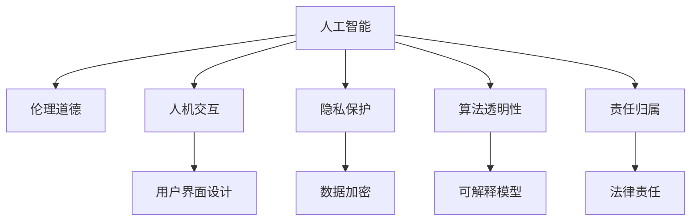

                 

# 科技与伦理的平衡点：人类计算的伦理思考

> 关键词：人工智能,伦理道德,人机交互,隐私保护,算法透明性,责任归属

## 1. 背景介绍

在人工智能(AI)技术迅猛发展的今天，人类计算已经进入了一个新的时代。智能算法通过学习海量数据，展现出惊人的计算能力，正在深刻改变我们的生活方式。然而，随着技术的不断进步，随之而来的伦理问题也愈发凸显。如何在追求技术突破的同时，保持对伦理道德的坚守，已经成为社会各界共同关注的焦点。

本文旨在探讨人工智能计算中的伦理问题，分析技术发展对人类社会带来的深远影响，并提出若干建设性的思考与建议。

## 2. 核心概念与联系

### 2.1 核心概念概述

为更好地理解人工智能计算的伦理问题，本节将介绍几个紧密相关的核心概念：

- 人工智能(Artificial Intelligence, AI)：指由计算机模拟的人类智能过程，包括学习、推理、感知、语言理解等能力。
- 伦理道德(Ethics)：指指导人类行为的原则和规范，包括公正、公平、诚实、尊重隐私等价值观。
- 人机交互(Human-Computer Interaction, HCI)：指人与计算机系统之间的互动过程，包括输入输出、交互界面设计等。
- 隐私保护(Privacy Protection)：指保护个人数据不被非法获取、使用或披露的措施和法律规定。
- 算法透明性(Algorithm Transparency)：指算法的内部逻辑和决策过程的可解释性和可理解性。
- 责任归属(Responsibility Assignment)：指在人工智能系统出现错误或违规行为时，确定责任主体的过程。

这些概念之间有着紧密的联系，共同构成了人工智能计算的伦理框架。技术的发展需要与伦理道德保持平衡，才能确保系统的可信赖性和社会责任。

### 2.2 核心概念原理和架构的 Mermaid 流程图



## 3. 核心算法原理 & 具体操作步骤

### 3.1 算法原理概述

人工智能计算中的伦理问题，主要体现在算法的设计、训练、应用等各个环节。以下将从算法原理的角度，探讨如何构建伦理道德可接受的AI系统。

### 3.2 算法步骤详解

#### 3.2.1 数据收集与处理

数据是AI系统的核心，数据的收集和处理过程往往涉及伦理道德问题。如何确保数据的质量、隐私和安全性，是数据处理的首要任务。

1. **数据来源合法性**：确保数据来源合法，避免侵犯个人隐私和版权。可以通过签订数据使用协议、获取数据使用授权等方式。
2. **数据匿名化**：在数据处理过程中，对个人信息进行去标识化，避免个人数据泄露。
3. **数据加密**：使用加密技术对数据进行保护，确保数据传输和存储的安全性。

#### 3.2.2 模型训练与优化

模型训练和优化是AI系统的关键环节，这一过程中也存在诸多伦理挑战。

1. **公平性**：模型应避免对某些群体或特征产生偏见，如性别、种族、年龄等。可以通过多样性采样、公平性约束等方法提高模型的公平性。
2. **透明性**：算法的决策过程应透明，使用可解释模型或提供模型的决策依据。
3. **可控性**：应提供对模型的可控性，使用户能够理解和干预模型的决策过程。

#### 3.2.3 应用部署与监控

AI系统的应用部署与监控环节，也需考虑伦理道德问题。

1. **隐私保护**：在应用中，应采取隐私保护措施，确保用户数据不被滥用。
2. **责任归属**：明确模型和系统在应用中的责任归属，确保出现错误或违规行为时有明确的责任主体。
3. **反馈机制**：建立用户反馈机制，及时发现和纠正系统的伦理问题。

### 3.3 算法优缺点

#### 3.3.1 优点

1. **提高效率**：通过AI技术自动化处理数据，减少人工干预，提高处理效率。
2. **提升准确性**：AI模型通过学习大量数据，能够提供比人工更准确的结果。
3. **促进公平**：AI系统可以通过优化算法，减少人为偏见，提高决策的公平性。

#### 3.3.2 缺点

1. **数据偏见**：AI系统可能继承数据中的偏见，导致决策不公。
2. **算法透明性不足**：黑盒模型难以解释其决策过程，可能引起信任危机。
3. **隐私侵犯**：AI系统在数据处理过程中可能泄露用户隐私，带来伦理风险。

### 3.4 算法应用领域

人工智能计算的伦理问题，涵盖了数据科学、机器学习、自然语言处理、计算机视觉等多个领域。以下是几个典型应用场景：

- **医疗健康**：AI在医疗诊断、治疗方案推荐等方面有广泛应用，但需确保数据隐私、算法透明性和决策公平性。
- **金融服务**：AI用于风险评估、欺诈检测等，需防范数据泄露、算法偏见等问题。
- **自动驾驶**：AI在自动驾驶中的应用，需确保算法透明性、责任归属和用户安全。
- **教育培训**：AI用于个性化学习、智能推荐等，需关注用户隐私、数据公平性等问题。

## 4. 数学模型和公式 & 详细讲解 & 举例说明

### 4.1 数学模型构建

AI系统的伦理问题，通常通过数学模型和算法来描述和解决。以下将以一个简单的分类模型为例，介绍如何构建伦理道德可接受的AI系统。

#### 4.1.1 目标函数

目标函数通常用于衡量模型的性能，包括准确率、召回率、F1分数等指标。例如，对于二分类问题，目标函数可以表示为：

$$
\mathcal{L}(w, b) = -\frac{1}{2N} \sum_{i=1}^N (y_i - f(x_i;w, b))^2
$$

其中，$y_i$为真实标签，$f(x_i;w, b)$为模型预测概率，$w$和$b$为模型参数。

#### 4.1.2 约束条件

约束条件通常用于确保算法的公平性和透明性。例如，可以使用L1正则化约束来确保模型参数的稀疏性：

$$
\mathcal{R}(w) = \|w\|_1
$$

#### 4.1.3 隐私保护

隐私保护通常通过数据加密、差分隐私等技术实现。例如，差分隐私可以通过添加噪声来保护数据隐私：

$$
\mathcal{L}_{\epsilon}(w, b) = \frac{1}{2N} \sum_{i=1}^N (y_i - f(x_i;w, b))^2 + \epsilon
$$

### 4.2 公式推导过程

#### 4.2.1 目标函数推导

目标函数的推导过程如下：

1. 定义损失函数：
$$
\mathcal{L}(w, b) = -\frac{1}{2N} \sum_{i=1}^N (y_i - f(x_i;w, b))^2
$$

2. 对$w$和$b$求偏导：
$$
\frac{\partial \mathcal{L}(w, b)}{\partial w} = -\frac{1}{N} \sum_{i=1}^N (y_i - f(x_i;w, b)) x_i
$$

$$
\frac{\partial \mathcal{L}(w, b)}{\partial b} = -\frac{1}{N} \sum_{i=1}^N (y_i - f(x_i;w, b))
$$

3. 求解目标函数最小值：
$$
\min_{w, b} \mathcal{L}(w, b)
$$

#### 4.2.2 约束条件推导

约束条件的推导过程如下：

1. 定义正则化约束：
$$
\mathcal{R}(w) = \|w\|_1
$$

2. 结合目标函数：
$$
\min_{w, b} \left(\mathcal{L}(w, b) + \lambda \mathcal{R}(w)\right)
$$

3. 对$w$和$b$求偏导：
$$
\frac{\partial \mathcal{L}(w, b)}{\partial w} + \lambda \frac{\partial \mathcal{R}(w)}{\partial w} = 0
$$

$$
\frac{\partial \mathcal{L}(w, b)}{\partial b} + \lambda \frac{\partial \mathcal{R}(w)}{\partial b} = 0
$$

4. 求解优化问题：
$$
\min_{w, b} \left(\mathcal{L}(w, b) + \lambda \mathcal{R}(w)\right)
$$

#### 4.2.3 隐私保护推导

隐私保护的推导过程如下：

1. 定义差分隐私约束：
$$
\mathcal{L}_{\epsilon}(w, b) = \frac{1}{2N} \sum_{i=1}^N (y_i - f(x_i;w, b))^2 + \epsilon
$$

2. 对$w$和$b$求偏导：
$$
\frac{\partial \mathcal{L}_{\epsilon}(w, b)}{\partial w} = -\frac{1}{N} \sum_{i=1}^N (y_i - f(x_i;w, b)) x_i
$$

$$
\frac{\partial \mathcal{L}_{\epsilon}(w, b)}{\partial b} = -\frac{1}{N} \sum_{i=1}^N (y_i - f(x_i;w, b))
$$

3. 求解优化问题：
$$
\min_{w, b} \mathcal{L}_{\epsilon}(w, b)
$$

### 4.3 案例分析与讲解

#### 4.3.1 案例一：医疗诊断

在医疗诊断中，AI系统需确保算法透明性和决策公平性。例如，某医院使用AI系统进行癌症诊断，需确保算法在各类患者中保持公平。可以采用多模态学习、公平性约束等技术，减少算法偏见。

#### 4.3.2 案例二：金融风险评估

在金融风险评估中，AI系统需防范数据泄露、算法偏见等问题。例如，某银行使用AI系统进行信用评估，需确保数据隐私保护和算法公平性。可以采用差分隐私、L1正则化等技术，确保算法透明性和数据安全。

## 5. 项目实践：代码实例和详细解释说明

### 5.1 开发环境搭建

在构建AI系统时，开发环境的选择至关重要。以下是一些常用的开发环境及其配置方法：

#### 5.1.1 环境搭建

1. **Python**：
   - 安装Anaconda或Miniconda
   - 创建虚拟环境，激活虚拟环境
   - 安装必要的Python库，如TensorFlow、PyTorch、Keras等

2. **R语言**：
   - 安装R语言，RStudio IDE
   - 安装必要的R包，如caret、tidyverse等

3. **C++/Java**：
   - 安装Visual Studio、Eclipse、IntelliJ IDEA等IDE
   - 安装必要的SDK、库文件，如OpenCV、TensorFlow、DL4J等

### 5.2 源代码详细实现

#### 5.2.1 数据预处理

数据预处理是AI系统的关键环节，以下是一些常用的数据处理技术：

##### 5.2.1.1 数据清洗

数据清洗包括去重、去噪、填补缺失值等操作。例如，在医疗数据中，可以去除重复样本和异常值。

```python
import pandas as pd
data = pd.read_csv('medical_data.csv')
data = data.drop_duplicates()  # 去重
data = data.dropna()  # 去除缺失值
```

##### 5.2.1.2 特征工程

特征工程包括特征选择、特征提取、特征变换等操作。例如，在金融数据中，可以使用PCA降维技术减少特征数量。

```python
from sklearn.decomposition import PCA
X = data.iloc[:, :-1].values
X = PCA(n_components=10).fit_transform(X)
```

#### 5.2.2 模型训练与优化

模型训练是AI系统的核心，以下是一些常用的模型训练技术：

##### 5.2.2.1 模型选择

选择合适的模型是关键，以下是一些常用的模型选择方法：

```python
from sklearn.linear_model import LogisticRegression
from sklearn.ensemble import RandomForestClassifier
from sklearn.svm import SVC
classifiers = [LogisticRegression(), RandomForestClassifier(), SVC()]
```

##### 5.2.2.2 超参数优化

超参数优化是提高模型性能的重要手段，以下是一些常用的超参数优化方法：

```python
from sklearn.model_selection import GridSearchCV
parameters = {'n_estimators': [100, 200, 300],
              'max_depth': [10, 20, 30]}
grid_search = GridSearchCV(classifiers, parameters, cv=5)
grid_search.fit(X, y)
```

#### 5.2.3 模型评估与部署

模型评估与部署是AI系统的最后一步，以下是一些常用的模型评估技术：

##### 5.2.3.1 模型评估

模型评估包括准确率、召回率、F1分数等指标。以下是一些常用的评估方法：

```python
from sklearn.metrics import accuracy_score, precision_score, recall_score, f1_score
y_pred = grid_search.predict(X_test)
accuracy = accuracy_score(y_test, y_pred)
precision = precision_score(y_test, y_pred)
recall = recall_score(y_test, y_pred)
f1 = f1_score(y_test, y_pred)
```

##### 5.2.3.2 模型部署

模型部署是将模型集成到应用中的过程，以下是一些常用的部署方法：

```python
from flask import Flask, request
from joblib import load
app = Flask(__name__)
model = load('model.pkl')
@app.route('/predict', methods=['POST'])
def predict():
    data = request.json
    result = model.predict([[float(data['feature1']), float(data['feature2'])])
    return {'result': result[0]}
```

### 5.3 代码解读与分析

#### 5.3.1 数据预处理

数据预处理是AI系统的核心，以下是一些常用的数据处理技术：

##### 5.3.1.1 数据清洗

数据清洗包括去重、去噪、填补缺失值等操作。例如，在医疗数据中，可以去除重复样本和异常值。

```python
import pandas as pd
data = pd.read_csv('medical_data.csv')
data = data.drop_duplicates()  # 去重
data = data.dropna()  # 去除缺失值
```

##### 5.3.1.2 特征工程

特征工程包括特征选择、特征提取、特征变换等操作。例如，在金融数据中，可以使用PCA降维技术减少特征数量。

```python
from sklearn.decomposition import PCA
X = data.iloc[:, :-1].values
X = PCA(n_components=10).fit_transform(X)
```

#### 5.3.2 模型训练与优化

模型训练是AI系统的核心，以下是一些常用的模型训练技术：

##### 5.3.2.1 模型选择

选择合适的模型是关键，以下是一些常用的模型选择方法：

```python
from sklearn.linear_model import LogisticRegression
from sklearn.ensemble import RandomForestClassifier
from sklearn.svm import SVC
classifiers = [LogisticRegression(), RandomForestClassifier(), SVC()]
```

##### 5.3.2.2 超参数优化

超参数优化是提高模型性能的重要手段，以下是一些常用的超参数优化方法：

```python
from sklearn.model_selection import GridSearchCV
parameters = {'n_estimators': [100, 200, 300],
              'max_depth': [10, 20, 30]}
grid_search = GridSearchCV(classifiers, parameters, cv=5)
grid_search.fit(X, y)
```

#### 5.3.3 模型评估与部署

模型评估与部署是AI系统的最后一步，以下是一些常用的模型评估技术：

##### 5.3.3.1 模型评估

模型评估包括准确率、召回率、F1分数等指标。以下是一些常用的评估方法：

```python
from sklearn.metrics import accuracy_score, precision_score, recall_score, f1_score
y_pred = grid_search.predict(X_test)
accuracy = accuracy_score(y_test, y_pred)
precision = precision_score(y_test, y_pred)
recall = recall_score(y_test, y_pred)
f1 = f1_score(y_test, y_pred)
```

##### 5.3.3.2 模型部署

模型部署是将模型集成到应用中的过程，以下是一些常用的部署方法：

```python
from flask import Flask, request
from joblib import load
app = Flask(__name__)
model = load('model.pkl')
@app.route('/predict', methods=['POST'])
def predict():
    data = request.json
    result = model.predict([[float(data['feature1']), float(data['feature2'])])
    return {'result': result[0]}
```

## 6. 实际应用场景

### 6.1 智能医疗

智能医疗是AI应用的重要领域，以下是一些实际应用场景：

#### 6.1.1 病例诊断

AI系统可以用于辅助医生进行病例诊断，例如，某医院使用AI系统进行癌症诊断，需确保算法在各类患者中保持公平。可以采用多模态学习、公平性约束等技术，减少算法偏见。

#### 6.1.2 治疗方案推荐

AI系统可以用于推荐治疗方案，例如，某医院使用AI系统根据患者病情推荐最佳治疗方案，需确保数据隐私保护和算法透明性。可以采用差分隐私、L1正则化等技术，确保算法透明性和数据安全。

### 6.2 金融服务

金融服务是AI应用的另一个重要领域，以下是一些实际应用场景：

#### 6.2.1 风险评估

AI系统可以用于风险评估，例如，某银行使用AI系统进行信用评估，需确保数据隐私保护和算法公平性。可以采用差分隐私、L1正则化等技术，确保算法透明性和数据安全。

#### 6.2.2 欺诈检测

AI系统可以用于欺诈检测，例如，某银行使用AI系统检测信用卡欺诈行为，需确保算法透明性和决策公平性。可以采用可解释模型、公平性约束等技术，提高算法的可信度。

### 6.3 智能推荐

智能推荐是AI应用的常见场景，以下是一些实际应用场景：

#### 6.3.1 内容推荐

AI系统可以用于内容推荐，例如，某视频平台使用AI系统推荐用户感兴趣的视频内容，需确保推荐结果的多样性和公平性。可以采用多样性采样、公平性约束等技术，提高推荐效果。

#### 6.3.2 个性化推荐

AI系统可以用于个性化推荐，例如，某电商平台使用AI系统推荐个性化商品，需确保用户隐私保护和推荐公平性。可以采用差分隐私、公平性约束等技术，确保用户数据安全。

## 7. 工具和资源推荐

### 7.1 学习资源推荐

为了帮助开发者系统掌握AI计算的伦理问题，这里推荐一些优质的学习资源：

1. **《AI伦理导论》**：这本书系统介绍了AI伦理的基本概念和伦理框架，适合入门学习和深入理解。
2. **《机器学习与统计学》**：这本书详细介绍了机器学习的原理和方法，并探讨了算法的伦理问题，适合进阶学习。
3. **《深度学习中的伦理道德》**：这本书深入探讨了深度学习中的伦理道德问题，适合学术研究和工程应用。
4. **《AI伦理标准与规范》**：这本书介绍了国际和国内的AI伦理标准和规范，适合法规学习和实践应用。

### 7.2 开发工具推荐

以下是一些常用的AI计算开发工具：

1. **TensorFlow**：由Google开发的深度学习框架，支持多种模型训练和优化算法，适合大规模模型开发。
2. **PyTorch**：由Facebook开发的深度学习框架，支持动态计算图和模型并行，适合快速迭代研究。
3. **JAX**：由Google开发的机器学习库，支持自动微分和分布式计算，适合高性能计算。
4. **MXNet**：由Amazon开发的深度学习框架，支持多种硬件和深度学习算法，适合工业应用。

### 7.3 相关论文推荐

以下是一些有影响力的AI计算伦理论文，推荐阅读：

1. **《公平性约束在机器学习中的研究进展》**：这篇论文综述了机器学习中的公平性约束问题，并提出了一些解决策略。
2. **《AI伦理问题与解决策略》**：这篇论文系统介绍了AI伦理问题，并提出了一些解决方案。
3. **《深度学习中的隐私保护技术》**：这篇论文介绍了深度学习中的隐私保护技术，并提出了一些实践应用。
4. **《智能系统中的算法透明性与可解释性》**：这篇论文探讨了智能系统中的算法透明性与可解释性问题，并提出了一些解决方案。

## 8. 总结：未来发展趋势与挑战

### 8.1 总结

本文对人工智能计算中的伦理问题进行了全面系统的介绍，分析了技术发展对人类社会带来的深远影响，并提出了若干建设性的思考与建议。通过本文的系统梳理，可以看到，AI计算的伦理问题在各个领域中愈发重要，需要在技术突破的同时，保持对伦理道德的坚守。只有技术与伦理并重，才能构建可信赖、可控、可解释的AI系统。

### 8.2 未来发展趋势

展望未来，AI计算的伦理问题将呈现以下几个发展趋势：

1. **伦理标准化**：随着AI应用的不断扩展，伦理标准化将逐渐成为行业标准，指导AI系统的开发和应用。
2. **技术透明化**：AI系统的算法透明性将逐步提高，用户可以更加信任和理解AI系统。
3. **算法公平化**：AI系统将更加注重算法公平性，避免偏见和歧视，提高决策的公正性。
4. **隐私保护加强**：数据隐私保护将成为AI系统开发的重要环节，确保用户数据的安全性。
5. **责任归属明确**：AI系统的责任归属将更加明确，确保出现问题时有明确的责任主体。

### 8.3 面临的挑战

尽管AI计算的伦理问题逐渐受到关注，但在迈向更加智能化、普适化应用的过程中，它仍面临诸多挑战：

1. **技术复杂性**：AI系统往往包含复杂的算法和模型，需要深入理解和调试，带来技术挑战。
2. **伦理争议**：AI系统在决策过程中可能面临伦理争议，需多方协调解决。
3. **用户信任**：AI系统需要获得用户的信任和接受，需加强透明性和可解释性。
4. **数据质量**：AI系统依赖大量高质量数据，数据质量的好坏直接影响系统性能。
5. **资源消耗**：AI系统需要大量的计算和存储资源，需考虑资源优化和成本问题。

### 8.4 研究展望

面对AI计算中的伦理问题，未来的研究需要在以下几个方面寻求新的突破：

1. **伦理框架完善**：构建完善的AI伦理框架，指导AI系统的开发和应用。
2. **算法透明化**：开发可解释模型，提高算法的透明性和可信度。
3. **公平性约束**：引入公平性约束，减少算法的偏见和歧视。
4. **隐私保护加强**：加强数据隐私保护，确保用户数据的安全性。
5. **责任归属明确**：明确AI系统的责任归属，确保出现问题时有明确的责任主体。

这些研究方向的探索，必将引领AI计算伦理问题的解决，为构建安全、可靠、可解释、可控的智能系统铺平道路。面向未来，AI计算需要技术与伦理并重，才能真正实现人工智能技术的可持续发展。

## 9. 附录：常见问题与解答

### 9.1 常见问题

#### Q1: 如何确保AI系统的公平性？

A: 确保AI系统的公平性，需从数据、算法和部署等多个环节入手。例如，可以采用多样性采样、公平性约束等技术，减少算法偏见。同时，建立透明、公正的算法评估和监督机制，确保算法在各类群体中表现一致。

#### Q2: 如何提高AI系统的可解释性？

A: 提高AI系统的可解释性，需开发可解释模型和提供透明的决策依据。例如，可以采用LIME、SHAP等方法，生成局部模型解释，提供易于理解的决策过程。同时，建立用户反馈机制，不断优化和改进模型。

#### Q3: 如何保护用户隐私？

A: 保护用户隐私，需采用数据加密、差分隐私等技术。例如，可以使用差分隐私技术，通过添加噪声保护数据隐私。同时，建立严格的隐私保护政策，确保数据使用的合法性和安全性。

#### Q4: 如何确定AI系统的责任归属？

A: 确定AI系统的责任归属，需建立明确的责任界定机制。例如，可以制定责任归属标准，明确AI系统在决策中的作用和责任。同时，建立责任追究机制，确保出现问题时有明确的责任主体。

---

作者：禅与计算机程序设计艺术 / Zen and the Art of Computer Programming

