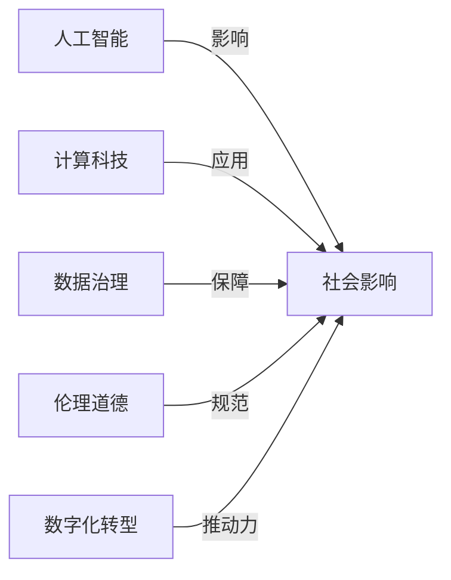

                 

# 科技与社会：人类计算的双重影响与思考

> 关键词：人工智能, 计算科技, 社会影响, 数据治理, 伦理道德, 数字化转型, 未来展望

## 1. 背景介绍

### 1.1 问题由来
科技的进步总是伴随着深刻的社会变迁。自计算机和互联网诞生以来，人类社会的方方面面都在被计算技术所重塑。特别是进入21世纪以来，以人工智能（AI）为代表的计算科技迎来了快速发展的新时代。人工智能不仅在科研、生产、医疗、教育等领域带来革命性的改变，还引发了关于隐私、安全、就业、伦理等广泛的讨论与思考。本文将深入探讨计算科技对社会的双重影响，包括其正面效应与潜在风险，并提出几点思考和建议，助力构建一个更加美好的未来。

## 2. 核心概念与联系

### 2.1 核心概念概述

在探讨计算科技与社会影响的过程中，我们需要理解以下核心概念：

- **人工智能（Artificial Intelligence, AI）**：指通过计算机程序和算法模拟人类智能，具有感知、学习、推理、规划、决策等能力的技术。
- **计算科技（Computational Science & Technology）**：涉及计算机科学、数据科学、算法设计等多个领域，利用计算能力解决复杂问题的技术体系。
- **社会影响（Social Impact）**：指科技技术对社会结构、经济模式、文化价值观等方面的改变。
- **数据治理（Data Governance）**：在数据收集、存储、处理、共享等环节，确保数据安全、隐私保护、数据质量的管理和监督机制。
- **伦理道德（Ethics & Morality）**：科技发展需遵循的道德规范，涉及技术决策、公平正义、透明度等方面。
- **数字化转型（Digital Transformation）**：企业、组织乃至整个社会利用数字技术，改善业务流程、优化运营效率、创造新价值的变革过程。

这些概念之间相互关联，共同构成了计算科技与社会互动的复杂框架。其中，人工智能作为计算科技的典型代表，对社会的影响尤为显著。

### 2.2 核心概念原理和架构的 Mermaid 流程图(Mermaid 流程节点中不要有括号、逗号等特殊字符)



这个流程图展示了计算科技与社会的相互作用机制：人工智能通过计算科技推动社会的发展，同时社会影响也对计算科技的伦理和数据治理提出要求，推动技术进步和优化。

## 3. 核心算法原理 & 具体操作步骤

### 3.1 算法原理概述

人工智能的核心在于算法和模型，其影响社会的方式也紧密依赖于这些算法和模型的设计与应用。一个典型的AI算法流程包括数据预处理、模型训练、模型评估、模型部署等步骤，这些步骤都与社会治理和技术伦理密切相关。

### 3.2 算法步骤详解

以下详细介绍一个AI模型的基本开发流程，包括关键步骤及其实际操作：

1. **数据收集与预处理**：
   - **数据收集**：根据应用场景，从各类数据源（如传感器、社交媒体、公共数据集等）收集数据。
   - **数据预处理**：清洗数据，处理缺失值，标准化数据格式，准备模型训练。

2. **模型训练**：
   - **选择合适的模型**：根据任务特点选择合适的算法和模型结构，如决策树、神经网络、深度学习等。
   - **模型训练**：使用训练集对模型进行训练，调整超参数，优化模型性能。

3. **模型评估**：
   - **性能评估**：使用验证集对模型进行性能评估，如准确率、召回率、F1分数等指标。
   - **模型调优**：根据评估结果，调整模型结构、参数等，进一步提升模型性能。

4. **模型部署**：
   - **模型优化**：对模型进行剪枝、量化、编译等优化，提升模型推理速度和资源利用率。
   - **部署上线**：将模型集成到实际应用中，如网站、移动应用、工业设备等。

### 3.3 算法优缺点

人工智能的算法具有以下优点：
- **高效求解复杂问题**：能够处理大规模数据和高维度特征，解决传统算法难以解决的问题。
- **自适应性强**：能够根据数据和任务的变化自动调整模型结构，提升算法泛化能力。
- **可解释性差**：很多复杂模型的决策过程难以解释，增加了模型应用的风险。
- **数据依赖性强**：模型的性能依赖于数据的质量和数量，获取高质量数据成本较高。
- **计算资源需求高**：需要大量的计算资源进行模型训练和推理，初期投入较大。

### 3.4 算法应用领域

人工智能算法已经在多个领域得到了广泛应用，例如：

- **医疗**：用于疾病诊断、药物研发、健康监测等。
- **金融**：用于信用评估、风险管理、智能投顾等。
- **交通**：用于智能交通管理、自动驾驶、路径规划等。
- **零售**：用于个性化推荐、库存管理、客户服务等。
- **制造业**：用于智能制造、供应链管理、质量控制等。

## 4. 数学模型和公式 & 详细讲解 & 举例说明

### 4.1 数学模型构建

以一个简单的线性回归模型为例，其数学模型构建如下：

假设 $y$ 为输出变量，$x_1, x_2, ..., x_n$ 为输入变量，$w_0, w_1, ..., w_n$ 为模型参数，则线性回归模型的表达式为：

$$
y = w_0 + w_1x_1 + w_2x_2 + ... + w_nx_n
$$

### 4.2 公式推导过程

对于线性回归模型的最小二乘法求解，其损失函数为：

$$
L(w) = \frac{1}{2}\sum_{i=1}^n(y_i - w_0 - \sum_{j=1}^n w_jx_{ij})^2
$$

其中，$y_i$ 为实际观测值，$x_{ij}$ 为输入变量 $x_j$ 在样本 $i$ 中的取值。最小化损失函数，得到模型参数的最优解为：

$$
w_j = \frac{\sum_{i=1}^n x_{ij}y_i - \frac{1}{n}\sum_{i=1}^n x_{ij}\sum_{i=1}^n y_i}{\sum_{i=1}^n x_{ij}^2 - \frac{1}{n}\sum_{i=1}^n x_{ij}^2}
$$

### 4.3 案例分析与讲解

以房价预测为例，通过收集历史房价数据和影响房价的因素（如面积、地段、年代等），利用线性回归模型预测新房源的房价。模型训练过程中，需要注意样本选择、特征工程、数据清洗等步骤，保证模型的预测精度和泛化能力。

## 5. 项目实践：代码实例和详细解释说明

### 5.1 开发环境搭建

项目实践需要一定的开发环境，以下是Python和PyTorch环境搭建流程：

1. 安装Anaconda，创建虚拟环境：
```bash
conda create --name pytorch-env python=3.8
conda activate pytorch-env
```

2. 安装PyTorch和相关依赖：
```bash
conda install pytorch torchvision torchaudio
```

3. 安装TensorBoard和Weights & Biases：
```bash
pip install tensorboard wandb
```

4. 设置环境变量，启动Jupyter Notebook：
```bash
source activate pytorch-env
jupyter notebook
```

### 5.2 源代码详细实现

以下是一个简单的线性回归模型代码实现：

```python
import torch
import torch.nn as nn

class LinearRegression(nn.Module):
    def __init__(self, input_dim):
        super(LinearRegression, self).__init__()
        self.linear = nn.Linear(input_dim, 1)

    def forward(self, x):
        y_pred = self.linear(x)
        return y_pred

# 数据准备
train_x = torch.tensor([[4.0], [6.0], [8.0], [12.0]], dtype=torch.float)
train_y = torch.tensor([[26.0], [32.0], [34.0], [54.0]], dtype=torch.float)

# 模型初始化
model = LinearRegression(input_dim=1)

# 定义损失函数和优化器
criterion = nn.MSELoss()
optimizer = torch.optim.SGD(model.parameters(), lr=0.01)

# 模型训练
for epoch in range(100):
    optimizer.zero_grad()
    predictions = model(train_x)
    loss = criterion(predictions, train_y)
    loss.backward()
    optimizer.step()

# 模型评估
test_x = torch.tensor([[9.0], [15.0], [20.0]], dtype=torch.float)
predictions = model(test_x)
```

### 5.3 代码解读与分析

上述代码实现了线性回归模型的训练和评估。具体分析如下：

- **数据准备**：通过TensorFlow中的`tensor`函数创建训练和测试数据。
- **模型初始化**：定义线性回归模型，并使用`nn.Linear`创建线性层。
- **损失函数和优化器**：使用均方误差损失函数（MSELoss）和随机梯度下降优化器（SGD）。
- **模型训练**：通过`forward`方法计算模型输出，使用`loss`函数计算预测值与真实值之间的损失，通过`backward`方法计算梯度，使用`optimizer.step`更新模型参数。
- **模型评估**：使用训练好的模型对测试数据进行预测。

## 6. 实际应用场景

### 6.1 智慧医疗

在智慧医疗领域，人工智能技术被广泛应用于疾病诊断、医学影像分析、个性化治疗等多个方面。通过分析患者的临床数据、基因数据、医疗影像等，AI算法能够提供精准的诊断和治疗建议，提升医疗服务的质量和效率。

### 6.2 金融科技

金融科技（FinTech）利用AI技术优化金融服务，如智能投顾、风险管理、信用评估等。AI算法通过分析历史数据和市场动态，提供个性化的金融建议和风险预警，提升金融机构的服务能力和风控水平。

### 6.3 智能制造

智能制造利用AI技术优化生产流程、提升产品质量、降低成本。通过AI算法对生产数据进行分析，可以预测设备故障、优化生产计划、提高生产效率，推动制造业的数字化转型。

### 6.4 未来应用展望

随着计算科技的不断发展，未来AI技术将在更多领域发挥重要作用。以下列举几个可能的应用场景：

- **智能交通**：通过AI技术优化交通管理、提升出行效率、减少交通事故。
- **智慧城市**：利用AI技术提升城市管理水平，如智能安防、智能垃圾分类、智能能源管理等。
- **教育**：利用AI技术提升教学质量，如个性化学习、智能评估、智能辅导等。
- **农业**：利用AI技术优化农业生产，如精准农业、农业机器人、智能灌溉等。

## 7. 工具和资源推荐

### 7.1 学习资源推荐

1. **吴恩达《机器学习》课程**：吴恩达教授在Coursera开设的机器学习课程，系统介绍了机器学习的基本原理和应用。
2. **李宏毅《深度学习》课程**：台湾大学李宏毅教授在YouTube和NTU OMSA开设的深度学习课程，深入讲解深度学习算法和实践。
3. **《深度学习》书籍**：Ian Goodfellow等著，系统介绍了深度学习的基本概念、算法和应用。
4. **PyTorch官方文档**：PyTorch的官方文档，包含详细的教程和示例代码，适合初学者入门。
5. **TensorFlow官方文档**：TensorFlow的官方文档，包含详细的API参考和实际应用案例。

### 7.2 开发工具推荐

1. **Jupyter Notebook**：免费的Python开发环境，支持多语言编程和可视化。
2. **PyTorch**：灵活的深度学习框架，易于使用和调试。
3. **TensorFlow**：谷歌开发的深度学习框架，支持分布式计算和模型优化。
4. **TensorBoard**：TensorFlow配套的可视化工具，可以实时监测模型训练状态。
5. **Weights & Biases**：模型训练的实验跟踪工具，可以记录和可视化模型训练过程中的各项指标。

### 7.3 相关论文推荐

1. **《深度学习》书籍**：Ian Goodfellow等著，系统介绍了深度学习的基本概念、算法和应用。
2. **《人工智能：一种现代的方法》书籍**：Stuart Russell和Peter Norvig著，深入讲解AI的基本原理和技术。
3. **《机器学习实战》书籍**：Peter Harrington著，结合实际应用场景，介绍机器学习的实现方法。

## 8. 总结：未来发展趋势与挑战

### 8.1 研究成果总结

本文从计算科技对社会的影响角度，探讨了人工智能技术的正面效应和潜在风险。在医疗、金融、制造、交通等多个领域，AI技术已经展现出了强大的应用潜力。然而，面对数据隐私、算法透明性、伦理道德等问题，需要进一步的研究和规范，确保AI技术健康、可持续地发展。

### 8.2 未来发展趋势

未来，计算科技将继续推动社会的数字化转型，AI技术将在更多领域发挥重要作用。以下列举几个可能的发展趋势：

1. **普适化AI**：通过多模态数据的融合，提升AI算法的鲁棒性和泛化能力，实现更加智能、灵活的AI应用。
2. **自适应AI**：通过自动调参、自动优化等技术，提升AI算法的自我优化能力，适应复杂多变的环境。
3. **透明化AI**：通过可解释性技术，提升AI算法的透明度和可解释性，增强用户信任和接受度。
4. **协作化AI**：通过人机协同、人机对话等技术，实现人机协作，提升AI系统的效率和效果。

### 8.3 面临的挑战

尽管计算科技在社会中带来了巨大的变化，但未来仍面临诸多挑战：

1. **数据隐私问题**：如何保护用户的隐私数据，防止数据泄露和滥用，是一个亟待解决的问题。
2. **伦理道德问题**：如何确保AI技术的公平性、公正性、透明性，防止技术滥用，需要更多伦理规范和监管机制。
3. **计算资源问题**：如何降低AI算法的计算资源需求，提升算法的计算效率，需要更多的技术优化和硬件支持。
4. **算法透明性问题**：如何提高AI算法的透明性，增强用户对AI系统的理解和信任，需要更多的可解释性技术。

### 8.4 研究展望

面对未来的挑战，需要进一步探索和研究：

1. **隐私保护技术**：通过差分隐私、联邦学习等技术，保护用户数据隐私，防止数据泄露。
2. **伦理规范建设**：建立AI技术的伦理规范和监管机制，确保技术公平、公正、透明。
3. **计算优化技术**：通过模型压缩、量化、分布式计算等技术，提升AI算法的计算效率和资源利用率。
4. **可解释性技术**：通过可解释性技术和透明化方法，提升AI算法的透明性和可理解性。

## 9. 附录：常见问题与解答

**Q1：如何理解计算科技对社会的影响？**

A: 计算科技对社会的影响是复杂而深远的。它不仅改变了人们的生产生活方式，还带来了就业、隐私、安全等方面的变化。理解这些影响，需要从多个角度进行深入思考，包括技术本身的特点、应用场景的复杂性、用户和社会的接受度等。

**Q2：如何保证AI算法的公平性和公正性？**

A: 保证AI算法的公平性和公正性需要从数据和算法两个方面进行考虑：
1. 数据方面：确保数据集的多样性和代表性，避免数据偏见。
2. 算法方面：使用公平性约束、对抗性训练等技术，防止算法偏见和歧视。

**Q3：如何在AI应用中平衡创新和风险？**

A: 在AI应用中，平衡创新和风险需要综合考虑技术、伦理、法律等多个因素：
1. 技术方面：选择合适的方法和算法，确保技术的安全性和可靠性。
2. 伦理方面：制定明确的伦理规范，确保技术应用符合社会价值观和伦理标准。
3. 法律方面：建立法律法规，规范AI技术的开发和使用，保护用户权益。

**Q4：如何提高AI算法的透明性？**

A: 提高AI算法的透明性需要从数据、模型和应用等多个层面进行考虑：
1. 数据层面：公开数据来源和处理方式，确保数据透明和可验证。
2. 模型层面：使用可解释性技术，如决策树、LIME、SHAP等，提升模型的透明性和可理解性。
3. 应用层面：通过用户反馈和公开测试，不断改进算法，提升其透明度和用户接受度。

作者：禅与计算机程序设计艺术 / Zen and the Art of Computer Programming

