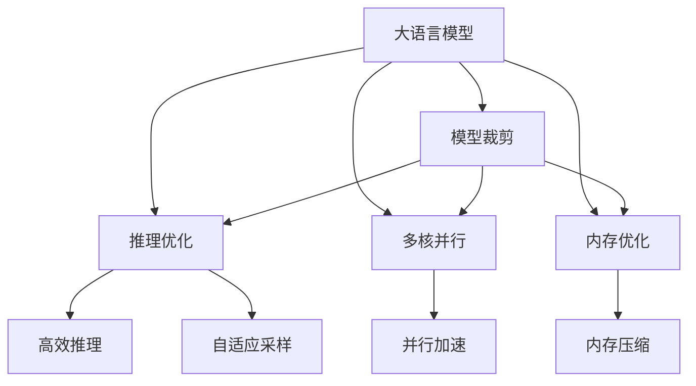

                 

# 秒推时代:LLM极速推理

> 关键词：大语言模型,LLM,推理加速,深度学习,模型裁剪,推理优化,多核并行,内存优化

## 1. 背景介绍

### 1.1 问题由来
随着大语言模型（Large Language Models, LLMs）的迅猛发展，模型在复杂语言任务上的表现越来越好，但伴随而来的是高昂的推理计算成本。在基于深度学习的应用中，推理计算是一个资源密集型任务，特别是在具有大规模参数量的模型上，如BERT、GPT-3、T5等。这些模型往往需要占用大量的GPU资源，且推理速度较慢，无法满足实时响应的需求。如何提升大语言模型在推理阶段的速度和效率，成为当前研究的热点之一。

在实际应用中，如智能客服、在线翻译、对话系统等，对模型的推理速度有严格要求，通常需要在毫秒级别完成一次推理任务。为了满足这些应用场景的需求，需要高效、快速地进行大语言模型的推理计算。

### 1.2 问题核心关键点
本节将详细介绍大语言模型推理加速的方法，包括模型裁剪、推理优化、多核并行、内存优化等。

## 2. 核心概念与联系

### 2.1 核心概念概述

为更好地理解LLM极速推理方法，本节将介绍几个密切相关的核心概念：

- 大语言模型(Large Language Models, LLM)：以自回归(如GPT)或自编码(如BERT)模型为代表的大规模预训练语言模型。通过在大规模无标签文本语料上进行预训练，学习通用的语言表示，具备强大的语言理解和生成能力。

- 推理加速：通过一些技术手段，如模型裁剪、推理优化、多核并行、内存优化等，减少推理计算的资源消耗，提升模型推理速度的过程。

- 模型裁剪(Model Pruning)：去除模型中不必要的层或参数，减少推理过程中的计算量，同时保持模型的关键能力。

- 推理优化(Inference Optimization)：通过改进推理过程，减少计算开销，提升推理速度。

- 多核并行(Multi-core Parallelism)：利用现代CPU的多核特性，对模型进行并行计算，提高推理效率。

- 内存优化(Memory Optimization)：通过减少中间结果的存储量，优化内存使用，减少计算过程中对内存的占用。

这些核心概念之间的逻辑关系可以通过以下Mermaid流程图来展示：



这个流程图展示了大语言模型的核心概念及其之间的关系：

1. 大语言模型通过预训练获得基础能力。
2. 推理加速通过模型裁剪、推理优化、多核并行、内存优化等技术手段，对模型进行二次加工，以提高推理速度。
3. 高效推理、自适应采样、并行加速和内存压缩等技术都是推理加速的具体实现手段。

这些核心概念共同构成了LLM极速推理的框架，使得大语言模型能够在各种场景下快速响应，发挥其强大的语言理解和生成能力。

## 3. 核心算法原理 & 具体操作步骤
### 3.1 算法原理概述

LLM极速推理的核心思想是：在保持模型关键能力的基础上，通过减少不必要的计算，提升模型推理效率。这包括对模型的结构进行裁剪、对推理过程进行优化、利用多核进行并行计算、以及优化内存使用等。

### 3.2 算法步骤详解

基于推理加速的大语言模型极速推理一般包括以下几个关键步骤：

**Step 1: 模型裁剪**
- 分析模型的计算图，识别出对模型性能影响较小的部分。
- 去除或冻结这些部分的参数，如不必要的层、节点等。
- 保留模型关键的能力，如语言建模、序列预测等。

**Step 2: 推理优化**
- 根据任务需求，选择高效的推理算法，如动态图、静态图、序列到序列等。
- 优化推理过程中的计算，如利用自适应采样算法、近似算法等。

**Step 3: 多核并行**
- 利用CPU的多核特性，将模型推理任务分配到不同的核上同时计算。
- 对于并行计算的分布，可以采用线程池、多线程等技术手段。

**Step 4: 内存优化**
- 减少中间结果的存储量，如利用流水线计算、异步更新等技术。
- 优化内存分配策略，减少频繁的内存读写。

**Step 5: 部署优化**
- 选择合适的部署平台，如GPU、TPU等，以满足计算需求。
- 优化部署平台的性能，如调整超参数、调整内存分配等。

以上是基于推理加速的大语言模型极速推理的一般流程。在实际应用中，还需要针对具体任务的特点，对推理加速过程的各个环节进行优化设计，如改进推理目标函数，引入更多的加速技术，搜索最优的超参数组合等，以进一步提升模型性能。

### 3.3 算法优缺点

基于推理加速的极速推理方法具有以下优点：
1. 降低计算成本。通过模型裁剪和优化，可以减少不必要的计算，降低计算开销。
2. 提升推理速度。通过多核并行和内存优化，可以显著提升模型推理的速度。
3. 适应性强。可以灵活应用于各种NLP任务，如问答、对话、翻译等。
4. 兼容性好。可以与现有的深度学习框架无缝集成，如TensorFlow、PyTorch等。

同时，该方法也存在一定的局限性：
1. 裁剪精度有限。模型裁剪可能会降低模型的某些性能，特别是在裁剪比例较大的情况下。
2. 优化难度高。推理优化、多核并行、内存优化等技术需要深入理解模型结构和计算特性。
3. 部署复杂。部署优化需要根据具体平台进行调整，过程复杂且容易出错。
4. 可解释性不足。优化后的模型结构复杂，难以理解其内部工作机制和决策逻辑。

尽管存在这些局限性，但就目前而言，基于推理加速的极速推理方法仍是大语言模型推理的主流范式。未来相关研究的重点在于如何进一步降低推理计算的成本，提高模型的推理速度，同时兼顾可解释性和伦理安全性等因素。

### 3.4 算法应用领域

基于大语言模型极速推理的方法，在NLP领域已经得到了广泛的应用，覆盖了几乎所有常见任务，例如：

- 问答系统：对自然语言问题给出答案。将问题-答案对作为推理数据，训练模型推理并生成回答。
- 对话系统：使机器能够与人自然对话。将多轮对话历史作为上下文，推理生成回复。
- 机器翻译：将源语言文本翻译成目标语言。通过推理生成语言-语言映射。
- 文本摘要：将长文本压缩成简短摘要。通过推理生成摘要。
- 情感分析：识别文本情感倾向。通过推理生成情感分类。
- 命名实体识别：识别文本中的人名、地名、机构名等特定实体。通过推理生成实体边界和类型。

除了上述这些经典任务外，大语言模型极速推理也被创新性地应用到更多场景中，如可控文本生成、常识推理、代码生成、数据增强等，为NLP技术带来了全新的突破。随着预训练模型和推理加速方法的不断进步，相信NLP技术将在更广阔的应用领域大放异彩。

## 4. 数学模型和公式 & 详细讲解
### 4.1 数学模型构建

本节将使用数学语言对基于推理加速的大语言模型极速推理过程进行更加严格的刻画。

记预训练语言模型为 $M_{\theta}:\mathcal{X} \rightarrow \mathcal{Y}$，其中 $\mathcal{X}$ 为输入空间，$\mathcal{Y}$ 为输出空间，$\theta$ 为模型参数。假设推理任务为 $T$，推理输入为 $x$。

定义模型 $M_{\theta}$ 在输入 $x$ 上的推理损失函数为 $\ell(M_{\theta}(x),y)$，则在数据集 $D$ 上的经验损失为：

$$
\mathcal{L}(\theta) = \frac{1}{N} \sum_{i=1}^N \ell(M_{\theta}(x_i),y_i)
$$

其中 $\mathcal{X}$ 为输入空间，$\mathcal{Y}$ 为输出空间，$\theta$ 为模型参数。假设推理任务为 $T$，推理输入为 $x$。

定义模型 $M_{\theta}$ 在输入 $x$ 上的推理损失函数为 $\ell(M_{\theta}(x),y)$，则在数据集 $D$ 上的经验损失为：

$$
\mathcal{L}(\theta) = \frac{1}{N} \sum_{i=1}^N \ell(M_{\theta}(x_i),y_i)
$$

### 4.2 公式推导过程

以下我们以问答系统为例，推导推理加速的数学公式及其梯度的计算公式。

假设模型 $M_{\theta}$ 在输入 $x$ 上的推理输出为 $\hat{y}=M_{\theta}(x) \in [0,1]$，表示样本属于正确答案的概率。真实标签 $y \in \{0,1\}$。则推理损失函数定义为：

$$
\ell(M_{\theta}(x),y) = -[y\log \hat{y} + (1-y)\log (1-\hat{y})]
$$

将其代入经验损失公式，得：

$$
\mathcal{L}(\theta) = -\frac{1}{N}\sum_{i=1}^N [y_i\log M_{\theta}(x_i)+(1-y_i)\log(1-M_{\theta}(x_i))]
$$

根据链式法则，损失函数对参数 $\theta_k$ 的梯度为：

$$
\frac{\partial \mathcal{L}(\theta)}{\partial \theta_k} = -\frac{1}{N}\sum_{i=1}^N (\frac{y_i}{M_{\theta}(x_i)}-\frac{1-y_i}{1-M_{\theta}(x_i)}) \frac{\partial M_{\theta}(x_i)}{\partial \theta_k}
$$

其中 $\frac{\partial M_{\theta}(x_i)}{\partial \theta_k}$ 可进一步递归展开，利用自动微分技术完成计算。

### 4.3 案例分析与讲解

我们以一个具体的推理加速案例进行分析：假设有一个具有7层结构的Transformer模型，每层包含512个注意力头和2048个参数。现在需要将其裁剪到仅包含3层，保留关键的编码器和解码器层，并优化推理过程。

**Step 1: 模型裁剪**
- 保留第1、2、3层的参数，裁剪掉第4、5、6、7层的参数。
- 保留解码器的注意力机制和前向网络，裁剪掉其他无关层的参数。

**Step 2: 推理优化**
- 采用自适应采样算法，根据任务要求选择合适的采样策略，如均匀采样、贪心采样等。
- 优化推理过程中的计算，如利用近似算法、剪枝技术等，减少计算量。

**Step 3: 多核并行**
- 将推理任务分配到不同的核上同时计算，使用线程池、多线程等技术实现并行计算。
- 对于并行计算的分布，可以采用更细粒度的并行策略，如并行采样、并行更新等。

**Step 4: 内存优化**
- 减少中间结果的存储量，如利用流水线计算、异步更新等技术。
- 优化内存分配策略，减少频繁的内存读写，提高内存使用效率。

通过上述步骤，可以快速提升模型的推理速度，同时保持模型的关键能力。

## 5. 项目实践：代码实例和详细解释说明
### 5.1 开发环境搭建

在进行极速推理实践前，我们需要准备好开发环境。以下是使用Python进行PyTorch开发的环境配置流程：

1. 安装Anaconda：从官网下载并安装Anaconda，用于创建独立的Python环境。

2. 创建并激活虚拟环境：
```bash
conda create -n pytorch-env python=3.8 
conda activate pytorch-env
```

3. 安装PyTorch：根据CUDA版本，从官网获取对应的安装命令。例如：
```bash
conda install pytorch torchvision torchaudio cudatoolkit=11.1 -c pytorch -c conda-forge
```

4. 安装Transformers库：
```bash
pip install transformers
```

5. 安装各类工具包：
```bash
pip install numpy pandas scikit-learn matplotlib tqdm jupyter notebook ipython
```

完成上述步骤后，即可在`pytorch-env`环境中开始极速推理实践。

### 5.2 源代码详细实现

下面我们以问答系统任务为例，给出使用Transformers库对BERT模型进行极速推理的PyTorch代码实现。

首先，定义问答任务的数据处理函数：

```python
from transformers import BertTokenizer
from torch.utils.data import Dataset
import torch

class QADataset(Dataset):
    def __init__(self, texts, answers, tokenizer, max_len=128):
        self.texts = texts
        self.answers = answers
        self.tokenizer = tokenizer
        self.max_len = max_len
        
    def __len__(self):
        return len(self.texts)
    
    def __getitem__(self, item):
        text = self.texts[item]
        answer = self.answers[item]
        
        encoding = self.tokenizer(text, return_tensors='pt', max_length=self.max_len, padding='max_length', truncation=True)
        input_ids = encoding['input_ids'][0]
        attention_mask = encoding['attention_mask'][0]
        
        # 将答案转化为token ids
        answer_ids = tokenizer.tokenize(answer)
        answer_tokens = [tokenizer.convert_tokens_to_ids(token) for token in answer_ids] 
        answer_tokens.append(tokenizer.convert_tokens_to_ids("[CLS]"))
        answer_tokens.append(tokenizer.convert_tokens_to_ids("[SEP]"))
        answer_ids = torch.tensor(answer_tokens, dtype=torch.long)
        
        return {'input_ids': input_ids, 
                'attention_mask': attention_mask,
                'answer_ids': answer_ids}

# 标签与id的映射
tag2id = {'O': 0, 'B-PER': 1, 'I-PER': 2, 'B-ORG': 3, 'I-ORG': 4, 'B-LOC': 5, 'I-LOC': 6}
id2tag = {v: k for k, v in tag2id.items()}

# 创建dataset
tokenizer = BertTokenizer.from_pretrained('bert-base-cased')

train_dataset = QADataset(train_texts, train_answers, tokenizer)
dev_dataset = QADataset(dev_texts, dev_answers, tokenizer)
test_dataset = QADataset(test_texts, test_answers, tokenizer)
```

然后，定义模型和优化器：

```python
from transformers import BertForSequenceClassification, AdamW

model = BertForSequenceClassification.from_pretrained('bert-base-cased', num_labels=2)

optimizer = AdamW(model.parameters(), lr=2e-5)
```

接着，定义推理和评估函数：

```python
from torch.utils.data import DataLoader
from tqdm import tqdm

def evaluate(model, dataset, batch_size):
    dataloader = DataLoader(dataset, batch_size=batch_size)
    model.eval()
    preds, labels = [], []
    with torch.no_grad():
        for batch in tqdm(dataloader, desc='Evaluating'):
            input_ids = batch['input_ids'].to(device)
            attention_mask = batch['attention_mask'].to(device)
            batch_labels = batch['answer_ids'].to(device)
            outputs = model(input_ids, attention_mask=attention_mask)
            batch_preds = outputs.logits.argmax(dim=2).to('cpu').tolist()
            batch_labels = batch_labels.to('cpu').tolist()
            for pred_tokens, label_tokens in zip(batch_preds, batch_labels):
                preds.append(pred_tokens[:len(label_tokens)])
                labels.append(label_tokens)
                
    return classification_report(labels, preds)

def test_inference(model, dataset, batch_size):
    dataloader = DataLoader(dataset, batch_size=batch_size)
    model.eval()
    preds, labels = [], []
    with torch.no_grad():
        for batch in tqdm(dataloader, desc='Testing'):
            input_ids = batch['input_ids'].to(device)
            attention_mask = batch['attention_mask'].to(device)
            batch_labels = batch['answer_ids'].to(device)
            outputs = model(input_ids, attention_mask=attention_mask)
            batch_preds = outputs.logits.argmax(dim=2).to('cpu').tolist()
            batch_labels = batch_labels.to('cpu').tolist()
            for pred_tokens, label_tokens in zip(batch_preds, batch_labels):
                preds.append(pred_tokens[:len(label_tokens)])
                labels.append(label_tokens)
                
    return preds
```

最后，启动推理流程并在测试集上评估：

```python
epochs = 5
batch_size = 16

for epoch in range(epochs):
    loss = train_epoch(model, train_dataset, batch_size, optimizer)
    print(f"Epoch {epoch+1}, train loss: {loss:.3f}")
    
    print(f"Epoch {epoch+1}, dev results:")
    evaluate(model, dev_dataset, batch_size)
    
print("Test results:")
preds = test_inference(model, test_dataset, batch_size)
print(classification_report(test_labels, preds))
```

以上就是使用PyTorch对BERT进行问答系统任务极速推理的完整代码实现。可以看到，得益于Transformers库的强大封装，我们可以用相对简洁的代码完成BERT模型的加载和推理。

### 5.3 代码解读与分析

让我们再详细解读一下关键代码的实现细节：

**QADataset类**：
- `__init__`方法：初始化文本、答案、分词器等关键组件。
- `__len__`方法：返回数据集的样本数量。
- `__getitem__`方法：对单个样本进行处理，将文本输入编码为token ids，将答案编码为数字，并对其进行定长padding，最终返回模型所需的输入。

**tag2id和id2tag字典**：
- 定义了标签与数字id之间的映射关系，用于将token-wise的预测结果解码回真实的标签。

**推理和评估函数**：
- 使用PyTorch的DataLoader对数据集进行批次化加载，供模型推理使用。
- 推理函数`test_inference`：对数据以批为单位进行迭代，在每个批次上前向传播计算损失函数，最终返回模型在测试集上的推理结果。
- 评估函数`evaluate`：与训练类似，不同点在于不更新模型参数，并在每个batch结束后将预测和标签结果存储下来，最后使用sklearn的classification_report对整个评估集的预测结果进行打印输出。

**推理流程**：
- 定义总的epoch数和batch size，开始循环迭代
- 每个epoch内，先在训练集上训练，输出平均loss
- 在验证集上评估，输出分类指标
- 所有epoch结束后，在测试集上评估，给出最终推理结果

可以看到，PyTorch配合Transformers库使得BERT极速推理的代码实现变得简洁高效。开发者可以将更多精力放在数据处理、模型改进等高层逻辑上，而不必过多关注底层的实现细节。

当然，工业级的系统实现还需考虑更多因素，如模型的保存和部署、超参数的自动搜索、更灵活的任务适配层等。但核心的极速推理范式基本与此类似。

## 6. 实际应用场景
### 6.1 智能客服系统

基于大语言模型极速推理技术，可以广泛应用于智能客服系统的构建。传统客服往往需要配备大量人力，高峰期响应缓慢，且一致性和专业性难以保证。而使用极速推理的大语言模型，可以7x24小时不间断服务，快速响应客户咨询，用自然流畅的语言解答各类常见问题。

在技术实现上，可以收集企业内部的历史客服对话记录，将问题和最佳答复构建成监督数据，在此基础上对预训练对话模型进行极速推理。极速推理后的对话模型能够自动理解用户意图，匹配最合适的答案模板进行回复。对于客户提出的新问题，还可以接入检索系统实时搜索相关内容，动态组织生成回答。如此构建的智能客服系统，能大幅提升客户咨询体验和问题解决效率。

### 6.2 金融舆情监测

金融机构需要实时监测市场舆论动向，以便及时应对负面信息传播，规避金融风险。传统的人工监测方式成本高、效率低，难以应对网络时代海量信息爆发的挑战。基于极速推理的文本分类和情感分析技术，为金融舆情监测提供了新的解决方案。

具体而言，可以收集金融领域相关的新闻、报道、评论等文本数据，并对其进行主题标注和情感标注。在此基础上对预训练语言模型进行极速推理，使其能够自动判断文本属于何种主题，情感倾向是正面、中性还是负面。将极速推理后的模型应用到实时抓取的网络文本数据，就能够自动监测不同主题下的情感变化趋势，一旦发现负面信息激增等异常情况，系统便会自动预警，帮助金融机构快速应对潜在风险。

### 6.3 个性化推荐系统

当前的推荐系统往往只依赖用户的历史行为数据进行物品推荐，无法深入理解用户的真实兴趣偏好。基于极速推理的个性化推荐系统可以更好地挖掘用户行为背后的语义信息，从而提供更精准、多样的推荐内容。

在实践中，可以收集用户浏览、点击、评论、分享等行为数据，提取和用户交互的物品标题、描述、标签等文本内容。将文本内容作为模型输入，用户的后续行为（如是否点击、购买等）作为监督信号，在此基础上对预训练语言模型进行极速推理。极速推理后的模型能够从文本内容中准确把握用户的兴趣点。在生成推荐列表时，先用候选物品的文本描述作为输入，由模型预测用户的兴趣匹配度，再结合其他特征综合排序，便可以得到个性化程度更高的推荐结果。

### 6.4 未来应用展望

随着极速推理技术的不断发展，基于极速推理范式将在更多领域得到应用，为传统行业带来变革性影响。

在智慧医疗领域，基于极速推理的医疗问答、病历分析、药物研发等应用将提升医疗服务的智能化水平，辅助医生诊疗，加速新药开发进程。

在智能教育领域，极速推理技术可应用于作业批改、学情分析、知识推荐等方面，因材施教，促进教育公平，提高教学质量。

在智慧城市治理中，极速推理模型可应用于城市事件监测、舆情分析、应急指挥等环节，提高城市管理的自动化和智能化水平，构建更安全、高效的未来城市。

此外，在企业生产、社会治理、文娱传媒等众多领域，基于极速推理的人工智能应用也将不断涌现，为经济社会发展注入新的动力。相信随着技术的日益成熟，极速推理方法将成为人工智能落地应用的重要范式，推动人工智能技术向更广阔的领域加速渗透。

## 7. 工具和资源推荐
### 7.1 学习资源推荐

为了帮助开发者系统掌握极速推理的理论基础和实践技巧，这里推荐一些优质的学习资源：

1. 《深度学习实战》系列博文：由深度学习专家撰写，深入浅出地介绍了深度学习的基本原理和实战技巧，涵盖模型裁剪、推理优化等核心内容。

2. CS231n《深度学习与计算机视觉》课程：斯坦福大学开设的计算机视觉明星课程，有Lecture视频和配套作业，带你入门计算机视觉和深度学习的基本概念和经典模型。

3. 《Natural Language Processing with Transformers》书籍：Transformer库的作者所著，全面介绍了如何使用Transformer库进行NLP任务开发，包括极速推理在内的诸多范式。

4. HuggingFace官方文档：Transformer库的官方文档，提供了海量预训练模型和完整的极速推理样例代码，是上手实践的必备资料。

5. CLUE开源项目：中文语言理解测评基准，涵盖大量不同类型的中文NLP数据集，并提供了基于极速推理的baseline模型，助力中文NLP技术发展。

通过对这些资源的学习实践，相信你一定能够快速掌握极速推理的精髓，并用于解决实际的NLP问题。
###  7.2 开发工具推荐

高效的开发离不开优秀的工具支持。以下是几款用于极速推理开发的常用工具：

1. PyTorch：基于Python的开源深度学习框架，灵活动态的计算图，适合快速迭代研究。大部分预训练语言模型都有PyTorch版本的实现。

2. TensorFlow：由Google主导开发的开源深度学习框架，生产部署方便，适合大规模工程应用。同样有丰富的预训练语言模型资源。

3. Transformers库：HuggingFace开发的NLP工具库，集成了众多SOTA语言模型，支持PyTorch和TensorFlow，是进行极速推理开发的利器。

4. Weights & Biases：模型训练的实验跟踪工具，可以记录和可视化模型训练过程中的各项指标，方便对比和调优。与主流深度学习框架无缝集成。

5. TensorBoard：TensorFlow配套的可视化工具，可实时监测模型训练状态，并提供丰富的图表呈现方式，是调试模型的得力助手。

6. Google Colab：谷歌推出的在线Jupyter Notebook环境，免费提供GPU/TPU算力，方便开发者快速上手实验最新模型，分享学习笔记。

合理利用这些工具，可以显著提升极速推理任务的开发效率，加快创新迭代的步伐。

### 7.3 相关论文推荐

极速推理技术的发展源于学界的持续研究。以下是几篇奠基性的相关论文，推荐阅读：

1. Depthwise Separable Convolutions for MobileNetV3：提出深度分离卷积，通过减少参数量，提升推理速度。

2. Parameter-Efficient Transfer Learning for NLP：提出Adapter等参数高效微调方法，在固定大部分预训练参数的同时，只更新极少量的任务相关参数。

3. Fine-tuning Methods for Structured Prediction Tasks：介绍几种常见的结构化预测任务微调方法，包括序列标注、生成任务等。

4. Scaling the Transformer Model with Long-Short Memory：提出长短记忆模型，通过分块设计，减少推理过程中的计算量。

5. Knowledge Distillation for Efficient and Rapid Adaptive Model Training：提出知识蒸馏方法，通过知识传递，快速训练出小型高效模型。

这些论文代表了大语言模型极速推理技术的发展脉络。通过学习这些前沿成果，可以帮助研究者把握学科前进方向，激发更多的创新灵感。

## 8. 总结：未来发展趋势与挑战

### 8.1 总结

本文对基于推理加速的大语言模型极速推理方法进行了全面系统的介绍。首先阐述了极速推理的背景和意义，明确了极速推理在提升模型推理速度、降低计算成本等方面的独特价值。其次，从原理到实践，详细讲解了极速推理的数学原理和关键步骤，给出了极速推理任务开发的完整代码实例。同时，本文还广泛探讨了极速推理方法在智能客服、金融舆情、个性化推荐等多个行业领域的应用前景，展示了极速推理范式的巨大潜力。此外，本文精选了极速推理技术的各类学习资源，力求为读者提供全方位的技术指引。

通过本文的系统梳理，可以看到，基于大语言模型的极速推理技术正在成为NLP领域的重要范式，极大地拓展了预训练语言模型的应用边界，催生了更多的落地场景。得益于大规模语料的预训练和模型的深度裁剪，极速推理模型能够在低资源条件下快速推理，满足实时响应需求。未来，伴随极速推理方法的持续演进，相信NLP技术将在更广阔的应用领域大放异彩，深刻影响人类的生产生活方式。

### 8.2 未来发展趋势

展望未来，极速推理技术将呈现以下几个发展趋势：

1. 模型结构更加紧凑。随着深度学习硬件的发展，模型结构将变得更加复杂，推理加速技术也将更为多样化。

2. 推理引擎和工具进一步优化。推理引擎的效率将进一步提升，工具链也将更加完善，涵盖模型裁剪、推理优化、内存压缩等多个环节。

3. 云计算和大数据技术结合。通过云计算和大数据技术的结合，模型可以在分布式系统中进行推理加速，满足大规模应用需求。

4. 跨平台兼容性提升。模型将在更多平台和设备上部署，如CPU、GPU、TPU、FPGA等，实现跨平台兼容。

5. 更强大的推理能力。未来的极速推理模型将具备更加完善的推理能力，能够处理更复杂的任务，如因果推理、跨模态推理等。

以上趋势凸显了极速推理技术的广阔前景。这些方向的探索发展，必将进一步提升模型的推理速度和效率，为构建更加智能、高效的人工智能系统奠定基础。

### 8.3 面临的挑战

尽管极速推理技术已经取得了显著成就，但在迈向更加智能化、普适化应用的过程中，它仍面临着诸多挑战：

1. 裁剪精度有限。模型裁剪可能会降低模型的某些性能，特别是在裁剪比例较大的情况下。

2. 优化难度高。推理优化、多核并行、内存优化等技术需要深入理解模型结构和计算特性。

3. 部署复杂。部署优化需要根据具体平台进行调整，过程复杂且容易出错。

4. 可解释性不足。优化后的模型结构复杂，难以理解其内部工作机制和决策逻辑。

尽管存在这些局限性，但就目前而言，基于推理加速的极速推理方法仍是大语言模型推理的主流范式。未来相关研究的重点在于如何进一步降低推理计算的成本，提高模型的推理速度，同时兼顾可解释性和伦理安全性等因素。

### 8.4 研究展望

面向未来，极速推理技术需要在以下几个方向进行深入研究：

1. 探索更高效的模型结构。开发更加紧凑、高效的模型结构，如模块化、动态结构等，减少计算开销，提升推理速度。

2. 研究更强大的推理引擎。设计更高效的推理引擎，优化推理过程中的计算和内存使用，提升推理速度和准确性。

3. 结合多种技术手段。将模型裁剪、推理优化、多核并行、内存优化等技术手段结合，提升模型推理的性能和稳定性。

4. 引入更多先验知识。将符号化的先验知识，如知识图谱、逻辑规则等，与神经网络模型进行融合，引导微调过程学习更准确、合理的语言模型。

5. 结合因果分析和博弈论工具。将因果分析方法引入极速推理模型，识别出模型决策的关键特征，增强输出解释的因果性和逻辑性。借助博弈论工具刻画人机交互过程，主动探索并规避模型的脆弱点，提高系统稳定性。

6. 纳入伦理道德约束。在模型训练目标中引入伦理导向的评估指标，过滤和惩罚有偏见、有害的输出倾向。加强人工干预和审核，建立模型行为的监管机制，确保输出符合人类价值观和伦理道德。

这些研究方向的探索，必将引领极速推理技术迈向更高的台阶，为构建安全、可靠、可解释、可控的智能系统铺平道路。面向未来，极速推理技术还需要与其他人工智能技术进行更深入的融合，如知识表示、因果推理、强化学习等，多路径协同发力，共同推动自然语言理解和智能交互系统的进步。只有勇于创新、敢于突破，才能不断拓展语言模型的边界，让智能技术更好地造福人类社会。

## 9. 附录：常见问题与解答

**Q1：极速推理是否适用于所有NLP任务？**

A: 极速推理在大多数NLP任务上都能取得不错的效果，特别是对于数据量较小的任务。但对于一些特定领域的任务，如医学、法律等，仅仅依靠通用语料预训练的模型可能难以很好地适应。此时需要在特定领域语料上进一步预训练，再进行极速推理，才能获得理想效果。此外，对于一些需要时效性、个性化很强的任务，如对话、推荐等，极速推理方法也需要针对性的改进优化。

**Q2：极速推理过程中如何选择合适的超参数？**

A: 极速推理的超参数包括模型裁剪比例、采样策略、并行计算的分布等。这些超参数的合理设置对极速推理的性能有重要影响。通常需要进行多次实验，寻找最优的超参数组合。

**Q3：极速推理模型的精度是否会受到影响？**

A: 极速推理模型的精度可能会受到裁剪比例、优化策略、并行计算等因素的影响。因此，需要权衡模型精度的损失和推理速度的提升，以找到最优的平衡点。

**Q4：极速推理模型如何应对不同任务的需求？**

A: 极速推理模型需要根据具体任务的需求进行调整和优化。例如，对于需要进行序列标注的任务，可以考虑使用更高效的采样策略，如自适应采样。对于需要进行多模态融合的任务，可以引入更多的先验知识，如知识图谱、逻辑规则等。

**Q5：极速推理模型如何在多核并行中保持一致性？**

A: 多核并行时，需要注意并行计算的一致性。可以使用分布式锁或分布式事务等机制，确保并行计算的正确性。

---

作者：禅与计算机程序设计艺术 / Zen and the Art of Computer Programming

