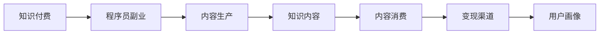

                 

# 程序员副业：知识付费的机遇与挑战

## 1. 背景介绍

在信息技术飞速发展的今天，知识付费已然成为新兴行业之一。随着信息过载的加剧和知识获取方式的多样化，如何高效、系统地获取知识，成为越来越多人的选择。程序员作为技术领域的核心力量，具有丰富的经验和技术积累，无疑成为了知识付费领域的重要参与者。

### 1.1 知识付费的兴起

知识付费的兴起源于信息爆炸时代人们对于知识的渴求和高效获取的需求。大量专业性知识分布在各类平台和社交网络上，用户需要花费大量时间和精力去筛选和整理。知识付费平台通过聚合优质内容，帮助用户快速获取知识，提升个人竞争力，从而实现商业价值。

### 1.2 程序员与知识付费

程序员具备丰富的编程和算法知识，在解决实际技术问题、优化系统性能、提升开发效率等方面积累了大量实践经验。这些经验和技术知识经过结构化整理，可以转化为有价值的知识产品，从而实现个人价值的最大化。

## 2. 核心概念与联系

### 2.1 核心概念概述

为理解程序员在知识付费领域的角色与机遇，本节介绍几个关键概念及其相互联系：

- **知识付费**：指通过付费方式获取知识内容的消费行为，涵盖在线课程、电子书、技术博客、音频讲座等多种形式。

- **程序员副业**：指程序员利用业余时间开展知识付费相关活动，通过出售自己的技术知识、经验或服务获取额外收入。

- **内容生产与消费**：程序员副业的核心在于生产优质知识内容，并通过平台向用户提供消费，实现价值交换。

- **变现渠道**：知识付费平台的多种变现渠道，如订阅、单次购买、会员制、课程等，程序员可借助这些渠道实现变现。

- **用户画像**：知识付费平台的用户群体主要是具备一定技术基础、对职业提升有强烈需求的专业人士，程序员的内容需针对这一群体设计。

### 2.2 核心概念原理和架构的 Mermaid 流程图



### 2.3 核心概念之间的联系

知识付费、程序员副业、内容生产和内容消费、变现渠道、用户画像之间存在紧密的联系。程序员通过生产针对用户画像的内容，利用变现渠道将知识内容转化为消费，从而实现副业收入。

## 3. 核心算法原理 & 具体操作步骤

### 3.1 算法原理概述

基于知识付费的程序员副业，其核心在于如何高效、系统地生产、分发和消费知识内容。本节将从原理角度探讨这一过程。

### 3.2 算法步骤详解

**Step 1: 确定目标受众**
- 分析目标受众的技术水平、需求痛点、兴趣偏好，设计适合的内容主题。

**Step 2: 内容规划与创作**
- 规划内容结构，确定内容形式（如博客、视频、课程等）。
- 创作内容，注重质量与深度，避免浅尝辄止。

**Step 3: 内容发布与推广**
- 选择合适的知识付费平台，如知乎、Coursera、Udemy等。
- 撰写推广文案，利用社交媒体、技术社区、邮件列表等渠道进行推广。

**Step 4: 变现与收入管理**
- 根据平台规则设置定价策略，如按单次购买、订阅制等。
- 管理收入，开设银行账户，使用第三方支付平台等。

**Step 5: 用户反馈与内容优化**
- 收集用户反馈，根据反馈调整内容，提升用户体验。
- 持续更新内容，保持知识的时效性和前瞻性。

### 3.3 算法优缺点

**优点：**
- **多样性**：程序员可利用多种形式的知识内容变现，如课程、书籍、技术博客、音频讲座等。
- **高效性**：利用业余时间，通过系统化的内容生产和分发，实现高效变现。
- **灵活性**：内容创作和变现不受固定时间限制，可根据个人兴趣和时间安排。

**缺点：**
- **高质量内容生产难度大**：需要具备较强的专业知识和写作能力。
- **市场竞争激烈**：知识付费市场竞争激烈，如何突围需要具备一定的市场敏锐度。
- **内容持续更新压力**：保持内容时效性和新颖性需要持续的努力和投入。

### 3.4 算法应用领域

基于知识付费的程序员副业在多个领域都有广泛应用，如：

- **技术培训**：利用代码实例、项目实战、技术讲座等形式，提供系统化的编程培训。
- **技术咨询**：针对特定技术问题，提供定制化的解决方案和指导。
- **软件开发**：提供开源工具、框架和插件，帮助用户提高开发效率。
- **产品推广**：结合自身项目经验，推广新技术、新产品，吸引用户关注。

## 4. 数学模型和公式 & 详细讲解 & 举例说明

### 4.1 数学模型构建

假设程序员创作的知识内容为 $C$，目标受众为 $T$，变现渠道为 $M$，用户画像为 $P$，知识付费平台为 $P$。知识付费的总体模型可表示为：

$$
C = f(T, M, P)
$$

其中 $f$ 表示内容的生产函数。

### 4.2 公式推导过程

为了分析不同因素对知识付费的影响，我们将模型简化为以下公式：

$$
\text{收入} = \text{内容质量} \times \text{用户需求} \times \text{变现效率}
$$

其中：
- $\text{内容质量}$ 代表程序员创作内容的深度和实用性。
- $\text{用户需求}$ 代表目标受众对内容的兴趣和需求。
- $\text{变现效率}$ 代表内容在变现渠道中的传播和转化效率。

### 4.3 案例分析与讲解

以在线编程课程为例，分析影响收入的主要因素：

- **内容质量**：课程的深度、难度、实用性直接影响用户评价和购买意愿。
- **用户需求**：用户对新技术的掌握需求和具体问题解决的需求影响课程的受欢迎程度。
- **变现效率**：课程的推广效果、平台支持、交易成本等影响变现效率。

## 5. 项目实践：代码实例和详细解释说明

### 5.1 开发环境搭建

在进行知识付费内容生产与变现的实践中，首先需要搭建开发环境。以下是Python开发环境的具体配置步骤：

1. **安装Python**：从官网下载并安装最新版本的Python，并确保已添加到系统环境变量中。
2. **安装Git**：下载并安装Git，用于版本控制。
3. **配置开发工具**：安装Visual Studio Code、PyCharm等代码编辑器，以及VSCode插件Git Extension。
4. **安装Python包管理工具**：安装pip和virtualenv，用于管理Python包和创建虚拟环境。
5. **安装相关库**：安装Django、Flask等Web框架，以及Jinja2、Flask-SQLAlchemy等扩展库。

### 5.2 源代码详细实现

以下是一个简单的Python Flask框架实现的博客系统示例代码：

```python
from flask import Flask, render_template, request
from flask_sqlalchemy import SQLAlchemy

app = Flask(__name__)
app.config['SQLALCHEMY_DATABASE_URI'] = 'sqlite:////tmp/test.db'
db = SQLAlchemy(app)

class Blog(db.Model):
    id = db.Column(db.Integer, primary_key=True)
    title = db.Column(db.String(120))
    body = db.Column(db.Text)
    author = db.Column(db.String(80))

@app.route('/')
def index():
    posts = Blog.query.all()
    return render_template('index.html', posts=posts)

@app.route('/post', methods=['POST'])
def create_post():
    title = request.form['title']
    body = request.form['body']
    post = Blog(title=title, body=body, author='John Doe')
    db.session.add(post)
    db.session.commit()
    return 'Post created successfully'

if __name__ == '__main__':
    app.run(debug=True)
```

### 5.3 代码解读与分析

在上述代码中，我们使用了Flask框架和SQLAlchemy库来构建一个简单的博客系统。

- **Flask框架**：用于创建Web应用，提供路由、模板渲染等功能。
- **SQLAlchemy库**：用于数据库操作，支持关系型数据库的ORM（对象关系映射）。
- **代码结构**：
  - `index()` 函数：获取所有博客文章，渲染到模板中展示。
  - `create_post()` 函数：处理提交表单，将博客文章保存到数据库。

### 5.4 运行结果展示

启动服务器后，在浏览器中访问 http://localhost:5000，可以看到博客文章的列表和新增文章的表单。提交表单后，新的博客文章会被保存到数据库中。

## 6. 实际应用场景

### 6.1 在线编程课程

在线编程课程是程序员副业的主要形式之一。通过编写详细的视频教程、编写代码实例、进行项目实战，程序员可以为技术爱好者提供系统化的编程学习资源。

**实际案例**：
- **Udemy平台**：某程序员开发了一套Python编程基础课程，通过视频讲解、代码实例和实战练习，吸引了数千名学生订阅。
- **CSDN博客**：某程序员在CSDN博客上发布了一系列关于机器学习的文章，逐步构建起自己的技术影响力。

### 6.2 技术咨询服务

程序员可以通过提供技术咨询服务，帮助企业解决特定技术问题。这类服务可以是远程技术支持、技术方案咨询等。

**实际案例**：
- **GitHub专家服务**：某程序员在GitHub上提供免费的技术咨询服务，帮助开发者解决代码错误、性能优化等问题。
- **企业技术顾问**：某程序员成为某企业的技术顾问，通过远程会议和邮件方式提供技术支持，每月收入可观。

### 6.3 开源工具和框架

程序员还可以开发开源工具和框架，提升开发效率，吸引社区贡献，实现商业变现。

**实际案例**：
- **Flask框架**：某程序员开发了Flask框架，成为Flask社区的核心开发者之一，并通过社区支持和商业合作获得了丰厚回报。
- **Django ORM**：某程序员对Django ORM进行了优化和扩展，开发了一系列插件，吸引大量开发者使用和贡献，并通过商业赞助和技术咨询获得收入。

### 6.4 未来应用展望

未来，随着技术的发展和市场需求的扩大，程序员副业将迎来更多机遇：

- **AI与机器学习**：结合AI技术，开发智能化编程辅助工具，提升编程效率。
- **区块链技术**：利用区块链技术，创建基于代码贡献的智能合约，实现更加公平的社区激励机制。
- **虚拟现实与增强现实**：开发虚拟现实编程课程和增强现实应用，为用户提供沉浸式学习体验。

## 7. 工具和资源推荐

### 7.1 学习资源推荐

为了帮助程序员快速上手知识付费的内容生产和变现，以下是一些推荐的学习资源：

- **Coursera课程**：提供系统化的编程和算法课程，帮助程序员掌握技术知识。
- **Udemy平台**：提供多种形式的知识付费内容，涵盖编程、项目管理、数据分析等多个领域。
- **Medium博客**：提供大量技术文章和博客，帮助程序员提升写作和知识传播能力。

### 7.2 开发工具推荐

开发高质量的知识付费内容，离不开优质的开发工具支持。以下是一些推荐的开发工具：

- **GitHub**：提供代码托管和版本控制，支持社区协作和开源项目。
- **Visual Studio Code**：轻量级的代码编辑器，支持多种编程语言和插件扩展。
- **Jupyter Notebook**：提供交互式编程环境，支持Python、R等科学计算语言。

### 7.3 相关论文推荐

为了深入理解知识付费和程序员副业的理论基础，以下是一些推荐的相关论文：

- **"The Economics of Knowledge Sharing Platforms"**：探讨知识付费平台的经济学原理和用户行为。
- **"Programming as a Service"**：分析编程服务的商业模型和用户需求。
- **"Open Source Software Development: A Sociotechnical Complexity"**：讨论开源社区的复杂性及其管理策略。

## 8. 总结：未来发展趋势与挑战

### 8.1 研究成果总结

知识付费和程序员副业已经成为技术领域的重要趋势。通过知识付费，程序员不仅能够提升个人影响力，还能实现副业收入。这一过程涉及内容生产、平台选择、用户管理等多个环节，需要系统化的规划和执行。

### 8.2 未来发展趋势

未来，知识付费和程序员副业将呈现以下趋势：

- **内容多样化**：除了传统的视频课程、文章外，AR/VR、AI等新技术将带来更多内容形式。
- **平台多元化**：除了传统平台如Udemy、Coursera，新兴平台如微信读书、知乎live等也将成为重要的变现渠道。
- **社区化建设**：开发者社区将成为知识分享的重要平台，用户之间的互动和协作将进一步促进知识传播。

### 8.3 面临的挑战

尽管知识付费和程序员副业充满机遇，但也面临诸多挑战：

- **内容质量控制**：高质量内容的生产和维护需要大量时间和精力，如何确保内容质量是关键问题。
- **用户管理**：用户画像分析、用户反馈收集、社区管理等需要投入大量资源和精力。
- **平台选择与优化**：不同平台的变现策略和用户群体不同，选择合适的平台并进行优化，需要不断实验和调整。

### 8.4 研究展望

未来，知识付费和程序员副业需要在以下方面进行研究：

- **内容个性化推荐**：利用AI技术对用户进行个性化推荐，提高内容吸引力和用户留存率。
- **用户行为分析**：分析用户行为数据，优化内容生产和社区管理策略。
- **平台生态建设**：构建开发者社区和知识生态，促进知识共享和协作。

## 9. 附录：常见问题与解答

**Q1: 知识付费内容如何定价？**

A: 知识付费内容定价需考虑多个因素，如内容质量、目标受众、市场需求等。一般而言，高质量、高需求的内容可采用较高的定价策略，如订阅制、按需购买等。

**Q2: 如何提升知识付费内容的变现效率？**

A: 提升变现效率需从多个方面入手：
- **平台选择**：选择用户流量大、变现能力强、支持多样化的变现方式的平台。
- **内容优化**：优化内容质量和形式，提高用户体验和转化率。
- **推广策略**：通过SEO、社交媒体、邮件营销等渠道进行有效推广。

**Q3: 如何管理知识付费社区？**

A: 知识付费社区管理需注意以下几个方面：
- **用户互动**：鼓励用户互动，提供评论、讨论、提问等功能。
- **反馈收集**：定期收集用户反馈，根据反馈调整内容策略。
- **社区规范**：制定社区规范，确保内容健康、积极。

通过这些问题的解答，希望能为程序员副业提供更多实用的建议和指导，帮助他们在知识付费领域实现成功。

---

作者：禅与计算机程序设计艺术 / Zen and the Art of Computer Programming

