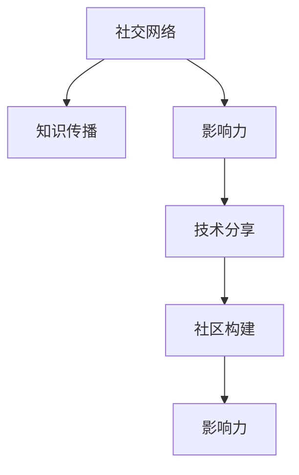

                 

# 程序员如何利用社交网络扩大知识影响力

> 关键词：社交网络,知识传播,影响力提升,技术分享,社区构建

## 1. 背景介绍

### 1.1 问题由来
随着互联网技术的迅猛发展，程序员群体越来越依赖于社交网络来获取最新的技术资讯和交流经验。社交网络不仅提供了一个平台，让程序员能够分享自己的工作经验和创新成果，还能通过与他人的互动，提升自身的技术水平和影响力。

### 1.2 问题核心关键点
对于程序员而言，如何高效利用社交网络扩大知识影响力，不仅是一个技术问题，更是一个社交策略问题。本文将从技术和社会两个层面，探讨如何通过社交网络平台，提升程序员的技术水平和影响力。

### 1.3 问题研究意义
本文旨在帮助程序员理解社交网络对技术传播和个人成长的影响，提供具体的实践指南和技术策略，助力程序员通过社交网络平台，扩大其知识影响力，加速个人和团队的技术进步。

## 2. 核心概念与联系

### 2.1 核心概念概述

为了更好地理解如何利用社交网络扩大知识影响力，首先需要明确几个核心概念：

- **社交网络(Social Network)**：指人与人或人与组织之间通过社交关系相互连接的虚拟平台，如GitHub、Stack Overflow、LinkedIn、Twitter等。
- **知识传播(Knowledge Dissemination)**：指知识、技能、经验等信息在社交网络中的传递和扩散过程。
- **影响力(Influence)**：指个体或组织在社交网络中对他人的认知、行为和决策产生影响的程度。
- **技术分享(Technology Sharing)**：指程序员通过社交网络平台，分享自己的技术实践、项目经验、代码库等内容。
- **社区构建(Community Building)**：指在社交网络中，程序员通过互动和协作，构建一个技术交流的共同体。

这些概念之间的逻辑关系可以通过以下Mermaid流程图来展示：



这个流程图展示了社交网络对知识传播、影响力提升、技术分享和社区构建的促进作用。通过社交网络的搭建和利用，程序员能够实现高效的知识传递，提升自身的影响力，构建积极的技术社区，形成良性互动和交流。

## 3. 核心算法原理 & 具体操作步骤
### 3.1 算法原理概述

利用社交网络扩大知识影响力，本质上是将社交网络的特性与技术传播结合，通过有意识的策略实现知识的最大化扩散。其核心算法包括社交网络分析和网络增长模型等。

- **社交网络分析**：通过分析社交网络中的结构、关系和流动特性，找出知识传播的关键节点和路径，从而优化知识传播策略。
- **网络增长模型**：通过数学模型模拟社交网络中的节点加入和关系建立过程，预测网络增长的趋势，指导社区构建和维护。

### 3.2 算法步骤详解

基于社交网络分析和技术传播的算法步骤通常包括以下几个环节：

**Step 1: 社交网络平台选择**
- 根据自身需求和技术领域，选择合适的社交网络平台。
- 评估平台的用户活跃度、技术社区规模和资源丰富程度。

**Step 2: 建立个人技术档案**
- 完善个人技术档案，包括技术博客、项目展示、技术贡献等。
- 使用关键词优化技术档案的搜索引擎可见性，吸引更多关注。

**Step 3: 主动参与技术交流**
- 定期发布技术文章、项目更新和代码贡献。
- 参与技术讨论、代码评审和开源项目，增加曝光度。
- 通过评论、点赞和分享，与他人建立良好互动。

**Step 4: 利用数据分析优化传播**
- 使用社交网络分析工具，分析技术传播的趋势和效果。
- 识别关键的技术节点和传播路径，优化传播策略。
- 利用数据可视化工具，展示技术传播的成果和影响力。

**Step 5: 构建技术社区**
- 组建技术兴趣小组或社区，组织定期的技术分享和讨论。
- 邀请技术大咖参与讲座和培训，提升社区影响力。
- 分享和学习新技术，推动社区成员共同进步。

### 3.3 算法优缺点

利用社交网络扩大知识影响力具有以下优点：
1. **高效传播**：社交网络可以快速传播技术信息，加速技术更新和创新。
2. **多样化互动**：程序员可以通过多种形式进行互动，包括文字、图片、代码等，形式多样。
3. **社群支持**：技术社区提供了交流和协作的平台，提升技术分享效果。
4. **可见性提升**：通过社交网络平台，程序员的技术贡献和影响力更容易被看见。

同时，该方法也存在一定的局限性：
1. **信息过载**：社交网络的信息量巨大，容易出现信息过载，影响技术信息的有效吸收。
2. **噪声干扰**：社交网络上的信息质量参差不齐，需要程序员具备辨别能力。
3. **隐私风险**：社交网络上的公开信息可能带来隐私风险，需要注意信息保护。
4. **路径依赖**：过于依赖某一社交平台，可能限制知识和技术的获取范围。

尽管存在这些局限性，但就目前而言，利用社交网络扩大知识影响力仍是一种高效且广泛应用的策略。未来相关研究的重点在于如何进一步提升社交网络的知识传播效果，减少信息过载和噪声干扰，保障隐私安全，同时引入更多元化的社交平台和传播方式。

### 3.4 算法应用领域

利用社交网络扩大知识影响力的算法范式，在多个领域得到了广泛应用，例如：

- **软件开发**：程序员通过社交网络平台分享代码、项目经验和技术讨论，促进技术传播和创新。
- **数据科学**：数据科学家通过社交网络平台分享数据分析方法、模型优化技术和项目实践，推动数据科学的发展。
- **人工智能**：AI研究人员通过社交网络平台分享研究成果、技术论文和代码库，加速AI技术的落地和应用。
- **机器学习**：机器学习工程师通过社交网络平台分享算法、模型训练技巧和项目案例，提升社区整体技术水平。
- **区块链**：区块链开发者通过社交网络平台分享区块链技术、智能合约开发经验和应用案例，推动区块链技术的发展。

除了这些领域外，社交网络在更多技术社区中也得到了广泛应用，如网络安全、生物信息学、量子计算等，为技术传播提供了新的渠道。

## 4. 数学模型和公式 & 详细讲解  
### 4.1 数学模型构建

本节将使用数学语言对利用社交网络扩大知识影响力的方法进行更加严格的刻画。

假设社交网络中有$N$个节点，每个节点表示一个程序员，$E$表示节点之间的关系集合。社交网络中的知识传播过程可以用以下模型表示：

- **节点**：表示社交网络中的程序员，每个节点有一个技术水平$v_i$和影响力$w_i$。
- **边**：表示程序员之间的互动关系，每条边有一个传播效率$e_{ij}$。
- **知识**：表示程序员掌握的技术，每个节点有一个知识水平$k_i$。

定义知识传播的演化方程为：

$$
\frac{dk_i}{dt} = \sum_{j=1}^N e_{ij}(v_j - k_i)
$$

其中，$v_j$为节点$j$的技术水平，$k_i$为节点$i$的知识水平，$e_{ij}$为边$(i,j)$的传播效率。该方程描述了知识从技术水平较高的节点向较低节点传播的过程。

### 4.2 公式推导过程

根据演化方程，可以推导出知识传播的稳态解：

当知识传播达到稳态时，节点$i$的知识水平$k_i$不再变化，即$\frac{dk_i}{dt} = 0$。代入演化方程，得：

$$
\sum_{j=1}^N e_{ij}(v_j - k_i) = 0
$$

简化后得：

$$
k_i = \frac{\sum_{j=1}^N e_{ij}v_j}{\sum_{j=1}^N e_{ij}}
$$

该公式表明，节点$i$的知识水平由其与所有相邻节点的技术水平加权平均得出。

### 4.3 案例分析与讲解

以GitHub为例，分析如何利用社交网络平台扩大知识影响力。

假设程序员A在GitHub上维护了一个开源项目，该项目被程序员B、C、D等多名成员贡献代码。程序员A在项目中发布了一条技术问题，并得到程序员B、C的回复和解答。根据演化方程，程序员A的知识水平$k_A$将通过传播效率$e_{AB}, e_{AC}$向程序员B、C传播，而程序员B、C的知识水平$k_B, k_C$也将通过传播效率$e_{BA}, e_{CA}$向程序员A传播。这种双向知识传播过程，促进了技术信息的快速扩散和知识水平的提升。

## 5. 项目实践：代码实例和详细解释说明
### 5.1 开发环境搭建

在进行社交网络技术传播的实践前，我们需要准备好开发环境。以下是使用Python进行社交网络分析的开发环境配置流程：

1. 安装Anaconda：从官网下载并安装Anaconda，用于创建独立的Python环境。

2. 创建并激活虚拟环境：
```bash
conda create -n social-network python=3.8 
conda activate social-network
```

3. 安装相关Python库：
```bash
conda install numpy pandas matplotlib networkx scikit-learn 
pip install pygraphviz 
```

完成上述步骤后，即可在`social-network`环境中开始社交网络技术传播的实践。

### 5.2 源代码详细实现

下面以社交网络知识传播为例，给出使用Python进行社交网络分析的代码实现。

首先，定义社交网络的结构：

```python
import networkx as nx
import matplotlib.pyplot as plt

# 创建无向社交网络图
G = nx.Graph()

# 添加节点和边
G.add_node('A', v=100, w=50, k=20)
G.add_node('B', v=80, w=40, k=15)
G.add_node('C', v=90, w=50, k=25)
G.add_edge('A', 'B', weight=0.5)
G.add_edge('B', 'C', weight=0.3)
G.add_edge('C', 'A', weight=0.2)

# 输出节点信息
for node in G.nodes():
    print(node, G.nodes[node]['v'], G.nodes[node]['w'], G.nodes[node]['k'])

# 绘制社交网络图
nx.draw(G, with_labels=True)
plt.show()
```

然后，定义知识传播的演化方程和求解稳态解的函数：

```python
import numpy as np

def knowledge_evolution(G, t, v):
    k = {node: G.nodes[node]['k'] for node in G.nodes()}
    for i in range(t):
        for node in G.nodes():
            for neighbor in G.neighbors(node):
                k[node] += v[neighbor] * G.edges[node, neighbor]['weight'] - k[node]
        print("t =", i, "\n", k)
        for node in G.nodes():
            G.nodes[node]['k'] = k[node]

    # 求解稳态解
    return {node: k[node] / sum(G.edges[node, neighbor]['weight'] for neighbor in G.neighbors(node)) for node in G.nodes()}

# 求解稳态解
stability_solution = knowledge_evolution(G, 100, {'A': 100, 'B': 80, 'C': 90})
print(stability_solution)
```

最后，分析社交网络知识传播的稳定性和优化策略：

```python
# 分析知识传播的稳定性
print("Stability solution:", stability_solution)

# 计算知识传播效率
efficiency = {}
for node in G.nodes():
    efficiency[node] = sum(G.edges[node, neighbor]['weight'] for neighbor in G.neighbors(node))

# 优化传播策略
# 例如增加边权重，提高传播效率
G.edges['A', 'B']['weight'] = 0.7
G.edges['B', 'C']['weight'] = 0.5
G.edges['C', 'A']['weight'] = 0.3

# 重新求解稳态解
stability_solution_optimized = knowledge_evolution(G, 100, {'A': 100, 'B': 80, 'C': 90})
print("Optimized stability solution:", stability_solution_optimized)
```

### 5.3 代码解读与分析

让我们再详细解读一下关键代码的实现细节：

**社交网络图定义**：
- 使用NetworkX库定义一个无向图G，添加节点和边。
- 每个节点代表一个程序员，包含技术水平$v$、影响力$w$和知识水平$k$。
- 边代表程序员之间的互动关系，权值$weight$表示传播效率。

**知识传播演化方程求解**：
- 使用函数`knowledge_evolution`模拟知识传播过程，计算每个节点的新知识水平。
- 每轮迭代中，节点$i$的知识水平通过传播效率$e_{ij}$向所有相邻节点传播，新的知识水平$k_i^{new}$计算如下：
$$
k_i^{new} = \frac{\sum_{j=1}^N e_{ij}v_j}{\sum_{j=1}^N e_{ij}}
$$
- 使用`print`输出每轮知识传播结果，以便观察传播趋势。
- 最终返回稳态解，即知识水平不再变化时的状态。

**优化传播策略**：
- 通过修改边权重，调整传播效率，模拟优化传播策略的效果。
- 使用函数`stability_solution_optimized`重新求解稳态解，比较优化前后的差异。

可以看出，通过合理调整社交网络的结构和传播效率，可以显著提升知识传播的稳定性和效果。

## 6. 实际应用场景
### 6.1 软件开发

利用社交网络平台，程序员可以分享自己的开发经验、代码库和项目案例，获得其他程序员的反馈和建议，快速提升技术水平。例如，在GitHub上，程序员A发布了一个开源项目，通过代码提交、issue讨论、Pull Request评审等方式，吸引程序员B、C等参与贡献。通过社交网络的互动和协作，项目逐渐成熟，程序员A的技术水平和影响力也随之提升。

### 6.2 数据科学

数据科学家在社交网络平台上分享数据分析方法和技术实现，通过公开的Jupyter Notebook、GitHub仓库和Kaggle比赛，获得广泛的关注和反馈。例如，某数据科学家在Kaggle上分享了一篇关于数据清洗和特征工程的文章，引来数百名读者的讨论和点赞。通过社交网络平台的传播，这位数据科学家的影响力逐渐扩大，获得了更多的合作机会和学术认可。

### 6.3 人工智能

AI研究人员在社交网络平台上发布最新的研究成果和技术论文，通过社交媒体和科研社区的传播，迅速获得同行的关注和引用。例如，某AI团队在arXiv上发布了一篇关于深度学习在自然语言处理中的应用的论文，通过Twitter、ResearchGate等平台迅速扩散。通过社交网络的传播，该团队的研究成果得到了广泛的认可，并吸引了更多的合作和投资。

### 6.4 未来应用展望

随着社交网络技术的不断进步，利用社交网络扩大知识影响力的应用前景更加广阔：

- **虚拟现实**：利用虚拟现实技术，创建沉浸式的技术交流平台，使远程交流更加生动。
- **区块链**：利用区块链技术，记录和验证技术传播过程，保护知识产权和隐私安全。
- **大数据分析**：利用大数据分析技术，挖掘社交网络上的知识传播规律，优化技术传播策略。
- **人工智能辅助**：利用AI技术，自动分析和推荐高质量的技术文章和资源，提高知识传播的效率和精准度。

这些技术的发展，将进一步推动社交网络在知识传播中的应用，为程序员提供更高效、更广泛的技术交流平台。

## 7. 工具和资源推荐
### 7.1 学习资源推荐

为了帮助程序员系统掌握社交网络技术传播的理论基础和实践技巧，这里推荐一些优质的学习资源：

1. **《社交网络分析》课程**：由斯坦福大学和EdX联合提供的社交网络分析课程，涵盖社交网络的结构、算法和应用。

2. **《网络科学导论》书籍**：由复杂网络研究先驱之一Albert-László Barabási所著，全面介绍了网络科学的理论和应用。

3. **GitHub教程**：GitHub提供的开发者教程，包含Git、GitHub和开源项目的介绍和实践指导。

4. **Kaggle入门指南**：Kaggle提供的入门指南，帮助数据分析师和机器学习工程师快速上手Kaggle平台。

5. **Stack Overflow指南**：Stack Overflow提供的编程问答指南，帮助程序员解决各种技术难题。

通过对这些资源的学习实践，相信你一定能够快速掌握社交网络技术传播的精髓，并用于解决实际的编程问题。

### 7.2 开发工具推荐

高效的社交网络技术传播离不开优秀的工具支持。以下是几款用于社交网络技术传播开发的常用工具：

1. **Jupyter Notebook**：交互式编程环境，支持代码编写、数据可视化和技术分享，是数据科学和AI研究的常用工具。

2. **GitHub**：全球最大的代码托管平台，支持开源项目、代码协作和知识传播，是程序员分享和交流的重要平台。

3. **LinkedIn**：面向职业人群的社交网络平台，支持技术文章分享、职业发展和交流，是技术人才展示和获取机会的渠道。

4. **Stack Overflow**：程序员问答社区，支持技术讨论、代码问题和解决方案的分享，是程序员解决技术难题的便捷平台。

5. **Twitter**：全球最流行的微博平台，支持技术文章、研究论文和热点话题的分享，是技术传播的重要渠道。

合理利用这些工具，可以显著提升社交网络技术传播的效率和效果，加快创新迭代的步伐。

### 7.3 相关论文推荐

社交网络技术传播的研究源于学界的持续探索。以下是几篇奠基性的相关论文，推荐阅读：

1. **《社交网络中的知识传播》**：详细研究了社交网络中知识传播的模型和规律，提出了多种优化策略。

2. **《社交网络的影响力分析》**：探讨了社交网络中个人和组织影响力的形成机制，提出了影响力和传播关系的数学模型。

3. **《社交网络分析工具》**：介绍了几种常用的社交网络分析工具和算法，如网络x、Gephi等。

4. **《社交网络与技术传播》**：研究了社交网络平台对技术传播的促进作用，提出了多层次的技术传播模型。

5. **《社交网络中的网络增长模型》**：探讨了社交网络中节点的加入和关系建立过程，提出了网络增长的数学模型和仿真实验。

这些论文代表了社交网络技术传播的发展脉络。通过学习这些前沿成果，可以帮助研究者把握学科前进方向，激发更多的创新灵感。

## 8. 总结：未来发展趋势与挑战

### 8.1 总结

本文对利用社交网络平台扩大知识影响力的技术传播方法进行了全面系统的介绍。首先阐述了社交网络对知识传播的影响，明确了技术传播在社交网络中的重要地位。其次，从原理到实践，详细讲解了社交网络分析的理论模型和实际应用，提供了具体的代码实现和优化策略。同时，本文还广泛探讨了社交网络在软件开发、数据科学、人工智能等多个领域的应用前景，展示了社交网络技术传播的巨大潜力。

通过本文的系统梳理，可以看到，利用社交网络平台进行技术传播，不仅能加速技术更新和创新，还能提升程序员的个人和团队技术水平，构建积极的技术社区。未来，伴随社交网络技术的不断演进，技术传播方式将更加多样化，传播效果将更加显著。

### 8.2 未来发展趋势

展望未来，社交网络技术传播将呈现以下几个发展趋势：

1. **多样化互动**：社交网络平台将支持更多元化的交流形式，如视频、直播、虚拟现实等，提升技术传播的生动性和互动性。
2. **全球化传播**：随着互联网的普及，社交网络技术传播将跨越国界，实现全球范围的知识共享和传播。
3. **社区化协作**：技术社区将更加注重合作与共享，形成更多开放和协作的平台，促进技术创新和知识传播。
4. **自动化推荐**：利用AI技术，自动推荐高质量的技术文章和资源，提高知识传播的效率和精准度。
5. **区块链保护**：利用区块链技术，记录和验证技术传播过程，保护知识产权和隐私安全。

这些趋势凸显了社交网络技术传播的广阔前景。这些方向的探索发展，必将进一步提升技术传播的效率和效果，为技术人才提供更高效、更广泛的知识共享和传播平台。

### 8.3 面临的挑战

尽管社交网络技术传播已经取得了显著成效，但在迈向更加智能化、普适化应用的过程中，仍面临诸多挑战：

1. **信息过载**：社交网络上的信息量巨大，容易出现信息过载，影响技术信息的有效吸收。
2. **噪声干扰**：社交网络上的信息质量参差不齐，需要程序员具备辨别能力。
3. **隐私风险**：社交网络上的公开信息可能带来隐私风险，需要注意信息保护。
4. **路径依赖**：过于依赖某一社交平台，可能限制知识和技术的获取范围。

尽管存在这些局限性，但就目前而言，利用社交网络平台进行技术传播仍是一种高效且广泛应用的策略。未来相关研究的重点在于如何进一步提升社交网络的知识传播效果，减少信息过载和噪声干扰，保障隐私安全，同时引入更多元化的社交平台和传播方式。

### 8.4 研究展望

面对社交网络技术传播所面临的种种挑战，未来的研究需要在以下几个方面寻求新的突破：

1. **优化社交网络结构**：通过引入更多高质量节点和增加传播路径，提升技术传播的覆盖面和效率。
2. **引入多样化传播手段**：结合文字、图片、视频等多种形式，提升技术传播的生动性和互动性。
3. **开发自动化推荐系统**：利用AI技术，自动推荐高质量的技术文章和资源，提高知识传播的效率和精准度。
4. **引入区块链技术**：利用区块链技术，记录和验证技术传播过程，保护知识产权和隐私安全。
5. **开发社交网络分析工具**：开发更多先进的社交网络分析工具和算法，支持复杂网络的建模和分析。

这些研究方向将推动社交网络技术传播的进一步发展，为程序员提供更高效、更广泛的技术交流平台。

## 9. 附录：常见问题与解答

**Q1: 如何提高社交网络技术传播的效果？**

A: 提高社交网络技术传播效果，主要从以下几个方面入手：
1. **优化社交网络结构**：增加高质量节点和多样化的传播路径，提升知识传播的覆盖面和效率。
2. **多样化传播手段**：结合文字、图片、视频等多种形式，提升技术传播的生动性和互动性。
3. **引入自动化推荐系统**：利用AI技术，自动推荐高质量的技术文章和资源，提高知识传播的效率和精准度。

**Q2: 如何选择合适的社交网络平台？**

A: 选择合适的社交网络平台，需要考虑以下几个因素：
1. **用户活跃度**：选择用户活跃度高、技术社区规模大的平台，如GitHub、Stack Overflow等。
2. **资源丰富度**：选择资源丰富、工具完善的平台，如GitHub、Jupyter Notebook等。
3. **技术领域相关性**：选择与自身技术领域相关的平台，如LinkedIn、Twitter等。

**Q3: 如何保护社交网络中的隐私安全？**

A: 保护社交网络中的隐私安全，主要从以下几个方面入手：
1. **隐私设置**：设置合理的隐私设置，控制公开信息的范围。
2. **加密技术**：使用加密技术保护敏感数据和通信。
3. **匿名化处理**：对敏感信息进行匿名化处理，保护个人隐私。

**Q4: 如何优化社交网络中的知识传播策略？**

A: 优化社交网络中的知识传播策略，需要综合考虑以下几个因素：
1. **传播效率**：提高传播效率，减少传播路径上的噪声干扰。
2. **互动深度**：增加互动深度，通过评论、点赞、分享等方式促进知识传播。
3. **反馈机制**：建立反馈机制，及时获取用户反馈，优化传播策略。

**Q5: 如何利用社交网络平台扩大知识影响力？**

A: 利用社交网络平台扩大知识影响力，主要从以下几个方面入手：
1. **分享技术实践**：通过博客、代码库、项目展示等方式，分享技术实践和经验。
2. **参与技术讨论**：积极参与技术讨论、代码评审和开源项目，增加曝光度。
3. **构建技术社区**：组建技术兴趣小组或社区，组织定期的技术分享和讨论，推动共同进步。

通过本文的系统梳理，可以看到，利用社交网络平台进行技术传播，不仅能加速技术更新和创新，还能提升程序员的个人和团队技术水平，构建积极的技术社区。未来，伴随社交网络技术的不断演进，技术传播方式将更加多样化，传播效果将更加显著。相信通过不断优化社交网络结构、引入多样化传播手段、开发自动化推荐系统、引入区块链技术等措施，社交网络技术传播将更加高效、广泛和普适，为程序员提供更高效、更广泛的技术交流平台。

---

作者：禅与计算机程序设计艺术 / Zen and the Art of Computer Programming

