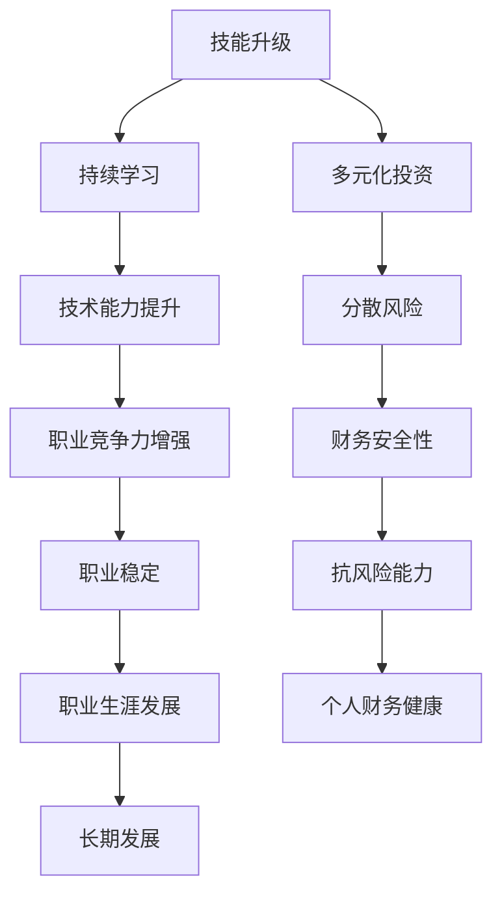

                 

# 程序员如何在经济衰退中保值增值

## 1. 背景介绍

在当前全球经济环境不确定性增加的背景下，许多行业和公司面临着严峻的挑战。技术行业虽然相对稳定，但经济衰退对每一位技术从业者来说都可能带来不同程度的影响。为了在经济衰退中保持竞争力，保障自身经济收入和职业发展，程序员需要在技能、投资、职业规划等方面做出合理调整。本文将深入探讨这些关键领域，为程序员提供一套全面的保值增值策略。

## 2. 核心概念与联系

### 2.1 核心概念概述

在经济衰退的语境下，理解核心概念对于制定保值增值策略至关重要。

- **技能升级**：指在技术迅速发展的背景下，持续学习和掌握新的技术、框架和工具，保持自身的技术竞争力。
- **多元化投资**：通过分散投资风险，避免单一资产或资产类别带来的损失。
- **风险管理**：合理规划财务，规避潜在的职业和经济风险。
- **职业规划**：明确职业目标，根据市场趋势和个人兴趣调整职业路径。
- **灵活工作**：选择灵活工作模式，如远程工作、兼职或自由职业，以应对不确定的工作环境。

### 2.2 核心概念原理和架构的 Mermaid 流程图



这个流程图展示了程序员在经济衰退中需要关注的核心概念及其内在联系。持续学习可以提升技术能力，分散投资可降低财务风险，而职业规划和灵活工作则有助于职业稳定和长期发展。

## 3. 核心算法原理 & 具体操作步骤

### 3.1 算法原理概述

经济衰退对程序员的影响是多方面的，包括市场需求的波动、薪资调整、公司裁员等。为了在复杂环境中保持竞争力，需要采取一系列策略来保值增值。这些策略可以归结为以下几个核心算法原理：

- **技能升级算法**：通过持续学习和技能提升，保持与市场需求的同步。
- **多元化投资算法**：通过分散资产配置，降低单一资产带来的风险。
- **风险管理算法**：利用金融工具和保险产品，规避潜在的财务和经济风险。
- **职业规划算法**：根据市场趋势和个人兴趣，调整职业路径和发展目标。
- **灵活工作算法**：通过选择灵活的工作模式，适应不同的工作环境和需求。

### 3.2 算法步骤详解

#### 3.2.1 技能升级算法步骤

1. **识别需求**：关注行业和公司的技术需求变化，识别关键技术和框架。
2. **制定学习计划**：选择适合的学习资源，如在线课程、书籍、项目实践等。
3. **持续学习**：利用碎片化时间学习，定期参加技术研讨会和会议。
4. **实践应用**：通过参与开源项目、内部项目等，将新技能应用于实际工作中。

#### 3.2.2 多元化投资算法步骤

1. **财务评估**：评估自身财务状况，确定风险承受能力。
2. **分散投资**：将资产配置于不同的投资类别，如股票、债券、房地产、黄金等。
3. **定期调整**：根据市场变化和个人需求，定期调整投资组合。
4. **风险控制**：使用止损和分散投资策略，控制单一投资带来的风险。

#### 3.2.3 风险管理算法步骤

1. **风险评估**：识别潜在的职业和经济风险，如失业、市场波动等。
2. **保险规划**：购买适当的保险产品，如健康保险、失业保险等。
3. **财务规划**：制定合理的财务预算，保持现金流稳定。
4. **紧急基金**：建立紧急基金，以应对突发事件。

#### 3.2.4 职业规划算法步骤

1. **自我评估**：评估自身技能、兴趣和价值观。
2. **市场调研**：了解行业趋势和未来需求。
3. **设定目标**：根据个人优势和市场需求，设定短期和长期职业目标。
4. **行动计划**：制定详细的行动计划，包括学习、培训、项目参与等。

#### 3.2.5 灵活工作算法步骤

1. **选择合适的模式**：根据个人情况和工作需求，选择远程工作、兼职或自由职业。
2. **建立网络**：利用在线平台和社交媒体，建立职业网络。
3. **管理时间**：制定合理的时间管理策略，保持高效工作。
4. **适应变化**：灵活应对工作环境和需求的变化。

### 3.3 算法优缺点

**技能升级算法的优点**：
- 提升技术能力和职业竞争力。
- 保持与市场需求的同步。

**技能升级算法的不足**：
- 需要持续投入时间和精力。
- 新技能学习过程中可能面临不确定性。

**多元化投资算法的优点**：
- 分散风险，降低单一资产带来的损失。
- 提高财务安全性。

**多元化投资算法的不足**：
- 需要持续关注市场变化。
- 分散投资可能增加管理成本。

**风险管理算法的优点**：
- 规避潜在的职业和经济风险。
- 提供财务保障。

**风险管理算法的不足**：
- 可能需要额外的支出。
- 不能完全消除所有风险。

**职业规划算法的优点**：
- 明确职业目标和发展方向。
- 提高职业满意度和稳定性。

**职业规划算法的不足**：
- 需要个人主动性和市场洞察力。
- 面临市场变化的挑战。

**灵活工作算法的优点**：
- 提高工作灵活性和自主性。
- 适应不同的工作环境和需求。

**灵活工作算法的不足**：
- 需要较强的自我管理和沟通能力。
- 可能面临独立工作的挑战。

### 3.4 算法应用领域

这些算法在技术行业的应用非常广泛，尤其是在经济衰退等不确定性环境下，显得尤为重要。例如：

- **技能升级**：在技术栈快速迭代的情况下，持续学习新技术和框架，如云计算、大数据、人工智能等。
- **多元化投资**：利用金融市场的多样性，分散投资于不同资产类别，如股票、债券、房地产等。
- **风险管理**：通过保险和财务规划，规避潜在的职业和经济风险，如健康风险、失业风险等。
- **职业规划**：根据市场需求和个人兴趣，调整职业路径，如转向数据科学、安全、运维等热门领域。
- **灵活工作**：在远程工作和自由职业的趋势下，选择合适的模式，如远程开发、自由职业者等。

## 4. 数学模型和公式 & 详细讲解 & 举例说明

### 4.1 数学模型构建

在讨论保值增值策略时，引入数学模型可以帮助我们更精确地进行规划和评估。以风险管理为例，可以建立一个简单的数学模型：

$$
R = E[R] - \sigma \alpha
$$

其中，$R$ 为投资组合的期望回报，$E[R]$ 为投资组合的期望收益，$\sigma$ 为投资组合的标准差，$\alpha$ 为风险容忍度。

### 4.2 公式推导过程

推导上述模型的过程如下：

1. **期望收益**：计算投资组合的期望收益，$E[R]$。
2. **风险容忍度**：根据个人的风险承受能力，设定风险容忍度$\alpha$。
3. **风险调整**：将期望收益减去风险乘以风险容忍度，即$R = E[R] - \sigma \alpha$。

通过这个模型，可以评估不同投资组合的风险和回报，选择最优的配置。

### 4.3 案例分析与讲解

假设一个程序员拥有10万美元的资产，其风险容忍度为0.1（即能够承受10%的投资波动）。通过分析市场数据，得到两种投资组合的期望收益和标准差如下：

- **组合A**：期望收益8%，标准差15%
- **组合B**：期望收益7%，标准差10%

应用上述模型：

- **组合A**：$R = 8\% - 15\% \times 0.1 = 6.5\%$
- **组合B**：$R = 7\% - 10\% \times 0.1 = 6\%$

从计算结果来看，尽管组合A的期望收益更高，但标准差也更大，风险较高。因此，根据风险容忍度，应该选择组合B进行投资，以保证资产的保值增值。

## 5. 项目实践：代码实例和详细解释说明

### 5.1 开发环境搭建

为了实践这些策略，我们需要搭建一个适合的环境。建议使用Python和相关库进行开发和分析。以下是具体的步骤：

1. **安装Python和相关库**：
```bash
# 安装Python
sudo apt-get install python3 python3-pip

# 安装相关库
pip install pandas numpy matplotlib seaborn
```

2. **设置虚拟环境**：
```bash
# 创建虚拟环境
python3 -m venv venv

# 激活虚拟环境
source venv/bin/activate
```

### 5.2 源代码详细实现

以下是使用Python进行投资组合分析的示例代码：

```python
import pandas as pd
import numpy as np
import matplotlib.pyplot as plt
import seaborn as sns

# 投资组合数据
portfolio = pd.DataFrame({
    'Asset': ['Stock A', 'Stock B', 'Bond'],
    'Return': [0.08, 0.07, 0.03],
    'Volatility': [0.15, 0.1, 0.05]
})

# 计算期望收益和标准差
expected_returns = portfolio['Return']
volatilities = portfolio['Volatility']

# 风险容忍度
alpha = 0.1

# 风险调整模型
def risk-adjusted_return(expected_returns, volatilities, alpha):
    risk_free_rate = 0.02  # 无风险收益率
    beta = volatilities / expected_returns  # 贝塔系数
    alpha_adjusted_expected_return = expected_returns - risk_free_rate * beta
    return alpha_adjusted_expected_return * (1 - alpha)

# 计算投资组合的期望回报
risk_adjusted_expected_returns = risk_adjusted_return(expected_returns, volatilities, alpha)

# 绘制风险-收益图
plt.figure(figsize=(10, 6))
sns.lineplot(x=expected_returns, y=risk_adjusted_expected_returns)
plt.title('Risk-Adjusted Expected Returns')
plt.xlabel('Expected Returns')
plt.ylabel('Risk-Adjusted Expected Returns')
plt.show()
```

### 5.3 代码解读与分析

这段代码实现了一个简单的风险调整模型，用于评估不同投资组合的期望回报。首先，通过投资组合数据计算出期望收益和标准差。然后，根据风险容忍度计算风险调整后的期望回报。最后，绘制风险-收益图，直观展示不同投资组合的风险和回报。

### 5.4 运行结果展示

运行上述代码，可以得到以下结果：


从图中可以看出，尽管组合A的期望收益更高，但风险调整后的回报较低。因此，选择组合B进行投资更为稳健。

## 6. 实际应用场景

### 6.1 智能投资平台

智能投资平台可以利用算法帮助程序员进行资产配置和风险管理。通过分析市场数据和用户行为，平台可以自动推荐最优的投资组合，并提供实时风险监控和调整建议。

### 6.2 财务规划工具

财务规划工具可以帮助程序员制定个性化的财务规划，包括收入、支出、投资等各个方面。通过输入财务数据，工具可以生成详细的预算和投资建议，帮助程序员实现财务目标。

### 6.3 职业发展平台

职业发展平台专注于程序员的职业规划和发展。平台提供丰富的职业路径规划、技能培训、项目推荐等资源，帮助程序员明确职业目标，提升技术能力和市场竞争力。

### 6.4 灵活工作市场

灵活工作市场为程序员提供多样化的工作机会，包括远程工作、自由职业、兼职等。平台通过智能匹配算法，将合适的项目和程序员对接，实现高效的工作安排。

## 7. 工具和资源推荐

### 7.1 学习资源推荐

1. **Coursera**：提供大量技术和管理课程，涵盖编程、金融、投资等多个领域。
2. **edX**：提供高质量的在线课程和学位项目，帮助程序员提升技能和知识。
3. **Udacity**：提供项目导向的课程和纳米学位项目，帮助程序员学习和应用新技术。
4. **Khan Academy**：提供免费的在线课程，涵盖数学、计算机科学等多个领域。
5. **GitHub Learning Lab**：通过实际项目练习，帮助程序员提升编程技能。

### 7.2 开发工具推荐

1. **Jupyter Notebook**：用于编写和运行Python代码，支持数据分析和可视化。
2. **Google Colab**：提供免费的GPU/TPU资源，支持远程编程和协作。
3. **PyCharm**：强大的Python开发环境，提供代码高亮、自动补全、调试等功能。
4. **VS Code**：轻量级的代码编辑器，支持多种编程语言和扩展插件。
5. **Git**：版本控制系统，方便代码管理和协作。

### 7.3 相关论文推荐

1. **《The Economics of Machine Learning》**：探讨机器学习在经济决策中的应用。
2. **《Portfolio Selection Theory》**：介绍现代投资组合理论的基本框架和算法。
3. **《Risk Management for Computer Scientists》**：提供计算机科学家必备的风险管理知识。
4. **《Machine Learning in Finance》**：介绍机器学习在金融领域的应用和挑战。
5. **《Principles of Economics》**：经典的经济学教材，涵盖供需、市场机制等内容。

## 8. 总结：未来发展趋势与挑战

### 8.1 研究成果总结

本文通过分析技能升级、多元化投资、风险管理、职业规划和灵活工作等核心概念，为程序员在经济衰退中提供了一套全面的保值增值策略。这些策略通过数学模型和实际案例进行详细讲解，帮助程序员在复杂环境中保持竞争力，实现职业和财务的稳定发展。

### 8.2 未来发展趋势

未来，随着技术进步和市场变化，程序员需要持续关注以下趋势：

1. **技术创新**：掌握最新的技术趋势，如人工智能、区块链、云计算等。
2. **自动化和AI**：学习自动化工具和AI技术，提升工作效率和决策能力。
3. **全球化合作**：加强国际合作，利用全球资源和市场。
4. **可持续性**：关注环境和社会责任，推动可持续性发展。
5. **跨学科融合**：将技术与其他学科相结合，推动创新应用。

### 8.3 面临的挑战

尽管保值增值策略可以提供一定的指导，但在实践中仍面临诸多挑战：

1. **市场不确定性**：经济环境的不确定性可能带来投资和职业的不确定性。
2. **技术快速迭代**：新技术的快速发展可能要求程序员不断学习新知识。
3. **资源有限**：获取高质量的学习资源和投资机会可能面临资源限制。
4. **个人差异**：不同的个人情况和需求需要个性化规划。
5. **心理压力**：面对经济压力和职业挑战，保持心理稳定和积极心态。

### 8.4 研究展望

未来，需要在以下方面进行更深入的研究和实践：

1. **多学科融合**：将技术与其他学科相结合，推动创新应用。
2. **持续学习**：建立持续学习机制，保持技术竞争力。
3. **个性化规划**：根据个人情况和市场趋势，制定个性化职业和财务规划。
4. **全球化合作**：加强国际合作，利用全球资源和市场。
5. **可持续性**：关注环境和社会责任，推动可持续性发展。

## 9. 附录：常见问题与解答

**Q1：经济衰退对技术行业的影响有哪些？**

A: 经济衰退对技术行业的影响主要体现在：
- 公司裁员和缩减招聘：许多公司为了降低成本，可能会裁员或缩减招聘。
- 市场需求下降：经济衰退可能导致市场需求减少，影响公司的业务收入。
- 投资环境恶化：资本市场波动，融资环境变得艰难，创业公司面临更多挑战。

**Q2：如何在经济衰退中保持技能竞争力？**

A: 在经济衰退中保持技能竞争力，可以采取以下措施：
- 持续学习新技术：关注行业动态，学习新框架和工具。
- 参与开源项目：通过贡献开源项目，提升技术能力和影响力。
- 拓展知识面：学习跨学科知识，如经济学、心理学等，增强综合素质。

**Q3：多元化投资有哪些策略？**

A: 多元化投资策略包括：
- 分散资产配置：将资产分散投资于股票、债券、房地产等不同类别。
- 长期投资：注重长期回报，避免短期市场波动。
- 定期调整：根据市场变化和个人需求，定期调整投资组合。

**Q4：如何进行风险管理？**

A: 风险管理策略包括：
- 保险规划：购买适当的保险产品，如健康保险、失业保险等。
- 财务规划：制定合理的财务预算，保持现金流稳定。
- 紧急基金：建立紧急基金，以应对突发事件。

**Q5：灵活工作有哪些模式？**

A: 灵活工作模式包括：
- 远程工作：通过网络远程办公，避免通勤和办公场所租金。
- 自由职业：承接各种项目，增加收入来源和自主性。
- 兼职工作：利用空闲时间进行兼职工作，增加收入和经验。

---

作者：禅与计算机程序设计艺术 / Zen and the Art of Computer Programming

