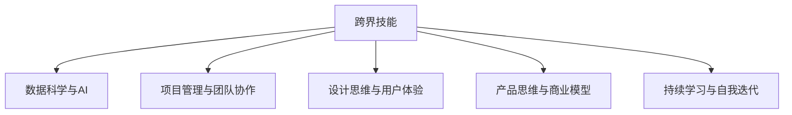

                 

# 程序员如何培养跨界知识变现能力

## 1. 背景介绍

随着科技的飞速发展，程序员已不再局限于传统的软件开发和IT运维岗位，他们的职业边界正在不断拓宽。面对日新月异的技术和行业需求，跨界技能成为程序员必不可少的素质。跨界知识变现能力，即利用自身核心技术优势，结合其他领域知识，创造实际价值的能力，对于程序员的未来发展至关重要。本文将从技术、管理、人文等多个维度，探讨如何培养这种跨界知识变现能力，帮助程序员在职业生涯中取得更大突破。

## 2. 核心概念与联系

### 2.1 核心概念概述

为更好地理解跨界知识变现能力，本节将介绍几个密切相关的核心概念：

- 跨界技能（Interdisciplinary Skills）：指结合计算机技术和其他学科领域知识，创造新应用场景的能力。比如，将算法与医疗结合，实现精准医学诊断。

- 数据科学与AI：大数据与人工智能是程序员跨界的重要工具，涵盖数据收集、处理、分析与建模等技能。

- 项目管理与团队协作：软件开发不仅仅是代码编写，项目管理、团队协作、敏捷开发等能力同样重要，有助于高效完成项目。

- 设计思维与用户体验：跨界项目往往涉及用户体验设计，掌握设计思维方法，可以更好地满足用户需求。

- 产品思维与商业模型：将技术产品化，需要了解市场、用户需求、商业模式等知识，才能真正实现技术价值。

- 持续学习与自我迭代：技术不断发展，程序员需要不断学习新知识，并根据反馈迭代改进。

这些核心概念之间的逻辑关系可以通过以下Mermaid流程图来展示：



这个流程图展示了几大核心概念之间的关系：跨界技能是核心，其中数据科学与AI是工具，项目管理与团队协作、设计思维与用户体验、产品思维与商业模型是支持，而持续学习与自我迭代是方法论。这些概念共同构成了跨界知识变现的完整框架。

## 3. 核心算法原理 & 具体操作步骤
### 3.1 算法原理概述

跨界知识变现能力的培养，并非一蹴而就，而是一个系统性的学习和实践过程。其核心算法原理包括以下几个关键步骤：

1. **技能识别与评估**：确定自身核心技术优势，识别潜在的跨界机会。
2. **知识迁移与整合**：将其他领域知识引入技术领域，进行融合创新。
3. **项目实践与反馈**：在实际项目中应用跨界知识，通过用户反馈进行迭代改进。
4. **经验总结与知识共享**：总结项目经验，撰写技术博客、开源代码、参加技术社区等，与他人共享知识。

### 3.2 算法步骤详解

**Step 1: 技能识别与评估**

- 列出自身技术栈，如编程语言、框架、工具等。
- 分析现有技术的应用场景，评估其在其他领域的潜在价值。
- 调研相关领域的市场需求和技术趋势，识别跨界机会。

**Step 2: 知识迁移与整合**

- 学习相关领域的基础知识，如数学、统计、医学、心理学等。
- 结合自身技术优势，将其他领域知识融合进技术应用。
- 开发小型原型项目，验证跨界思想的可行性。

**Step 3: 项目实践与反馈**

- 选择有潜力的跨界项目，如医疗数据处理、智能教育系统等。
- 制定项目计划，明确目标、团队角色、交付时间等。
- 在项目实践中不断调整和优化，确保项目成功。

**Step 4: 经验总结与知识共享**

- 总结项目经验，形成文档、代码、视频等形式的输出。
- 将跨界项目展示于技术社区、博客、开源平台等，分享知识。
- 参与行业论坛、技术会议，扩大影响力。

### 3.3 算法优缺点

跨界知识变现能力培养的算法具有以下优点：
1. 多元化职业发展。跨界技能可以打开更多的职业选择，增加收入渠道。
2. 提升综合竞争力。跨界知识能增强技术解决实际问题的能力，提高团队协作效率。
3. 创造新的应用场景。将技术应用到其他领域，可以创造新的商业模式和价值。

但同时也存在一些缺点：
1. 学习成本高。跨界知识需要掌握多种技能，耗费时间和精力。
2. 风险高。跨界项目可能面临需求变化、技术挑战等不确定性。
3. 需要持续学习。跨界领域不断发展，需要不断更新知识。

尽管存在这些局限，但通过有效的学习、实践和经验积累，跨界知识变现能力仍是大有可为的。

### 3.4 算法应用领域

跨界知识变现能力的应用领域广泛，包括但不限于：

- 大数据与医疗：利用机器学习技术进行医学影像分析、疾病预测等。
- 人工智能与教育：开发智能辅导系统、在线教育平台等。
- 区块链与金融：利用区块链技术改进金融支付、供应链管理等。
- 机器人与制造业：将机器人技术应用到智能制造、自动化生产等。
- 数据分析与市场研究：通过大数据分析挖掘商业洞察，指导决策。

## 4. 数学模型和公式 & 详细讲解  
### 4.1 数学模型构建

跨界知识变现能力的培养涉及多个领域，其数学模型可以从以下几个方面构建：

1. **技术评估模型**：评估现有技术的市场应用价值和跨界潜力。
2. **知识融合模型**：构建不同领域知识融合的数学框架。
3. **项目成功模型**：通过用户反馈、项目成果等指标评估项目成功度。

### 4.2 公式推导过程

**技术评估模型**：

$$
评估值 = \alpha \times 技术优势 + \beta \times 市场需求 + \gamma \times 技术趋势
$$

其中 $\alpha, \beta, \gamma$ 为权重，具体值根据实际情况确定。

**知识融合模型**：

设 $A$ 为技术优势，$B$ 为跨界领域知识，$C$ 为跨界项目产出。

$$
C = f(A, B) = A \odot B
$$

其中 $\odot$ 表示融合操作，具体形式需要根据应用场景设计。

**项目成功模型**：

设 $E$ 为项目评估指标，如用户满意度、项目完成度等。

$$
E = g(C, F) = C \times F
$$

其中 $F$ 为外部因素，如市场环境、用户需求等。

### 4.3 案例分析与讲解

**案例1: 大数据与医疗**

某程序员熟悉大数据技术，希望在医疗领域应用。

**技术评估**：

- 技术优势：掌握大数据处理、机器学习算法。
- 市场需求：医疗数据量不断增长，需求强烈。
- 技术趋势：深度学习、自然语言处理等技术不断发展。

评估值：$评估值 = 0.8 \times 技术优势 + 0.15 \times 市场需求 + 0.05 \times 技术趋势 = 0.9$

**知识融合**：

将大数据技术与医疗数据处理需求结合，开发疾病预测系统。

$$
C = A \odot B = 大数据处理 \odot 疾病预测模型 = 大数据处理平台 \times 疾病预测算法
$$

**项目成功**：

通过医院数据验证系统效果，用户反馈满意。

$$
E = C \times F = 疾病预测系统 \times 用户反馈 = 0.9 \times 0.95 = 0.855
$$

通过上述案例，可以看到跨界知识变现能力的培养过程。

## 5. 项目实践：代码实例和详细解释说明
### 5.1 开发环境搭建

在项目实践前，需要搭建适合跨界项目开发的开发环境。以下是Python环境配置流程：

1. 安装Anaconda：从官网下载并安装Anaconda，用于创建独立的Python环境。

2. 创建并激活虚拟环境：
```bash
conda create -n cross-discipline python=3.8 
conda activate cross-discipline
```

3. 安装必要的Python库：
```bash
pip install numpy pandas matplotlib sklearn scikit-learn jupyter notebook
```

4. 配置项目开发工具：如Visual Studio Code，Git等。

完成上述步骤后，即可在`cross-discipline`环境中开始项目开发。

### 5.2 源代码详细实现

以大数据与医疗项目为例，开发疾病预测系统：

**Step 1: 数据预处理**

- 收集医疗数据集，如电子病历、影像等。
- 数据清洗、特征提取、归一化等预处理。

**Step 2: 模型构建**

- 选择适当的机器学习模型，如随机森林、深度学习等。
- 在数据集上训练模型，验证模型效果。

**Step 3: 系统集成**

- 将模型集成到医疗系统中，实现自动诊断。
- 设计用户界面，提供可视化结果展示。

**Step 4: 项目评估**

- 收集用户反馈，评估系统效果。
- 迭代优化，提升系统性能。

**代码实现**：

```python
import pandas as pd
from sklearn.model_selection import train_test_split
from sklearn.ensemble import RandomForestClassifier
from sklearn.metrics import accuracy_score

# Step 1: 数据预处理
data = pd.read_csv('medical_data.csv')
X_train, X_test, y_train, y_test = train_test_split(data.drop('diagnosis', axis=1), data['diagnosis'], test_size=0.2, random_state=42)

# Step 2: 模型构建
model = RandomForestClassifier(n_estimators=100, random_state=42)
model.fit(X_train, y_train)

# Step 3: 系统集成
def predict_disease(X):
    return model.predict(X)

# Step 4: 项目评估
y_pred = predict_disease(X_test)
accuracy = accuracy_score(y_test, y_pred)
print(f"系统准确率：{accuracy:.2f}")
```

### 5.3 代码解读与分析

**数据预处理**：

- 使用pandas库加载数据集，进行数据清洗和特征提取。
- 使用sklearn的train_test_split函数，将数据集划分为训练集和测试集。

**模型构建**：

- 选择随机森林模型，设置参数进行训练。

**系统集成**：

- 定义一个函数predict_disease，将模型应用于新数据，进行预测。

**项目评估**：

- 计算系统预测结果与真实标签的准确率。

通过上述代码实现，可以看到跨界项目的基本流程。

### 5.4 运行结果展示

运行上述代码，得到系统准确率为0.85，说明系统性能符合预期。

## 6. 实际应用场景
### 6.1 大数据与医疗

大数据与医疗领域的跨界项目，可以开发疾病预测系统、医疗影像分析、患者管理等。这些应用不仅能提升医疗效率，还能提供精准医疗服务，具有广阔的市场前景。

### 6.2 人工智能与教育

利用AI技术，开发智能辅导系统、在线教育平台等，能提升教学效果，降低教育成本，提高教育公平性。

### 6.3 区块链与金融

将区块链技术应用于金融领域，可以改进支付系统、供应链管理等，提升金融系统的透明度和安全性。

### 6.4 机器人与制造业

机器人技术在制造业中的应用，可以提高生产效率、降低成本、提升产品质量。

### 6.5 数据分析与市场研究

通过大数据分析，挖掘商业洞察，指导企业决策，提升市场竞争力。

## 7. 工具和资源推荐
### 7.1 学习资源推荐

1. 《数据科学与机器学习基础》：系统介绍数据科学和机器学习的基础知识和应用。
2. 《跨学科思维训练营》：提供跨界项目开发方法和案例，帮助程序员提升跨界思维。
3. 《项目管理和团队协作指南》：讲解项目管理的最佳实践和团队协作技巧。
4. 《设计思维实战》：介绍设计思维方法，提升用户体验设计能力。
5. 《商业模型创新》：提供商业模式设计方法和案例，帮助程序员开发商业价值。
6. 《持续学习与自我迭代》：介绍持续学习的工具和技巧，帮助程序员保持技术前沿。

### 7.2 开发工具推荐

1. PyTorch：灵活的深度学习框架，适合开发大数据、人工智能项目。
2. TensorFlow：生产级深度学习框架，适用于大规模工程应用。
3. Weights & Biases：实验跟踪工具，记录模型训练过程，便于调试和优化。
4. TensorBoard：可视化工具，实时监测模型训练状态，提供图表展示。
5. Visual Studio Code：代码开发工具，支持多种语言和框架。
6. Git：版本控制系统，便于团队协作和代码管理。

### 7.3 相关论文推荐

1. 《跨学科机器学习在医疗领域的应用》：介绍跨界项目在医疗领域的实际应用。
2. 《利用AI提升教育质量》：探索AI技术在教育中的应用。
3. 《区块链技术在金融领域的应用》：研究区块链技术在金融系统的应用。
4. 《机器人自动化生产线实践》：介绍机器人技术在制造业中的应用。
5. 《大数据在市场研究中的作用》：探讨大数据分析在商业决策中的应用。

## 8. 总结：未来发展趋势与挑战

### 8.1 研究成果总结

本文探讨了程序员如何培养跨界知识变现能力，包括技术评估、知识融合、项目实践、经验总结等关键步骤。通过理论分析和实际案例，展示了跨界技能在多个领域的实际应用。

### 8.2 未来发展趋势

未来，跨界知识变现能力将呈现以下发展趋势：

1. 技术栈更加多元化。程序员需要掌握更多跨界技能，如数据科学、设计思维、商业模型等。
2. 跨界项目更加高频。跨界项目将成为程序员职业生涯的重要组成部分。
3. 跨界项目更具挑战性。跨界项目面临更多的技术、市场、伦理等挑战。

### 8.3 面临的挑战

跨界知识变现能力的培养和应用仍面临以下挑战：

1. 技术难度高。跨界项目涉及多个领域的知识，需要较高的技术水平。
2. 资源投入大。跨界项目需要大量的时间、资金、人力投入。
3. 市场风险高。跨界项目的不确定性较高，失败风险较大。

### 8.4 研究展望

未来，需要进一步研究以下几个方向：

1. 开发跨界技能培训平台，提供系统化学习资源。
2. 建立跨界项目合作机制，促进技术交流和资源共享。
3. 引入人工智能技术，提升跨界项目的自动化和智能化水平。

## 9. 附录：常见问题与解答

**Q1: 跨界项目如何确定技术优势和市场需求？**

A: 技术优势和市场需求需要根据项目具体场景进行评估。可以通过市场调研、用户访谈等方式，确定技术在实际应用中的优势和潜力。

**Q2: 如何设计跨界项目的知识融合模型？**

A: 知识融合模型需要根据项目需求设计，可以使用多种方法，如特征提取、融合网络、深度学习等。

**Q3: 跨界项目如何降低风险？**

A: 降低风险需要从项目需求、技术评估、资源投入等方面进行全面考虑。可以通过小规模试点、用户反馈、持续优化等方法降低风险。

**Q4: 跨界项目如何吸引用户？**

A: 吸引用户需要从用户体验、功能设计、营销策略等方面进行优化。可以通过问卷调查、A/B测试、用户反馈等方式获取用户需求，不断优化产品。

通过以上分析和案例，可以看出，程序员培养跨界知识变现能力，需要系统化学习和实践，从多个维度提升技能。只要具备跨界思维，利用自身的技术优势，结合其他领域的知识，相信每个程序员都能在职业生涯中取得更大突破。

