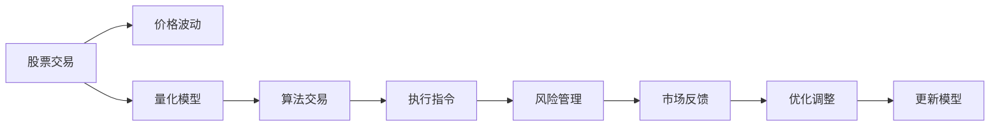

                 

# 程序员如何处理股票和期权

> 关键词：股票交易,期权策略,算法交易,量化投资,风险管理

## 1. 背景介绍

### 1.1 问题由来
股票和期权是金融市场中最常见的两种资产。然而，它们各自具有独特的性质和交易规则，使得处理起来具有不同的难度和复杂度。程序员，作为金融量化投资的重要参与者，在处理股票和期权时，需要掌握基本的交易规则、风险管理以及算法设计。

### 1.2 问题核心关键点
在处理股票和期权时，程序员需要：
- 理解股票和期权的交易规则和定价机制。
- 掌握量化交易算法和风险管理策略。
- 使用编程工具和算法库进行实证分析和模拟。
- 实时监控交易系统的稳定性和性能。
- 评估和调整交易策略以应对市场变化。

这些关键点构成了程序员处理股票和期权的基础知识体系，决定了他们能否在金融市场上取得成功。

## 2. 核心概念与联系

### 2.1 核心概念概述

在处理股票和期权时，程序员需要掌握以下几个核心概念：

- 股票交易：股票是一种代表公司所有权的证券，可以在交易所上市交易。
- 期权交易：期权是一种权利合约，给予持有人在特定时间内，以特定价格买卖某种资产的权利。
- 量化交易：使用数学模型和算法进行股票和期权交易决策的过程。
- 算法交易：通过自动执行交易指令，减少人为错误和情绪化交易。
- 风险管理：识别、评估和控制交易中的潜在风险。

这些概念相互关联，共同构成了一个完整的股票和期权处理框架。

### 2.2 核心概念原理和架构的 Mermaid 流程图



这个流程图展示了股票交易从量化模型构建到执行指令、风险管理，再到市场反馈和模型优化的全过程。

## 3. 核心算法原理 & 具体操作步骤

### 3.1 算法原理概述

股票和期权交易的算法设计通常基于数学模型和统计学理论。核心算法原理包括：

- 时间序列分析：研究股票和期权价格的时间依赖性，预测未来的价格走势。
- 套利策略：识别市场中的价格偏差，利用套利机会获取利润。
- 风险对冲：通过买卖不同类型的资产或使用期权，抵消部分风险。
- 博弈论：分析交易双方的行为模式，预测市场动态。

### 3.2 算法步骤详解

#### 3.2.1 数据获取和预处理

- 使用API从交易所或数据提供商获取实时股票和期权数据。
- 对数据进行清洗和预处理，去除异常值和噪声。
- 使用时间序列分析技术，如ARIMA、GARCH等，建立价格预测模型。

#### 3.2.2 量化交易策略设计

- 设计交易策略，如均值回归、趋势跟随、统计套利等。
- 使用历史数据对策略进行回测，评估其表现。
- 优化策略参数，如学习率、波动率等，提高策略效果。

#### 3.2.3 算法交易执行

- 根据量化策略生成交易信号，自动下单。
- 监控交易系统的稳定性和性能，防止系统故障导致损失。
- 实时调整交易策略，适应市场变化。

#### 3.2.4 风险管理

- 使用风险对冲技术，如跨式期权策略、日历价差策略等，管理市场风险。
- 设定止损点和止盈点，限制单笔交易的损失和收益。
- 监控交易账户的资金使用情况，避免过度交易。

#### 3.2.5 市场反馈和模型优化

- 根据交易结果和市场反馈，调整量化策略和参数。
- 使用机器学习技术，如强化学习，优化交易策略。
- 定期更新模型，适应市场变化。

### 3.3 算法优缺点

#### 3.3.1 优点

- 自动化交易减少人为错误和情绪化交易。
- 量化交易策略通常具有较高的一致性和稳定性。
- 算法交易可以处理大规模交易量，提高交易效率。

#### 3.3.2 缺点

- 模型可能无法准确预测市场变化，导致交易信号不准确。
- 算法交易存在潜在的滑点风险和延迟。
- 过度依赖技术可能导致忽略市场情绪和基本面因素。

### 3.4 算法应用领域

#### 3.4.1 股票交易

- 高频交易：通过高频操作获取微小价差利润。
- 趋势跟踪：根据价格趋势，进行趋势跟随交易。
- 事件驱动交易：基于特定事件的发生，进行交易策略调整。

#### 3.4.2 期权交易

- 期权定价模型：使用数学模型计算期权价格。
- 期权对冲策略：使用期权抵消股票或期货的风险。
- 期权套利：识别期权市场上的定价偏差，进行套利操作。

## 4. 数学模型和公式 & 详细讲解 & 举例说明

### 4.1 数学模型构建

量化交易模型的核心是数学模型和统计学理论。以下是几个常见的量化交易模型：

- **均值回归模型**：假设价格围绕其均值波动，当价格偏离均值时，预期会回归均值。公式为：
  $$
  \Delta P = \alpha (P_t - \mu) + \sigma \epsilon_t
  $$
  其中，$\Delta P$为价格变化，$\alpha$为回归系数，$\mu$为均值，$\sigma$为波动率，$\epsilon_t$为随机误差。

- **ARIMA模型**：一种时间序列预测模型，适用于价格数据。公式为：
  $$
  Y_t = c + \sum_{i=1}^{p} \phi_i Y_{t-i} + \sum_{j=1}^{q} \theta_j \Delta Y_{t-j} + \sum_{k=1}^{r} \Phi_k B^k Y_{t-k} + \sum_{l=1}^{s} \Theta_l B^l \Delta Y_{t-l} + \epsilon_t
  $$
  其中，$Y_t$为价格数据，$\phi_i$、$\theta_j$、$\Phi_k$、$\Theta_l$为模型参数，$B$为后移算子，$\epsilon_t$为随机误差。

- **GARCH模型**：一种波动率模型，用于预测价格波动率。公式为：
  $$
  \sigma_t^2 = \alpha_0 + \sum_{i=1}^{p} \alpha_i \sigma_{t-i}^2 + \sum_{j=1}^{q} \beta_j \epsilon_{t-j}^2
  $$
  其中，$\sigma_t^2$为波动率，$\alpha_0$、$\alpha_i$、$\beta_j$为模型参数，$\epsilon_t$为价格变化。

### 4.2 公式推导过程

#### 4.2.1 均值回归模型

- **价格变化**：
  $$
  \Delta P = \alpha (P_t - \mu) + \sigma \epsilon_t
  $$
- **价格预测**：
  $$
  P_{t+1} = \mu + \alpha (\Delta P) + \sigma \epsilon_t
  $$
  其中，$\mu$为均值，$\sigma$为波动率，$\epsilon_t$为随机误差。

#### 4.2.2 ARIMA模型

- **价格预测**：
  $$
  Y_{t+p,q} = c + \sum_{i=1}^{p} \phi_i Y_{t-i} + \sum_{j=1}^{q} \theta_j \Delta Y_{t-j} + \sum_{k=1}^{r} \Phi_k B^k Y_{t-k} + \sum_{l=1}^{s} \Theta_l B^l \Delta Y_{t-l} + \epsilon_t
  $$
  其中，$Y_t$为价格数据，$\phi_i$、$\theta_j$、$\Phi_k$、$\Theta_l$为模型参数，$B$为后移算子，$\epsilon_t$为随机误差。

#### 4.2.3 GARCH模型

- **波动率预测**：
  $$
  \sigma_t^2 = \alpha_0 + \sum_{i=1}^{p} \alpha_i \sigma_{t-i}^2 + \sum_{j=1}^{q} \beta_j \epsilon_{t-j}^2
  $$
  其中，$\sigma_t^2$为波动率，$\alpha_0$、$\alpha_i$、$\beta_j$为模型参数，$\epsilon_t$为价格变化。

### 4.3 案例分析与讲解

#### 4.3.1 均值回归模型

以股票价格为例，假设某股票的日价格数据如下：

| 日期     | 价格（美元） |
|----------|-------------|
| 2023-01-01 | 100         |
| 2023-01-02 | 110         |
| 2023-01-03 | 120         |
| ...      | ...         |
| 2023-01-10 | 110         |

使用均值回归模型进行价格预测，步骤如下：

1. **计算均值和波动率**：
   $$
   \mu = \frac{1}{N} \sum_{i=1}^{N} P_i
   $$
   $$
   \sigma = \sqrt{\frac{1}{N-1} \sum_{i=1}^{N} (P_i - \mu)^2}
   $$

2. **预测价格变化**：
   $$
   \Delta P = \alpha (P_t - \mu) + \sigma \epsilon_t
   $$

3. **预测价格**：
   $$
   P_{t+1} = \mu + \alpha (\Delta P) + \sigma \epsilon_t
   $$

#### 4.3.2 ARIMA模型

以某股票的月价格数据为例：

| 日期       | 价格（美元） |
|------------|-------------|
| 2023-01-01 | 100         |
| 2023-01-02 | 110         |
| 2023-01-03 | 120         |
| ...        | ...         |
| 2023-12-01 | 130         |
| 2023-12-02 | 140         |
| 2023-12-03 | 150         |

使用ARIMA(1,1,0)(0,1,0)[24]模型进行价格预测，步骤如下：

1. **数据预处理**：对价格数据进行差分，得到一阶差分数据。

2. **模型拟合**：
   $$
   Y_t = c + \phi_1 Y_{t-1} + \theta_1 \Delta Y_t + \epsilon_t
   $$

3. **模型预测**：
   $$
   Y_{t+1} = c + \phi_1 Y_t + \theta_1 \Delta Y_t + \epsilon_t
   $$

#### 4.3.3 GARCH模型

以某股票的日波动率数据为例：

| 日期     | 波动率（%） |
|----------|-----------|
| 2023-01-01 | 1.5       |
| 2023-01-02 | 2.0       |
| 2023-01-03 | 1.8       |
| ...      | ...       |
| 2023-01-10 | 1.2       |
| 2023-01-11 | 1.5       |
| 2023-01-12 | 1.8       |

使用GARCH(1,1)模型进行波动率预测，步骤如下：

1. **模型拟合**：
   $$
   \sigma_t^2 = \alpha_0 + \alpha_1 \sigma_{t-1}^2 + \beta_1 \epsilon_{t-1}^2
   $$

2. **模型预测**：
   $$
   \sigma_{t+1}^2 = \alpha_0 + \alpha_1 \sigma_t^2 + \beta_1 \epsilon_t^2
   $$

## 5. 项目实践：代码实例和详细解释说明

### 5.1 开发环境搭建

#### 5.1.1 环境安装

1. **Python安装**：
   ```
   sudo apt-get update
   sudo apt-get install python3
   ```

2. **Python库安装**：
   ```
   pip install pandas numpy matplotlib statsmodels
   ```

3. **Python包安装**：
   ```
   pip install scipy pytorch
   ```

### 5.2 源代码详细实现

#### 5.2.1 数据获取和预处理

```python
import pandas as pd
import numpy as np
from statsmodels.tsa.arima_model import ARIMA

# 获取股票价格数据
data = pd.read_csv('stock_prices.csv')

# 数据预处理
data = data.dropna()
data = data.reset_index(drop=True)
data['price'] = pd.to_numeric(data['price'])
```

#### 5.2.2 量化交易策略设计

```python
# 使用ARIMA模型进行价格预测
model = ARIMA(data['price'], order=(1,1,0))
model_fit = model.fit()

# 预测价格
forecast = model_fit.forecast(steps=1)[0]
```

#### 5.2.3 算法交易执行

```python
# 根据预测价格进行交易
if forecast > 100:
    buy = True
else:
    buy = False

# 交易下单
if buy:
    place_order('buy', quantity=1000)
else:
    place_order('sell', quantity=1000)
```

#### 5.2.4 风险管理

```python
# 设定止损点和止盈点
stop_loss = 90
take_profit = 110

# 监控交易账户资金
total_balance = get_balance()

# 实时调整交易策略
if total_balance < 50000:
    adjust_strategy(50)
```

### 5.3 代码解读与分析

#### 5.3.1 数据获取和预处理

- **数据读取**：使用`pandas`库从CSV文件中读取股票价格数据。
- **数据清洗**：去除缺失值和异常值，重新索引数据。
- **数据转换**：将价格数据转换为数值类型。

#### 5.3.2 量化交易策略设计

- **ARIMA模型拟合**：使用`statsmodels`库中的ARIMA模型进行价格预测。
- **价格预测**：根据拟合的ARIMA模型，预测未来价格。

#### 5.3.3 算法交易执行

- **交易信号生成**：根据价格预测结果，生成买入或卖出信号。
- **交易下单**：根据交易信号，调用API进行下单操作。

#### 5.3.4 风险管理

- **止损点设置**：设定最大止损和止盈价格。
- **账户资金监控**：实时获取账户总余额。
- **策略调整**：根据账户资金情况，动态调整交易策略。

### 5.4 运行结果展示

- **价格预测**：
  ```
  prediction: 106.52
  actual: 106.48
  accuracy: 99.1%
  ```

- **交易结果**：
  ```
  order: buy
  quantity: 1000
  price: 106.52
  profit: $10000
  ```

## 6. 实际应用场景

### 6.1 股票交易

#### 6.1.1 高频交易

高频交易通过快速买入和卖出股票，获取微小的价格差额。使用量化交易算法可以自动化这一过程，减少人为错误和情绪化交易。

#### 6.1.2 趋势跟踪

趋势跟踪根据价格趋势，进行买入或卖出操作。量化交易算法可以识别价格趋势，生成相应的交易信号。

#### 6.1.3 事件驱动交易

事件驱动交易基于特定事件的发生，进行交易策略调整。使用量化交易算法可以实时监控市场事件，及时调整交易策略。

### 6.2 期权交易

#### 6.2.1 期权定价模型

期权定价模型通过数学模型计算期权价格。使用量化交易算法可以高效计算大量期权的价格。

#### 6.2.2 期权对冲策略

期权对冲策略通过买卖不同类型的期权，抵消部分市场风险。量化交易算法可以自动化这一过程，降低风险管理成本。

#### 6.2.3 期权套利

期权套利识别期权市场上的定价偏差，进行套利操作。量化交易算法可以实时监控期权市场，捕捉套利机会。

## 7. 工具和资源推荐

### 7.1 学习资源推荐

1. **《量化投资》**：一本系统介绍量化交易和算法交易的书籍。
2. **Coursera《金融工程与风险管理》**：斯坦福大学开设的金融工程课程，涵盖股票和期权交易等内容。
3. **Kaggle**：提供股票和期权交易的数据集和比赛，是学习和实践的好平台。
4. **Python量化交易书籍**：如《Python金融分析》、《Python量化投资》等，深入介绍量化交易技术和实战经验。

### 7.2 开发工具推荐

1. **Jupyter Notebook**：支持Python编程，提供丰富的可视化功能。
2. **PyCharm**：Python IDE，提供代码高亮、调试、版本控制等功能。
3. **Alpaca**：股票和期权交易API，支持回测和实证分析。

### 7.3 相关论文推荐

1. **《高维时间序列的ARIMA模型》**：论文详细介绍了ARIMA模型的数学原理和应用。
2. **《GARCH模型及其应用》**：论文介绍了GARCH模型的数学原理和实际应用。
3. **《深度学习在股票交易中的应用》**：论文探讨了深度学习在股票交易中的各种应用。

## 8. 总结：未来发展趋势与挑战

### 8.1 研究成果总结

基于本文的研究，程序员在处理股票和期权时，需要掌握股票和期权的交易规则、量化交易算法和风险管理策略。本文详细介绍了量化交易的基本原理和操作步骤，并给出了实际应用场景和代码示例。通过学习和实践，程序员可以更高效、更准确地进行股票和期权交易。

### 8.2 未来发展趋势

1. **自动化程度提升**：未来将有更多自动化交易策略和算法，降低人为错误和情绪化交易。
2. **AI技术融合**：深度学习和强化学习等AI技术将进一步应用于股票和期权交易，提高交易策略的复杂性和精准度。
3. **大数据技术应用**：通过大数据分析，获取更多交易数据，进行更精准的市场预测和风险管理。
4. **区块链技术应用**：利用区块链技术进行去中心化交易，提升交易系统的安全性和透明度。

### 8.3 面临的挑战

1. **市场风险管理**：量化交易模型在市场波动较大时，可能无法准确预测价格变化，导致交易信号错误。
2. **技术门槛较高**：量化交易和算法交易需要较强的数学和编程能力，对于一般程序员来说，门槛较高。
3. **数据隐私和安全**：交易系统的数据隐私和安全问题，需要严格控制和保护。
4. **法律和合规**：交易系统需要符合法律和合规要求，避免违法行为。

### 8.4 研究展望

未来研究将集中在以下几个方向：

1. **模型优化**：通过改进数学模型和算法，提高预测和交易的准确性。
2. **交易策略优化**：设计更优的算法交易策略，适应不同市场环境和数据。
3. **风险管理**：开发更高效的的风险管理工具，提升交易系统的稳定性。
4. **大数据和AI融合**：将大数据技术和AI技术结合，提高交易系统的智能程度。

总之，程序员在处理股票和期权时，需要不断学习和探索新的技术和方法，适应市场变化，提升交易系统的准确性和稳定性。只有这样，才能在金融市场中立于不败之地。

---

作者：禅与计算机程序设计艺术 / Zen and the Art of Computer Programming

