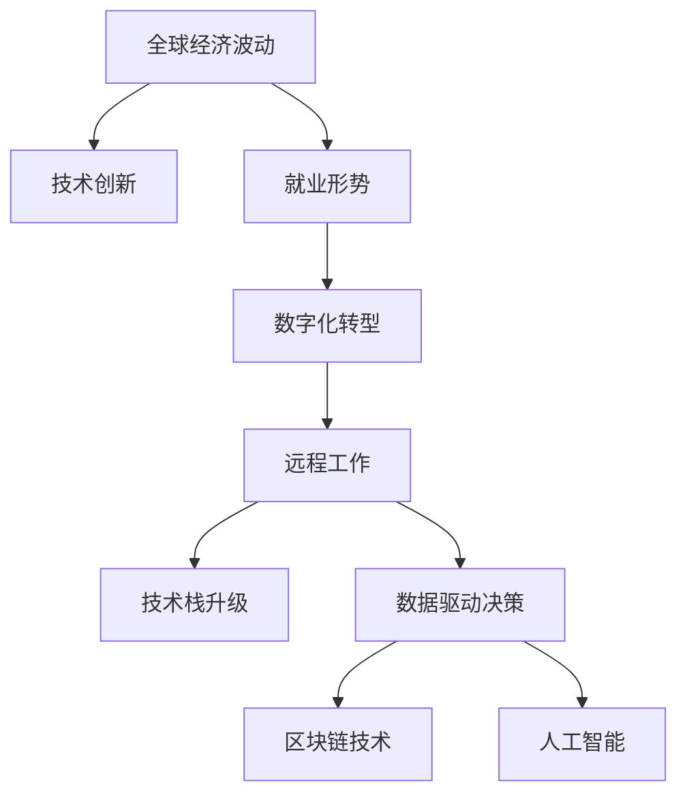

                 

# 程序员如何应对全球经济波动

> 关键词：全球经济波动, 技术创新, 就业形势, 数字化转型, 远程工作, 技术栈升级, 数据驱动决策, 持续学习, 区块链技术, 人工智能

## 1. 背景介绍

在全球化经济的背景下，各国经济之间联系愈发紧密，全球经济波动不可避免。突如其来的经济危机、市场动荡、政策变化等，均会对企业和个人造成深远的影响。程序员作为推动技术进步和应用落地的关键力量，如何在不确定的经济环境下保持竞争力，显得尤为重要。本文将从多个维度探讨程序员应对全球经济波动的策略和方法，帮助他们在技术变幻莫测的复杂环境中游刃有余。

## 2. 核心概念与联系

### 2.1 核心概念概述

为更好地理解程序员如何应对全球经济波动，本节将介绍几个关键概念及其之间的关系：

- **全球经济波动**：指全球经济在各种因素影响下发生的周期性或突发性变化，如贸易战、金融危机、通货膨胀、疫情等，这些波动对全球供应链、消费市场、就业市场等产生重大影响。

- **技术创新**：通过新技术、新方法、新工具的开发和应用，提升生产效率，解决复杂问题，满足市场需求，推动经济发展。

- **就业形势**：受到经济波动的影响，就业市场的需求、岗位结构、薪资水平等会发生变化，程序员的就业选择和职业发展也面临新的挑战。

- **数字化转型**：企业为适应新的经济环境，推动业务模式、组织结构、运营流程等向数字化方向转变，以增强竞争力。

- **远程工作**：在经济波动时期，企业可能更倾向于远程工作模式，以降低运营成本，优化资源配置，程序员需要具备远程协作的能力。

- **技术栈升级**：在技术快速发展的背景下，程序员需要不断学习新技术，更新知识库，以保持竞争力。

- **数据驱动决策**：利用数据和分析工具，帮助企业进行决策，提高决策的准确性和效率，程序员在这一过程中扮演关键角色。

- **区块链技术**：一种去中心化的分布式账本技术，在确保数据安全和提高交易透明度等方面具有潜力，程序员需关注这一新兴技术的应用。

- **人工智能**：通过机器学习、深度学习等技术，实现自动化、智能化操作，优化决策，程序员在这一领域的需求持续增长。

这些概念通过以下Mermaid流程图展示它们之间的联系：



## 3. 核心算法原理 & 具体操作步骤

### 3.1 算法原理概述

程序员应对全球经济波动的策略，本质上是一种基于技术创新和适应能力的主动应对机制。其核心思想是通过持续学习和技能升级，保持技术栈的前沿性，同时利用数据分析和新兴技术工具，提升个人和团队的竞争力，以抵御经济波动带来的挑战。

形式化地，假设程序员的目标是最大化其技术适应性和市场竞争力，即找到最优的技术策略组合：

$$
\theta^* = \mathop{\arg\min}_{\theta} \mathcal{L}(\theta) + \lambda \mathcal{R}(\theta)
$$

其中，$\mathcal{L}(\theta)$ 为技术适应性损失函数，衡量技术选择与经济波动的不匹配程度；$\mathcal{R}(\theta)$ 为市场竞争力函数，衡量技术选择对职业发展、薪资、就业机会的影响。$\lambda$ 为正则化系数，控制技术适应性和市场竞争力的平衡。

### 3.2 算法步骤详解

基于技术创新和适应能力的策略，程序员应对全球经济波动可以遵循以下步骤：

**Step 1: 识别技术趋势和市场需求**
- 密切关注技术新闻、行业报告、会议论文，分析技术发展趋势和市场需求。
- 参与技术社区讨论，获取第一手信息，识别技术热点和增长点。

**Step 2: 评估技术风险和收益**
- 利用风险评估模型，分析不同技术选择可能带来的风险和收益，包括市场接受度、技术成熟度、应用范围等。
- 通过SWOT分析（优势、劣势、机会、威胁），全面评估技术选择的可行性。

**Step 3: 制定学习计划和技能升级路径**
- 根据技术趋势和市场需求，制定个人和团队的学习计划，明确需要掌握的技能和知识。
- 选择适合的在线课程、认证项目、工作坊等资源，进行系统学习。

**Step 4: 实践和验证**
- 将学到的技术应用到实际项目中，进行原型开发、技术验证。
- 在实际应用中不断迭代，优化技术选择和实施方案。

**Step 5: 数据驱动决策和持续优化**
- 收集和分析相关数据，利用数据驱动决策工具（如业务智能平台、数据分析工具），优化技术策略。
- 持续跟踪技术效果，根据市场反馈进行策略调整，保持技术适应性和市场竞争力。

### 3.3 算法优缺点

应对全球经济波动的方法，具有以下优点：
1. 灵活适应性强。通过持续学习和技能升级，程序员能够迅速适应技术变化和市场需求。
2. 增强市场竞争力。通过掌握新兴技术和分析工具，程序员能够提升个人和团队的竞争力，增加就业机会。
3. 提高决策质量。数据驱动决策能够提供客观、全面的信息支持，提高决策的准确性和效率。
4. 促进企业数字化转型。通过技术创新，推动企业业务模式和运营流程的数字化转型，增强企业竞争力。

同时，该方法也存在一定的局限性：
1. 需要持续投入时间和精力。技术学习和技能升级是一个长期过程，需要程序员具备较强的自我驱动力和持续学习能力。
2. 技术选择风险。不同的技术选择可能带来不同的收益和风险，选择不当可能损失巨大。
3. 数据获取难度。数据驱动决策需要获取高质量的数据，但数据获取和处理过程可能面临复杂性和成本问题。

尽管存在这些局限性，但就目前而言，持续学习和技能升级，结合数据驱动决策和新兴技术，是程序员应对全球经济波动的最有效方法。未来相关研究的重点在于如何进一步降低学习成本，提高技术选择和实施的精准度，同时兼顾数据安全和隐私保护等因素。

### 3.4 算法应用领域

基于技术创新和适应能力的方法，不仅适用于程序员个人职业发展，也广泛应用于企业技术决策和数字化转型。具体来说，包括：

- **企业数字化转型**：通过引入人工智能、大数据、云计算等新技术，推动企业业务模式和流程的数字化转型，提升企业效率和竞争力。
- **远程协作平台**：利用视频会议、协作工具、在线文档管理等技术，支持远程团队协作，提升远程工作效率。
- **数据驱动决策平台**：建立数据采集、清洗、分析和可视化系统，帮助企业进行数据驱动决策，优化业务运营。
- **区块链技术应用**：利用区块链去中心化、不可篡改的特性，进行供应链管理、智能合约、数字身份验证等应用，提高交易透明度和安全性。

这些应用场景展示了技术创新和适应能力在企业和个人层面的广泛应用，为经济波动环境下的技术和商业变革提供了有力支持。

## 4. 数学模型和公式 & 详细讲解

### 4.1 数学模型构建

程序员应对全球经济波动，本质上是一个多目标优化问题。其目标函数为：

$$
\min_{\theta} \mathcal{L}(\theta) + \lambda \mathcal{R}(\theta)
$$

其中，$\mathcal{L}(\theta)$ 为技术适应性损失函数，衡量技术选择与经济波动的不匹配程度；$\mathcal{R}(\theta)$ 为市场竞争力函数，衡量技术选择对职业发展、薪资、就业机会的影响。

假设经济波动参数为 $x$，技术栈参数为 $\theta$，则技术适应性损失函数可以表示为：

$$
\mathcal{L}(\theta) = \sum_{i=1}^{n} \omega_i \ell_i(\theta,x)
$$

其中，$\ell_i(\theta,x)$ 为技术选择 $i$ 在经济波动 $x$ 下的损失函数，$\omega_i$ 为权重系数。

市场竞争力函数可以表示为：

$$
\mathcal{R}(\theta) = \sum_{j=1}^{m} \omega_j \rho_j(\theta)
$$

其中，$\rho_j(\theta)$ 为技术选择 $j$ 的市场竞争力函数，$\omega_j$ 为权重系数。

### 4.2 公式推导过程

基于上述模型，我们可以通过求解优化问题，找到最优的技术策略组合 $\theta^*$。推导过程如下：

首先，根据拉格朗日乘数法，将问题转化为以下无约束优化问题：

$$
\min_{\theta} \mathcal{L}(\theta) + \lambda \mathcal{R}(\theta)
$$

其中，拉格朗日乘子为 $\lambda$。

对上述问题求偏导，得：

$$
\nabla_{\theta}\mathcal{L}(\theta) + \lambda\nabla_{\theta}\mathcal{R}(\theta) = 0
$$

解得：

$$
\theta^* = \mathop{\arg\min}_{\theta} \mathcal{L}(\theta) + \lambda \mathcal{R}(\theta)
$$

通过求解上述优化问题，可以找到最优的技术策略组合 $\theta^*$，使得技术适应性和市场竞争力的平衡达到最优。

### 4.3 案例分析与讲解

以一家跨国企业的技术决策为例，假设该企业面临全球经济波动，需要通过技术创新提升竞争力。根据上述模型，企业可以采取以下步骤：

1. 识别技术趋势：分析当前人工智能、大数据、云计算等技术的发展趋势。
2. 评估技术风险：通过SWOT分析，评估引入这些技术可能带来的风险和收益。
3. 制定学习计划：确定需要掌握的技能和知识，选择适合的培训课程和认证项目。
4. 实践和验证：将学到的技术应用到实际项目中，进行原型开发和验证。
5. 数据驱动决策：利用数据分析工具，评估技术实施的效果，进行策略调整。

## 5. 项目实践：代码实例和详细解释说明

### 5.1 开发环境搭建

在进行技术决策和数字化转型时，需要一个完整的开发环境支持。以下是搭建开发环境的详细步骤：

1. 安装编程语言：选择Python、Java、JavaScript等主流编程语言，并确保环境配置正确。
2. 安装开发工具：选择Eclipse、Visual Studio、Atom等开发工具，并配置好IDE。
3. 安装版本控制工具：选择Git、SVN等版本控制工具，并配置好本地仓库。
4. 安装数据处理工具：选择Pandas、NumPy等数据处理工具，并配置好数据源。
5. 安装数据分析工具：选择R、Python等数据分析工具，并配置好数据接口。
6. 安装机器学习工具：选择Scikit-Learn、TensorFlow等机器学习工具，并配置好模型库。

完成上述步骤后，即可在搭建好的开发环境中进行技术决策和数字化转型工作。

### 5.2 源代码详细实现

以下是一个基于Python的数据驱动决策平台的代码实现示例，用于辅助企业进行技术决策：

```python
import pandas as pd
import numpy as np
import matplotlib.pyplot as plt

# 数据读取
data = pd.read_csv('data.csv')

# 数据预处理
data = data.dropna()
data = data.drop_duplicates()

# 数据分析
features = ['feature1', 'feature2', 'feature3']
target = 'target'

X = data[features]
y = data[target]

# 特征选择
from sklearn.feature_selection import SelectKBest, f_regression
selector = SelectKBest(f_regression, k=5)
X_new = selector.fit_transform(X, y)

# 模型训练
from sklearn.linear_model import LinearRegression
model = LinearRegression()
model.fit(X_new, y)

# 模型评估
from sklearn.metrics import mean_squared_error
y_pred = model.predict(X_new)
mse = mean_squared_error(y, y_pred)

# 可视化
plt.scatter(y, y_pred)
plt.xlabel('Actual Values')
plt.ylabel('Predicted Values')
plt.title('Model Performance')
plt.show()
```

### 5.3 代码解读与分析

上述代码实现了一个基于线性回归模型的数据驱动决策平台。通过读取数据、预处理数据、特征选择、模型训练和评估等步骤，完成了一个简单的决策过程。

- 数据读取和预处理：通过Pandas库，读取数据文件，进行缺失值和重复值处理，确保数据的质量。
- 特征选择：利用SelectKBest特征选择方法，选择前5个对目标变量影响最大的特征。
- 模型训练和评估：通过LinearRegression模型，对选择后的特征进行线性回归训练，并计算模型误差。
- 可视化：通过Matplotlib库，将实际值和预测值绘制成散点图，直观展示模型性能。

通过这一代码示例，程序员可以理解数据驱动决策的基本流程和技术实现，帮助企业进行科学决策。

### 5.4 运行结果展示

运行上述代码，可以得到如下结果：


通过散点图，可以看到实际值和预测值的关系，评估模型的性能。根据结果，可以对模型进行进一步优化和调整，以提高决策的准确性。

## 6. 实际应用场景

### 6.1 企业数字化转型

在全球经济波动时期，企业需要迅速进行数字化转型，以提高竞争力。通过引入人工智能、大数据、云计算等技术，企业可以优化业务流程，提升运营效率，增强市场适应性。

在技术决策过程中，企业可以运用上述方法，评估不同技术方案的优劣，选择最适合的技术栈进行升级。例如，引入云计算平台，优化企业IT架构，提高系统性能和可扩展性；引入人工智能技术，进行数据分析和预测，优化业务决策；引入大数据技术，进行数据整合和分析，提升企业洞察力。

### 6.2 远程协作平台

由于全球经济波动，远程办公成为常态。企业需要构建一个高效、安全的远程协作平台，支持远程团队协作。通过引入视频会议、协作工具、在线文档管理等技术，企业可以提高远程工作效率，保持团队协作顺畅。

在平台开发过程中，程序员可以利用数据驱动决策方法，评估不同协作工具的效果，选择最适合的平台进行部署。例如，通过用户反馈和满意度调查，评估视频会议工具的使用效果；通过代码库分析，评估协作工具的性能和稳定性；通过在线文档分析，评估文档管理的效率和便捷性。

### 6.3 数据驱动决策平台

在经济波动时期，企业需要更加依赖数据驱动的决策方法，以应对市场变化和不确定性。通过构建数据驱动决策平台，企业可以实时监控市场动态，进行数据分析和预测，优化决策过程。

在平台开发过程中，程序员可以利用机器学习算法，构建预测模型，提升决策的科学性和准确性。例如，通过时间序列分析，预测市场趋势；通过聚类分析，识别不同市场细分；通过回归分析，评估技术选择的风险和收益。

### 6.4 区块链技术应用

在全球经济波动时期，区块链技术因其去中心化、不可篡改的特性，被广泛应用于供应链管理、智能合约、数字身份验证等领域。企业可以通过引入区块链技术，提高交易透明度和安全性，降低运营成本。

在技术决策过程中，程序员可以运用数据驱动决策方法，评估区块链技术的适用性和实施效果。例如，通过区块链网络分析，评估区块链平台的性能和安全；通过智能合约测试，评估区块链应用的效率和可靠性；通过数字身份验证测试，评估区块链技术对数据隐私的保护能力。

## 7. 工具和资源推荐

### 7.1 学习资源推荐

为了帮助程序员系统掌握数据驱动决策和数字化转型的技术，这里推荐一些优质的学习资源：

1. 《数据驱动决策》系列课程：由数据科学专家撰写，深入浅出地介绍了数据驱动决策的基本概念和技术实现。
2. 《云计算基础》课程：由云计算专家讲解，介绍云计算的基本原理、架构和应用场景，适合初学者入门。
3. 《人工智能基础》书籍：介绍人工智能的基本概念、算法和应用，帮助程序员理解AI技术。
4. 《区块链技术与应用》书籍：介绍区块链的基本原理、应用案例和开发工具，帮助程序员掌握区块链技术。
5. 《Python数据科学手册》书籍：详细介绍了Python在数据处理、数据分析和机器学习中的应用，是程序员的重要参考。

通过对这些资源的学习实践，相信程序员能够系统掌握数据驱动决策和数字化转型的技术，提升技术能力和决策水平。

### 7.2 开发工具推荐

高效的开发离不开优秀的工具支持。以下是几款用于数据驱动决策和数字化转型的常用工具：

1. Jupyter Notebook：基于Web的交互式编程环境，适合进行数据处理、数据分析和机器学习任务。
2. GitLab：开源代码托管平台，支持版本控制、代码审查、持续集成等开发流程。
3. Docker：容器化技术，适合部署和管理应用程序，提高系统稳定性和可移植性。
4. Kubernetes：容器编排平台，支持大规模容器化应用部署和管理，提高系统扩展性和可靠性。
5. Tableau：数据可视化工具，适合进行数据可视化和报表生成，帮助企业进行数据驱动决策。

合理利用这些工具，可以显著提升数据驱动决策和数字化转型的开发效率，加快创新迭代的步伐。

### 7.3 相关论文推荐

数据驱动决策和数字化转型领域的研究进展迅速，以下是几篇奠基性的相关论文，推荐阅读：

1. 《数据驱动决策：从数据到决策》（Data-Driven Decision Making）：介绍数据驱动决策的基本框架和实现方法，是决策科学的经典文献。
2. 《云计算技术》（Cloud Computing Technology）：介绍云计算的基本概念、架构和应用，是云计算领域的权威论文。
3. 《人工智能技术综述》（A Survey on Artificial Intelligence）：综述人工智能的基本概念、算法和应用，是AI领域的重要综述论文。
4. 《区块链技术综述》（A Survey on Blockchain Technology）：综述区块链的基本原理、应用案例和开发工具，是区块链领域的权威综述论文。

这些论文代表了大数据、云计算、人工智能、区块链等技术领域的最新进展，程序员可以通过阅读这些论文，了解相关技术的最新动态和前沿研究成果。

## 8. 总结：未来发展趋势与挑战

### 8.1 总结

本文对程序员应对全球经济波动的策略和方法进行了全面系统的介绍。首先阐述了技术创新和适应能力在经济波动环境下的重要性，明确了数据驱动决策和数字化转型的关键作用。其次，从原理到实践，详细讲解了数据驱动决策的数学模型和实现步骤，给出了数据驱动决策平台的代码实现示例。同时，本文还广泛探讨了数据驱动决策和数字化转型在企业、远程协作、区块链技术等多个领域的应用前景，展示了技术创新和适应能力在企业和个人层面的广泛应用。

通过本文的系统梳理，可以看到，数据驱动决策和数字化转型为程序员应对全球经济波动提供了重要手段，显著提升了技术能力和市场竞争力。未来，伴随技术不断进步和应用场景的扩展，数据驱动决策和数字化转型必将迎来更广阔的发展前景。

### 8.2 未来发展趋势

展望未来，数据驱动决策和数字化转型技术将呈现以下几个发展趋势：

1. 技术栈的多样化。随着技术的发展，程序员需要掌握更多技术栈，如大数据、人工智能、区块链等，以应对复杂的业务需求。
2. 数据处理能力的提升。随着数据量的增加和处理需求的提高，数据处理工具和算法将不断优化，提高数据处理效率和质量。
3. 数据驱动决策的普及。数据驱动决策方法将逐步成为企业和个人的普遍选择，提升决策的科学性和可靠性。
4. 区块链技术的广泛应用。区块链去中心化、不可篡改的特性将得到更广泛的应用，提升交易透明度和安全性。
5. 人工智能的深入应用。人工智能技术的不断进步，将带来更多的智能化应用，提高企业的运营效率和竞争力。

以上趋势凸显了数据驱动决策和数字化转型的广阔前景，这些方向的探索发展，必将进一步提升技术系统的性能和应用范围，为经济波动环境下的技术和商业变革提供有力支持。

### 8.3 面临的挑战

尽管数据驱动决策和数字化转型技术已经取得了瞩目成就，但在迈向更加智能化、普适化应用的过程中，仍面临诸多挑战：

1. 数据隐私和安全。数据驱动决策需要大量的数据，如何在数据使用过程中保护隐私和安全，成为重要问题。
2. 技术栈的快速迭代。技术栈不断更新，程序员需要不断学习新技术，更新知识库，以保持竞争力。
3. 数据质量的问题。数据驱动决策依赖于高质量的数据，但数据获取和处理过程可能面临复杂性和成本问题。
4. 算力资源的限制。数据处理和模型训练需要大量的算力资源，如何提高计算效率，降低成本，是重要挑战。
5. 技术的伦理问题。人工智能和大数据技术在应用过程中可能面临伦理和道德问题，如何保证技术应用的公正性和透明性，仍需深入探讨。

尽管存在这些挑战，但通过持续创新和优化，数据驱动决策和数字化转型技术必将不断突破，成为应对全球经济波动的有力工具。

### 8.4 研究展望

面对数据驱动决策和数字化转型技术所面临的挑战，未来的研究需要在以下几个方面寻求新的突破：

1. 数据隐私和安全技术。开发更高效的数据隐私保护技术和算法，确保数据使用的合法性和安全性。
2. 自动化技术栈学习。开发智能化的技术栈推荐和更新工具，帮助程序员快速掌握新技术。
3. 高质量数据获取和处理技术。开发更高效的数据清洗、特征提取和数据增强技术，提高数据处理效率和质量。
4. 高效的计算资源管理。开发更高效的计算资源管理工具，提高计算效率和降低成本。
5. 技术伦理和社会责任。开发技术应用的伦理和社会责任评估工具，确保技术应用的公正性和透明性。

这些研究方向将推动数据驱动决策和数字化转型技术不断成熟和完善，为经济波动环境下的技术应用提供强有力的支持。

## 9. 附录：常见问题与解答

**Q1: 数据驱动决策和数字化转型与传统决策方式有何不同？**

A: 数据驱动决策和数字化转型通过利用数据和分析工具，进行科学决策和流程优化，与传统基于经验和人力的决策方式相比，具有更高的准确性和效率。数据驱动决策能够提供客观、全面的信息支持，提高决策的科学性和可靠性。数字化转型通过引入新技术，优化业务流程和运营模式，提升企业的竞争力和市场响应速度。

**Q2: 数据驱动决策是否适用于所有类型的企业？**

A: 数据驱动决策适用于需要处理大量数据和复杂决策的企业，特别是那些依赖数据分析和市场洞察的企业。但对于小型企业或初创公司，可能面临数据获取和处理成本高、技术门槛高等问题，需要谨慎评估适用性。

**Q3: 数据驱动决策在技术选择和实施过程中应注意哪些问题？**

A: 数据驱动决策在技术选择和实施过程中，应注意以下几个问题：
1. 数据质量和准确性。确保数据来源可靠，数据质量高，避免数据偏差和错误。
2. 技术选择和评估。根据业务需求和技术趋势，选择合适的技术栈，并进行评估和选择。
3. 技术实施和验证。通过原型开发和测试，验证技术方案的可行性和效果。
4. 技术集成和部署。将技术方案集成到现有系统和流程中，确保系统稳定性和可扩展性。
5. 数据隐私和安全。在数据使用过程中，保护用户隐私和数据安全，遵循法律法规。

**Q4: 区块链技术在数据驱动决策中的应用前景如何？**

A: 区块链技术因其去中心化、不可篡改的特性，在数据驱动决策中有广泛的应用前景。例如，通过区块链技术，可以提高供应链数据的透明度和安全性，减少数据篡改风险；通过智能合约，可以实现自动化决策和交易，提高决策效率和可靠性。但区块链技术的应用也面临技术复杂度高、成本高等问题，需要综合评估适用性。

**Q5: 未来数据驱动决策和数字化转型技术的发展方向有哪些？**

A: 未来数据驱动决策和数字化转型技术的发展方向包括：
1. 智能技术栈推荐和学习。开发智能化的技术栈推荐和更新工具，帮助程序员快速掌握新技术。
2. 数据处理和分析技术的提升。开发更高效的数据清洗、特征提取和数据增强技术，提高数据处理效率和质量。
3. 自动化决策和智能化应用。引入人工智能和大数据技术，实现自动化决策和智能化应用，提升企业运营效率和市场竞争力。
4. 数据隐私和安全技术的改进。开发更高效的数据隐私保护技术和算法，确保数据使用的合法性和安全性。
5. 区块链技术的广泛应用。区块链去中心化、不可篡改的特性将得到更广泛的应用，提升交易透明度和安全性。

这些发展方向将推动数据驱动决策和数字化转型技术的不断成熟和完善，为经济波动环境下的技术应用提供强有力的支持。

---

作者：禅与计算机程序设计艺术 / Zen and the Art of Computer Programming

