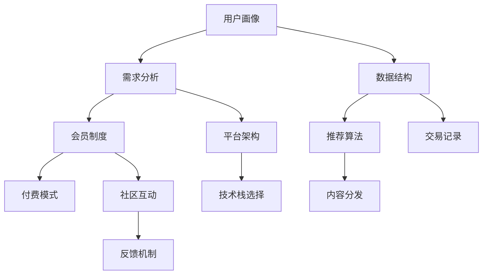

                 

# 程序员如何打造知识付费的会员制度

> 关键词：知识付费, 会员制度, 数据结构, 算法设计, 平台架构, 技术栈选择

## 1. 背景介绍

### 1.1 问题由来
知识付费的兴起，让知识的价值得以重新发现和认可。程序员作为技术含量高、知识更新快的群体，尤其需要系统化的学习资源和即时反馈机制。然而，传统的教育模式难以满足程序员的多样化学习需求。

在互联网环境下，知识付费平台的兴起，为程序员提供了便捷、高效的学习渠道。但如何构建一个高效、可持续的知识付费会员制度，成为了平台方和开发者关注的焦点。

### 1.2 问题核心关键点
本节将围绕知识付费会员制度的核心概念和关键点展开讨论。主要包括：

- 用户画像和需求分析
- 会员制度的设计原则
- 付费模式的创新思路
- 内容分发机制和推荐算法
- 平台技术架构和安全保障

### 1.3 问题研究意义
构建一个高效的知识付费会员制度，不仅能提升平台的吸引力和用户粘性，还能更好地满足程序员的学习需求，促进知识传播和技术创新。

其核心价值体现在：
1. 个性化学习路径的提供：根据用户的学习习惯和水平，推荐合适的课程和资料。
2. 知识更新的即时性：能够快速响应技术变化，提供最新的学习材料。
3. 社区互动和反馈：构建学习社群，促进知识的交流和应用。

## 2. 核心概念与联系

### 2.1 核心概念概述

为更好地理解知识付费会员制度的构建，本节将介绍几个关键概念：

- 知识付费：通过付费获取知识服务的一种商业模式，涵盖课程、书籍、文章、直播等形式。
- 会员制度：针对平台付费用户，提供增值服务的体系，如专属内容、优先服务、积分奖励等。
- 数据结构：包括用户画像、课程结构、学习记录、交易记录等，是知识付费平台的基础。
- 算法设计：推荐算法、搜索算法、内容生成算法等，是提升用户体验的关键。
- 平台架构：包括前端、后端、数据层、安全层等，是知识付费平台的技术支撑。
- 技术栈选择：包括前端框架、后端语言、数据库、云服务等，影响平台性能和扩展性。

这些概念之间的联系可通过以下Mermaid流程图来展示：



这个流程图展示了一系列核心概念及其之间的关系：

1. 用户画像通过数据结构支撑，反映用户的基本信息和学习需求。
2. 会员制度基于需求分析，设计专属的权益和功能。
3. 付费模式与会员制度紧密相关，确定合理的费用结构。
4. 推荐算法用于内容分发，提升用户的学习体验。
5. 内容分发依赖数据结构和推荐算法，实现高效的内容推送。
6. 社区互动和反馈机制构成用户粘性的重要因素。
7. 交易记录反映用户行为，支持精准定价和推荐。
8. 平台架构和技术栈选择决定系统的稳定性和扩展性。

## 3. 核心算法原理 & 具体操作步骤
### 3.1 算法原理概述

知识付费会员制度的核心算法原理主要围绕以下几个方面展开：

- 用户画像的构建与更新
- 个性化推荐的算法设计
- 搜索与排序算法
- 交易与积分系统的算法设计

### 3.2 算法步骤详解

**3.2.1 用户画像构建**

用户画像的构建是会员制度的基础。用户画像包含用户的教育背景、技术栈偏好、学习行为、时间偏好等。

**步骤1：数据收集**
- 用户注册时，收集基本信息和初始学习兴趣。
- 课程浏览、购买、学习行为数据，通过日志收集。
- 用户反馈和评分数据，通过问卷和评价系统获取。

**步骤2：数据清洗**
- 去重、去噪、填补缺失值，确保数据质量。

**步骤3：特征工程**
- 设计特征维度，如用户活跃度、学习时长、课程评分等。
- 利用PCA、LDA等降维技术，简化数据结构。

**步骤4：模型训练**
- 使用K-Means、PCA等聚类算法，划分用户群体。
- 采用协同过滤、深度学习等算法，建立用户行为预测模型。

**3.2.2 个性化推荐算法**

个性化推荐算法是提升用户体验的核心。算法需考虑用户画像、课程内容、用户行为等多个因素，综合计算推荐结果。

**步骤1：算法选择**
- 基于用户的协同过滤
- 基于内容的协同过滤
- 混合推荐算法

**步骤2：数据准备**
- 将用户画像数据和课程数据转化为数值型特征。
- 计算用户行为特征，如点击率、学习时长、评分等。

**步骤3：算法训练**
- 基于用户画像和行为数据的协同过滤，训练推荐模型。
- 利用深度学习模型，如DNN、CNN、RNN等，提升推荐准确性。

**步骤4：结果输出**
- 利用排名算法，如PageRank、TF-IDF等，生成推荐结果列表。

**3.2.3 搜索与排序算法**

搜索与排序算法用于优化用户查找课程和资料的体验。

**步骤1：算法选择**
- 倒排索引算法
- 向量空间模型
- 自然语言处理技术

**步骤2：数据预处理**
- 课程元数据提取，包括标题、简介、标签等。
- 文本分词、词向量计算等处理。

**步骤3：算法训练**
- 训练倒排索引，建立关键词与文档的关联。
- 使用向量空间模型，计算搜索结果的相关性。

**步骤4：结果排序**
- 基于相关性排序，如TF-IDF、BM25等算法。
- 结合用户行为，提升搜索结果的精准度。

**3.2.4 交易与积分系统算法**

交易与积分系统算法用于管理用户交易行为和积分奖励，增强用户粘性。

**步骤1：交易行为分析**
- 分析用户交易行为，如购买课程、订阅服务、积分兑换等。
- 计算用户购买力，进行精准定价。

**步骤2：积分系统设计**
- 设计积分获取规则，如学习时长、评价得分、推荐他人等。
- 设计积分消耗规则，如兑换课程、抽奖活动等。

**步骤3：算法实现**
- 利用规则引擎，实现积分计算和消费逻辑。
- 使用事务一致性算法，确保积分系统的安全性。

**3.2.5 平台架构设计**

平台架构设计是实现个性化会员制度的关键。需考虑前端、后端、数据层、安全层等多个维度。

**步骤1：前端架构设计**
- 使用React、Vue等框架，构建UI界面。
- 引入第三方组件库，提升开发效率。

**步骤2：后端架构设计**
- 使用Spring Boot、Django等框架，构建API接口。
- 引入事务一致性、缓存等技术，提升系统性能。

**步骤3：数据层设计**
- 使用MySQL、MongoDB等数据库，存储用户数据、课程数据等。
- 设计数据模型，如用户画像、课程结构等。

**步骤4：安全层设计**
- 引入OAuth2、JWT等安全技术，保障用户数据安全。
- 实施数据加密、网络安全等措施，保障平台安全。

**3.2.6 技术栈选择**

技术栈选择直接影响平台性能和扩展性。需综合考虑性能、成本、扩展性等因素。

**步骤1：前端技术栈**
- 使用React、Vue等框架，实现UI界面。
- 引入第三方库，如Axios、D3.js等，提升开发效率。

**步骤2：后端技术栈**
- 使用Node.js、Python等语言，实现API接口。
- 引入ORM、RESTful API等技术，提升系统开发效率。

**步骤3：数据层技术栈**
- 使用MySQL、MongoDB等数据库，存储用户数据、课程数据等。
- 引入ElasticSearch、Redis等技术，提升查询和缓存性能。

**步骤4：安全技术栈**
- 引入OAuth2、JWT等安全技术，保障用户数据安全。
- 实施数据加密、网络安全等措施，保障平台安全。

### 3.3 算法优缺点

知识付费会员制度的算法设计主要优缺点如下：

**优点：**
- 个性化推荐和搜索，提升用户体验。
- 动态定价和积分系统，增强用户粘性。
- 数据驱动决策，提升运营效率。

**缺点：**
- 数据隐私和安全问题需重点关注。
- 推荐算法复杂，需大量数据支持。
- 技术栈复杂，开发和维护成本高。

### 3.4 算法应用领域

知识付费会员制度的应用领域广泛，涵盖各类知识付费平台，包括但不限于以下场景：

- 编程教育平台：如慕课网、Coursera等。
- 技术博客平台：如掘金、知乎等。
- 在线编程平台：如LeetCode、CoderPad等。
- 线上培训平台：如Udacity、Codecademy等。

## 4. 数学模型和公式 & 详细讲解 & 举例说明

### 4.1 数学模型构建

知识付费会员制度的数学模型构建主要围绕以下几个方面展开：

- 用户画像的数学表示
- 个性化推荐的数学模型
- 搜索与排序的数学模型
- 交易与积分系统的数学模型

### 4.2 公式推导过程

以下将通过数学公式，详细讲解知识付费会员制度的构建过程。

**4.2.1 用户画像的数学表示**

用户画像的数学表示主要通过向量表示法来实现。设用户画像向量为 $\vec{u}$，课程特征向量为 $\vec{c}$，用户行为向量为 $\vec{b}$。

$$
\vec{u} = (u_1, u_2, \ldots, u_n)
$$
$$
\vec{c} = (c_1, c_2, \ldots, c_m)
$$
$$
\vec{b} = (b_1, b_2, \ldots, b_p)
$$

其中 $u_i$ 表示用户画像的 $i$ 个特征，如学历、技术栈偏好等；$c_j$ 表示课程的 $j$ 个特征，如课程难度、课程时长等；$b_k$ 表示用户行为的 $k$ 个特征，如点击率、学习时长等。

**4.2.2 个性化推荐的数学模型**

个性化推荐的数学模型主要通过协同过滤算法来实现。假设用户 $u$ 与课程 $c$ 的评分矩阵为 $R_{u,c}$。

$$
R_{u,c} = (r_{u_1,c_1}, r_{u_2,c_2}, \ldots, r_{u_m,c_n})
$$

其中 $r_{u_i,c_j}$ 表示用户 $u_i$ 对课程 $c_j$ 的评分。

协同过滤算法的核心思想是通过用户和课程的评分数据，计算用户和课程之间的相似度。设用户 $u_i$ 和课程 $c_j$ 的相似度为 $sim(u_i,c_j)$。

$$
sim(u_i,c_j) = \frac{1}{1+\exp(-\vec{u} \cdot \vec{c})}
$$

其中 $\cdot$ 表示向量内积运算。

**4.2.3 搜索与排序的数学模型**

搜索与排序的数学模型主要通过倒排索引和向量空间模型来实现。假设搜索结果为 $D$，搜索结果与查询词的匹配度为 $score(D)$。

$$
score(D) = \sum_{i=1}^{n} f(D_i) \cdot w(D_i)
$$

其中 $f(D_i)$ 表示搜索结果 $D_i$ 的特征值，$w(D_i)$ 表示特征权重。

倒排索引算法用于建立关键词与文档的关联。假设关键词 $t$ 在文档 $d$ 中出现的次数为 $f_{t,d}$。

$$
f_{t,d} = \sum_{i=1}^{m} \vec{t} \cdot \vec{d_i}
$$

其中 $\vec{t}$ 表示查询词的向量表示，$\vec{d_i}$ 表示文档 $d_i$ 的向量表示。

**4.2.4 交易与积分系统的数学模型**

交易与积分系统的数学模型主要通过事务一致性算法来实现。设用户 $u$ 的积分余额为 $I_u$，积分消耗量为 $C_i$。

$$
I_{u} = I_{u0} - \sum_{i=1}^{n} C_i
$$

其中 $I_{u0}$ 表示用户初始积分余额，$C_i$ 表示第 $i$ 次积分消耗量。

事务一致性算法用于确保积分系统的安全性。通过 ACID 事务模型，保证数据一致性。

$$
ACID = Atomicity, Consistency, Isolation, Durability
$$

其中 Atomicity 表示事务的原子性，Consistency 表示事务的一致性，Isolation 表示事务的隔离性，Durability 表示事务的持久性。

## 5. 项目实践：代码实例和详细解释说明

### 5.1 开发环境搭建

在开始项目实践前，我们需要准备好开发环境。以下是使用Node.js和React进行前端开发的开发环境配置流程：

1. 安装Node.js：从官网下载安装Node.js，配置环境变量。
2. 创建项目：使用 `npm init` 命令创建新项目，配置项目依赖。
3. 安装React：使用 `npm install react react-dom` 命令安装React和ReactDOM库。
4. 配置Babel：使用 `npm install @babel/core @babel/preset-react` 命令配置Babel，支持ES6语法。
5. 配置Webpack：使用 `npm install webpack webpack-cli` 命令配置Webpack，构建项目。

完成上述步骤后，即可在开发环境内开始项目实践。

### 5.2 源代码详细实现

下面我们以知识付费会员制度为例，给出React在前端开发的知识付费平台的代码实现。

首先，定义数据模型和组件结构：

```javascript
import React, { Component } from 'react';
import { Route, Switch } from 'react-router-dom';
import Home from './components/Home';
import Courses from './components/Courses';
import Dashboard from './components/Dashboard';
import Login from './components/Login';

class App extends Component {
  render() {
    return (
      <div>
        <Switch>
          <Route exact path="/" component={Home} />
          <Route path="/courses" component={Courses} />
          <Route path="/dashboard" component={Dashboard} />
          <Route path="/login" component={Login} />
        </Switch>
      </div>
    );
  }
}

export default App;
```

然后，定义用户登录组件：

```javascript
import React, { Component } from 'react';
import { Button, Form, Input, Label } from 'reactstrap';

class Login extends Component {
  constructor(props) {
    super(props);
    this.state = {
      username: '',
      password: '',
    };

    this.handleChange = this.handleChange.bind(this);
    this.handleSubmit = this.handleSubmit.bind(this);
  }

  handleChange(event) {
    const { name, value } = event.target;
    this.setState({ [name]: value });
  }

  handleSubmit(event) {
    event.preventDefault();
    // 调用API验证用户名和密码
    // 如果验证通过，跳转到主页
    // 如果验证失败，提示错误信息
  }

  render() {
    return (
      <div>
        <Form>
          <Label for="username">用户名</Label>
          <Input type="text" id="username" name="username" onChange={this.handleChange} />
          <Label for="password">密码</Label>
          <Input type="password" id="password" name="password" onChange={this.handleChange} />
          <Button type="submit" onClick={this.handleSubmit}>登录</Button>
        </Form>
      </div>
    );
  }
}

export default Login;
```

接着，定义课程展示组件：

```javascript
import React, { Component } from 'react';
import { Card, CardBody, CardTitle, CardText, Button } from 'reactstrap';

class Course extends Component {
  render() {
    const { course } = this.props;

    return (
      <Card>
        <CardBody>
          <CardTitle>{course.title}</CardTitle>
          <CardText>{course.description}</CardText>
          <Button>购买课程</Button>
        </CardBody>
      </Card>
    );
  }
}

export default Course;
```

最后，定义课程列表组件：

```javascript
import React, { Component } from 'react';
import { CardGroup } from 'reactstrap';
import Course from './Course';

class Courses extends Component {
  render() {
    const { courses } = this.props;

    return (
      <CardGroup>
        {courses.map(course => (
          <Course key={course.id} course={course} />
        ))}
      </CardGroup>
    );
  }
}

export default Courses;
```

以上是使用React进行知识付费会员制度开发的基本代码实现。

### 5.3 代码解读与分析

让我们再详细解读一下关键代码的实现细节：

**App组件**：
- 使用React Router实现路由功能，将用户引导到不同的组件。

**Login组件**：
- 定义表单输入和按钮事件，通过API验证用户信息，实现用户登录。

**Course组件**：
- 定义课程的展示界面，包括课程名称、描述和购买按钮。

**Courses组件**：
- 从父组件接收课程数据，使用循环渲染每个课程，实现课程列表的展示。

代码实现较为简洁，但展示了React的基本用法和组件结构。实际开发中，还需要添加数据获取、状态管理、API调用等更多细节，以支持复杂的会员制度功能。

## 6. 实际应用场景

### 6.1 智能教育平台

知识付费会员制度在智能教育平台上有着广泛的应用。如慕课网、Coursera等平台，通过个性化推荐和课程分类，为学生提供高效的学习路径。

**具体应用：**
- 用户画像分析：收集用户的学习行为数据，建立用户画像。
- 个性化推荐算法：根据用户画像和课程特征，推荐适合的课程和学习路径。
- 交易与积分系统：通过积分奖励和动态定价，增强用户粘性。

### 6.2 企业内部培训平台

企业内部培训平台也需要通过知识付费会员制度来提升培训效果和员工满意度。如Udacity、Codecademy等平台，通过付费会员制度，提升培训质量。

**具体应用：**
- 用户画像分析：收集员工的学习行为数据，建立用户画像。
- 个性化推荐算法：根据员工的技能水平和岗位需求，推荐适合的培训课程。
- 交易与积分系统：通过积分奖励和动态定价，激励员工学习。

### 6.3 在线编程社区

在线编程社区如LeetCode、CoderPad等，通过知识付费会员制度，提供优质的编程练习和题目解答。

**具体应用：**
- 用户画像分析：收集用户的编程行为数据，建立用户画像。
- 个性化推荐算法：根据用户的编程水平和兴趣，推荐适合的编程题目和练习。
- 交易与积分系统：通过积分奖励和动态定价，激励用户练习。

## 7. 工具和资源推荐

### 7.1 学习资源推荐

为了帮助开发者系统掌握知识付费会员制度的开发，这里推荐一些优质的学习资源：

1. Coursera《机器学习》课程：由斯坦福大学教授Andrew Ng主讲，系统介绍机器学习的基本理论和应用。
2. Udacity《人工智能》课程：涵盖人工智能的多个方面，包括深度学习、自然语言处理、计算机视觉等。
3. GitHub开源项目：如KnowledgeHub、edX等，提供知识付费平台的开源代码和实现案例。
4. HackerRank：提供编程练习和算法题目，提升开发者的编程能力。
5. Medium博客：精选知识付费平台的优秀文章和技术博客，涵盖平台架构、推荐算法等。

通过对这些资源的学习实践，相信你一定能够快速掌握知识付费会员制度的开发技巧，并用于解决实际的业务需求。

### 7.2 开发工具推荐

高效的开发离不开优秀的工具支持。以下是几款用于知识付费会员制度开发的常用工具：

1. React：React提供了丰富的UI组件和状态管理功能，适用于构建复杂的用户界面。
2. Redux：Redux是React的常用状态管理库，适用于处理复杂的业务逻辑和数据流。
3. GraphQL：GraphQL是一种基于schema的查询语言，适用于高效的API开发和数据获取。
4. PostgreSQL：PostgreSQL是高效的关系型数据库，适用于存储和查询大量的用户和课程数据。
5. AWS：AWS提供了丰富的云服务，如云数据库、云存储、云函数等，适用于构建可扩展的知识付费平台。

合理利用这些工具，可以显著提升知识付费会员制度的开发效率，加快创新迭代的步伐。

### 7.3 相关论文推荐

知识付费会员制度的开发需要借助最新的研究成果。以下是几篇奠基性的相关论文，推荐阅读：

1. 《Collaborative Filtering for Implicit Feedback Datasets》：提出协同过滤算法，用于个性化推荐。
2. 《Framing the Future of AI: Building Self-Driving AI》：探讨AI的未来发展方向，包括知识表示、因果推理等。
3. 《Deep Reinforcement Learning for Personalized Course Recommendation》：通过深度强化学习算法，提升个性化推荐的效果。
4. 《A Survey on Knowledge Graphs for Recommendation Systems》：全面介绍知识图谱在推荐系统中的应用。
5. 《Reinforcement Learning for Recommendation Systems: A Survey》：综述了强化学习在推荐系统中的应用，包括知识表示、动态定价等。

这些论文代表了大规模知识付费平台的发展脉络。通过学习这些前沿成果，可以帮助研究者把握学科前进方向，激发更多的创新灵感。

## 8. 总结：未来发展趋势与挑战

### 8.1 总结

本文对知识付费会员制度的开发进行了全面系统的介绍。首先阐述了知识付费会员制度的研究背景和核心概念，明确了其对于提升平台用户体验、促进知识传播和技术创新的核心价值。其次，从原理到实践，详细讲解了知识付费会员制度的构建过程，包括用户画像构建、个性化推荐、搜索排序、交易积分系统等多个关键环节。同时，本文还广泛探讨了知识付费会员制度在智能教育、企业培训、在线编程等多个领域的应用前景，展示了其广阔的发展空间。

通过本文的系统梳理，可以看到，知识付费会员制度在构建个性化学习路径、提升用户粘性、促进知识传播方面具有重要意义。其核心价值在于通过数据分析和算法设计，提供更为精准和高效的学习服务，提升用户的学习体验和满意度。未来，知识付费会员制度还将与其他技术进行深度融合，如人工智能、机器学习、自然语言处理等，推动知识付费平台的创新发展。

### 8.2 未来发展趋势

展望未来，知识付费会员制度的发展趋势主要体现在以下几个方面：

1. 数据驱动决策：通过大数据和AI技术，提升个性化推荐和搜索排序的精准度。
2. 社区互动增强：通过社区和论坛功能，增强用户互动和反馈，提升用户粘性。
3. 动态定价机制：通过机器学习算法，实现动态定价和精准定价。
4. 技术栈优化：通过微服务架构、容器化技术，提升平台的扩展性和稳定性。
5. 安全与隐私保护：通过加密技术和合规措施，保障用户数据安全。

### 8.3 面临的挑战

尽管知识付费会员制度的开发取得了显著成效，但在应用过程中仍面临诸多挑战：

1. 数据隐私和安全问题：用户数据隐私保护是首要问题，需采用严格的数据加密和访问控制措施。
2. 算法复杂度：个性化推荐和搜索排序算法复杂，需优化算法效率，降低计算资源消耗。
3. 技术栈复杂性：知识付费平台涉及多个技术栈，需综合考虑性能、扩展性、成本等因素。
4. 用户多样性：不同用户群体的需求差异大，需灵活设计推荐和排序算法，提升用户体验。
5. 用户粘性不足：部分用户对付费会员制度存在抵触情绪，需加强用户教育和引导。

### 8.4 研究展望

面对知识付费会员制度所面临的挑战，未来的研究需要在以下几个方面寻求新的突破：

1. 引入更多先验知识：将符号化的先验知识，如知识图谱、逻辑规则等，与神经网络模型进行融合，提升推荐系统的准确性和稳定性。
2. 融合多种推荐算法：结合协同过滤、深度学习、强化学习等多种推荐算法，提升推荐效果和用户体验。
3. 引入更多社交因素：利用社交网络数据，提升推荐系统的个性化和多样性。
4. 优化推荐算法性能：优化算法效率，降低计算资源消耗，提升推荐系统的实时性和可扩展性。
5. 加强用户教育和引导：通过用户教育、引导和激励措施，提升用户对知识付费会员制度的接受度和满意度。

这些研究方向将为知识付费会员制度带来新的突破，推动其向更高层次的发展。

## 9. 附录：常见问题与解答

**Q1：如何构建有效的用户画像？**

A: 构建有效的用户画像需通过多维度数据收集和分析。可以从用户注册信息、学习行为、反馈评分等多个方面获取数据。采用聚类和分类算法，分析用户的基本属性、学习偏好和行为特征。

**Q2：如何设计合理的个性化推荐算法？**

A: 设计合理的个性化推荐算法需综合考虑用户画像、课程内容、行为数据等多个因素。可以使用协同过滤、深度学习、混合推荐等多种算法。通过A/B测试和用户反馈，不断优化推荐效果。

**Q3：如何在知识付费平台上实现动态定价？**

A: 动态定价需结合用户行为和市场需求进行灵活调整。可以使用机器学习算法，如回归分析、随机森林等，根据用户的历史行为和交易数据，预测用户的支付意愿和行为。通过实时定价策略，提升平台收益和用户体验。

**Q4：如何保障用户数据安全和隐私？**

A: 保障用户数据安全和隐私需采用严格的数据加密和访问控制措施。通过HTTPS协议、数据加密存储、用户身份验证等手段，确保用户数据的安全性。同时，需制定明确的数据隐私政策，透明告知用户数据的使用情况。

**Q5：如何提升用户粘性？**

A: 提升用户粘性需结合多种手段，如社区互动、积分奖励、用户反馈等。通过构建学习社群，促进用户之间的交流和协作。通过积分奖励和动态定价，激励用户积极参与平台活动。通过用户反馈，不断优化平台功能和体验。

综上所述，构建一个高效的知识付费会员制度，需要从多个维度进行设计和优化。通过用户画像、个性化推荐、搜索排序、动态定价、社区互动等多个环节的协同设计，才能提升平台的吸引力、用户粘性和运营效率。未来，知识付费会员制度还将与其他技术进行深度融合，共同推动知识付费平台的创新发展。相信通过持续的探索和创新，知识付费会员制度将不断优化，为更多用户提供更为精准、高效和个性化的学习服务。

---

作者：禅与计算机程序设计艺术 / Zen and the Art of Computer Programming

