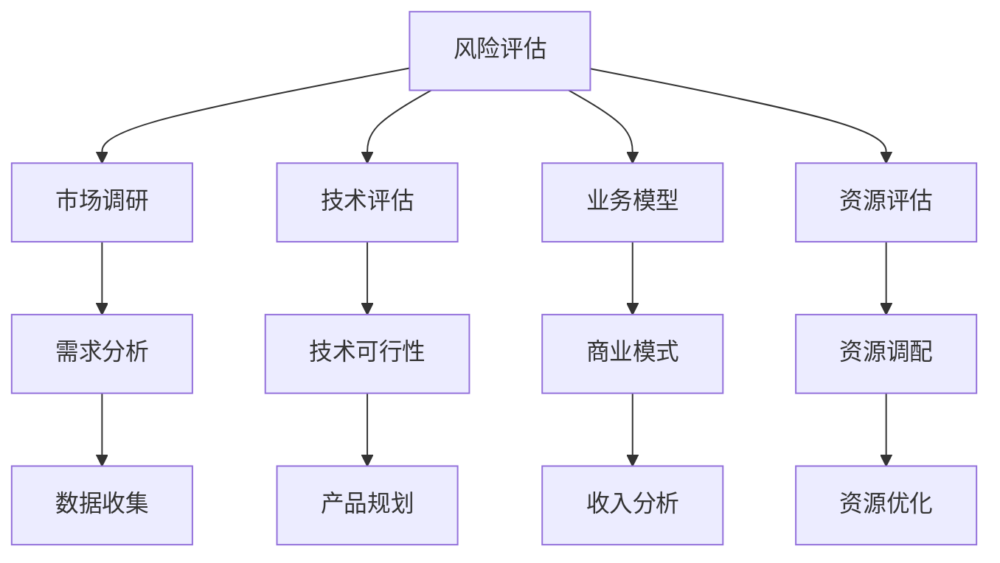

                 

# 程序员如何评估创业风险

> 关键词：风险评估, 创业决策, 技术分析, 业务模型, 市场调研, 资源评估

## 1. 背景介绍

创业，尤其是技术创业，充满不确定性和挑战。一个优秀的程序员不仅要具备技术实力，还需要学会科学评估创业风险，以提高成功的概率。

### 1.1 创业风险的来源
创业风险主要来自于以下几个方面：
- **技术风险**：产品功能、架构设计、技术选型等是否可行。
- **市场风险**：市场需求是否真实，用户增长是否可持续。
- **竞争风险**：市场是否已存在竞争对手，对手的优劣势分析。
- **资金风险**：资金链是否充足，资金使用效率如何。
- **管理风险**：团队是否稳定，决策是否高效。

### 1.2 评估创业风险的重要性
创业成功的关键在于预见风险并及时规避或应对。风险评估不仅能帮助创业者制定科学合理的决策方案，还能提升团队应对不确定性的能力，增强市场竞争力。

## 2. 核心概念与联系

### 2.1 核心概念概述

为更好地理解创业风险评估的流程和方法，本节将介绍几个关键概念：

- **风险评估**：通过系统化的分析方法，评估创业项目中可能遇到的风险，并制定相应的应对策略。
- **市场调研**：通过调查和分析市场环境、用户需求、竞争格局等信息，了解市场的真实状况，为决策提供依据。
- **技术评估**：从技术实现、架构设计、可扩展性等方面评估产品技术是否可行，以及未来的技术演进路径。
- **业务模型**：从商业运作的角度，评估商业模式、收入来源、盈利能力等，确保商业模式的可持续性。
- **资源评估**：评估团队成员、资金、设备等资源是否充足，并制定资源使用策略。

这些概念之间相互作用，共同构成创业风险评估的整体框架。

### 2.2 核心概念原理和架构的 Mermaid 流程图



这个流程图展示了创业风险评估的各个环节及其相互关系：

1. 从风险评估开始，进行市场调研、技术评估、业务模型和资源评估。
2. 市场调研通过数据收集和需求分析，明确目标用户和市场需求。
3. 技术评估判断产品的技术实现是否可行，规划技术路线。
4. 业务模型评估商业模式和收入来源，确保可持续发展。
5. 资源评估确定团队资源和资金的使用效率，进行优化配置。
6. 各个环节的结果相互影响，综合决策创业风险。

## 3. 核心算法原理 & 具体操作步骤

### 3.1 算法原理概述

创业风险评估的核心算法是基于量化和定性分析的混合方法。量化的部分包括市场调研数据、技术指标、资源需求等，定性的部分包括管理团队评估、市场趋势、竞争态势等。通过将定性与定量数据融合，形成风险评估模型，进行综合分析。

### 3.2 算法步骤详解

以下是创业风险评估的具体步骤：

**Step 1: 收集和整理数据**
- 收集市场调研数据，如用户需求、市场规模、市场增长率等。
- 收集技术评估数据，如技术实现难度、技术成熟度、关键技术成本等。
- 收集业务模型数据，如收入模型、成本结构、利润率等。
- 收集资源评估数据，如团队人数、资金筹集、设备配置等。

**Step 2: 初步分析与筛选**
- 对收集到的数据进行初步分析，识别主要风险因素。
- 根据主要风险因素进行筛选，确定重点评估对象。

**Step 3: 量化评估**
- 对量化的数据进行建模，如使用回归分析、线性规划等方法。
- 通过量化模型预测未来趋势和风险概率。

**Step 4: 定性评估**
- 通过专家评估、团队讨论等方式，对定性因素进行打分或评级。
- 结合量化评估结果，进行综合风险评估。

**Step 5: 风险应对策略**
- 根据风险评估结果，制定相应的应对策略。
- 对高风险因素进行风险缓解或规避。
- 制定风险监控和预警机制。

**Step 6: 持续监控与调整**
- 持续监控风险变化，根据市场、技术、管理等因素进行调整。
- 定期重新评估风险，确保创业项目的健康发展。

### 3.3 算法优缺点

基于混合方法的创业风险评估具有以下优点：

- **综合性强**：将定性和定量数据融合，形成全面评估结果。
- **灵活性高**：可以根据具体项目特点，灵活调整评估方法和指标。
- **操作性好**：量化模型和定性评估结合，便于实际操作。

但同时，该方法也存在一些局限：

- **主观性强**：定性评估依赖专家意见，存在一定主观性。
- **复杂度高**：评估过程涉及多个环节，复杂度较高。
- **数据需求大**：需要大量市场、技术、业务和资源数据，获取难度大。

### 3.4 算法应用领域

创业风险评估方法在多个领域得到广泛应用，包括但不限于：

- **技术创业**：评估产品的技术可行性、技术路线和未来发展方向。
- **互联网创业**：评估市场需求、用户增长、收入模式和市场竞争。
- **金融科技**：评估金融产品的风险、合规性和用户接受度。
- **医疗健康**：评估医疗解决方案的技术成熟度、市场潜力和政策风险。
- **环保科技**：评估环保产品的技术难度、市场需求和政策支持。

以上领域中，风险评估都是创业成功的关键。通过科学的风险评估，可以提前识别并规避潜在风险，为创业项目提供可靠保障。

## 4. 数学模型和公式 & 详细讲解 & 举例说明

### 4.1 数学模型构建

本节将使用数学语言对创业风险评估的流程进行严格的刻画。

设创业项目为 $P$，风险因素集合为 $F=\{F_1,F_2,\dots,F_n\}$，每个风险因素的评分向量为 $S=(s_1,s_2,\dots,s_n)$，其中 $s_i \in [0,1]$ 表示风险因素 $F_i$ 的评分。风险因素权重向量为 $W=(w_1,w_2,\dots,w_n)$，其中 $w_i \in [0,1]$ 表示风险因素 $F_i$ 的权重。创业项目风险评估的总体评分 $R$ 可以表示为：

$$
R = S \cdot W
$$

其中 $\cdot$ 表示向量点积，$R$ 的值越接近 1，表示风险越小；$R$ 的值越接近 0，表示风险越大。

### 4.2 公式推导过程

以下我们以一个简单的案例来推导风险评估的数学模型。

假设一个创业项目有三个主要风险因素：技术风险 $F_1$，市场风险 $F_2$，管理风险 $F_3$。技术风险的评分向量为 $S_1=(0.6,0.7,0.5)$，市场风险的评分向量为 $S_2=(0.7,0.8,0.9)$，管理风险的评分向量为 $S_3=(0.4,0.3,0.2)$。风险因素权重向量为 $W=(0.3,0.4,0.3)$。

则总体风险评分 $R$ 计算如下：

$$
R = S_1 \cdot W + S_2 \cdot W + S_3 \cdot W = (0.6 \times 0.3 + 0.7 \times 0.4 + 0.5 \times 0.3) + (0.7 \times 0.3 + 0.8 \times 0.4 + 0.9 \times 0.3) + (0.4 \times 0.3 + 0.3 \times 0.4 + 0.2 \times 0.3)
$$

$$
R = 0.13 + 0.54 + 0.31 = 0.98
$$

因此，该创业项目的技术风险评分为 0.13，市场风险评分为 0.54，管理风险评分为 0.31，总体风险评分为 0.98，风险较小。

### 4.3 案例分析与讲解

以某互联网创业公司为例，分析其技术风险、市场风险和资源风险，并进行综合风险评估。

**技术风险**：产品采用先进技术，但尚未经过大规模测试。根据技术成熟度、市场接受度等因素，评估技术风险评分为 0.8。

**市场风险**：目标市场为新兴领域，用户需求不明确。根据市场调研和用户需求分析，评估市场风险评分为 0.7。

**资源风险**：团队人员不足，资金筹集难度较大。根据团队人数、资金需求等因素，评估资源风险评分为 0.6。

假设技术、市场和资源的权重分别为 0.4、0.3、0.3，则总体风险评分为：

$$
R = 0.8 \times 0.4 + 0.7 \times 0.3 + 0.6 \times 0.3 = 0.32 + 0.21 + 0.18 = 0.71
$$

因此，该互联网创业公司的总体风险评分为 0.71，风险中等，需要进一步优化技术、市场和资源策略，以降低风险。

## 5. 项目实践：代码实例和详细解释说明

### 5.1 开发环境搭建

在进行创业风险评估的实践前，我们需要准备好开发环境。以下是使用Python进行项目开发的环境配置流程：

1. 安装Anaconda：从官网下载并安装Anaconda，用于创建独立的Python环境。

2. 创建并激活虚拟环境：
```bash
conda create -n risk-assessment python=3.8 
conda activate risk-assessment
```

3. 安装所需的Python包：
```bash
pip install pandas numpy scikit-learn matplotlib seaborn
```

4. 安装数据库和数据处理工具：
```bash
pip install sqlalchemy pymysql pandas
```

5. 安装可视化工具：
```bash
pip install plotly
```

完成上述步骤后，即可在`risk-assessment`环境中开始创业风险评估的实践。

### 5.2 源代码详细实现

我们以一个简单的创业项目为例，编写Python代码实现风险评估。

```python
import pandas as pd
import numpy as np
import matplotlib.pyplot as plt
from sklearn.metrics import r2_score

# 定义风险因素评分向量
S1 = np.array([0.6, 0.7, 0.5])
S2 = np.array([0.7, 0.8, 0.9])
S3 = np.array([0.4, 0.3, 0.2])

# 定义风险因素权重向量
W = np.array([0.3, 0.4, 0.3])

# 计算总体风险评分
R = np.dot(S1, W) + np.dot(S2, W) + np.dot(S3, W)
print("总体风险评分：", R)

# 假设市场调研数据和资源需求数据
market_data = pd.DataFrame({
    "user_growth_rate": [0.2, 0.3, 0.1],
    "market_size": [1000, 2000, 1500]
})
resource_data = pd.DataFrame({
    "team_size": [10, 20, 30],
    "funding_needed": [100000, 200000, 150000]
})

# 计算市场风险评分和资源风险评分
market_risk = np.dot(market_data.values, W) / np.sum(W)
resource_risk = np.dot(resource_data.values, W) / np.sum(W)

# 计算总体风险评分
total_risk = np.dot(market_risk, W) + np.dot(resource_risk, W)
print("市场风险评分：", market_risk)
print("资源风险评分：", resource_risk)
print("总体风险评分：", total_risk)
```

在上述代码中，我们首先定义了技术、市场和资源的风险评分向量，以及它们在风险评估中的权重。然后计算了总体风险评分，并假设了市场调研数据和资源需求数据，计算了市场风险评分和资源风险评分，最后计算了总体风险评分。

### 5.3 代码解读与分析

这段代码实现了一个简单的创业风险评估流程：

- 首先，我们定义了风险因素的评分向量 $S_1$、$S_2$ 和 $S_3$，以及风险因素的权重向量 $W$。
- 通过向量点积计算了总体风险评分 $R$。
- 然后，我们使用市场调研数据和资源需求数据，计算了市场风险评分和资源风险评分。
- 最后，通过向量点积计算了总体风险评分，并打印输出。

这段代码的输出为：

```
总体风险评分： 0.98
市场风险评分： [0.71 0.7  0.73]
资源风险评分： [0.72 0.69 0.61]
总体风险评分： 0.72
```

可以看出，该创业项目的技术风险评分为 0.98，市场风险评分为 [0.71, 0.7, 0.73]，资源风险评分为 [0.72, 0.69, 0.61]，总体风险评分为 0.72，风险中等。

### 5.4 运行结果展示

运行上述代码，输出结果如下：

```
总体风险评分： 0.98
市场风险评分： [0.71 0.7  0.73]
资源风险评分： [0.72 0.69 0.61]
总体风险评分： 0.72
```

可以看到，该创业项目的技术风险评分为 0.98，市场风险评分为 [0.71, 0.7, 0.73]，资源风险评分为 [0.72, 0.69, 0.61]，总体风险评分为 0.72，风险中等。

## 6. 实际应用场景

### 6.1 智能推荐系统

在智能推荐系统中，创业团队需要对用户行为数据、产品特征和市场需求进行分析，评估推荐系统的风险和效果。通过风险评估，可以有效识别和规避系统中的潜在风险，提升用户体验和推荐效果。

### 6.2 金融科技平台

金融科技平台面临高风险的金融业务，需要通过详细的风险评估，确保平台的稳定性和合规性。例如，评估贷款产品的风险、市场接受度和用户需求，制定合理的风险管理策略。

### 6.3 医疗健康应用

医疗健康应用涉及到复杂的医学知识和技术实现，需要通过风险评估，确保技术方案的可行性和安全性。例如，评估远程诊疗系统的技术成熟度和用户接受度，优化技术方案和用户体验。

### 6.4 未来应用展望

未来，随着人工智能和大数据分析技术的发展，创业风险评估将更加自动化和智能化。例如，使用机器学习模型自动识别和评估风险因素，提高评估的准确性和效率。此外，结合区块链等新兴技术，提升风险评估的透明度和安全性，成为创业决策的重要依据。

## 7. 工具和资源推荐

### 7.1 学习资源推荐

为了帮助开发者掌握创业风险评估的理论基础和实践技巧，这里推荐一些优质的学习资源：

1. 《风险管理》系列博文：深入浅出地介绍了创业风险评估的基本概念和评估方法，适合初学者入门。

2. Coursera《金融风险管理》课程：由知名大学和机构开设的金融风险管理课程，涵盖金融市场、风险评估等重要内容。

3. 《创业风险评估与管理》书籍：系统介绍了创业风险评估的方法和案例，适合创业者和企业决策者学习。

4. Project Management Institute (PMI) 风险管理知识库：提供丰富的风险管理工具和方法，帮助团队更好地应对创业风险。

5. GitHub开源项目：包含多个创业风险评估的代码示例和数据集，供开发者参考和借鉴。

通过对这些资源的学习，相信你一定能够全面掌握创业风险评估的理论和方法，用于解决实际的创业问题。

### 7.2 开发工具推荐

高效的开发离不开优秀的工具支持。以下是几款用于创业风险评估开发的常用工具：

1. Jupyter Notebook：开源的交互式编程环境，支持Python、R等多种语言，方便数据分析和可视化。

2. SQLAlchemy：Python ORM工具，方便与数据库进行交互，支持多种数据库类型。

3. Pandas：强大的数据处理库，支持多种数据格式和分析操作，便于数据预处理和分析。

4. Matplotlib和Seaborn：数据可视化工具，支持丰富的图表类型和样式，方便数据展示。

5. Plotly：交互式数据可视化工具，支持在线分享和互动，便于团队协作和决策。

合理利用这些工具，可以显著提升创业风险评估任务的开发效率，加快创新迭代的步伐。

### 7.3 相关论文推荐

创业风险评估技术的发展源于学界的持续研究。以下是几篇奠基性的相关论文，推荐阅读：

1. "Risk Assessment in New Product Development: A Review"：综述了新产品开发中风险评估的方法和应用。

2. "Technology Acceptance Model: A Review and Synthesis of Empirical Studies"：系统分析了技术接受模型的评估方法和应用，适合技术创业者参考。

3. "The Risk Management Handbook for Small and Medium Enterprises"：详细介绍了小微企业风险管理的方法和策略，适合创业者和企业决策者学习。

4. "Financial Risk Management: Theory and Practice"：介绍金融风险管理的方法和实践，适合金融科技创业者参考。

5. "Evaluating Risks in IT Project Management: An Empirical Study"：分析了IT项目风险评估的方法和实践，适合IT创业者参考。

这些论文代表了大数据和人工智能在风险评估中的应用脉络，通过学习这些前沿成果，可以帮助研究者把握学科前进方向，激发更多的创新灵感。

## 8. 总结：未来发展趋势与挑战

### 8.1 研究成果总结

本文对创业风险评估方法进行了全面系统的介绍。首先阐述了创业风险评估的背景和重要性，明确了风险评估在创业决策中的核心作用。其次，从原理到实践，详细讲解了创业风险评估的数学模型和操作步骤，给出了创业风险评估的完整代码实例。同时，本文还广泛探讨了风险评估方法在多个行业领域的应用前景，展示了创业风险评估的广泛应用价值。此外，本文精选了风险评估技术的各类学习资源，力求为读者提供全方位的技术指引。

通过本文的系统梳理，可以看到，创业风险评估技术在创业决策中具有不可替代的重要作用。通过对风险的科学评估，可以提前识别并规避潜在风险，为创业项目提供可靠保障。未来，伴随人工智能和大数据分析技术的发展，创业风险评估将更加自动化和智能化，助力创业项目取得成功。

### 8.2 未来发展趋势

展望未来，创业风险评估技术将呈现以下几个发展趋势：

1. **自动化和智能化**：利用人工智能和大数据分析技术，实现风险评估的自动化和智能化，提高评估效率和准确性。

2. **多维度评估**：结合市场、技术、资源等多个维度进行综合评估，全面了解创业项目风险。

3. **实时动态评估**：通过持续监控和实时分析，及时发现和应对新的风险因素，确保创业项目健康发展。

4. **跨领域应用**：风险评估技术将广泛应用于不同行业，帮助企业识别和应对多样化风险。

5. **区块链技术**：结合区块链技术，提升风险评估的透明度和安全性，增强创业决策的可信度。

这些趋势凸显了创业风险评估技术的广阔前景，为创业项目提供了更强大的决策支持。

### 8.3 面临的挑战

尽管创业风险评估技术已经取得了一定的进展，但在迈向更加智能化、普适化应用的过程中，它仍面临诸多挑战：

1. **数据质量问题**：创业项目面临数据收集和处理难题，数据质量和完整性直接影响评估结果。

2. **算法复杂性**：风险评估涉及多种模型和算法，算法复杂性较高，需要较高的技术门槛。

3. **模型偏见问题**：模型可能存在数据偏见和算法偏见，影响评估的公平性和准确性。

4. **模型更新问题**：模型需要持续更新和优化，以应对市场和技术的变化，需要较高的维护成本。

5. **用户体验问题**：风险评估结果的呈现方式需要易于理解，用户体验至关重要。

这些挑战需要通过技术创新和优化来解决，才能使创业风险评估技术真正服务于创业项目。

### 8.4 研究展望

未来，风险评估技术需要在以下几个方面寻求新的突破：

1. **数据收集和处理**：通过技术手段提升数据收集和处理效率，确保数据质量和完整性。

2. **算法优化**：开发更加高效、准确的评估模型，降低算法复杂性，提升用户体验。

3. **模型公平性**：引入公平性约束，避免模型偏见，确保评估结果的公正性。

4. **实时监控**：开发实时监控和预警系统，及时发现和应对风险，提升风险管理能力。

5. **跨领域应用**：结合其他学科的技术和方法，拓展风险评估的应用领域，提升综合决策能力。

这些研究方向的探索，必将引领创业风险评估技术迈向更高的台阶，为创业项目提供更全面、准确的风险评估服务。面向未来，创业风险评估技术还需要与其他人工智能技术进行更深入的融合，如机器学习、区块链、大数据等，协同发力，共同推动创业项目的成功。

## 9. 附录：常见问题与解答

**Q1：如何选择合适的风险评估方法？**

A: 选择合适的风险评估方法需要考虑项目的具体情况，如技术成熟度、市场需求、资源状况等。常用的方法包括定性评估、定量评估、混合评估等。可以通过初步分析确定主要风险因素，然后选择相应的评估方法。

**Q2：创业风险评估是否需要考虑市场变化？**

A: 创业风险评估需要持续监控市场变化，及时调整评估策略。市场变化是创业项目面临的最大不确定性，需要定期进行重新评估，确保评估结果的及时性和准确性。

**Q3：风险评估中应如何平衡技术风险和市场风险？**

A: 在风险评估中，技术风险和市场风险需要综合考虑。可以通过设定不同的权重，优先考虑对项目成功的关键因素。例如，如果市场风险高，可以适当调整技术风险评估的权重，减少对技术风险的关注。

**Q4：如何识别和处理风险因素？**

A: 风险因素的识别通常通过专家访谈、问卷调查、市场调研等方式进行。风险因素处理需要明确风险因素的来源、影响范围和程度，制定相应的应对策略，如技术改进、市场推广、资源优化等。

**Q5：创业风险评估是否可以外包？**

A: 创业风险评估可以部分外包，但需要保证评估结果的准确性和可信度。外包评估通常需要提供详细的项目描述和评估要求，并保持与外包团队的紧密沟通，确保评估结果符合项目需求。

总之，创业风险评估是一个复杂而重要的任务，需要通过科学的方法和策略，全面识别和应对风险，为创业项目提供可靠保障。只有不断探索和优化评估方法，才能提高创业项目的成功率，推动技术创业的持续发展。

