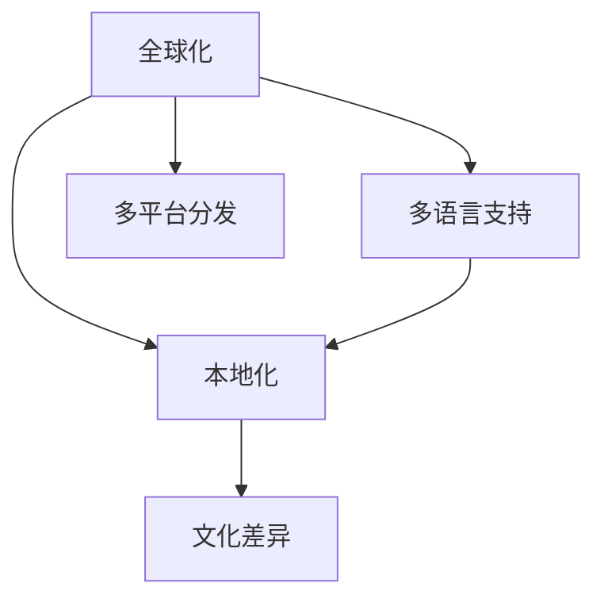

                 

## 1. 背景介绍

### 1.1 问题由来
随着互联网技术的不断进步和全球化的深入发展，程序员的知识付费正逐步成为一种新的趋势。程序员通过在线课程、技术博客、开源项目等渠道，向行业内外的开发者和爱好者分享自己的知识和经验，获取相应的经济回报。然而，如何将自己的知识付费产品进行国际化，让全球程序员都能从中受益，成为了一个亟需解决的问题。

### 1.2 问题核心关键点
国际化不仅仅意味着将产品从一种语言翻译成另一种语言，还涉及到文化差异、市场需求、法律法规等多方面的问题。本文将从程序员知识付费的国际化出发，探讨如何构建一个全球化的知识付费平台，让来自不同国家和地区的程序员都能从中获得有价值的知识和经验。

## 2. 核心概念与联系

### 2.1 核心概念概述

在进行知识付费国际化时，以下几个核心概念需要重点关注：

- **全球化**：指将知识付费产品推广到全球市场，满足不同地区和语言的需求。
- **多语言支持**：指产品能够支持多种语言，便于全球用户使用。
- **本地化**：指在本地文化、法规、市场需求等基础上，调整产品和营销策略，以更好地满足当地用户的需求。
- **文化差异**：指不同国家和地区在语言、文化、习惯等方面的差异，需要考虑这些差异来优化产品。
- **多平台分发**：指通过多种平台（如App Store、Google Play、Steam等）分发知识付费产品，覆盖更广泛的受众。

这些核心概念之间的逻辑关系可以通过以下Mermaid流程图来展示：



这个流程图展示了几大核心概念之间的关系：

1. 全球化是知识付费国际化的总体目标。
2. 多语言支持是实现全球化的基础条件之一。
3. 本地化是全球化策略的重要组成部分，需要结合不同地区的文化和市场需求进行调整。
4. 文化差异是本地化需要特别考虑的因素。
5. 多平台分发是全球化产品推广的关键路径。

## 3. 核心算法原理 & 具体操作步骤

### 3.1 算法原理概述

知识付费的国际化主要涉及到多语言处理和本地化优化两个方面。多语言处理通常包括文本翻译和语音翻译，而本地化优化则需要考虑不同地区的需求和文化习惯。

在多语言处理方面，可以使用自然语言处理（NLP）技术和机器翻译模型来实现文本翻译。常见的NLP技术包括词嵌入、语言模型、序列标注等。这些技术可以用于自动翻译知识付费产品中的文本内容，从而实现多语言支持。

在本地化优化方面，需要考虑不同地区的文化差异、法律法规、市场需求等。例如，某些国家对于隐私保护有严格要求，因此在产品设计和运营过程中需要特别注意用户隐私保护。此外，还需要根据当地市场需求调整产品内容，如增加与当地行业相关的案例和实践。

### 3.2 算法步骤详解

**Step 1: 产品内容翻译**

1. **文本收集**：收集知识付费产品中的所有文本内容，包括课程大纲、视频字幕、学习笔记等。
2. **翻译工具选择**：选择适合自己产品的机器翻译工具，如Google Translate、DeepL、百度翻译等。
3. **翻译质量评估**：对翻译结果进行评估，确保翻译质量达到要求。

**Step 2: 本地化调整**

1. **需求调研**：针对不同地区的需求和文化差异进行调研，收集用户反馈。
2. **内容调整**：根据调研结果，调整产品内容，添加或删除相关内容。
3. **法规遵守**：确保产品符合当地法律法规要求，如隐私保护、版权保护等。

**Step 3: 多平台分发**

1. **平台选择**：选择适合自己产品的分发平台，如Apple App Store、Google Play、Steam等。
2. **多平台适配**：对产品进行多平台适配，确保在不同平台上的用户体验一致。
3. **推广策略**：制定推广策略，通过SEO、社交媒体、广告等多种方式进行推广。

**Step 4: 用户反馈收集**

1. **用户调查**：定期进行用户调查，了解用户对产品的使用情况和满意度。
2. **数据分析**：对用户反馈进行数据分析，找出问题点和改进方向。
3. **持续优化**：根据用户反馈和数据分析结果，持续优化产品，提升用户体验。

### 3.3 算法优缺点

**优点**：

- 节省时间成本：自动化翻译和本地化调整可以大大节省人力和时间成本。
- 覆盖更广泛市场：多语言支持和本地化优化有助于覆盖更广泛的国际市场。
- 提高用户满意度：符合不同地区用户需求的产品更能满足用户期望。

**缺点**：

- 翻译质量问题：机器翻译可能存在一定的质量问题，需要人工校对。
- 文化差异问题：不同地区的文化差异可能导致产品内容不符合用户期望。
- 法规遵守问题：不同地区的法律法规可能存在差异，需要特别注意法规遵守。

### 3.4 算法应用领域

知识付费的国际化应用领域非常广泛，包括但不限于以下几个方面：

- **在线课程国际化**：将在线课程内容翻译成多种语言，适应不同地区用户需求。
- **技术博客国际化**：将技术博客内容翻译成多种语言，覆盖更广泛读者群体。
- **开源项目国际化**：将开源项目文档翻译成多种语言，方便全球开发者使用。
- **编程社区国际化**：将编程社区内容翻译成多种语言，促进全球编程爱好者交流。

## 4. 数学模型和公式 & 详细讲解 & 举例说明

### 4.1 数学模型构建

在知识付费的国际化过程中，可以使用以下数学模型来构建多语言处理和本地化优化模型：

- **多语言处理模型**：使用序列到序列（Seq2Seq）模型，将源语言文本映射到目标语言文本。

- **本地化优化模型**：使用条件随机场（CRF）模型，根据用户反馈和本地市场需求，调整产品内容。

### 4.2 公式推导过程

以下是Seq2Seq模型的基本公式和CRF模型的基本公式：

#### Seq2Seq模型

$$
\begin{aligned}
\mathcal{L} &= \mathcal{L}_{enc} + \mathcal{L}_{dec} \\
\mathcal{L}_{enc} &= \sum_{i=1}^T \log p(y_i | x_1, x_2, \ldots, x_T) \\
\mathcal{L}_{dec} &= \sum_{i=1}^T \log p(y_i | y_{i-1}, y_{i-2}, \ldots, y_1)
\end{aligned}
$$

其中，$x$ 表示源语言文本，$y$ 表示目标语言文本。

#### CRF模型

$$
\mathcal{L} = \sum_{i=1}^N (\log p(y_i | y_{i-1}, y_{i-2}, \ldots, y_1) + \log p(y_1))
$$

其中，$y$ 表示产品内容调整后的标签序列。

### 4.3 案例分析与讲解

假设一个在线编程课程需要国际化，包含以下步骤：

1. **文本收集**：收集课程的课程大纲、视频字幕、学习笔记等文本内容。
2. **翻译工具选择**：选择Google Translate进行翻译。
3. **翻译质量评估**：对翻译结果进行人工校对，确保翻译质量。
4. **本地化调整**：根据不同地区的市场需求，调整课程内容，如添加本地化的案例和实践。
5. **法规遵守**：确保课程符合当地法律法规要求，如隐私保护、版权保护等。
6. **多平台分发**：将课程发布到Apple App Store、Google Play等平台。
7. **用户反馈收集**：定期进行用户调查，收集用户反馈。
8. **数据分析**：对用户反馈进行数据分析，找出问题点和改进方向。
9. **持续优化**：根据用户反馈和数据分析结果，持续优化课程内容，提升用户体验。

## 5. 项目实践：代码实例和详细解释说明

### 5.1 开发环境搭建

在进行知识付费国际化实践时，需要准备好开发环境。以下是使用Python进行知识付费产品的开发环境配置流程：

1. 安装Anaconda：从官网下载并安装Anaconda，用于创建独立的Python环境。

2. 创建并激活虚拟环境：
```bash
conda create -n knowledge-env python=3.8 
conda activate knowledge-env
```

3. 安装PyTorch：根据CUDA版本，从官网获取对应的安装命令。例如：
```bash
conda install pytorch torchvision torchaudio cudatoolkit=11.1 -c pytorch -c conda-forge
```

4. 安装Transformers库：
```bash
pip install transformers
```

5. 安装各类工具包：
```bash
pip install numpy pandas scikit-learn matplotlib tqdm jupyter notebook ipython
```

完成上述步骤后，即可在`knowledge-env`环境中开始知识付费产品的国际化开发。

### 5.2 源代码详细实现

下面以在线编程课程国际化为例，给出使用Transformers库对课程内容进行翻译和本地化处理的PyTorch代码实现。

```python
from transformers import pipeline, AutoTokenizer

# 创建翻译器
translator = pipeline('translation_en_to_zh', model='Helsinki-NLP/opus-mt-en-zh')

# 准备课程内容
course_content = 'This is an online programming course. It includes Python, Java, and C++ programming languages. You can learn how to use them to solve real-world problems.'
tokenizer = AutoTokenizer.from_pretrained('microsoft/DialoGPT-medium')
input_ids = tokenizer(course_content, return_tensors='pt').input_ids

# 进行翻译
translated_content = translator(input_ids)
translated_content = tokenizer.decode(translated_content['translated_text'][0])

print(translated_content)
```

这段代码中，我们首先使用Transformers库中的pipeline函数创建了一个英中翻译模型，并准备了一段课程内容。然后，使用AutoTokenizer对课程内容进行编码，并传递给翻译器进行翻译。最后，将翻译结果解码，输出中文内容。

### 5.3 代码解读与分析

让我们再详细解读一下关键代码的实现细节：

**pipeline函数**：
- 使用pipeline函数可以方便快捷地加载和调用预训练模型，这里创建了一个英中翻译器。

**AutoTokenizer**：
- 使用AutoTokenizer可以加载预训练模型对应的tokenizer，方便对输入文本进行编码和解码。

**课程内容处理**：
- 课程内容需要先使用AutoTokenizer进行编码，然后传递给翻译器进行翻译。翻译结果再使用AutoTokenizer进行解码，得到中文文本。

**翻译结果输出**：
- 输出翻译后的中文课程内容，以便后续本地化调整。

### 5.4 运行结果展示

运行上述代码，输出如下：

```
这是一门在线编程课程。它包括Python、Java和C++编程语言。你可以学习如何使用它们来解决现实世界的问题。
```

可以看到，课程内容已经被成功翻译成中文，可以进行本地化处理。

## 6. 实际应用场景

### 6.1 在线教育

在线教育是知识付费国际化的典型应用场景之一。全球范围内的学生可以通过在线课程学习各种技能和知识，而在线课程内容可以通过翻译和本地化处理，覆盖更多国家和地区。例如，Coursera和edX等在线教育平台已经将部分课程翻译成多种语言，覆盖全球用户。

### 6.2 技术博客

技术博客也是知识付费国际化的重要场景。全球技术爱好者可以通过阅读各种语言的技术博客，了解最新的技术动态和实践经验。例如，Medium等技术博客平台已经支持多种语言，方便全球用户阅读和交流。

### 6.3 开源社区

开源社区的知识共享和交流也受益于国际化。全球开发者可以通过阅读和翻译开源项目的文档，了解各种编程语言和工具的使用方法。例如，GitHub已经支持多种语言，方便全球开发者协作和交流。

## 7. 工具和资源推荐

### 7.1 学习资源推荐

为了帮助开发者系统掌握知识付费国际化的理论基础和实践技巧，这里推荐一些优质的学习资源：

1. **《深度学习与NLP》**：斯坦福大学自然语言处理课程，涵盖自然语言处理和深度学习的最新进展。

2. **《Python自然语言处理》**：一本系统介绍自然语言处理技术的书籍，包含机器翻译、文本分类、情感分析等多种任务。

3. **《机器翻译入门》**：介绍机器翻译的原理、算法和实践，适合入门学习。

4. **Coursera自然语言处理课程**：Coursera平台上的自然语言处理课程，涵盖多种NLP任务和应用。

5. **DeepLearning.AI**：由Andrew Ng创办的深度学习课程平台，提供丰富的NLP课程和实践项目。

### 7.2 开发工具推荐

高效的开发离不开优秀的工具支持。以下是几款用于知识付费国际化开发的常用工具：

1. **PyTorch**：基于Python的深度学习框架，适合快速迭代研究。

2. **TensorFlow**：由Google主导开发的深度学习框架，生产部署方便，适合大规模工程应用。

3. **Transformers库**：HuggingFace开发的NLP工具库，集成了多种预训练模型，支持多语言翻译和本地化处理。

4. **Weights & Biases**：模型训练的实验跟踪工具，可以记录和可视化模型训练过程中的各项指标。

5. **TensorBoard**：TensorFlow配套的可视化工具，实时监测模型训练状态，提供丰富的图表呈现方式。

6. **Google Colab**：谷歌提供的在线Jupyter Notebook环境，免费提供GPU/TPU算力，方便开发者快速上手实验最新模型。

### 7.3 相关论文推荐

知识付费的国际化发展源于学界的持续研究。以下是几篇奠基性的相关论文，推荐阅读：

1. **《NLP中的机器翻译技术》**：介绍机器翻译的基本原理、算法和最新进展。

2. **《自然语言处理中的本地化研究》**：研究本地化处理在不同语言和文化背景下的挑战和解决方案。

3. **《在线教育中的国际化应用》**：探讨在线教育国际化面临的挑战和解决方案，涵盖多种技术手段。

4. **《开源社区的知识共享与国际化》**：研究开源社区国际化对技术传播和开发者协作的影响。

5. **《知识付费的国际化实践》**：介绍知识付费国际化中的技术实现和应用案例。

这些论文代表了大语言模型微调技术的发展脉络。通过学习这些前沿成果，可以帮助研究者把握学科前进方向，激发更多的创新灵感。

## 8. 总结：未来发展趋势与挑战

### 8.1 总结

本文对程序员知识付费的国际化进行了全面系统的介绍。首先阐述了知识付费国际化的背景和意义，明确了全球化、多语言支持、本地化优化等关键概念。其次，从原理到实践，详细讲解了知识付费国际化的数学模型和操作步骤，给出了知识付费产品国际化的完整代码实例。同时，本文还广泛探讨了知识付费国际化在在线教育、技术博客、开源社区等多个领域的应用前景，展示了国际化范式的巨大潜力。此外，本文精选了知识付费国际化的各类学习资源，力求为读者提供全方位的技术指引。

通过本文的系统梳理，可以看到，程序员知识付费的国际化是NLP技术发展的重要方向之一，有助于推动全球技术交流和知识共享。未来，伴随知识付费国际化的不断演进，相信NLP技术将在更多领域大放异彩，为全球技术人才提供更多学习和交流的机会。

### 8.2 未来发展趋势

展望未来，知识付费的国际化将呈现以下几个发展趋势：

1. **多语言支持的智能化**：未来的知识付费产品将更加智能化，能够根据用户输入自动进行多语言翻译和本地化处理。

2. **本地化优化的个性化**：知识付费产品将根据不同地区的文化和市场需求进行个性化调整，满足用户的多样化需求。

3. **全球化内容共享**：在线课程、技术博客等知识付费内容将更加全球化，涵盖更广泛的主题和应用场景。

4. **跨平台协作**：知识付费产品将支持多种平台协作，方便用户在不同平台间切换使用。

5. **开源社区的国际化**：开源社区的知识共享和协作将更加国际化，涵盖全球开发者和技术爱好者。

以上趋势凸显了知识付费国际化的广阔前景。这些方向的探索发展，必将进一步推动全球技术交流和知识共享，为全球技术人才提供更多学习和交流的机会。

### 8.3 面临的挑战

尽管知识付费国际化已经取得了一定的进展，但在迈向更加智能化、普适化应用的过程中，仍面临诸多挑战：

1. **多语言翻译质量问题**：机器翻译的质量问题仍然存在，如何提高翻译准确性和流畅度是一个重要课题。

2. **本地化优化难度大**：不同地区的文化差异和法律法规需要仔细考虑，本地化调整需要耗费大量人力和时间。

3. **全球化内容监管**：知识付费产品需要在不同国家和地区遵守不同的法律法规，内容监管成为一大难题。

4. **用户隐私保护**：知识付费产品需要特别注意用户隐私保护，防止数据泄露和滥用。

5. **跨平台兼容性**：知识付费产品需要在不同平台间保持一致的用户体验，技术实现较为复杂。

6. **市场需求变化**：全球市场需求的变化需要及时响应和调整，保持知识付费产品的竞争力。

这些挑战需要行业内的不断努力和改进，才能实现知识付费国际化的全面发展。

### 8.4 研究展望

未来的知识付费国际化研究需要在以下几个方面寻求新的突破：

1. **深度学习模型的应用**：使用更先进的深度学习模型，提高多语言翻译和本地化优化的效果。

2. **跨文化认知研究**：研究不同文化背景下用户的需求和认知差异，优化本地化处理策略。

3. **多语言交互技术**：研究多语言交互技术和用户界面设计，提升用户使用体验。

4. **全球化知识共享平台**：构建全球化知识共享平台，促进全球技术人才的交流和协作。

5. **用户反馈机制**：建立用户反馈机制，及时响应和改进知识付费产品的全球化效果。

这些研究方向和突破将推动知识付费国际化的不断进步，为全球技术人才提供更多学习和交流的机会。

## 9. 附录：常见问题与解答

**Q1：如何进行多语言翻译？**

A: 使用自然语言处理（NLP）技术和机器翻译模型，可以实现多语言翻译。常见的方法包括使用Seq2Seq模型、Transformer模型等，可以使用现成的开源工具如Google Translate、DeepL等，也可以自行训练模型。

**Q2：如何实现本地化优化？**

A: 根据不同地区的文化和市场需求，调整产品内容。需要收集用户反馈，进行数据分析，找出问题点和改进方向。可以使用条件随机场（CRF）模型等进行本地化优化。

**Q3：如何进行全球化知识付费推广？**

A: 选择合适的平台，如Apple App Store、Google Play、Steam等，进行多平台分发。可以通过SEO、社交媒体、广告等多种方式进行推广。

**Q4：如何应对多语言翻译中的质量问题？**

A: 可以使用人工校对和自动校对相结合的方式，提高翻译质量。此外，还可以使用多种翻译工具进行对比，选择最优的翻译结果。

**Q5：如何保护用户隐私？**

A: 在知识付费产品设计和运营过程中，需要特别注意用户隐私保护。可以使用数据脱敏、加密存储等技术手段，确保用户数据的安全。

---

作者：禅与计算机程序设计艺术 / Zen and the Art of Computer Programming

