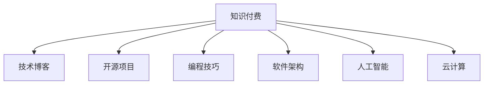

                 

# 程序员如何选择适合自己的知识付费方向

> 关键词：知识付费, 程序员, 职业发展, 技能提升, 技术博客, 开源项目, 编程技巧, 软件架构, 人工智能, 云计算

## 1. 背景介绍

### 1.1 问题由来
随着互联网技术的飞速发展，程序员面临的职业环境和技能需求也在不断变化。如何适应这种变化，提升个人职业素养和技能水平，成为了每一位程序员必须面对的问题。而知识付费作为近年来新兴的学习模式，通过集中付费获取优质内容和资源，帮助程序员快速学习新技术、掌握新知识，为职业发展赋能。然而，面对众多的知识付费产品和服务，如何找到最适合自己的方向，成为了困扰许多程序员的难题。

### 1.2 问题核心关键点
选择适合自己的知识付费方向，关键在于明确自身的职业目标和技能需求，同时匹配平台提供的课程和资源。常见的方向包括但不限于技术博客、开源项目、编程技巧、软件架构、人工智能、云计算等。本文将围绕这些方向展开详细分析，帮助程序员做出明智的选择。

## 2. 核心概念与联系

### 2.1 核心概念概述

- **知识付费**：指通过付费方式获取知识资源和服务，帮助个人快速提升技能和知识的平台。常见的形式包括在线课程、技术博客、编程答疑、开源项目等。

- **技术博客**：由专家或资深开发者撰写的技术分享平台，内容通常涵盖编程技巧、代码实践、工具使用等，适合深入学习和自我提升。

- **开源项目**：指在公共平台上开放源代码的项目，程序员可以通过参与项目开发、贡献代码等方式提升实战经验和协作能力。

- **编程技巧**：指实现具体编程任务所需要掌握的特定技能和方法，如数据结构、算法、性能优化等。

- **软件架构**：涉及软件系统设计、组件选择、架构模式等方面的知识和实践，是提升系统可维护性和扩展性的关键。

- **人工智能**：利用机器学习、深度学习等技术解决实际问题，如自然语言处理、图像识别、推荐系统等。

- **云计算**：基于互联网提供的基础设施服务，包括计算资源、存储资源、网络服务等，帮助开发者实现高效、灵活的开发和部署。

这些核心概念之间的联系可以通过以下Mermaid流程图来展示：



这个流程图展示了知识付费平台如何通过提供多样化的学习资源，帮助程序员在各个技术方向上成长。

## 3. 核心算法原理 & 具体操作步骤
### 3.1 算法原理概述

选择适合自己的知识付费方向，本质上是一个分类和匹配问题。通过对自身技能和职业目标的分析，找到与之匹配的知识付费资源，实现个人技能提升。这种匹配可以通过以下步骤实现：

1. **自我分析**：评估自身技能水平、职业目标、学习偏好等，明确需要提升的方向。
2. **资源筛选**：根据自我分析结果，筛选出合适的知识付费资源。
3. **学习实施**：按照选定的资源进行学习和实践，提升技能水平。
4. **效果评估**：定期评估学习效果，调整学习计划和资源。

### 3.2 算法步骤详解

#### 步骤一：自我分析

1. **技能水平评估**：
   - 列出当前掌握的主要编程语言和框架。
   - 评估自己在使用这些技术和工具时的熟练程度和实际经验。
   - 识别自己的弱项和需要提升的技能。

2. **职业目标设定**：
   - 确定自身职业发展的短期和长期目标，如升职、转行、技术深耕等。
   - 根据目标选择合适的技术方向和学习内容。

3. **学习偏好分析**：
   - 评估自己的学习习惯，如更喜欢视频课程还是文章教程。
   - 考虑自己的时间安排，选择适合自己的学习节奏。

#### 步骤二：资源筛选

1. **平台选择**：
   - 根据自身需求，选择适合自己技能提升方向的知识付费平台。
   - 常用的平台包括Coursera、Udacity、Udemy、慕课网、CSDN等。

2. **课程筛选**：
   - 在选定平台中，根据自身需求筛选适合的课程。
   - 重点关注课程内容、讲师资质、学员评价等。

3. **资源对比**：
   - 对比不同课程的优劣，选择最符合自己需求和学习风格的课程。
   - 参考学员反馈和课程评论，避免选择不适合自己的课程。

#### 步骤三：学习实施

1. **制定学习计划**：
   - 根据课程内容和时间安排，制定详细的学习计划。
   - 设置学习目标和里程碑，确保学习进度。

2. **执行学习计划**：
   - 按照计划完成课程学习，积极参与课程讨论和实践。
   - 记录学习过程中的问题和收获，及时调整学习策略。

#### 步骤四：效果评估

1. **定期自测**：
   - 通过编程练习、项目实践等方式，定期检验自己的学习效果。
   - 识别学习过程中的难点和不足，及时调整学习策略。

2. **反馈和改进**：
   - 向讲师或社区寻求反馈，改进学习方法和内容。
   - 根据反馈调整学习计划，确保学习效果最大化。

### 3.3 算法优缺点

#### 优点

1. **高效学习**：知识付费平台提供了系统化的课程和学习资源，帮助程序员快速掌握新技能。
2. **实时反馈**：通过课程讨论、导师辅导等方式，及时发现和解决学习中的问题。
3. **社区支持**：加入知识付费平台社区，与其他开发者交流经验，拓展人脉。

#### 缺点

1. **资源筛选困难**：面对众多课程和资源，选择合适的难度较大。
2. **学习成本较高**：部分高质量课程和学习资源需要付费，可能增加经济负担。
3. **依赖平台**：对知识付费平台的依赖较大，平台质量直接影响学习效果。

### 3.4 算法应用领域

知识付费技术广泛应用于多个领域，以下是几个典型应用场景：

- **编程技巧提升**：通过编程技巧相关的课程和博客，程序员可以系统地学习各种算法和数据结构，提升代码质量和效率。
- **软件架构设计**：通过参与开源项目，了解不同架构模式和组件选择，提升系统设计能力和可维护性。
- **人工智能应用**：利用人工智能相关的课程和资源，掌握机器学习、深度学习等技术，解决实际问题。
- **云计算实践**：通过云计算相关的课程，了解云平台使用和部署的最佳实践，提升开发和部署效率。

## 4. 数学模型和公式 & 详细讲解  
### 4.1 数学模型构建

选择知识付费方向的过程可以抽象为一个分类问题，即将程序员的技能和职业目标映射到合适的知识付费资源上。这里使用分类算法来描述这一过程。

设程序员的技能和职业目标为特征向量 $X$，知识付费资源为分类标签 $Y$。分类算法通过训练数据集，学习 $X$ 与 $Y$ 之间的映射关系。

假设训练集为 $D=\{(X_i, Y_i)\}_{i=1}^N$，其中 $X_i$ 为第 $i$ 个程序员的技能和职业目标向量，$Y_i$ 为对应的知识付费资源分类标签。分类算法的目标是找到一个映射函数 $f: X \rightarrow Y$，使得 $f(X_i)=Y_i$。

### 4.2 公式推导过程

以逻辑回归为例，推导分类算法的公式。

1. **假设函数**：
   $$
   h_{\theta}(X) = \sigma(\theta^T X)
   $$
   其中 $\theta$ 为分类器的参数，$\sigma$ 为激活函数。

2. **损失函数**：
   $$
   J(\theta) = -\frac{1}{N} \sum_{i=1}^N [Y_i \log h_{\theta}(X_i) + (1-Y_i) \log (1-h_{\theta}(X_i))]
   $$
   即交叉熵损失函数，用于衡量分类器预测输出与真实标签的差异。

3. **梯度下降**：
   $$
   \nabla_{\theta} J(\theta) = -\frac{1}{N} \sum_{i=1}^N [h_{\theta}(X_i)-Y_i] X_i
   $$
   利用梯度下降算法，最小化损失函数，更新分类器的参数 $\theta$。

### 4.3 案例分析与讲解

以软件开发人员选择人工智能方向为例，分析如何通过知识付费平台提升技能。

1. **自我分析**：
   - 技能评估：熟悉Python、JavaScript等编程语言，但对数据分析和机器学习不熟悉。
   - 职业目标：希望通过学习人工智能技术，提升自身在数据处理和模型构建方面的能力。

2. **资源筛选**：
   - 平台选择：Coursera、Udacity等在线教育平台。
   - 课程筛选：选择《机器学习》、《深度学习》等课程，评估讲师资质和学员评价。

3. **学习实施**：
   - 制定学习计划：每周学习10小时，完成课程内容，并完成配套练习和项目。
   - 执行学习计划：参加在线课程学习，积极参与课程讨论，完成项目实践。

4. **效果评估**：
   - 定期自测：通过编程练习，检验学习效果。
   - 反馈和改进：向讲师和社区寻求反馈，改进学习方法和内容。

## 5. 项目实践：代码实例和详细解释说明
### 5.1 开发环境搭建

为了实践知识付费方向的选择，需要搭建一个基本的开发环境。这里使用Python进行实现，具体步骤如下：

1. **安装Python**：从官网下载并安装Python，设置开发环境。

2. **安装依赖库**：
   ```bash
   pip install pandas numpy scikit-learn matplotlib tqdm jupyter notebook ipython
   ```

3. **配置项目目录**：
   ```bash
   mkdir project
   cd project
   ```

4. **创建学习计划管理工具**：
   ```bash
   python3 -m venv venv
   source venv/bin/activate
   ```

   创建虚拟环境，安装依赖库。

### 5.2 源代码详细实现

以下是一个简化的学习计划管理工具的代码实现：

```python
from datetime import datetime

class LearningPlan:
    def __init__(self, name, start_date, goal):
        self.name = name
        self.start_date = start_date
        self.goal = goal
        self.completed_tasks = []
    
    def add_task(self, task_name, due_date):
        self.completed_tasks.append({'task_name': task_name, 'due_date': due_date, 'completed': False})
    
    def complete_task(self, task_name):
        for task in self.completed_tasks:
            if task['task_name'] == task_name:
                task['completed'] = True
    
    def is_completed(self):
        for task in self.completed_tasks:
            if not task['completed']:
                return False
        return True
    
    def display_plan(self):
        print(f'Learning Plan: {self.name}')
        print(f'Start Date: {self.start_date}')
        print(f'Goal: {self.goal}')
        print('Tasks:')
        for task in self.completed_tasks:
            if task['completed']:
                print(f'Completed: {task["task_name"]}')
            else:
                print(f'Not completed: {task["task_name"]} (Due Date: {task["due_date"]})')

# 创建学习计划
plan = LearningPlan('AI Learning', datetime(2022, 1, 1), 'Master Machine Learning and Deep Learning')

# 添加任务
plan.add_task('Complete Coursera Machine Learning Course', datetime(2022, 3, 1))
plan.add_task('Complete Udacity Deep Learning Specialization', datetime(2022, 5, 1))

# 完成第一个任务
plan.complete_task('Complete Coursera Machine Learning Course')

# 显示学习计划
plan.display_plan()
```

### 5.3 代码解读与分析

**LearningPlan类**：
- `__init__`方法：初始化学习计划的名称、开始日期和目标。
- `add_task`方法：添加任务，记录任务名称和截止日期。
- `complete_task`方法：标记任务为已完成。
- `is_completed`方法：判断学习计划是否全部完成。
- `display_plan`方法：显示学习计划信息。

**代码实现**：
- 创建一个名为'AI Learning'的学习计划，目标是在2022年1月1日之前掌握机器学习和深度学习。
- 添加两个任务：在2022年3月1日之前完成Coursera的机器学习课程，在2022年5月1日之前完成Udacity的深度学习专项课程。
- 完成第一个任务'完成Coursera机器学习课程'，并在控制台输出更新后的学习计划。

通过这个简单的代码实现，展示了如何使用Python实现一个简单的学习计划管理工具。在实际开发中，可以根据需求添加更多功能和细节，如任务优先级、进度跟踪等。

## 6. 实际应用场景
### 6.1 智能客服系统开发

选择知识付费方向时，可以关注智能客服系统开发相关的课程和资源，如Python编程、Web开发、自然语言处理等。通过系统学习，掌握智能客服系统的开发方法和实践技能。

### 6.2 大数据平台搭建

选择知识付费方向时，可以关注大数据平台搭建相关的课程和资源，如Hadoop、Spark、Kafka等。通过系统学习，掌握大数据平台的基础架构和应用实践。

### 6.3 人工智能应用开发

选择知识付费方向时，可以关注人工智能应用开发相关的课程和资源，如机器学习、深度学习、自然语言处理等。通过系统学习，掌握人工智能技术的实现方法和应用场景。

### 6.4 区块链技术开发

选择知识付费方向时，可以关注区块链技术开发相关的课程和资源，如区块链原理、智能合约开发、共识算法等。通过系统学习，掌握区块链技术的开发和应用实践。

### 6.5 移动应用开发

选择知识付费方向时，可以关注移动应用开发相关的课程和资源，如Android开发、iOS开发、React Native等。通过系统学习，掌握移动应用的开发和设计方法。

## 7. 工具和资源推荐
### 7.1 学习资源推荐

为了帮助程序员选择适合自己的知识付费方向，这里推荐一些优质的学习资源：

1. **Coursera**：提供全球顶尖大学的在线课程，涵盖编程、数据科学、人工智能等众多领域。
2. **Udacity**：提供职业导向的在线课程，如深度学习、人工智能、数据科学等，适合进阶学习。
3. **慕课网**：提供IT技术、大数据、人工智能等领域的课程和实战项目，适合动手实践。
4. **CSDN**：提供软件开发、编程技巧、软件架构等领域的博客和视频教程，适合技术分享。
5. **LeetCode**：提供算法和数据结构练习题库，适合提升编程技能。
6. **GitHub**：提供开源项目和代码库，适合参与项目开发和协作。

### 7.2 开发工具推荐

为了支持程序员的学习和开发，这里推荐一些常用的开发工具：

1. **Python**：一种广泛使用的高级编程语言，适合数据科学、人工智能、Web开发等领域。
2. **Jupyter Notebook**：一种交互式开发环境，适合数据分析、机器学习等领域的开发和调试。
3. **Git**：一种分布式版本控制系统，适合代码管理和版本控制。
4. **GitHub**：一个代码托管平台，适合存储和管理开源项目。
5. **Virtualenv**：一个Python虚拟环境管理工具，适合创建和管理隔离的Python环境。
6. **Anaconda**：一个数据科学和机器学习平台，提供了大量的科学计算和数据处理库。

### 7.3 相关论文推荐

以下是几篇具有代表性的相关论文，推荐阅读：

1. **《程序员应该知道的人工智能》**：介绍人工智能的基本概念和应用场景，适合初学者了解。
2. **《深度学习：神经网络和表示学习》**：深度学习领域的经典教材，适合深入学习深度学习算法。
3. **《机器学习实战》**：涵盖机器学习基础、模型选择、算法实现等方面的内容，适合动手实践。
4. **《Python编程：从入门到实践》**：Python编程语言入门教程，适合编程初学者。
5. **《分布式计算：原理与实践》**：介绍分布式计算的基本原理和实践方法，适合大数据和云计算领域的学习。

## 8. 总结：未来发展趋势与挑战
### 8.1 研究成果总结

选择适合自己的知识付费方向，是程序员职业发展的重要一环。通过系统学习，程序员可以提升自身技能，拓展职业机会。本文详细介绍了选择知识付费方向的思路和步骤，提供了实用的学习资源和开发工具推荐。

### 8.2 未来发展趋势

随着技术的不断进步，知识付费市场将呈现以下几个发展趋势：

1. **个性化推荐**：利用大数据和机器学习技术，为用户提供个性化课程推荐，提高学习效率。
2. **内容创新**：引入更多前沿技术和实践案例，推动课程内容的持续更新和创新。
3. **移动学习**：利用移动设备和应用，实现随时随地学习，打破时间和空间的限制。
4. **社交学习**：通过社交平台和社区，实现知识共享和协作，提升学习效果。

### 8.3 面临的挑战

尽管知识付费市场前景广阔，但在发展过程中仍面临一些挑战：

1. **资源质量参差不齐**：面对众多课程和资源，如何筛选出高质量的内容，仍然是一个难题。
2. **学习效果评估**：如何科学评估学习效果，识别学习过程中的问题和不足，是一个需要解决的问题。
3. **学习成本**：部分高质量课程和学习资源需要付费，增加了学习成本，可能会影响普及率。
4. **平台质量差异**：不同知识付费平台的教学质量和服务水平差异较大，需要用户进行甄别和选择。

### 8.4 研究展望

为了解决上述挑战，未来的研究需要在以下几个方面进行探索：

1. **课程质量提升**：提高课程内容和讲师质量的准入门槛，确保课程的有效性和实用性。
2. **学习效果评估**：引入自动化评估工具和用户反馈机制，科学评估学习效果，优化学习计划。
3. **学习成本降低**：推出更多免费和低成本的优质课程，扩大知识付费的覆盖范围。
4. **平台质量提升**：优化知识付费平台的用户体验和服务质量，提高用户满意度和平台竞争力。

这些研究方向的探索，将推动知识付费市场的持续发展，为程序员提供更优质、高效的学习资源和服务。

## 9. 附录：常见问题与解答

**Q1：知识付费方向选择有什么建议？**

A: 选择知识付费方向时，建议从自身职业目标和技能需求出发，选择最适合自己的方向。可以参考以下几个步骤：
1. 评估当前技能水平和职业目标。
2. 筛选出符合自己需求的知识付费资源。
3. 制定详细的学习计划，并坚持执行。

**Q2：如何评估知识付费课程的质量？**

A: 评估知识付费课程的质量可以从以下几个方面入手：
1. 课程内容：课程是否涵盖全面的知识体系，是否有实际案例和实战项目。
2. 讲师资质：讲师是否具有丰富的行业经验和教学经验，是否有权威认证。
3. 学员评价：通过查看学员评价和反馈，了解课程的实际效果和学习体验。
4. 课程更新：课程内容是否定期更新，保持最新的技术和知识。

**Q3：如何选择适合自己的学习资源？**

A: 选择适合自己的学习资源时，可以从以下几个方面考虑：
1. 学习目标：明确自己的学习目标，选择与之匹配的资源。
2. 学习方式：选择适合自己的学习方式，如视频课程、文章教程、实践项目等。
3. 学习节奏：考虑自己的时间安排和学习习惯，选择适合自己的学习节奏。
4. 学习平台：选择知名的、权威的知识付费平台，确保课程质量和教学服务。

**Q4：如何进行高效的学习计划管理？**

A: 进行高效的学习计划管理时，可以从以下几个方面入手：
1. 制定详细的学习计划，包括学习目标、任务分配、时间安排等。
2. 使用学习计划管理工具，如Python脚本、Excel表格等，记录和跟踪学习进度。
3. 定期评估学习效果，调整学习计划和方法。
4. 坚持执行学习计划，遇到问题及时反馈和调整。

**Q5：如何利用知识付费平台提升职业技能？**

A: 利用知识付费平台提升职业技能时，可以从以下几个方面入手：
1. 选择与职业目标和技能需求相匹配的课程和资源。
2. 制定详细的学习计划，并坚持执行。
3. 积极参与课程讨论和实践，积累实战经验。
4. 通过项目实践和实战项目，提升技能水平。
5. 向讲师和社区寻求反馈，不断改进学习方法和内容。

通过以上分析和建议，相信程序员可以更加明智地选择适合自己的知识付费方向，不断提升自身技能，拓展职业发展空间。

---

作者：禅与计算机程序设计艺术 / Zen and the Art of Computer Programming

