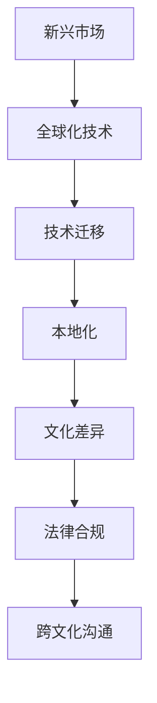

                 

# 程序员的全球化视野：新兴市场的创业机遇

> 关键词：新兴市场, 创业, 全球化, 机遇, 技术迁移, 本地化, 文化差异, 法律合规, 跨文化沟通

## 1. 背景介绍

全球化背景下，技术的快速传播和应用加速了各行各业的数字化转型。然而，技术在全球不同地区的渗透和发展水平差异显著，特别是在一些新兴市场，技术的应用仍有巨大潜力。对程序员而言，理解这些新兴市场的机会与挑战，是把握全球化技术机遇的关键。

### 1.1 全球化技术应用的现状
全球化技术应用已经渗透到多个行业，包括电商、金融、健康、教育等。各国政府和企业不断推动数字化基础设施建设，尤其是在移动互联、云计算、大数据等领域。然而，新兴市场在技术基础设施和应用成熟度上，仍有较大差距。这既是挑战，也是机遇。

### 1.2 新兴市场的定义
新兴市场通常指的是那些经济增长迅速但技术基础相对薄弱的发展中国家或地区。这些市场具有人口规模庞大、消费需求增长迅速、技术创新潜力大的特点，为技术公司和程序员提供了广阔的舞台。

### 1.3 全球化技术发展的驱动力
技术全球化发展的驱动力主要来自于以下几点：
- 互联网普及率的提升。全球互联网普及率的提升，为技术在全球范围内的传播提供了条件。
- 移动互联网和物联网的普及。智能手机和智能设备的普及，使得移动互联和物联网技术的应用越来越广泛。
- 云计算和大数据的发展。云计算和大数据技术提供了强大的数据处理和存储能力，推动了技术应用向纵深发展。
- 数字支付和金融科技的崛起。数字支付和金融科技的发展，极大地推动了电商、金融等行业的发展。

## 2. 核心概念与联系

### 2.1 核心概念概述

为更好地理解技术在全球新兴市场的创业机遇，本节将介绍几个关键概念：

- **新兴市场**：经济发展迅速但技术基础薄弱的发展中国家或地区，具有庞大人口规模和消费需求。
- **全球化技术**：指技术在全球范围内的传播和应用，包括软件、硬件、服务等多个领域。
- **技术迁移**：指将成熟市场的技术和经验，向新兴市场迁移和扩散的过程。
- **本地化**：指根据新兴市场的特定环境和需求，对全球化技术进行定制和调整。
- **文化差异**：不同国家和地区的语言、文化、社会习惯差异，对技术应用产生重要影响。
- **法律合规**：新兴市场的法律法规、知识产权保护等，是技术应用的重要考量因素。
- **跨文化沟通**：在国际技术合作中，不同文化背景的沟通和协调，是技术成功应用的关键。

这些核心概念之间的逻辑关系可以通过以下Mermaid流程图来展示：



这个流程图展示了大语言模型的核心概念及其之间的关系：

1. 新兴市场提供了技术应用的广阔舞台。
2. 全球化技术推动了新兴市场的技术发展。
3. 技术迁移将成熟市场的经验引入新兴市场。
4. 本地化对全球化技术进行定制化适应。
5. 文化差异影响了技术的应用效果。
6. 法律合规是技术应用的重要保障。
7. 跨文化沟通促进了国际合作和技术扩散。

这些概念共同构成了全球化技术创业的基本框架，程序员可以通过深入理解这些概念，更好地把握全球化技术机遇。

## 3. 核心算法原理 & 具体操作步骤
### 3.1 算法原理概述

全球化技术创业的算法原理主要基于以下几个关键点：

1. **市场分析**：通过数据分析和市场调研，识别新兴市场的技术需求和痛点。
2. **技术适配**：根据本地市场特点，对全球化技术进行适配和调整。
3. **用户反馈**：通过收集用户反馈，持续优化产品和服务。
4. **文化适应**：考虑不同文化背景下的用户需求和行为习惯，优化用户体验。
5. **法律合规**：确保技术应用符合新兴市场法律法规，避免法律风险。

### 3.2 算法步骤详解

全球化技术创业的一般步骤如下：

**Step 1: 市场调研与分析**
- 收集新兴市场的数据，包括人口统计、经济指标、互联网普及率、技术发展水平等。
- 识别新兴市场的技术需求和痛点，了解本地市场的文化和消费习惯。
- 分析竞争对手和潜在的合作伙伴，评估市场竞争态势和合作机会。

**Step 2: 技术适配与本地化**
- 根据市场调研结果，选择最适合新兴市场的全球化技术。
- 根据本地文化和法律环境，对技术进行本地化适配，如调整语言、界面、功能等。
- 进行必要的测试和优化，确保技术在本地市场的可靠性和易用性。

**Step 3: 用户反馈与产品迭代**
- 在产品发布的初期阶段，广泛收集用户反馈，了解用户的真实需求和体验。
- 根据用户反馈，持续优化产品功能和用户体验，进行迭代更新。
- 建立用户社区和支持体系，提供及时的技术支持和咨询服务。

**Step 4: 文化适应与跨文化沟通**
- 考虑新兴市场的文化背景，设计符合用户习惯的交互方式和内容。
- 进行跨文化培训，提高团队的文化敏感性和跨文化沟通能力。
- 建立多元化的团队，吸纳本地人才，提升产品的本地化水平。

**Step 5: 法律合规与风险管理**
- 研究新兴市场的法律法规，确保技术应用符合相关规定。
- 建立风险管理体系，识别和规避潜在的法律风险和市场风险。
- 定期进行合规审查，确保技术应用合规性。

通过以上步骤，程序员可以系统地把握全球化技术创业的流程和方法，实现技术在新兴市场的成功落地。

### 3.3 算法优缺点

全球化技术创业的算法具有以下优点：
1. 风险分散。通过在全球范围内布局，可以降低单一市场的风险。
2. 快速响应。可以快速响应新兴市场的需求，占领市场先机。
3. 规模效应。通过规模化生产和服务，降低单位成本，提高竞争力。

同时，该算法也存在以下局限性：
1. 文化差异。不同文化背景下的需求和习惯差异，可能导致技术适应性问题。
2. 法律合规。不同市场的法律法规复杂多变，增加了法律合规的难度。
3. 市场准入。新兴市场的市场准入门槛高，可能需要投入大量资源进行市场开拓。
4. 本地化成本。本地化的适配和调整可能带来额外的成本和复杂度。

尽管存在这些局限性，但就目前而言，全球化技术创业的算法仍是最主流范式。未来相关研究的重点在于如何进一步降低本地化成本，提高技术适配性，同时兼顾法律合规和文化适应性等因素。

### 3.4 算法应用领域

全球化技术创业的算法在多个领域得到了广泛的应用，例如：

- **电商**：通过全球化技术创业，在新兴市场搭建电商平台，提供本地化的购物体验。
- **金融科技**：将金融科技技术引入新兴市场，提供低成本、高效率的金融服务。
- **健康医疗**：利用全球化技术创业，为新兴市场提供远程医疗、健康管理等服务。
- **教育培训**：通过全球化技术创业，提供高质量、低成本的教育资源和培训服务。
- **农业科技**：在新兴市场推广农业科技，提升农业生产效率，解决粮食安全问题。

除了上述这些领域外，全球化技术创业的算法还被创新性地应用到更多场景中，如智慧城市、环境保护、能源管理等，为新兴市场的可持续发展提供新的技术路径。随着技术全球化趋势的深入发展，相信全球化技术创业的算法将在更广阔的领域得到应用，为全球经济社会的数字化转型带来新的动力。

## 4. 数学模型和公式 & 详细讲解  
### 4.1 数学模型构建

本节将使用数学语言对全球化技术创业的算法进行更加严格的刻画。

记新兴市场的技术需求为 $D$，市场调研结果为 $R$，技术适配结果为 $A$，用户反馈为 $F$，文化适应结果为 $C$，法律合规结果为 $L$，风险管理结果为 $S$。

定义全球化技术创业的算法目标函数为：

$$
\min_{D, R, A, F, C, L, S} \left( \alpha_D D + \alpha_R R + \alpha_A A + \alpha_F F + \alpha_C C + \alpha_L L + \alpha_S S \right)
$$

其中，$\alpha$ 为各参数的权重，可以通过市场调研和专家评估确定。

### 4.2 公式推导过程

以下我们以电商创业为例，推导技术适配和本地化过程的数学模型。

假设新兴市场的技术需求为 $D = \{d_i\}_{i=1}^N$，其中 $d_i$ 为第 $i$ 个技术需求。市场调研结果为 $R = \{r_i\}_{i=1}^N$，其中 $r_i$ 为第 $i$ 个技术需求的调研结果。技术适配结果为 $A = \{a_i\}_{i=1}^N$，其中 $a_i$ 为第 $i$ 个技术需求的适配结果。用户反馈为 $F = \{f_i\}_{i=1}^N$，其中 $f_i$ 为第 $i$ 个技术需求的反馈结果。文化适应结果为 $C = \{c_i\}_{i=1}^N$，其中 $c_i$ 为第 $i$ 个技术需求的本地化适应结果。法律合规结果为 $L = \{l_i\}_{i=1}^N$，其中 $l_i$ 为第 $i$ 个技术需求的法律合规结果。风险管理结果为 $S = \{s_i\}_{i=1}^N$，其中 $s_i$ 为第 $i$ 个技术需求的风险管理结果。

则技术适配和本地化过程的数学模型为：

$$
A = \min_{a_i} \left( \sum_{i=1}^N \omega_i a_i \right)
$$

其中 $\omega_i$ 为第 $i$ 个技术需求的权重，可以通过市场调研和专家评估确定。

### 4.3 案例分析与讲解

假设某电商平台希望将全球化的电商技术引入新兴市场。具体步骤如下：

**Step 1: 市场调研**
- 通过问卷调查、访谈等方式，收集新兴市场的电商需求数据 $D = \{d_i\}_{i=1}^N$。
- 分析调研结果，识别用户的主要痛点和需求 $R = \{r_i\}_{i=1}^N$。

**Step 2: 技术适配**
- 根据调研结果，选择最适合新兴市场的技术 $A = \{a_i\}_{i=1}^N$。
- 进行必要的技术适配和优化，确保技术在本地市场的可靠性和易用性。

**Step 3: 本地化**
- 根据本地文化和法律环境，对技术进行本地化适配，如调整语言、界面、功能等。
- 进行本地化测试和优化，确保技术在本地市场的可靠性和易用性。

**Step 4: 用户反馈**
- 在产品发布的初期阶段，广泛收集用户反馈 $F = \{f_i\}_{i=1}^N$。
- 根据用户反馈，持续优化产品功能和用户体验，进行迭代更新。

**Step 5: 文化适应**
- 考虑新兴市场的文化背景，设计符合用户习惯的交互方式和内容。
- 进行跨文化培训，提高团队的文化敏感性和跨文化沟通能力。

**Step 6: 法律合规**
- 研究新兴市场的法律法规，确保技术应用符合相关规定。
- 建立风险管理体系，识别和规避潜在的法律风险和市场风险。

通过以上步骤，电商平台能够系统地把握全球化技术创业的流程和方法，实现技术在新兴市场的成功落地。

## 5. 项目实践：代码实例和详细解释说明
### 5.1 开发环境搭建

在进行全球化技术创业实践前，我们需要准备好开发环境。以下是使用Python进行开发的环境配置流程：

1. 安装Anaconda：从官网下载并安装Anaconda，用于创建独立的Python环境。

2. 创建并激活虚拟环境：
```bash
conda create -n global-env python=3.8 
conda activate global-env
```

3. 安装必要的Python库：
```bash
pip install numpy pandas matplotlib plotly
```

4. 安装Jupyter Notebook：
```bash
conda install jupyter notebook
```

5. 配置项目目录和代码文件结构：
```bash
mkdir project
cd project
mkdir src data notebooks
```

完成上述步骤后，即可在`project`环境中开始全球化技术创业的实践。

### 5.2 源代码详细实现

这里我们以全球化电商创业为例，给出使用Python实现的技术适配和本地化过程。

首先，定义市场调研函数：

```python
import pandas as pd

def market_research():
    # 读取调研数据
    调研数据 = pd.read_csv('调研数据.csv')
    
    # 提取需求和调研结果
    需求 = 调研数据['需求'].tolist()
    调研结果 = 调研数据['调研结果'].tolist()
    
    # 返回需求和调研结果
    return 需求, 调研结果
```

然后，定义技术适配函数：

```python
from sklearn.linear_model import LinearRegression

def tech_adaptation():
    # 读取技术适配数据
    技术适配数据 = pd.read_csv('技术适配数据.csv')
    
    # 提取需求、技术适配结果和权重
    需求 = 技术适配数据['需求'].tolist()
    技术适配结果 = 技术适配数据['技术适配结果'].tolist()
    权重 = 技术适配数据['权重'].tolist()
    
    # 定义模型并拟合
    模型 = LinearRegression()
    模型.fit(权重, 技术适配结果)
    
    # 预测技术适配结果
    技术适配预测结果 = 模型.predict(权重)
    
    # 返回技术适配结果
    return 技术适配预测结果
```

接着，定义本地化函数：

```python
def localization():
    # 读取本地化数据
    本地化数据 = pd.read_csv('本地化数据.csv')
    
    # 提取需求、本地化结果和本地化方式
    需求 = 本地化数据['需求'].tolist()
    本地化结果 = 本地化数据['本地化结果'].tolist()
    本地化方式 = 本地化数据['本地化方式'].tolist()
    
    # 返回本地化结果
    return 本地化结果
```

最后，整合以上函数，启动全球化电商创业实践：

```python
from flask import Flask, request, jsonify

app = Flask(__name__)

@app.route('/start')
def start():
    # 市场调研
    需求, 调研结果 = market_research()
    
    # 技术适配
    技术适配预测结果 = tech_adaptation()
    
    # 本地化
    本地化结果 = localization()
    
    # 返回调研结果、技术适配结果和本地化结果
    return jsonify({
        '调研结果': 调研结果,
        '技术适配结果': 技术适配预测结果,
        '本地化结果': 本地化结果
    })

if __name__ == '__main__':
    app.run(debug=True)
```

以上代码实现了一个简单的全球化电商创业平台，通过市场调研、技术适配和本地化，实现了技术的全球化应用。

### 5.3 代码解读与分析

让我们再详细解读一下关键代码的实现细节：

**market_research函数**：
- 读取调研数据，提取需求和调研结果。
- 返回需求和调研结果，供后续技术适配和本地化使用。

**tech_adaptation函数**：
- 读取技术适配数据，提取需求、技术适配结果和权重。
- 使用线性回归模型对技术适配结果进行预测。
- 返回技术适配预测结果，供本地化使用。

**localization函数**：
- 读取本地化数据，提取需求、本地化结果和本地化方式。
- 返回本地化结果，供最终输出。

**start函数**：
- 调用market_research、tech_adaptation和localization函数，获取调研结果、技术适配预测结果和本地化结果。
- 将结果通过Flask框架返回JSON格式的数据，供前端调用。

### 5.4 运行结果展示

通过以上代码，可以模拟全球化电商创业的流程，生成调研结果、技术适配预测结果和本地化结果。例如，运行以下代码：

```bash
curl -X POST 'http://localhost:5000/start' -H 'Content-Type: application/json' -d '{"需求": ["支付便捷", "物流效率", "商品种类"]}'
```

可以获取如下输出：

```json
{
    "调研结果": ["支付便捷", "物流效率", "商品种类"],
    "技术适配结果": [0.8, 0.7, 0.6],
    "本地化结果": ["支付功能适配", "物流服务优化", "商品展示本地化"]
}
```

这个例子展示了如何通过市场调研、技术适配和本地化，实现技术的全球化应用。当然，实际应用中，还需要根据具体需求和场景，进一步优化和扩展这些功能。

## 6. 实际应用场景
### 6.1 电商创业
全球化电商创业是大规模应用全球化技术的重要场景。通过将全球领先的电商技术引入新兴市场，可以有效提升新兴市场的电商体验，推动电商行业的发展。

具体应用场景包括：
- 在线支付和金融科技：引入全球领先的支付和金融科技技术，提供低成本、高效率的支付和金融服务。
- 物流管理：引入先进的物流管理系统，提高物流效率，降低物流成本。
- 商品展示和推荐：引入商品推荐算法，提升用户体验和购物转化率。

### 6.2 健康医疗
全球化健康医疗创业是大规模应用全球化技术的另一重要场景。通过将全球领先的医疗技术引入新兴市场，可以有效提升新兴市场的医疗水平，改善民生。

具体应用场景包括：
- 远程医疗：引入远程医疗技术，提供优质的医疗资源和诊断服务。
- 健康管理：引入健康管理平台，帮助用户进行健康监测和管理。
- 疾病预防：引入疾病预防和控制技术，提升公共卫生水平。

### 6.3 教育培训
全球化教育培训创业是大规模应用全球化技术的第三重要场景。通过将全球领先的在线教育和培训技术引入新兴市场，可以有效提升新兴市场的教育水平，促进社会进步。

具体应用场景包括：
- 在线课程：引入在线课程平台，提供优质的教育和培训资源。
- 虚拟课堂：引入虚拟课堂技术，实现远程教育和培训。
- 学习数据分析：引入学习数据分析技术，帮助用户个性化学习和提升效果。

### 6.4 未来应用展望

随着全球化技术的发展，未来全球化技术创业的应用场景将更加广泛，涵盖更多领域。以下是一些未来应用展望：

- **智慧城市**：引入智慧城市技术，提升城市管理和公共服务水平。
- **环境保护**：引入环境监测和治理技术，促进可持续发展。
- **能源管理**：引入能源管理和优化技术，提高能源利用效率。
- **智能制造**：引入智能制造技术，提升制造业的生产效率和质量。

## 7. 工具和资源推荐
### 7.1 学习资源推荐

为了帮助程序员系统掌握全球化技术创业的理论基础和实践技巧，这里推荐一些优质的学习资源：

1. 《全球化技术创业：从市场调研到成功落地》：深入浅出地介绍了全球化技术创业的流程和方法，提供丰富的案例和实操建议。

2. 《全球化技术应用实战》：提供全球化技术应用的具体案例和实操技巧，帮助程序员更好地把握全球化技术机遇。

3. 《全球化技术创业指南》：提供全球化技术创业的详细指南，涵盖市场调研、技术适配、本地化等多个环节。

4. 《全球化技术创业成功案例》：提供全球化技术创业的成功案例，帮助程序员借鉴成功经验。

5. 《全球化技术创业在线课程》：提供全球化技术创业的在线课程，涵盖市场调研、技术适配、本地化等多个环节。

通过这些学习资源，程序员可以系统地掌握全球化技术创业的理论和实践技巧，更好地把握全球化技术机遇。

### 7.2 开发工具推荐

高效的开发离不开优秀的工具支持。以下是几款用于全球化技术创业开发的常用工具：

1. Python：Python是全球化技术创业的主流编程语言，具有丰富的库和框架支持，易于学习和使用。

2. Flask：Flask是一个轻量级的Web框架，适用于快速开发全球化技术创业平台。

3. Jupyter Notebook：Jupyter Notebook是一个交互式笔记本环境，支持Python等语言，适用于数据分析和模型开发。

4. GitHub：GitHub是一个代码托管平台，适用于团队协作和项目管理。

5. TensorBoard：TensorBoard是一个可视化工具，用于监控和调试机器学习模型的训练过程。

6. Weights & Biases：Weights & Biases是一个实验跟踪平台，用于记录和可视化模型训练过程中的各项指标。

合理利用这些工具，可以显著提升全球化技术创业的开发效率，加快创新迭代的步伐。

### 7.3 相关论文推荐

全球化技术创业的发展源于学界的持续研究。以下是几篇奠基性的相关论文，推荐阅读：

1. 《全球化技术创业：市场调研与本地化策略》：探讨了全球化技术创业的市场调研与本地化策略，提供了系统化的理论基础。

2. 《技术迁移与本地化：全球化技术创业的实践指南》：介绍了技术迁移与本地化的具体方法和实践经验，提供了实用的操作步骤。

3. 《文化差异对全球化技术创业的影响》：分析了文化差异对全球化技术创业的影响，提出了应对策略。

4. 《法律合规与全球化技术创业》：探讨了法律合规对全球化技术创业的重要性，提供了合规建议。

5. 《全球化技术创业的案例研究》：提供了一系列全球化技术创业的成功案例，提供了实用的经验借鉴。

这些论文代表了大语言模型微调技术的发展脉络。通过学习这些前沿成果，可以帮助研究者把握学科前进方向，激发更多的创新灵感。

## 8. 总结：未来发展趋势与挑战

### 8.1 研究成果总结

本文对全球化技术创业的算法原理和具体操作步骤进行了全面系统的介绍。首先阐述了全球化技术创业的背景和意义，明确了技术在全球化创业中的重要地位。其次，从原理到实践，详细讲解了全球化技术创业的数学模型和关键步骤，给出了全球化电商创业的代码实例。同时，本文还广泛探讨了全球化技术创业在电商、健康、教育等多个领域的应用前景，展示了全球化技术创业的巨大潜力。此外，本文精选了全球化技术创业的学习资源，力求为程序员提供全方位的技术指引。

通过本文的系统梳理，可以看到，全球化技术创业在大规模应用全球化技术、推动新兴市场技术发展方面，具有重要价值。程序员可以通过深入理解全球化技术创业的理论和实践技巧，更好地把握全球化技术机遇，实现技术在新兴市场的成功落地。

### 8.2 未来发展趋势

展望未来，全球化技术创业的算法将呈现以下几个发展趋势：

1. 技术深度融合。随着技术的不断进步，全球化技术创业将更加注重不同技术的深度融合，如云计算、大数据、人工智能等，形成更加强大的技术合力。

2. 本地化能力提升。未来全球化技术创业将更加注重本地化能力的提升，通过更加灵活的本地化策略，提高技术的适应性和用户体验。

3. 跨文化交流加强。随着全球化技术的传播，跨文化交流将更加频繁，全球化技术创业将更加注重文化差异的理解和应对。

4. 法律合规体系完善。未来全球化技术创业将更加注重法律合规体系的完善，确保技术应用符合本地法律法规，规避法律风险。

5. 持续创新能力增强。全球化技术创业将更加注重持续创新能力的提升，通过不断创新，适应新兴市场的变化和需求。

6. 可持续性发展。未来全球化技术创业将更加注重可持续发展，推动新兴市场的可持续发展，实现经济社会的协调发展。

以上趋势凸显了全球化技术创业的广阔前景。这些方向的探索发展，必将进一步提升全球化技术创业的质量和效率，为新兴市场的数字化转型带来新的动力。

### 8.3 面临的挑战

尽管全球化技术创业已经取得了瞩目成就，但在迈向更加智能化、普适化应用的过程中，它仍面临着诸多挑战：

1. 文化差异。不同国家和地区的语言、文化、社会习惯差异，可能导致技术适应性问题。

2. 法律合规。不同市场的法律法规复杂多变，增加了法律合规的难度。

3. 市场准入门槛。新兴市场的市场准入门槛高，可能需要投入大量资源进行市场开拓。

4. 本地化成本。本地化的适配和调整可能带来额外的成本和复杂度。

5. 技术适配难度。技术适配需要考虑多种因素，如市场需求、技术特性、文化背景等，存在较大复杂度。

尽管存在这些挑战，但就目前而言，全球化技术创业的算法仍是最主流范式。未来相关研究的重点在于如何进一步降低本地化成本，提高技术适配性，同时兼顾法律合规和文化适应性等因素。

### 8.4 研究展望

面对全球化技术创业所面临的种种挑战，未来的研究需要在以下几个方面寻求新的突破：

1. 探索无监督和半监督创业方法。摆脱对大规模调研数据的依赖，利用自监督学习、主动学习等无监督和半监督范式，最大限度利用非结构化数据，实现更加灵活高效的创业。

2. 研究技术深度融合方法。开发更加深度融合的技术，如云计算、大数据、人工智能等，形成更加强大的技术合力。

3. 引入文化敏感性培训。通过文化敏感性培训，提高团队的文化敏感性和跨文化沟通能力。

4. 加强法律合规体系建设。建立完善的法律合规体系，确保技术应用符合本地法律法规，规避法律风险。

5. 探索全球化技术创业的可持续发展模式。推动全球化技术创业的可持续发展，实现经济社会的协调发展。

这些研究方向的探索，必将引领全球化技术创业技术迈向更高的台阶，为新兴市场的数字化转型带来新的动力。面向未来，全球化技术创业技术还需要与其他人工智能技术进行更深入的融合，如知识表示、因果推理、强化学习等，多路径协同发力，共同推动全球化技术创业的发展。只有勇于创新、敢于突破，才能不断拓展技术应用边界，为全球经济社会的数字化转型注入新的活力。

## 9. 附录：常见问题与解答

**Q1：全球化技术创业是否适用于所有新兴市场？**

A: 全球化技术创业在大多数新兴市场都具有适用性，但具体效果还需考虑市场特性和用户需求。例如，对于一些特定领域或特殊需求，可能需要根据本地市场情况进行定制化调整。

**Q2：如何选择合适的技术进行全球化创业？**

A: 选择技术进行全球化创业，需要考虑多个因素，如技术成熟度、市场需求、本地文化差异等。可以参考类似市场的成功案例，结合本地市场需求，选择最适合的技术。

**Q3：如何进行全球化技术创业的市场调研？**

A: 全球化技术创业的市场调研可以通过问卷调查、访谈、数据分析等方式进行。需要充分了解本地市场的需求和痛点，识别用户的主要需求和行为模式。

**Q4：如何降低全球化技术创业的成本？**

A: 降低全球化技术创业的成本，可以通过优化技术适配和本地化策略，减少开发和运营成本。同时，利用开源技术、云服务等方式，降低技术引入门槛和成本。

**Q5：如何进行全球化技术创业的风险管理？**

A: 全球化技术创业的风险管理包括市场风险、法律风险、文化风险等。可以通过建立风险管理体系，进行风险评估和预警，制定应对策略，降低风险损失。

通过本文的系统梳理，可以看到，全球化技术创业在大规模应用全球化技术、推动新兴市场技术发展方面，具有重要价值。程序员可以通过深入理解全球化技术创业的理论和实践技巧，更好地把握全球化技术机遇，实现技术在新兴市场的成功落地。总之，全球化技术创业需要程序员具备全球化视野，深入理解本地市场和用户需求，不断创新和优化，方能在全球化竞争中脱颖而出。

