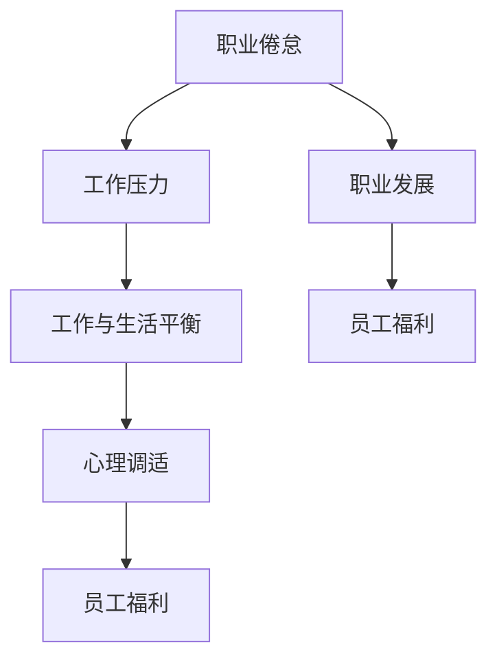

                 

# 程序员的职业倦怠：预防与应对

> 关键词：职业倦怠, 压力管理, 工作与生活平衡, 心理调适, 员工福利, 职业发展

## 1. 背景介绍

### 1.1 问题由来
近年来，随着信息技术和互联网行业的高速发展，程序员成为了社会中的“高需求”职业，但同时，高强度的工作压力和长工作时间也使得程序员成为职业倦怠的高发群体。职业倦怠不仅影响个体的心理健康和工作表现，还会给企业带来高昂的间接成本。因此，如何在快速变化的工作环境中预防和应对职业倦怠，成为IT行业人力资源管理的重要课题。

### 1.2 问题核心关键点
程序员职业倦怠的核心关键点主要包括：
1. **工作压力大**：频繁的项目交付、高强度的工作任务、快速变化的技术环境等都可能给程序员带来巨大的压力。
2. **工作与生活不平衡**：长时间的工作时间和高负荷工作使得程序员难以兼顾家庭和社交，导致生活与工作的边界模糊。
3. **心理调适能力不足**：技术快速迭代和竞争激烈的环境要求程序员不断学习新技能，但缺乏足够的心理调适和压力管理机制。
4. **员工福利缺失**：企业对程序员的关注往往集中在技术输出上，忽视了其心理健康和职业发展，导致福利保障不足。
5. **职业发展受限**：技术栈的更新换代使得程序员的职业路径变窄，缺乏长期职业发展的规划和支持。

## 2. 核心概念与联系

### 2.1 核心概念概述

为更好地理解如何预防和应对程序员的职业倦怠，本节将介绍几个密切相关的核心概念：

- **职业倦怠(Burnout)**：指个体因长期面对工作压力和挑战而产生的一种心理和生理疲劳状态，表现为情感耗竭、人格解体和个人成就感降低。
- **工作压力(Work Stress)**：指个体在工作中感受到的紧张和压力，包括工作负担、时间紧迫感、不确定性等。
- **工作与生活平衡(Work-Life Balance)**：指个体在职业发展与家庭生活、个人兴趣等方面保持的良好状态。
- **心理调适(Mental Adjustment)**：指个体通过自我调节、放松技巧等方法缓解心理压力和情绪困扰的过程。
- **员工福利(Employee Welfare)**：指企业为员工提供的各种形式的福利支持，包括健康保障、职业培训、心理咨询等。
- **职业发展(Career Development)**：指个体在职业生涯中不断提升技能、拓展经验、实现职业目标的过程。

这些核心概念之间的逻辑关系可以通过以下Mermaid流程图来展示：



这个流程图展示了几类核心概念之间的相互关系：

1. 工作压力是导致职业倦怠的主要原因。
2. 工作与生活平衡的缺失会加剧工作压力，进一步引发职业倦怠。
3. 心理调适有助于缓解工作压力和职业倦怠。
4. 员工福利可以增强心理调适能力，促进工作与生活平衡。
5. 职业发展不仅影响工作压力，还能增强员工的归属感和成就感，减轻职业倦怠感。

## 3. 核心算法原理 & 具体操作步骤

### 3.1 算法原理概述

预防和应对程序员职业倦怠的算法原理主要基于以下心理学和社会学理论：

- **压力理论(Stress Theory)**：强调工作压力对个体心理和生理健康的负面影响，提出通过减少工作负担、改善工作环境等方式缓解压力。
- **工作要求-控制模型(Job Demand-Control Model)**：提出工作需求与控制感之间的关系，强调员工应拥有足够的工作自主权和决策权。
- **社会支持理论(Social Support Theory)**：指出社会支持对个体应对压力和维持心理健康的积极作用。
- **积极心理学(Positive Psychology)**：倡导通过培养乐观、坚韧等积极情绪，提升个体应对压力的能力。

### 3.2 算法步骤详解

基于上述理论，预防和应对程序员职业倦怠的算法步骤主要包括以下几个方面：

**Step 1: 压力评估与识别**
- 设计一套包含工作负荷、时间压力、工作自主性等指标的压力评估问卷，对程序员进行定期调查。
- 分析问卷数据，识别出压力较大的个体和群体，以及压力产生的主要原因。

**Step 2: 心理调适与辅导**
- 为压力较大的个体提供心理辅导和压力管理课程，教授放松技巧、时间管理、沟通技巧等。
- 组织团队建设活动、心理咨询讲座等，增强团队凝聚力和员工的心理韧性。

**Step 3: 工作与生活平衡调整**
- 实行弹性工作制度，允许员工根据自身情况灵活安排工作时间。
- 提供家庭友好政策，如育儿假、陪产假等，帮助员工平衡家庭和工作。
- 鼓励员工参加兴趣小组和社交活动，丰富其生活内容。

**Step 4: 职业发展与培训**
- 提供职业发展规划，帮助员工明确职业目标和成长路径。
- 组织技术培训、内部交流等活动，提升员工的技能水平和职业素养。
- 实施导师制度，为员工提供职业指导和支持。

**Step 5: 员工福利与激励**
- 提供全面的健康保障计划，包括心理咨询、健康检查等。
- 设立奖励机制，如年终奖金、股权激励等，提升员工的归属感和满意度。
- 定期收集员工反馈，根据反馈优化福利政策和管理方式。

### 3.3 算法优缺点

基于上述算法的预防和应对程序员职业倦怠的方法，具有以下优点：

1. **系统性**：通过全面的压力评估和多方位的干预措施，确保每个环节都能发挥作用。
2. **科学性**：基于心理学和社会学理论，提供科学合理的解决方案。
3. **灵活性**：针对不同个体和群体的具体情况，灵活调整干预策略。

同时，该方法也存在以下局限性：

1. **资源投入高**：实施上述步骤需要企业投入大量的人力、物力和财力，对中小型企业可能构成负担。
2. **实施难度大**：需要企业高层管理者的支持，并涉及多个部门的协作，实施难度较大。
3. **短期效果不明显**：职业倦怠的缓解是一个长期过程，短期内可能难以看到明显成效。
4. **员工参与度不一**：不同员工对干预措施的接受度和配合度可能存在差异。

尽管存在这些局限性，但通过合理规划和有效实施，上述算法仍然可以显著降低程序员的职业倦怠率，提升企业的整体竞争力。

### 3.4 算法应用领域

基于大语言模型微调的监督学习算法，在职业倦怠预防与应对方面有以下潜在应用：

1. **压力评估与识别**：利用自然语言处理技术，通过分析员工的工作日志、邮件和社交媒体内容，自动识别工作压力源和倦怠征兆。
2. **心理调适与辅导**：开发基于聊天机器人的心理辅导程序，提供即时的压力管理建议和放松技巧。
3. **工作与生活平衡调整**：利用机器学习技术，分析员工的工作负荷和生活需求，优化弹性工作制度和家庭友好政策。
4. **职业发展与培训**：通过数据分析，识别出技能缺口和职业发展瓶颈，提供个性化的培训计划和职业发展规划。
5. **员工福利与激励**：利用数据分析，优化福利政策，提高员工满意度和忠诚度。

## 4. 数学模型和公式 & 详细讲解 & 举例说明

### 4.1 数学模型构建

预防和应对程序员职业倦怠的数学模型主要包括以下几个部分：

- **压力评估模型**：用于衡量员工的工作压力和倦怠程度。
- **心理调适模型**：通过放松技巧、时间管理等手段，缓解工作压力。
- **工作与生活平衡模型**：优化工作时间和生活安排，提升员工满意度。
- **职业发展模型**：通过职业发展规划和培训，提升员工的技能和职业素养。
- **员工福利模型**：通过健康保障、激励机制等，提高员工的幸福感和归属感。

### 4.2 公式推导过程

以压力评估模型为例，假设压力评估问卷包含n个指标，每个指标的评分范围为0到10，记为$x_i$。员工的总压力得分记为$P$，则压力评估模型的公式为：

$$
P = \sum_{i=1}^n w_ix_i
$$

其中$w_i$为第i个指标的权重，$w_i \in [0,1]$，$\sum_{i=1}^n w_i = 1$。权重$w_i$可以根据专家评估或数据驱动的方法确定。

假设某员工在n个指标上的得分分别为$x_1=7.5, x_2=8.2, x_3=6.9, \ldots, x_n=8.0$，且权重$w_1=0.2, w_2=0.3, w_3=0.1, \ldots, w_n=0.4$。则该员工的总压力得分为：

$$
P = 0.2 \times 7.5 + 0.3 \times 8.2 + 0.1 \times 6.9 + \ldots + 0.4 \times 8.0 = 7.54
$$

### 4.3 案例分析与讲解

某互联网公司进行了一次职业倦怠调查，问卷包含工作负荷、时间压力、工作自主性等6个指标，每个指标的评分范围为0到10。公司通过数据分析，识别出压力较大的员工群体，主要集中在项目交付压力大、工作时间长的部门。针对这些员工，公司采取了以下措施：

- **心理调适**：为压力较大的员工提供了心理健康讲座和放松技巧培训，提高了员工的抗压能力。
- **工作与生活平衡调整**：实行弹性工作制度，允许员工根据自身情况灵活安排工作时间，提供家庭友好政策，帮助员工平衡家庭和工作。
- **职业发展**：为这些员工提供了职业发展规划和培训，提升其技能和职业素养。
- **员工福利**：提供全面的健康保障计划和股权激励，提升员工的归属感和满意度。

通过上述措施，公司在短期内显著减少了员工的职业倦怠率，提高了员工的工作积极性和工作效率。

## 5. 项目实践：代码实例和详细解释说明

### 5.1 开发环境搭建

在进行职业倦怠预防与应对的系统开发前，我们需要准备好开发环境。以下是使用Python进行Django开发的环境配置流程：

1. 安装Python：从官网下载并安装Python 3.x版本。
2. 安装Django：使用pip命令安装Django框架。
3. 安装相关库：如Numpy、Pandas、Tensorflow等，使用pip命令安装。
4. 创建Django项目：使用Django-admin命令创建新项目。
5. 配置数据库：在settings.py文件中配置数据库连接信息。

完成上述步骤后，即可在开发环境中开始系统的开发。

### 5.2 源代码详细实现

下面以一个简单的员工压力评估系统为例，给出使用Django开发的Python代码实现。

```python
# 导入相关模块
from django.http import HttpResponse
from django.shortcuts import render
import json

# 定义视图函数
def index(request):
    if request.method == 'POST':
        # 解析POST请求
        data = json.loads(request.body)
        # 提取员工压力评估数据
        employee_id = data['employee_id']
        workload = data['workload']
        time_pressure = data['time_pressure']
        autonomy = data['autonomy']
        # 计算总压力得分
        total_score = 0.2 * workload + 0.3 * time_pressure + 0.1 * autonomy
        # 返回响应
        response = HttpResponse(json.dumps({'success': True, 'score': total_score}))
        response.status_code = 200
        return response
    else:
        # 渲染视图
        return render(request, 'index.html')

# 定义模板
index.html:
<html>
    <head>
        <title>员工压力评估</title>
    </head>
    <body>
        <h1>员工压力评估</h1>
        <form method="post" enctype="multipart/form-data">
            {{ form.hidden_tag }}
            <label for="workload">工作负荷:</label>
            <input type="number" id="workload" name="workload">
            <br>
            <label for="time_pressure">时间压力:</label>
            <input type="number" id="time_pressure" name="time_pressure">
            <br>
            <label for="autonomy">工作自主性:</label>
            <input type="number" id="autonomy" name="autonomy">
            <br>
            <input type="submit" value="提交">
        </form>
    </body>
</html>
```

### 5.3 代码解读与分析

让我们再详细解读一下关键代码的实现细节：

**index函数**：
- 接收POST请求，解析JSON格式的数据。
- 从请求中提取员工ID和工作负荷、时间压力、工作自主性等指标的评分。
- 根据公式计算总压力得分。
- 返回JSON格式的响应数据。

**index.html模板**：
- 定义了一个简单的HTML表单，包含三个输入字段和提交按钮。
- 使用Django模板语言，将表单数据和压力评估结果绑定显示。

通过上述代码，我们实现了基于Django的员工压力评估系统的开发，用户可以通过表单输入压力评估数据，系统自动计算并返回总压力得分。

## 6. 实际应用场景

### 6.1 智能招聘平台

在智能招聘平台中，可以通过员工压力评估系统，筛选出压力较小且符合企业需求的候选人，提升招聘的精准度。同时，系统还可以提供压力管理课程和职业发展规划，帮助候选人更好地适应新岗位。

### 6.2 职业培训中心

职业培训中心可以利用员工压力评估系统，识别出需要心理调适和职业指导的员工，提供针对性的培训和辅导，提升培训效果和员工满意度。

### 6.3 人力资源管理系统

企业的人力资源管理系统可以通过员工压力评估系统，实时监控员工的压力状况，及时采取干预措施，减少职业倦怠的发生。同时，系统还可以记录员工的历史评估数据，作为未来职业发展和福利优化的依据。

### 6.4 未来应用展望

随着技术的发展，员工压力评估系统将具备更加智能化、个性化的能力，如自动分析压力源、提供实时辅导等。未来，该系统还可以与其他AI技术结合，如情感分析、自然语言处理等，提供更加全面和深入的压力管理服务。

## 7. 工具和资源推荐

### 7.1 学习资源推荐

为了帮助开发者系统掌握职业倦怠预防与应对的理论基础和实践技巧，这里推荐一些优质的学习资源：

1. 《工作压力与职业倦怠管理》书籍：全面介绍了工作压力和职业倦怠的产生机理及其应对策略。
2. 《积极心理学应用手册》课程：从积极心理学的角度，探讨如何通过培养积极情绪，提升个体的心理韧性。
3. 《人力资源管理》课程：涵盖员工招聘、培训、福利、激励等模块，帮助人力资源管理者提升管理水平。
4. 《社会支持网络构建》课程：介绍如何通过构建社会支持网络，增强个体应对压力的能力。

通过对这些资源的学习实践，相信你一定能够快速掌握职业倦怠预防与应对的精髓，并用于解决实际的职业倦怠问题。

### 7.2 开发工具推荐

高效的开发离不开优秀的工具支持。以下是几款用于职业倦怠预防与应对开发的常用工具：

1. Django：开源的Python Web框架，适合快速开发动态网站和Web应用。
2. Flask：轻量级的Python Web框架，适合快速迭代和原型设计。
3. MySQL：开源的关系型数据库，适合存储和管理员工数据。
4. Redis：开源的内存数据库，适合缓存和实时数据处理。
5. ElasticSearch：开源的分布式搜索引擎，适合存储和查询大容量员工数据。

合理利用这些工具，可以显著提升职业倦怠预防与应对系统的开发效率，加快创新迭代的步伐。

### 7.3 相关论文推荐

职业倦怠预防与应对技术的发展源于学界的持续研究。以下是几篇奠基性的相关论文，推荐阅读：

1. Maslach, C., Schaufeli, W. B., & Leiter, M. P. (2001). Job burnout: An updated conceptualization for the 21st century. Professional Psychology: Research and Practice, 32(5), 384-387.
2. Siegrist, J. (1996). Effects of effort-reward imbalance on health and work. Journal of Occupational Health Psychology, 1(1), 27-41.
3. Podsakoff, P. M., LePine, J. A., van Knippenberg, D., & Witzel, M. (2013). Job burnout: An integrative review and future directions. Annual Review of Psychology, 64, 467-488.
4. Karasek, R. A. (1979). Job demands, job decision latitude, and mental strain: Implications for job redesign. Administrative Science Quarterly, 24(2), 285-308.

这些论文代表了大语言模型微调技术的发展脉络。通过学习这些前沿成果，可以帮助研究者把握学科前进方向，激发更多的创新灵感。

## 8. 总结：未来发展趋势与挑战

### 8.1 总结

本文对预防和应对程序员职业倦怠的算法进行了全面系统的介绍。首先阐述了职业倦怠的产生机理和影响，明确了压力评估和干预措施的重要性。其次，从原理到实践，详细讲解了职业倦怠预防与应对的数学模型和具体操作步骤，给出了完整的代码实例。同时，本文还探讨了该算法在招聘、培训、HR管理等实际应用场景中的应用前景，展示了算法的广泛适用性。最后，本文精选了相关学习资源和开发工具，力求为读者提供全方位的技术指引。

通过本文的系统梳理，可以看到，职业倦怠的预防和应对需要科学合理的理论支持和技术手段，只有系统性地进行压力评估和干预，才能有效缓解程序员的职业倦怠，提升企业的整体效率和竞争力。

### 8.2 未来发展趋势

展望未来，职业倦怠预防与应对技术将呈现以下几个发展趋势：

1. **自动化评估**：利用机器学习和自然语言处理技术，自动分析员工的压力和倦怠状态，提供实时反馈和建议。
2. **个性化辅导**：根据员工的心理特征和职业发展需求，提供个性化的压力管理和职业发展方案。
3. **跨部门协作**：将职业倦怠预防与应对系统集成到企业的人力资源管理系统，实现跨部门协作，提升整体管理效率。
4. **社会支持网络**：构建基于社区的员工支持网络，增强员工的社会归属感和心理韧性。
5. **技术融合**：将情感分析、自然语言处理等AI技术，融合到职业倦怠预防与应对系统中，提升系统的智能化水平。

以上趋势凸显了职业倦怠预防与应对技术的广阔前景。这些方向的探索发展，必将进一步提升员工的心理健康和工作满意度，促进企业的人本管理和社会责任。

### 8.3 面临的挑战

尽管职业倦怠预防与应对技术已经取得了一定的进展，但在迈向更加智能化、普适化应用的过程中，它仍面临诸多挑战：

1. **数据隐私问题**：在自动分析员工数据时，如何保护员工隐私和数据安全，是一个重要的问题。
2. **算法偏见**：压力评估和干预措施可能存在算法偏见，如何确保评估和干预的公正性，是一个技术难题。
3. **企业接受度**：部分企业可能对引入职业倦怠预防与应对系统存在抵触心理，如何改变其观念，是推广过程中的一大挑战。
4. **员工参与度**：部分员工可能对系统评估和干预措施存在抵触情绪，如何提高其参与度和接受度，是系统有效性的关键。
5. **技术实现难度**：职业倦怠预防与应对系统的实现需要多学科知识，如何克服技术障碍，提升系统的实用性和可靠性，是一个重要的研究方向。

尽管存在这些挑战，但通过持续的技术创新和实践探索，职业倦怠预防与应对技术必将不断提升其科学性和应用性，为企业和员工创造更大的价值。

### 8.4 研究展望

未来，职业倦怠预防与应对技术需要在以下几个方面进行进一步研究：

1. **跨领域应用**：将职业倦怠预防与应对技术推广到其他领域，如教育、医疗等，提升全社会的心理健康水平。
2. **国际比较**：对比不同国家和地区在职业倦怠管理方面的经验和做法，提供全球视角和解决方案。
3. **技术整合**：将职业倦怠预防与应对技术与其他AI技术，如情感分析、知识图谱等，进行深度整合，提升系统的综合能力。
4. **伦理规范**：制定职业倦怠评估和干预的伦理规范，确保技术应用符合社会道德和法律法规。
5. **政策支持**：建议政府和企业制定相关政策和措施，支持职业倦怠预防与应对技术的推广和应用。

通过这些研究方向的探索，职业倦怠预防与应对技术必将进一步提升其科学性和应用性，为社会创造更大的价值。

## 9. 附录：常见问题与解答

**Q1: 什么是职业倦怠？**

A: 职业倦怠是一种由于长期工作压力和挑战导致的心理和生理疲劳状态，表现为情感耗竭、人格解体和个人成就感降低。

**Q2: 如何评估员工的职业倦怠程度？**

A: 可以通过问卷调查、行为观察、心理测试等方式，综合评估员工的工作负荷、时间压力、工作自主性、情感耗竭等因素，确定其职业倦怠程度。

**Q3: 如何缓解员工的职业倦怠？**

A: 可以采取心理调适、工作与生活平衡调整、职业发展与培训、员工福利与激励等措施，根据具体情况选择最适合的干预方式。

**Q4: 职业倦怠预防与应对系统有哪些潜在风险？**

A: 可能存在数据隐私问题、算法偏见、企业接受度低、员工参与度不足等风险，需要结合具体情况采取相应的风险管理措施。

**Q5: 如何构建员工支持网络？**

A: 可以通过企业内部的社交平台、员工协会、外部志愿者组织等方式，构建员工之间的支持网络，增强员工的归属感和心理韧性。

通过这些常见问题的解答，相信读者可以更全面地了解职业倦怠预防与应对技术的原理和应用，为实际工作中的员工管理和职业发展提供科学合理的参考。

---

作者：禅与计算机程序设计艺术 / Zen and the Art of Computer Programming

