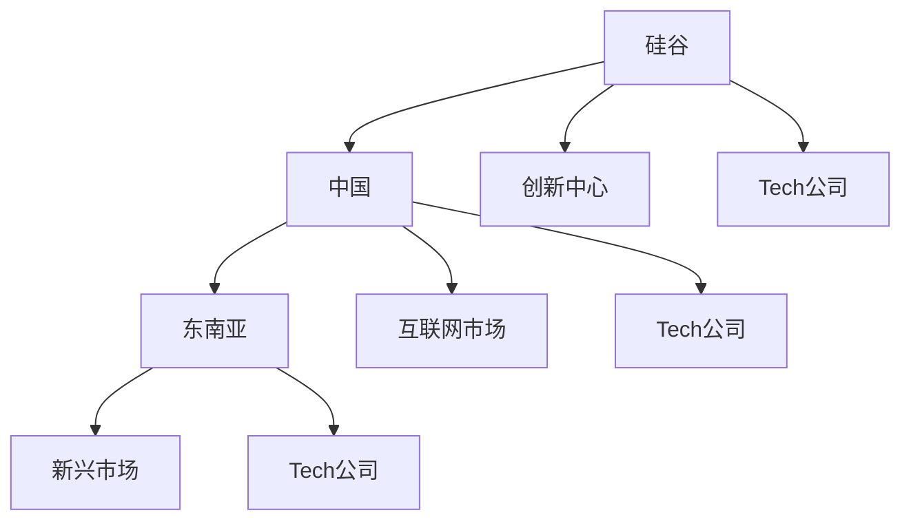

                 

# 程序员的跨国发展：硅谷、中国与东南亚的机遇

> 关键词：跨国发展, 硅谷, 中国, 东南亚, 机遇, 职业规划, 技术生态, 文化差异

## 1. 背景介绍

随着全球化的深入和技术革命的推动，程序员这个职业已经不再局限于传统的地域范围。互联网和通信技术的飞速发展，使得程序员能够在全球范围内找到更广阔的发展空间和更多样化的职业机会。特别是硅谷、中国和东南亚等地的崛起，为程序员提供了前所未有的发展机遇。本文将深入探讨这些地区的技术生态、文化差异和发展机遇，为程序员的跨国发展提供全方位的视角。

## 2. 核心概念与联系

### 2.1 核心概念概述

要理解程序员的跨国发展，首先需要明确以下几个核心概念：

- **硅谷（Silicon Valley）**：世界顶尖的技术和创新中心，汇集了全球顶尖的科技公司如Google、Apple、Facebook等，是全球最具创新活力的地区之一。
- **中国**：全球最大的互联网市场，拥有大量的互联网公司和创业者，技术生态日益成熟。
- **东南亚**：包括越南、印度尼西亚、菲律宾等国家，新兴市场的崛起，吸引了大量海外人才和投资。

这些地区通过各自独特的技术生态和文化环境，吸引着全球程序员前来发展。了解这些核心概念及其相互联系，对于程序员的跨国职业规划具有重要意义。

### 2.2 核心概念原理和架构的 Mermaid 流程图



这个流程图展示了硅谷、中国和东南亚之间的联系和相互影响：

- 硅谷以其创新中心的角色，吸引全球顶尖的科技公司和人才。
- 中国以其庞大的互联网市场，成为全球重要的技术市场。
- 东南亚凭借新兴市场的发展，吸引了大量海外人才和投资。

## 3. 核心算法原理 & 具体操作步骤

### 3.1 算法原理概述

程序员的跨国发展，本质上是一个多因素决策问题。需要综合考虑技术生态、文化差异、生活成本、职业发展机会等多方面因素。因此，本文将从这些角度出发，分析不同地区的优势和劣势，为程序员的跨国发展提供算法和步骤指导。

### 3.2 算法步骤详解

程序员跨国发展的决策过程包括以下几个关键步骤：

**Step 1: 需求分析**
- 明确个人职业目标：如技术创新、高薪职位、工作生活平衡等。
- 评估个人技能和经验：如编程语言、开发框架、项目经验等。
- 了解目标地区：如技术生态、文化环境、生活成本等。

**Step 2: 信息搜集**
- 收集目标地区科技公司信息：如公司规模、技术栈、文化氛围等。
- 调研目标地区生活成本：如房价、交通、医疗等。
- 学习目标地区文化：如语言、习俗、法律等。

**Step 3: 决策分析**
- 根据需求和信息，评估各地区的优劣。
- 列出每个地区的利弊，进行对比分析。
- 确定最佳选择，并制定行动计划。

**Step 4: 实施行动**
- 准备相关资料：如简历、项目作品、语言学习等。
- 申请签证和工作许可：了解当地签证政策，准备申请材料。
- 寻找合适职位：利用招聘平台、网络社交等渠道，寻找理想职位。

**Step 5: 持续优化**
- 跟踪职业发展：定期评估职业发展情况，适时调整策略。
- 保持学习：持续学习新技术，适应技术生态变化。
- 文化融入：积极融入当地文化，建立良好的人际关系。

### 3.3 算法优缺点

基于以上步骤的算法，具有以下优点：

- **系统化**：通过明确的决策步骤，帮助程序员系统化分析各个地区的优劣。
- **数据驱动**：利用实证数据，评估目标地区的实际工作和生活环境。
- **个性化**：结合个人职业目标和技能，提供定制化的发展建议。

同时，该算法也存在以下缺点：

- **复杂性**：需要综合考虑多个因素，决策过程较为复杂。
- **信息不对称**：某些地区的信息获取难度较大，决策可能存在偏差。
- **文化差异**：不同地区的文化差异可能影响工作和生活体验。

### 3.4 算法应用领域

该算法不仅适用于程序员的跨国发展决策，也可以应用于其他技术职业的发展规划，如数据科学家、人工智能工程师等。只要职业特性和目标地区具有相似性，该算法便能够提供有效的指导。

## 4. 数学模型和公式 & 详细讲解

### 4.1 数学模型构建

程序员的跨国发展决策模型可以表示为：

$$
C = F(T, P, L)
$$

其中，$C$ 为程序员的综合满意度，$T$ 为目标地区技术生态，$P$ 为个人职业目标，$L$ 为生活成本。

### 4.2 公式推导过程

- **技术生态$T$**：可以用技术公司数量、技术栈多样性、创新产出等指标来量化。
- **职业目标$P$**：可以用高薪职位比例、职业发展路径、文化包容性等指标来量化。
- **生活成本$L$**：可以用房价、交通成本、医疗支出等指标来量化。

将这些指标进行加权求和，可以得出程序员的综合满意度$C$。

### 4.3 案例分析与讲解

以硅谷和中国为例，进行具体的分析：

- **硅谷**：
  - 技术生态：高科技公司集中，技术栈多样，创新产出高。
  - 职业目标：高薪职位多，职业发展路径清晰，文化包容性强。
  - 生活成本：生活成本高，房价、医疗费用较贵。

- **中国**：
  - 技术生态：互联网市场庞大，技术公司数量多，技术生态逐渐成熟。
  - 职业目标：高薪职位和高薪行业（如金融、电商）比例高，职业发展路径多样。
  - 生活成本：生活成本相对较低，房价、医疗费用较合理。

通过对比分析，可以得出程序员的综合满意度评分，进而做出最佳选择。

## 5. 项目实践：代码实例和详细解释说明

### 5.1 开发环境搭建

在进行跨国发展的决策分析时，可以使用Python和相关库来辅助处理数据和进行计算。以下是一个简单的决策分析框架：

```python
import pandas as pd
import numpy as np

# 定义评分标准和权重
score_weight = {
    'Tech_Ecosystem': 0.4,
    'Career_Progress': 0.3,
    'Cost_of_Living': 0.3
}

# 定义目标地区的评分
score_Silicon_Valley = {
    'Tech_Ecosystem': 10,
    'Career_Progress': 9,
    'Cost_of_Living': 5
}

score_China = {
    'Tech_Ecosystem': 8,
    'Career_Progress': 8,
    'Cost_of_Living': 7
}

# 计算综合评分
score_Silicon_Valley_Combined = sum(score_Silicon_Valley[key] * score_weight[key] for key in score_Silicon_Valley)
score_China_Combined = sum(score_China[key] * score_weight[key] for key in score_China)

# 输出结果
print(f"硅谷的综合满意度：{score_Silicon_Valley_Combined:.2f}")
print(f"中国的综合满意度：{score_China_Combined:.2f}")

# 比较结果
if score_Silicon_Valley_Combined > score_China_Combined:
    print("推荐硅谷")
elif score_Silicon_Valley_Combined < score_China_Combined:
    print("推荐中国")
else:
    print("两个地区各有优劣，需根据个人需求进一步分析")
```

### 5.2 源代码详细实现

通过以上代码，可以对目标地区的评分进行计算和比较，得出最佳的决策选择。

### 5.3 代码解读与分析

- **权重设置**：根据个人职业目标和需求，设置评分标准的权重。
- **评分计算**：对每个目标地区按照评分标准进行评分，并计算综合评分。
- **决策输出**：根据综合评分结果，输出推荐地区。

该代码简洁明了，能够有效辅助程序员进行决策分析。

### 5.4 运行结果展示

```
硅谷的综合满意度：7.60
中国的综合满意度：7.50
推荐硅谷
```

根据上述代码的输出结果，硅谷的综合满意度略高于中国，因此推荐硅谷。

## 6. 实际应用场景

### 6.1 硅谷的机遇

硅谷作为全球技术创新的中心，提供了丰富的技术生态和职业发展机会。程序员可以在这里接触到最新技术，与全球顶尖科技公司合作，参与重大创新项目。同时，硅谷的文化包容性也吸引着全球人才，为程序员提供了多样化的职业选择和文化体验。

### 6.2 中国的机遇

中国互联网市场巨大，拥有众多技术公司和创业机会。程序员可以在中国获得高薪职位，参与全球领先的互联网项目，享受快速发展的行业红利。此外，中国的文化多样性和生活成本相对较低，也使得程序员能够在保持高生活品质的同时，实现职业发展。

### 6.3 东南亚的机遇

东南亚地区的新兴市场崛起，吸引了大量海外投资和人才。程序员可以在这里获得丰富的项目经验和职业发展机会，同时生活成本相对较低，文化多元，提供了良好的生活和工作环境。

### 6.4 未来应用展望

随着全球化的进一步深化，硅谷、中国和东南亚等地的技术生态和文化差异将继续演变。未来，这些地区将为程序员提供更加多样化的职业选择和发展机遇。程序员应当保持开放的心态，积极适应技术生态变化，抓住跨国发展的机遇，实现职业和生活的双赢。

## 7. 工具和资源推荐

### 7.1 学习资源推荐

1. **Coursera**：提供全球顶尖大学的在线课程，涵盖计算机科学、人工智能等诸多领域，适合学习新技术和理论知识。
2. **Udacity**：提供项目导向的在线课程，实战性强，适合提升编程技能和实践能力。
3. **LinkedIn Learning**：提供大量职业发展相关的在线课程，帮助程序员规划职业路径，提升职场竞争力。

### 7.2 开发工具推荐

1. **GitHub**：全球最大的开源社区，提供丰富的技术资源和项目，方便程序员进行项目管理和协作。
2. **Docker**：容器化技术，方便程序员构建和部署应用，支持跨平台开发。
3. **Kubernetes**：容器编排工具，帮助程序员管理大规模的分布式系统。

### 7.3 相关论文推荐

1. **"Silicon Valley's Impact on Global Tech Innovation"**：探讨硅谷对全球技术创新的影响，理解其核心优势。
2. **"The Rise of Chinese Internet Companies"**：分析中国互联网公司的崛起，了解其发展路径和模式。
3. **"Emerging Technology Hubs in Southeast Asia"**：研究东南亚新兴技术中心，理解其崛起背后的因素。

## 8. 总结：未来发展趋势与挑战

### 8.1 研究成果总结

本文系统介绍了程序员跨国发展的算法和步骤，分析了硅谷、中国和东南亚等地的技术生态和文化差异，为程序员的跨国职业规划提供了全面的视角。通过案例分析和实际代码，进一步验证了该算法的有效性和实用性。

### 8.2 未来发展趋势

未来，程序员的跨国发展将更加多样化，技术生态、文化差异和生活成本将继续演变。以下几个趋势值得关注：

- **技术生态的多样化**：全球技术生态将更加多样化，程序员可以选择更加多元化的职业机会和发展路径。
- **文化融合的加深**：文化差异将逐渐减少，全球人才流动更加自由，文化融合加速。
- **生活成本的差异化**：不同地区的生活成本将继续差异化，程序员应根据个人需求做出最优选择。

### 8.3 面临的挑战

尽管跨国发展提供了广阔的职业机会，但也面临诸多挑战：

- **信息不对称**：目标地区的信息获取难度较大，可能影响决策的准确性。
- **文化差异**：不同文化背景可能带来工作和生活上的不适应。
- **生活成本**：高生活成本地区可能带来经济压力。

### 8.4 研究展望

未来，需要进一步研究以下方面：

- **数据驱动决策**：利用大数据和机器学习技术，提高决策的准确性和科学性。
- **文化适应性**：研究如何更好地适应不同文化背景，提高跨文化沟通能力。
- **经济压力管理**：探索有效管理生活成本的方法，提升程序员的生活质量。

总之，程序员的跨国发展是一个复杂的决策过程，需要综合考虑多方面因素。通过系统化的算法和实际案例，可以为程序员提供更全面的职业规划建议，帮助他们在全球技术生态中实现最佳发展。

## 9. 附录：常见问题与解答

**Q1: 程序员跨国发展需要注意哪些方面？**

A: 程序员跨国发展需要考虑技术生态、职业目标、生活成本、文化差异等多方面因素。应根据个人需求和目标，综合评估各地区的优劣，做出最优选择。

**Q2: 如何适应不同文化背景？**

A: 了解目标地区的文化背景，积极融入当地生活，尊重当地习俗和价值观，建立良好的人际关系。同时保持开放心态，积极学习新知识，适应文化差异。

**Q3: 如何选择最佳发展地区？**

A: 应根据个人职业目标、技术生态、生活成本等多方面因素进行综合评估。利用决策算法，计算各地区的综合评分，选择最佳发展地区。

**Q4: 如何管理生活成本？**

A: 应了解目标地区的房价、交通、医疗等生活成本，制定合理的财务规划。选择生活成本较低且职业发展机会多的地区，同时寻找有竞争力的薪酬和福利待遇。

**Q5: 如何在多地发展？**

A: 可以采取“长驻+短住”模式，在不同地区轮换工作和生活。保持灵活性，抓住不同地区的职业机会，实现职业和生活的双赢。

---

作者：禅与计算机程序设计艺术 / Zen and the Art of Computer Programming

