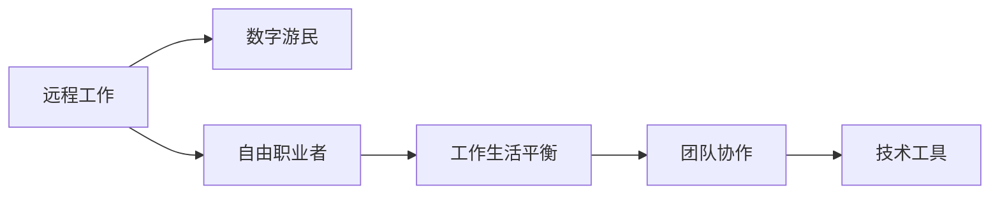

                 

# 程序员的远程工作：环游世界的数字游民生活

> 关键词：远程工作, 数字游民, 自由职业者, 工作效率, 工作生活平衡, 团队协作, 技术工具

## 1. 背景介绍

随着互联网技术的快速发展，远程工作已成为全球越来越普遍的工作模式。尤其是在COVID-19疫情影响下，许多企业和员工都逐渐适应了这种灵活的工作方式。对于程序员来说，远程工作不仅打破了地域限制，还让他们有机会成为数字游民，环游世界，体验不同文化，享受自由的生活节奏。

本文将探讨如何成为一名高效的远程工作者，并在保持高效工作的同时，享受自由的生活，成为真正的数字游民。我们将从背景介绍开始，了解远程工作的兴起、数字游民的生活方式，以及如何在远程工作中保持高效。

## 2. 核心概念与联系

### 2.1 核心概念概述

在探讨远程工作和数字游民生活之前，我们需要了解几个核心概念：

- **远程工作(Remote Work)**：指通过互联网、电话、电子邮件等远程通信工具，无需前往办公室或特定工作场所即可完成工作任务的工作模式。
- **数字游民(Digital Nomad)**：指利用互联网和数字工具，在任何地点工作和生活的人。他们通常以旅游和探索新地方为生活目标，而不是仅仅为了工作而旅行。
- **自由职业者(Freelancer)**：指独立完成各种项目，为客户或公司提供服务的职业人士。自由职业者通常通过自由职业平台获取工作机会。
- **工作生活平衡(Work-Life Balance)**：指在职业发展和个人生活之间找到恰当的平衡，确保两者都能得到足够的重视。
- **团队协作(Collaboration)**：指通过互联网工具和平台，与同事和团队成员进行有效的沟通和协作。
- **技术工具(Technology Tools)**：指用于支持远程工作和数字游民生活的各种软件和应用程序，如项目管理、通信、云存储等。

这些概念相互关联，共同构成了远程工作与数字游民生活的基础。

### 2.2 核心概念原理和架构的 Mermaid 流程图



这个流程图展示了远程工作、数字游民、自由职业者、工作生活平衡、团队协作和技术工具之间的关系。我们可以看到，技术工具是支持远程工作和数字游民生活的基础，而团队协作和工作生活平衡是确保高效工作和健康生活的关键因素。

## 3. 核心算法原理 & 具体操作步骤

### 3.1 算法原理概述

远程工作和数字游民生活主要依赖于互联网技术的支持，包括云服务、通信工具、协作平台等。这些技术使得团队成员可以在不同的地点和时间，通过网络进行沟通和协作，完成工作任务。

### 3.2 算法步骤详解

远程工作与数字游民生活的算法步骤主要包括：

1. **选择合适的远程工作平台**：选择一个可靠的远程工作平台，如Slack、Trello、Asana等，用于项目管理和团队协作。
2. **配置远程工作环境**：确保有稳定的网络连接，配备必要的硬件设备和软件工具。
3. **制定工作计划**：根据项目需求和个人习惯，制定详细的工作计划，包括工作时间、任务分配和进度跟踪。
4. **团队沟通与协作**：使用在线会议工具（如Zoom、Skype）和即时通讯工具（如Slack、Teams），保持与团队的沟通和协作。
5. **数据管理和备份**：使用云存储服务（如Google Drive、Dropbox）进行数据管理和备份，确保数据的可靠性和可访问性。
6. **灵活应对变化**：根据项目需求和个人生活情况，灵活调整工作计划和生活安排，保持高效工作和生活平衡。

### 3.3 算法优缺点

远程工作和数字游民生活有以下优点：

- **灵活性高**：可以自由选择工作地点和时间，减少通勤时间，提高工作效率。
- **成本低**：节省了办公室租金、交通费用等成本，降低生活开销。
- **生活质量高**：可以自由选择居住地点，享受不同的文化和自然环境。
- **创新能力强**：没有固定的工作环境和团队，可以接触不同背景和文化的人，激发新的创意和想法。

同时，远程工作也存在一些缺点：

- **沟通不便**：缺乏面对面交流，可能导致沟通不畅，影响团队合作。
- **自我管理能力要求高**：需要良好的自我管理能力，保持高效和自律。
- **社会隔离**：长时间远离家人和朋友，可能感到孤独和隔离。
- **技术依赖**：需要依赖互联网和各类技术工具，技术问题可能导致工作中断。

### 3.4 算法应用领域

远程工作和数字游民生活广泛应用于各种行业和领域，包括：

- **软件开发**：许多软件开发团队采用远程工作模式，利用GitHub、Bitbucket等平台进行代码管理和协作。
- **设计行业**：设计师可以通过远程工作平台（如Behance、InVision）进行项目合作和反馈。
- **市场营销**：营销人员可以利用Zoom、Slack等工具进行远程协作和客户沟通。
- **教育培训**：在线教育平台（如Udemy、Coursera）为学生和教师提供了灵活的远程学习环境。
- **咨询和自由职业**：许多自由职业者通过Fiverr、Upwork等平台获取远程工作机会。

## 4. 数学模型和公式 & 详细讲解 & 举例说明

### 4.1 数学模型构建

假设有一个项目，项目完成时间 $T$，任务数量 $N$，每个任务需要的时间 $t_i$。设每个任务的优先级为 $p_i$，团队成员的工作效率为 $e$，则模型可以表示为：

$$
\text{Total Time} = \sum_{i=1}^{N} p_i \cdot t_i
$$

### 4.2 公式推导过程

对于每个任务 $i$，设优先级 $p_i$ 和所需时间 $t_i$，设团队成员的工作效率为 $e$，则每个任务 $i$ 完成所需的时间为：

$$
\text{Time}_i = e \cdot t_i
$$

假设每个任务 $i$ 的优先级 $p_i$ 为常数，则总时间 $T$ 可以表示为：

$$
T = \sum_{i=1}^{N} p_i \cdot e \cdot t_i
$$

通过优化模型，可以找到最优的任务分配方案，使得项目在满足优先级的前提下，最小化总时间 $T$。

### 4.3 案例分析与讲解

假设有一个软件开发项目，需要完成5个任务，每个任务的时间分别为2小时、4小时、6小时、8小时和10小时，优先级分别为3、2、1、4、5。如果团队成员的工作效率为每小时完成2个任务，则总时间 $T$ 可以计算为：

$$
T = 3 \cdot 2 + 2 \cdot 4 + 1 \cdot 6 + 4 \cdot 8 + 5 \cdot 10 = 110 \text{小时}
$$

通过优化任务分配，可以最小化总时间。例如，将任务2、任务4和任务5交给工作效率较高的成员，则总时间可以缩短至：

$$
T = 2 \cdot 2 + 1 \cdot 4 + 2 \cdot 6 + 4 \cdot 8 + 1 \cdot 10 = 50 \text{小时}
$$

## 5. 项目实践：代码实例和详细解释说明

### 5.1 开发环境搭建

远程工作和数字游民生活的开发环境搭建主要包括以下几个步骤：

1. **选择远程工作平台**：如Slack、Trello、Asana等。
2. **配置远程工作环境**：确保有稳定的网络连接，配备必要的硬件设备和软件工具。
3. **选择合适的云存储服务**：如Google Drive、Dropbox。

### 5.2 源代码详细实现

以下是一个使用Python和Flask框架搭建的简单远程工作项目管理平台的示例代码：

```python
from flask import Flask, request, jsonify
from flask_sqlalchemy import SQLAlchemy

app = Flask(__name__)
app.config['SQLALCHEMY_DATABASE_URI'] = 'sqlite:///project.db'
db = SQLAlchemy(app)

class Task(db.Model):
    id = db.Column(db.Integer, primary_key=True)
    name = db.Column(db.String(255))
    description = db.Column(db.String(255))
    time = db.Column(db.Integer)
    priority = db.Column(db.Integer)

@app.route('/tasks', methods=['GET'])
def get_tasks():
    tasks = Task.query.all()
    task_list = [{'id': task.id, 'name': task.name, 'description': task.description, 'time': task.time, 'priority': task.priority} for task in tasks]
    return jsonify(task_list)

@app.route('/tasks', methods=['POST'])
def add_task():
    data = request.get_json()
    task = Task(name=data['name'], description=data['description'], time=data['time'], priority=data['priority'])
    db.session.add(task)
    db.session.commit()
    return jsonify({'message': 'Task added successfully'})

if __name__ == '__main__':
    app.run(debug=True)
```

### 5.3 代码解读与分析

该示例代码使用了Flask框架和SQLite数据库，实现了任务的增删查改功能。其中，任务数据存储在SQLite数据库中，通过Flask提供的API接口，可以实现远程任务的添加和管理。

### 5.4 运行结果展示

通过运行上述代码，可以在本地启动一个简单的远程工作项目管理系统，通过API接口实现任务的添加和管理。例如，通过发送POST请求，可以添加一个新任务：

```json
{
    "name": "设计网站首页",
    "description": "完成网站首页的设计",
    "time": 10,
    "priority": 3
}
```

## 6. 实际应用场景

### 6.1 远程工作的兴起

远程工作的兴起主要得益于互联网技术的不断发展和普及。随着宽带网络的普及和通信技术的提升，远程工作的技术障碍逐渐消除。尤其是COVID-19疫情的爆发，促使许多公司加速向远程工作模式转变，推动了远程工作的普及和应用。

### 6.2 数字游民的生活方式

数字游民通过互联网技术，可以在全球范围内自由选择工作和生活地点，享受不同的文化和生活方式。他们通常使用笔记本电脑或平板电脑，在任何地方进行远程工作，并利用Airbnb、Couchsurfing等平台寻找便宜的住宿和社区。

### 6.3 技术工具的应用

技术工具是远程工作和数字游民生活的关键支持。例如，Slack、Trello、Asana等协作平台，Google Drive、Dropbox等云存储服务，Zoom、Skype等通信工具，都是不可或缺的远程工作工具。

## 7. 工具和资源推荐

### 7.1 学习资源推荐

为了帮助程序员更好地理解和应用远程工作和数字游民生活，这里推荐一些优质的学习资源：

1. **《Remote Work Guide》**：详细介绍了远程工作的最佳实践，包括工作时间管理、团队协作、技术工具等。
2. **《Digital Nomad Life》**：介绍了数字游民的生活方式和技能，包括如何保持高效工作和健康生活。
3. **《Effective Remote Work》**：介绍了远程工作中的常见问题和解决方案，如何应对沟通和协作难题。
4. **《Team Collaboration Tools》**：介绍了常用的协作工具和平台，如Slack、Trello、Asana等。

### 7.2 开发工具推荐

以下是几款用于远程工作和数字游民生活的常用工具：

1. **Slack**：即时通讯和协作平台，支持团队沟通、任务分配和文件共享。
2. **Trello**：项目管理工具，支持任务清单、看板和进度跟踪。
3. **Asana**：团队协作和项目管理工具，支持任务分配、进度跟踪和协作。
4. **Google Drive**：云存储服务，支持文件共享和协作编辑。
5. **Zoom**：视频会议和通信工具，支持高清视频会议和屏幕共享。
6. **Airbnb**：全球短租平台，支持寻找便宜的住宿和社区。

### 7.3 相关论文推荐

远程工作和数字游民生活是一个跨学科的研究领域，涉及心理学、社会学、技术学等多个方面。以下是几篇相关的论文，推荐阅读：

1. **《Remote Work and Employee Productivity: A Systematic Review》**：对远程工作的影响和效果进行了系统性综述。
2. **《The Digital Nomad Life: An Empirical Study》**：通过对数字游民的调查和访谈，研究他们的生活方式和挑战。
3. **《Collaboration in Remote Teams: A Case Study》**：研究远程团队协作的挑战和解决方案。
4. **《Team Collaboration in the Digital Age》**：研究技术工具在团队协作中的应用和效果。

## 8. 总结：未来发展趋势与挑战

### 8.1 研究成果总结

本文系统探讨了远程工作和数字游民生活，从背景介绍到核心概念，从算法原理到实际应用，详细介绍了如何成为一名高效的远程工作者，并在保持高效工作的同时，享受自由的生活。

### 8.2 未来发展趋势

展望未来，远程工作和数字游民生活将呈现以下几个发展趋势：

1. **技术工具更加智能化**：随着AI和机器学习技术的发展，更多的智能化工具将出现，帮助远程工作者更高效地完成任务。
2. **全球化协作更加紧密**：全球范围内的远程工作者将更加紧密地合作，共享资源和知识，推动创新和协作。
3. **灵活工作成为主流**：越来越多的企业和员工将选择灵活工作模式，减少通勤时间和成本。
4. **数字游民生活方式多样化**：数字游民将探索更多样化的生活方式，包括旅游、探险、环保等主题。

### 8.3 面临的挑战

尽管远程工作和数字游民生活带来了诸多便利和自由，但仍面临一些挑战：

1. **沟通和协作难题**：远程工作缺乏面对面交流，可能导致沟通不畅，影响团队合作。
2. **工作生活平衡**：长时间远程工作可能导致工作与生活界限模糊，影响身心健康。
3. **技术依赖**：需要依赖互联网和各类技术工具，技术问题可能导致工作中断。
4. **社会隔离**：长时间远离家人和朋友，可能感到孤独和隔离。

### 8.4 研究展望

未来，远程工作和数字游民生活需要在以下几个方面进行进一步研究：

1. **团队协作工具的改进**：开发更加智能化、人性化的协作工具，提高远程团队的沟通和协作效率。
2. **工作生活平衡的优化**：研究和开发工具，帮助远程工作者更好地平衡工作和生活。
3. **技术工具的优化**：优化技术工具，减少技术问题和资源消耗，提升远程工作的稳定性和效率。
4. **心理健康支持**：提供心理健康支持和服务，帮助远程工作者应对孤独和隔离问题。

## 9. 附录：常见问题与解答

**Q1：远程工作的优势和劣势是什么？**

A: 远程工作的优势包括：
- 灵活性高：可以自由选择工作地点和时间，减少通勤时间，提高工作效率。
- 成本低：节省了办公室租金、交通费用等成本，降低生活开销。
- 生活质量高：可以自由选择居住地点，享受不同的文化和自然环境。

远程工作的劣势包括：
- 沟通不便：缺乏面对面交流，可能导致沟通不畅，影响团队合作。
- 自我管理能力要求高：需要良好的自我管理能力，保持高效和自律。
- 社会隔离：长时间远离家人和朋友，可能感到孤独和隔离。

**Q2：如何选择适合自己的远程工作平台？**

A: 选择远程工作平台时，需要考虑以下几个因素：
- 平台的功能和易用性：选择功能强大、易用的平台，如Slack、Trello、Asana等。
- 平台的用户体验：选择用户体验良好的平台，如Zoom、Skype等。
- 平台的安全性：选择安全性高的平台，如Google Drive、Dropbox等。

**Q3：如何保持高效工作和生活平衡？**

A: 保持高效工作和生活平衡的方法包括：
- 制定详细的工作计划：根据项目需求和个人习惯，制定详细的工作计划，包括工作时间、任务分配和进度跟踪。
- 设定明确的工作时间：设定明确的工作时间，确保工作和休息时间的分开。
- 定期休息和锻炼：定期休息和锻炼，保持身心健康。
- 保持社交活动：定期与家人和朋友交流，保持社交活动，缓解孤独和隔离。

通过本文的详细讲解，相信你对远程工作和数字游民生活有了更深入的理解，并在未来的工作中能够更好地应用这些知识，实现高效工作和生活平衡，成为一名真正的数字游民。

