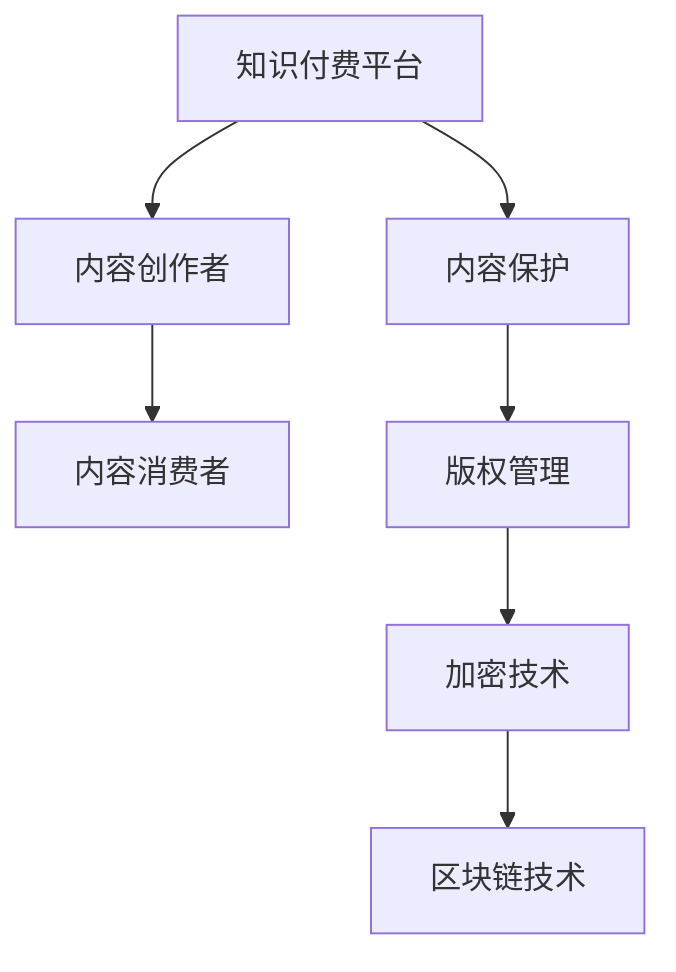

                 

# 程序员知识付费的内容保护与版权管理

> 关键词：知识付费, 版权管理, 内容保护, 加密技术, 数字版权管理, 区块链技术

## 1. 背景介绍

在数字化和信息化的浪潮下，知识付费成为互联网行业的新热点。从知乎、得到、慕课等知识付费平台的兴起，到各大企业内部知识管理系统的建立，知识付费的应用场景越来越广泛。然而，在知识付费的繁荣背后，内容盗版、版权纠纷、付费权益保护等问题逐渐凸显。作为知识付费的核心参与者，程序员在内容和版权保护方面面临诸多挑战。本文将从背景介绍入手，探讨程序员知识付费的内容保护与版权管理的核心问题。

## 2. 核心概念与联系

### 2.1 核心概念概述

知识付费的核心在于内容的使用权和版权。内容创作者通过付费平台发布专业课程、技术博客、问答服务等，获取用户支付的报酬。内容消费者通过订阅、购买、阅读等方式，获取有价值的知识信息。

版权保护则是对内容创造者权益的保障。内容创作者通过版权登记、商标申请等方式，证明其内容的原创性和所有权，确保其合法权益不受侵犯。

内容保护是指对知识付费平台及其用户上传的内容进行加密、权限控制等措施，防止未授权的访问和盗版。

### 2.2 核心概念原理和架构的 Mermaid 流程图



该流程图展示了知识付费生态系统中的核心概念及其相互关系：

- A：知识付费平台是知识内容和支付的中介，连接内容创作者和消费者。
- B：内容创作者为平台提供优质内容，获得报酬。
- C：内容消费者支付费用，获取有价值的知识信息。
- D：内容保护技术用于防止内容盗版，确保平台和用户权益。
- E：版权管理保护内容创作者权益，保障其所有权。
- F：加密技术保障内容传输和存储的安全性。
- G：区块链技术用于记录和验证内容版权和交易信息，提供透明可信任的版权保护方案。

这些核心概念相互交织，构成了知识付费生态系统的基础架构。

## 3. 核心算法原理 & 具体操作步骤

### 3.1 算法原理概述

知识付费平台的内容保护与版权管理主要依赖于以下技术手段：

- 内容加密：使用对称或非对称加密技术，对内容进行加密保护，防止未授权访问。
- 权限控制：通过身份认证、访问权限设置等措施，限制内容的访问范围，确保只有授权用户才能访问。
- 数字版权管理(DRM)：对内容的复制、分发、使用等行为进行控制，防止未经授权的传播。
- 区块链技术：利用区块链的不可篡改性和分布式记账特性，记录和验证内容的版权信息和交易记录，确保内容的真实性和透明性。

### 3.2 算法步骤详解

#### 3.2.1 内容加密

- 对称加密：使用同一个密钥进行加密和解密，速度快，适用于大批量数据的加密。常见的算法有AES、DES等。
- 非对称加密：使用公钥和私钥进行加密和解密，安全性高，适用于小量数据的加密。常见的算法有RSA、ECC等。

#### 3.2.2 权限控制

- 身份认证：通过用户名、密码、邮箱、手机等方式，验证用户身份。常见的身份认证方式包括OAuth、SAML、LDAP等。
- 访问权限设置：通过角色和权限管理，控制用户对内容的访问权限。常见的权限管理方式包括RBAC、ABAC等。

#### 3.2.3 数字版权管理(DRM)

- 复制控制：限制内容的复制次数，防止盗版。常见的DRM系统包括DRM.net、Watermark Lab等。
- 分发控制：控制内容的发布和分发渠道，防止非法传播。常见的DRM系统包括EBC Browser、ARMS等。
- 使用控制：控制内容的使用方式和时长，防止过度使用。常见的DRM系统包括RIAA DRM、AAC DRM等。

#### 3.2.4 区块链技术

- 区块链记录版权信息：利用区块链的分布式记账特性，记录内容版权信息，确保内容的真实性和透明性。
- 区块链验证交易记录：利用区块链的不可篡改性，验证内容的交易记录，防止欺诈和篡改。
- 区块链智能合约：利用区块链的自动化执行特性，实现版权交易的自动化和智能合约，减少中间环节，降低交易成本。

### 3.3 算法优缺点

#### 3.3.1 加密技术

- 优点：保障内容传输和存储的安全性，防止未授权访问。
- 缺点：加密和解密的计算成本较高，可能影响内容的实时访问和传输速度。

#### 3.3.2 权限控制

- 优点：通过身份认证和权限设置，控制内容的访问范围，保护用户权益。
- 缺点：复杂的权限管理可能导致系统复杂性增加，降低用户体验。

#### 3.3.3 数字版权管理(DRM)

- 优点：对内容的复制、分发和使用进行控制，防止盗版和滥用。
- 缺点：DRM系统的复杂性和灵活性不足，可能限制用户的使用自由度。

#### 3.3.4 区块链技术

- 优点：提供透明可信任的版权保护方案，确保内容的真实性和交易记录的不可篡改性。
- 缺点：区块链的计算和存储成本较高，可能影响系统的扩展性和性能。

## 4. 数学模型和公式 & 详细讲解 & 举例说明

### 4.1 数学模型构建

知识付费平台的内容保护与版权管理涉及多种数学模型和算法。以下以对称加密为例，展示其数学模型构建过程。

假设明文为$M$，密钥为$K$，加密后的密文为$C$。则对称加密的数学模型可以表示为：

$$
C = E(K, M)
$$

其中，$E$为加密函数，$K$为密钥，$M$为明文。

### 4.2 公式推导过程

对称加密的推导过程如下：

- 加密过程：明文$M$通过密钥$K$进行加密，得到密文$C$。

$$
C = E(K, M)
$$

- 解密过程：密文$C$通过密钥$K$进行解密，还原明文$M$。

$$
M = D(K, C)
$$

其中，$D$为解密函数。

### 4.3 案例分析与讲解

以AES算法为例，展示对称加密的具体实现过程。

1. 密钥生成：
- 使用随机数生成器生成一个128位密钥$K$。

2. 加密过程：
- 使用密钥$K$进行加密，得到128位密文$C$。

$$
C = E(K, M)
$$

3. 解密过程：
- 使用密钥$K$进行解密，还原明文$M$。

$$
M = D(K, C)
$$

## 5. 项目实践：代码实例和详细解释说明

### 5.1 开发环境搭建

在进行知识付费平台的内容保护与版权管理实践前，需要先搭建好开发环境。以下是在Python中使用PyTorch进行开发的环境配置流程：

1. 安装Anaconda：从官网下载并安装Anaconda，用于创建独立的Python环境。

2. 创建并激活虚拟环境：
```bash
conda create -n pytorch-env python=3.8 
conda activate pytorch-env
```

3. 安装PyTorch：根据CUDA版本，从官网获取对应的安装命令。例如：
```bash
conda install pytorch torchvision torchaudio cudatoolkit=11.1 -c pytorch -c conda-forge
```

4. 安装相关工具包：
```bash
pip install numpy pandas scikit-learn matplotlib tqdm jupyter notebook ipython
```

完成上述步骤后，即可在`pytorch-env`环境中开始开发。

### 5.2 源代码详细实现

以下是使用Python和PyTorch实现对称加密和权限控制的代码实现。

#### 5.2.1 对称加密实现

```python
import torch
import torch.nn as nn
from Crypto.Cipher import AES

class AESCipher(nn.Module):
    def __init__(self, key_size=16):
        super(AESCipher, self).__init__()
        self.key_size = key_size
        self.key = nn.Parameter(torch.randn(key_size))
    
    def forward(self, input):
        input = input.view(-1)
        key = self.key.view(-1)
        cipher = AES.new(key, AES.MODE_ECB)
        ciphertext = cipher.encrypt(input)
        return ciphertext

# 使用AESCipher加密明文
input = torch.tensor([1, 2, 3, 4, 5, 6, 7, 8, 9, 10])
cipher = AESCipher()
ciphertext = cipher(input)
print(ciphertext)
```

#### 5.2.2 权限控制实现

```python
import torch
import torch.nn as nn

class RoleBasedAccessControl(nn.Module):
    def __init__(self):
        super(RoleBasedAccessControl, self).__init__()
        self.roles = ['admin', 'user', 'guest']
    
    def forward(self, user_role, access_level):
        if user_role in self.roles and access_level in ['read', 'write']:
            return True
        else:
            return False

# 使用RoleBasedAccessControl进行权限控制
role_based_ac = RoleBasedAccessControl()
user_role = 'admin'
access_level = 'write'
result = role_based_ac(user_role, access_level)
print(result)
```

### 5.3 代码解读与分析

#### 5.3.1 对称加密实现

- `AESCipher`类：使用PyTorch定义一个加密模块，使用AES算法进行加密。
- `forward`方法：实现前向传播，对输入进行加密。
- `input`：输入的明文数据，以张量形式表示。
- `cipher`：使用AES算法加密模块。
- `ciphertext`：加密后的密文数据。

#### 5.3.2 权限控制实现

- `RoleBasedAccessControl`类：定义一个权限控制模块，使用角色和访问权限进行控制。
- `forward`方法：实现前向传播，判断用户角色和访问权限是否满足。
- `user_role`：用户角色。
- `access_level`：访问权限。
- `result`：权限控制结果。

## 6. 实际应用场景

### 6.1 智能教育平台

智能教育平台通过知识付费的方式，提供各种在线课程和资源。为防止内容盗版和版权纠纷，平台需要对内容进行加密和权限控制。

具体而言，平台可以为每个课程提供加密密钥，只允许授权用户访问。同时，通过权限控制，确保只有特定角色和权限的用户才能上传、编辑和管理课程内容。

### 6.2 企业知识管理系统

企业知识管理系统是企业内部员工共享知识、协作交流的平台。为保护知识版权和防止内容泄露，平台需要对内容进行加密和权限控制。

具体而言，平台可以为每个知识文档提供加密密钥，只允许特定部门的员工访问。同时，通过权限控制，确保只有特定角色和权限的员工才能上传、编辑和管理文档。

### 6.3 在线出版平台

在线出版平台提供各种电子书籍和论文资源，需要保护版权和防止盗版。平台需要对内容进行加密和权限控制。

具体而言，平台可以为每个电子书提供加密密钥，只允许授权用户下载和使用。同时，通过权限控制，确保只有特定角色和权限的用户才能上传、编辑和管理书籍内容。

### 6.4 未来应用展望

未来，知识付费平台的内容保护与版权管理将进一步深入发展。

- 内容加密和解密技术将更加高效，提高内容的实时访问和传输速度。
- 权限控制将更加灵活，根据不同角色和权限提供差异化的访问策略。
- DRM系统将更加智能，通过人工智能技术进行内容分析和行为预测，提供个性化使用体验。
- 区块链技术将更加广泛应用，记录和验证内容版权和交易信息，确保内容的透明性和真实性。

## 7. 工具和资源推荐

### 7.1 学习资源推荐

为帮助开发者掌握知识付费平台的内容保护与版权管理技术，推荐以下学习资源：

1. 《加密技术与信息安全》课程：由清华大学开设，全面介绍加密技术的原理和应用，适合初学者入门。
2. 《数字版权管理与保护》书籍：介绍数字版权管理的理论和方法，涵盖加密、权限控制、DRM等内容，适合深入学习。
3. 《区块链技术与应用》课程：由北京大学开设，介绍区块链的原理和应用，涵盖加密、共识机制、智能合约等内容，适合深入学习。

### 7.2 开发工具推荐

为提升知识付费平台的内容保护与版权管理开发效率，推荐以下开发工具：

1. PyTorch：基于Python的深度学习框架，灵活易用，适合快速迭代研究。
2. TensorFlow：由Google主导的深度学习框架，适合大规模工程应用。
3. Transformers库：HuggingFace开发的NLP工具库，支持加密和权限控制等功能。
4. Weights & Biases：模型训练的实验跟踪工具，记录和可视化模型训练过程中的各项指标。
5. TensorBoard：TensorFlow配套的可视化工具，实时监测模型训练状态，提供丰富的图表呈现方式。

### 7.3 相关论文推荐

为保持对知识付费平台内容保护与版权管理的最新了解，推荐以下相关论文：

1. "A Survey of Cryptographic Approaches for Digital Rights Management"：由Raj Chellappa等学者撰写，综述了各种加密和DRM技术，适合全面了解。
2. "Blockchain-based Secure and Transparent Digital Rights Management System"：由EunYoung Oh等学者撰写，探讨了基于区块链的数字版权管理系统，适合深入研究。
3. "A Survey on Machine Learning Applications in Digital Rights Management"：由Ozgur Akgul等学者撰写，综述了机器学习在DRM中的应用，适合了解前沿进展。

## 8. 总结：未来发展趋势与挑战

### 8.1 研究成果总结

本文系统介绍了知识付费平台的内容保护与版权管理的核心概念和实现方法，包括对称加密、权限控制、数字版权管理和区块链技术等。通过详细介绍这些技术，为程序员提供了一套完整的内容保护与版权管理方案，帮助其提升平台的安全性和稳定性。

### 8.2 未来发展趋势

未来，知识付费平台的内容保护与版权管理将呈现以下趋势：

1. 技术融合：结合区块链、人工智能、物联网等技术，提升内容保护和版权管理的智能化和自动化水平。
2. 隐私保护：引入隐私计算、同态加密等技术，保护用户隐私和数据安全。
3. 跨平台兼容：支持多种平台和设备，提升内容的跨平台访问和使用体验。
4. 国际化支持：支持多语言和跨文化环境，提升内容的国际化和本地化水平。

### 8.3 面临的挑战

尽管知识付费平台的内容保护与版权管理技术已经取得了一定进展，但仍面临以下挑战：

1. 计算资源消耗：加密和解密计算成本较高，可能影响平台的性能和用户体验。
2. 权限管理复杂性：权限控制和角色管理可能导致系统复杂性增加，降低用户体验。
3. DRM系统的灵活性：DRM系统的复杂性和灵活性不足，可能限制用户的使用自由度。
4. 数据存储和传输：内容加密和分布式存储可能导致数据存储和传输的复杂性增加，影响平台的扩展性和性能。

### 8.4 研究展望

为解决上述挑战，未来的研究需要在以下几个方面寻求新的突破：

1. 提升计算效率：开发更加高效的加密算法和权限控制机制，降低计算资源消耗。
2. 简化权限管理：引入基于区块链的分布式权限管理系统，简化权限管理流程。
3. 提升DRM灵活性：开发更加灵活和智能的DRM系统，提升用户的使用自由度。
4. 优化数据存储：利用分布式存储和数据压缩技术，优化内容存储和传输效率。

## 9. 附录：常见问题与解答

### Q1: 知识付费平台如何防止内容盗版？

A: 知识付费平台可以通过以下措施防止内容盗版：

1. 对称加密：使用对称加密技术对内容进行加密，防止未授权访问。
2. 非对称加密：使用非对称加密技术对内容进行加密，确保内容的安全性和不可篡改性。
3. 数字水印：在内容中嵌入数字水印，跟踪内容的使用和传播情况，防止盗版。
4. 版权声明：在内容中嵌入版权声明，明确内容的所有者和使用方法，防止盗版。

### Q2: 如何设计权限控制机制？

A: 设计权限控制机制可以采用以下步骤：

1. 角色定义：定义不同角色和权限，如管理员、编辑、读者等。
2. 权限分配：根据角色和权限，分配访问权限，如读、写、修改、删除等。
3. 权限验证：对用户角色和权限进行验证，确保只有授权用户才能访问内容。
4. 权限记录：记录用户的操作日志，提供审计和追踪功能。

### Q3: 如何使用区块链技术进行内容版权管理？

A: 使用区块链技术进行内容版权管理可以采用以下步骤：

1. 版权登记：将内容的版权信息记录在区块链上，确保版权的真实性和不可篡改性。
2. 交易记录：记录内容的交易记录，确保交易的透明性和安全性。
3. 智能合约：利用智能合约自动执行版权交易，减少中间环节，降低交易成本。

### Q4: 如何评估内容保护与版权管理系统的安全性？

A: 评估内容保护与版权管理系统的安全性可以从以下几个方面入手：

1. 加密强度：评估加密算法的强度和安全性，确保内容的安全性。
2. 权限管理：评估权限管理的复杂性和安全性，确保用户权益的保护。
3. 审计和追踪：评估系统的审计和追踪功能，确保操作的可追溯性和透明性。
4. 风险评估：评估系统的安全风险，识别潜在的漏洞和威胁。

### Q5: 如何提升内容保护与版权管理系统的性能？

A: 提升内容保护与版权管理系统的性能可以从以下几个方面入手：

1. 加密算法优化：优化加密算法，降低计算资源消耗。
2. 权限控制优化：简化权限控制流程，提高系统的处理效率。
3. DRM系统优化：优化DRM系统，提高其灵活性和安全性。
4. 分布式存储优化：利用分布式存储和缓存技术，优化内容存储和传输效率。

作者：禅与计算机程序设计艺术 / Zen and the Art of Computer Programming

