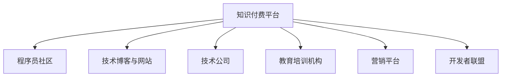

                 

# 程序员知识付费的跨界合作机会

> 关键词：程序员,知识付费,跨界合作,IT技术,营销策略,创业机会

## 1. 背景介绍

### 1.1 问题由来

随着互联网技术的发展和信息爆炸的加剧，知识的获取和传播方式正在发生深刻的变革。传统的线下教育、课堂教学已无法满足广大知识工作者对持续学习的需求。知识付费平台的崛起，为程序员和开发者提供了新的学习途径，特别是在快速迭代的技术领域，程序员需要不断更新知识和技能，以适应新技术和新项目的要求。

在知识付费领域，程序员逐渐成为主要的受众群体。他们对高质量技术文章的渴望，推动了各类技术网站和平台的崛起，如博客、视频课程、技术社区等。但随着内容创作的成本上升和用户需求的多样化，单纯依靠内容付费已经无法满足平台和内容创作者的持续发展。因此，新的合作模式和盈利模式成为亟待解决的问题。

### 1.2 问题核心关键点

程序员知识付费的跨界合作机会，关键在于如何打破传统内容创作的边界，利用跨领域的资源和能力，构建新的价值生态。具体体现在以下几个方面：

- **内容创作多样化**：不仅限于技术文章，可以包括项目案例、行业洞察、职业发展等多元内容。
- **跨界合作资源**：如技术公司、行业协会、教育机构、市场营销平台等。
- **盈利模式创新**：如广告分成、会员订阅、技术咨询、知识共享等。
- **用户价值最大化**：满足程序员的多样化需求，提供工具、教程、资源、人脉等综合服务。

## 2. 核心概念与联系

### 2.1 核心概念概述

为更好地理解程序员知识付费的跨界合作机会，本节将介绍几个密切相关的核心概念：

- **知识付费平台**：提供优质付费内容，面向程序员和开发者用户进行知识传播和商业变现的平台。
- **程序员社区**：以技术分享、问题解决、职业发展为主题的在线社区，如Stack Overflow、Github等。
- **技术博客与网站**：如博客园、InfoQ、博客大巴等，专注于技术文章、代码库、开发者访谈等。
- **技术公司**：如Google、Microsoft、Alibaba等，利用自身技术优势，推动知识传播和跨界合作。
- **教育培训机构**：如Coursera、Udacity、慕课网等，提供系统化的技术课程和认证。
- **营销平台**：如知乎、B站、抖音等，利用平台流量和社交网络，推广技术内容。
- **开发者联盟**：如ACM、IEEE、INFORMS等，通过组织活动、交流经验，促进知识共享。

这些概念之间的逻辑关系可以通过以下Mermaid流程图来展示：



这个流程图展示了几类核心概念及其之间的关系：

1. 知识付费平台是知识传播和商业变现的核心载体。
2. 程序员社区、技术博客与网站是知识创作者和用户互动的场所。
3. 技术公司、教育培训机构提供技术和培训资源。
4. 营销平台推广技术内容，提升曝光度。
5. 开发者联盟促进知识共享和合作。

这些概念共同构成了程序员知识付费的生态系统，为跨界合作提供了丰富的土壤。

## 3. 核心算法原理 & 具体操作步骤

### 3.1 算法原理概述

程序员知识付费的跨界合作机会，本质上是一个多方共赢的商业合作模型。其核心思想是：利用各方的资源和能力，打破边界，实现资源互补和价值最大化。

具体来说，知识付费平台可以借助程序员社区、技术博客与网站的内容资源，利用技术公司、教育培训机构的课程和技术支持，通过营销平台推广，吸引更多程序员用户，从而实现商业盈利。

该合作模型包括两个主要步骤：内容创作和价值变现。

### 3.2 算法步骤详解

**Step 1: 内容创作**

1. **内容规划与选题**：知识付费平台根据用户需求和市场趋势，规划选题和内容方向，如最新技术趋势、项目管理、软件架构等。
2. **内容生产**：程序员社区、技术博客与网站的内容创作者，根据选题方向，提供高质量的技术文章、案例分析、项目展示等。
3. **内容审核与发布**：知识付费平台对内容进行审核和编辑，确保内容质量，发布到平台供用户阅读和付费。
4. **内容互动与反馈**：用户通过平台互动和评论，反馈内容需求和意见，进一步优化内容创作。

**Step 2: 价值变现**

1. **会员订阅**：用户可以订阅平台，享受丰富的技术文章、课程、资源等，支持平台运营。
2. **广告分成**：平台与广告商合作，在文章、课程、视频中插入广告，获得分成收益。
3. **技术咨询**：利用平台技术专家和社区成员，提供付费技术咨询和问题解答服务。
4. **知识共享**：平台提供付费技术课程、书籍、工具等，满足程序员深度学习的需求。
5. **合作推广**：平台与技术公司、教育培训机构、营销平台合作，推广内容和技术资源，提升平台曝光度和影响力。

### 3.3 算法优缺点

程序员知识付费的跨界合作机会，具有以下优点：

1. **内容多样化**：融合技术博客、社区、教育培训等多方面的内容资源，满足用户多样化的学习需求。
2. **用户粘性提升**：通过跨界合作，提供更多的服务和功能，提升用户平台粘性。
3. **收益模式丰富**：广告分成、会员订阅、技术咨询等多样化的盈利模式，分散风险。
4. **合作伙伴多样**：技术公司、教育培训机构、营销平台等多元化的合作方，共同推动知识传播。

同时，该合作模型也存在一定的局限性：

1. **内容质量控制**：各方的内容创作标准不一，内容质量难以统一。
2. **合作协调难度**：各方的合作模式和商业利益需要协调，过程复杂。
3. **用户支付意愿**：部分用户对付费内容敏感，付费意愿不高。
4. **平台运营成本**：需要投入较多的资源进行内容审核、平台维护、广告投放等，运营成本较高。

尽管存在这些局限性，但就目前而言，跨界合作模式为程序员知识付费提供了新的发展方向，有助于实现资源整合和价值最大化。

### 3.4 算法应用领域

程序员知识付费的跨界合作机会，适用于多个领域：

1. **技术培训与认证**：与教育培训机构合作，提供系统化的技术培训和认证课程。
2. **行业报告与洞察**：与行业协会、研究机构合作，提供深度行业报告和技术洞察。
3. **开源项目推广**：与开源社区、技术公司合作，推广开源项目和技术工具。
4. **职业发展指导**：与招聘平台、职业规划机构合作，提供职业发展指导和建议。
5. **技术移民支持**：与移民服务机构合作，提供技术移民和职业规划支持。

## 4. 数学模型和公式 & 详细讲解 & 举例说明（备注：数学公式请使用latex格式，latex嵌入文中独立段落使用 $$，段落内使用 $)
### 4.1 数学模型构建

本节将使用数学语言对程序员知识付费的跨界合作模型进行更加严格的刻画。

记知识付费平台为 $P$，程序员社区为 $C$，技术博客与网站为 $W$，技术公司为 $T$，教育培训机构为 $E$，营销平台为 $M$，开发者联盟为 $A$。各方的内容创作和价值变现分别为：

- $C$ 提供内容 $c_i$，价值 $v_i$
- $W$ 提供内容 $w_j$，价值 $v_j$
- $T$ 提供内容 $t_k$，价值 $v_k$
- $E$ 提供内容 $e_l$，价值 $v_l$
- $M$ 提供内容 $m_m$，价值 $v_m$
- $A$ 提供内容 $a_n$，价值 $v_n$

平台整合各方的内容，发布到平台供用户阅读和付费，价值表示为 $V$。

模型构建如下：

$$
V = f(c_i, w_j, t_k, e_l, m_m, a_n)
$$

其中 $f$ 为内容整合和价值转化函数，具体包括内容选择、编辑、审核、发布、互动、反馈、广告、会员、咨询、共享等环节。

### 4.2 公式推导过程

以下我们以会员订阅和广告分成为例，推导内容整合和价值转化的具体公式。

假设知识付费平台的会员数量为 $N$，每月的订阅费用为 $P_s$，广告点击率为 $C_a$，每次点击收益为 $A_c$。则平台的总收入为：

$$
T = N \times P_s + C_a \times A_c
$$

对于内容 $c_i$，假设其价值 $v_i$ 为创作者分成比例 $p_i$ 与平台分成比例 $q_i$ 的乘积。

则总收入 $T$ 可表示为：

$$
T = \sum_{i=1}^{m} p_i \times q_i \times v_i
$$

其中 $m$ 为内容的总数，$p_i$ 和 $q_i$ 分别为创作者和平台的分成比例，$v_i$ 为内容的价值。

通过上述公式，可以看出，平台总收入由各方的分成比例和内容价值共同决定。为了最大化平台收益，需要合理设定各方的分成比例，确保各方的积极性和平台收益的最大化。

### 4.3 案例分析与讲解

假设某知识付费平台与程序员社区、技术博客、教育培训机构、营销平台和开发者联盟合作，提供技术培训、行业报告、开源项目推广、职业发展指导和技术移民支持等多元化内容。平台决定将用户订阅费用设为每月的 $P_s=50$ 元，广告点击率为 $C_a=0.2$，每次点击收益为 $A_c=1$ 元。

根据各方的内容价值评估，假设 $c_i$、$w_j$、$t_k$、$e_l$、$m_m$、$a_n$ 的分成比例分别为 $p_i=0.3$、$q_i=0.7$、$p_j=0.4$、$q_j=0.6$、$p_k=0.5$、$q_k=0.5$、$p_l=0.2$、$q_l=0.8$、$p_m=0.1$、$q_m=0.9$、$p_n=0.15$、$q_n=0.85$。

则平台的总收入为：

$$
T = 100 \times 50 + 200 \times 1 = 10000
$$

其中，订阅费用 $100 \times 50$ 元，广告点击收益 $200 \times 1$ 元。

通过调整各方的分成比例，可以在不降低内容质量的前提下，最大化平台的总收入。例如，若增加程序员社区和教育培训机构的内容分成比例，减少营销平台和开发者联盟的分成比例，平台的收益可能进一步提升。

## 5. 项目实践：代码实例和详细解释说明
### 5.1 开发环境搭建

在进行跨界合作项目实践前，我们需要准备好开发环境。以下是使用Python进行Django开发的环境配置流程：

1. 安装Anaconda：从官网下载并安装Anaconda，用于创建独立的Python环境。

2. 创建并激活虚拟环境：
```bash
conda create -n django-env python=3.8 
conda activate django-env
```

3. 安装Django：
```bash
pip install django
```

4. 安装相关依赖包：
```bash
pip install Pillow Django-BackgroundTasks django-templates django-markdown django-rest-framework markdown
```

5. 安装数据库：
```bash
pip install psycopg2-binary
```

完成上述步骤后，即可在`django-env`环境中开始跨界合作项目的开发。

### 5.2 源代码详细实现

这里我们以一个知识付费平台为例，使用Django框架实现跨界合作的流程管理。

首先，定义模型：

```python
from django.db import models
from django.contrib.auth.models import User

class Content(models.Model):
    title = models.CharField(max_length=255)
    author = models.ForeignKey(User, on_delete=models.CASCADE)
    content_type = models.CharField(max_length=255)
    content = models.TextField()
    value = models.FloatField()
    status = models.CharField(max_length=20, choices=[('active', 'Active'), ('inactive', 'Inactive')])

class Partner(models.Model):
    name = models.CharField(max_length=255)
    type = models.CharField(max_length=255)
    content = models.ManyToManyField(Content)
    分成比例 = models.FloatField()
    value = models.FloatField()

class UserProfile(models.Model):
    user = models.OneToOneField(User, on_delete=models.CASCADE)
    积分 = models.IntegerField(default=0)
```

然后，定义视图和模板：

```python
from django.shortcuts import render
from django.http import HttpResponse

def index(request):
    return render(request, 'index.html')

def content_list(request):
    contents = Content.objects.filter(status='active').order_by('-created_at')
    return render(request, 'content_list.html', {'contents': contents})

def partner_list(request):
    partners = Partner.objects.all().order_by('-created_at')
    return render(request, 'partner_list.html', {'partners': partners})

def partner_detail(request, pk):
    partner = Partner.objects.get(pk=pk)
    return render(request, 'partner_detail.html', {'partner': partner})

def profile(request):
    user = request.user
    return render(request, 'profile.html', {'user': user})
```

最后，定义URL映射：

```python
from django.urls import path
from . import views

urlpatterns = [
    path('', views.index, name='index'),
    path('content/', views.content_list, name='content_list'),
    path('partner/', views.partner_list, name='partner_list'),
    path('partner/<int:pk>/', views.partner_detail, name='partner_detail'),
    path('profile/', views.profile, name='profile'),
]
```

以上就是使用Django框架实现跨界合作项目的完整代码实现。可以看到，通过Django的ORM、视图、模板等组件，我们能够方便地实现内容管理和合作伙伴关系管理，为跨界合作提供基础支撑。

### 5.3 代码解读与分析

让我们再详细解读一下关键代码的实现细节：

**Content类**：
- 定义了内容的基本属性，如标题、作者、类型、内容、价值、状态等。
- `status`字段用于标记内容的状态，分为活跃和非活跃两种。

**Partner类**：
- 定义了合作伙伴的基本属性，如名称、类型、内容关系、分成比例、价值等。
- `content`字段与`Content`模型建立多对多关系，表示合作伙伴提供的内容。

**UserProfile类**：
- 定义了用户的基本属性，如用户对象、积分等。
- `UserProfile`类与`User`模型建立一对一关系，表示用户对平台的积分。

**index视图**：
- 展示平台首页，调用`index.html`模板。

**content_list视图**：
- 获取活跃内容，按照创建时间排序，调用`content_list.html`模板展示。

**partner_list视图**：
- 获取所有合作伙伴，按照创建时间排序，调用`partner_list.html`模板展示。

**partner_detail视图**：
- 根据合作伙伴ID获取详情，调用`partner_detail.html`模板展示。

**profile视图**：
- 展示用户个人资料，调用`profile.html`模板。

可以看出，通过Django的框架设计和组件封装，我们能够快速构建跨界合作平台，实现内容管理和合作伙伴关系管理，为合作方提供便捷的操作界面和数据支持。

当然，实际的跨界合作项目还需要考虑更多的因素，如用户身份认证、内容审核、广告投放等，但核心的跨界合作流程管理，Django框架已经提供了很好的起点。

## 6. 实际应用场景
### 6.1 智能客服系统

基于跨界合作的知识付费平台，可以构建智能客服系统。利用程序员社区、技术博客与网站的内容资源，提供高质量的技术文章、案例分析、项目展示等，满足用户多样化的学习需求。

具体实现上，平台可以与程序员社区、技术博客与网站的内容创作者合作，提供常见问题解答、技术支持、用户反馈等功能。用户在遇到问题时，可以通过搜索和浏览，找到对应的解决方案。平台还可以利用机器学习和自然语言处理技术，对用户咨询进行自动化分析，提升客服效率和质量。

### 6.2 技术培训与认证

与教育培训机构合作，提供系统化的技术培训和认证课程，是跨界合作的重要应用场景。平台可以整合各方的课程资源，提供从入门到高级的完整培训体系，满足不同层次的技术需求。

具体实现上，平台可以引入教育培训机构的课程内容，提供录播和直播两种形式的课程，结合在线题库和互动问答，提升学习效果。平台还可以提供证书颁发、在线考试等功能，增强课程的权威性和实用性。

### 6.3 开源项目推广

与开源社区、技术公司合作，推广开源项目和技术工具，是跨界合作的另一个重要方向。平台可以提供开源项目展示、技术讨论、代码贡献等社区功能，吸引更多开发者参与项目开发。

具体实现上，平台可以整合开源社区的项目列表，提供详细的项目描述、代码库、技术文档等，提升项目的可见性和吸引力。平台还可以引入技术公司对项目进行技术支持，提升项目的质量和稳定性。

### 6.4 职业发展指导

与职业规划机构、招聘平台合作，提供职业发展指导和建议，是跨界合作的另一项重要应用场景。平台可以整合各方的职业发展资源，提供职业规划、求职指导、面试培训等功能，提升用户的职业竞争力。

具体实现上，平台可以提供职业规划师在线咨询、求职岗位推荐、面试技巧培训等功能，结合用户简历和职业兴趣，推荐合适的职业发展路径。平台还可以与招聘平台合作，提供实时招聘信息，帮助用户找到理想的工作机会。

### 6.5 技术移民支持

与移民服务机构合作，提供技术移民和职业规划支持，是跨界合作的新兴方向。平台可以提供移民政策咨询、职业资格认证、移民指导等功能，帮助技术工作者实现职业和身份的转变。

具体实现上，平台可以整合移民服务机构的移民政策和流程信息，提供详细移民指导和咨询。平台还可以引入职业资格认证机构，提供相关技术和职业认证，提升用户的移民竞争力。

## 7. 工具和资源推荐
### 7.1 学习资源推荐

为了帮助开发者系统掌握跨界合作的知识付费模式，这里推荐一些优质的学习资源：

1. 《程序员知识付费的跨界合作机会》系列博文：由大模型技术专家撰写，深入浅出地介绍了跨界合作模式、合作范式、盈利模式等前沿话题。

2. Coursera《知识付费与在线教育》课程：斯坦福大学开设的在线课程，有Lecture视频和配套作业，带你入门知识付费领域的核心概念和商业模型。

3. 《知识付费模式与盈利策略》书籍：深入分析了知识付费的商业模式和运营策略，提供了丰富的案例和实操建议。

4. Hacker News《知识付费的商业模式与实践》专栏：汇集了大量知识付费领域的新闻、文章和讨论，提供了多种商业模式和案例参考。

5. 《知识付费平台的运营与盈利》报告：分析了知识付费平台的运营模式、盈利策略和用户体验，提供了丰富的实战经验。

通过对这些资源的学习实践，相信你一定能够快速掌握跨界合作的精髓，并用于解决实际的跨界合作问题。

### 7.2 开发工具推荐

高效的开发离不开优秀的工具支持。以下是几款用于跨界合作项目的常用工具：

1. Django：Python的开源Web框架，灵活便捷，支持多种数据库，适合快速迭代开发。

2. Docker：容器化技术，方便环境部署和项目管理，提升开发效率。

3. Git：版本控制系统，支持多人协作，版本控制方便，协作流畅。

4. PostgreSQL：高性能关系型数据库，适合数据管理和存储，支持复杂查询和数据整合。

5. Jenkins：持续集成和持续部署工具，支持自动化任务和自动化测试，提升开发效率。

6. Redmine：开源项目管理工具，支持任务分配、进度跟踪、版本控制等功能，协作高效。

合理利用这些工具，可以显著提升跨界合作项目的开发效率，加快创新迭代的步伐。

### 7.3 相关论文推荐

跨界合作模式的发展源于学界的持续研究。以下是几篇奠基性的相关论文，推荐阅读：

1. A Survey on Knowledge Sharing in Software Engineering：回顾了软件工程领域的知识共享实践和挑战，探讨了跨界合作的重要性和方法。

2. Cross-Disciplinary Knowledge Sharing in Collaborative Research：探讨了跨学科知识共享的机制和效果，提出了跨界合作的理论基础和方法。

3. Knowledge Sharing in Engineering: A Literature Review and Research Agenda：回顾了工程领域的知识共享研究，提出了跨界合作的应用场景和方法。

4. A Comprehensive Survey on Knowledge Sharing Technologies：综述了知识共享技术的发展，介绍了跨界合作的技术实现和应用案例。

5. Cross-Border Knowledge Sharing in Global Software Development：探讨了全球软件开发中的跨界知识共享，提出了跨界合作的策略和实践。

这些论文代表了大模型微调技术的发展脉络。通过学习这些前沿成果，可以帮助研究者把握学科前进方向，激发更多的创新灵感。

## 8. 总结：未来发展趋势与挑战

### 8.1 总结

本文对程序员知识付费的跨界合作机会进行了全面系统的介绍。首先阐述了知识付费领域的现状和挑战，明确了跨界合作的重要性和价值。其次，从原理到实践，详细讲解了跨界合作的数学模型和操作步骤，给出了跨界合作项目开发的完整代码实例。同时，本文还广泛探讨了跨界合作在智能客服、技术培训、开源项目推广、职业发展指导、技术移民支持等多个领域的应用前景，展示了跨界合作的广阔前景。此外，本文精选了跨界合作的各种学习资源，力求为读者提供全方位的技术指引。

通过本文的系统梳理，可以看到，程序员知识付费的跨界合作机会是一个极具潜力的商业模式，通过多方资源的整合和协同，可以实现知识传播和商业变现的最大化，为程序员和开发者提供丰富的学习资源和职业支持。未来，伴随技术的不断演进和市场的逐步成熟，跨界合作模式必将在知识付费领域大放异彩。

### 8.2 未来发展趋势

展望未来，程序员知识付费的跨界合作机会将呈现以下几个发展趋势：

1. **内容创作多样化**：不仅限于技术文章，可以包括项目案例、行业洞察、职业发展等多元内容。
2. **合作模式多样化**：除了平台与合作伙伴的直接合作，还可以通过众包、众筹等方式，引入更多内容创作者和用户参与。
3. **收益模式多样化**：除了订阅和广告分成，还可以引入众筹、众包收益、知识共享收益等新模式。
4. **平台国际化**：引入多语言支持，拓展国际市场，吸引全球用户。
5. **技术创新应用**：利用AI和大数据技术，提供个性化推荐、智能搜索、智能客服等功能，提升用户体验。
6. **职业发展支持**：引入职业规划、求职指导、面试培训等功能，提供职业发展一站式服务。

以上趋势凸显了跨界合作模式的广阔前景。这些方向的探索发展，必将进一步提升程序员知识付费平台的竞争力和市场影响力。

### 8.3 面临的挑战

尽管跨界合作模式已经取得了一定的成效，但在迈向更加智能化、普适化应用的过程中，它仍面临着诸多挑战：

1. **内容质量控制**：各方的内容创作标准不一，内容质量难以统一。
2. **合作协调难度**：各方的合作模式和商业利益需要协调，过程复杂。
3. **用户支付意愿**：部分用户对付费内容敏感，付费意愿不高。
4. **平台运营成本**：需要投入较多的资源进行内容审核、平台维护、广告投放等，运营成本较高。
5. **技术门槛较高**：开发跨界合作平台需要较高的技术门槛，需要专业知识的支持。
6. **市场竞争激烈**：知识付费领域竞争激烈，需要持续创新和优化，才能吸引用户。

尽管存在这些挑战，但跨界合作模式通过各方资源的整合和协同，仍有望成为知识付费领域的创新方向。相信随着技术的不断演进和市场的逐步成熟，这些挑战终将一一被克服，跨界合作模式必将在知识付费领域大放异彩。

### 8.4 研究展望

面对跨界合作模式面临的种种挑战，未来的研究需要在以下几个方面寻求新的突破：

1. **内容创作自动化**：引入AI和大数据技术，自动生成内容，提升内容创作效率和质量。
2. **平台智能化**：利用AI和大数据技术，提供个性化推荐、智能搜索、智能客服等功能，提升用户体验。
3. **合作模式创新**：引入众包、众筹等方式，引入更多内容创作者和用户参与，拓展合作空间。
4. **收益模式创新**：引入众筹、众包收益、知识共享收益等新模式，实现多样化盈利。
5. **技术门槛降低**：引入技术平台和工具，降低技术门槛，提升开发效率和用户参与度。
6. **市场推广创新**：利用社交媒体、内容营销等方式，提升平台曝光度和用户参与度。

这些研究方向的探索，必将引领跨界合作模式走向更高的台阶，为知识付费平台提供新的发展方向和创新空间。面向未来，跨界合作模式需要从内容、技术、市场等多个维度协同发力，共同推动知识付费技术的进步。只有勇于创新、敢于突破，才能在激烈的市场竞争中保持领先，实现知识付费模式的可持续发展。

## 9. 附录：常见问题与解答

**Q1：如何提高内容创作的效率和质量？**

A: 提高内容创作的效率和质量，需要多方面的努力：

1. **自动化工具**：利用自动化工具如Grammarly、Hemingway等，提升写作质量和效率。
2. **模板和框架**：使用模板和框架，快速生成高质量的技术文章和项目文档。
3. **协作平台**：引入协作平台如Trello、Asana等，分配任务、跟踪进度，提升团队协作效率。
4. **AI辅助**：利用AI工具如OpenAI、GPT-3等，自动生成技术文章、代码库等，提升创作效率。

**Q2：如何选择合适的合作伙伴？**

A: 选择合适的合作伙伴，需要考虑以下几个方面：

1. **内容匹配度**：选择与平台内容主题相匹配的合作伙伴，提升内容质量。
2. **用户需求**：选择能满足用户需求的合作伙伴，提升用户粘性。
3. **技术能力**：选择具有较高技术能力和经验的项目，保证内容质量。
4. **合作意愿**：选择愿意长期合作的合作伙伴，提升合作关系稳定性和持久性。
5. **分成机制**：选择具有合理分成机制的合作伙伴，保证各方的积极性和收益。

**Q3：如何平衡各方利益，实现共赢？**

A: 平衡各方利益，实现共赢，需要以下几点：

1. **公平分成机制**：制定合理的分成机制，确保各方的积极性和收益。
2. **透明沟通**：保持透明的沟通，及时解决合作中的问题，提升合作关系信任度。
3. **共同目标**：设定共同的目标和标准，确保各方的利益一致性。
4. **持续优化**：不断优化合作模式和流程，提升合作效率和质量。

**Q4：如何应对跨界合作中的技术挑战？**

A: 应对跨界合作中的技术挑战，需要以下几点：

1. **技术平台支持**：引入技术平台如Git、Django等，降低技术门槛，提升开发效率。
2. **技术支持服务**：引入技术支持服务如Stack Overflow、GitHub等，解决技术问题。
3. **技术培训**：提供技术培训和文档，提升合作伙伴的技术能力。
4. **技术合作**：与技术公司合作，引入先进的技术和工具，提升平台的技术实力。

**Q5：如何提升用户支付意愿？**

A: 提升用户支付意愿，需要以下几个方面的努力：

1. **内容质量**：提供高质量、有价值的内容，吸引用户付费。
2. **用户体验**：提升平台的用户体验，使用户感受到便捷和愉悦。
3. **价格优惠**：提供优惠活动、免费试用等功能，降低用户支付门槛。
4. **社交影响力**：利用社交媒体和社区推荐，提升平台知名度和用户粘性。
5. **平台服务**：提供一站式服务，如内容搜索、职业发展指导等，提升平台价值。

这些方法可以帮助平台提升用户支付意愿，实现商业变现的最大化。通过不断优化内容和平台服务，提升用户体验和价值，相信跨界合作模式将吸引更多用户，实现商业变现的可持续增长。

---

作者：禅与计算机程序设计艺术 / Zen and the Art of Computer Programming

