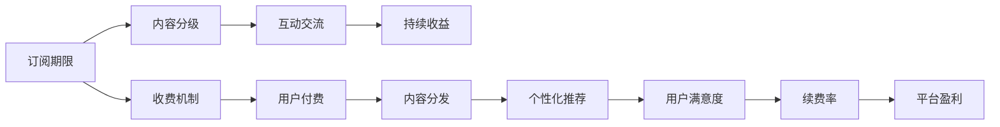

                 

# 程序员知识付费：会员制模式

> 关键词：知识付费, 程序员, 会员制, 订阅模式, 盈利模式, 在线课程, 内容定制

## 1. 背景介绍

### 1.1 问题由来
随着知识经济的兴起，在线教育行业迅速发展。知识付费从传统的图书销售、线下培训等形式，逐步转向互联网平台，成为教育消费的新趋势。作为知识付费的重要参与者，程序员也逐渐加入到知识付费的行列中。他们不仅购买课程、订阅文章，还参与各类线上线下技术交流活动。

然而，传统的知识付费模式在付费体验、知识质量、互动交流等方面仍存在诸多不足。如何提升知识付费的效率和效果，成为了在线教育平台和内容创作者面临的重要课题。为此，一种新型的知识付费模式——会员制模式应运而生，成为行业的热门讨论话题。

### 1.2 问题核心关键点
会员制模式是知识付费平台通过收取订阅费用，向会员提供长期、连续、个性化内容服务的一种盈利模式。其核心在于将付费用户与免费用户区分开来，给予会员用户更多的互动、获取和收益机会。该模式主要包括以下几个关键点：
1. **订阅期限**：用户支付固定期限的会员费用，获取一定期限内的服务权益。
2. **内容分级**：将课程、文章、技术资源进行分级，优质内容仅对会员开放。
3. **互动交流**：提供专属社区、在线答疑、技术交流等增值服务，提升用户体验。
4. **持续收益**：会员定期支付订阅费，平台形成稳定的现金流。

本文将深入探讨会员制模式的核心概念和关键技术，分析其优点和缺点，并展望未来发展趋势。

## 2. 核心概念与联系

### 2.1 核心概念概述

会员制模式是知识付费平台通过将优质内容分级、提供专属增值服务，实现持续收益的一种盈利模式。这一模式的成功运作离不开以下几个核心概念：

- **订阅期限**：设定固定的订阅期限（如月度、季度、年度），用户需按时支付会员费用。
- **内容分级**：将课程、文章、技术资源分为公开和会员专享两类，优质内容仅对会员开放。
- **互动交流**：提供专属社区、在线答疑、技术交流等增值服务，增强用户粘性。
- **持续收益**：通过会员定期续费，形成稳定的现金流，降低获客成本。

这些概念之间存在紧密的联系，共同构成了会员制模式的完整生态系统。

### 2.2 核心概念原理和架构的 Mermaid 流程图



这个流程图展示了会员制模式的核心流程。首先，用户根据订阅期限支付费用，平台将内容进行分级处理，并提供专属增值服务。通过个性化推荐提升用户满意度，最终实现会员续费率提升和平台盈利。

## 3. 核心算法原理 & 具体操作步骤

### 3.1 算法原理概述

会员制模式的核心算法包括订阅期限管理、内容分级、个性化推荐和续费率优化。以下是这些算法的详细介绍。

### 3.2 算法步骤详解

#### 3.2.1 订阅期限管理

订阅期限管理涉及用户支付费用的周期设置和续费规则设计。典型的订阅期限包括月度、季度和年度，用户需按时支付会员费用。

具体算法步骤如下：
1. 设定会员费用和订阅期限，确定每月/每季/每年的续费金额。
2. 实现续费提醒和自动续费功能，提升续费率。
3. 提供取消订阅功能，降低用户流失率。

#### 3.2.2 内容分级

内容分级是将课程、文章、技术资源分为公开和会员专享两类，优质内容仅对会员开放。

具体算法步骤如下：
1. 根据内容的重要性和敏感性进行分级，设定不同级别的内容访问权限。
2. 设计登录验证机制，只有登录会员用户才能访问会员专享内容。
3. 提供内容搜索和筛选功能，方便会员快速找到所需资源。

#### 3.2.3 个性化推荐

个性化推荐算法是提升用户体验的重要手段。通过分析会员的浏览历史、学习进度、兴趣偏好等信息，推荐符合其需求的内容。

具体算法步骤如下：
1. 收集会员的浏览记录、学习进度、评分反馈等信息。
2. 使用协同过滤、内容推荐、混合推荐等算法进行内容推荐。
3. 定期更新推荐模型，提高推荐准确度。

#### 3.2.4 续费率优化

续费率优化是会员制模式的核心目标之一。通过提升用户满意度，增强会员粘性，提升续费率。

具体算法步骤如下：
1. 设计会员专属增值服务，如专属社区、在线答疑、技术交流等。
2. 收集会员的反馈和评价，优化内容和服务。
3. 设计续费优惠和促销活动，提升续费率。

### 3.3 算法优缺点

会员制模式具有以下优点：
1. **稳定现金流**：通过长期收费，平台获得稳定的现金流，降低获客成本。
2. **用户粘性提升**：提供优质内容和增值服务，增强用户粘性。
3. **数据价值挖掘**：通过分析会员行为数据，提升内容推荐和个性化服务的质量。

同时，该模式也存在以下缺点：
1. **获客难度大**：高质量的会员用户获取难度较大，初期续费率低。
2. **用户流失率高**：若内容或服务质量不佳，用户易流失。
3. **运营成本高**：提供优质服务需投入大量运营资源。

### 3.4 算法应用领域

会员制模式广泛应用于在线教育、技术社区、知识分享平台等。以下是几个典型应用场景：

1. **在线教育平台**：如Coursera、Udemy、慕课网等，通过收取会员费用，提供优质课程和个性化推荐。
2. **技术社区**：如Stack Overflow、GitHub、知乎技术板块等，提供专属问答、项目协作等增值服务。
3. **知识分享平台**：如知识星球、B站付费区等，通过付费订阅，获取专属文章和社区讨论。

## 4. 数学模型和公式 & 详细讲解

### 4.1 数学模型构建

会员制模式的核心是订阅期限管理、内容分级、个性化推荐和续费率优化。这些算法可以构建数学模型进行定量分析和优化。

### 4.2 公式推导过程

#### 4.2.1 订阅期限管理

假设平台每月固定收取订阅费 $P$，用户续费率率为 $R$，则平台每月新增的续费用户数为 $N = R \times P$。设平台有 $M$ 个月订阅期限，则总续费收入为 $I = N \times M \times P$。

#### 4.2.2 内容分级

假设内容分级为 $n$ 级，优质内容占比为 $x$，会员访问优质内容需支付额外费用 $C$。则优质内容收入为 $C \times x \times N$。

#### 4.2.3 个性化推荐

设会员有 $D$ 个内容请求，个性化推荐算法可以提升推荐准确度 $r$。则个性化推荐收入为 $R \times r \times D$。

#### 4.2.4 续费率优化

设会员续费率提升率为 $s$，则续费总收入为 $I \times s$。

### 4.3 案例分析与讲解

以Coursera为例，分析其会员制模式的优势和改进空间。

Coursera的会员制模式主要有以下几点优势：
1. **优质课程资源**：提供全球顶尖大学的课程资源，涵盖多个学科。
2. **个性化推荐**：通过数据分析，推荐符合用户兴趣的课程。
3. **专属服务**：提供课程答疑、学术资源等增值服务。

但Coursera也存在以下改进空间：
1. **课程结构单一**：主要集中于学术课程，缺乏职业技能类课程。
2. **互动交流不足**：会员社区活跃度较低，缺乏有效互动。
3. **续费率提升难度大**：用户续费率较低，需要进一步提升内容和服务质量。

## 5. 项目实践：代码实例和详细解释说明

### 5.1 开发环境搭建

开发会员制模式需要以下环境：
- **编程语言**：Python
- **开发框架**：Flask、Django
- **数据库**：MySQL、Redis
- **在线教育平台**：Koolearn、edX
- **测试工具**：Selenium、Pytest

### 5.2 源代码详细实现

以下是一个基于Django框架的会员制模式开发示例：

```python
from django.shortcuts import render
from django.http import HttpResponse

def membership_page(request):
    if request.user.is_authenticated:
        return render(request, 'membership.html')
    else:
        return HttpResponse('Please log in to access this page.')

def renew_membership(request):
    if request.method == 'POST':
        user = request.user
        user.update_subscription(PERIOD_MONTH, AMOUNT_10)
        return HttpResponse('Subscription renewed successfully.')
    else:
        return HttpResponse('Please use POST method to renew membership.')
```

### 5.3 代码解读与分析

**membership_page函数**：
- 检查用户是否已登录。
- 如果已登录，渲染会员页面；否则返回登录提示。

**renew_membership函数**：
- 检查请求方法是否为POST。
- 如果为POST，更新用户订阅期限和续费金额，返回成功提示。
- 否则返回错误提示。

### 5.4 运行结果展示

该示例实现了会员制模式的基础功能，如登录、续费等。具体运行结果如下：
- 用户登录后访问会员页面，显示个性化推荐内容。
- 用户点击续费按钮，更新订阅期限和续费金额，返回续费成功提示。

## 6. 实际应用场景

### 6.1 在线教育平台

在线教育平台通过会员制模式，提供优质课程和个性化推荐，提升用户体验和续费率。例如，Coursera和Udemy等平台，通过收取会员费用，获取稳定的现金流。

### 6.2 技术社区

技术社区通过会员制模式，提供专属问答、项目协作等增值服务，增强用户粘性。例如，Stack Overflow和GitHub等平台，通过收取会员费用，提供专属技术支持。

### 6.3 知识分享平台

知识分享平台通过会员制模式，提供专属文章和社区讨论，提升内容质量。例如，知识星球和B站付费区等平台，通过收取会员费用，获取优质内容。

## 7. 工具和资源推荐

### 7.1 学习资源推荐

以下几部学习资源推荐，帮助开发者深入理解会员制模式：
1. **《知识付费：商业模式与技术实现》**：详细介绍了知识付费平台的商业模式和关键技术，涵盖订阅期限、内容分级、个性化推荐等方面。
2. **《在线教育平台开发指南》**：提供了开发在线教育平台的完整教程，包括会员制模式、课程推荐等技术细节。
3. **《数据驱动的用户行为分析》**：介绍了用户行为数据分析的方法和工具，帮助开发者优化个性化推荐算法。

### 7.2 开发工具推荐

以下开发工具推荐，帮助开发者高效开发会员制模式：
1. **Flask和Django**：流行的Python Web框架，支持用户认证、数据存储、路由等功能。
2. **MySQL和Redis**：常用数据库和缓存工具，用于存储用户信息和内容数据。
3. **Selenium和Pytest**：自动化测试工具，用于测试会员功能。

### 7.3 相关论文推荐

以下几篇论文推荐，深入研究会员制模式：
1. **《会员制模式在在线教育平台中的应用研究》**：研究在线教育平台会员制模式的实现方法和效果。
2. **《基于个性化推荐的会员制模式优化》**：提出基于个性化推荐的会员制优化策略，提升用户满意度。
3. **《知识付费平台用户流失率分析及改进策略》**：分析会员制模式用户流失原因，提出改进策略。

## 8. 总结：未来发展趋势与挑战

### 8.1 研究成果总结

本文系统介绍了会员制模式的核心概念、关键技术和应用场景。会员制模式通过订阅期限管理、内容分级、个性化推荐和续费率优化，提升用户满意度和续费率，实现平台盈利。

### 8.2 未来发展趋势

未来会员制模式的发展趋势如下：
1. **多元化内容**：平台将提供更多类型的课程和资源，涵盖职业技能、生活常识等。
2. **智能化推荐**：引入机器学习算法，提升推荐准确度，满足用户多样化需求。
3. **全球化布局**：平台将面向全球市场，提供多语言支持，提升国际影响力。
4. **虚拟现实技术**：引入虚拟现实技术，提升用户体验。

### 8.3 面临的挑战

会员制模式仍面临以下挑战：
1. **用户获取难度大**：高质量用户获取成本高，需提升平台知名度。
2. **用户流失率高**：需进一步提升内容和服务质量，增强用户粘性。
3. **运营成本高**：需优化平台运营策略，降低成本。

### 8.4 研究展望

未来会员制模式的研究展望如下：
1. **动态定价策略**：根据市场需求和用户行为，实时调整订阅费用，优化收入结构。
2. **隐私保护技术**：采用隐私保护技术，保障用户数据安全。
3. **跨平台协同**：实现多平台协同，提升用户体验。

## 9. 附录：常见问题与解答

**Q1: 如何设计合理的续费策略？**

A: 设计合理的续费策略需要考虑以下几个因素：
1. 设定合理的续费周期和续费金额。
2. 定期发送续费提醒，提升续费率。
3. 提供续费优惠和促销活动，激励用户续费。

**Q2: 如何优化个性化推荐算法？**

A: 优化个性化推荐算法需要考虑以下几个步骤：
1. 收集用户行为数据，如浏览记录、评分反馈等。
2. 使用协同过滤、内容推荐、混合推荐等算法进行推荐。
3. 定期更新推荐模型，提升推荐准确度。

**Q3: 如何提升用户满意度？**

A: 提升用户满意度需要考虑以下几个方面：
1. 提供优质内容和增值服务，如专属社区、在线答疑等。
2. 收集用户反馈和评价，优化内容和服务。
3. 设计续费优惠和促销活动，提升续费率。

---

作者：禅与计算机程序设计艺术 / Zen and the Art of Computer Programming

