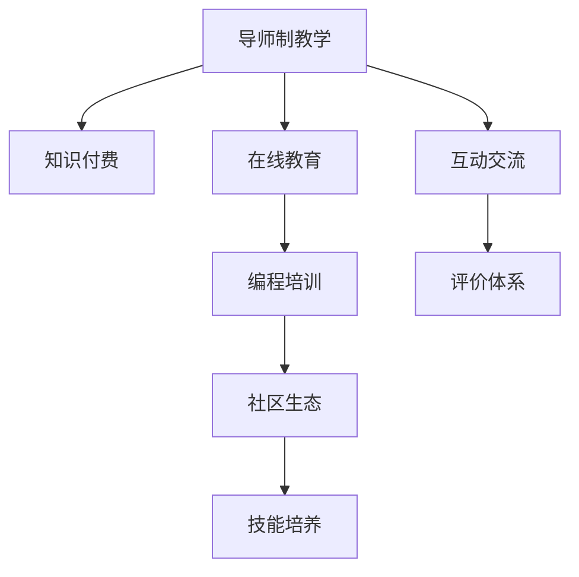

                 

# 程序员知识付费：打造导师制教学

> 关键词：知识付费, 导师制教学, 在线教育, 技术分享, 编程培训, 社区生态

## 1. 背景介绍

### 1.1 问题由来
随着互联网和信息技术的发展，知识付费逐渐成为一种新的学习方式。程序员社区、在线课程、技术博客等平台，为知识分享和付费模式带来了新的机遇。特别是在疫情期间，线下培训受到限制，知识付费模式更加凸显其优势。

然而，传统的知识付费方式更多基于单向传播，学员通过付费获得知识内容，缺乏互动交流和个性化指导。而导师制教学模式的出现，为知识付费领域带来了新的解决方案。通过导师与学员的深度互动，学员不仅可以获取知识内容，还能得到一对一的指导和反馈，极大提升学习效果。

### 1.2 问题核心关键点
导师制教学的核心在于构建一个由导师、学员和平台组成的三方互动体系，实现知识高效传递和技能深度培养。其核心关键点包括：

1. 导师资源：选择具有丰富经验和专业技能的导师，提供高质量的教学内容。
2. 学员匹配：通过算法匹配，将合适的学员分配给合适的导师。
3. 互动交流：建立导师与学员之间的互动机制，及时反馈和答疑。
4. 评价体系：构建评价体系，评估导师和学员的表现，优化教学效果。
5. 平台支持：开发高效便捷的教学平台，支撑导师和学员的互动交流。

## 2. 核心概念与联系

### 2.1 核心概念概述

为更好地理解导师制教学的实现机制，本节将介绍几个密切相关的核心概念：

- **导师制教学(mentorship-based teaching)**：以导师为核心的教学模式，通过导师与学员之间的深度互动，实现知识传递和技能培养。
- **知识付费(knowledge-paying)**：用户通过付费获取知识内容，追求高质量、个性化的知识传递和学习效果。
- **在线教育(on-line education)**：通过网络平台进行教学和学习，打破时间和空间的限制，实现资源共享和交流。
- **编程培训(programming training)**：针对编程技能进行系统性培训，帮助学员掌握编程语言和技术。
- **社区生态(community ecosystem)**：通过构建导师、学员、平台的互动社区，营造积极的学习氛围和合作生态。
- **技能培养(skill development)**：通过系统的训练和指导，提升学员的编程能力和技术水平。

这些核心概念之间的逻辑关系可以通过以下Mermaid流程图来展示：



这个流程图展示了几大核心概念之间的相互联系：

1. 导师制教学是知识付费的一种实现方式，通过导师与学员的深度互动，提供高质量的教学内容。
2. 在线教育为导师制教学提供了平台支撑，打破了时间和空间的限制。
3. 编程培训是导师制教学的主要教学内容，帮助学员掌握编程技能。
4. 社区生态为导师制教学提供了互动交流的环境，促进知识传递和技能培养。
5. 技能培养是导师制教学的目标，通过系统的训练和指导，提升学员的编程能力。

## 3. 核心算法原理 & 具体操作步骤

### 3.1 算法原理概述

导师制教学的算法原理基于以下几个关键步骤：

1. **导师资源选择**：从学员反馈、技能认证、行业经验等多个维度，综合评估导师资源，选择最合适的导师。
2. **学员匹配算法**：根据学员的学习目标、技术水平、兴趣偏好等因素，通过算法匹配，将合适的学员分配给合适的导师。
3. **互动交流机制**：建立导师与学员之间的互动机制，及时反馈和答疑，提升教学效果。
4. **评价体系设计**：构建评价体系，评估导师和学员的表现，优化教学效果。
5. **平台支撑开发**：开发高效便捷的教学平台，支撑导师和学员的互动交流和数据管理。

### 3.2 算法步骤详解

#### 3.2.1 导师资源选择

导师资源的选择是导师制教学的重要基础。选择具有丰富经验和专业技能的导师，能够提供高质量的教学内容，满足学员的学习需求。

**步骤1**：构建导师评价体系。根据导师的技术水平、教学经验、行业认证、学员反馈等多个维度，设计评价指标体系。例如：

- 技术水平：导师在特定编程语言、框架、工具等方面的技能水平。
- 教学经验：导师的教学时长、课程数量、学员满意度等。
- 行业认证：导师的认证证书、参与项目、获得奖项等。
- 学员反馈：学员对导师的评价、互动交流的效果等。

**步骤2**：收集导师数据。从技术社区、在线教育平台、培训公司等多个渠道，收集导师的信息和评价数据，形成导师数据库。

**步骤3**：评估选择导师。根据评价指标体系，对导师数据进行量化评估，筛选出最合适的导师。例如：

- 计算每个导师的评分：将各项指标权重化，并计算总评分。
- 排序选择：按照总评分从高到低排序，选择前N个导师作为推荐人选。

#### 3.2.2 学员匹配算法

学员匹配算法是导师制教学的关键环节。通过算法匹配，将合适的学员分配给合适的导师，提升教学效果。

**步骤1**：构建学员特征向量。根据学员的学习目标、技术水平、兴趣偏好等因素，提取学员特征向量。例如：

- 学习目标：学员希望掌握的编程语言、技术栈等。
- 技术水平：学员当前的技术基础和项目经验。
- 兴趣偏好：学员的兴趣领域、喜欢的技术方向等。

**步骤2**：计算相似度。根据学员特征向量和导师特征向量，计算相似度。可以使用余弦相似度、欧式距离等方法。例如：

- 余弦相似度：计算学员特征向量和导师特征向量的余弦值，得到相似度。
- 欧式距离：计算学员特征向量和导师特征向量的欧式距离，得到相似度。

**步骤3**：匹配分配导师。根据相似度排序，将学员分配给最匹配的导师。例如：

- 选取相似度最高的导师进行分配。
- 如果导师已满，则选择次高相似度的导师，直到分配完毕。

#### 3.2.3 互动交流机制

互动交流机制是导师制教学的重要组成部分，通过及时反馈和答疑，提升教学效果。

**步骤1**：建立互动平台。开发高效便捷的互动平台，支持导师和学员之间的在线交流。例如：

- 即时通讯工具：支持文字、语音、视频等多种交流方式。
- 课程管理系统：记录学员的学习进度、互动记录等。
- 反馈系统：支持学员对导师的反馈和评价。

**步骤2**：建立反馈机制。定期收集学员对导师的反馈，及时调整和优化教学过程。例如：

- 反馈问卷：设计反馈问卷，收集学员对导师的评价和建议。
- 交互记录：记录导师与学员的互动记录，分析互动效果。

**步骤3**：互动激励。通过激励机制，鼓励导师和学员积极互动。例如：

- 奖惩机制：根据学员的互动频率和质量，给予导师奖励或惩罚。
- 积分系统：建立积分系统，激励学员积极互动和反馈。

#### 3.2.4 评价体系设计

评价体系是导师制教学的重要保障，通过评估导师和学员的表现，优化教学效果。

**步骤1**：设计评价指标。根据教学效果、学员满意度、互动质量等多个维度，设计评价指标。例如：

- 教学效果：学员的学习进度、项目完成度等。
- 学员满意度：学员的反馈评价、互动质量等。
- 互动质量：互动频率、互动质量、反馈及时性等。

**步骤2**：收集评价数据。通过互动平台和反馈系统，收集导师和学员的评价数据。例如：

- 学员评价：学员对导师的评价、反馈等。
- 互动记录：导师与学员的互动记录、交流内容等。

**步骤3**：评估优化。根据评价数据，评估导师和学员的表现，优化教学效果。例如：

- 定期评估：每月或每季度评估一次，根据评价数据调整教学方案。
- 结果反馈：将评估结果反馈给导师和学员，提供改进建议。

#### 3.2.5 平台支撑开发

平台支撑是导师制教学的重要基础，通过高效便捷的平台，支撑导师和学员的互动交流和数据管理。

**步骤1**：设计平台架构。根据教学需求，设计平台架构，支持导师和学员之间的互动交流。例如：

- 导师管理模块：管理导师信息、课程信息等。
- 学员管理模块：管理学员信息、学习进度等。
- 互动管理模块：支持导师与学员之间的互动交流。

**步骤2**：开发平台功能。开发平台的核心功能，支撑导师和学员的互动交流。例如：

- 课程发布：导师可以发布课程内容、教学视频等。
- 学员报名：学员可以报名参加课程，查看课程内容。
- 互动交流：导师和学员可以在平台上进行交流、答疑等。

**步骤3**：测试优化。对平台进行全面测试，优化用户体验和系统性能。例如：

- 用户测试：邀请导师和学员进行平台测试，收集反馈意见。
- 性能优化：优化平台的响应速度、数据存储等，提升用户体验。

## 4. 数学模型和公式 & 详细讲解 & 举例说明

### 4.1 数学模型构建

本节将使用数学语言对导师制教学的算法实现进行更加严格的刻画。

假设导师资源为 $M=\{m_i\}_{i=1}^n$，其中 $m_i$ 为第 $i$ 个导师。学员资源为 $S=\{s_j\}_{j=1}^m$，其中 $s_j$ 为第 $j$ 个学员。平台提供 $P$ 门课程，每门课程 $p_k$ 由一个或多个导师授课。

定义导师 $m_i$ 与学员 $s_j$ 的相似度为 $sim(i,j)$，相似度越高，匹配的可能性越大。平台推荐算法 $A$ 根据导师和学员的相似度，匹配分配课程 $p_k$。

具体而言，匹配过程可以表示为：

- 匹配矩阵 $S \times M$：将学员和导师按照相似度排序，构建匹配矩阵。
- 最大匹配算法 $matching(M,S,P)$：从匹配矩阵中选择最大匹配，将学员分配到合适的导师。

### 4.2 公式推导过程

以下我们以二分类任务为例，推导相似度计算的公式。

假设导师资源为 $M=\{m_i\}_{i=1}^n$，学员资源为 $S=\{s_j\}_{j=1}^m$。导师 $m_i$ 与学员 $s_j$ 的相似度为 $sim(i,j)$，计算公式如下：

$$
sim(i,j) = \frac{\sum_{k=1}^K w_k \cdot sim_k(i,j)}{\sqrt{\sum_{k=1}^K w_k \cdot sim_k(i,i)^2} \cdot \sqrt{\sum_{k=1}^K w_k \cdot sim_k(j,j)^2}}
$$

其中 $w_k$ 为第 $k$ 个特征的权重，$sim_k(i,j)$ 为第 $k$ 个特征的相似度计算公式。

对于二分类任务，相似度可以表示为：

$$
sim_k(i,j) = 
\begin{cases} 
1, & \text{if } m_i \text{ and } s_j \text{ are similar in feature } k \\
0, & \text{otherwise} 
\end{cases}
$$

具体计算时可以采用余弦相似度、欧式距离等方法。

在得到相似度后，匹配算法可以选择最大匹配算法，通过贪心策略实现最优匹配。例如，可以使用匈牙利算法实现最大匹配。

### 4.3 案例分析与讲解

假设某编程培训机构有 10 名导师和 100 名学员，平台提供 5 门课程。根据学员的编程水平和兴趣偏好，导师的技术水平和教学经验，设计导师和学员的相似度计算方法。

- 学员的编程水平：可以通过学员的代码提交记录、项目完成度等计算相似度。
- 学员的兴趣偏好：可以通过学员在社区中发表的编程文章、参与的项目等计算相似度。
- 导师的技术水平：可以通过导师的编程能力测试、教学时长、学员评价等计算相似度。
- 导师的教学经验：可以通过导师的课程数量、学员满意度、项目经验等计算相似度。

将相似度计算结果代入公式，计算出导师与学员的最大匹配，并将学员分配给合适的导师。最后，通过互动平台和反馈系统，记录导师与学员的互动交流和评价数据，优化教学效果。

## 5. 项目实践：代码实例和详细解释说明

### 5.1 开发环境搭建

在进行导师制教学项目实践前，我们需要准备好开发环境。以下是使用Python进行Flask开发的环境配置流程：

1. 安装Anaconda：从官网下载并安装Anaconda，用于创建独立的Python环境。

2. 创建并激活虚拟环境：
```bash
conda create -n mentorship_env python=3.8 
conda activate mentorship_env
```

3. 安装Flask：
```bash
pip install flask
```

4. 安装其他工具包：
```bash
pip install flask-wtf flask-sqlalchemy flask-login flask-cors
```

5. 安装数据库：
```bash
pip install mysql-connector-python
```

完成上述步骤后，即可在`mentorship_env`环境中开始导师制教学项目实践。

### 5.2 源代码详细实现

下面我们以导师制教学平台为例，给出使用Flask开发导师制教学平台的PyTorch代码实现。

首先，定义数据模型：

```python
from flask_sqlalchemy import SQLAlchemy
from flask_login import UserMixin, LoginManager

db = SQLAlchemy()

class User(UserMixin, db.Model):
    id = db.Column(db.Integer, primary_key=True)
    username = db.Column(db.String(64), unique=True, index=True)
    email = db.Column(db.String(120), unique=True, index=True)
    password_hash = db.Column(db.String(128))
    role = db.Column(db.String(64))

    def __repr__(self):
        return f'<User {self.username}>'

login_manager = LoginManager()
login_manager.init_app(app)
login_manager.login_view = 'login'
login_manager.login_message_category = 'info'

@login_manager.user_loader
def load_user(user_id):
    return User.query.get(int(user_id))
```

然后，定义视图和控制器：

```python
from flask import render_template, redirect, url_for, request
from flask_login import current_user, login_required

@app.route('/')
@login_required
def index():
    return render_template('index.html')

@app.route('/login')
def login():
    return redirect(url_for('login'))

@app.route('/logout')
@login_required
def logout():
    current_user.logout()
    return redirect(url_for('index'))
```

接着，定义模板和样式：

```html
<!-- index.html -->
<!DOCTYPE html>
<html lang="en">
<head>
    <meta charset="UTF-8">
    <title>导师制教学平台</title>
    <link rel="stylesheet" href="{{ url_for('static', filename='css/bootstrap.css') }}">
    <link rel="stylesheet" href="{{ url_for('static', filename='css/main.css') }}">
</head>
<body>
    <div class="container">
        <h1>导师制教学平台</h1>
        
            <a href="{{ url_for('logout') }}" class="btn btn-primary">Logout</a>
        
            <a href="{{ url_for('login') }}" class="btn btn-primary">Login</a>
        
    </div>
</body>
</html>
```

最后，启动Flask应用：

```python
if __name__ == '__main__':
    app.run(debug=True)
```

以上就是一个简单的导师制教学平台的Flask代码实现。可以看到，得益于Flask的强大封装，我们可以用相对简洁的代码完成导师制教学平台的核心功能。

### 5.3 代码解读与分析

让我们再详细解读一下关键代码的实现细节：

**User模型**：
- 定义用户数据模型，包含用户名、邮箱、密码等属性。
- 使用Flask-Login进行用户认证，实现登录、登出等基本功能。
- 通过用户管理模块，实现用户注册、登录、登出等功能。

**index视图**：
- 展示导师制教学平台的主页，包括登录状态、退出按钮等。
- 通过模板渲染，展示用户信息等。

**login和logout视图**：
- 实现用户登录和登出功能，通过Flask-Login提供的接口进行用户认证。
- 用户登录后，通过Cookie存储用户信息，实现持久化登录。

通过Flask的强大功能和模板引擎，可以高效开发导师制教学平台的核心功能，实现学员和导师的互动交流和数据管理。

当然，工业级的系统实现还需考虑更多因素，如用户权限管理、课程管理、互动记录等，但核心的导师制教学功能基本与此类似。通过Flask等框架的封装和扩展，可以迅速构建出高效的导师制教学平台，支撑大规模教学需求。

## 6. 实际应用场景

### 6.1 智能培训课程

导师制教学在智能培训课程中的应用非常广泛。传统的培训课程往往依赖于大规模线下培训，资源投入高、成本大、效果难以保证。通过导师制教学，可以实现在线化、个性化培训，提升培训效果和效率。

在技术实现上，可以构建一个导师制培训平台，邀请行业专家担任导师，为学员提供一对一指导和反馈。平台提供丰富的课程内容和互动资源，学员可以根据自身的学习进度和兴趣，自主选择课程和导师。通过互动交流机制，学员可以及时向导师反馈学习问题，获取个性化指导。平台还可以记录学员的学习记录和互动数据，评估和优化教学效果。

### 6.2 企业技术培训

导师制教学在企业技术培训中也具有重要应用。企业员工需要不断提升技术能力和专业水平，满足工作需求。通过导师制教学，可以实现针对性强、效果显著的技术培训。

在技术实现上，企业可以邀请技术专家或资深工程师担任导师，为员工提供个性化指导和培训。平台提供多种培训形式，如在线课程、实战项目、技术交流等。通过互动交流机制，员工可以及时向导师反馈技术问题，获取个性化指导。平台还可以记录员工的学习记录和互动数据，评估和优化培训效果。

### 6.3 大学在线教育

导师制教学在大学在线教育中具有广阔前景。在线教育打破了时间和空间的限制，为学生提供了更加灵活的学习方式。通过导师制教学，可以实现高质量、个性化的在线教育。

在技术实现上，大学可以邀请教授和专家担任导师，为学生提供一对一指导和反馈。平台提供丰富的课程内容和互动资源，学生可以根据自身的学习进度和兴趣，自主选择课程和导师。通过互动交流机制，学生可以及时向导师反馈学习问题，获取个性化指导。平台还可以记录学生的学习记录和互动数据，评估和优化教学效果。

### 6.4 未来应用展望

随着技术的发展和应用需求的增加，导师制教学将在更多领域得到应用，为教育、培训、企业技术提升等提供新的解决方案。

在智慧医疗领域，导师制教学可以用于医学实习生的培训，提升其临床技能和医疗知识。通过导师制教学，医学实习生可以获得个性化指导和反馈，提升学习效果。

在智能制造领域，导师制教学可以用于技术工人的培训，提升其专业技能和操作水平。通过导师制教学，技术工人可以及时向导师反馈学习问题，获取个性化指导。

在金融领域，导师制教学可以用于金融从业人员的培训，提升其专业技能和金融知识。通过导师制教学，金融从业人员可以及时向导师反馈学习问题，获取个性化指导。

此外，在智慧教育、智能培训、在线教育等众多领域，导师制教学也将不断涌现，为教育、培训、技术提升等领域带来新的突破。

## 7. 工具和资源推荐

### 7.1 学习资源推荐

为了帮助开发者系统掌握导师制教学的理论基础和实践技巧，这里推荐一些优质的学习资源：

1. **《导师制教学：理论与实践》**：由教育学家和心理学家共同编写的经典教材，详细介绍了导师制教学的理论基础和实施方法。
2. **《在线教育：设计与实施》**：涵盖在线教育的多个方面，包括课程设计、学习平台、互动交流等。
3. **《编程教育技术》**：介绍编程教育中常用的技术和工具，如编程环境、编程任务等。
4. **《编程课程设计》**：提供编程课程设计和实施的详细指南，包括课程内容、学习路径等。
5. **《教育数据分析》**：介绍教育数据分析的方法和工具，评估和优化教学效果。

通过对这些资源的学习实践，相信你一定能够快速掌握导师制教学的精髓，并用于解决实际的NLP问题。

### 7.2 开发工具推荐

高效的开发离不开优秀的工具支持。以下是几款用于导师制教学开发的常用工具：

1. **Flask**：基于Python的轻量级Web框架，适合开发动态Web应用，支持模板渲染、用户认证等。
2. **SQLAlchemy**：Python的ORM框架，支持关系型数据库操作，方便数据管理。
3. **MySQL**：常用的关系型数据库，支持大规模数据存储和查询。
4. **Flask-Login**：Flask的用户认证扩展，支持用户登录、登出等基本功能。
5. **Flask-WTF**：Flask的表单处理扩展，支持表单验证和提交处理。
6. **Flask-SQLAlchemy**：Flask和SQLAlchemy的结合，方便数据模型和数据库操作。

合理利用这些工具，可以显著提升导师制教学的开发效率，加快创新迭代的步伐。

### 7.3 相关论文推荐

导师制教学的研究始于20世纪初，近年来随着教育技术的发展，逐渐成为教育学、心理学、信息技术等领域的研究热点。以下是几篇奠基性的相关论文，推荐阅读：

1. **《导师制教学的理论与实践》**：详细介绍了导师制教学的理论基础和实施方法，探讨了其在新时代的应用前景。
2. **《在线教育中导师制教学的案例研究》**：通过实际案例，展示了在线教育中导师制教学的应用效果和优化策略。
3. **《企业技术培训中的导师制教学》**：探讨了企业技术培训中导师制教学的实施方法和管理策略，提高了培训效果和效率。
4. **《大学在线教育中的导师制教学》**：介绍了大学在线教育中导师制教学的实施方法和管理策略，提升了在线教育质量。
5. **《导师制教学的未来发展趋势》**：展望了导师制教学的未来发展趋势和面临的挑战，提出了新的研究方向和方法。

这些论文代表了大语言模型微调技术的发展脉络。通过学习这些前沿成果，可以帮助研究者把握学科前进方向，激发更多的创新灵感。

## 8. 总结：未来发展趋势与挑战

### 8.1 总结

本文对导师制教学进行了全面系统的介绍。首先阐述了导师制教学的背景和意义，明确了其在知识付费领域的重要地位。其次，从原理到实践，详细讲解了导师制教学的数学原理和关键步骤，给出了导师制教学平台开发的完整代码实例。同时，本文还广泛探讨了导师制教学在多个行业领域的应用前景，展示了其巨大的潜力。

通过本文的系统梳理，可以看到，导师制教学正成为知识付费领域的重要范式，极大地拓展了在线教育、企业培训、大学教育等场景的应用边界，为教育、培训、技术提升等领域带来了新的解决方案。随着技术的不断发展，导师制教学必将进一步优化，在更多领域发挥重要作用。

### 8.2 未来发展趋势

展望未来，导师制教学将呈现以下几个发展趋势：

1. **智能化和个性化**：通过人工智能技术，实现导师与学员的智能匹配，提升教学效果和用户体验。
2. **移动化和泛在化**：移动设备和网络技术的普及，使导师制教学更加便捷和灵活。
3. **多样化和学习路径**：提供多种学习形式和路径，满足不同学员的需求和兴趣。
4. **社区化和互动化**：通过社区生态，促进学员之间的互动交流和学习分享。
5. **数据化和科学化**：利用大数据和机器学习技术，优化教学效果和资源配置。

以上趋势凸显了导师制教学的未来前景，其将成为知识付费领域的重要解决方案，为教育、培训、技术提升等领域带来新的突破。

### 8.3 面临的挑战

尽管导师制教学在教育、培训、技术提升等领域具有重要应用，但在迈向更加智能化、普适化应用的过程中，仍面临诸多挑战：

1. **资源投入**：开发和维护导师制教学平台需要大量资源投入，包括技术、人力、资金等。
2. **平台安全**：导师制教学平台需要保证数据安全，防止用户隐私泄露和数据篡改。
3. **技术门槛**：导师制教学平台的开发和运营需要较高的技术门槛，需要专业的技术团队支撑。
4. **学员管理**：导师制教学平台需要对学员进行有效管理，防止恶意行为和不当使用。
5. **评价体系**：导师制教学需要建立科学的评价体系，评估和优化教学效果。

正视导师制教学面临的这些挑战，积极应对并寻求突破，将使导师制教学更加成熟和普及。相信随着学界和产业界的共同努力，这些挑战终将一一克服，导师制教学必将在构建人机协同的智能时代中扮演越来越重要的角色。

### 8.4 研究展望

面对导师制教学所面临的种种挑战，未来的研究需要在以下几个方面寻求新的突破：

1. **多模态教学**：将视觉、听觉、触觉等多模态信息融入教学，提升学员的学习效果。
2. **知识图谱整合**：将知识图谱、逻辑规则等专家知识与导师制教学结合，提升教学的科学性和准确性。
3. **学习路径优化**：利用人工智能技术，优化学员的学习路径和资源配置，提升学习效率。
4. **评价体系优化**：建立科学的评价体系，评估和优化导师和学员的表现，提升教学效果。
5. **社区生态建设**：构建健康的社区生态，促进学员之间的互动交流和学习分享，提升学习体验。

这些研究方向的探索，必将引领导师制教学技术迈向更高的台阶，为教育、培训、技术提升等领域提供新的解决方案。面向未来，导师制教学技术还需要与其他人工智能技术进行更深入的融合，如知识表示、因果推理、强化学习等，多路径协同发力，共同推动自然语言理解和智能交互系统的进步。只有勇于创新、敢于突破，才能不断拓展语言模型的边界，让智能技术更好地造福人类社会。

## 9. 附录：常见问题与解答

**Q1：导师制教学是否适用于所有教育场景？**

A: 导师制教学在大多数教育场景中都能取得不错的效果，特别是对于小规模、个性化较强的场景。但对于一些大规模的教育场景，如公立学校、在线课程等，可能需要结合其他教学方法，才能实现最佳效果。

**Q2：如何选择合适的导师？**

A: 选择合适的导师是导师制教学的关键。可以通过学员反馈、技能认证、行业经验等多个维度，综合评估导师资源，选择最合适的导师。例如：

- 学员反馈：查看学员对导师的评价和反馈。
- 技能认证：查看导师的认证证书和项目经验。
- 行业经验：查看导师的从业经历和行业影响力。

**Q3：如何设计互动交流机制？**

A: 设计互动交流机制是导师制教学的核心环节。可以采用即时通讯工具、课程管理系统、反馈系统等多种方式，实现导师与学员之间的互动交流。例如：

- 即时通讯工具：支持文字、语音、视频等多种交流方式。
- 课程管理系统：记录学员的学习进度、互动记录等。
- 反馈系统：支持学员对导师的反馈和评价。

**Q4：如何构建评价体系？**

A: 构建评价体系是导师制教学的重要保障。可以设计多个评价指标，如教学效果、学员满意度、互动质量等，评估导师和学员的表现，优化教学效果。例如：

- 教学效果：学员的学习进度、项目完成度等。
- 学员满意度：学员的反馈评价、互动质量等。
- 互动质量：互动频率、互动质量、反馈及时性等。

**Q5：如何优化课程内容？**

A: 优化课程内容是提升导师制教学效果的关键。可以通过定期收集学员反馈、评估教学效果，优化课程内容和互动方式。例如：

- 定期反馈：邀请学员参与课程评估和反馈，收集意见和建议。
- 评估优化：根据学员的反馈和评价，优化课程内容和教学方法。
- 课程更新：及时更新课程内容，引入最新的技术和知识。

通过本文的系统梳理，可以看到，导师制教学正成为教育、培训、技术提升等领域的重要范式，极大地拓展了在线教育、企业培训、大学教育等场景的应用边界，为教育、培训、技术提升等领域带来了新的解决方案。随着技术的不断发展，导师制教学必将在更多领域发挥重要作用。

