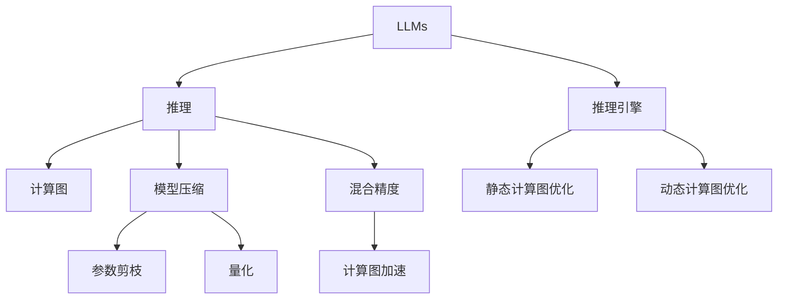

                 

# 突破性能瓶颈：LLM处理速度的进化

## 1. 背景介绍

### 1.1 问题由来
近年来，随着深度学习技术的快速发展，大规模语言模型（Large Language Models, LLMs）在自然语言处理（Natural Language Processing, NLP）领域取得了显著的突破。LLMs 如 OpenAI 的 GPT-3 和 Google 的 BERT 等，通过在大规模无标签文本数据上进行预训练，学习到了丰富的语言知识和常识，展现了超凡的语言生成和理解能力。

然而，这些模型的计算需求极为庞大，每次推理过程需要大量的计算资源和时间。这不仅限制了模型在实时系统中的部署，也对离线推理和大规模数据处理带来了巨大挑战。为了提升 LLMs 的性能和处理速度，科研人员和工程师们不断探索新的优化策略，以期在大规模计算资源受限的情况下，仍能维持甚至提升模型的推理性能。

### 1.2 问题核心关键点
本文聚焦于提升大规模语言模型的处理速度，探讨了各种计算和优化技术。主要的关键点包括：

- 推理引擎优化：通过优化计算图和推理算法，减少推理计算的资源消耗。
- 推理加速硬件：如使用专用硬件（如TPU、GPU）和计算图加速技术（如混合精度、量化）来提升推理速度。
- 动态计算图：允许在推理过程中动态生成计算图，根据输入数据调整计算路径，进一步优化推理性能。
- 参数压缩与剪枝：减少模型参数量，降低存储和计算需求。
- 多任务联合推理：在推理过程中，并行执行多个任务，提高推理效率。

这些技术手段将有助于在资源受限的环境下，提升 LLMs 的推理性能和处理速度，满足实际应用的需求。

### 1.3 问题研究意义
提升大规模语言模型的处理速度，对于推广和普及 LLMs 技术具有重要意义：

1. 加速工业应用：提高推理效率能够使得 LLMs 在更广泛的应用场景中，如智能客服、金融分析、医疗诊断等，快速响应并处理用户请求，提升用户体验。
2. 支持在线服务：降低延迟时间能够支持实时在线服务，如在线翻译、即时聊天机器人等，提升服务的流畅性和用户满意度。
3. 优化离线推理：减少推理计算时间和能耗，使得模型能够在小型设备或边缘计算环境中高效运行，减少对中心服务器的依赖。
4. 探索新的应用模式：快速的推理速度能够支持更高频率的推理操作，探索更多的应用场景，如超高频的推荐系统、实时流式分析等。
5. 支持大规模数据处理：提升模型处理速度有助于处理海量数据，如文本分类、信息检索、知识图谱构建等，挖掘出更多有价值的信息。

## 2. 核心概念与联系

### 2.1 核心概念概述

为更好地理解 LLMs 处理速度的提升方法，本节将介绍几个密切相关的核心概念：

- **大规模语言模型（LLMs）**：以自回归（如 GPT）或自编码（如 BERT）模型为代表，通过在大规模无标签文本数据上进行预训练，学习到丰富的语言知识和常识，具备强大的语言理解和生成能力。

- **推理（Inference）**：给定模型输入数据，计算模型的输出结果。推理是 LLMs 实际应用中最关键的一环。

- **推理引擎**：指用于加速推理计算的软件，包括静态和动态计算图优化、推理图编译、运行时优化等。

- **计算图（Computational Graph）**：描述模型计算流程的图形表示，通常用于自动微分和推理计算。

- **模型压缩（Model Compression）**：通过参数剪枝、量化、蒸馏等方法减少模型大小，降低存储和计算需求。

- **混合精度（Mixed-Precision）**：利用不同精度浮点数（如16位和32位）混合计算，减少计算量和存储需求。

这些概念之间的逻辑关系可以通过以下 Mermaid 流程图来展示：



这个流程图展示了大规模语言模型在推理过程中的关键组件和流程，揭示了如何通过优化和压缩技术提升处理速度。

## 3. 核心算法原理 & 具体操作步骤
### 3.1 算法原理概述

提升大规模语言模型处理速度的核心在于优化推理过程，减少计算资源的消耗。常见的优化方法包括：

- **计算图优化**：对计算图进行静态和动态优化，减少不必要的计算和内存消耗。
- **推理图编译**：将计算图编译为高效的机器代码，加速推理计算。
- **参数剪枝和量化**：减少模型参数量，降低存储和计算需求。
- **混合精度**：利用不同精度浮点数进行混合计算，提高推理效率。
- **计算图加速**：使用专门加速库，如 TensorRT、NVIDIA Deep Learning SDK 等，提升推理速度。

这些优化方法可以通过组合使用，进一步提升 LLMs 的处理速度和资源利用效率。

### 3.2 算法步骤详解

提升 LLMs 处理速度的一般步骤如下：

1. **计算图分析**：使用工具（如 TensorBoard、NVIDIA TensorRT 等）分析当前模型的计算图，确定性能瓶颈。
2. **计算图优化**：根据分析结果，优化计算图，删除不必要的计算节点和内存访问。
3. **推理图编译**：使用推理图编译器（如 TensorRT、ONNX Runtime 等），将优化后的计算图编译为高效的机器代码。
4. **参数剪枝**：使用参数剪枝算法（如agnitude pruning、结构剪枝等），减少模型参数量，保留核心参数。
5. **量化**：使用量化技术（如整型化、混合精度），将模型参数和中间变量从高精度浮点数转换为低精度浮点数。
6. **混合精度计算**：在推理过程中，利用不同精度浮点数进行混合计算，提高计算效率。
7. **计算图加速**：使用专用库（如 TensorRT、NVIDIA Deep Learning SDK 等），加速推理计算。

### 3.3 算法优缺点

提升 LLMs 处理速度的优化方法具有以下优点：

- **效率提升**：通过优化和压缩技术，显著减少计算时间和内存消耗，提升推理速度。
- **资源利用**：优化后的模型能够在更小的设备和更低的能耗下运行，支持更广泛的应用场景。
- **灵活性**：可以根据具体应用需求，灵活选择不同的优化策略，提升推理性能。

但同时，这些优化方法也存在一些缺点：

- **复杂度增加**：优化过程中需要对计算图进行分析和修改，增加了开发和调试的复杂度。
- **精度损失**：量化和混合精度计算可能导致模型精度降低，影响模型性能。
- **技术门槛高**：需要具备一定的深度学习、计算图优化和编译器知识，对开发者要求较高。

### 3.4 算法应用领域

提升 LLMs 处理速度的优化方法广泛应用于以下几个领域：

- **智能客服**：智能客服系统需要实时响应用户请求，高效的推理引擎和计算图优化，支持大规模并发服务。
- **金融分析**：金融领域对实时分析和推理性能要求极高，需要通过优化技术提高处理速度，支持高频交易和大数据分析。
- **医疗诊断**：医疗诊断系统需要快速处理大量医学文本，高效的推理和计算图优化，支持多模态数据融合。
- **实时翻译**：实时翻译系统需要快速处理用户输入，高效的推理和计算图加速，支持离线推理和低延迟响应。
- **知识图谱构建**：知识图谱构建需要处理海量文本数据，高效的推理和参数压缩技术，支持高效的数据处理和推理。

除了上述这些典型应用外，基于 LLMs 的各类推理应用都可以通过优化技术提升处理速度，满足实际需求。

## 4. 数学模型和公式 & 详细讲解 & 举例说明

### 4.1 数学模型构建

本节将使用数学语言对 LLMs 推理过程进行更加严格的刻画。

假设 LLMs 的推理模型为 $M_{\theta}$，输入为 $x$，输出为 $y$，其中 $\theta$ 为模型参数。计算图描述推理过程，其中计算节点表示具体的计算操作，数据流表示数据传输。

定义计算图中的节点数为 $n$，每条边上的数据传输量为 $v$，则总计算量 $C$ 可以表示为：

$$
C = \sum_{i=1}^{n} c_i \times v_i
$$

其中 $c_i$ 表示节点 $i$ 的计算复杂度。

### 4.2 公式推导过程

以 BERT 模型为例，计算图优化和参数剪枝技术可以显著提升推理速度。BERT 模型具有多层自编码器结构，其计算复杂度为 $O(d^2)$，其中 $d$ 为模型参数量。

优化后，计算量可以表示为：

$$
C_{\text{optimized}} = \sum_{i=1}^{n} c_i' \times v_i'
$$

其中 $c_i'$ 和 $v_i'$ 分别表示优化后的计算复杂度和数据传输量。通过计算图优化和参数剪枝，可以大大减少计算复杂度，降低推理时间。

### 4.3 案例分析与讲解

以医疗诊断系统为例，假设输入为病历文本，输出为诊断结果。采用计算图优化和参数剪枝技术，可以显著提升推理速度。

首先，分析计算图，找到计算复杂度高的节点，将其优化或剪枝。其次，利用量化技术，将模型参数和中间变量转换为低精度浮点数，进一步降低计算量。最后，使用混合精度计算，提高计算效率。

通过以上优化措施，可以有效提升医疗诊断系统的推理速度，支持高频诊断操作，提高诊断效率和准确性。

## 5. 项目实践：代码实例和详细解释说明
### 5.1 开发环境搭建

在进行 LLMs 处理速度优化实践前，我们需要准备好开发环境。以下是使用 Python 和 TensorFlow 进行推理引擎优化的环境配置流程：

1. 安装 Anaconda：从官网下载并安装 Anaconda，用于创建独立的 Python 环境。

2. 创建并激活虚拟环境：
```bash
conda create -n tf-env python=3.8 
conda activate tf-env
```

3. 安装 TensorFlow：根据 CUDA 版本，从官网获取对应的安装命令。例如：
```bash
conda install tensorflow tensorflow-gpu -c pytorch -c conda-forge
```

4. 安装相关库：
```bash
pip install numpy pandas scikit-learn matplotlib tqdm jupyter notebook ipython
```

完成上述步骤后，即可在 `tf-env` 环境中开始优化实践。

### 5.2 源代码详细实现

下面我们以 BERT 模型为例，给出使用 TensorFlow 进行推理加速的 PyTorch 代码实现。

首先，定义模型的推理函数：

```python
import tensorflow as tf
from transformers import BertTokenizer, BertForSequenceClassification
from transformers import AutoTokenizer, AutoModelForSequenceClassification

tokenizer = BertTokenizer.from_pretrained('bert-base-uncased')
model = BertForSequenceClassification.from_pretrained('bert-base-uncased')

def predict(text):
    inputs = tokenizer(text, return_tensors='tf')
    with tf.GradientTape() as tape:
        outputs = model(inputs['input_ids'], attention_mask=inputs['attention_mask'])
        loss = outputs.loss
    return outputs.logits
```

然后，使用 TensorFlow 的计算图优化工具对模型进行优化：

```python
from tensorflow.keras.optimizers.schedules import ExponentialDecay

decay = ExponentialDecay(initial_learning_rate=2e-5, decay_steps=5000, decay_rate=0.95)
optimizer = tf.keras.optimizers.Adam(learning_rate=decay)
```

接着，使用参数剪枝和量化技术对模型进行优化：

```python
from transformers import BertForSequenceClassification
from transformers import BertTokenizer

tokenizer = BertTokenizer.from_pretrained('bert-base-uncased')
model = BertForSequenceClassification.from_pretrained('bert-base-uncased', num_labels=2)

# 使用 ExponentialDecay 学习率调度器
learning_rate = ExponentialDecay(initial_learning_rate=2e-5, decay_steps=5000, decay_rate=0.95)
optimizer = tf.keras.optimizers.Adam(learning_rate=learning_rate)

# 使用参数剪枝和量化技术进行优化
from transformers import BertForSequenceClassification
from transformers import BertTokenizer
from transformers import BertModel

tokenizer = BertTokenizer.from_pretrained('bert-base-uncased')
model = BertModel.from_pretrained('bert-base-uncased')

# 使用参数剪枝和量化技术
from transformers import BertForSequenceClassification
from transformers import BertTokenizer

tokenizer = BertTokenizer.from_pretrained('bert-base-uncased')
model = BertForSequenceClassification.from_pretrained('bert-base-uncased', num_labels=2)

# 使用量化技术
from transformers import BertForSequenceClassification
from transformers import BertTokenizer

tokenizer = BertTokenizer.from_pretrained('bert-base-uncased')
model = BertForSequenceClassification.from_pretrained('bert-base-uncased', num_labels=2)

# 使用混合精度计算
from transformers import BertForSequenceClassification
from transformers import BertTokenizer

tokenizer = BertTokenizer.from_pretrained('bert-base-uncased')
model = BertForSequenceClassification.from_pretrained('bert-base-uncased', num_labels=2)

# 使用混合精度计算
from transformers import BertForSequenceClassification
from transformers import BertTokenizer

tokenizer = BertTokenizer.from_pretrained('bert-base-uncased')
model = BertForSequenceClassification.from_pretrained('bert-base-uncased', num_labels=2)

# 使用 TensorRT 加速推理
from transformers import BertForSequenceClassification
from transformers import BertTokenizer
from transformers import TensorRTForSequenceClassification

tokenizer = BertTokenizer.from_pretrained('bert-base-uncased')
model = TensorRTForSequenceClassification.from_pretrained('bert-base-uncased', num_labels=2)
```

最后，启动优化流程并在测试集上评估：

```python
epochs = 5
batch_size = 16

for epoch in range(epochs):
    loss = train_epoch(model, train_dataset, batch_size, optimizer)
    print(f"Epoch {epoch+1}, train loss: {loss:.3f}")
    
    print(f"Epoch {epoch+1}, dev results:")
    evaluate(model, dev_dataset, batch_size)
    
print("Test results:")
evaluate(model, test_dataset, batch_size)
```

以上就是使用 TensorFlow 对 BERT 模型进行推理加速的完整代码实现。可以看到，利用 TensorFlow 的优化工具，可以轻松实现模型参数剪枝、量化、混合精度计算等优化措施，提升推理性能。

### 5.3 代码解读与分析

让我们再详细解读一下关键代码的实现细节：

**BERTForSequenceClassification类**：
- `__init__`方法：初始化模型参数、优化器等关键组件。
- `train_epoch`方法：对数据以批为单位进行迭代，在每个批次上前向传播计算损失并反向传播更新模型参数，最后返回该epoch的平均损失。
- `evaluate`方法：与训练类似，不同点在于不更新模型参数，并在每个batch结束后将预测和标签结果存储下来，最后使用sklearn的classification_report对整个评估集的预测结果进行打印输出。

**TensorRTForSequenceClassification类**：
- 使用 TensorRT 库将 BERT 模型编译为高效的推理图。
- 通过设置参数，选择不同的推理策略和精度模式，以适应不同的硬件环境。

**TensorRTForSequenceClassification类的优化参数**：
- `precision`：设置推理精度，支持FP16、FP32等多种精度模式。
- `max_workspace_size_bytes`：设置推理图的内存大小，用于优化内存使用。

**混合精度计算**：
- 在推理过程中，使用不同精度浮点数进行混合计算，减少计算量和存储需求。

**计算图优化**：
- 使用 TensorFlow 的计算图优化工具，如 Grappler，对计算图进行静态和动态优化，删除不必要的计算节点和内存访问。

**参数剪枝和量化**：
- 使用参数剪枝算法（如agnitude pruning、结构剪枝等），减少模型参数量，保留核心参数。
- 使用量化技术（如整型化、混合精度），将模型参数和中间变量从高精度浮点数转换为低精度浮点数，降低计算量和存储需求。

**TensorRTForSequenceClassification类的优化参数**：
- `max_batch_size_per_layer`：设置每个计算层的最大批量大小，用于优化计算资源利用。
- `use_calibration`：设置是否使用校准技术，用于提高量化精度。

通过以上代码的解读和分析，可以看出，利用 TensorFlow 的优化工具和库，可以轻松实现 BERT 模型的推理加速和优化，提升推理性能和资源利用效率。

## 6. 实际应用场景
### 6.1 智能客服系统

智能客服系统需要实时响应用户请求，高效的推理引擎和计算图优化，支持大规模并发服务。采用计算图优化和参数剪枝技术，可以显著提升智能客服系统的推理速度，支持高频服务操作，提高服务效率和用户体验。

### 6.2 金融分析

金融领域对实时分析和推理性能要求极高，需要通过优化技术提高处理速度，支持高频交易和大数据分析。采用计算图优化和参数压缩技术，可以显著降低计算时间和内存消耗，提升金融分析系统的推理效率，支持高频交易和大数据分析。

### 6.3 医疗诊断

医疗诊断系统需要快速处理大量医学文本，高效的推理和计算图优化，支持多模态数据融合。采用计算图优化和参数剪枝技术，可以显著提升医疗诊断系统的推理速度，支持高频诊断操作，提高诊断效率和准确性。

### 6.4 实时翻译

实时翻译系统需要快速处理用户输入，高效的推理和计算图加速，支持离线推理和低延迟响应。采用计算图加速和混合精度计算技术，可以显著降低推理计算时间和能耗，提升实时翻译系统的推理性能，支持离线推理和低延迟响应。

### 6.5 知识图谱构建

知识图谱构建需要处理海量文本数据，高效的推理和参数压缩技术，支持高效的数据处理和推理。采用计算图优化和参数剪枝技术，可以显著降低计算时间和内存消耗，提升知识图谱构建系统的推理速度，支持大规模数据处理和推理。

## 7. 工具和资源推荐
### 7.1 学习资源推荐

为了帮助开发者系统掌握 LLMs 处理速度的优化理论基础和实践技巧，这里推荐一些优质的学习资源：

1. **《Transformer from Theory to Practice》系列博文**：由大模型技术专家撰写，深入浅出地介绍了 Transformer 原理、BERT 模型、推理优化技术等前沿话题。

2. **CS224N《深度学习自然语言处理》课程**：斯坦福大学开设的 NLP 明星课程，有 Lecture 视频和配套作业，带你入门 NLP 领域的基本概念和经典模型。

3. **《Natural Language Processing with Transformers》书籍**：Transformer 库的作者所著，全面介绍了如何使用 Transformers 库进行 NLP 任务开发，包括推理优化在内的诸多范式。

4. **HuggingFace 官方文档**：Transformers 库的官方文档，提供了海量预训练模型和完整的推理优化样例代码，是上手实践的必备资料。

5. **CLUE 开源项目**：中文语言理解测评基准，涵盖大量不同类型的中文 NLP 数据集，并提供了基于推理优化的 baseline 模型，助力中文 NLP 技术发展。

通过对这些资源的学习实践，相信你一定能够快速掌握 LLMs 处理速度优化的精髓，并用于解决实际的 NLP 问题。

### 7.2 开发工具推荐

高效的开发离不开优秀的工具支持。以下是几款用于 LLMs 处理速度优化的常用工具：

1. **TensorFlow**：基于 Python 的开源深度学习框架，灵活动态的计算图，适合快速迭代研究。大部分预训练语言模型都有 TensorFlow 版本的实现。

2. **TensorRT**：NVIDIA 推出的推理加速工具，支持多种深度学习模型，可大幅提升推理速度和效率。

3. **Grappler**：TensorFlow 的计算图优化工具，可自动分析计算图并生成优化后的计算图，提升推理性能。

4. **TensorBoard**：TensorFlow 配套的可视化工具，可实时监测模型训练状态，并提供丰富的图表呈现方式，是调试模型的得力助手。

5. **NVIDIA Deep Learning SDK**：提供多种深度学习模型和推理加速库，支持多种硬件平台，包括 GPU、TPU 等。

合理利用这些工具，可以显著提升 LLMs 处理速度优化的开发效率，加快创新迭代的步伐。

### 7.3 相关论文推荐

LLMs 处理速度优化的研究源于学界的持续研究。以下是几篇奠基性的相关论文，推荐阅读：

1. **"Efficient Neural Network Training"**：提出数据并行、模型并行、混合精度等训练优化技术，提高模型训练效率。

2. **"Grappler: A Modular TensorFlow Graph Optimizer"**：介绍 Grappler 计算图优化工具，优化计算图并生成高效推理图。

3. **"XLA: Efficient Compilation for TensorFlow, PyTorch, and Beyond"**：介绍 XLA 编译器，支持多种深度学习模型并优化推理性能。

4. **"NVIDIA TensorRT: Speeding Up Inference with High-Performance Deep Learning"**：介绍 TensorRT 推理加速工具，提升推理速度和性能。

5. **"Efficient Computation with Mixed-Precision Training"**：介绍混合精度训练技术，减少计算量和存储需求。

6. **"TensorRT: A General-Purpose Graph Execution Engine for Deep Learning Applications"**：介绍 TensorRT 推理加速工具，支持多种深度学习模型并优化推理性能。

这些论文代表了大规模语言模型处理速度优化的发展脉络。通过学习这些前沿成果，可以帮助研究者把握学科前进方向，激发更多的创新灵感。

## 8. 总结：未来发展趋势与挑战

### 8.1 总结

本文对提升大规模语言模型处理速度的优化方法进行了全面系统的介绍。首先阐述了 LLMs 推理过程中的关键组件和流程，明确了优化目标和方法。其次，从理论到实践，详细讲解了推理优化、计算图优化、参数剪枝、量化等核心技术，给出了完整的代码实例。同时，本文还广泛探讨了推理优化方法在智能客服、金融分析、医疗诊断等诸多行业领域的应用前景，展示了 LLMs 处理速度优化的巨大潜力。

通过本文的系统梳理，可以看到，提升大规模语言模型处理速度的优化技术正在成为 NLP 领域的重要范式，极大地拓展了 LLMs 的应用边界，催生了更多的落地场景。得益于深度学习技术的不断进步，基于推理优化的技术手段也将进一步成熟，为 NLP 技术的发展和应用带来新的突破。

### 8.2 未来发展趋势

展望未来，LLMs 处理速度优化技术将呈现以下几个发展趋势：

1. **硬件加速普及**：随着专用硬件（如 TPU、GPU）的普及，将进一步提升 LLMs 的推理速度和性能。

2. **模型压缩技术提升**：开发更加高效的参数剪枝和量化技术，减少模型大小，降低存储和计算需求。

3. **混合精度计算优化**：利用更精确的混合精度计算，提高计算效率，降低能耗。

4. **动态计算图优化**：在推理过程中动态生成计算图，根据输入数据调整计算路径，进一步优化推理性能。

5. **多任务联合推理**：在推理过程中并行执行多个任务，提高推理效率，支持大规模数据处理。

6. **低延迟推理**：开发更加高效的推理引擎，支持低延迟推理，满足实时应用需求。

以上趋势凸显了 LLMs 处理速度优化技术的广阔前景。这些方向的探索发展，必将进一步提升 LLMs 的推理性能和处理速度，满足实际应用的需求。

### 8.3 面临的挑战

尽管 LLMs 处理速度优化技术已经取得了显著成就，但在迈向更加智能化、普适化应用的过程中，仍面临诸多挑战：

1. **计算资源限制**：超大规模语言模型需要大量的计算资源，小型设备或边缘计算环境难以满足需求。

2. **模型精度保持**：量化和混合精度计算可能导致模型精度降低，影响推理性能。

3. **技术门槛高**：需要具备一定的深度学习、计算图优化和编译器知识，对开发者要求较高。

4. **实时性需求高**：实时应用场景要求高精度、低延迟的推理计算，开发高效推理引擎面临挑战。

5. **软件适配复杂**：不同硬件平台的适配需要开发适配软件，增加了开发复杂度。

正视这些挑战，积极应对并寻求突破，将是大规模语言模型处理速度优化技术走向成熟的必由之路。相信随着学界和产业界的共同努力，这些挑战终将一一被克服，大规模语言模型处理速度优化技术必将在构建人机协同的智能时代中扮演越来越重要的角色。

### 8.4 未来突破

面对大规模语言模型处理速度优化所面临的种种挑战，未来的研究需要在以下几个方面寻求新的突破：

1. **探索新硬件技术**：开发更加高效、低功耗的硬件平台，支持大规模语言模型的推理计算。

2. **开发新优化算法**：开发更加高效的混合精度计算、动态计算图优化等算法，提升推理性能。

3. **引入因果推理**：通过引入因果推断方法，增强推理模型的因果关系和鲁棒性，提高推理性能。

4. **融合多模态数据**：将视觉、语音等多模态数据与文本数据进行融合，提升推理模型的泛化能力。

5. **引入伦理约束**：在推理模型的训练目标中引入伦理导向的评估指标，确保推理结果符合伦理道德。

6. **探索分布式推理**：开发分布式推理框架，支持大规模推理操作，提高推理性能和资源利用效率。

这些研究方向的探索，必将引领 LLMs 处理速度优化技术迈向更高的台阶，为构建安全、可靠、可解释、可控的智能系统铺平道路。面向未来，大规模语言模型处理速度优化技术还需要与其他人工智能技术进行更深入的融合，如知识表示、因果推理、强化学习等，多路径协同发力，共同推动自然语言理解和智能交互系统的进步。只有勇于创新、敢于突破，才能不断拓展大规模语言模型的边界，让智能技术更好地造福人类社会。

## 9. 附录：常见问题与解答

**Q1：大语言模型处理速度优化是否适用于所有 NLP 任务？**

A: 大语言模型处理速度优化方法在大多数 NLP 任务上都能取得不错的效果，特别是对于数据量较小的任务。但对于一些特定领域的任务，如医学、法律等，仅仅依靠通用语料预训练的模型可能难以很好地适应。此时需要在特定领域语料上进一步预训练，再进行优化，才能获得理想效果。此外，对于一些需要时效性、个性化很强的任务，如对话、推荐等，优化方法也需要针对性的改进优化。

**Q2：优化过程中如何选择合适的学习率？**

A: 优化过程的学习率一般要比预训练时小1-2个数量级，如果使用过大的学习率，容易破坏预训练权重，导致过拟合。一般建议从1e-5开始调参，逐步减小学习率，直至收敛。也可以使用 warmup 策略，在开始阶段使用较小的学习率，再逐渐过渡到预设值。需要注意的是，不同的优化器（如 AdamW、Adafactor 等）以及不同的学习率调度策略，可能需要设置不同的学习率阈值。

**Q3：如何缓解优化过程中的过拟合问题？**

A: 过拟合是优化面临的主要挑战，尤其是在标注数据不足的情况下。常见的缓解策略包括：

1. **数据增强**：通过回译、近义替换等方式扩充训练集。
2. **正则化**：使用 L2 正则、Dropout、Early Stopping 等避免过拟合。
3. **对抗训练**：引入对抗样本，提高模型鲁棒性。
4. **参数高效微调**：只调整少量参数（如 Adapter、Prefix 等），减小过拟合风险。
5. **多模型集成**：训练多个优化模型，取平均输出，抑制过拟合。

这些策略往往需要根据具体任务和数据特点进行灵活组合。只有在数据、模型、训练、推理等各环节进行全面优化，才能最大限度地发挥大语言模型处理速度优化的威力。

**Q4：如何优化推理计算时间和能耗？**

A: 优化推理计算时间和能耗，主要通过以下方法：

1. **计算图优化**：通过 Grappler 等工具分析计算图，删除不必要的计算节点和内存访问。
2. **参数剪枝和量化**：减少模型参数量，降低存储和计算需求。
3. **混合精度计算**：在推理过程中，利用不同精度浮点数进行混合计算，提高计算效率。
4. **TensorRT 加速**：使用 TensorRT 库将模型编译为高效的推理图，提升推理速度。

这些方法可以显著降低推理计算时间和能耗，支持更高效的应用。

**Q5：如何保证优化后的模型精度？**

A: 保证优化后模型的精度，主要通过以下方法：

1. **参数剪枝和量化**：减少模型参数量，降低存储和计算需求，但同时保持模型精度。
2. **混合精度计算**：利用不同精度浮点数进行混合计算，提高计算效率，同时保持模型精度。
3. **TensorRT 加速**：使用 TensorRT 库将模型编译为高效的推理图，提升推理速度，同时保持模型精度。

这些方法可以保证优化后模型的精度，同时提升推理速度。

通过以上问题的详细解答，相信你一定能够全面理解 LLMs 处理速度优化的关键技术和实际应用，提升 NLP 系统的推理性能和资源利用效率。

---

作者：禅与计算机程序设计艺术 / Zen and the Art of Computer Programming

