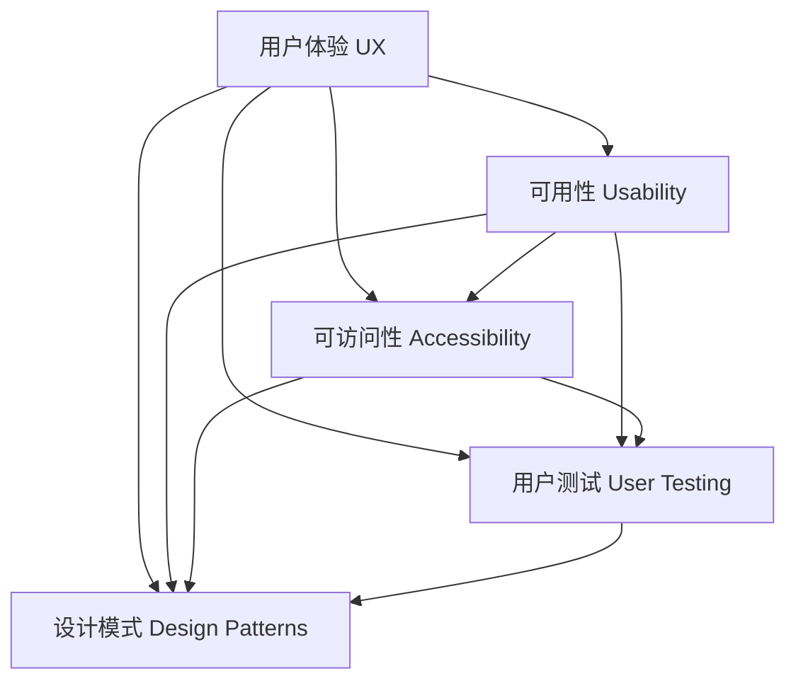

                 

# 第十章：人机交互界面设计

> 关键词：人机交互,用户界面设计,用户体验,界面原型设计,用户测试,设计模式,可访问性

## 1. 背景介绍

### 1.1 问题由来
随着计算机技术的发展，用户与计算机的交互方式日益复杂。早期，计算机通过命令行界面进行人机交互，但随着图形用户界面的普及，越来越多的应用程序通过界面展现丰富的图形元素和用户交互元素。

然而，优秀的用户界面设计不仅仅是美观和易于操作，更重要的是提升用户体验和提高用户满意度。优秀的界面设计能够帮助用户更快、更准确地完成任务，并且减少使用过程中的认知负担。因此，人机交互界面设计成为了软件开发过程中一个重要的环节。

### 1.2 问题核心关键点
人机交互界面设计涉及多个领域，包括心理学、认知科学、人机工程学等。其核心关键点包括：

- 用户体验（User Experience, UX）：衡量用户与系统的交互体验，是界面设计的重要指标。
- 可用性（Usability）：衡量用户对系统的易用性，包括易学性、效率、满意度等。
- 可访问性（Accessibility）：确保界面设计能够被尽可能多的用户访问和使用，包括残障人士。
- 用户测试（User Testing）：通过用户测试获取反馈，不断改进界面设计。
- 设计模式（Design Patterns）：借鉴已有的设计模式，提高界面设计的通用性和可重用性。

## 2. 核心概念与联系

### 2.1 核心概念概述

为更好地理解人机交互界面设计，本节将介绍几个密切相关的核心概念：

- **用户体验（UX）**：是指用户在使用产品时所获得的情感和认知体验。好的用户体验能够提升用户对产品的满意度和忠诚度。
- **可用性（Usability）**：是指产品对用户的操作难度和效率。可用性高的产品能够让用户更容易地完成任务。
- **可访问性（Accessibility）**：是指产品能够被尽可能多的用户（包括残障人士）访问和使用。
- **用户测试（User Testing）**：是指通过实际用户的参与来评估产品的使用情况，获取改进建议。
- **设计模式（Design Patterns）**：是指在界面设计中反复出现并具有共性的问题，以及如何处理这些问题的通用方案。

这些核心概念之间的逻辑关系可以通过以下Mermaid流程图来展示：



这个流程图展示了几者之间的联系和相互作用：

1. 用户体验是界面设计的目标和衡量标准。
2. 可用性和可访问性是提升用户体验的关键因素。
3. 用户测试有助于评估产品的可用性和用户体验。
4. 设计模式为界面设计提供通用解决方案，提升设计效率和质量。

这些概念共同构成了人机交互界面设计的理论基础，指引着设计师从不同维度提升产品的用户体验。

## 3. 核心算法原理 & 具体操作步骤
### 3.1 算法原理概述

人机交互界面设计本质上是一种创造性的活动，需要通过系统的设计和测试来不断优化界面。其核心算法原理包括：

- **用户模型（User Model）**：基于用户的研究和分析，建立用户的行为模式和心理模型。
- **界面设计原则（Design Principles）**：基于认知心理学和人类工程学的原则，指导界面设计。
- **交互流（Interaction Flow）**：定义用户在界面中的操作路径和交互方式。
- **界面原型（Interface Prototype）**：通过原型工具，创建界面设计的初步模型，用于用户测试和评估。

### 3.2 算法步骤详解

基于上述原理，人机交互界面设计的算法步骤包括：

1. **需求分析**：确定产品的功能需求和使用场景，明确用户的基本行为需求。
2. **用户研究**：通过调研和访谈等方式，了解目标用户的背景、需求和行为模式。
3. **设计构思**：基于用户研究结果，构思界面的设计方案，包括布局、元素选择、交互方式等。
4. **界面设计**：创建初步的界面原型，并根据用户测试结果不断调整和优化。
5. **用户测试**：在实际用户中进行测试，获取反馈和改进建议。
6. **迭代设计**：根据用户测试结果和反馈，不断迭代设计方案，直至满足用户需求和设计目标。

### 3.3 算法优缺点

人机交互界面设计具有以下优点：

- **用户中心**：通过用户研究，确保界面设计真正符合用户需求和期望。
- **迭代优化**：通过多次测试和反馈，不断优化界面设计，提升用户体验。
- **通用性强**：设计模式和原则具有普适性，适用于多种产品界面设计。

同时，该方法也存在一定的局限性：

- **耗时耗力**：设计过程复杂且需要多次迭代，耗时较多。
- **设计成本高**：优秀的设计方案需要具备较高的专业技能和经验。
- **用户参与度**：依赖于用户测试，测试参与度不高时，结果可能不够准确。

尽管存在这些局限性，但就目前而言，用户中心的设计方法仍然是人机交互界面设计的主流范式。未来相关研究的重点在于如何进一步降低设计成本、提高设计效率，同时兼顾用户体验和可访问性等因素。

### 3.4 算法应用领域

人机交互界面设计在多个领域都有广泛应用，包括但不限于：

- **移动应用**：手机和平板等设备的用户界面设计，涉及触屏操作、响应速度和导航等。
- **Web应用**：网站和Web应用的布局、导航、表单设计等。
- **桌面应用**：Windows、macOS等操作系统上的应用设计，包括窗口、工具栏和菜单等。
- **医疗系统**：医院信息系统、电子健康记录等，注重可用性和可访问性。
- **金融产品**：银行、保险、证券等金融产品的界面设计，强调安全性、隐私性和易用性。
- **教育平台**：在线教育平台的课程展示、作业提交和反馈等，注重交互流和用户体验。
- **智能家居**：智能设备的控制界面设计，注重交互方式和自动化。

## 4. 数学模型和公式 & 详细讲解 & 举例说明（备注：数学公式请使用latex格式，latex嵌入文中独立段落使用 $$，段落内使用 $)
### 4.1 数学模型构建

本节将使用数学语言对人机交互界面设计的关键要素进行描述。

假设用户 $u$ 对界面元素 $e_i$ 的满意度为 $s_i$，界面的可用性为 $U$，可访问性为 $A$，用户测试的反馈为 $F$，设计模式 $P$。则界面设计的总满意度 $S$ 可以表示为：

$$
S = w_U U + w_A A + w_F F + w_P P
$$

其中 $w_U, w_A, w_F, w_P$ 为各要素的权重，可以根据具体情况调整。

### 4.2 公式推导过程

以可用性（Usability）为例，可用性的定义可以表示为：

$$
U = \frac{1}{N} \sum_{i=1}^N \frac{t_i}{\tau_i}
$$

其中 $t_i$ 为第 $i$ 个任务所需的时间，$\tau_i$ 为任务完成的预期时间。可用性高的界面设计能够让用户在较短的时间内完成更多任务。

### 4.3 案例分析与讲解

以一个电商平台为例，分析其界面设计的各个要素：

1. **用户体验（UX）**：电商平台的界面设计需要注重美观和易用性，确保用户能够快速找到所需商品并进行购买。
2. **可用性（Usability）**：电商平台的界面需要快速响应，用户能够轻松搜索商品并添加到购物车。
3. **可访问性（Accessibility）**：电商平台的网页需要支持键盘导航和屏幕阅读器，方便残障人士使用。
4. **用户测试（User Testing）**：通过用户测试，可以评估电商平台的可用性和用户体验，收集改进建议。
5. **设计模式（Design Patterns）**：电商平台的购物车、结算页等界面可以借鉴已有设计模式，提升设计效率和质量。

## 5. 项目实践：代码实例和详细解释说明
### 5.1 开发环境搭建

在进行人机交互界面设计实践前，我们需要准备好开发环境。以下是使用Sketch进行界面设计的流程：

1. 安装Sketch软件：从官网下载并安装Sketch，创建项目文件。
2. 设计界面原型：在Sketch中使用布局、元素、文本等工具创建初步的界面原型。
3. 导出设计文件：在Sketch中导出设计文件，如 Sketch 文件、高保真原型、交互动画等。
4. 测试和优化：在测试工具中模拟用户使用界面，不断优化界面设计。

### 5.2 源代码详细实现

这里我们以一个电商平台的商品展示界面为例，给出Sketch设计界面的实现步骤：

1. **布局设计**：
```sketch
-- Step 1: 定义布局
-- Step 2: 设置元素间距
```

2. **元素选择**：
```sketch
-- Step 3: 选择商品图片
-- Step 4: 选择商品标题
-- Step 5: 选择商品价格
```

3. **交互方式设计**：
```sketch
-- Step 6: 设计商品点击事件
-- Step 7: 设计加入购物车功能
```

4. **设计模式应用**：
```sketch
-- Step 8: 应用购物车模式
-- Step 9: 应用搜索模式
```

5. **测试和优化**：
```sketch
-- Step 10: 测试界面原型
-- Step 11: 收集用户反馈
-- Step 12: 优化界面设计
```

### 5.3 代码解读与分析

让我们再详细解读一下关键代码的实现细节：

**Step 1**：定义布局
```sketch
-- 使用布局工具定义页面布局
```

**Step 2**：设置元素间距
```sketch
-- 设置元素之间的间距，确保页面整洁美观
```

**Step 3**：选择商品图片
```sketch
-- 选择高质量的商品图片，确保用户能够直观了解商品外观
```

**Step 4**：选择商品标题
```sketch
-- 设计简洁明了的商品标题，确保用户快速了解商品信息
```

**Step 5**：选择商品价格
```sketch
-- 使用清晰的价格标签，确保用户能够准确了解商品价格
```

**Step 6**：设计商品点击事件
```sketch
-- 定义商品点击事件，实现商品详情页的跳转
```

**Step 7**：设计加入购物车功能
```sketch
-- 实现用户一键加入购物车的功能，简化购物流程
```

**Step 8**：应用购物车模式
```sketch
-- 借鉴已有购物车设计模式，实现购物车的稳定性和易用性
```

**Step 9**：应用搜索模式
```sketch
-- 使用搜索模式，提升用户查找商品的速度
```

**Step 10**：测试界面原型
```sketch
-- 使用Sketch的原型测试工具，模拟用户使用界面
```

**Step 11**：收集用户反馈
```sketch
-- 通过用户测试收集反馈，了解用户使用体验
```

**Step 12**：优化界面设计
```sketch
-- 根据用户反馈不断优化界面设计，提升用户体验
```

可以看到，Sketch作为专业的界面设计工具，提供了丰富的设计功能和优化建议，帮助设计师快速创建高质量的界面原型。

## 6. 实际应用场景
### 6.1 智能家居系统

智能家居系统通过人机交互界面设计，使用户能够轻松控制家中的各种设备。界面设计需要考虑到设备的兼容性、操作简便性和美观性。

在实际应用中，可以收集用户的使用习惯和反馈，不断优化界面设计。通过语音助手和触摸屏等交互方式，使用户能够通过语音或手势控制家中的灯光、温度等设备。同时，界面设计需要保证用户能够轻松了解设备的状态和操作提示。

### 6.2 医疗信息系统

医疗信息系统是医疗行业的关键应用之一，其界面设计需要高度注重可用性和可访问性。通过清晰的界面布局和操作提示，使医护人员能够快速访问患者信息、记录病历等。

在界面设计中，可以采用大按钮、明确的操作提示和交互流设计，帮助医护人员快速完成各种操作。同时，界面设计需要支持键盘输入和屏幕阅读器，确保残障人士能够方便使用。

### 6.3 金融服务平台

金融服务平台需要用户能够快速进行账户管理、交易操作等复杂任务。界面设计需要高度注重可用性和安全性。

在界面设计中，可以采用分层的界面布局，将复杂的任务分解为多个步骤，逐步引导用户完成操作。同时，界面设计需要支持多语言和货币转换，确保全球用户能够方便使用。

### 6.4 教育平台

教育平台需要用户能够轻松访问各种学习资源和提交作业。界面设计需要高度注重交互流和用户体验。

在界面设计中，可以采用简单的界面布局，将学习资源和作业提交入口放在显眼位置，使用户能够快速访问。同时，界面设计需要支持互动式学习，提升用户的学习体验。

### 6.5 智能客服系统

智能客服系统通过人机交互界面设计，使客户能够方便地进行问题咨询和投诉处理。界面设计需要高度注重可用性和响应速度。

在界面设计中，可以采用简单的界面布局和智能提示，帮助客户快速找到解决方案。同时，界面设计需要支持多种交互方式，包括文本输入、语音交互等。

## 7. 工具和资源推荐
### 7.1 学习资源推荐

为了帮助开发者系统掌握人机交互界面设计的理论基础和实践技巧，这里推荐一些优质的学习资源：

1. **《Don't Make Me Think》**：史蒂夫·克鲁格（Steve Krug）的经典著作，介绍了界面设计的基本原则和用户体验的提升方法。
2. **《The Elements of User Experience》**：Jesse James Garrett的著作，详细介绍了用户体验设计的方法和工具。
3. **《Interaction Design Foundation》**：提供丰富的在线课程和文章，涵盖界面设计、交互设计等领域的知识点。
4. **《Nielsen Norman Group》**：用户体验研究领域的权威机构，提供大量研究报告和案例分析。
5. **《Sketch官方教程》**：Sketch官方提供的详细教程，涵盖界面设计、原型制作等实用技巧。

通过对这些资源的学习实践，相信你一定能够快速掌握人机交互界面设计的精髓，并用于解决实际的界面设计问题。

### 7.2 开发工具推荐

高效的界面设计离不开优秀的工具支持。以下是几款用于界面设计开发的常用工具：

1. **Sketch**：专业界面设计工具，支持丰富的设计功能和原型的创建与导出。
2. **Adobe XD**：跨平台设计工具，支持界面原型设计和交互动画。
3. **Figma**：基于云的设计工具，支持实时协作和原型设计。
4. **Balsamiq**：快速原型工具，适合快速制作低保真原型。
5. **InVision**：原型设计和交互测试工具，支持高保真原型和用户测试。

合理利用这些工具，可以显著提升人机交互界面设计的开发效率，加快创新迭代的步伐。

### 7.3 相关论文推荐

人机交互界面设计涉及多个学科的交叉，以下是几篇奠基性的相关论文，推荐阅读：

1. **"Human-Computer Interaction Design Patterns"**：Jesse James Garrett的研究，总结了常见的人机交互设计模式，为界面设计提供参考。
2. **"Human Factors of Computer Use"**：Jean-Paul De Longchamp的研究，探讨了人机交互中的心理学和认知学原理。
3. **"Designing with the Mind in Mind"**：Jane McGonigal的著作，介绍了用户研究和界面设计的方法。
4. **"Interaction in Computer Systems"**：Bruce Toggl的研究，探讨了人机交互中的交互流和反馈机制。

这些论文代表了这个领域的最新研究成果，通过学习这些前沿成果，可以帮助研究者把握学科前进方向，激发更多的创新灵感。

## 8. 总结：未来发展趋势与挑战
### 8.1 总结

本文对人机交互界面设计进行了全面系统的介绍。首先阐述了人机交互界面设计的背景和意义，明确了用户体验、可用性、可访问性等关键指标。其次，从原理到实践，详细讲解了人机交互界面设计的数学模型和关键步骤，给出了界面设计的完整代码实例。同时，本文还广泛探讨了界面设计在多个行业领域的应用前景，展示了界面设计的巨大潜力。此外，本文精选了界面设计的各类学习资源，力求为读者提供全方位的技术指引。

通过本文的系统梳理，可以看到，人机交互界面设计是人机交互中的重要环节，能够显著提升用户体验和产品可用性。未来，界面设计需要不断探索新的技术和方法，如虚拟现实、增强现实等，进一步提升用户交互体验和产品竞争力。

### 8.2 未来发展趋势

展望未来，人机交互界面设计将呈现以下几个发展趋势：

1. **虚拟现实（VR）和增强现实（AR）**：虚拟现实和增强现实技术的普及，将带来全新的交互方式，提升用户沉浸感和体验感。
2. **多通道交互**：未来的界面设计将支持多种交互方式，如触屏、语音、手势等，提升用户使用便捷性。
3. **个性化界面**：通过用户数据分析，设计个性化的界面布局和交互方式，提升用户满意度。
4. **智能界面**：界面设计将引入人工智能技术，如自然语言处理、机器学习等，提升界面自动生成和优化能力。
5. **混合现实（MR）界面**：混合现实技术将实现在物理世界和数字世界之间的无缝交互，提升用户互动体验。
6. **可穿戴设备**：随着可穿戴设备的普及，界面设计将面向小型化和轻量化的趋势发展，提升便携性和便捷性。

这些趋势将引领人机交互界面设计进入新的阶段，带来更多的创新和变革。

### 8.3 面临的挑战

尽管人机交互界面设计已经取得了显著成果，但在迈向更加智能化、普适化应用的过程中，仍面临诸多挑战：

1. **交互复杂性**：随着技术的不断发展，界面设计将面临更多复杂的问题，如多模态交互、实时反馈等。
2. **设计效率**：界面设计的复杂性和多样性要求设计人员具备更高的专业技能和经验，设计效率面临瓶颈。
3. **用户体验一致性**：在不同平台和设备上，界面设计需要保持一致性，提升用户的使用体验。
4. **交互逻辑清晰**：设计界面时需要考虑逻辑清晰、易用性，避免用户在使用过程中产生困惑。
5. **用户隐私保护**：界面设计需要注重用户隐私保护，避免数据泄露和滥用。
6. **界面可访问性**：界面设计需要支持残障人士，确保界面可访问性和易用性。
7. **界面设计标准化**：需要制定统一的界面设计标准，确保设计规范性和可复用性。

这些挑战需要研究者不断探索和创新，推动界面设计的标准化和规范化，提升用户满意度和产品质量。

### 8.4 研究展望

面对人机交互界面设计所面临的种种挑战，未来的研究需要在以下几个方面寻求新的突破：

1. **界面设计的自动化**：利用人工智能和机器学习技术，自动化设计界面布局和交互方式，提升设计效率。
2. **界面设计的标准化**：制定统一的界面设计标准，提升设计的规范性和可复用性。
3. **界面设计的可访问性**：设计界面时注重可访问性，确保残障人士能够方便使用。
4. **界面设计的隐私保护**：设计界面时需要注重用户隐私保护，避免数据泄露和滥用。
5. **界面设计的智能优化**：通过数据分析和机器学习，优化界面设计，提升用户体验。
6. **界面设计的情感化设计**：在设计中注重情感化设计，提升用户情感体验。
7. **界面设计的跨学科融合**：与其他学科进行深度融合，如心理学、认知科学等，提升界面设计的科学性和创新性。

这些研究方向的探索，将引领人机交互界面设计迈向更高的台阶，为构建人机协同的智能系统铺平道路。面向未来，界面设计需要不断创新和优化，推动人机交互界面的智能化和个性化发展。

## 9. 附录：常见问题与解答

**Q1：如何衡量人机交互界面设计的优劣？**

A: 人机交互界面设计的优劣可以通过用户体验（UX）、可用性（Usability）、可访问性（Accessibility）等指标来衡量。具体而言，可以采用以下方法：

1. **用户体验（UX）**：通过用户调研和反馈，评估用户对界面的使用体验，如界面美观、操作便捷性等。
2. **可用性（Usability）**：通过可用性测试，评估用户在完成任务时的效率和满意度。
3. **可访问性（Accessibility）**：通过可访问性测试，评估界面对残障人士的可访问性，如屏幕阅读器支持、键盘导航等。

**Q2：界面设计中的设计模式有哪些？**

A: 界面设计中常用的设计模式包括：

1. **MVC模式（Model-View-Controller）**：将界面分为模型、视图和控制器三个部分，提升界面的可维护性和可扩展性。
2. **MVVM模式（Model-View-ViewModel）**：适用于WPF和MVVM框架，提升界面的解耦和可复用性。
3. **CADR模式（Component-Action-Data-Response）**：适用于React等组件化界面设计，提升界面的动态化和可复用性。
4. **SAP模式（Single-API Point）**：通过单一API点实现组件间的交互，提升界面的简洁性和易用性。
5. **CAD模式（Component-Action-Data）**：适用于Angular等框架，提升界面的解耦和可复用性。
6. **CRUD模式（Create-Read-Update-Delete）**：适用于数据驱动的界面设计，提升数据操作效率。

**Q3：界面设计中的用户体验设计（UX Design）需要注意哪些方面？**

A: 界面设计中的用户体验设计需要注意以下几个方面：

1. **用户需求分析**：了解用户的基本需求和使用场景，明确设计目标。
2. **用户研究和调研**：通过用户调研和访谈，获取用户的使用习惯和反馈，了解用户心理模型。
3. **用户界面原型**：创建初步的界面原型，使用户能够直观理解界面设计方案。
4. **用户测试**：在实际用户中进行测试，获取反馈和改进建议。
5. **迭代设计**：根据用户测试结果和反馈，不断迭代设计方案，直至满足用户需求和设计目标。

**Q4：界面设计的自动化工具有哪些？**

A: 界面设计的自动化工具包括：

1. **Sketch**：支持自动生成布局、元素等，提升设计效率。
2. **Adobe XD**：支持自动生成交互动画和原型，提升设计效率。
3. **Figma**：支持实时协作和自动生成设计元素，提升设计效率。
4. **Balsamiq**：支持自动生成低保真原型，提升设计效率。
5. **InVision**：支持自动生成高保真原型和测试，提升设计效率。

**Q5：界面设计的可访问性（Accessibility）需要注意哪些方面？**

A: 界面设计的可访问性需要注意以下几个方面：

1. **屏幕阅读器支持**：确保界面能够被屏幕阅读器正确读取和理解。
2. **键盘导航**：确保界面能够通过键盘进行有效导航。
3. **颜色对比度**：确保界面元素之间有足够的对比度，便于用户辨识。
4. **字体大小和大小**：确保文字大小适中，便于用户阅读。
5. **标签和提示**：确保每个元素都有清晰的标签和提示，帮助用户理解界面。
6. **辅助技术支持**：支持辅助设备，如鼠标、触摸屏等，提升用户的交互体验。

通过合理运用这些工具和资源，可以显著提升人机交互界面设计的效率和质量，推动界面设计的智能化和个性化发展。

