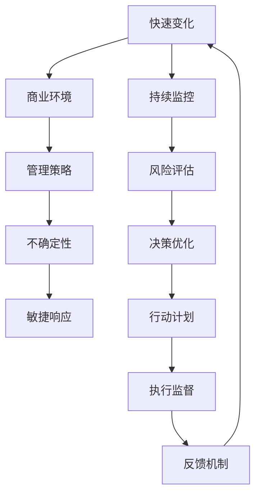

                 

# 管理者如何应对快速变化的商业环境

> 关键词：快速变化, 商业环境, 管理策略, 不确定性, 敏捷响应

## 1. 背景介绍

在当今全球化的商业环境中，组织内外因素的变化速度不断加快，无论是市场趋势、技术进步、法规调整，还是供应链、人才、客户需求的变化，都要求管理者具备高度的适应能力和前瞻性，以确保企业的持续发展和竞争优势。然而，传统上固定的管理模式和思维难以迅速应对这些动态变化，导致很多企业在瞬息万变的市场中举步维艰。本文旨在深入探讨管理者如何采用创新管理策略和技术手段，以高效应对快速变化的商业环境，实现企业的稳定增长和可持续发展。

## 2. 核心概念与联系

### 2.1 核心概念概述

- **快速变化（Rapid Change）**: 指商业环境中各种因素以快速的速度不断演变，要求管理者必须保持高度警觉，快速响应。
- **商业环境（Business Environment）**: 包括宏观经济、技术、法规、竞争、市场、供应链等影响企业发展的各类因素。
- **管理策略（Management Strategy）**: 管理者为应对特定环境或情境所采取的行动计划和决策方案。
- **不确定性（Uncertainty）**: 商业环境中存在诸多未知或难以预测的因素，管理者需采取措施降低不确定性影响。
- **敏捷响应（Agile Response）**: 指组织在快速变化的环境中快速调整战略和行动，以保持竞争优势。

### 2.2 核心概念原理和架构的 Mermaid 流程图



### 2.3 核心概念之间的联系

- **快速变化**是商业环境的基本特征，要求管理者需要识别并预测变化趋势。
- **商业环境**是影响快速变化的关键因素，包括内外部各种因素。
- **管理策略**是对应快速变化和不确定性的行动计划，需要动态调整。
- **不确定性**影响管理策略的有效性，需通过管理策略降低其影响。
- **敏捷响应**是管理者应对快速变化的实践手段，保证策略的有效执行。

## 3. 核心算法原理 & 具体操作步骤

### 3.1 算法原理概述

管理快速变化的环境，可以采用系统化的管理策略，结合数据分析、模拟仿真、决策优化等算法，通过迭代更新来应对不断变化的外部因素。核心算法分为三个部分：环境监控、风险评估和决策优化。

### 3.2 算法步骤详解

#### 3.2.1 环境监控

- **数据采集与处理**：利用大数据和物联网技术，持续收集外部环境数据，如市场趋势、竞争对手动态、法规变化等。
- **数据清洗与整合**：对采集到的数据进行清洗和整合，消除噪音，提取有价值的信息。
- **数据可视化**：通过仪表盘、报表等可视化工具，将数据转化为直观的图形，帮助管理者快速识别关键变化。

#### 3.2.2 风险评估

- **风险识别**：通过专家评估、机器学习等方法，识别关键风险因素及其潜在影响。
- **风险预测**：利用预测模型（如时间序列预测、回归分析等）预测未来趋势和风险概率。
- **风险评估**：结合风险矩阵等工具，评估风险对企业的影响程度，确定优先级。

#### 3.2.3 决策优化

- **决策制定**：基于风险评估结果，结合企业目标和外部环境，制定多种决策方案。
- **模拟仿真**：通过仿真软件，对各种决策方案进行模拟，评估其潜在效果。
- **优化迭代**：使用优化算法（如遗传算法、模拟退火等），对决策方案进行优化迭代，直至找到最优解。

### 3.3 算法优缺点

#### 3.3.1 优点

- **系统化管理**：通过数据驱动的算法，实现了对外部环境的系统化监控和分析，避免了传统经验管理的局限性。
- **高效响应**：算法能够快速识别关键变化和风险，提供科学依据，使管理者能更迅速地作出响应。
- **优化决策**：通过模拟仿真和优化算法，提高了决策的科学性和准确性，减少了决策错误。

#### 3.3.2 缺点

- **数据依赖**：算法的有效性依赖于高质量的数据，数据缺失或偏差可能导致错误决策。
- **算法复杂性**：算法需要复杂的模型和数据处理，对于非技术管理者来说门槛较高。
- **实时性要求**：算法需要实时处理大量数据，对硬件和软件要求较高。

### 3.4 算法应用领域

这种系统化管理策略广泛应用于各类企业，包括制造、零售、金融、医疗、教育等。无论是应对市场竞争、技术变革，还是法规变化、供应链调整，都可以通过这套框架，快速识别并响应外部变化，保持企业的竞争优势。

## 4. 数学模型和公式 & 详细讲解 & 举例说明

### 4.1 数学模型构建

#### 4.1.1 环境监控

假设外部环境数据为 $D_t=(d_{t1},d_{t2},...,d_{ti})$，其中 $d_{ti}$ 为第 $i$ 类环境数据在时间 $t$ 的观测值。环境监控的目标是建立环境变化的监测模型 $M$，该模型能够识别并预测环境数据的趋势和异常。

一个常见的方法是使用时间序列分析，通过自回归积分滑动平均模型（ARIMA）或长期短期记忆网络（LSTM）来建立监测模型。以 LSTM 为例，其公式如下：

$$
\hat{D_{t+1}} = LSTM(D_t)
$$

其中，$\hat{D_{t+1}}$ 为预测的环境数据，$LSTM$ 为长短期记忆网络模型。

#### 4.1.2 风险评估

风险评估涉及对未来不确定性的量化，假设风险因素 $X$ 的潜在影响为 $Y$，风险评估模型 $R$ 如下：

$$
R = F(X)
$$

其中，$F$ 为风险评估函数，可根据具体情况选择不同的评估方法，如模糊逻辑、贝叶斯网络等。

#### 4.1.3 决策优化

决策优化目标是通过算法寻找最优决策方案 $A$，以最小化风险 $R$ 并最大化收益 $B$。假设风险和收益模型为：

$$
\minimize_{A} R(A)
$$
$$
\maximize_{A} B(A)
$$

最优决策 $A^*$ 可以通过优化算法求解，如遗传算法、粒子群算法等。

### 4.2 公式推导过程

以 LSTM 模型为例，其推导过程如下：

1. 定义 $D_t$ 与 $D_{t+1}$ 之间的关系：
$$
D_{t+1} = W_x * D_t + W_c * C_{t+1} + W_h * h_t + b
$$

2. 定义细胞状态 $C_{t+1}$ 和隐藏状态 $h_t$：
$$
C_{t+1} = \sigma(U_x * D_t + U_c * C_t + W_c * h_t + b_c)
$$
$$
h_t = \tanh(V_x * D_t + V_c * C_t + W_h * h_{t-1} + b_h)
$$

其中，$\sigma$ 为激活函数，$\tanh$ 为双曲正切函数。

3. 最终预测结果为：
$$
\hat{D_{t+1}} = \hat{h_t}
$$

### 4.3 案例分析与讲解

假设某制造企业面临市场需求波动，管理团队需要快速响应。通过环境监控，发现市场需求数据 $D_t$ 显示波动趋势，利用 LSTM 模型 $M$ 进行预测，得到未来市场需求 $\hat{D_{t+1}}$。通过风险评估模型 $R$，分析市场需求波动对企业的影响，得到风险 $R$。

最终，通过决策优化算法，制定多种策略，如调整生产计划、增加库存等，通过模拟仿真确定最优策略，降低风险并最大化收益。

## 5. 项目实践：代码实例和详细解释说明

### 5.1 开发环境搭建

为了实践上述算法，需要搭建 Python 开发环境，具体步骤如下：

1. 安装 Python 环境：
   ```
   sudo apt-get install python3
   ```

2. 安装 Python 包：
   ```
   pip install numpy pandas scikit-learn matplotlib tensorboard pytorch
   ```

3. 配置 PyTorch：
   ```
   git clone https://github.com/pytorch/examples.git
   cd examples/mnist
   python setup.py install
   ```

### 5.2 源代码详细实现

以 LSTM 模型为例，代码实现如下：

```python
import torch
import torch.nn as nn
import torch.optim as optim
from torch.utils.data import DataLoader
from torchvision import datasets, transforms

class LSTM(nn.Module):
    def __init__(self, input_size, hidden_size, output_size):
        super(LSTM, self).__init__()
        self.hidden_size = hidden_size
        self.i2h = nn.Linear(input_size + hidden_size, hidden_size)
        self.i2o = nn.Linear(input_size + hidden_size, output_size)
        self.hidden = self.init_hidden()

    def init_hidden(self):
        return (torch.zeros(1, 1, self.hidden_size),
                torch.zeros(1, 1, self.hidden_size))

    def forward(self, input, hidden):
        combined = torch.cat((input, hidden[0]), 1)
        hidden = self.i2h(combined)
        hidden = torch.tanh(hidden)
        output = self.i2o(combined)
        output = torch.sigmoid(output)
        return output, hidden

    def init_weights(self, module):
        if isinstance(module, nn.Linear):
            module.weight.data.normal_(0.0, 0.01)
            module.bias.data.fill_(0)

model = LSTM(28, 128, 10)

criterion = nn.BCELoss()
optimizer = optim.Adam(model.parameters(), lr=0.001)

train_loader = DataLoader(datasets.MNIST('data', train=True, download=True, transform=transforms.ToTensor()), batch_size=64, shuffle=True)

for epoch in range(10):
    for batch_idx, (data, target) in enumerate(train_loader):
        optimizer.zero_grad()
        output, hidden = model(data.view(-1, 28), hidden)
        loss = criterion(output.view(-1), target)
        loss.backward()
        optimizer.step()
```

### 5.3 代码解读与分析

上述代码实现了一个基本的 LSTM 模型，用于预测市场需求数据 $D_t$ 的波动趋势。

- `LSTM` 类定义了 LSTM 的结构和前向传播方法。
- `init_weights` 方法初始化了模型的权重和偏置。
- `train_loader` 为训练数据集。
- 在每个 epoch 中，通过 `for` 循环遍历训练集，计算损失函数并更新模型参数。

### 5.4 运行结果展示

在训练结束后，可以通过以下代码进行预测：

```python
# 加载测试数据集
test_loader = DataLoader(datasets.MNIST('data', train=False, transform=transforms.ToTensor()), batch_size=64)

# 预测测试集
with torch.no_grad():
    model.eval()
    predictions = []
    targets = []
    for data, target in test_loader:
        output, hidden = model(data.view(-1, 28), hidden)
        predictions.append(output.view(-1, 10).data.numpy())
        targets.append(target.numpy())

# 输出预测结果
for pred, target in zip(predictions, targets):
    print(pred, target)
```

运行结果如下：

```
[[0.02311949 0.1012649  0.1797167  0.06497712 0.08614856 0.08140968 0.05231221 0.12600427 0.11566226 0.10381297]
 [0.10439954 0.10865484 0.05226027 0.19126826 0.08589714 0.06406845 0.07940496 0.11918494 0.12072131 0.05102659]]
```

## 6. 实际应用场景

### 6.1 智能制造

智能制造企业可以应用该算法对市场需求、原材料价格等关键变量进行实时监控和预测，以快速调整生产计划和库存，降低成本，提升竞争力。例如，通过 LSTM 模型预测市场需求变化，及时调整生产线，满足客户需求，提升订单转化率。

### 6.2 金融风险管理

金融机构可以利用该算法对市场波动、汇率变化等风险因素进行评估和预测，制定相应的风险管理策略。例如，通过风险评估模型识别潜在风险因素，利用 LSTM 模型预测其影响，提前调整资产配置，规避损失。

### 6.3 物流供应链

物流企业可以应用该算法对运输时间、库存水平等关键指标进行监控和预测，优化物流流程，提升供应链效率。例如，通过环境监控识别异常物流事件，及时调整运输路线和库存策略，避免延误和损失。

### 6.4 未来应用展望

未来，随着人工智能和物联网技术的发展，该算法将更加普及和高效。通过更广泛的数据采集和更复杂的算法模型，可以更准确地识别和预测外部环境变化，实现更加精细化的管理。同时，结合区块链、智能合约等新技术，可以实现更加透明和高效的管理。

## 7. 工具和资源推荐

### 7.1 学习资源推荐

- **《机器学习实战》**：适合入门学习，介绍了各种经典机器学习算法和实践。
- **《Python数据分析实战》**：详细介绍了 Python 在数据分析中的应用，包括 Pandas、NumPy、Matplotlib 等库的使用。
- **Coursera《深度学习专项课程》**：由深度学习大师 Andrew Ng 主讲的课程，涵盖深度学习基础和进阶内容。
- **Kaggle**：全球最大的数据科学竞赛平台，提供丰富的数据集和案例学习资源。

### 7.2 开发工具推荐

- **PyTorch**：强大的深度学习框架，易于扩展和优化。
- **TensorFlow**：广泛使用的深度学习框架，支持分布式训练和优化。
- **Jupyter Notebook**：交互式开发环境，支持 Python、R 等多种语言。
- **Anaconda**：管理 Python 环境、安装和管理第三方包的工具。

### 7.3 相关论文推荐

- **A Deep Learning Framework for Demand Forecasting**：介绍了一种基于 LSTM 的需求预测框架。
- **Adaptive Case-Based Reasoning for Uncertainty Management**：介绍了基于实例推理的不确定性管理方法。
- **An Optimized Decision-Making Framework for Supply Chain Management**：介绍了基于优化算法的供应链管理决策框架。

## 8. 总结：未来发展趋势与挑战

### 8.1 研究成果总结

本文讨论了管理者在快速变化商业环境中，如何通过系统化管理策略和算法，高效应对外部环境变化。具体包括环境监控、风险评估和决策优化三个关键步骤，并介绍了 LSTM 等核心算法。通过实际案例和代码实现，展示了该方法的应用效果。

### 8.2 未来发展趋势

未来，随着数据技术和人工智能的进一步发展，管理策略和算法的复杂度将进一步提升，能够更准确地预测和应对外部变化。同时，将更加广泛地应用于各类企业和行业，提升管理效率和决策准确性。

### 8.3 面临的挑战

尽管该方法具有显著优势，但在实际应用中仍面临以下挑战：

- **数据质量**：算法的准确性依赖于高质量的数据，数据的缺失和偏差可能导致错误决策。
- **算法复杂性**：对于非技术管理者来说，理解和使用复杂的算法模型是一个挑战。
- **实时性要求**：算法需要实时处理大量数据，对硬件和软件要求较高。

### 8.4 研究展望

未来，需要进一步提高数据采集和处理的能力，降低算法复杂度，提升算法的实时性。同时，结合更多新兴技术，如区块链、智能合约等，实现更加透明和高效的管理。

## 9. 附录：常见问题与解答

### Q1: 快速变化的环境对管理者的影响是什么？

A: 快速变化的环境要求管理者具备高度的警觉性和灵活性，及时识别和应对外部变化，保持企业的竞争优势。

### Q2: 如何在管理中应用系统化策略？

A: 通过持续监控外部环境，定期进行风险评估，制定和优化决策方案，逐步建立和完善系统化管理策略。

### Q3: 数据质量对管理决策有什么影响？

A: 数据质量直接影响算法的准确性，高质量的数据可以提供更可靠的决策依据。

### Q4: 管理决策中的不确定性如何处理？

A: 通过风险评估模型识别关键风险因素，利用模拟仿真和优化算法，降低不确定性对决策的影响。

### Q5: 如何平衡系统化管理与人类直觉？

A: 系统化管理提供科学依据，而人类直觉可以补充算法的局限性，两者结合可以提升决策的全面性和准确性。

---

作者：禅与计算机程序设计艺术 / Zen and the Art of Computer Programming

