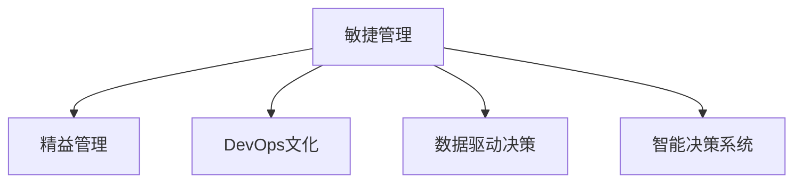

                 

# 管理者如何应对快速变化的环境

在现代商业环境中，快速变化已成为了常态。如何在这个动荡的时代中保持组织的稳定和高效运营，成为了所有管理者必须面对的重大挑战。本文将从技术、管理和组织三个维度，深入探讨管理者如何应对快速变化的环境，提供一系列行之有效的策略和方法。

## 1. 背景介绍

### 1.1 问题由来
进入21世纪以来，互联网、大数据、人工智能等技术的快速发展，给传统行业带来了翻天覆地的变化。市场竞争日益激烈，客户需求瞬息万变，管理者必须时刻保持敏感，适应环境变化，才能在激烈的市场竞争中脱颖而出。

然而，很多传统企业在面对快速变化时，往往缺乏足够的准备和应变能力，难以快速调整战略，错失市场良机。管理者需要重新思考战略规划、组织架构、技术应用等关键要素，才能更好地应对外部环境的挑战。

### 1.2 问题核心关键点
要应对快速变化的环境，管理者需要具备以下核心能力：
- **快速决策能力**：快速评估环境变化，做出及时有效的决策。
- **灵活适应能力**：灵活调整战略和策略，适应不同的市场环境。
- **协同合作能力**：提升团队协作，强化跨部门沟通，形成合力。
- **风险管理能力**：识别风险，制定预案，降低环境变化带来的影响。

本文章将围绕这些核心关键点，提供全方位的指导和策略。

## 2. 核心概念与联系

### 2.1 核心概念概述

为更好地理解管理者如何应对快速变化的环境，本文将介绍几个密切相关的核心概念：

- **敏捷管理**：敏捷管理是一种以人为本的管理模式，强调快速响应、灵活调整、持续改进，以适应快速变化的环境。
- **精益管理**：精益管理通过消除浪费、优化流程，提高效率和质量，帮助组织更好地适应外部变化。
- **DevOps文化**：DevOps是一种集成软件开发和IT运维的文化，强调协作、自动化和持续交付，以提升组织应对变化的能力。
- **数据驱动决策**：利用大数据和分析技术，帮助管理者基于数据做出科学的决策，减少不确定性。
- **智能决策系统**：使用AI和机器学习技术，实现基于数据的智能决策，提高决策速度和准确性。

这些核心概念之间的逻辑关系可以通过以下Mermaid流程图来展示：



这个流程图展示了一个综合的管理体系，从敏捷管理出发，通过精益管理提升效率，通过DevOps文化加速交付，通过数据驱动决策和智能决策系统提供支持。

## 3. 核心算法原理 & 具体操作步骤

### 3.1 算法原理概述

管理者应对快速变化环境的原理，可以归纳为以下几点：

- **持续学习和适应**：持续学习新知识和技能，适应快速变化的环境。
- **优化决策过程**：通过科学的数据分析，优化决策流程，减少决策失误。
- **强化协作和沟通**：强化跨部门协作，加强团队沟通，形成合力。
- **风险管理和预防**：通过风险管理技术，预防环境变化带来的负面影响。

### 3.2 算法步骤详解

管理者应对快速变化的环境，一般包括以下几个关键步骤：

**Step 1: 数据收集与分析**
- 收集内部和外部的数据，包括市场趋势、客户反馈、竞争对手动态等。
- 利用大数据和分析技术，提取有价值的信息，帮助管理者进行决策。

**Step 2: 敏捷响应与调整**
- 通过敏捷管理方法，快速评估环境变化，调整战略和策略。
- 定期回顾和反思，持续改进决策和执行过程。

**Step 3: 风险识别与应对**
- 识别潜在风险，制定风险管理预案。
- 建立预警机制，及时响应突发事件。

**Step 4: 数据驱动决策**
- 利用智能决策系统，结合数据和AI技术，辅助决策。
- 建立反馈循环，持续优化决策模型。

**Step 5: 团队协作与沟通**
- 加强团队协作，建立跨部门沟通机制。
- 定期举行头脑风暴，鼓励创新和改进。

**Step 6: 持续改进与优化**
- 通过精益管理，持续改进流程和效率。
- 引入DevOps文化，加速交付和迭代。

### 3.3 算法优缺点

敏捷管理和精益管理方法，具有以下优点：
1. 提高灵活性和适应性，快速响应市场变化。
2. 优化流程和效率，减少资源浪费。
3. 强化团队协作和沟通，形成合力。
4. 通过持续改进，提升组织整体能力。

但同时也存在一些缺点：
1. 需要较高的管理和技术投入。
2. 涉及的人员和流程较多，协调复杂。
3. 短期内可能面临较大的变化和不确定性。

数据驱动决策和智能决策系统，则具有以下优点：
1. 基于数据和算法，提高决策的准确性和科学性。
2. 能够快速响应市场变化，提供实时的分析结果。
3. 减少人为因素的干扰，降低决策失误。

但缺点包括：
1. 需要较大的数据量和计算资源。
2. 模型和算法的复杂性，可能引入额外的误差。
3. 对于非结构化数据的处理，仍然存在挑战。

综合来看，管理者应根据实际情况，选择合适的策略和方法，形成适应快速变化环境的综合管理体系。

### 3.4 算法应用领域

敏捷管理、精益管理、DevOps文化、数据驱动决策和智能决策系统等方法，广泛应用于各个行业领域，具体应用场景包括：

- **制造业**：通过精益生产、敏捷制造，提升生产效率和产品质量。
- **金融行业**：利用数据驱动决策，实时监控市场动态，优化投资策略。
- **零售行业**：通过敏捷供应链、智能推荐系统，提高客户满意度和市场响应速度。
- **医疗行业**：采用精益管理，优化诊疗流程，提升医疗服务质量。
- **教育行业**：通过敏捷课程开发、智能评估系统，提高教学效果和学习体验。

这些应用场景展示了管理者如何利用先进的管理和决策方法，提升组织应对快速变化环境的能力。

## 4. 数学模型和公式 & 详细讲解 & 举例说明

### 4.1 数学模型构建

管理者应对快速变化环境的数学模型，可以基于数据驱动决策和智能决策系统进行构建。具体如下：

- **数据收集与分析模型**：利用大数据和分析技术，构建数据收集和分析模型。
- **敏捷决策模型**：基于敏捷管理方法，构建敏捷决策模型。
- **风险管理模型**：利用统计和机器学习技术，构建风险管理模型。

### 4.2 公式推导过程

假设管理者面对的环境变化可以表示为 $X_t$，对应的敏捷决策策略为 $S_t$，则决策过程可以表示为：

$$
S_{t+1} = f(X_t, S_t)
$$

其中 $f$ 表示决策函数，可以基于历史数据和模型进行优化。通过持续迭代，不断调整 $S_t$，以应对环境变化。

### 4.3 案例分析与讲解

以一家传统制造企业为例，如何通过敏捷管理和精益管理应对快速变化的环境：

1. **数据收集与分析**：
   - 收集市场趋势数据，如订单量、客户满意度、竞争对手动态等。
   - 利用数据挖掘和机器学习技术，提取关键指标，如市场需求预测、供应链风险评估等。

2. **敏捷响应与调整**：
   - 建立敏捷项目团队，定期召开会议，评估市场变化。
   - 基于数据驱动的决策，调整生产计划、库存管理、物流配送等策略。

3. **风险识别与应对**：
   - 利用统计分析方法，识别供应链中的潜在风险。
   - 制定应急预案，建立预警机制，如物流中断、供应商破产等，确保生产连续性。

4. **数据驱动决策**：
   - 利用智能决策系统，实时监控市场和生产数据，优化生产流程和资源分配。
   - 定期评估决策模型，优化算法和参数，提升决策效果。

5. **团队协作与沟通**：
   - 建立跨部门协作机制，如供应链与生产部门的紧密配合，减少信息不对称。
   - 定期举行头脑风暴，鼓励创新和改进，提升整体效率。

6. **持续改进与优化**：
   - 通过精益管理方法，持续改进生产流程和效率。
   - 引入DevOps文化，加速交付和迭代，提升组织响应速度。

通过以上步骤，这家传统制造企业能够更好地应对快速变化的环境，提升市场竞争力和运营效率。

## 5. 项目实践：代码实例和详细解释说明

### 5.1 开发环境搭建

在进行项目实践前，我们需要准备好开发环境。以下是使用Python进行数据驱动决策和智能决策系统开发的环境配置流程：

1. 安装Anaconda：从官网下载并安装Anaconda，用于创建独立的Python环境。

2. 创建并激活虚拟环境：
```bash
conda create -n my_env python=3.8 
conda activate my_env
```

3. 安装必要的库：
```bash
conda install pandas numpy matplotlib scikit-learn xgboost
```

4. 安装数据驱动决策的库：
```bash
conda install pyod scikit-learn tensorflow keras tensorflow-probability
```

5. 安装智能决策系统的库：
```bash
conda install lightgbm catboost pytorch
```

完成上述步骤后，即可在`my_env`环境中开始项目实践。

### 5.2 源代码详细实现

下面我们以一家零售企业为例，展示如何通过数据驱动决策和智能决策系统进行快速市场响应和库存管理：

```python
import pandas as pd
import numpy as np
from sklearn.model_selection import train_test_split
from sklearn.linear_model import LogisticRegression
from sklearn.metrics import accuracy_score
from lightgbm import LGBMClassifier
from catboost import CatBoostClassifier
from torch import nn
from torch.utils.data import DataLoader, Dataset
from torch.optim import Adam

# 数据收集与分析
data = pd.read_csv('sales_data.csv')
X = data.drop(['sales', 'time'], axis=1)
y = data['sales']

# 数据预处理
X_train, X_test, y_train, y_test = train_test_split(X, y, test_size=0.2, random_state=42)

# 构建数据驱动决策模型
class SalesPredictor(nn.Module):
    def __init__(self, input_dim):
        super(SalesPredictor, self).__init__()
        self.fc1 = nn.Linear(input_dim, 256)
        self.fc2 = nn.Linear(256, 128)
        self.fc3 = nn.Linear(128, 1)
        self.relu = nn.ReLU()
        self.sigmoid = nn.Sigmoid()

    def forward(self, x):
        x = self.relu(self.fc1(x))
        x = self.relu(self.fc2(x))
        x = self.sigmoid(self.fc3(x))
        return x

model = SalesPredictor(X_train.shape[1])
criterion = nn.BCELoss()
optimizer = Adam(model.parameters(), lr=0.001)

# 训练模型
for epoch in range(100):
    optimizer.zero_grad()
    outputs = model(X_train)
    loss = criterion(outputs, y_train)
    loss.backward()
    optimizer.step()

    if (epoch+1) % 10 == 0:
        print('Epoch [{}/{}], Loss: {:.4f}'.format(epoch+1, 100, loss.item()))

# 评估模型
y_pred = model(X_test)
accuracy = accuracy_score(y_test, y_pred > 0.5)
print('Accuracy: {:.2f}%'.format(accuracy * 100))
```

### 5.3 代码解读与分析

让我们再详细解读一下关键代码的实现细节：

**数据收集与分析部分**：
- 使用Pandas读取销售数据，提取特征和标签。
- 利用Scikit-learn进行数据预处理，分为训练集和测试集。

**构建数据驱动决策模型部分**：
- 使用PyTorch定义神经网络模型，包括3个全连接层和激活函数。
- 使用Adam优化器进行模型训练，设定学习率和迭代轮数。

**模型评估部分**：
- 在测试集上使用BCE损失函数进行模型评估。
- 计算模型准确率，并输出结果。

通过以上步骤，可以构建一个基于神经网络的销售预测模型，辅助零售企业进行数据驱动决策。

## 6. 实际应用场景

### 6.1 智能制造

在智能制造领域，敏捷管理和精益管理可以帮助制造业企业快速响应市场需求变化，提升生产效率和产品质量。

具体而言，企业可以通过敏捷管理方法，快速调整生产计划和物流配送策略，应对市场需求波动。通过精益管理，优化供应链和生产流程，减少浪费，提高资源利用率。

### 6.2 金融风险管理

在金融行业，数据驱动决策和智能决策系统可以帮助金融机构实时监控市场动态，预测风险，优化投资策略。

具体而言，金融机构可以利用大数据和分析技术，构建风险评估模型，实时监测市场和交易数据，预测潜在风险，制定预案，降低损失。

### 6.3 供应链优化

在供应链管理中，敏捷管理和精益管理可以帮助企业快速响应市场变化，优化供应链流程。

具体而言，企业可以通过敏捷管理方法，实时调整供应链策略，应对供应商中断、物流中断等突发事件。通过精益管理，优化库存管理和物流配送，减少资源浪费，提高运营效率。

### 6.4 未来应用展望

未来，随着技术的不断进步，敏捷管理、精益管理、数据驱动决策和智能决策系统将在更多领域得到应用，为传统行业带来变革性影响。

在智慧医疗领域，利用敏捷管理和精益管理，可以快速应对患者需求变化，提升医疗服务质量。在智慧教育领域，利用数据驱动决策和智能决策系统，可以个性化推荐课程，提升教学效果和学习体验。

此外，在智慧城市治理、智慧农业、智慧旅游等领域，敏捷管理和精益管理也将带来新的应用场景，为传统行业注入新的活力。相信随着技术的日益成熟，敏捷管理和精益管理将成为各行业应对快速变化环境的通用手段，助力各行各业数字化转型升级。

## 7. 工具和资源推荐

### 7.1 学习资源推荐

为了帮助管理者系统掌握敏捷管理、精益管理、数据驱动决策和智能决策系统，这里推荐一些优质的学习资源：

1. 《敏捷管理实践指南》：详细介绍了敏捷管理的核心思想、方法论和实践技巧。
2. 《精益管理之道》：讲解了精益管理的核心理念和工具方法，帮助管理者提升效率和质量。
3. 《数据驱动决策：基于Python的数据分析与建模》：介绍了数据驱动决策的基本原理和Python实现方法。
4. 《智能决策系统》：讲解了智能决策系统的构建方法和应用案例，提供了丰富的学习和实践资源。
5. Coursera和edX等在线学习平台：提供了一系列关于敏捷管理、精益管理、数据驱动决策和智能决策系统的课程，覆盖从入门到进阶的内容。

通过对这些资源的学习实践，相信管理者能够更好地理解和应用敏捷管理、精益管理、数据驱动决策和智能决策系统，提升组织应对快速变化环境的能力。

### 7.2 开发工具推荐

高效的开发离不开优秀的工具支持。以下是几款用于敏捷管理、精益管理、数据驱动决策和智能决策系统开发的常用工具：

1. JIRA和Trello：项目管理工具，帮助团队协作，优化工作流程。
2. LeanKit：敏捷项目管理工具，支持看板、迭代、冲刺等敏捷管理方法。
3. Tableau和PowerBI：数据可视化工具，帮助管理者基于数据做出决策。
4. Python和R：数据处理和分析的编程语言，支持各种数据驱动决策和智能决策系统。
5. TensorFlow和PyTorch：深度学习框架，支持构建智能决策系统，实现数据驱动决策。

合理利用这些工具，可以显著提升敏捷管理、精益管理、数据驱动决策和智能决策系统开发的效率，加速创新迭代。

### 7.3 相关论文推荐

敏捷管理、精益管理、数据驱动决策和智能决策系统的发展源于学界的持续研究。以下是几篇奠基性的相关论文，推荐阅读：

1. "The Agile Manifesto"（敏捷宣言）：提出敏捷管理的核心理念和方法论。
2. "Lean Thinking"：由丰田汽车公司提出的精益管理思想。
3. "Data Mining and Statistical Learning"（数据挖掘和统计学习）：介绍数据驱动决策的基本原理和方法。
4. "Reinforcement Learning: An Introduction"（强化学习入门）：讲解智能决策系统的核心思想和应用场景。
5. "Agile Requirements and the Iterative Development Process"：详细介绍了敏捷管理的核心思想和实践方法。

这些论文代表了大规模管理、数据驱动决策和智能决策系统的发展脉络。通过学习这些前沿成果，可以帮助管理者把握学科前进方向，激发更多的创新灵感。

## 8. 总结：未来发展趋势与挑战

### 8.1 总结

本文对管理者如何应对快速变化的环境进行了全面系统的介绍。首先阐述了敏捷管理、精益管理、数据驱动决策和智能决策系统在快速变化环境中的重要作用。其次，从原理到实践，详细讲解了这些方法的具体操作步骤和关键步骤。同时，本文还广泛探讨了这些方法在多个行业领域的应用前景，展示了其广阔的应用空间。此外，本文精选了相关资源，力求为管理者提供全方位的技术指引。

通过本文的系统梳理，可以看到，管理者应对快速变化环境的方法在技术、管理和组织层面都具备深厚的理论基础和丰富的实践经验。管理者需要结合自身实际情况，灵活运用这些方法，提升组织整体应对变化的能力，实现持续发展。

### 8.2 未来发展趋势

展望未来，敏捷管理、精益管理、数据驱动决策和智能决策系统将呈现以下几个发展趋势：

1. **技术智能化**：随着AI和大数据技术的不断进步，敏捷管理和精益管理将变得更加智能化，能够实时响应市场变化，优化决策流程。
2. **管理精细化**：通过数据驱动决策，管理将变得更加精细化，能够根据具体业务场景进行优化，提升运营效率。
3. **组织敏捷化**：敏捷管理将进一步普及，企业组织结构将变得更加灵活，能够快速适应市场变化。
4. **业务数据化**：数据驱动决策将成为企业的基本运营模式，所有业务决策都将基于数据和分析。

这些趋势凸显了管理者应对快速变化环境的方法将在技术和应用层面不断提升，为组织带来更多的价值和效益。

### 8.3 面临的挑战

尽管敏捷管理、精益管理、数据驱动决策和智能决策系统已经取得了显著成果，但在迈向更加智能化、普适化应用的过程中，仍面临诸多挑战：

1. **技术门槛高**：敏捷管理、精益管理、数据驱动决策和智能决策系统需要较高的技术水平和专业技能，对管理者的要求较高。
2. **组织阻力大**：在传统企业中，引入这些方法可能会遭遇组织内部的抵制和阻力，需要管理者的推动和引导。
3. **数据质量差**：数据驱动决策和智能决策系统需要高质量的数据支持，但在实际应用中，数据往往存在噪声和缺失。
4. **系统复杂性**：这些方法的应用需要构建复杂的系统，涉及多部门协作和流程优化，协调难度较大。

解决这些挑战，需要管理者具备全面的管理能力和技术知识，结合组织实际情况，灵活应用和优化这些方法，方能实现最佳效果。

### 8.4 研究展望

未来，管理者应对快速变化环境的探索将更加深入，需要在以下几个方面寻求新的突破：

1. **多学科融合**：结合社会学、心理学等学科，深入理解组织行为和管理机制，优化管理方法。
2. **跨文化应用**：在跨国企业中，需要结合不同文化背景，灵活应用这些方法，提升全球竞争力。
3. **技术创新**：引入最新的技术，如区块链、物联网、人工智能等，提升敏捷管理、精益管理、数据驱动决策和智能决策系统的应用水平。
4. **伦理和可持续性**：在应用这些方法时，需要考虑伦理和社会责任，确保数据安全和隐私保护。

这些方向的研究和探索，必将引领管理者应对快速变化环境的实践迈向更高的台阶，为组织带来更大的竞争优势和发展空间。总之，管理者需要不断学习和创新，紧跟时代步伐，才能在快速变化的环境中保持领先。

## 9. 附录：常见问题与解答

**Q1：敏捷管理和精益管理需要改变哪些方面？**

A: 敏捷管理和精益管理需要改变以下几个方面：
1. 组织结构：由层级制转向扁平化，强化团队协作和沟通。
2. 流程优化：通过流程改进，减少浪费，提升效率。
3. 决策方式：由集中式决策转向分散式、敏捷式决策。
4. 持续改进：建立反馈循环，持续优化流程和决策。

**Q2：数据驱动决策和智能决策系统需要哪些资源？**

A: 数据驱动决策和智能决策系统需要以下资源：
1. 高质量的数据：需要大量结构化和非结构化数据进行建模和分析。
2. 技术平台：需要先进的数据处理和分析平台，如Hadoop、Spark等。
3. 专业人才：需要具备数据科学、机器学习和统计分析等技能的人才。
4. 持续投入：需要持续投入数据和算法优化，保证决策模型的准确性和科学性。

**Q3：敏捷管理在实际应用中面临哪些挑战？**

A: 敏捷管理在实际应用中面临以下挑战：
1. 管理复杂：敏捷管理涉及多个团队和流程，管理复杂度较高。
2. 文化差异：不同团队的文化差异可能导致沟通和协作问题。
3. 短期压力：敏捷管理强调快速响应，可能导致团队压力大，影响质量。
4. 需求变化：市场需求变化快，敏捷管理需要快速调整，难度较大。

**Q4：精益管理如何提升企业效率？**

A: 精益管理通过以下几个方面提升企业效率：
1. 减少浪费：通过流程优化和资源配置，减少不必要的浪费，提高资源利用率。
2. 提升质量：通过持续改进和质量管理，提升产品和服务质量。
3. 缩短周期：通过优化生产流程，缩短产品和服务交付周期，提升响应速度。
4. 优化成本：通过精益生产，降低生产成本，提升企业盈利能力。

**Q5：智能决策系统如何构建？**

A: 智能决策系统的构建需要以下步骤：
1. 数据收集与清洗：收集和清洗相关数据，确保数据质量和完整性。
2. 模型选择与构建：选择合适的算法和模型，构建智能决策模型。
3. 系统集成与部署：将智能决策模型集成到业务系统中，进行部署和测试。
4. 持续优化与评估：根据业务需求和数据反馈，持续优化模型和系统，确保决策效果。

通过以上步骤，可以构建一个基于智能决策系统的业务应用，辅助企业进行数据驱动决策。

---

作者：禅与计算机程序设计艺术 / Zen and the Art of Computer Programming

