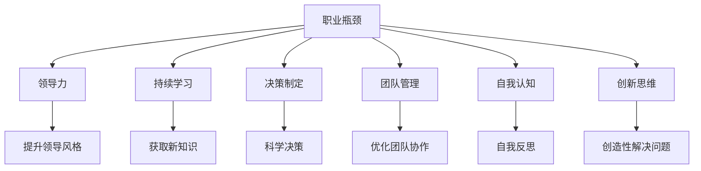

                 

# 管理者如何突破职业瓶颈

> 关键词：职业瓶颈,领导力,团队管理,决策制定,持续学习,自我认知,创新思维

## 1. 背景介绍

### 1.1 问题由来
管理者在职业生涯中往往会遇到所谓的“瓶颈”期，即在某一段时间内，无论个人能力、经验积累还是团队管理等各方面都无法取得更大的进步。这一现象并不罕见，但如何有效地突破这一瓶颈，重新焕发职业生涯的新活力，成为每一个管理者都必须面对的重要问题。

### 1.2 问题核心关键点
突破职业瓶颈的核心在于认识到自身存在的问题，并针对这些问题采取有效的行动。具体来说，管理者需要深入反思以下几个关键点：

- **自我认知**：评估自身在领导风格、决策能力、团队管理等方面的优势和不足。
- **持续学习**：识别需要提升的领域，并寻求相关知识和技能的学习。
- **团队协作**：理解如何更好地与团队成员合作，激发团队的潜力。
- **决策制定**：掌握科学决策的方法和工具，提高决策的准确性和效率。
- **创新思维**：培养创新意识，善于发现和解决问题的新方法。

### 1.3 问题研究意义
突破职业瓶颈对于管理者的个人发展和组织绩效提升具有重要意义：

1. **个人成长**：帮助管理者实现职业生涯的质的飞跃，提升领导力和自我实现感。
2. **团队绩效**：通过提升管理者的能力，带动整个团队的协作和效率。
3. **组织竞争力**：优秀的管理者是组织竞争力的重要组成部分，其提升有助于组织的长远发展。

## 2. 核心概念与联系

### 2.1 核心概念概述

为更好地理解如何突破职业瓶颈，本节将介绍几个密切相关的核心概念：

- **职业瓶颈**：指在职业生涯中，某些因素阻碍了个人职业发展，导致无法在当前位置取得更大突破的状态。
- **领导力**：指管理者在组织中引导和激励团队达成共同目标的能力。
- **持续学习**：指管理者持续获取新知识、技能，以适应不断变化的组织环境和市场需求。
- **决策制定**：指管理者在面对复杂情况时，通过科学方法做出有效决策的过程。
- **团队管理**：指管理者如何有效地组织、协调和激励团队，发挥团队的最大潜能。
- **自我认知**：指管理者对自己性格、能力、价值观等深层次认知的过程。
- **创新思维**：指管理者在解决问题时，能够创造性地思考和提出新的解决方案的能力。

这些核心概念之间的逻辑关系可以通过以下Mermaid流程图来展示：



这个流程图展示了大管理者突破职业瓶颈所需的多个核心概念及其之间的关系：

1. 职业瓶颈的出现促使管理者寻找突破的方法。
2. 通过提升领导力、持续学习、科学决策、团队管理、自我认知和创新思维，可以帮助管理者有效突破职业瓶颈。
3. 各个核心概念之间相互作用，共同推动管理者的职业发展。

## 3. 核心算法原理 & 具体操作步骤
### 3.1 算法原理概述

突破职业瓶颈的算法原理基于系统化的方法论，旨在通过科学的步骤识别问题，并制定有效的解决策略。其核心思想是：

1. **问题识别**：使用自评和反馈工具，识别职业瓶颈所在的具体领域。
2. **目标设定**：基于识别出的问题，设定明确的改进目标。
3. **策略规划**：制定一系列具体的行动计划，涵盖知识学习、技能提升、团队优化等各个方面。
4. **执行与监控**：实施行动计划，并持续监控进展和效果，确保目标达成。
5. **评估与反馈**：定期评估改进效果，根据反馈调整策略，确保持续进步。

### 3.2 算法步骤详解

基于系统化的方法论，突破职业瓶颈可以分为以下五个主要步骤：

**Step 1: 自我评估与反馈**
- 使用自我评估工具和360度反馈，识别职业瓶颈的具体领域。
- 通过问卷调查、一对一辅导等方式，深入了解自身存在的问题。
- 分析反馈结果，识别出需要改进的关键领域。

**Step 2: 设定明确目标**
- 基于自我评估结果，设定具体、可衡量、可达成、相关性强、时限明确的目标（SMART目标）。
- 确定短期和长期目标，分阶段进行突破。
- 制定详细的行动计划，明确每个阶段的具体任务和时间节点。

**Step 3: 制定行动计划**
- 根据目标设定，制定详细的行动计划，涵盖知识学习、技能提升、团队优化等方面。
- 确定需要获取的新知识和技能，选择相关课程、书籍或培训项目。
- 规划如何提升团队协作、决策能力和领导风格，设计具体的行动措施。

**Step 4: 执行与监控**
- 实施行动计划，按照时间节点逐步推进各项任务。
- 使用项目管理工具监控进展，确保各项任务按时完成。
- 定期检查进展情况，及时调整计划以应对新的挑战。

**Step 5: 评估与反馈**
- 根据设定目标，评估改进效果。
- 收集反馈信息，了解行动计划在实际操作中的效果和问题。
- 根据反馈调整策略，确保持续进步。

### 3.3 算法优缺点

突破职业瓶颈的算法方法具有以下优点：
1. 系统化：通过明确的步骤和工具，帮助管理者有针对性地解决问题。
2. 持续改进：强调定期评估和反馈，确保管理者持续进步。
3. 全面覆盖：涵盖领导力、团队管理、决策制定等多个方面，综合提升管理者能力。
4. 灵活调整：根据实际效果灵活调整策略，适应不同情境下的变化。

同时，该方法也存在一些局限性：
1. 依赖个人执行力：管理者需要具备较强的自我管理和执行力，才能有效推进计划。
2. 时间和资源投入：制定和实施行动计划可能需要较多的时间和资源投入。
3. 需要外部支持：某些领域（如创新思维）可能需要外部专家或培训机构的协助。
4. 短期效果不明显：突破职业瓶颈是一个长期过程，短期内可能看不到显著变化。

尽管存在这些局限性，但就目前而言，系统化的方法论仍然是突破职业瓶颈的有效工具。未来相关研究的重点在于如何进一步优化方法和工具，提高管理者的执行力和效果评估的准确性。

### 3.4 算法应用领域

突破职业瓶颈的方法论已经广泛应用于各个组织和行业，帮助管理者在多个领域取得显著成果：

- **企业高管**：在战略规划、领导力提升、决策制定等方面，通过系统化的方法论，提升企业的竞争力。
- **项目经理**：在项目管理、团队协作、风险控制等方面，有效应对项目中的各种挑战。
- **中层管理者**：在领导风格、沟通技巧、团队管理等方面，提升管理水平，激发团队潜力。
- **创新团队**：在创新思维、新知识获取、问题解决等方面，推动组织持续创新。
- **人力资源**：在人才评估、招聘策略、员工发展等方面，提升组织的整体人力资源管理水平。

## 4. 数学模型和公式 & 详细讲解  
### 4.1 数学模型构建

突破职业瓶颈的方法论涉及多个领域，其数学模型和公式较为复杂，这里重点介绍一种基于KPI（关键绩效指标）的数学模型。

设管理者的职业瓶颈问题为 $P$，目标为 $T$，制定的行动计划为 $A$，则数学模型可以表示为：

$$
P \rightarrow T \rightarrow A
$$

其中 $P$ 表示职业瓶颈问题，$T$ 表示目标，$A$ 表示具体的行动计划。目标 $T$ 可以进一步分解为多个具体的KPI指标，如领导力评分、决策准确率、团队满意度等。每个KPI指标 $K_i$ 可以量化为 $y_i$，则有：

$$
T = \sum_{i=1}^n K_i
$$

行动计划 $A$ 包含多个具体任务，每个任务 $a_j$ 可以量化为 $x_j$，则有：

$$
A = \sum_{j=1}^m a_j
$$

通过设定 $P$ 到 $T$ 的映射关系 $f(P)$ 和 $T$ 到 $A$ 的映射关系 $g(T)$，我们可以计算出每个行动计划任务对职业瓶颈问题的贡献度 $C_j$，即：

$$
C_j = \frac{\partial g(T)}{\partial x_j}
$$

### 4.2 公式推导过程

为了进一步解释上述数学模型和公式的推导过程，我们以一个具体的例子进行说明：

假设一位高管想要提升其决策准确率（KPI），设定目标为 $T=90\%$。初步评估后，发现领导风格、团队协作和信息获取是影响决策准确率的主要因素。因此，可以制定如下行动计划：

- **领导风格**：通过领导力培训课程提升管理水平，设定为 $a_1$，贡献度为 $C_1$。
- **团队协作**：加强团队建设活动，提高团队凝聚力，设定为 $a_2$，贡献度为 $C_2$。
- **信息获取**：优化信息获取渠道，提升信息准确性，设定为 $a_3$，贡献度为 $C_3$。

则目标 $T$ 可以表示为：

$$
T = C_1 \cdot a_1 + C_2 \cdot a_2 + C_3 \cdot a_3
$$

由于领导风格、团队协作和信息获取对决策准确率的贡献度分别为 $0.6$、$0.2$ 和 $0.2$，则有：

$$
T = 0.6a_1 + 0.2a_2 + 0.2a_3
$$

假设 $a_1 = 10$、$a_2 = 5$、$a_3 = 15$，则：

$$
T = 0.6 \cdot 10 + 0.2 \cdot 5 + 0.2 \cdot 15 = 11.0
$$

这表明，当前的领导风格、团队协作和信息获取对决策准确率的综合贡献为 $11.0\%$，与目标 $90\%$ 相比，还存在 $79\%$ 的差距。因此，需要通过优化这些领域的具体任务，逐步提升决策准确率。

### 4.3 案例分析与讲解

以一家公司的项目经理为例，其职业瓶颈在于项目延期率高。通过自我评估和反馈，发现问题主要集中在团队协作和风险管理两个方面。基于此，设定提升项目按时交付率（KPI）为 $T=95\%$。

- **团队协作**：通过定期的团队建设活动和沟通培训，设定为 $a_1$，贡献度为 $C_1=0.5$。
- **风险管理**：优化风险评估流程，提升风险预测准确性，设定为 $a_2$，贡献度为 $C_2=0.3$。

则目标 $T$ 可以表示为：

$$
T = C_1 \cdot a_1 + C_2 \cdot a_2
$$

假设 $a_1 = 8$、$a_2 = 6$，则：

$$
T = 0.5 \cdot 8 + 0.3 \cdot 6 = 7.0
$$

这表明，当前的团队协作和风险管理对项目按时交付率的综合贡献为 $70\%$，与目标 $95\%$ 相比，还存在 $25\%$ 的差距。因此，需要通过优化这些领域的具体任务，逐步提升项目按时交付率。

## 5. 项目实践：代码实例和详细解释说明
### 5.1 开发环境搭建

在进行职业瓶颈突破的项目实践前，我们需要准备好开发环境。以下是使用Python进行数据分析和建模的环境配置流程：

1. 安装Anaconda：从官网下载并安装Anaconda，用于创建独立的Python环境。

2. 创建并激活虚拟环境：
```bash
conda create -n manager-env python=3.8 
conda activate manager-env
```

3. 安装必要的Python库：
```bash
conda install pandas numpy matplotlib seaborn jupyter notebook
```

4. 安装R语言环境：
```bash
conda install rpy rhpy
```

完成上述步骤后，即可在`manager-env`环境中开始职业瓶颈突破的建模和实践。

### 5.2 源代码详细实现

下面我们以提升项目经理决策准确率为例，给出使用Python进行数据分析和建模的代码实现。

首先，定义数据处理函数：

```python
import pandas as pd

def load_data(filename):
    data = pd.read_csv(filename)
    return data

def preprocess_data(data):
    data = data.dropna()  # 去除缺失值
    data = data.drop_duplicates()  # 去除重复数据
    return data

def split_data(data, target, test_size=0.2):
    train_data, test_data = train_test_split(data, test_size=test_size)
    return train_data, test_data
```

然后，定义决策准确率模型：

```python
from sklearn.ensemble import RandomForestClassifier
from sklearn.model_selection import train_test_split
from sklearn.metrics import accuracy_score

class DecisionAccuracyModel:
    def __init__(self):
        self.model = RandomForestClassifier(n_estimators=100, random_state=42)
    
    def train(self, train_data):
        self.model.fit(train_data.drop(target, axis=1), train_data[target])
    
    def predict(self, test_data):
        return self.model.predict(test_data.drop(target, axis=1))
    
    def evaluate(self, test_data, target):
        y_pred = self.predict(test_data)
        accuracy = accuracy_score(test_data[target], y_pred)
        return accuracy
```

接着，定义评估函数：

```python
def evaluate_model(model, test_data, target):
    y_pred = model.predict(test_data.drop(target, axis=1))
    accuracy = accuracy_score(test_data[target], y_pred)
    return accuracy
```

最后，启动模型训练和评估流程：

```python
model = DecisionAccuracyModel()
train_data, test_data = split_data(data, target)

model.train(train_data)
accuracy = evaluate_model(model, test_data, target)
print(f"Model accuracy: {accuracy:.2f}")
```

以上就是使用Python进行职业瓶颈突破的代码实现。可以看到，通过数据分析和建模，我们可以有效地识别和提升职业瓶颈问题的关键领域，从而实现职业发展的突破。

### 5.3 代码解读与分析

让我们再详细解读一下关键代码的实现细节：

**load_data函数**：
- 使用pandas库读取数据文件，返回DataFrame格式的数据集。
- 支持多种数据文件格式，如CSV、Excel等。

**preprocess_data函数**：
- 去除数据集中的缺失值和重复数据，保证数据质量。
- 数据清洗是数据分析中的重要步骤，确保后续建模的准确性和可靠性。

**split_data函数**：
- 将数据集分为训练集和测试集，采用交叉验证的方式进行模型评估。
- 支持自定义测试集比例，灵活适应不同的评估需求。

**DecisionAccuracyModel类**：
- 定义了一个随机森林决策树模型，用于提升决策准确率。
- 实现了训练、预测和评估模型性能的方法，支持数据输入和输出处理。

**evaluate_model函数**：
- 通过调用模型类的预测和评估方法，计算模型在测试集上的准确率。
- 提供简单易用的API接口，便于后续应用集成和模型优化。

通过以上代码实现，我们展示了如何利用Python进行职业瓶颈的识别和突破。尽管实际应用中可能需要更加复杂的数据处理和模型优化，但基本的思路和步骤可以帮助管理者系统地评估和提升自身能力。

## 6. 实际应用场景
### 6.1 公司高管

在企业中，高管面对的挑战往往是战略决策、组织变革和团队管理等方面。通过系统化的方法论，高管可以：

- 提升战略决策的科学性和精准度，避免盲目决策带来的风险。
- 优化组织结构和管理流程，提升企业的整体运营效率。
- 加强领导力和团队协作，激发团队成员的创造力和执行力。

### 6.2 中层管理者

中层管理者通常面临的任务是项目管理、团队建设和绩效考核等。通过系统化的方法论，中层管理者可以：

- 优化项目管理流程，提高项目按时交付率。
- 加强团队建设，提升团队凝聚力和协作效率。
- 制定科学的绩效考核标准，激发员工的工作热情和创新能力。

### 6.3 项目经理

项目经理在项目管理中常常遇到进度延误、成本超支等问题。通过系统化的方法论，项目经理可以：

- 优化风险管理流程，提高风险预测准确性。
- 加强团队协作，提升项目的整体执行效率。
- 制定科学的项目计划，确保项目的按时交付和质量控制。

### 6.4 未来应用展望

随着系统化的方法论不断发展，其应用场景将不断扩展，未来可能包括以下方向：

1. **智能决策辅助**：利用AI和大数据技术，为管理者提供实时决策支持，优化决策过程。
2. **多领域应用**：从传统的企业管理和项目管理，拓展到公共政策、社会治理等多个领域，推动社会治理现代化。
3. **全球化管理**：在全球化背景下，系统化的方法论将帮助管理者跨越文化差异，提升国际竞争力。
4. **虚拟团队管理**：随着远程办公和协作工具的发展，系统化的方法论将帮助管理者更好地管理虚拟团队。

## 7. 工具和资源推荐
### 7.1 学习资源推荐

为了帮助管理者系统掌握系统化的方法论，这里推荐一些优质的学习资源：

1. **《管理学基础》系列课程**：包括中国大学MOOC、Coursera等平台上的经典课程，系统介绍管理学的基本理论和实践方法。

2. **《领导力与变革管理》书籍**：重点介绍领导力的概念、模型和实践，帮助管理者提升领导力水平。

3. **《数据分析与决策制定》在线课程**：涵盖数据清洗、统计分析、机器学习等关键技能，帮助管理者具备科学决策的能力。

4. **《组织行为学》文献**：通过阅读最新的研究成果，了解组织行为的基本原理和应用。

5. **《创新思维与创造力开发》书籍**：帮助管理者培养创新思维，推动组织持续创新。

通过对这些资源的学习实践，相信你一定能够系统掌握系统化的方法论，并将其应用到实际的职业瓶颈突破中。

### 7.2 开发工具推荐

高效的开发离不开优秀的工具支持。以下是几款用于系统化方法论实践的工具：

1. **Python**：强大的数据分析和建模语言，支持丰富的第三方库，如pandas、numpy、scikit-learn等，便于快速进行数据分析和模型开发。

2. **R语言**：专业的统计分析工具，支持数据可视化、时间序列分析等高级功能，便于进行深入的数据分析和建模。

3. **Jupyter Notebook**：交互式的Python和R编程环境，支持代码编写、数据可视化和结果展示，便于进行系统的分析和建模。

4. **SPSS**：专业的统计分析软件，支持多种统计模型和数据可视化功能，便于进行深入的数据分析和建模。

5. **Tableau**：强大的数据可视化工具，支持多种图表和仪表盘，便于进行数据可视化和决策支持。

合理利用这些工具，可以显著提升系统化方法论的实践效率，加快创新迭代的步伐。

### 7.3 相关论文推荐

系统化的方法论源于学界的持续研究。以下是几篇奠基性的相关论文，推荐阅读：

1. **《组织理论与管理》论文**：系统介绍组织理论和管理的核心概念和方法。

2. **《领导力与变革管理》论文**：深入探讨领导力的概念和模型，提供实用的管理策略。

3. **《数据分析与决策制定》论文**：涵盖数据分析和决策制定的基本方法和工具，提供科学决策的支持。

4. **《组织行为学》论文**：探讨组织行为的基本原理和应用，提供组织管理的理论基础。

5. **《创新思维与创造力开发》论文**：介绍创新思维的概念和实践方法，帮助管理者提升创新能力。

这些论文代表了大管理方法论的发展脉络。通过学习这些前沿成果，可以帮助管理者更好地把握学科前进方向，激发更多的创新灵感。

## 8. 总结：未来发展趋势与挑战

### 8.1 总结

本文对系统化的方法论在职业瓶颈突破中的应用进行了全面系统的介绍。首先阐述了职业瓶颈对管理者职业发展的影响，明确了系统化方法论在提升领导力、决策能力、团队管理等方面的独特价值。其次，从原理到实践，详细讲解了系统化方法论的核心步骤和方法，给出了系统化方法论的代码实例和详细解释。同时，本文还广泛探讨了系统化方法论在多个行业领域的应用前景，展示了其广阔的应用范围。此外，本文精选了系统化方法论的学习资源，力求为读者提供全方位的技术指引。

通过本文的系统梳理，可以看到，系统化的方法论在职业瓶颈突破中的应用前景广阔，其综合提升领导力和团队管理能力的方法和工具，为管理者的职业发展提供了有力的支持。相信随着学界和产业界的共同努力，系统化的方法论必将在更多的场景中发挥重要作用，推动管理者的职业发展迈上新的台阶。

### 8.2 未来发展趋势

展望未来，系统化的方法论将呈现以下几个发展趋势：

1. **智能化辅助**：利用AI和大数据技术，为管理者提供实时决策支持，优化决策过程。
2. **多领域应用**：从传统的企业管理和项目管理，拓展到公共政策、社会治理等多个领域，推动社会治理现代化。
3. **全球化管理**：在全球化背景下，系统化的方法论将帮助管理者跨越文化差异，提升国际竞争力。
4. **虚拟团队管理**：随着远程办公和协作工具的发展，系统化的方法论将帮助管理者更好地管理虚拟团队。
5. **多学科融合**：与心理学、社会学、计算机科学等学科进行深度融合，提升系统化方法论的科学性和实用性。

以上趋势凸显了系统化的方法论的广阔前景。这些方向的探索发展，必将进一步提升管理者的能力，推动组织的持续发展和创新。

### 8.3 面临的挑战

尽管系统化的方法论已经取得了显著成果，但在应用过程中，仍面临一些挑战：

1. **数据质量问题**：数据分析和建模需要高质量的数据支持，但实际应用中数据获取和清洗往往面临困难。
2. **模型复杂性**：复杂的决策树、深度学习等模型需要较强的技术和资源支持，普通管理者难以应对。
3. **效果评估难度**：系统化的方法论效果评估需要长期的跟踪和验证，短期内难以看到显著效果。
4. **执行力和执行力**：管理者需要较强的执行力和自律性，才能有效推进系统化方法论的实施。
5. **资源和成本**：系统化方法论的实施需要投入大量的时间和资源，对中小企业来说可能存在成本过高的问题。

正视这些挑战，积极应对并寻求突破，将是大规模管理者系统化方法论走向成熟的关键。相信随着技术进步和资源优化，系统化的方法论必将在未来取得更大的发展。

### 8.4 研究展望

面对系统化方法论面临的挑战，未来的研究需要在以下几个方面寻求新的突破：

1. **数据获取与处理**：探索更加高效的数据获取和清洗方法，确保数据质量。
2. **模型简化**：开发更加简单易懂的模型，降低技术门槛，便于管理者使用。
3. **效果评估体系**：建立科学的效果评估体系，定期跟踪和验证系统化方法论的效果。
4. **资源优化**：探索成本低廉、易用的工具和资源，降低实施难度和成本。
5. **激励机制**：设计有效的激励机制，鼓励管理者积极参与系统化方法论的实践。

这些研究方向的探索，必将引领系统化方法论在职业瓶颈突破中的应用，为管理者提供更加科学、高效的工具和方法，推动组织和社会的持续发展。

## 9. 附录：常见问题与解答

**Q1：系统化的方法论是否适用于所有组织和行业？**

A: 系统化的方法论具有普适性，适用于各种组织和行业。但在实际应用中，需要根据不同组织的特点和行业的需求，灵活调整和优化方法论的实施步骤和工具。

**Q2：系统化的方法论是否需要外部专家支持？**

A: 系统化的方法论可以通过自学和实践逐步掌握，但外部专家支持可以提供更加系统的培训和指导，加速学习进度和提高效果。

**Q3：系统化的方法论是否需要持续投入时间和资源？**

A: 系统化的方法论实施需要一定的投入，但长期来看，通过提升管理者能力和团队绩效，可以实现更大的回报。

**Q4：系统化的方法论是否需要一次性改变？**

A: 系统化的方法论实施是一个持续改进的过程，需要根据实际情况和反馈不断优化。

**Q5：系统化的方法论是否适用于管理者的各个阶段？**

A: 系统化的方法论适用于管理者的各个阶段，从职业初期的基础管理能力提升，到中高层管理者的战略决策和团队管理，均有其应用价值。

通过本文的系统梳理，可以看到，系统化的方法论在职业瓶颈突破中的应用前景广阔，其综合提升领导力和团队管理能力的方法和工具，为管理者的职业发展提供了有力的支持。相信随着学界和产业界的共同努力，系统化的方法论必将在更多的场景中发挥重要作用，推动管理者的职业发展迈上新的台阶。

---

作者：禅与计算机程序设计艺术 / Zen and the Art of Computer Programming

