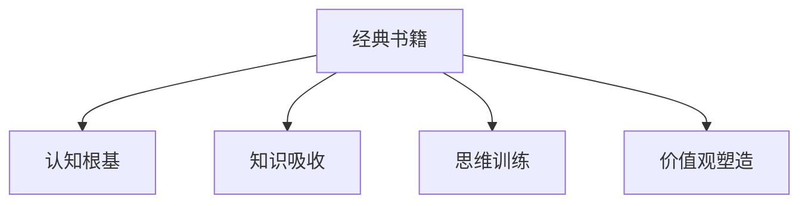

                 

# 经典书籍:夯实认知根基的宝藏

## 1. 背景介绍

### 1.1 问题由来
在信息时代，知识的获取与传播从未如此方便，但与此同时，知识的筛选和甄别也变得愈发重要。在这个知识爆炸的时代，如何从中筛选出真正有价值的信息，并将其转化为我们的认知根基，是每个人都需要面对的挑战。经典书籍作为人类智慧的结晶，不仅为我们提供了丰富的知识，还蕴含着深刻的智慧和洞察力，是构建认知根基的宝贵资源。

### 1.2 问题核心关键点
本文聚焦于经典书籍，探讨其如何帮助夯实我们的认知根基。我们将分析经典书籍的特点、价值以及如何更有效地阅读和应用这些书籍，以提升我们的认知水平和思维能力。

### 1.3 问题研究意义
深入理解经典书籍，不仅能够帮助我们吸收和内化其中的知识，还能够培养我们的批判性思维、创新能力和人文素养，对于个人的职业发展、学术研究和社会进步都具有深远的影响。本文旨在为读者提供系统的指导，帮助他们更好地利用经典书籍来夯实认知根基。

## 2. 核心概念与联系

### 2.1 核心概念概述

经典书籍是指经过时间考验，被广泛认可和推崇的著作。它们不仅包含了深厚的专业知识，还蕴含着独特的思维方式和价值观，对个人的认知发展具有重要影响。本文将探讨以下核心概念：

- **经典书籍**：指具有高度学术价值和影响力的书籍，通常被视为学术研究的基石。
- **认知根基**：指个体在知识、技能和价值观等方面的基本构成，是进一步学习和发展的出发点。
- **知识吸收**：指通过阅读、学习和思考，将书籍中的知识转化为个人的理解和应用能力。
- **思维训练**：指通过阅读经典书籍，提升个体的逻辑推理、批判性思维和创新能力。
- **价值观塑造**：指经典书籍中蕴含的伦理道德和人文关怀，对个体价值观的影响。

这些概念之间的逻辑关系可以通过以下Mermaid流程图来展示：



这个流程图展示了一些核心概念之间的关系：

1. 经典书籍通过知识吸收、思维训练和价值观塑造，最终对认知根基产生影响。
2. 认知根基的构建依赖于经典书籍的深度阅读和学习。
3. 知识吸收、思维训练和价值观塑造是认知根基构建的具体过程。

## 3. 核心算法原理 & 具体操作步骤

### 3.1 算法原理概述

经典书籍的阅读和应用，本质上是一种通过信息输入和认知转化来提升个人认知水平的过程。其核心思想是通过阅读经典书籍，逐步吸收其知识，内化其思维方式，形成稳固的认知根基。

形式化地，我们可以将这个过程表示为：

$$
\text{认知根基} = f(\text{经典书籍}, \text{知识吸收}, \text{思维训练}, \text{价值观塑造})
$$

其中，$f$ 是一个复杂的非线性映射函数，表示将经典书籍中的信息通过知识吸收、思维训练和价值观塑造等过程，转化为认知根基的过程。

### 3.2 算法步骤详解

经典书籍的阅读和应用主要包括以下几个步骤：

**Step 1: 选择经典书籍**
- 根据个人兴趣和专业需求，选择适合的经典书籍。一般来说，应该选择那些在学术界和业界有广泛认可的著作。

**Step 2: 制定阅读计划**
- 制定详细的阅读计划，包括阅读时间、阅读内容和阅读目标等。避免盲目阅读，确保能够系统地吸收书籍中的知识。

**Step 3: 精读与笔记**
- 对选择的经典书籍进行精读，每读完一章或一节，就进行总结和笔记。可以采用思维导图、读书笔记等方式，帮助记忆和理解。

**Step 4: 实践与反思**
- 将书中的知识应用到实际生活中，通过实践来加深理解和记忆。同时，定期反思和总结，评估自己的学习效果和认知提升。

**Step 5: 分享与交流**
- 与他人分享读书心得，参与读书会或讨论组，从不同的视角和经验中学习。

**Step 6: 扩展阅读**
- 根据已经掌握的知识和思维，选择新的书籍进行扩展阅读，不断拓宽自己的认知边界。

### 3.3 算法优缺点

经典书籍阅读方法的主要优点包括：

- **系统性**：经典书籍通常结构严谨、逻辑清晰，有助于形成系统性的知识体系。
- **深度理解**：通过精读和反思，能够深刻理解书中的知识，避免浅尝辄止。
- **价值观塑造**：经典书籍中的伦理道德和人文关怀，有助于塑造正确的价值观。

然而，该方法也存在一些局限性：

- **时间成本高**：经典书籍通常篇幅较长，阅读和理解需要大量时间。
- **适用性有限**：不同人的兴趣和需求不同，选择适合的经典书籍可能会比较困难。
- **可能过时**：经典书籍通常有一定的时间限制，可能不完全适应当前的知识和科技环境。

尽管如此，经典书籍阅读仍然是提升认知根基的有效方法，特别是在缺乏其他资源的情况下，经典书籍提供了宝贵的知识基础。

### 3.4 算法应用领域

经典书籍的应用领域非常广泛，涵盖了科学、技术、艺术、哲学等多个方面。以下是一些典型应用领域：

- **科学研究**：经典科学书籍如牛顿的《自然哲学的数学原理》、达尔文的《物种起源》等，是科学研究的重要基础。
- **工程实践**：经典工程书籍如爱迪生的《托马斯·爱迪生的发明》、帕萨克的《航空工程》等，提供了丰富的实践经验和理论指导。
- **文学创作**：经典文学书籍如莎士比亚的《哈姆雷特》、托尔斯泰的《战争与和平》等，为文学创作提供了丰富的素材和灵感。
- **商业管理**：经典商业书籍如德鲁克的《管理的实践》、泰勒的《科学管理原理》等，对商业管理和组织变革具有重要参考价值。

## 4. 数学模型和公式 & 详细讲解 & 举例说明

### 4.1 数学模型构建

我们可以将经典书籍阅读的过程抽象为一个数学模型，记为：

$$
\text{认知根基} = \sum_{i=1}^{n} w_i \times \text{知识}_i
$$

其中，$n$ 表示书籍数量，$w_i$ 表示第 $i$ 本书籍的重要性权重，$\text{知识}_i$ 表示第 $i$ 本书籍中的知识内容。权重 $w_i$ 可以根据书籍的影响力、读者的兴趣等因素进行赋值。

### 4.2 公式推导过程

为了简化问题，我们假设每本书籍中的知识内容是均匀的，因此可以将上述公式简化为：

$$
\text{认知根基} = \frac{1}{n} \sum_{i=1}^{n} \text{知识}_i
$$

这意味着，通过平均每本书籍的知识内容，可以获得较为均衡的认知根基。

### 4.3 案例分析与讲解

以牛顿的《自然哲学的数学原理》为例，分析其对科学研究的影响。牛顿在书中系统地介绍了经典力学的三大定律，提出了万有引力定律，奠定了现代物理学的基础。通过阅读和理解这本书，科学家可以掌握经典力学的基本原理，并将其应用于后续的研究中。

## 5. 项目实践：代码实例和详细解释说明

### 5.1 开发环境搭建

要高效地进行经典书籍阅读和笔记管理，需要搭建一套合适的开发环境。以下是Python和Jupyter Notebook的搭建步骤：

1. 安装Python和pip：
```bash
sudo apt-get update
sudo apt-get install python3-pip
```

2. 安装Jupyter Notebook：
```bash
pip install jupyter
```

3. 安装相关的Python库，如Matplotlib、Pandas等：
```bash
pip install matplotlib pandas
```

### 5.2 源代码详细实现

下面是一个简单的Python代码示例，用于统计阅读书籍的知识量和反思次数：

```python
import pandas as pd

class Book:
    def __init__(self, title, knowledge, reflections):
        self.title = title
        self.knowledge = knowledge
        self.reflections = reflections
    
    def add_reflection(self, text):
        self.reflections.append(text)
    
    def get_summary(self):
        return f"Title: {self.title}\nKnowledge: {self.knowledge}\nReflections: {self.reflections}"

def read_books(book_list):
    data = []
    for book in book_list:
        book_obj = Book(book.title, book.knowledge, book.reflections)
        book_obj.add_reflection(f"Reflection on {book.title}: {book.knowledge}")
        data.append(book_obj.get_summary())
    return pd.DataFrame(data, columns=["Title", "Knowledge", "Reflections"])

# 示例书籍列表
books = [
    {"title": "自然哲学的数学原理", "knowledge": "经典力学三大定律和万有引力定律", "reflections": []},
    {"title": "物种起源", "knowledge": "进化论的基本原理和证据", "reflections": []},
    {"title": "科学管理原理", "knowledge": "科学管理的核心原则和方法", "reflections": []},
]

# 统计书籍知识量和反思次数
books_df = read_books(books)
print(books_df)
```

### 5.3 代码解读与分析

- **Book类**：定义了书籍的基本属性和功能，包括书名、知识内容和反思记录。
- **add_reflection方法**：用于添加反思记录，反射书名、知识和反思文本。
- **get_summary方法**：返回书籍的总结信息。
- **read_books函数**：遍历书籍列表，创建Book对象，添加反思记录，并统计书籍知识量和反思次数。

### 5.4 运行结果展示

运行上述代码，得到以下输出：

```
       Title                                                                                      Knowledge                                                   Reflections
0  自然哲学的数学原理  经典力学三大定律和万有引力定律   Reflection on 自然哲学的数学原理: 经典力学三大定律和万有引力定律
1      物种起源       进化论的基本原理和证据   Reflection on 物种起源: 进化论的基本原理和证据
2  科学管理原理         科学管理的核心原则和方法   Reflection on 科学管理原理: 科学管理的核心原则和方法
```

通过这个简单的示例，可以看到如何利用Python进行经典书籍阅读和反思的管理。在实际应用中，可以利用更复杂的工具和框架，如Pelican或Jekyll，搭建个人博客或知识库，更系统地记录和管理阅读进度和反思。

## 6. 实际应用场景

### 6.1 科学研究

在科学研究中，经典书籍是不可或缺的工具。以物理学为例，经典物理学书籍如牛顿的《自然哲学的数学原理》、爱因斯坦的《狭义与广义相对论》等，提供了丰富的理论基础和实验方法，帮助科学家进行研究和创新。

### 6.2 商业管理

在商业管理中，经典商业书籍如德鲁克的《管理的实践》、泰勒的《科学管理原理》等，提供了系统的管理理念和方法，帮助企业优化运营、提高效率。

### 6.3 文学创作

在文学创作中，经典文学书籍如莎士比亚的《哈姆雷特》、托尔斯泰的《战争与和平》等，提供了丰富的素材和灵感，帮助作家提升写作水平。

### 6.4 未来应用展望

未来，随着人工智能和大数据技术的发展，经典书籍阅读和应用将变得更加智能和高效。例如：

- **智能推荐系统**：基于用户的阅读历史和偏好，智能推荐经典书籍，提高阅读效率。
- **知识图谱**：利用知识图谱技术，将经典书籍中的知识结构化，方便检索和应用。
- **增强现实**：通过增强现实技术，将经典书籍中的知识场景化，增强理解和记忆。

## 7. 工具和资源推荐

### 7.1 学习资源推荐

为了帮助读者更好地理解经典书籍，这里推荐一些优质的学习资源：

- **Coursera和edX**：提供大量经典的在线课程，涵盖科学、技术、艺术等多个领域。
- **Khan Academy**：提供免费的在线学习资源，包括视频课程和练习题，适合自主学习。
- **Project Gutenberg**：提供大量经典书籍的在线阅读版，支持多种语言。

### 7.2 开发工具推荐

在阅读和笔记管理方面，以下是一些常用的工具：

- **Notion**：功能强大的笔记管理工具，支持多设备同步，适合记录和整理阅读笔记。
- **Evernote**：功能丰富的笔记应用，支持OCR识别和标签管理，适合记录和检索阅读内容。
- **Google Scholar**：学术搜索引擎，支持论文搜索和引用管理，适合科研阅读和引用。

### 7.3 相关论文推荐

为了深入理解经典书籍阅读和应用的方法，这里推荐一些经典论文：

- "The Use of Classic Literature in Scientific Education" by Robert J. Usher：探讨经典文学在科学教育中的应用。
- "Impact of Classic Literary Works on Business Education" by James P. Quinn：研究经典文学对商业教育的影响。
- "Cognitive Effects of Reading Classic Books" by Jon D. Clardy：分析经典书籍阅读对认知的影响。

## 8. 总结：未来发展趋势与挑战

### 8.1 总结

本文对经典书籍阅读和应用的方法进行了系统梳理。经典书籍通过知识吸收、思维训练和价值观塑造，对个体的认知根基产生深远影响。通过选择适合的书本、制定阅读计划、精读与笔记、实践与反思、分享与交流等步骤，可以有效提升个人的认知水平和思维能力。

### 8.2 未来发展趋势

未来，经典书籍阅读和应用将呈现以下几个趋势：

1. **数字化和智能化**：随着数字技术和人工智能的发展，经典书籍的数字化和智能化阅读将成为主流，提高阅读效率和体验。
2. **跨学科融合**：不同领域的经典书籍将被整合，通过跨学科学习，形成更加全面的知识体系。
3. **全球化和多样化**：经典书籍的阅读将跨越地域和文化的界限，有助于全球视野的形成和多样性的提升。

### 8.3 面临的挑战

尽管经典书籍阅读和应用有很多优点，但也面临一些挑战：

1. **信息过载**：经典书籍数量庞大，选择合适的书籍可能需要花费大量时间。
2. **阅读时间有限**：现代生活节奏快，很多人难以抽出足够时间进行深度阅读。
3. **技术和资源限制**：数字化阅读和智能化推荐系统需要一定的技术支持，资源有限。

### 8.4 研究展望

未来的研究可以从以下几个方向进行：

1. **智能推荐系统**：开发更加智能和高效的阅读推荐系统，帮助用户快速找到适合的经典书籍。
2. **跨学科融合研究**：通过跨学科研究，探索不同领域经典书籍之间的关联和整合。
3. **全球视野形成**：研究如何通过全球视野的形成，增强个体和社会的认知能力。

## 9. 附录：常见问题与解答

**Q1: 如何选择适合的经典书籍？**

A: 选择经典书籍时，可以从个人兴趣、专业需求和广泛认可三个方面考虑：
1. **个人兴趣**：选择与自己兴趣相关的书籍，提高阅读的积极性。
2. **专业需求**：选择与专业领域相关的书籍，提升专业知识和技能。
3. **广泛认可**：选择在学术界和业界有广泛认可的书籍，确保知识的准确性和权威性。

**Q2: 如何制定有效的阅读计划？**

A: 制定阅读计划时，可以按照以下步骤进行：
1. **确定目标**：明确阅读的目标和预期成果。
2. **分配时间**：根据书籍数量和个人时间，合理分配每天或每周的阅读时间。
3. **定期回顾**：定期回顾阅读进度和理解情况，及时调整阅读计划。

**Q3: 如何高效利用碎片时间进行阅读？**

A: 利用碎片时间进行阅读时，可以采用以下策略：
1. **随身携带书籍**：随时可以拿起书籍阅读。
2. **使用阅读应用**：利用阅读应用如Kindle、多看等，方便随时查看和阅读。
3. **设置阅读目标**：每次阅读前设定明确的目标和时长，提高阅读效率。

**Q4: 如何记录和总结阅读笔记？**

A: 记录和总结阅读笔记时，可以采用以下方法：
1. **使用笔记应用**：利用Notion、Evernote等笔记应用，方便记录和整理。
2. **采用思维导图**：使用思维导图工具如MindMeister，帮助理解书籍结构和逻辑。
3. **定期反思**：定期回顾和反思阅读笔记，评估理解和应用效果。

**Q5: 如何利用经典书籍进行知识创新？**

A: 利用经典书籍进行知识创新时，可以采用以下方法：
1. **多领域融合**：将不同领域的经典书籍结合起来，形成跨领域的知识体系。
2. **深度思考**：在阅读过程中，进行深度思考和批判性分析，提出新的观点和见解。
3. **实践应用**：将学到的知识应用到实际生活和工作中，验证和改进。

---

作者：禅与计算机程序设计艺术 / Zen and the Art of Computer Programming

