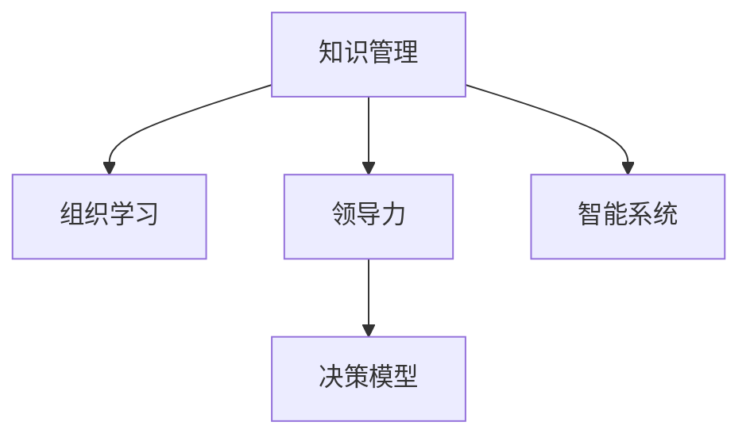

                 

# 经典书籍:管理者构建知识体系的基石

> 关键词：知识管理、组织学习、领导力、决策模型、智能系统

## 1. 背景介绍

### 1.1 问题由来

在现代商业环境中，知识的获取、利用和创新是企业成功的关键。然而，随着企业规模的扩大和业务的复杂化，知识的有效管理变得越来越困难。如何构建一个高效、灵活、可持续的知识体系，成为了管理者面临的一个重大挑战。本文将从组织学习、领导力、决策模型等多个角度，探讨管理者如何构建知识体系，实现企业的持续发展。

### 1.2 问题核心关键点

构建知识体系的核心在于如何将企业内部的显性和隐性知识进行有效的整合和利用，形成系统的知识结构，支持企业的决策和创新。核心关键点包括：

- **知识分类与结构化**：对企业内部知识进行分类，建立层级结构，便于检索和利用。
- **知识管理工具**：利用知识管理系统(KMS)，对知识进行编码、存储、共享和协作。
- **组织学习与知识传递**：通过各种机制，促进知识的传递与更新，形成企业内部的学习循环。
- **领导力的作用**：领导者的知识分享、指导和激励，对知识体系的构建和维护至关重要。
- **决策模型与智能系统**：将知识体系与决策模型结合，提升企业的决策效率和质量。

## 2. 核心概念与联系

### 2.1 核心概念概述

为更好地理解管理者构建知识体系的过程，本节将介绍几个密切相关的核心概念：

- **知识管理(Knowledge Management, KMS)**：通过信息技术手段，管理和利用组织内外的显性知识和隐性知识，实现知识的高效流动和利用。
- **组织学习(Organizational Learning)**：企业通过内部和外部的信息反馈，不断调整其行为和知识结构，以适应环境变化的过程。
- **领导力(Leadership)**：管理者通过自身的影响力和行为，引导和激励员工，推动组织目标的实现。
- **决策模型(Decision Model)**：通过结构化的方法，分析和评估各种决策选项，辅助管理者做出明智的决策。
- **智能系统(Intelligent System)**：结合人工智能、大数据等技术，实现知识的高效处理和分析，提升决策效率和质量。

这些核心概念之间的逻辑关系可以通过以下Mermaid流程图来展示：



这个流程图展示了这个知识体系构建的核心概念及其之间的关系：

1. 知识管理是整个体系的基础，通过工具和技术手段，实现知识的存储和共享。
2. 组织学习建立在知识管理的基础上，通过知识的积累和传递，推动企业的持续进步。
3. 领导力在组织学习过程中发挥关键作用，通过引导和激励，推动知识的流动和应用。
4. 决策模型将知识体系与决策过程结合起来，提升决策的科学性和效率。
5. 智能系统通过先进的技术手段，进一步优化知识管理和决策过程。

## 3. 核心算法原理 & 具体操作步骤

### 3.1 算法原理概述

管理者构建知识体系的过程，本质上是一个基于知识的组织学习和知识传递的循环。其核心思想是：通过有效的知识管理工具和机制，将组织内的显性和隐性知识进行整合和利用，形成系统的知识结构。同时，通过组织学习和领导力，不断更新和优化知识体系，支持企业的决策和创新。

形式化地，假设企业内部存在显性知识库 $K_{exp}$ 和隐性知识库 $K_{imp}$，构建知识体系的目标是最小化知识损失和提升知识利用效率，即找到最优的知识结构 $S$：

$$
S^* = \mathop{\arg\min}_{S} \{ \text{Loss}(S) + \text{Efficiency}(S) \}
$$

其中 $\text{Loss}(S)$ 表示知识库 $K_{exp}$ 和 $K_{imp}$ 之间的差异度量，$\text{Efficiency}(S)$ 表示知识结构 $S$ 的利用效率。通过梯度下降等优化算法，不断调整知识结构，最小化上述目标函数，最终得到理想的知识体系。

### 3.2 算法步骤详解

管理者构建知识体系的一般步骤包括：

**Step 1: 知识分类与结构化**
- 对企业内部的显性知识和隐性知识进行分类，建立知识分类体系。
- 根据知识的重要性和应用场景，建立知识结构，划分层级和权限。

**Step 2: 知识管理工具**
- 选择或定制知识管理工具，支持知识编码、存储、检索和共享。
- 通过KMS，实现知识的集中管理和协作，形成知识中心。

**Step 3: 组织学习与知识传递**
- 设计组织学习的机制，如知识分享会议、知识竞赛、内部博客等，促进知识的内部传递。
- 建立知识反馈机制，通过调查问卷、员工反馈等方式，收集知识应用的效果和改进建议。
- 利用知识地图和知识导航工具，帮助员工快速定位和利用知识。

**Step 4: 领导力与激励机制**
- 发挥领导者的榜样作用，通过演讲、分享、培训等方式，引导和激励员工参与知识管理。
- 设计激励机制，如知识贡献奖、最佳知识分享奖等，奖励知识贡献者。

**Step 5: 决策模型与智能系统**
- 将知识体系与决策模型结合，设计知识驱动的决策支持系统。
- 应用大数据、AI等技术，构建智能决策平台，辅助管理者的决策过程。

**Step 6: 持续优化与创新**
- 定期评估知识体系的效果，识别改进点，进行持续优化。
- 建立创新机制，鼓励员工提出新想法和新技术，推动知识体系不断进步。

### 3.3 算法优缺点

构建知识体系的方法具有以下优点：
1. 系统化知识管理：通过结构化的知识分类和存储，方便知识的检索和利用。
2. 促进组织学习：通过知识共享和反馈机制，不断更新和优化知识体系。
3. 提升决策质量：将知识体系与决策模型结合，辅助管理者做出科学决策。
4. 激励员工参与：通过领导力和激励机制，激发员工的积极性和创造性。
5. 结合智能系统：利用先进技术手段，提高知识管理和决策的效率。

同时，该方法也存在一些局限性：
1. 初始投资较大：建设知识管理系统和智能平台需要较大的初期投资。
2. 数据质量依赖：知识体系的构建依赖于高质量的数据，如果数据质量不高，可能影响效果。
3. 文化转变难度：改变企业文化和员工习惯需要较长时间，短期内可能遇到阻力。
4. 维护成本高：知识体系需要持续维护和更新，维护成本较高。
5. 知识过载问题：如果知识库过于庞大，员工可能面临知识过载的问题，难以有效利用。

尽管存在这些局限性，但构建知识体系仍然是现代企业管理的重要方向。未来相关研究的重点在于如何进一步降低成本，提高知识管理的效率和效果，同时兼顾可持续性和灵活性。

### 3.4 算法应用领域

构建知识体系的方法已经在诸多领域得到了广泛应用，例如：

- 金融行业：通过知识管理工具和智能系统，支持复杂的金融决策和风险管理。
- 医疗行业：利用知识库和智能诊断系统，提升医疗服务的质量和效率。
- 制造业：建立知识驱动的生产管理系统，优化生产流程和质量控制。
- 教育行业：通过知识共享和在线学习平台，推动教育的普及和创新。
- 物流行业：构建智能物流知识体系，优化供应链管理和物流运营。

除了上述这些典型领域外，知识体系构建的理念和方法也在不断拓展到更多场景中，如智慧城市、智能家居、智能交通等，为企业和社会的可持续发展提供新的动力。

## 4. 数学模型和公式 & 详细讲解  
### 4.1 数学模型构建

本节将使用数学语言对管理者构建知识体系的过程进行更加严格的刻画。

假设企业内部存在显性知识库 $K_{exp}$ 和隐性知识库 $K_{imp}$，构建知识体系的目标是最小化知识损失和提升知识利用效率。

定义知识库之间的差异度量为 $\text{Loss}(S)$，知识结构 $S$ 的利用效率为 $\text{Efficiency}(S)$。知识损失可以通过信息熵来衡量，知识效率可以通过知识应用的效果来评估。

知识损失的计算公式为：

$$
\text{Loss}(S) = -\frac{1}{N} \sum_{i=1}^N p_i \log p_i
$$

其中 $p_i$ 表示知识库 $K_{imp}$ 中第 $i$ 类知识在知识库 $K_{exp}$ 中的出现概率。

知识效率的计算公式为：

$$
\text{Efficiency}(S) = \frac{1}{N} \sum_{i=1}^N p_i \log \frac{p_i}{p_i^{'}}
$$

其中 $p_i^{'}$ 表示知识结构 $S$ 中第 $i$ 类知识的实际利用频率。

将知识损失和知识效率结合，构建目标函数：

$$
S^* = \mathop{\arg\min}_{S} \{ \text{Loss}(S) + \text{Efficiency}(S) \}
$$

通过梯度下降等优化算法，不断调整知识结构，最小化上述目标函数，最终得到理想的知识体系。

### 4.2 公式推导过程

以下我们以金融行业为例，推导知识损失和知识效率的计算公式。

假设金融行业内的知识库 $K_{exp}$ 包含各种金融知识和业务规则，知识库 $K_{imp}$ 包含员工的经验和直觉。

知识损失的计算公式为：

$$
\text{Loss}(S) = -\frac{1}{N} \sum_{i=1}^N p_i \log p_i
$$

其中 $p_i$ 表示知识库 $K_{imp}$ 中第 $i$ 类知识在知识库 $K_{exp}$ 中的出现概率。

知识效率的计算公式为：

$$
\text{Efficiency}(S) = \frac{1}{N} \sum_{i=1}^N p_i \log \frac{p_i}{p_i^{'}}
$$

其中 $p_i^{'}$ 表示知识结构 $S$ 中第 $i$ 类知识的实际利用频率。

知识效率的具体计算方式可以根据不同的业务场景进行调整，例如：

- 对于决策支持系统，可以将知识效率定义为模型预测结果与实际结果的匹配度。
- 对于知识管理平台，可以将知识效率定义为员工对知识的访问和使用频率。

通过上述公式，可以系统地计算知识损失和知识效率，从而优化知识结构，构建高效的知识体系。

## 5. 项目实践：代码实例和详细解释说明
### 5.1 开发环境搭建

在进行知识体系构建的实践前，我们需要准备好开发环境。以下是使用Python进行知识管理系统的环境配置流程：

1. 安装Anaconda：从官网下载并安装Anaconda，用于创建独立的Python环境。

2. 创建并激活虚拟环境：
```bash
conda create -n knowledge-env python=3.8 
conda activate knowledge-env
```

3. 安装PyTorch：根据CUDA版本，从官网获取对应的安装命令。例如：
```bash
conda install pytorch torchvision torchaudio cudatoolkit=11.1 -c pytorch -c conda-forge
```

4. 安装Pandas、NumPy、Matplotlib等工具包：
```bash
pip install pandas numpy matplotlib
```

5. 安装NLP库和知识管理工具：
```bash
pip install nlp
```

完成上述步骤后，即可在`knowledge-env`环境中开始构建知识体系的任务开发。

### 5.2 源代码详细实现

这里我们以一个简单的知识管理系统的开发为例，展示如何使用Python进行知识体系的构建。

首先，我们需要设计知识结构，使用Pandas库构建知识分类体系：

```python
import pandas as pd

# 定义知识分类
categories = {
    'Finance': 0,
    'Investment': 1,
    'RiskManagement': 2,
    'Compliance': 3,
    'DataAnalytics': 4
}

# 创建知识分类表
df = pd.DataFrame({
    'Category': ['Finance', 'Investment', 'RiskManagement', 'Compliance', 'DataAnalytics'],
    'ID': [0, 1, 2, 3, 4]
})

# 将分类表保存为CSV文件
df.to_csv('categories.csv', index=False)
```

然后，使用NLP库进行知识编码和存储：

```python
from nlp import NLPManager

# 加载知识分类表
nlp_manager = NLPManager(categories_file='categories.csv')

# 编码知识
document = 'In financial markets, volatility is a key factor that affects investment decisions.'
encoded_document = nlp_manager.encode(document)

# 存储知识
nlp_manager.store(encoded_document)
```

最后，展示知识检索和利用的过程：

```python
# 检索知识
retrieved_document = nlp_manager.retrieve('Investment')

# 输出检索结果
print(retrieved_document)
```

### 5.3 代码解读与分析

让我们再详细解读一下关键代码的实现细节：

**知识分类**：
- 使用Pandas库创建知识分类表，将不同的知识领域映射为唯一的ID。

**知识编码**：
- 使用NLP库将文本知识进行编码，生成唯一的标识符。
- 编码后的知识可以被存储和检索。

**知识存储**：
- 通过NLP库提供的存储方法，将编码后的知识存储到知识库中。

**知识检索**：
- 通过NLP库提供的检索方法，根据关键词或分类ID，检索出相应的知识。
- 检索结果可以进一步展示和应用。

这些代码展示了使用Python进行知识管理系统的基本流程。开发者可以基于此框架，进一步定制化开发，满足特定的知识管理需求。

## 6. 实际应用场景
### 6.1 金融行业

在金融行业，构建知识体系对于风险管理、决策支持等至关重要。通过知识管理工具和智能系统，金融企业可以实现以下目标：

- **风险评估**：通过构建知识库，评估各种金融产品的风险特征，制定相应的风险管理策略。
- **决策支持**：利用知识驱动的决策模型，辅助管理者的投资决策，提升决策的准确性和效率。
- **知识共享**：通过知识共享平台，促进员工之间的经验交流和知识传承，形成知识共享文化。

### 6.2 医疗行业

医疗行业的信息高度分散，知识管理尤为重要。通过知识体系构建，医疗企业可以实现以下目标：

- **临床决策支持**：构建临床知识库，支持医生在诊断和治疗中的决策，提升医疗质量。
- **知识更新**：定期更新知识库，引入最新的医学研究成果和技术进展，保持知识的先进性。
- **培训和教育**：通过知识共享和培训系统，提升医护人员的知识和技能。

### 6.3 制造业

制造业的知识管理主要集中在生产流程和质量控制方面。通过构建知识体系，可以实现以下目标：

- **生产优化**：利用知识库优化生产流程，提升生产效率和质量。
- **故障诊断**：通过知识驱动的故障诊断系统，快速定位和解决生产中的问题。
- **工艺改进**：通过知识共享和反馈机制，推动工艺的持续改进和创新。

### 6.4 未来应用展望

未来，随着知识管理技术的不断进步，构建知识体系的方法将更加灵活和高效。以下是一些未来的发展趋势：

1. **智能知识管理**：通过机器学习和大数据技术，实现知识的自动化编码和存储，提升知识管理的效率。
2. **跨领域知识融合**：将不同领域和模态的知识进行融合，形成更加全面和系统的知识体系。
3. **用户驱动的知识管理**：通过用户行为数据分析，动态调整知识结构和内容，满足不同用户的需求。
4. **实时知识更新**：通过实时监控和反馈机制，及时更新知识库，保持知识的最新性和有效性。
5. **多层次知识协同**：将显性知识和隐性知识进行多层级的整合，形成企业内部的知识协同网络。

## 7. 工具和资源推荐
### 7.1 学习资源推荐

为了帮助管理者系统掌握知识体系构建的理论基础和实践技巧，这里推荐一些优质的学习资源：

1. 《知识管理：企业创新与竞争力》系列博文：由知识管理专家撰写，深入浅出地介绍了知识管理的理论和实践方法。

2. 《组织学习与知识管理》课程：国际知名大学的在线课程，涵盖知识管理的多个方面，包括知识编码、知识共享、知识应用等。

3. 《智能系统与决策支持》书籍：介绍了基于知识管理的智能系统构建方法和决策支持技术，帮助管理者提升决策质量。

4. 知识管理平台：如Confluence、SharePoint等，提供全面的知识管理工具和协作平台，支持文档存储、知识检索和共享。

5. 人工智能与知识管理：关注人工智能在知识管理中的应用，如自然语言处理、知识图谱等技术，提升知识管理的效果。

通过对这些资源的学习实践，相信管理者一定能够快速掌握知识体系的构建方法，并将其应用到实际的管理工作中。

### 7.2 开发工具推荐

高效的开发离不开优秀的工具支持。以下是几款用于知识体系构建开发的常用工具：

1. Python：开源的编程语言，拥有丰富的数据处理和分析库，适合进行知识编码和存储。
2. Pandas：数据处理和分析库，支持数据的编码、存储和检索，方便知识管理系统的开发。
3. NLP库：如nltk、spaCy等，支持自然语言处理，实现文本的编码和检索。
4. SharePoint：Microsoft提供的知识管理平台，支持文档管理、知识检索和协作，适合大企业使用。
5. Confluence：Atlassian开发的协作平台，支持文档存储、知识共享和团队协作。

合理利用这些工具，可以显著提升知识体系构建的开发效率，加速知识管理的实践进程。

### 7.3 相关论文推荐

知识管理领域的最新研究持续涌现，以下是几篇具有代表性的相关论文，推荐阅读：

1. Zara's Knowledge Management: Learning and Sharing in a Fast Fashion Organization：研究Zara公司的知识管理实践，探讨其成功的原因和经验。

2. The Role of Knowledge Management Systems in Facilitating Organizational Learning and Knowledge Transfer：探讨KMS在促进组织学习和知识传递中的作用，提出相关的理论框架和方法。

3. A Survey on Knowledge Management: Concepts, Methodologies, Techniques, and Tools：全面综述了知识管理的研究现状、方法和工具，帮助管理者系统理解知识管理的理论和实践。

4. Knowledge Management in Healthcare: A Review of Current Research and Practice：研究医疗行业的知识管理实践，提出相应的改进建议和措施。

5. Knowledge Management Systems: Past, Present and Future Trends：回顾了知识管理系统的历史和现状，展望了未来的发展趋势和技术方向。

这些论文代表了大规模知识管理的研究方向，通过学习这些前沿成果，可以帮助管理者更好地构建知识体系，推动企业的发展。

## 8. 总结：未来发展趋势与挑战

### 8.1 总结

本文对管理者构建知识体系的过程进行了全面系统的介绍。首先阐述了知识管理的背景和意义，明确了知识管理在企业中的重要地位。其次，从原理到实践，详细讲解了知识管理的数学模型和关键步骤，给出了知识管理系统的完整代码实现。同时，本文还广泛探讨了知识管理方法在金融、医疗、制造业等多个行业领域的应用前景，展示了知识管理的广阔应用空间。此外，本文精选了知识管理的各类学习资源，力求为管理者提供全方位的技术指引。

通过本文的系统梳理，可以看到，知识体系构建是一个复杂但有效的过程，通过系统化的知识管理和组织学习，可以实现企业的持续发展和创新。未来，随着知识管理技术的不断进步，知识体系的构建方法将更加灵活和高效，为企业管理带来更大的机遇和挑战。

### 8.2 未来发展趋势

展望未来，知识管理领域将呈现以下几个发展趋势：

1. **智能化知识管理**：结合人工智能和大数据技术，实现知识的高效自动化管理。
2. **跨领域知识融合**：将不同领域和模态的知识进行整合，形成更加全面和系统的知识体系。
3. **实时知识更新**：通过实时监控和反馈机制，动态调整知识结构，保持知识的最新性和有效性。
4. **用户驱动的知识管理**：利用用户行为数据分析，动态调整知识内容和结构，满足不同用户的需求。
5. **多层次知识协同**：将显性知识和隐性知识进行多层级的整合，形成企业内部的知识协同网络。

这些趋势展示了知识管理技术的广阔前景，未来的知识体系构建将更加智能化、高效化和灵活化。

### 8.3 面临的挑战

尽管知识管理体系构建已经在诸多领域得到了广泛应用，但在实施过程中仍面临诸多挑战：

1. **初始投资高**：建设知识管理系统和智能平台需要较大的初期投资，企业需要考虑投资回报和成本效益。
2. **数据质量依赖**：知识管理体系的效果很大程度上依赖于高质量的数据，企业需要投入大量资源进行数据收集和清洗。
3. **文化转变难度大**：改变企业文化和员工习惯需要较长时间，短期内可能遇到阻力。
4. **维护成本高**：知识体系需要持续维护和更新，维护成本较高。
5. **知识过载问题**：如果知识库过于庞大，员工可能面临知识过载的问题，难以有效利用。

尽管存在这些挑战，但构建知识体系仍然是现代企业管理的重要方向。未来相关研究的重点在于如何进一步降低成本，提高知识管理的效率和效果，同时兼顾可持续性和灵活性。

### 8.4 研究展望

面对知识管理体系构建所面临的种种挑战，未来的研究需要在以下几个方面寻求新的突破：

1. **智能知识管理**：通过机器学习和大数据技术，实现知识的自动化编码和存储，提升知识管理的效率。
2. **跨领域知识融合**：将不同领域和模态的知识进行融合，形成更加全面和系统的知识体系。
3. **用户驱动的知识管理**：利用用户行为数据分析，动态调整知识结构和内容，满足不同用户的需求。
4. **实时知识更新**：通过实时监控和反馈机制，及时更新知识库，保持知识的最新性和有效性。
5. **多层次知识协同**：将显性知识和隐性知识进行多层级的整合，形成企业内部的知识协同网络。

这些研究方向将推动知识管理体系构建向更加智能化、高效化和灵活化的方向发展，为企业的持续发展和创新提供新的动力。

## 9. 附录：常见问题与解答

**Q1：知识管理体系的构建需要哪些步骤？**

A: 构建知识管理体系的一般步骤包括：
1. 知识分类与结构化：对企业内部的显性知识和隐性知识进行分类，建立知识分类体系。
2. 知识管理工具：选择或定制知识管理工具，支持知识编码、存储、检索和共享。
3. 组织学习与知识传递：设计组织学习的机制，如知识分享会议、知识竞赛、内部博客等，促进知识的内部传递。
4. 领导力与激励机制：发挥领导者的榜样作用，通过演讲、分享、培训等方式，引导和激励员工参与知识管理。
5. 决策模型与智能系统：将知识体系与决策模型结合，设计知识驱动的决策支持系统。
6. 持续优化与创新：定期评估知识体系的效果，识别改进点，进行持续优化。

**Q2：构建知识管理体系对企业有什么好处？**

A: 构建知识管理体系对企业有以下好处：
1. 系统化知识管理：通过结构化的知识分类和存储，方便知识的检索和利用。
2. 促进组织学习：通过知识共享和反馈机制，不断更新和优化知识体系。
3. 提升决策质量：将知识体系与决策模型结合，辅助管理者的决策过程，提升决策效率和质量。
4. 激励员工参与：通过领导力和激励机制，激发员工的积极性和创造性。
5. 结合智能系统：利用先进技术手段，提高知识管理和决策的效率和效果。

**Q3：构建知识管理体系需要哪些关键技术？**

A: 构建知识管理体系的关键技术包括：
1. 知识分类与结构化：将知识进行分类，建立层级结构。
2. 知识管理工具：实现知识的编码、存储、检索和共享。
3. 组织学习与知识传递：设计知识分享和反馈机制。
4. 领导力与激励机制：发挥领导者的榜样作用，激励员工参与知识管理。
5. 决策模型与智能系统：结合知识体系，设计决策支持系统。

**Q4：如何评估知识管理体系的效果？**

A: 知识管理体系的效果可以通过以下指标进行评估：
1. 知识利用率：衡量知识被检索和应用的比例。
2. 知识共享率：衡量知识被共享和传播的比例。
3. 员工满意度：通过员工调查和反馈，评估知识管理体系的受欢迎程度。
4. 决策质量：通过分析决策结果和实际效果，评估知识管理体系的贡献。
5. 知识更新频率：衡量知识库的动态更新情况，确保知识的最新性和有效性。

通过对这些问题的深入理解和解答，相信管理者可以更好地构建知识管理体系，推动企业的持续发展和创新。

---

作者：禅与计算机程序设计艺术 / Zen and the Art of Computer Programming

