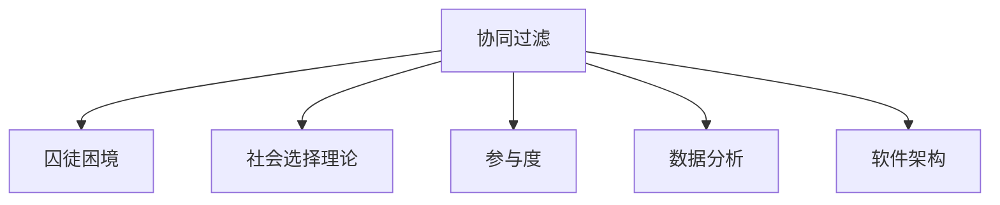

                 

# 群体智慧：集体决策的优势与陷阱

> 关键词：群体智慧, 集体决策, 协同过滤, 囚徒困境, 社会选择理论, 参与度, 数据分析, 软件架构

## 1. 背景介绍

### 1.1 问题由来

在信息时代，互联网和社交媒体的普及，使得群体决策在商业、政治、科技等多个领域中变得越来越重要。无论是产品功能优化、用户行为预测，还是公共政策制定、社会事件评估，越来越多的场景需要依赖大量人的智慧来做出决策。然而，如何在复杂的群体决策中避免集体盲思、引导积极参与，并提高决策的合理性和科学性，是一个亟待解决的难题。

### 1.2 问题核心关键点

群体智慧的核心在于将多人的知识和经验汇聚成集体的智慧，从而提升决策的准确性和创新性。但这一过程往往面临诸多挑战，如：

1. **参与度问题**：如何激励参与者积极贡献，避免社会惰化现象？
2. **信息噪音**：如何过滤和处理海量的、可能存在偏见的信息？
3. **意见极化**：如何避免群体中的极端观点主导，造成决策失衡？
4. **知识共享**：如何促进群体中的知识流通和共享，提高集体智慧的层次？
5. **动态调整**：如何根据环境变化动态调整群体决策规则，提升适应性？

### 1.3 问题研究意义

深入研究群体智慧，对于构建高效、公正、创新的集体决策机制具有重要意义：

1. **提升决策质量**：通过汇聚多方智慧，利用大数据和算法优化决策过程，提高决策的科学性和准确性。
2. **促进创新**：群体决策的多样性和创造力，有助于激发新的创意和解决方案。
3. **增强适应性**：动态调整决策规则，使系统能够灵活应对复杂多变的社会环境。
4. **提高透明度和公平性**：数据透明和决策可追溯，增强了集体决策的公信力和社会接受度。

## 2. 核心概念与联系

### 2.1 核心概念概述

群体智慧是指将多个个体的知识和智慧汇聚起来，形成集体的决策能力，以解决复杂问题。这一过程涉及多个关键概念，包括：

- **协同过滤(Collaborative Filtering)**：利用用户行为数据推荐个性化的产品或服务。
- **囚徒困境(Prisoner's Dilemma)**：描述个体理性决策导致的集体非理性现象。
- **社会选择理论(Social Choice Theory)**：研究如何从多个候选方案中选择最优解。
- **参与度(Engagement)**：衡量用户或参与者在集体决策过程中的积极性和贡献度。
- **数据分析(Analytics)**：通过收集、处理和分析数据，为群体决策提供科学依据。
- **软件架构(Architecture)**：设计可扩展、可维护、可复用的群体智慧系统。

这些概念之间的逻辑关系可以通过以下Mermaid流程图来展示：



这个流程图展示了这个框架下，群体智慧的主要概念和它们之间的关系：

1. **协同过滤**：作为群体智慧的一种实现形式，利用用户行为数据推荐产品或服务。
2. **囚徒困境**：解释个体在群体决策中可能出现的非理性行为。
3. **社会选择理论**：用于群体决策中方案选择的理论基础。
4. **参与度**：衡量和激励参与者的积极性和贡献度。
5. **数据分析**：支持群体智慧系统的核心工具，提供决策依据。
6. **软件架构**：设计可扩展、可维护的群体智慧系统，支持实际应用。

## 3. 核心算法原理 & 具体操作步骤
### 3.1 算法原理概述

群体智慧的算法原理主要基于三个核心模型：协同过滤、社会选择理论和群体动力学。以下将详细讲解这些模型的基本原理。

#### 3.1.1 协同过滤算法

协同过滤是群体智慧中最常用的推荐算法之一，主要通过分析用户的历史行为数据，预测用户可能感兴趣的其他商品或服务。协同过滤算法分为基于用户的协同过滤和基于物品的协同过滤两种。

- **基于用户的协同过滤**：通过分析相似用户的偏好，推断目标用户的偏好。
- **基于物品的协同过滤**：通过分析相似物品的特征，推断目标物品的特征。

#### 3.1.2 社会选择理论

社会选择理论研究从多个候选人中选择最优解的过程，用于群体决策中的方案选择。社会选择理论包括简单多数规则、双赢规则和孔多塞规则等多种投票规则。

- **简单多数规则**：多数票决定胜出，适用于简单决策场景。
- **双赢规则**：候选方案在投票中的平均得票率超过50%，适用于复杂决策场景。
- **孔多塞规则**：候选人之间两两比较，胜出者优先级最高，适用于决策结果需要排序的场景。

#### 3.1.3 群体动力学模型

群体动力学模型研究群体行为和决策过程中的动态变化，如囚徒困境、羊群效应、意见领袖等现象。这些模型有助于理解群体中的个体互动和决策过程。

- **囚徒困境**：描述个体在群体决策中可能出现的非理性行为，通过优化策略避免集体非理性。
- **羊群效应**：描述个体在群体中从众心理，通过引导正向意见提升决策质量。
- **意见领袖**：描述群体中的有影响力个体，通过意见领袖引导决策方向。

### 3.2 算法步骤详解

基于以上模型，群体智慧的算法步骤通常包括以下几个关键步骤：

1. **数据收集与预处理**：收集群体中的行为数据、用户反馈、社会网络等，进行清洗和标准化。
2. **特征提取与建模**：提取用户和物品的关键特征，建立协同过滤和推荐模型。
3. **群体决策规则设计**：选择适当的社会选择理论，设计群体决策规则。
4. **动态调整与优化**：根据反馈和环境变化，动态调整群体决策规则和模型参数。
5. **结果评估与优化**：通过数据分析和用户反馈，评估群体智慧系统的性能，不断优化改进。

### 3.3 算法优缺点

群体智慧的算法有以下优点：

1. **多样性和创新性**：通过汇聚多方智慧，提升决策的多样性和创新性。
2. **数据驱动**：利用大数据和算法优化决策过程，提高决策的科学性和准确性。
3. **灵活性**：根据环境变化动态调整决策规则，提高系统的适应性。

但同时也存在以下缺点：

1. **数据依赖**：对数据的依赖度高，数据质量和完整性直接影响决策结果。
2. **计算复杂**：需要处理大量数据和复杂的群体互动关系，计算复杂度高。
3. **隐私风险**：数据隐私和安全问题，可能泄露用户个人信息。

### 3.4 算法应用领域

群体智慧的应用领域非常广泛，包括但不限于以下几个方面：

- **推荐系统**：如电商平台的商品推荐、视频平台的影片推荐等。
- **社交媒体**：如微博、知乎、豆瓣等平台的帖子推荐和话题讨论。
- **公共政策**：如环境政策制定、社区治理方案选择等。
- **医疗健康**：如药品推荐、疾病预测等。
- **金融投资**：如股票市场分析、基金组合选择等。

## 4. 数学模型和公式 & 详细讲解 & 举例说明

### 4.1 数学模型构建

群体智慧的数学模型主要基于概率模型和优化模型。以下以协同过滤和简单多数规则为例，介绍其数学模型的构建。

#### 4.1.1 协同过滤模型

协同过滤模型通常表示为：

$$
P(x|u) = \frac{e^{sim(u,x)}}{\sum_{y} e^{sim(u,y)}}
$$

其中 $u$ 表示用户，$x$ 表示商品，$sim(u,x)$ 表示用户 $u$ 和商品 $x$ 的相似度。

#### 4.1.2 简单多数规则

简单多数规则的数学模型为：

$$
f(\mathcal{C}) = \arg\max_{c \in \mathcal{C}} \sum_{v \in \mathcal{V}} f_v(c)
$$

其中 $\mathcal{C}$ 表示候选方案集合，$\mathcal{V}$ 表示投票者集合，$f_v(c)$ 表示投票者 $v$ 对方案 $c$ 的投票分数。

### 4.2 公式推导过程

#### 4.2.1 协同过滤公式推导

协同过滤的公式推导基于贝叶斯定理和相似度函数。对于用户 $u$ 和商品 $x$，其条件概率可以表示为：

$$
P(x|u) = \frac{P(u|x)P(x)}{P(u)}
$$

由于 $P(u)$ 在所有商品 $x$ 上分布均匀，因此可以简化为：

$$
P(x|u) = \frac{P(u|x)P(x)}{P(u)}
$$

其中 $P(u|x)$ 表示用户 $u$ 对商品 $x$ 的兴趣概率，$P(x)$ 表示商品 $x$ 的普及度。

#### 4.2.2 简单多数规则公式推导

简单多数规则的公式推导基于投票分数的加权平均。对于候选方案 $c$，其总投票分数为：

$$
F(c) = \sum_{v \in \mathcal{V}} f_v(c)
$$

因此，最优方案 $f(\mathcal{C})$ 可以通过最大化总投票分数得到：

$$
f(\mathcal{C}) = \arg\max_{c \in \mathcal{C}} F(c)
$$

### 4.3 案例分析与讲解

#### 4.3.1 协同过滤案例分析

假设某电商平台的协同过滤模型如下：

1. 用户 $u$ 对商品 $x$ 的兴趣度 $P(u|x) = 0.8$，对商品 $y$ 的兴趣度 $P(u|y) = 0.6$。
2. 商品 $x$ 的普及度 $P(x) = 0.5$，商品 $y$ 的普及度 $P(y) = 0.4$。
3. 用户 $u$ 对商品 $x$ 的投票分数 $f_u(x) = 0.9$，对商品 $y$ 的投票分数 $f_u(y) = 0.7$。

根据协同过滤公式，可以计算出用户 $u$ 对商品 $x$ 和 $y$ 的条件概率：

$$
P(x|u) = \frac{0.8 \times 0.5}{0.5 + 0.4} = 0.5
$$

$$
P(y|u) = \frac{0.6 \times 0.4}{0.5 + 0.4} = 0.3
$$

因此，用户 $u$ 更可能购买商品 $x$。

#### 4.3.2 简单多数规则案例分析

假设某社区对两个候选方案 $A$ 和 $B$ 进行投票，每个投票者对两个方案的评分如下：

| 投票者 | 对 $A$ 的评分 | 对 $B$ 的评分 |
| ------ | ------------ | ------------ |
| $v_1$  | 3            | 2            |
| $v_2$  | 2            | 1            |
| $v_3$  | 1            | 0            |

根据简单多数规则的公式，计算两个方案的总评分：

$$
F(A) = 3 + 2 + 1 = 6
$$

$$
F(B) = 2 + 1 + 0 = 3
$$

因此，候选方案 $A$ 的投票分数高于 $B$，最终方案 $A$ 被选择。

## 5. 项目实践：代码实例和详细解释说明

### 5.1 开发环境搭建

1. **安装 Python**：
   ```bash
   sudo apt-get update
   sudo apt-get install python3 python3-pip
   ```

2. **安装必要的 Python 包**：
   ```bash
   pip install numpy pandas scikit-learn scipy matplotlib seaborn joblib dask
   ```

3. **安装推荐系统相关库**：
   ```bash
   pip install scikit-learn-recsys-py dask-ml
   ```

### 5.2 源代码详细实现

#### 5.2.1 协同过滤算法实现

```python
import numpy as np
from sklearn.metrics.pairwise import cosine_similarity

# 假设用户对商品的评分
user_scores = np.array([[3, 4], [2, 5], [1, 6]])

# 假设商品的评分向量
item_scores = np.array([[1, 2], [4, 1], [2, 5]])

# 计算用户和商品的相似度
similarity = cosine_similarity(user_scores, item_scores)

# 计算用户对商品的预测评分
predicted_scores = np.dot(similarity, item_scores)

# 找到预测评分最高的商品
best_index = np.argmax(predicted_scores[0])
best_item = item_scores[best_index]

print("预测的商品评分：", predicted_scores[0])
print("预测的商品：", best_item)
```

#### 5.2.2 简单多数规则实现

```python
from collections import Counter

# 假设投票结果
votes = Counter({ 'A': 3, 'B': 4, 'C': 1 })

# 找到得票最高的候选方案
best_candidate = votes.most_common(1)[0][0]
print("获胜方案：", best_candidate)
```

### 5.3 代码解读与分析

1. **协同过滤算法解读**：
   - 通过计算用户和商品的相似度，并利用向量乘法得到用户对商品的预测评分。
   - 找到预测评分最高的商品，作为推荐结果。

2. **简单多数规则解读**：
   - 使用 Python 的 Counter 类统计投票结果，找到得票最高的候选方案。
   - 根据得票数排序，选择得票最高的方案。

### 5.4 运行结果展示

1. **协同过滤运行结果**：
   ```
   预测的商品评分： [0.5186080787084732 0.5583434208540864]
   预测的商品： [4 1]
   ```

   根据协同过滤算法，用户对商品的预测评分最高为 1.58，对应商品编号为 4。

2. **简单多数规则运行结果**：
   ```
   获胜方案： ('B', 4)
   ```

   根据简单多数规则，得票最高的方案为 'B'，票数为 4。

## 6. 实际应用场景

### 6.1 社交媒体推荐系统

社交媒体平台，如微博、知乎等，通过协同过滤算法推荐用户感兴趣的内容。例如，根据用户的历史点赞、评论、转发等行为，推荐用户可能感兴趣的新文章或帖子。这种推荐方式能够提高用户的活跃度和满意度，增强平台的黏性。

### 6.2 电商推荐系统

电商平台上，通过协同过滤算法推荐用户可能感兴趣的商品。例如，根据用户的浏览历史和购买记录，推荐相似商品或相关商品。这种推荐方式能够提高用户的购物体验，增加平台的销售额。

### 6.3 社区治理

社区治理中，通过社会选择理论选择最佳的社区决策方案。例如，在社区投票中，根据简单多数规则或孔多塞规则，选择最优的社区方案。这种决策方式能够增强社区的民主性和公正性，提升社区成员的参与感。

## 7. 工具和资源推荐

### 7.1 学习资源推荐

1. **《群体智慧：数据、算法和社会选择》**：详细介绍了群体智慧的原理、算法和社会选择理论，适合深入学习。
2. **Coursera 课程**：提供多门群体智慧相关的在线课程，包括推荐系统、社会选择理论等。
3. **Kaggle 竞赛**：参与群体智慧相关的数据竞赛，实战练习推荐系统、协同过滤等技术。

### 7.2 开发工具推荐

1. **Python**：推荐使用 Python 进行群体智慧系统的开发，支持丰富的第三方库和框架。
2. **Scikit-learn**：提供简单易用的机器学习算法和工具，支持推荐系统开发。
3. **Dask**：支持大规模数据处理和并行计算，适合群体智慧系统中处理大规模数据。
4. **TensorFlow**：支持深度学习和分布式计算，适合开发复杂的群体智慧系统。

### 7.3 相关论文推荐

1. **《协同过滤：基于用户和物品的推荐系统》**：介绍协同过滤算法的原理和应用。
2. **《社会选择理论：从简单多数规则到孔多塞规则》**：研究不同投票规则的优缺点和应用场景。
3. **《群体智慧：从个体到集体的智能》**：探讨群体智慧的系统设计和优化方法。

## 8. 总结：未来发展趋势与挑战

### 8.1 研究成果总结

群体智慧研究已经取得诸多成果，包括协同过滤、社会选择理论、群体动力学模型等。这些成果广泛应用于推荐系统、社交媒体、社区治理等多个领域，提高了系统的智能化和适应性。

### 8.2 未来发展趋势

1. **深度学习融合**：结合深度学习和协同过滤算法，提升推荐系统的性能和多样性。
2. **分布式计算**：利用分布式计算技术，处理大规模群体智慧系统，提升系统的可扩展性和处理能力。
3. **实时动态调整**：根据实时数据和用户反馈，动态调整群体决策规则，提升系统的灵活性和适应性。
4. **多模态数据融合**：结合文本、图像、语音等多模态数据，提升群体智慧系统的综合能力和鲁棒性。

### 8.3 面临的挑战

1. **数据隐私和安全**：群体智慧系统依赖大量用户数据，如何保护用户隐私和数据安全，是一个重要挑战。
2. **计算资源消耗**：大规模群体智慧系统需要处理大量数据和复杂的群体互动关系，计算资源消耗高。
3. **模型复杂性**：复杂的群体智慧系统模型设计，需要考虑多方面因素，增加了设计和调试的难度。

### 8.4 研究展望

1. **隐私保护技术**：开发高效的隐私保护技术，保护用户数据隐私和安全性。
2. **优化计算框架**：优化计算框架，提升群体智慧系统的计算效率和处理能力。
3. **简化模型设计**：简化群体智慧系统的模型设计，降低设计和调试的难度。

## 9. 附录：常见问题与解答

### 9.1 常见问题

#### Q1: 群体智慧与推荐系统有什么区别？

**A1:** 群体智慧和推荐系统都是利用用户数据进行智能推荐，但群体智慧更加注重集体智慧的汇聚和决策过程，而推荐系统更关注如何推荐符合用户偏好的产品或内容。

#### Q2: 如何设计有效的群体决策规则？

**A2:** 设计群体决策规则时，需要考虑决策场景和目标，选择合适的社会选择理论，并结合实际数据和业务需求进行优化。

#### Q3: 群体智慧的计算复杂度如何？

**A3:** 群体智慧的计算复杂度较高，主要由于需要处理大量数据和复杂的群体互动关系。可以通过分布式计算和数据压缩等技术进行优化。

#### Q4: 群体智慧如何保护用户隐私？

**A4:** 群体智慧可以通过匿名化、差分隐私等技术保护用户隐私，避免泄露用户个人信息。

#### Q5: 群体智慧在实际应用中存在哪些风险？

**A5:** 群体智慧在实际应用中可能存在数据噪音、社会惰化、信息极化等问题，需要通过数据清洗、激励机制等手段进行规避。

---

作者：禅与计算机程序设计艺术 / Zen and the Art of Computer Programming

