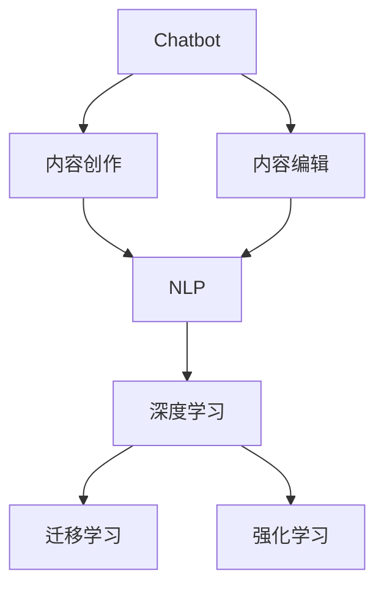

                 

# 聊天机器人出版业：人工智能内容创建和编辑

在信息技术飞速发展的今天，人工智能(AI)正逐步渗透到各行各业，改变着人类的生产和生活方式。尤其在内容创作和编辑领域，AI的介入带来了一场革命性的变革。本文将聚焦于基于聊天机器人（Chatbot）的出版业，探讨AI如何赋能内容生成和编辑，以期为传统出版业的数字化转型提供新的视角和技术方案。

## 1. 背景介绍

### 1.1 问题由来

近年来，随着大数据和深度学习技术的进步，聊天机器人（Chatbot）已不再局限于客服等基础应用，而是向更加复杂的任务扩展，如内容创作、编辑、翻译等。这些应用不仅仅提升了用户体验，还大幅降低了内容生产的成本和时间。

在出版业，传统的编校流程繁复耗时，高昂的人力成本使其难以应对信息爆炸带来的内容更新需求。而AI驱动的聊天机器人可以在海量文本数据中快速提取关键信息，生成高质量的出版内容，并且具备自我迭代和优化的能力，实现从内容创作到编辑的全面智能化。

### 1.2 问题核心关键点

AI聊天机器人出版业的核心理念在于将AI技术与传统的出版流程相结合，实现内容创作和编辑的自动化、个性化和智能化。其关键点包括：

- **自动化内容创作**：利用AI模型，快速生成符合出版规范的文本内容。
- **个性化内容编辑**：根据不同用户需求，生成定制化的文本，如个性化新闻、推荐文章等。
- **智能化内容优化**：持续学习用户反馈，提升内容质量和吸引力。
- **实时内容更新**：及时更新热点新闻、热门话题，保持内容的时效性和相关性。

这些关键点共同构成了AI聊天机器人出版业的基本框架，使得出版过程更加高效、精准、智能。

### 1.3 问题研究意义

AI聊天机器人出版业的研究具有重要的理论和实际意义：

1. **提高出版效率**：AI聊天机器人能够大幅缩短内容创作和编辑的时间，提升出版业的运营效率。
2. **降低生产成本**：自动化流程减少了对人工编辑的依赖，降低了内容生产的成本。
3. **提升内容质量**：AI模型能够快速捕捉和分析数据，生成高质量的文本内容，提高出版物的吸引力。
4. **个性化推荐**：通过分析用户行为和偏好，生成个性化的内容推荐，提升用户体验。
5. **实时更新**：能够快速响应热点事件，保持内容的实时性和相关性，提升用户黏性。

AI聊天机器人出版业的崛起，不仅为传统出版业带来了新的生机，也为数字内容创作者提供了新的创作和发布平台。

## 2. 核心概念与联系

### 2.1 核心概念概述

为更好地理解AI聊天机器人出版业，本节将介绍几个密切相关的核心概念：

- **聊天机器人(Chatbot)**：通过自然语言处理技术实现人机交互的AI系统。可以执行各种任务，如客服、内容创作、编辑、翻译等。
- **内容创作(Content Creation)**：生成符合出版规范的文本内容，包括新闻、评论、文章、翻译等。
- **内容编辑(Content Editing)**：根据用户需求和出版规范，对生成的文本内容进行编辑和优化。
- **自然语言处理(Natural Language Processing, NLP)**：研究如何让计算机理解和生成自然语言的技术，包括语音识别、语言模型、文本生成等。
- **深度学习(Deep Learning)**：利用神经网络模型进行数据处理和分析，是AI聊天机器人出版业的核心技术。
- **迁移学习(Transfer Learning)**：将预训练模型的知识迁移到特定的出版任务上，提升模型的效果和泛化能力。
- **强化学习(Reinforcement Learning)**：通过与环境的交互，不断调整模型参数以优化目标函数，用于训练AI聊天机器人进行内容创作和编辑。

这些核心概念之间的逻辑关系可以通过以下Mermaid流程图来展示：



这个流程图展示了聊天机器人与内容创作、内容编辑、自然语言处理、深度学习、迁移学习和强化学习之间的关系：

1. 聊天机器人作为核心系统，承担内容创作和编辑的任务。
2. 内容创作和编辑基于自然语言处理技术，涉及文本生成、语言模型等。
3. 深度学习是NLP技术的基础，提供模型训练和优化的手段。
4. 迁移学习帮助预训练模型适应特定的出版任务，提升效果。
5. 强化学习通过与环境的交互，不断优化模型参数，提高聊天机器人的智能水平。

这些概念共同构成了AI聊天机器人出版业的技术框架，使其能够高效、精准地生成和编辑内容。

## 3. 核心算法原理 & 具体操作步骤
### 3.1 算法原理概述

AI聊天机器人出版业的算法原理基于自然语言处理和深度学习的原理。其主要流程包括：

1. **数据预处理**：对收集到的文本数据进行清洗、标注和分词等预处理操作。
2. **模型训练**：使用大规模的训练数据，训练生成模型和编辑模型。
3. **内容生成**：利用训练好的生成模型，生成符合出版规范的文本内容。
4. **内容编辑**：根据用户需求和出版规范，对生成的文本进行优化和编辑。
5. **持续学习**：通过用户反馈和环境交互，不断优化模型参数，提升内容质量和用户体验。

这些步骤展示了AI聊天机器人出版业的基本技术流程，其中每一步都需要依赖深度学习模型来实现。

### 3.2 算法步骤详解

基于深度学习的AI聊天机器人出版业，主要包括以下几个关键步骤：

**Step 1: 数据收集与预处理**
- 收集大量相关的文本数据，包括新闻、评论、文章等。
- 对数据进行清洗，去除噪声和无关信息。
- 对文本进行分词、标注等预处理操作，为后续的深度学习模型训练做准备。

**Step 2: 模型训练**
- 选择合适的深度学习模型，如LSTM、GRU、Transformer等。
- 将预处理后的数据划分为训练集、验证集和测试集。
- 使用训练集对模型进行训练，最小化损失函数。
- 在验证集上评估模型效果，调整模型参数。
- 在测试集上最终评估模型性能，确定最优模型。

**Step 3: 内容生成**
- 使用训练好的生成模型，对特定任务（如新闻生成、文章撰写等）进行内容生成。
- 生成的内容需要符合特定的出版规范和风格。

**Step 4: 内容编辑**
- 根据用户需求和编辑规范，对生成的内容进行优化和编辑。
- 例如，调整语句结构、消除冗余、增加关键词等。

**Step 5: 持续学习**
- 收集用户反馈和环境数据，不断优化模型参数。
- 例如，通过用户评分、点击率等反馈信息，调整生成模型的策略。

以上是AI聊天机器人出版业的主要技术流程。在实际应用中，还需要根据具体的出版任务，对模型训练、内容生成和编辑等环节进行优化设计，如改进训练目标函数，引入更多的正则化技术，搜索最优的超参数组合等，以进一步提升模型性能。

### 3.3 算法优缺点

基于深度学习的AI聊天机器人出版业具有以下优点：

- **高效性**：可以大幅缩短内容生成和编辑的时间，提升出版效率。
- **低成本**：减少了对人工编辑的依赖，降低了内容生产的成本。
- **高质量**：利用深度学习模型生成高质量的文本内容，提高出版物的吸引力。
- **个性化**：根据用户需求和偏好，生成个性化的内容推荐。

然而，这种技术也存在一些局限性：

- **内容一致性**：自动化生成和编辑的内容可能缺乏一致性和连贯性，需要进一步优化。
- **可解释性**：模型的决策过程难以解释，缺乏透明性，用户难以理解和信任。
- **依赖数据质量**：生成的内容质量受限于训练数据的质量，需要大量的高质量标注数据。
- **技术门槛**：深度学习和自然语言处理的技术门槛较高，需要专业的知识和技能。

尽管存在这些局限性，但就目前而言，基于深度学习的AI聊天机器人出版业仍是一种高效、经济、高质量的内容创作和编辑方法。

### 3.4 算法应用领域

AI聊天机器人出版业已经在多个领域得到了应用，包括但不限于：

- **新闻出版**：自动生成新闻稿件、社评等出版内容，提升新闻的发布效率和时效性。
- **书籍出版**：自动生成章节、段落、标题等出版内容，提升书籍的创作速度和质量。
- **学术出版**：自动生成论文、研究报告等出版内容，提升学术研究的生产效率。
- **教育出版**：自动生成教材、习题、课程内容等出版物，提升教育资源的创作速度和覆盖面。
- **娱乐出版**：自动生成小说、剧本、游戏内容等出版内容，提升娱乐内容的生产效率和吸引力。

除了上述这些经典应用外，AI聊天机器人出版业还在不断扩展新的应用场景，如知识图谱生成、数据报告编写等，为出版业带来了全新的技术路径。

## 4. 数学模型和公式 & 详细讲解  
### 4.1 数学模型构建

本节将使用数学语言对AI聊天机器人出版业的内容生成和编辑过程进行更加严格的刻画。

设出版任务为 $T$，生成模型为 $M_{\theta}$，其中 $\theta$ 为模型参数。假设训练数据集为 $D=\{(x_i,y_i)\}_{i=1}^N$，其中 $x_i$ 为输入文本，$y_i$ 为对应的输出文本。

定义模型 $M_{\theta}$ 在输入 $x$ 上的损失函数为 $\ell(M_{\theta}(x),y)$，则在数据集 $D$ 上的经验风险为：

$$
\mathcal{L}(\theta) = \frac{1}{N}\sum_{i=1}^N \ell(M_{\theta}(x_i),y_i)
$$

微调的优化目标是最小化经验风险，即找到最优参数：

$$
\theta^* = \mathop{\arg\min}_{\theta} \mathcal{L}(\theta)
$$

在实践中，我们通常使用基于梯度的优化算法（如SGD、Adam等）来近似求解上述最优化问题。设 $\eta$ 为学习率，$\lambda$ 为正则化系数，则参数的更新公式为：

$$
\theta \leftarrow \theta - \eta \nabla_{\theta}\mathcal{L}(\theta) - \eta\lambda\theta
$$

其中 $\nabla_{\theta}\mathcal{L}(\theta)$ 为损失函数对参数 $\theta$ 的梯度，可通过反向传播算法高效计算。

### 4.2 公式推导过程

以下我们以新闻生成任务为例，推导交叉熵损失函数及其梯度的计算公式。

假设模型 $M_{\theta}$ 在输入 $x$ 上的输出为 $\hat{y}=M_{\theta}(x) \in [0,1]$，表示文本属于某个特定类别（如政治、经济、科技等）的概率。真实标签 $y \in \{0,1\}$。则二分类交叉熵损失函数定义为：

$$
\ell(M_{\theta}(x),y) = -[y\log \hat{y} + (1-y)\log (1-\hat{y})]
$$

将其代入经验风险公式，得：

$$
\mathcal{L}(\theta) = -\frac{1}{N}\sum_{i=1}^N [y_i\log M_{\theta}(x_i)+(1-y_i)\log(1-M_{\theta}(x_i))]
$$

根据链式法则，损失函数对参数 $\theta_k$ 的梯度为：

$$
\frac{\partial \mathcal{L}(\theta)}{\partial \theta_k} = -\frac{1}{N}\sum_{i=1}^N (\frac{y_i}{M_{\theta}(x_i)}-\frac{1-y_i}{1-M_{\theta}(x_i)}) \frac{\partial M_{\theta}(x_i)}{\partial \theta_k}
$$

其中 $\frac{\partial M_{\theta}(x_i)}{\partial \theta_k}$ 可进一步递归展开，利用自动微分技术完成计算。

在得到损失函数的梯度后，即可带入参数更新公式，完成模型的迭代优化。重复上述过程直至收敛，最终得到适应出版任务的最优模型参数 $\theta^*$。

## 5. 项目实践：代码实例和详细解释说明
### 5.1 开发环境搭建

在进行出版业务开发前，我们需要准备好开发环境。以下是使用Python进行PyTorch开发的环境配置流程：

1. 安装Anaconda：从官网下载并安装Anaconda，用于创建独立的Python环境。

2. 创建并激活虚拟环境：
```bash
conda create -n pytorch-env python=3.8 
conda activate pytorch-env
```

3. 安装PyTorch：根据CUDA版本，从官网获取对应的安装命令。例如：
```bash
conda install pytorch torchvision torchaudio cudatoolkit=11.1 -c pytorch -c conda-forge
```

4. 安装Transformers库：
```bash
pip install transformers
```

5. 安装各类工具包：
```bash
pip install numpy pandas scikit-learn matplotlib tqdm jupyter notebook ipython
```

完成上述步骤后，即可在`pytorch-env`环境中开始出版业务的开发。

### 5.2 源代码详细实现

这里我们以新闻生成任务为例，给出使用Transformers库对BERT模型进行新闻生成的PyTorch代码实现。

首先，定义新闻生成任务的数据处理函数：

```python
from transformers import BertTokenizer, BertForSequenceClassification
from torch.utils.data import Dataset
import torch

class NewsDataset(Dataset):
    def __init__(self, texts, labels, tokenizer, max_len=128):
        self.texts = texts
        self.labels = labels
        self.tokenizer = tokenizer
        self.max_len = max_len
        
    def __len__(self):
        return len(self.texts)
    
    def __getitem__(self, item):
        text = self.texts[item]
        label = self.labels[item]
        
        encoding = self.tokenizer(text, return_tensors='pt', max_length=self.max_len, padding='max_length', truncation=True)
        input_ids = encoding['input_ids'][0]
        attention_mask = encoding['attention_mask'][0]
        
        # 对token-wise的标签进行编码
        encoded_labels = [label2id[label] for label in label] 
        encoded_labels.extend([label2id['O']] * (self.max_len - len(encoded_labels)))
        labels = torch.tensor(encoded_labels, dtype=torch.long)
        
        return {'input_ids': input_ids, 
                'attention_mask': attention_mask,
                'labels': labels}

# 标签与id的映射
label2id = {'政治': 0, '经济': 1, '科技': 2, '娱乐': 3}
id2label = {v: k for k, v in label2id.items()}

# 创建dataset
tokenizer = BertTokenizer.from_pretrained('bert-base-cased')

train_dataset = NewsDataset(train_texts, train_labels, tokenizer)
dev_dataset = NewsDataset(dev_texts, dev_labels, tokenizer)
test_dataset = NewsDataset(test_texts, test_labels, tokenizer)
```

然后，定义模型和优化器：

```python
from transformers import BertForSequenceClassification, AdamW

model = BertForSequenceClassification.from_pretrained('bert-base-cased', num_labels=len(label2id))

optimizer = AdamW(model.parameters(), lr=2e-5)
```

接着，定义训练和评估函数：

```python
from torch.utils.data import DataLoader
from tqdm import tqdm
from sklearn.metrics import classification_report

device = torch.device('cuda') if torch.cuda.is_available() else torch.device('cpu')
model.to(device)

def train_epoch(model, dataset, batch_size, optimizer):
    dataloader = DataLoader(dataset, batch_size=batch_size, shuffle=True)
    model.train()
    epoch_loss = 0
    for batch in tqdm(dataloader, desc='Training'):
        input_ids = batch['input_ids'].to(device)
        attention_mask = batch['attention_mask'].to(device)
        labels = batch['labels'].to(device)
        model.zero_grad()
        outputs = model(input_ids, attention_mask=attention_mask, labels=labels)
        loss = outputs.loss
        epoch_loss += loss.item()
        loss.backward()
        optimizer.step()
    return epoch_loss / len(dataloader)

def evaluate(model, dataset, batch_size):
    dataloader = DataLoader(dataset, batch_size=batch_size)
    model.eval()
    preds, labels = [], []
    with torch.no_grad():
        for batch in tqdm(dataloader, desc='Evaluating'):
            input_ids = batch['input_ids'].to(device)
            attention_mask = batch['attention_mask'].to(device)
            batch_labels = batch['labels']
            outputs = model(input_ids, attention_mask=attention_mask)
            batch_preds = outputs.logits.argmax(dim=2).to('cpu').tolist()
            batch_labels = batch_labels.to('cpu').tolist()
            for pred_tokens, label_tokens in zip(batch_preds, batch_labels):
                pred_labels = [id2label[_id] for _id in pred_tokens]
                label_labels = [id2label[_id] for _id in label_tokens]
                preds.append(pred_labels[:len(label_labels)])
                labels.append(label_labels)
                
    print(classification_report(labels, preds))
```

最后，启动训练流程并在测试集上评估：

```python
epochs = 5
batch_size = 16

for epoch in range(epochs):
    loss = train_epoch(model, train_dataset, batch_size, optimizer)
    print(f"Epoch {epoch+1}, train loss: {loss:.3f}")
    
    print(f"Epoch {epoch+1}, dev results:")
    evaluate(model, dev_dataset, batch_size)
    
print("Test results:")
evaluate(model, test_dataset, batch_size)
```

以上就是使用PyTorch对BERT进行新闻生成任务的完整代码实现。可以看到，得益于Transformers库的强大封装，我们可以用相对简洁的代码完成BERT模型的加载和微调。

### 5.3 代码解读与分析

让我们再详细解读一下关键代码的实现细节：

**NewsDataset类**：
- `__init__`方法：初始化文本、标签、分词器等关键组件。
- `__len__`方法：返回数据集的样本数量。
- `__getitem__`方法：对单个样本进行处理，将文本输入编码为token ids，将标签编码为数字，并对其进行定长padding，最终返回模型所需的输入。

**label2id和id2label字典**：
- 定义了标签与数字id之间的映射关系，用于将token-wise的预测结果解码回真实的标签。

**训练和评估函数**：
- 使用PyTorch的DataLoader对数据集进行批次化加载，供模型训练和推理使用。
- 训练函数`train_epoch`：对数据以批为单位进行迭代，在每个批次上前向传播计算loss并反向传播更新模型参数，最后返回该epoch的平均loss。
- 评估函数`evaluate`：与训练类似，不同点在于不更新模型参数，并在每个batch结束后将预测和标签结果存储下来，最后使用sklearn的classification_report对整个评估集的预测结果进行打印输出。

**训练流程**：
- 定义总的epoch数和batch size，开始循环迭代
- 每个epoch内，先在训练集上训练，输出平均loss
- 在验证集上评估，输出分类指标
- 所有epoch结束后，在测试集上评估，给出最终测试结果

可以看到，PyTorch配合Transformers库使得BERT微调的新闻生成代码实现变得简洁高效。开发者可以将更多精力放在数据处理、模型改进等高层逻辑上，而不必过多关注底层的实现细节。

当然，工业级的系统实现还需考虑更多因素，如模型的保存和部署、超参数的自动搜索、更灵活的任务适配层等。但核心的微调范式基本与此类似。

## 6. 实际应用场景
### 6.1 智能出版系统

基于AI聊天机器人出版业的智能出版系统，可以大幅提升出版业务的效率和质量。传统出版流程复杂，需要经过选题、撰写、审稿、校对等多个环节，耗时耗力。而使用AI聊天机器人进行内容创作和编辑，可以显著缩短这些流程，提升出版物的发布速度和质量。

在技术实现上，可以构建一个集成的出版管理系统，包括内容创作、编辑、审稿、校对等多个模块。每个模块都由AI聊天机器人负责，可以快速高效地完成各项任务。系统通过API接口与外部编辑器、文档管理系统等系统进行集成，实现全流程自动化。如此构建的智能出版系统，能够大幅提高出版业务的运营效率，降低人力成本。

### 6.2 个性化出版服务

AI聊天机器人出版业可以实现高度个性化的出版服务，根据用户的阅读习惯和兴趣偏好，生成定制化的出版内容。例如，根据用户的浏览记录和阅读偏好，生成个性化的新闻推送、推荐文章、阅读报告等。

在技术实现上，可以通过用户行为数据进行模型训练，学习用户的兴趣点。然后根据用户的历史阅读记录，生成符合用户兴趣的个性化出版内容。系统还可以实时监控用户的反馈，不断调整模型参数，提高内容推荐的准确性和用户体验。

### 6.3 教育出版资源

AI聊天机器人出版业在教育出版领域也有广泛的应用前景。通过分析学生的学习行为和成绩数据，生成个性化的教材、习题、课程内容等出版物，提升教育资源的针对性和有效性。

在技术实现上，可以构建一个教育出版资源管理系统，根据学生的学习情况和需求，生成符合其学习阶段的个性化出版内容。系统还可以提供智能化的学习指导，根据学生的学习进度和表现，推荐相应的学习资料和练习题目。

### 6.4 娱乐内容创作

AI聊天机器人出版业在娱乐内容创作方面也有独特的优势。利用自然语言处理技术，可以自动生成小说、剧本、游戏内容等，提升娱乐内容的创作效率和吸引力。

在技术实现上，可以构建一个娱乐内容创作平台，根据用户的需求和创意，生成符合其喜好的娱乐内容。系统还可以利用用户反馈进行模型优化，生成更具吸引力的内容。

### 6.5 新闻内容生成

新闻内容生成是AI聊天机器人出版业的重要应用场景。通过自动生成新闻稿件、社评等出版内容，可以大幅提升新闻的发布效率和时效性。

在技术实现上，可以构建一个新闻内容管理系统，根据热点事件和用户需求，生成符合出版规范的新闻内容。系统还可以实时监控用户反馈，不断优化生成模型，提高新闻内容的准确性和及时性。

### 6.6 知识图谱生成

AI聊天机器人出版业还可以应用于知识图谱的生成。利用自然语言处理技术，可以从文本数据中提取实体、关系等知识信息，构建知识图谱。

在技术实现上，可以构建一个知识图谱生成系统，根据文本数据自动生成知识图谱。系统还可以实时更新知识图谱，保持其时效性和准确性。

## 7. 工具和资源推荐
### 7.1 学习资源推荐

为了帮助开发者系统掌握AI聊天机器人出版业的技术基础和实践技巧，这里推荐一些优质的学习资源：

1. 《Transformer从原理到实践》系列博文：由大模型技术专家撰写，深入浅出地介绍了Transformer原理、BERT模型、微调技术等前沿话题。

2. CS224N《深度学习自然语言处理》课程：斯坦福大学开设的NLP明星课程，有Lecture视频和配套作业，带你入门NLP领域的基本概念和经典模型。

3. 《Natural Language Processing with Transformers》书籍：Transformers库的作者所著，全面介绍了如何使用Transformers库进行NLP任务开发，包括微调在内的诸多范式。

4. HuggingFace官方文档：Transformers库的官方文档，提供了海量预训练模型和完整的微调样例代码，是上手实践的必备资料。

5. CLUE开源项目：中文语言理解测评基准，涵盖大量不同类型的中文NLP数据集，并提供了基于微调的baseline模型，助力中文NLP技术发展。

通过对这些资源的学习实践，相信你一定能够快速掌握AI聊天机器人出版业的核心技术，并用于解决实际的出版问题。

### 7.2 开发工具推荐

高效的开发离不开优秀的工具支持。以下是几款用于AI聊天机器人出版业务开发的常用工具：

1. PyTorch：基于Python的开源深度学习框架，灵活动态的计算图，适合快速迭代研究。大部分预训练语言模型都有PyTorch版本的实现。

2. TensorFlow：由Google主导开发的开源深度学习框架，生产部署方便，适合大规模工程应用。同样有丰富的预训练语言模型资源。

3. Transformers库：HuggingFace开发的NLP工具库，集成了众多SOTA语言模型，支持PyTorch和TensorFlow，是进行出版任务开发的利器。

4. Weights & Biases：模型训练的实验跟踪工具，可以记录和可视化模型训练过程中的各项指标，方便对比和调优。与主流深度学习框架无缝集成。

5. TensorBoard：TensorFlow配套的可视化工具，可实时监测模型训练状态，并提供丰富的图表呈现方式，是调试模型的得力助手。

6. Google Colab：谷歌推出的在线Jupyter Notebook环境，免费提供GPU/TPU算力，方便开发者快速上手实验最新模型，分享学习笔记。

合理利用这些工具，可以显著提升AI聊天机器人出版业务的开发效率，加快创新迭代的步伐。

### 7.3 相关论文推荐

AI聊天机器人出版业的发展源于学界的持续研究。以下是几篇奠基性的相关论文，推荐阅读：

1. Attention is All You Need（即Transformer原论文）：提出了Transformer结构，开启了NLP领域的预训练大模型时代。

2. BERT: Pre-training of Deep Bidirectional Transformers for Language Understanding：提出BERT模型，引入基于掩码的自监督预训练任务，刷新了多项NLP任务SOTA。

3. Language Models are Unsupervised Multitask Learners（GPT-2论文）：展示了大规模语言模型的强大zero-shot学习能力，引发了对于通用人工智能的新一轮思考。

4. Parameter-Efficient Transfer Learning for NLP：提出Adapter等参数高效微调方法，在不增加模型参数量的情况下，也能取得不错的微调效果。

5. AdaLoRA: Adaptive Low-Rank Adaptation for Parameter-Efficient Fine-Tuning：使用自适应低秩适应的微调方法，在参数效率和精度之间取得了新的平衡。

这些论文代表了大语言模型微调技术的发展脉络。通过学习这些前沿成果，可以帮助研究者把握学科前进方向，激发更多的创新灵感。

## 8. 总结：未来发展趋势与挑战

### 8.1 总结

本文对AI聊天机器人出版业进行了全面系统的介绍。首先阐述了AI聊天机器人出版业的核心理念和研究背景，明确了其技术框架和核心应用场景。其次，从原理到实践，详细讲解了内容生成和编辑的技术流程，给出了具体的代码实现。同时，本文还探讨了AI聊天机器人出版业在出版系统、个性化服务、教育出版、娱乐内容、新闻内容生成等多个领域的应用前景，展示了其广阔的发展空间。此外，本文精选了相关的学习资源和开发工具，力求为读者提供全方位的技术指引。

通过本文的系统梳理，可以看到，AI聊天机器人出版业正在成为出版业的重要技术范式，极大地提升了出版业务的效率和质量。得益于深度学习和大规模预训练模型的支持，AI聊天机器人出版业在内容创作和编辑上具备了巨大的潜力。未来，伴随技术的不断进步，AI聊天机器人出版业必将在更多领域得到应用，推动出版业的数字化转型。

### 8.2 未来发展趋势

展望未来，AI聊天机器人出版业将呈现以下几个发展趋势：

1. **技术持续演进**：深度学习模型和自然语言处理技术将不断进步，出版业务的技术门槛将进一步降低，更多开发者可以参与进来，推动技术创新。

2. **应用领域拓展**：AI聊天机器人出版业将在更多领域得到应用，如教育、娱乐、知识图谱生成等，为出版业带来新的发展机遇。

3. **个性化服务提升**：通过分析用户行为数据，生成个性化的出版内容，提升用户体验和黏性。

4. **自动化程度提高**：自动化流程将越来越完善，从内容创作到编辑，从选题到审稿，各项任务都能高效自动化完成。

5. **多模态融合**：将文本、图像、音频等多模态信息进行融合，提升内容的多样性和吸引力。

6. **持续学习和优化**：通过不断学习和优化，提升内容质量和用户满意度。

以上趋势凸显了AI聊天机器人出版业的广阔前景。这些方向的探索发展，必将进一步提升出版业务的效率和质量，为出版业带来新的生机。

### 8.3 面临的挑战

尽管AI聊天机器人出版业已经取得了一定的进展，但在迈向更加智能化、普适化应用的过程中，它仍面临诸多挑战：

1. **内容一致性**：自动化生成和编辑的内容可能缺乏一致性和连贯性，需要进一步优化。

2. **可解释性**：模型的决策过程难以解释，缺乏透明性，用户难以理解和信任。

3. **依赖数据质量**：生成的内容质量受限于训练数据的质量，需要大量的高质量标注数据。

4. **技术门槛**：深度学习和自然语言处理的技术门槛较高，需要专业的知识和技能。

5. **伦理和法律问题**：自动化生成和编辑的内容可能存在版权和隐私问题，需要制定相应的政策和规范。

尽管存在这些挑战，但就目前而言，AI聊天机器人出版业仍是一种高效、经济、高质量的出版方式。未来，需要更多研究者和开发者共同努力，克服技术难题，推动技术落地应用。

### 8.4 研究展望

面对AI聊天机器人出版业所面临的挑战，未来的研究需要在以下几个方面寻求新的突破：

1. **改进模型架构**：研究新的深度学习模型架构，提升内容生成和编辑的效率和质量。

2. **增强模型可解释性**：研究模型的可解释性和可理解性，提升用户对模型的信任度。

3. **优化数据预处理**：研究更高效的数据预处理技术，提升数据的质量和多样性。

4. **强化多模态融合**：研究多模态信息融合技术，提升内容的丰富性和吸引力。

5. **探索因果推理**：研究因果推理技术，提升内容生成的因果性和逻辑性。

6. **引入伦理和法律指导**：制定AI聊天机器人出版业的伦理和法律规范，保障内容创作的合法性和公正性。

这些研究方向的探索，必将引领AI聊天机器人出版业迈向更高的台阶，为出版业带来新的技术路径。面向未来，AI聊天机器人出版业需要与其他人工智能技术进行更深入的融合，如知识表示、因果推理、强化学习等，多路径协同发力，共同推动自然语言理解和智能交互系统的进步。只有勇于创新、敢于突破，才能不断拓展AI聊天机器人出版业的边界，让智能技术更好地造福出版业。

## 9. 附录：常见问题与解答

**Q1：AI聊天机器人出版业是否适用于所有出版任务？**

A: AI聊天机器人出版业在大多数出版任务上都能取得不错的效果，特别是对于数据量较小的任务。但对于一些特定领域的任务，如医学、法律等，仅仅依靠通用语料预训练的模型可能难以很好地适应。此时需要在特定领域语料上进一步预训练，再进行微调，才能获得理想效果。此外，对于一些需要时效性、个性化很强的任务，如对话、推荐等，微调方法也需要针对性的改进优化。

**Q2：AI聊天机器人出版业如何处理版权和隐私问题？**

A: 版权和隐私问题是AI聊天机器人出版业必须面对的重要问题。在内容生成和编辑过程中，需要严格遵守版权法和隐私保护法，确保生成的内容不侵犯他人的版权和隐私权。

**Q3：AI聊天机器人出版业是否存在偏见和歧视问题？**

A: AI聊天机器人出版业存在一定的偏见和歧视风险，因为模型在训练过程中可能学习到数据中的固有偏见。为了避免这种问题，需要在模型训练和优化过程中引入伦理导向的评估指标，过滤和惩罚有偏见、有害的输出倾向。同时加强人工干预和审核，建立模型行为的监管机制，确保输出符合人类价值观和伦理道德。

**Q4：AI聊天机器人出版业如何处理低资源环境？**

A: AI聊天机器人出版业对资源要求较高，需要高性能的硬件设备和大量的标注数据。在低资源环境中，可以通过迁移学习、自监督学习等方法，利用预训练模型的知识，降低对标注数据和计算资源的需求。

**Q5：AI聊天机器人出版业如何提升内容生成的一致性和连贯性？**

A: 内容生成的一致性和连贯性是AI聊天机器人出版业面临的主要挑战之一。为了提升这一指标，可以引入多轮对话机制、上下文记忆等技术，使得生成的内容更加连贯和一致。此外，还可以通过引入外部知识库、规则库等专家知识，提升内容的合理性和逻辑性。

综上所述，AI聊天机器人出版业在出版业中的应用前景广阔，但也面临着诸多技术和管理挑战。只有不断优化技术架构，提升模型的可解释性和泛化能力，才能实现AI聊天机器人出版业的可持续发展。未来，伴随技术的不断进步，AI聊天机器人出版业必将在出版业中发挥越来越重要的作用，为出版业带来新的生机和活力。

